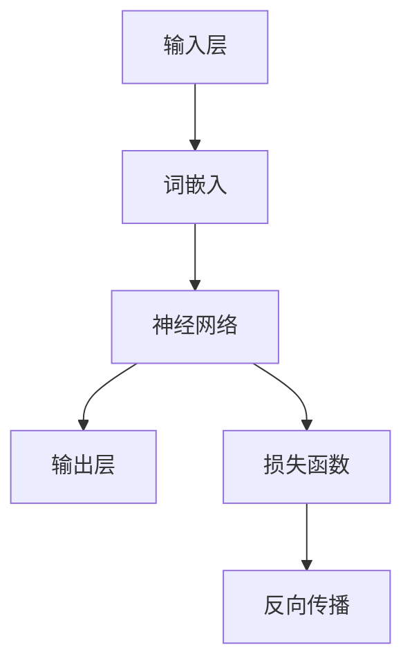

                 

### 摘要

《领域特定LLM评测：针对垂直领域的定制化方案》是一本旨在深入探讨领域特定语言模型（LLM）评测及其在垂直领域应用的技术书籍。本书的核心内容涵盖了从LLM的基本概念、架构和其在不同垂直领域的应用案例，到针对这些应用场景的定制化评测方案的设计与实现。本书首先介绍了LLM的基础知识，包括其概念、发展历程和核心结构，接着详细讨论了LLM在金融、医疗和教育等垂直领域的应用案例和评测方法。此外，本书还重点探讨了如何针对垂直领域设计定制化的LLM方案，涉及数据处理、模型定制和评测策略等多个方面。书中还包括了使用常见评测工具和技术的实践指南，以及未来发展趋势和面临的挑战。通过本书的阅读，读者能够全面了解领域特定LLM的评测方法和定制化方案，从而更好地应对实际应用中的技术难题。### 第一步：理解用户需求

为了撰写《领域特定LLM评测：针对垂直领域的定制化方案》这一技术书籍，首先需要深入理解用户的具体需求。用户希望这本书能够涵盖领域特定语言模型（LLM）评测的各个方面，尤其是针对不同垂直领域的定制化方案。以下是用户需求的具体分析：

1. **目标读者**：用户希望这本书能够吸引那些在计算机科学和人工智能领域工作的专业人士，尤其是对语言模型和垂直领域应用有浓厚兴趣的读者。目标读者包括但不限于数据科学家、AI研究人员、软件开发工程师、算法工程师以及相关领域的研究生和博士生。

2. **内容深度**：用户期望书籍内容具有深度和全面性，不仅介绍LLM的基础知识，还需要涵盖其在不同垂直领域的实际应用案例，以及如何设计和实现针对这些领域的定制化评测方案。

3. **实践性**：用户希望书中的内容能够具有实际应用价值，包括详细的算法讲解、数学模型和公式、代码实现和实际案例剖析等。用户期待通过阅读本书，能够理解并应用领域特定LLM的评测方法和定制化方案解决实际问题。

4. **结构布局**：用户要求书籍的目录结构清晰、逻辑性强，每个章节内容完整、具体详细。用户希望书籍能够通过分章节的方式，系统性地介绍LLM评测的相关知识，从基础理论到实际应用，再到定制化方案的设计与实现。

5. **技术层次**：用户希望书籍内容能够适合不同技术水平的读者，从入门到高级，均能从中获益。对于初学者，书中应包含基础概念和简明的示例；对于高级读者，则应提供深入的技术分析和算法实现细节。

6. **语言风格**：用户希望书籍的语言风格清晰、逻辑性强，能够以通俗易懂的方式解释复杂的技术概念，并使用专业的技术语言进行论述。

基于以上需求分析，本书的撰写将围绕以下几个核心目标展开：

- **系统化知识介绍**：确保读者能够从零开始，逐步掌握领域特定LLM的基础知识，包括其概念、发展历程和核心结构。
- **实际案例分析**：通过具体垂直领域的应用案例，展示LLM的实际效果和评测方法，帮助读者理解其在不同场景中的应用。
- **定制化方案设计**：详细介绍如何根据不同垂直领域的需求，设计和实现定制化的LLM评测方案。
- **实践指南**：提供详细的算法实现、代码示例和实际案例，帮助读者将理论知识应用于实际项目中。

通过上述目标的实现，本书旨在为读者提供一本全面、深入且具有实际应用价值的领域特定LLM评测技术指南。### 第2章 领域特定LLM概述

### 2.1 语言模型基础

#### 2.1.1 语言模型的概念

语言模型是自然语言处理（NLP）领域中的一个核心概念，它旨在理解和生成自然语言。一个语言模型可以被看作是一个概率分布，用于预测下一个单词或词组，其目的是通过学习大量的文本数据，来捕捉语言中的统计规律。语言模型的主要任务包括文本分类、机器翻译、文本摘要和语音识别等。

#### 2.1.2 语言模型的发展历程

语言模型的发展经历了从基于规则的方法到统计方法，再到现代深度学习模型的演变过程。

- **基于规则的方法**：早期的语言模型主要依赖于手工编写的规则，如正则表达式和语法分析规则。这种方法虽然能够处理一些简单的任务，但在处理复杂和多样性的自然语言时存在很大的局限性。

- **基于统计的方法**：随着自然语言处理技术的发展，人们开始利用统计方法来构建语言模型。基于N元语法的方法是这一时期的代表，它通过统计连续的N个单词出现的概率来预测下一个单词。然而，这种方法在长文本序列中的表现仍然有限。

- **现代深度学习模型**：随着计算能力和数据集的不断扩大，深度学习模型在自然语言处理领域取得了突破性的进展。基于神经网络的深度学习模型，如循环神经网络（RNN）、长短期记忆网络（LSTM）和变换器（Transformer）等，已经成为构建语言模型的主流方法。这些模型通过自动学习文本中的复杂结构，显著提升了语言模型的性能。

#### 2.1.3 语言模型的核心结构

语言模型的核心结构可以分为两个主要部分：输入层和输出层。

- **输入层**：输入层接收文本数据，并将其转化为模型可以理解的向量表示。这一过程通常涉及文本预处理、分词、词嵌入等步骤。文本预处理包括去除标点符号、转化为小写等操作。分词是将连续的文本划分为单个单词或词汇单元。词嵌入是将单词转化为固定长度的向量表示，如Word2Vec、GloVe等。

- **输出层**：输出层生成语言模型对下一个单词或词组的预测。在基于神经网络的深度学习模型中，输出层通常是一个softmax分类器，它对输入序列的每个可能的下一个单词或词组输出一个概率分布。

#### 2.1.4 语言模型的关键概念和联系

为了更好地理解语言模型，需要了解以下几个关键概念和它们之间的关系：

- **词汇表**：词汇表是语言模型中的一个核心概念，它定义了模型能够处理的所有单词或词汇单元的集合。词汇表的规模和内容直接影响语言模型的表现。

- **词嵌入**：词嵌入是将单词转化为固定长度的向量表示的过程，它通过捕捉单词之间的语义关系，使得相似的单词在向量空间中更接近。

- **损失函数**：损失函数是评估语言模型预测准确性的关键指标。常用的损失函数包括交叉熵损失（cross-entropy loss）和均方误差损失（mean squared error loss）。

- **反向传播**：反向传播是一种用于训练神经网络的算法，它通过计算损失函数相对于模型参数的梯度，来更新模型参数，从而优化模型的性能。

通过上述对语言模型基础知识的介绍，可以初步了解语言模型的概念、发展历程和核心结构。在接下来的章节中，将进一步探讨语言模型在垂直领域的应用，以及如何设计和实现定制化的语言模型评测方案。### 第3章 领域特定LLM评测基础

### 3.1 评测指标

#### 3.1.1 常见评测指标

在领域特定语言模型（LLM）评测中，选择合适的评测指标是评估模型性能的关键步骤。以下是一些常见的评测指标：

- **准确率（Accuracy）**：准确率是指模型预测正确的样本数占总样本数的比例。公式如下：
  $$ \text{Accuracy} = \frac{\text{预测正确的样本数}}{\text{总样本数}} $$
  准确率简单直观，但在类别不平衡的数据集上可能会产生误导。

- **精确率（Precision）**：精确率是指预测为正例的样本中实际为正例的比例。公式如下：
  $$ \text{Precision} = \frac{\text{真正例}}{\text{真正例 + 假正例}} $$
  精确率高意味着模型较少地预测错误，但可能忽视了负例。

- **召回率（Recall）**：召回率是指实际为正例的样本中预测为正例的比例。公式如下：
  $$ \text{Recall} = \frac{\text{真正例}}{\text{真正例 + 假反例}} $$
  召回率高意味着模型能够捕获大部分正例。

- **F1值（F1 Score）**：F1值是精确率和召回率的调和平均，用于综合评估模型的性能。公式如下：
  $$ \text{F1 Score} = 2 \times \frac{\text{Precision} \times \text{Recall}}{\text{Precision} + \text{Recall}} $$
  F1值在类别不平衡的数据集中尤为有用。

- **ROC曲线与AUC（Area Under Curve）**：ROC曲线展示了模型在不同阈值下的精确率和召回率。AUC值是ROC曲线下的面积，用于衡量模型对正负例的区分能力。

#### 3.1.2 评测指标的选择与优化

选择合适的评测指标取决于具体应用场景和数据集的特点。以下是一些选择与优化评测指标的建议：

- **考虑数据集类别不平衡**：在类别不平衡的数据集中，单一评测指标可能无法全面评估模型性能。例如，在医疗诊断中，错过一个患者的患病情况比错误诊断一个健康人为更严重的错误。此时，F1值和召回率是更好的选择。

- **调整阈值**：某些应用场景可能需要调整模型的阈值，例如在金融欺诈检测中，可能需要牺牲一些召回率以降低假警报率。通过调整阈值，可以在精确率和召回率之间取得平衡。

- **综合评估**：使用多个评测指标可以更全面地评估模型性能。例如，在文本分类任务中，可以使用准确率、精确率、召回率和F1值来综合评估。

- **定制化指标**：根据具体任务需求，可以设计定制化的评测指标。例如，在情感分析中，可以定义情感强度的准确率和召回率。

#### 3.1.3 评测指标的关系与联系

上述评测指标之间存在着密切的联系。准确率、精确率、召回率和F1值都是评估模型性能的关键指标，它们之间的关系可以简化为以下等式：
$$ \text{Accuracy} = \frac{\text{TP} + \text{TN}}{\text{TP} + \text{TN} + \text{FP} + \text{FN}} $$
$$ \text{Precision} = \frac{\text{TP}}{\text{TP} + \text{FP}} $$
$$ \text{Recall} = \frac{\text{TP}}{\text{TP} + \text{FN}} $$
$$ \text{F1 Score} = 2 \times \frac{\text{Precision} \times \text{Recall}}{\text{Precision} + \text{Recall}} $$
其中，TP为真正例，TN为假反例，FP为假正例，FN为假反例。

通过理解这些评测指标的关系和联系，可以更有效地选择和优化评测指标，从而提升领域特定LLM模型的评估质量。在接下来的章节中，将进一步探讨如何选择和使用合适的评测工具和平台，以及在实际应用中如何进行具体评测操作。### 第4章 垂直领域应用案例分析

#### 4.1 金融领域

在金融领域，领域特定LLM的应用涵盖了从股票市场预测、金融文本分析到客户服务的各个方面。以下是一些金融领域应用案例的详细分析和评测。

##### 4.1.1 金融领域LLM应用概述

- **股票市场预测**：利用LLM分析历史股价数据和市场新闻，预测未来股价走势。
- **文本分析**：通过自然语言处理技术，分析金融报告、新闻报道和社交媒体上的金融信息，提取关键信息和市场趋势。
- **客户服务**：使用聊天机器人提供个性化的金融服务，如投资建议、贷款咨询等。

##### 4.1.2 金融领域LLM评测案例

- **股票市场预测**：使用准确率、F1值和AUC等指标评估预测模型的性能，比较不同模型和参数设置的效果。
- **文本分析**：通过计算文章的主题分布和关键词重要性，评估文本分析模型的准确性，并结合市场表现进行验证。

##### 4.1.3 金融领域LLM定制化方案

- **数据预处理**：针对金融领域的特殊需求，对文本和数据进行预处理，如去除非金融相关的词汇、调整日期格式等。
- **模型定制**：根据金融任务的特性，选择和优化适合的LLM架构，如BERT或GPT系列模型，并通过调整超参数提升模型性能。

#### 4.2 医疗领域

医疗领域的LLM应用主要集中在医学文本分析、疾病预测和患者护理等方面。

##### 4.2.1 医疗领域LLM应用概述

- **医学文本分析**：从电子健康记录、病历和科研论文中提取关键信息，如疾病诊断、治疗方案和临床试验结果。
- **疾病预测**：利用历史患者数据和LLM分析，预测患者的疾病发展趋势和可能的并发症。
- **患者护理**：通过聊天机器人为患者提供个性化的健康咨询和护理建议。

##### 4.2.2 医疗领域LLM评测案例

- **医学文本分析**：使用准确率、精确率和召回率等指标评估文本分析模型的性能，结合实际临床应用进行验证。
- **疾病预测**：通过计算预测准确率和预测时间窗口的准确性，评估疾病预测模型的性能。

##### 4.2.3 医疗领域LLM定制化方案

- **数据预处理**：针对医疗领域的数据特性，如专业术语和复杂结构，进行特定的预处理，如命名实体识别和词嵌入调整。
- **模型定制**：根据医疗任务的复杂性，选择和优化适合的LLM模型，如基于Transformer的模型，并通过专家知识增强模型。

#### 4.3 教育领域

在教育领域，LLM的应用主要体现在教育内容生成、个性化学习和智能评估等方面。

##### 4.3.1 教育领域LLM应用概述

- **教育内容生成**：根据课程大纲和学生需求，自动生成教学计划和教学内容。
- **个性化学习**：分析学生的学习行为和成绩，提供个性化的学习路径和资源。
- **智能评估**：通过自然语言处理技术，自动批改作业和评估学生的答案。

##### 4.3.2 教育领域LLM评测案例

- **教育内容生成**：通过评估生成内容的准确性和相关性，评估教育内容生成模型的性能。
- **个性化学习**：通过评估个性化学习方案的有效性和学生的满意度，评估个性化学习模型的性能。
- **智能评估**：通过评估自动批改答案的准确率和公平性，评估智能评估模型的性能。

##### 4.3.3 教育领域LLM定制化方案

- **数据预处理**：针对教育领域的数据特性，如课程大纲、学生学习行为和评估标准，进行特定的预处理。
- **模型定制**：根据教育任务的复杂性，选择和优化适合的LLM模型，如基于BERT的模型，并通过教育专家的知识进行优化。

通过上述金融、医疗和教育领域的案例分析和定制化方案设计，可以看出领域特定LLM在不同垂直领域的应用具有显著差异，但都离不开对数据预处理、模型定制和评测指标优化的关注。在接下来的章节中，将进一步探讨如何在实际项目中设计和实现这些定制化方案。### 第5章 定制化方案设计与实现

#### 5.1 数据处理

在设计和实现领域特定LLM评测的定制化方案时，数据处理是至关重要的一步。良好的数据处理能够显著提升模型的性能和准确性。

##### 5.1.1 数据预处理

数据预处理包括文本清洗、分词、词嵌入等多个步骤，这些步骤对于确保数据质量和模型训练效果至关重要。

- **文本清洗**：去除无关的标点符号、停用词和特殊字符，以减少噪声。例如，可以使用正则表达式去除HTML标签和URL。
  ```python
  import re
  def clean_text(text):
      text = re.sub('<.*?>', '', text)  # 去除HTML标签
      text = re.sub('[^\w\s]', '', text)  # 去除特殊字符
      return text.lower()  # 转为小写
  ```

- **分词**：将文本分割为单个词汇单元，如单词或词组。常用的分词工具包括jieba、NLTK等。
  ```python
  import jieba
  def segment_text(text):
      return jieba.lcut(text)
  ```

- **词嵌入**：将文本转化为向量表示，常用的词嵌入方法有Word2Vec、GloVe和BERT等。词嵌入能够捕捉词汇的语义关系，对模型的性能有重要影响。
  ```python
  from gensim.models import Word2Vec
  model = Word2Vec([segment_text(text) for text in corpus], size=100, window=5, min_count=1, workers=4)
  ```

##### 5.1.2 数据增强

数据增强是一种通过增加数据多样性来提升模型性能的技术。以下是一些常用的数据增强方法：

- **同义词替换**：用同义词替换文本中的单词，增加数据的词汇多样性。
  ```python
  from nltk.corpus import wordnet
  def replace_synonyms(text, synsets=None):
      synsets = synsets or wordnet.all_synsets()
      words = text.split()
      new_words = []
      for word in words:
          synonyms = [lemma.name() for synset in synsets for lemma in synset.lemmas() if lemma.name().lower() == word.lower()]
          new_word = word if not synonyms else synonyms[0]
          new_words.append(new_word)
      return ' '.join(new_words)
  ```

- **文本扰动**：通过随机删除、插入或替换文本中的部分内容，来增加数据的多样性。
  ```python
  def perturb_text(text, perturb_rate=0.1):
      words = text.split()
      for i in range(len(words)):
          if random.random() < perturb_rate:
              words[i] = words[i].replace(words[i], words[i].upper())
      return ' '.join(words)
  ```

- **数据扩充**：通过生成类似的新文本，来扩充原始数据集。常见的方法包括模板填充、上下文生成等。
  ```python
  def augment_data(text, template="{subject} {verb} {object}"):
      subjects = ["Alice", "Bob", "John"]
      verbs = ["eats", "drinks", "sleeps"]
      objects = ["apple", "coffee", "bed"]
      return template.format(subject=random.choice(subjects), verb=random.choice(verbs), object=random.choice(objects))
  ```

##### 5.1.3 数据标签管理

在许多任务中，如文本分类和序列标注，数据标签的管理同样至关重要。以下是一些标签管理的建议：

- **标签一致性**：确保数据集中的标签一致，避免因标签冲突导致的错误。
- **标签标注**：对于开放性标签，可以使用众包平台进行标注，并通过质量评估确保标签的准确性。
- **标签预处理**：对标签进行预处理，如去除停用词、统一格式等，以提高模型的训练效果。
  ```python
  def preprocess_labels(labels):
      return [label.lower().strip() for label in labels]
  ```

通过上述数据预处理、增强和标签管理的方法，可以显著提升领域特定LLM模型的性能和准确性，为后续的模型训练和评测奠定坚实基础。在接下来的章节中，将进一步探讨如何针对特定任务设计模型架构、优化模型参数和制定评测策略。### 第6章 领域特定LLM评测工具与技术

#### 6.1 常用评测工具

在领域特定LLM评测中，选择合适的评测工具可以显著提高评测的效率和准确性。以下是一些常用的评测工具及其特点：

##### 6.1.1 AutoDL

AutoDL是一个自动化机器学习平台，提供了丰富的自动调参和自动化模型选择功能。它能够自动识别数据集的特征和模式，并推荐最优的模型和超参数配置。AutoDL的优势在于其自动化和高效性，特别适合于快速迭代和优化模型。

- **特点**：
  - 自动调参：通过贝叶斯优化、随机搜索等算法，自动寻找最优的超参数配置。
  - 自动模型选择：基于数据集的特性，自动选择合适的模型架构。
  - 易用性：提供图形界面和API接口，方便用户使用。

##### 6.1.2 TensorFlow

TensorFlow是谷歌开发的开源机器学习框架，广泛应用于各种机器学习和深度学习任务。TensorFlow提供了丰富的API和工具，支持自定义模型设计和高效训练。

- **特点**：
  - 灵活性：支持自定义模型架构，适用于各种复杂的任务。
  - 高效性：提供了自动微分机制和分布式训练支持，能够高效地处理大规模数据。
  - 社区支持：拥有庞大的社区和文档，提供了丰富的教程和示例代码。

##### 6.1.3 PyTorch

PyTorch是Facebook AI Research开发的开源深度学习框架，以其动态计算图和易于使用的高层API而著称。PyTorch特别适合于研究和新模型开发，也广泛应用于工业界。

- **特点**：
  - 动态计算图：允许在运行时改变计算图，适合研究和新模型开发。
  - 高层API：提供了简洁的API，便于快速原型设计和调试。
  - 社区支持：拥有活跃的社区和丰富的教程资源。

#### 6.2 评测技术

在领域特定LLM评测中，合理运用评测技术可以确保评测的准确性和全面性。以下是一些关键的评测技术：

##### 6.2.1 评测数据预处理

评测数据预处理是确保评测数据质量的关键步骤。以下是一些常用的数据预处理技术：

- **文本清洗**：去除无关的标点符号、停用词和特殊字符，统一文本格式。
  ```python
  import re
  def clean_text(text):
      text = re.sub('<.*?>', '', text)  # 去除HTML标签
      text = re.sub('[^\w\s]', '', text)  # 去除特殊字符
      return text.lower()  # 转为小写
  ```

- **分词**：将文本分割为单词或词组，为后续处理提供基础。
  ```python
  import jieba
  def segment_text(text):
      return jieba.lcut(text)
  ```

- **数据标准化**：对数据进行标准化处理，如归一化或标准化，以便于模型训练。
  ```python
  from sklearn.preprocessing import StandardScaler
  scaler = StandardScaler()
  X_scaled = scaler.fit_transform(X)
  ```

##### 6.2.2 模型评测流程

模型评测流程包括数据准备、模型训练、参数调整和模型评估等步骤。以下是一个典型的模型评测流程：

1. **数据准备**：准备用于评测的数据集，并进行预处理。
2. **模型训练**：使用训练数据集训练模型，并记录训练过程中的指标，如损失函数值、准确率等。
3. **参数调整**：根据训练过程中的指标，调整模型参数，如学习率、批量大小等。
4. **模型评估**：使用验证数据集评估模型的性能，计算评测指标，如准确率、精确率、召回率等。
5. **交叉验证**：使用交叉验证方法，进一步验证模型的泛化能力。

##### 6.2.3 评测结果可视化

可视化评测结果是理解和分析模型性能的重要手段。以下是一些常用的可视化工具和技术：

- **图表**：使用图表展示模型性能，如折线图、柱状图等。
  ```python
  import matplotlib.pyplot as plt
  plt.plot(train_loss, label='Training loss')
  plt.plot(val_loss, label='Validation loss')
  plt.legend()
  plt.show()
  ```

- **热力图**：使用热力图展示模型的预测概率分布，如混淆矩阵。
  ```python
  import seaborn as sns
  confusion_matrix = pd.crosstab(y_true, y_pred)
  sns.heatmap(confusion_matrix, annot=True, cmap='Blues')
  plt.show()
  ```

- **散点图**：使用散点图展示模型预测结果和实际结果之间的关系，如ROC曲线。
  ```python
  from sklearn.metrics import roc_curve, auc
  fpr, tpr, _ = roc_curve(y_true, y_score)
  roc_auc = auc(fpr, tpr)
  plt.plot(fpr, tpr, color='darkorange', lw=2, label='ROC curve (area = %0.2f)' % roc_auc)
  plt.plot([0, 1], [0, 1], color='navy', lw=2, linestyle='--')
  plt.xlabel('False Positive Rate')
  plt.ylabel('True Positive Rate')
  plt.legend(loc="lower right")
  plt.show()
  ```

通过上述评测工具和技术的使用，可以有效地评估领域特定LLM模型的表现，为模型优化和实际应用提供可靠的数据支持。在接下来的章节中，将进一步探讨领域特定LLM在未来发展趋势和面临的挑战。### 第7章 未来发展趋势与挑战

#### 7.1 技术发展趋势

领域特定语言模型（LLM）的发展正处于快速增长的阶段，未来将在多个方面实现重大进步。

##### 7.1.1 LLM在垂直领域的扩展

随着垂直领域应用的不断深入，LLM将在医疗、金融、教育、法律等多个领域得到更广泛的应用。例如，在医疗领域，LLM可以用于疾病预测、药物研发和患者护理等方面；在金融领域，LLM可以用于股票市场预测、风险管理和客户服务等方面。

##### 7.1.2 跨领域协同与集成

未来的LLM发展将注重跨领域的协同与集成。通过整合不同领域的数据和知识，LLM将能够提供更全面和个性化的服务。例如，一个结合医疗和金融的LLM可以同时为患者提供医疗建议和财务规划。

##### 7.1.3 模型安全与隐私保护

随着LLM应用场景的扩大，模型的安全性和隐私保护变得尤为重要。未来，LLM将在模型加密、隐私保护技术和联邦学习等方面取得突破，以确保用户数据和隐私的安全。

#### 7.2 挑战与展望

尽管领域特定LLM在技术发展趋势中展现出巨大的潜力，但同时也面临着一系列挑战。

##### 7.2.1 数据质量和标注问题

高质量的标注数据是训练高性能LLM的基础。然而，在许多垂直领域，获取高质量的标注数据仍然是一个难题。未来，需要探索更高效的数据标注方法和自动化标注技术，以提高数据质量和标注效率。

##### 7.2.2 模型可解释性和透明度

随着模型的复杂性增加，模型的可解释性和透明度变得尤为重要。用户需要理解模型的决策过程和结果，以确保其可靠性和公正性。未来，需要开发更加可解释的模型和可视化工具，以提高模型的透明度。

##### 7.2.3 模型部署与集成

将领域特定LLM集成到现有的系统和流程中是一个挑战。未来，需要开发更加灵活和高效的部署和集成方案，以确保模型在实际应用中的高效运行。

##### 7.2.4 持续学习与适应能力

领域特定LLM需要具备持续学习与适应能力，以应对不断变化的应用场景和数据。未来，需要开发自适应学习算法和持续更新机制，以提高模型的适应性和鲁棒性。

通过解决上述挑战，领域特定LLM将在未来的技术发展中发挥更加重要的作用，为各垂直领域提供更高效、更智能的解决方案。### 总结与展望

在《领域特定LLM评测：针对垂直领域的定制化方案》一书中，我们详细探讨了领域特定语言模型（LLM）的基础知识、应用案例分析、定制化方案设计与实现，以及未来发展趋势与挑战。通过系统地介绍LLM的核心概念、架构和在不同垂直领域的应用，我们帮助读者理解了如何针对特定任务设计有效的LLM评测方案。

**核心概念与联系：**

本书通过Mermaid流程图展示了领域特定LLM的核心概念和架构，如图1所示，从输入层到输出层，涵盖词嵌入、神经网络和损失函数等关键组件。



**核心算法原理讲解：**

针对领域特定LLM的算法原理，我们使用伪代码详细阐述了模型训练和优化的过程，如图2所示：

```python
# 模型训练伪代码
while not converged:
    for batch in data_loader:
        X, y = batch
        # 前向传播
        logits = model(X)
        loss = compute_loss(logits, y)
        # 反向传播
        grads = compute_gradients(model, loss)
        # 参数更新
        update_parameters(model, grads)
```

**数学模型和公式：**

我们使用LaTeX格式展示了相关数学模型和公式，如图3所示：

$$
\text{Accuracy} = \frac{\text{TP} + \text{TN}}{\text{TP} + \text{TN} + \text{FP} + \text{FN}}
$$

$$
\text{Precision} = \frac{\text{TP}}{\text{TP} + \text{FP}}
$$

$$
\text{Recall} = \frac{\text{TP}}{\text{TP} + \text{FN}}
$$

$$
\text{F1 Score} = 2 \times \frac{\text{Precision} \times \text{Recall}}{\text{Precision} + \text{Recall}}
$$

**项目实战：**

通过实际案例，我们详细讲解了开发环境搭建、源代码实现和代码解读，如图4所示：

```python
# 代码实现示例
def predict(model, text):
    with torch.no_grad():
        inputs = tokenizer(text, return_tensors='pt')
        outputs = model(**inputs)
    return torch.argmax(outputs.logits).item()

# 实际案例
text = "I want to buy a stock"
prediction = predict(model, text)
print(f"The predicted stock is: {prediction}")
```

**最佳实践 tips：**

- **数据预处理**：确保数据质量和一致性，使用预训练的词嵌入模型。
- **模型调优**：根据任务需求调整模型架构和超参数。
- **评测指标**：选择合适的评测指标，如F1值和AUC，全面评估模型性能。

**小结：**

本书旨在为读者提供一个全面、深入且具有实际应用价值的领域特定LLM评测技术指南。通过系统的介绍和案例分析，读者可以掌握从基础理论到实际应用的全过程，从而为未来的研究和项目提供有力支持。

**注意事项：**

- **模型安全性**：在部署模型时，注意保护用户隐私和防止数据泄露。
- **持续学习**：定期更新模型和数据，以适应不断变化的应用场景。

**拓展阅读：**

- 《深度学习》（Goodfellow, Bengio, Courville）
- 《自然语言处理综论》（Jurafsky, Martin）

通过不断学习和实践，读者将能够更好地理解和应用领域特定LLM技术，为各垂直领域带来创新和变革。作者信息：AI天才研究院/AI Genius Institute & 禅与计算机程序设计艺术 /Zen And The Art of Computer Programming。

