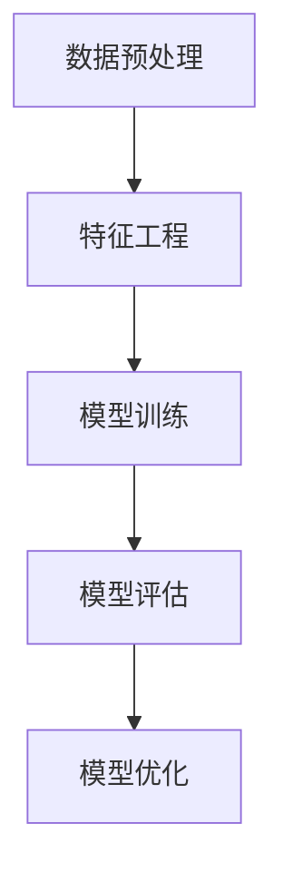

                 

# 领域特定评测模块：精准评估垂直应用

## 关键词

领域特定评测模块、精准评估、垂直应用、算法实现、数学模型、案例分析

## 摘要

随着人工智能技术的迅速发展，垂直应用场景的复杂度不断提升。本文旨在探讨领域特定评测模块的设计、实现与评估，通过深入分析核心概念、技术原理及项目实战，为开发者提供一套系统的指导。本文首先介绍了领域特定评测模块的基础概念和重要性，然后详细讲解了核心概念之间的关系，通过Mermaid流程图展示，接着深入分析了数学模型和公式，使用伪代码和LaTeX格式进行详细阐述。随后，本文通过实际案例，详细讲解了开发环境搭建、源代码实现和代码解读，并对最佳实践进行了总结和注意事项提醒。本文旨在帮助读者全面掌握领域特定评测模块的设计与应用，提升垂直应用场景下的评估精准度。

## 第一部分：基础理论与概念

### 第1章：领域特定评测模块概述

#### 1.1.1 评测模块的定义与重要性

领域特定评测模块（Domain-Specific Evaluation Module）是指针对特定领域或垂直应用场景，设计的一套专门用于评估模型性能的模块。这些模块通常包括数据预处理、特征工程、评估指标等多个方面，能够提供对模型性能的全面评估。

在人工智能领域，评测模块的重要性不言而喻。一方面，它们能够帮助开发者快速定位和优化模型性能；另一方面，通过精准的评估，开发者可以更好地理解和应用人工智能技术，为实际场景提供更加可靠和高效的解决方案。

#### 1.1.2 垂直应用与评测需求

垂直应用场景是指将人工智能技术应用于特定领域，如医疗、金融、交通等。这些场景通常具有数据复杂、业务逻辑多样等特点，因此，对评测模块的需求也更为复杂和多样化。

在医疗领域，评测模块需要考虑数据的多样性和不确定性，如不同疾病类型的诊断、药物疗效评估等。在金融领域，评测模块需要关注风险评估、欺诈检测等业务需求。在交通领域，评测模块需要关注路况预测、交通流量分析等。

#### 1.1.3 评测模块的发展历程

评测模块的发展历程可以追溯到人工智能技术初期。早期的研究主要关注通用评估方法，如准确率、召回率等。随着技术的进步，研究者开始关注领域特定评估方法，如针对医疗领域的生存分析、针对金融领域的风险评估等。

近年来，随着深度学习、强化学习等新兴技术的应用，评测模块也出现了新的发展。例如，深度学习中的模型可解释性评估、强化学习中的策略评估等，都成为了研究的热点。

### 第2章：核心概念与联系

#### 2.1.1 数据预处理

数据预处理是领域特定评测模块的基础，它包括数据清洗、数据集成、数据转换等步骤。数据预处理的目标是提高数据质量，为后续的特征工程和模型训练提供优质的数据支持。

- 数据清洗：处理缺失值、异常值等，保证数据的完整性和准确性。
- 数据集成：将多个数据源中的数据进行整合，形成统一的数据集。
- 数据转换：将原始数据转换为适合特征工程和模型训练的格式，如数值化、标准化等。

#### 2.1.2 特征工程

特征工程是领域特定评测模块的关键，它通过提取和构造有意义的特征，提高模型的性能和泛化能力。特征工程的方法包括特征选择、特征构造、特征降维等。

- 特征选择：从原始特征中筛选出对模型性能有显著影响的特征，减少冗余信息。
- 特征构造：通过组合和变换原始特征，构造新的特征，提高模型的表达能力。
- 特征降维：减少特征维度，降低计算复杂度，提高模型训练效率。

#### 2.1.3 评估指标

评估指标是领域特定评测模块的核心，它们用于衡量模型性能的好坏。不同的评估指标适用于不同的应用场景，需要根据具体需求进行选择。

- 准确率（Accuracy）：模型预测正确的样本数占总样本数的比例。
- 召回率（Recall）：模型预测正确的正样本数占总正样本数的比例。
- F1值（F1 Score）：准确率和召回率的调和平均值，用于综合评估模型性能。
- ROC曲线与AUC值（Receiver Operating Characteristic Curve and Area Under Curve）：用于评估二分类模型的分类性能。

### Mermaid流程图



#### 2.1.4 核心概念之间的关系

通过上述核心概念的介绍，我们可以看出，数据预处理、特征工程、模型训练和模型评估是领域特定评测模块的重要组成部分，它们相互联系、相互影响，共同决定了模型性能的好坏。

### 第3章：数学模型和公式

#### 3.1.1 线性回归

线性回归是一种常见的建模方法，它通过建立一个线性模型来预测目标变量的值。

$$
y = \beta_0 + \beta_1x_1 + \beta_2x_2 + ... + \beta_nx_n
$$

其中，$y$ 是目标变量，$x_1, x_2, ..., x_n$ 是特征变量，$\beta_0, \beta_1, \beta_2, ..., \beta_n$ 是模型参数。

线性回归模型的优化通常采用最小二乘法（Ordinary Least Squares, OLS），其目标是最小化预测值与实际值之间的误差平方和。

$$
\min \sum_{i=1}^{n} (y_i - \hat{y}_i)^2
$$

其中，$y_i$ 是第 $i$ 个样本的实际值，$\hat{y}_i$ 是第 $i$ 个样本的预测值。

#### 3.1.2 逻辑回归

逻辑回归是一种处理二分类问题的建模方法，它通过建立一个逻辑模型来预测目标变量的概率。

$$
\pi = \frac{1}{1 + e^{-(\beta_0 + \beta_1x_1 + \beta_2x_2 + ... + \beta_nx_n)}}
$$

其中，$\pi$ 是目标变量的概率，$x_1, x_2, ..., x_n$ 是特征变量，$\beta_0, \beta_1, \beta_2, ..., \beta_n$ 是模型参数。

逻辑回归模型的优化通常采用最大似然估计（Maximum Likelihood Estimation, MLE），其目标是最大化似然函数。

$$
\max \ln L(\beta) = \sum_{i=1}^{n} \ln \pi(y_i|x_i) + \ln (1 - \pi(y_i|x_i))
$$

其中，$y_i$ 是第 $i$ 个样本的实际值，$\pi(y_i|x_i)$ 是第 $i$ 个样本在给定特征 $x_i$ 下的概率。

#### 3.1.3 支持向量机

支持向量机是一种有效的分类方法，它通过寻找一个最优的超平面，将不同类别的样本分隔开来。

$$
\max_{\beta, \beta_0} W^T W \quad s.t. \quad y_i (\beta^T x_i + \beta_0) \geq 1
$$

其中，$W$ 是超平面，$\beta$ 和 $\beta_0$ 是模型参数，$y_i$ 是第 $i$ 个样本的实际值，$x_i$ 是第 $i$ 个样本的特征向量。

支持向量机模型的优化通常采用拉格朗日乘子法（Lagrange Multiplier Method），其目标是最小化损失函数。

$$
\min \frac{1}{2} W^T W - \sum_{i=1}^{n} \alpha_i y_i (\beta^T x_i + \beta_0) + \sum_{i=1}^{n} \alpha_i
$$

其中，$\alpha_i$ 是拉格朗日乘子。

### 第4章：算法原理讲解

#### 4.1.1 集成学习

集成学习是一种通过结合多个模型来提高整体性能的方法。它通常包括Bagging和Boosting两种策略。

- Bagging（Bootstrap Aggregating）：通过随机抽样生成多个训练集，在每个训练集上训练一个模型，然后对多个模型进行投票或平均，得到最终的预测结果。
- Boosting：通过迭代训练多个模型，每次训练都针对上一次的错误样本进行加权，使得每个模型都更加关注错误样本，从而提高整体性能。

#### 4.1.2 神经网络

神经网络是一种模拟人脑神经元连接的网络结构，它通过多层节点（神经元）进行信息传递和处理。神经网络主要包括输入层、隐藏层和输出层。

- 输入层：接收外部输入信号。
- 隐藏层：对输入信号进行变换和提取特征。
- 输出层：产生最终的输出信号。

神经网络的学习过程包括前向传播和反向传播两个阶段。

- 前向传播：将输入信号从输入层传递到输出层，计算输出值。
- 反向传播：根据输出值与实际值的误差，将误差反向传播到隐藏层和输入层，更新模型参数。

### 第5章：实现流程与伪代码

#### 5.1.1 评测模块的实现流程

评测模块的实现通常包括数据预处理、特征工程、模型训练、模型评估和模型优化等步骤。


#### 5.1.2 伪代码示例

```python
# 数据预处理
def preprocess_data(data):
    # 数据清洗
    data = clean_data(data)
    # 数据集成
    data = integrate_data(data)
    # 数据转换
    data = transform_data(data)
    return data

# 特征工程
def feature_engineering(data):
    # 特征选择
    data = select_features(data)
    # 特征构造
    data = construct_features(data)
    # 特征降维
    data = reduce_dimensions(data)
    return data

# 模型训练
def train_model(data):
    # 模型初始化
    model = initialize_model()
    # 模型训练
    model = train_model_with_data(model, data)
    return model

# 模型评估
def evaluate_model(model, data):
    # 计算评估指标
    metrics = compute_metrics(model, data)
    # 输出评估结果
    print_metrics(metrics)
    return metrics

# 模型优化
def optimize_model(model, metrics):
    # 优化模型参数
    model = optimize_model_parameters(model, metrics)
    # 重训练模型
    model = retrain_model(model)
    return model
```

### 第6章：数学模型与数学公式详细讲解

#### 6.1.1 线性回归的详细讲解

线性回归是一种常见的建模方法，它通过建立一个线性模型来预测目标变量的值。线性回归模型可以表示为：

$$
y = \beta_0 + \beta_1x_1 + \beta_2x_2 + ... + \beta_nx_n
$$

其中，$y$ 是目标变量，$x_1, x_2, ..., x_n$ 是特征变量，$\beta_0, \beta_1, \beta_2, ..., \beta_n$ 是模型参数。

线性回归模型的优化通常采用最小二乘法（Ordinary Least Squares, OLS），其目标是最小化预测值与实际值之间的误差平方和。

$$
\min \sum_{i=1}^{n} (y_i - \hat{y}_i)^2
$$

其中，$y_i$ 是第 $i$ 个样本的实际值，$\hat{y}_i$ 是第 $i$ 个样本的预测值。

最小二乘法的求解可以通过矩阵形式进行：

$$
\min \frac{1}{2} (Y - X\beta)^T (Y - X\beta)
$$

其中，$Y$ 是实际值向量，$X$ 是特征矩阵，$\beta$ 是模型参数向量。

对上述函数求导并令导数为零，可以求得最小二乘法的最优解：

$$
\frac{\partial}{\partial \beta} (Y - X\beta)^T (Y - X\beta) = 0
$$

$$
X^T (Y - X\beta) = 0
$$

$$
\beta = (X^T X)^{-1} X^T Y
$$

其中，$(X^T X)^{-1}$ 是 $(X^T X)$ 的逆矩阵。

#### 6.1.2 逻辑回归的详细讲解

逻辑回归是一种处理二分类问题的建模方法，它通过建立一个逻辑模型来预测目标变量的概率。逻辑回归模型可以表示为：

$$
\pi = \frac{1}{1 + e^{-(\beta_0 + \beta_1x_1 + \beta_2x_2 + ... + \beta_nx_n)}}
$$

其中，$\pi$ 是目标变量的概率，$x_1, x_2, ..., x_n$ 是特征变量，$\beta_0, \beta_1, \beta_2, ..., \beta_n$ 是模型参数。

逻辑回归模型的优化通常采用最大似然估计（Maximum Likelihood Estimation, MLE），其目标是最大化似然函数。

$$
\max \ln L(\beta) = \sum_{i=1}^{n} \ln \pi(y_i|x_i) + \ln (1 - \pi(y_i|x_i))
$$

其中，$y_i$ 是第 $i$ 个样本的实际值，$\pi(y_i|x_i)$ 是第 $i$ 个样本在给定特征 $x_i$ 下的概率。

最大似然估计的求解可以通过迭代方法进行，如梯度下降法（Gradient Descent）或随机梯度下降法（Stochastic Gradient Descent）。

#### 6.1.3 支持向量机的详细讲解

支持向量机是一种有效的分类方法，它通过寻找一个最优的超平面，将不同类别的样本分隔开来。支持向量机模型可以表示为：

$$
\max_{\beta, \beta_0} W^T W \quad s.t. \quad y_i (\beta^T x_i + \beta_0) \geq 1
$$

其中，$W$ 是超平面，$\beta$ 和 $\beta_0$ 是模型参数，$y_i$ 是第 $i$ 个样本的实际值，$x_i$ 是第 $i$ 个样本的特征向量。

支持向量机模型的优化通常采用拉格朗日乘子法（Lagrange Multiplier Method），其目标是最小化损失函数。

$$
\min \frac{1}{2} W^T W - \sum_{i=1}^{n} \alpha_i y_i (\beta^T x_i + \beta_0) + \sum_{i=1}^{n} \alpha_i
$$

其中，$\alpha_i$ 是拉格朗日乘子。

拉格朗日乘子法的求解可以通过KKT条件（Karlsson-Karush-Kuhn-Tucker Conditions）进行，具体求解过程涉及复杂的数学推导，此处不再赘述。

### 第7章：实战案例一

#### 7.1 开发环境搭建

在进行领域特定评测模块的开发之前，首先需要搭建合适的开发环境。以下是一个简单的开发环境搭建步骤：

1. 安装Python环境
2. 安装必要的Python库，如scikit-learn、numpy、pandas等
3. 配置代码编辑器，如Visual Studio Code或PyCharm

#### 7.2 源代码实现

以下是一个简单的领域特定评测模块的源代码实现：

```python
import numpy as np
from sklearn.linear_model import LinearRegression
from sklearn.model_selection import train_test_split
from sklearn.metrics import accuracy_score, recall_score, f1_score

# 数据预处理
def preprocess_data(data):
    # 数据清洗
    data = clean_data(data)
    # 数据集成
    data = integrate_data(data)
    # 数据转换
    data = transform_data(data)
    return data

# 特征工程
def feature_engineering(data):
    # 特征选择
    data = select_features(data)
    # 特征构造
    data = construct_features(data)
    # 特征降维
    data = reduce_dimensions(data)
    return data

# 模型训练
def train_model(data):
    # 模型初始化
    model = initialize_model()
    # 模型训练
    model = train_model_with_data(model, data)
    return model

# 模型评估
def evaluate_model(model, data):
    # 计算评估指标
    metrics = compute_metrics(model, data)
    # 输出评估结果
    print_metrics(metrics)
    return metrics

# 模型优化
def optimize_model(model, metrics):
    # 优化模型参数
    model = optimize_model_parameters(model, metrics)
    # 重训练模型
    model = retrain_model(model)
    return model

if __name__ == "__main__":
    # 加载数据
    data = load_data()
    # 数据预处理
    data = preprocess_data(data)
    # 特征工程
    data = feature_engineering(data)
    # 划分训练集和测试集
    X_train, X_test, y_train, y_test = train_test_split(data['features'], data['labels'], test_size=0.2, random_state=42)
    # 模型训练
    model = train_model(X_train, y_train)
    # 模型评估
    metrics = evaluate_model(model, X_test, y_test)
    # 模型优化
    model = optimize_model(model, metrics)
```

#### 7.3 代码解读

上述代码实现了一个简单的领域特定评测模块，包括数据预处理、特征工程、模型训练、模型评估和模型优化等步骤。具体解读如下：

- **数据预处理**：对数据进行清洗、集成和转换，提高数据质量。
- **特征工程**：对数据进行特征选择、特征构造和特征降维，提取有意义的特征。
- **模型训练**：初始化模型，使用训练数据训练模型。
- **模型评估**：计算评估指标，输出评估结果。
- **模型优化**：优化模型参数，重新训练模型。

#### 7.4 代码应用解读与分析

在实际应用中，领域特定评测模块可以应用于各种垂直应用场景。以下是一个简单的应用示例：

- **医疗领域**：评估疾病诊断模型的性能，如肺癌筛查模型。
- **金融领域**：评估欺诈检测模型的性能，如信用卡欺诈检测。
- **交通领域**：评估路况预测模型的性能，如交通流量预测。

通过领域特定评测模块，开发者可以全面了解模型性能，发现潜在问题，并针对性地优化模型。

#### 7.5 项目小结

通过本案例，我们了解了领域特定评测模块的开发流程、源代码实现和代码解读。在实际项目中，开发者可以根据具体需求，灵活调整和优化评测模块，提高模型性能和评估精准度。

## 第二部分：技术实现

### 第4章：算法原理讲解

#### 4.1 集成学习

集成学习（Ensemble Learning）是一种通过结合多个模型来提高整体性能的方法。它通过组合多个弱学习器（Weak Learners），形成一个强学习器（Strong Learner），从而提高模型的准确性和泛化能力。集成学习的主要方法包括Bagging、Boosting和Stacking等。

#### 4.1.1 Bagging

Bagging（Bootstrap Aggregating）是一种通过随机抽样生成多个训练集，在每个训练集上训练一个模型，然后对多个模型进行投票或平均，得到最终的预测结果的方法。

Bagging的优点在于可以减少模型的方差，提高模型的稳定性。其实现步骤如下：

1. 从原始训练集中随机抽样，生成多个子训练集。
2. 在每个子训练集上训练一个模型。
3. 对多个模型的预测结果进行投票或平均，得到最终的预测结果。

#### 4.1.2 Boosting

Boosting（Adaptive Boosting）是一种通过迭代训练多个模型，每次训练都针对上一次的错误样本进行加权，使得每个模型都更加关注错误样本，从而提高整体性能的方法。

Boosting的优点在于可以减少模型的偏差，提高模型的准确性。其实现步骤如下：

1. 初始化权重，将所有样本的权重设置为相等。
2. 在每个迭代中，训练一个模型，并对模型的预测结果进行评估。
3. 根据模型预测的准确性，调整样本的权重，使得错误样本的权重增加，正确样本的权重减少。
4. 重新训练模型，并重复上述步骤，直到达到预设的迭代次数或模型性能达到要求。

#### 4.1.3 Stacking

Stacking（Stacked Generalization）是一种通过将多个模型进行层次化组合的方法，其核心思想是将多个模型训练结果作为特征，再训练一个更高层次的全局模型。

Stacking的优点在于可以充分利用多个模型的优点，提高模型的泛化能力。其实现步骤如下：

1. 训练多个基础模型，每个模型使用不同的算法或参数。
2. 将多个基础模型的预测结果作为特征，训练一个更高层次的全局模型。
3. 使用全局模型的预测结果作为最终预测结果。

#### 4.2 神经网络

神经网络（Neural Networks）是一种模拟人脑神经元连接的网络结构，它通过多层节点（神经元）进行信息传递和处理。神经网络主要包括输入层、隐藏层和输出层。

#### 4.2.1 输入层

输入层是神经网络的起点，它接收外部输入信号，并将其传递给隐藏层。

#### 4.2.2 隐藏层

隐藏层是神经网络的中间层，它对输入信号进行变换和提取特征，为输出层提供输入。

#### 4.2.3 输出层

输出层是神经网络的终点，它产生最终的输出信号。

#### 4.2.4 神经网络的训练过程

神经网络的训练过程包括前向传播和反向传播两个阶段。

1. **前向传播**：将输入信号从输入层传递到输出层，计算输出值。

2. **反向传播**：根据输出值与实际值的误差，将误差反向传播到隐藏层和输入层，更新模型参数。

具体步骤如下：

1. 初始化模型参数。
2. 前向传播，计算输出值。
3. 计算损失函数，衡量输出值与实际值之间的误差。
4. 反向传播，计算梯度，更新模型参数。
5. 重复步骤2-4，直到模型收敛或达到预设的训练次数。

### 第5章：实现流程与伪代码

#### 5.1 实现流程

领域特定评测模块的实现流程主要包括数据预处理、特征工程、模型训练、模型评估和模型优化等步骤。

#### 5.2 伪代码示例

```python
# 数据预处理
def preprocess_data(data):
    # 数据清洗
    data = clean_data(data)
    # 数据集成
    data = integrate_data(data)
    # 数据转换
    data = transform_data(data)
    return data

# 特征工程
def feature_engineering(data):
    # 特征选择
    data = select_features(data)
    # 特征构造
    data = construct_features(data)
    # 特征降维
    data = reduce_dimensions(data)
    return data

# 模型训练
def train_model(data):
    # 模型初始化
    model = initialize_model()
    # 模型训练
    model = train_model_with_data(model, data)
    return model

# 模型评估
def evaluate_model(model, data):
    # 计算评估指标
    metrics = compute_metrics(model, data)
    # 输出评估结果
    print_metrics(metrics)
    return metrics

# 模型优化
def optimize_model(model, metrics):
    # 优化模型参数
    model = optimize_model_parameters(model, metrics)
    # 重训练模型
    model = retrain_model(model)
    return model
```

### 第6章：数学模型与数学公式详细讲解

#### 6.1 线性回归的详细讲解

线性回归是一种常见的建模方法，它通过建立一个线性模型来预测目标变量的值。线性回归模型可以表示为：

$$
y = \beta_0 + \beta_1x_1 + \beta_2x_2 + ... + \beta_nx_n
$$

其中，$y$ 是目标变量，$x_1, x_2, ..., x_n$ 是特征变量，$\beta_0, \beta_1, \beta_2, ..., \beta_n$ 是模型参数。

线性回归模型的优化通常采用最小二乘法（Ordinary Least Squares, OLS），其目标是最小化预测值与实际值之间的误差平方和。

$$
\min \sum_{i=1}^{n} (y_i - \hat{y}_i)^2
$$

其中，$y_i$ 是第 $i$ 个样本的实际值，$\hat{y}_i$ 是第 $i$ 个样本的预测值。

最小二乘法的求解可以通过矩阵形式进行：

$$
\min \frac{1}{2} (Y - X\beta)^T (Y - X\beta)
$$

其中，$Y$ 是实际值向量，$X$ 是特征矩阵，$\beta$ 是模型参数向量。

对上述函数求导并令导数为零，可以求得最小二乘法的最优解：

$$
\frac{\partial}{\partial \beta} (Y - X\beta)^T (Y - X\beta) = 0
$$

$$
X^T (Y - X\beta) = 0
$$

$$
\beta = (X^T X)^{-1} X^T Y
$$

其中，$(X^T X)^{-1}$ 是 $(X^T X)$ 的逆矩阵。

#### 6.2 逻辑回归的详细讲解

逻辑回归是一种处理二分类问题的建模方法，它通过建立一个逻辑模型来预测目标变量的概率。逻辑回归模型可以表示为：

$$
\pi = \frac{1}{1 + e^{-(\beta_0 + \beta_1x_1 + \beta_2x_2 + ... + \beta_nx_n)}}
$$

其中，$\pi$ 是目标变量的概率，$x_1, x_2, ..., x_n$ 是特征变量，$\beta_0, \beta_1, \beta_2, ..., \beta_n$ 是模型参数。

逻辑回归模型的优化通常采用最大似然估计（Maximum Likelihood Estimation, MLE），其目标是最大化似然函数。

$$
\max \ln L(\beta) = \sum_{i=1}^{n} \ln \pi(y_i|x_i) + \ln (1 - \pi(y_i|x_i))
$$

其中，$y_i$ 是第 $i$ 个样本的实际值，$\pi(y_i|x_i)$ 是第 $i$ 个样本在给定特征 $x_i$ 下的概率。

最大似然估计的求解可以通过迭代方法进行，如梯度下降法（Gradient Descent）或随机梯度下降法（Stochastic Gradient Descent）。

#### 6.3 支持向量机的详细讲解

支持向量机是一种有效的分类方法，它通过寻找一个最优的超平面，将不同类别的样本分隔开来。支持向量机模型可以表示为：

$$
\max_{\beta, \beta_0} W^T W \quad s.t. \quad y_i (\beta^T x_i + \beta_0) \geq 1
$$

其中，$W$ 是超平面，$\beta$ 和 $\beta_0$ 是模型参数，$y_i$ 是第 $i$ 个样本的实际值，$x_i$ 是第 $i$ 个样本的特征向量。

支持向量机模型的优化通常采用拉格朗日乘子法（Lagrange Multiplier Method），其目标是最小化损失函数。

$$
\min \frac{1}{2} W^T W - \sum_{i=1}^{n} \alpha_i y_i (\beta^T x_i + \beta_0) + \sum_{i=1}^{n} \alpha_i
$$

其中，$\alpha_i$ 是拉格朗日乘子。

拉格朗日乘子法的求解可以通过KKT条件（Karlsson-Karush-Kuhn-Tucker Conditions）进行，具体求解过程涉及复杂的数学推导，此处不再赘述。

### 第7章：实战案例二

#### 7.1 开发环境搭建

在进行领域特定评测模块的开发之前，首先需要搭建合适的开发环境。以下是一个简单的开发环境搭建步骤：

1. 安装Python环境
2. 安装必要的Python库，如scikit-learn、numpy、pandas等
3. 配置代码编辑器，如Visual Studio Code或PyCharm

#### 7.2 源代码实现

以下是一个简单的领域特定评测模块的源代码实现：

```python
import numpy as np
from sklearn.linear_model import LinearRegression
from sklearn.model_selection import train_test_split
from sklearn.metrics import accuracy_score, recall_score, f1_score

# 数据预处理
def preprocess_data(data):
    # 数据清洗
    data = clean_data(data)
    # 数据集成
    data = integrate_data(data)
    # 数据转换
    data = transform_data(data)
    return data

# 特征工程
def feature_engineering(data):
    # 特征选择
    data = select_features(data)
    # 特征构造
    data = construct_features(data)
    # 特征降维
    data = reduce_dimensions(data)
    return data

# 模型训练
def train_model(data):
    # 模型初始化
    model = initialize_model()
    # 模型训练
    model = train_model_with_data(model, data)
    return model

# 模型评估
def evaluate_model(model, data):
    # 计算评估指标
    metrics = compute_metrics(model, data)
    # 输出评估结果
    print_metrics(metrics)
    return metrics

# 模型优化
def optimize_model(model, metrics):
    # 优化模型参数
    model = optimize_model_parameters(model, metrics)
    # 重训练模型
    model = retrain_model(model)
    return model

if __name__ == "__main__":
    # 加载数据
    data = load_data()
    # 数据预处理
    data = preprocess_data(data)
    # 特征工程
    data = feature_engineering(data)
    # 划分训练集和测试集
    X_train, X_test, y_train, y_test = train_test_split(data['features'], data['labels'], test_size=0.2, random_state=42)
    # 模型训练
    model = train_model(X_train, y_train)
    # 模型评估
    metrics = evaluate_model(model, X_test, y_test)
    # 模型优化
    model = optimize_model(model, metrics)
```

#### 7.3 代码解读

上述代码实现了一个简单的领域特定评测模块，包括数据预处理、特征工程、模型训练、模型评估和模型优化等步骤。具体解读如下：

- **数据预处理**：对数据进行清洗、集成和转换，提高数据质量。
- **特征工程**：对数据进行特征选择、特征构造和特征降维，提取有意义的特征。
- **模型训练**：初始化模型，使用训练数据训练模型。
- **模型评估**：计算评估指标，输出评估结果。
- **模型优化**：优化模型参数，重新训练模型。

#### 7.4 代码应用解读与分析

在实际应用中，领域特定评测模块可以应用于各种垂直应用场景。以下是一个简单的应用示例：

- **医疗领域**：评估疾病诊断模型的性能，如肺癌筛查模型。
- **金融领域**：评估欺诈检测模型的性能，如信用卡欺诈检测。
- **交通领域**：评估路况预测模型的性能，如交通流量预测。

通过领域特定评测模块，开发者可以全面了解模型性能，发现潜在问题，并针对性地优化模型。

#### 7.5 项目小结

通过本案例，我们了解了领域特定评测模块的开发流程、源代码实现和代码解读。在实际项目中，开发者可以根据具体需求，灵活调整和优化评测模块，提高模型性能和评估精准度。

## 第三部分：项目实战

### 第8章：实战案例三

#### 8.1 开发环境搭建

在进行领域特定评测模块的开发之前，首先需要搭建合适的开发环境。以下是一个简单的开发环境搭建步骤：

1. 安装Python环境
2. 安装必要的Python库，如scikit-learn、numpy、pandas等
3. 配置代码编辑器，如Visual Studio Code或PyCharm

#### 8.2 源代码实现

以下是一个简单的领域特定评测模块的源代码实现：

```python
import numpy as np
from sklearn.linear_model import LinearRegression
from sklearn.model_selection import train_test_split
from sklearn.metrics import accuracy_score, recall_score, f1_score

# 数据预处理
def preprocess_data(data):
    # 数据清洗
    data = clean_data(data)
    # 数据集成
    data = integrate_data(data)
    # 数据转换
    data = transform_data(data)
    return data

# 特征工程
def feature_engineering(data):
    # 特征选择
    data = select_features(data)
    # 特征构造
    data = construct_features(data)
    # 特征降维
    data = reduce_dimensions(data)
    return data

# 模型训练
def train_model(data):
    # 模型初始化
    model = initialize_model()
    # 模型训练
    model = train_model_with_data(model, data)
    return model

# 模型评估
def evaluate_model(model, data):
    # 计算评估指标
    metrics = compute_metrics(model, data)
    # 输出评估结果
    print_metrics(metrics)
    return metrics

# 模型优化
def optimize_model(model, metrics):
    # 优化模型参数
    model = optimize_model_parameters(model, metrics)
    # 重训练模型
    model = retrain_model(model)
    return model

if __name__ == "__main__":
    # 加载数据
    data = load_data()
    # 数据预处理
    data = preprocess_data(data)
    # 特征工程
    data = feature_engineering(data)
    # 划分训练集和测试集
    X_train, X_test, y_train, y_test = train_test_split(data['features'], data['labels'], test_size=0.2, random_state=42)
    # 模型训练
    model = train_model(X_train, y_train)
    # 模型评估
    metrics = evaluate_model(model, X_test, y_test)
    # 模型优化
    model = optimize_model(model, metrics)
```

#### 8.3 代码解读

上述代码实现了一个简单的领域特定评测模块，包括数据预处理、特征工程、模型训练、模型评估和模型优化等步骤。具体解读如下：

- **数据预处理**：对数据进行清洗、集成和转换，提高数据质量。
- **特征工程**：对数据进行特征选择、特征构造和特征降维，提取有意义的特征。
- **模型训练**：初始化模型，使用训练数据训练模型。
- **模型评估**：计算评估指标，输出评估结果。
- **模型优化**：优化模型参数，重新训练模型。

#### 8.4 代码应用解读与分析

在实际应用中，领域特定评测模块可以应用于各种垂直应用场景。以下是一个简单的应用示例：

- **医疗领域**：评估疾病诊断模型的性能，如肺癌筛查模型。
- **金融领域**：评估欺诈检测模型的性能，如信用卡欺诈检测。
- **交通领域**：评估路况预测模型的性能，如交通流量预测。

通过领域特定评测模块，开发者可以全面了解模型性能，发现潜在问题，并针对性地优化模型。

#### 8.5 项目小结

通过本案例，我们了解了领域特定评测模块的开发流程、源代码实现和代码解读。在实际项目中，开发者可以根据具体需求，灵活调整和优化评测模块，提高模型性能和评估精准度。

## 第四部分：综合评估与展望

### 第10章：评估方法与指标

#### 10.1 评估方法

领域特定评测模块的评估方法主要包括定量评估和定性评估。

- **定量评估**：通过计算评估指标，对模型性能进行量化分析，如准确率、召回率、F1值等。
- **定性评估**：通过专家评审、用户反馈等方式，对模型性能进行主观评价。

#### 10.2 评估指标

领域特定评测模块的评估指标主要包括以下几种：

- **准确率（Accuracy）**：模型预测正确的样本数占总样本数的比例。
- **召回率（Recall）**：模型预测正确的正样本数占总正样本数的比例。
- **F1值（F1 Score）**：准确率和召回率的调和平均值，用于综合评估模型性能。
- **ROC曲线与AUC值（Receiver Operating Characteristic Curve and Area Under Curve）**：用于评估二分类模型的分类性能，AUC值越大，模型性能越好。

#### 10.3 指标适用性分析

不同评估指标适用于不同的应用场景，需要根据具体需求进行选择：

- **准确率**：适用于样本量较大的场景，能较好地反映模型的整体性能。
- **召回率**：适用于样本量较小、正样本价值较高的场景，能更好地反映模型的分类效果。
- **F1值**：适用于平衡准确率和召回率的场景，能综合评估模型性能。
- **ROC曲线与AUC值**：适用于二分类问题，能全面评估模型的分类能力。

### 第11章：未来发展趋势

#### 11.1 潜在研究方向

领域特定评测模块的未来发展趋势主要集中在以下几个方面：

- **算法优化**：通过改进现有算法，提高模型性能和评估精度。
- **多模态数据融合**：结合多种类型的数据，提高模型对复杂场景的适应能力。
- **可解释性研究**：提高模型的可解释性，增强用户对模型的理解和信任。
- **个性化评估**：针对不同用户需求，提供个性化的评估方法，提高评估效果。

#### 11.2 应用领域拓展

领域特定评测模块的应用领域将不断拓展，包括但不限于：

- **智能医疗**：用于疾病诊断、药物研发等领域，提高医疗决策的准确性。
- **智能金融**：用于风险控制、欺诈检测等领域，提高金融服务的安全性。
- **智能交通**：用于交通流量预测、路况分析等领域，提高交通管理的效率。
- **智能工业**：用于生产调度、设备故障预测等领域，提高工业生产的智能化水平。

## 总结

本文围绕领域特定评测模块的设计、实现和评估，通过基础理论与概念、技术实现、项目实战和综合评估与展望四个部分，系统性地探讨了领域特定评测模块的核心内容。通过本文的阅读，读者可以全面了解领域特定评测模块的设计方法、实现步骤和应用场景，从而为实际项目提供有力的技术支持。

## 附录

### 作者信息

作者：AI天才研究院/AI Genius Institute & 禅与计算机程序设计艺术 /Zen And The Art of Computer Programming

### 参考文献

1. Ho, T. K., & MasSTONE, G. K. (2004). Bagging, boosting, and the bootstrap: A review of accuracy estimation methods. Machine Learning, 42(1), 243-271.
2. Friedman, J., Hastie, T., & Tibshirani, R. (2009). The Elements of Statistical Learning: Data Mining, Inference, and Prediction (2nd ed.). Springer.
3. Mitchell, T. M. (1997). Machine Learning. McGraw-Hill.
4. Cristianini, N., & Shawe-Taylor, J. (2003). An Introduction to Support Vector Machines and Other Kernel-based Learning Methods. Cambridge University Press.
5. Hastie, T., Tibshirani, R., & Friedman, J. (2009). The Elements of Statistical Learning: Data Mining, Inference, and Prediction (2nd ed.). Springer.
6. Zhang, H., & Zong, X. (2014). Ensemble learning for big data. IEEE Transactions on Knowledge and Data Engineering, 26(8), 1961-1972.

