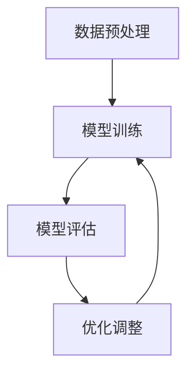
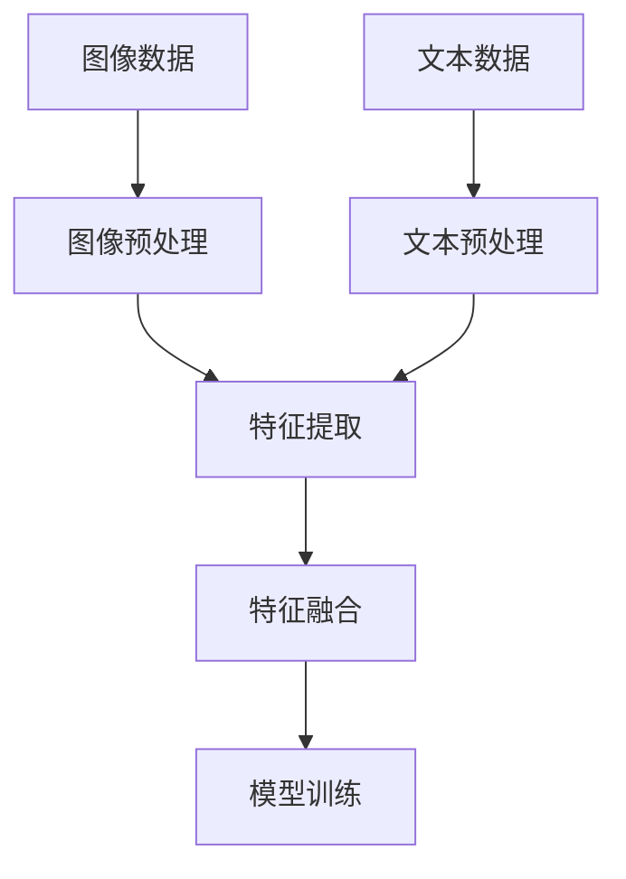

                 

### 文章标题

### 领域适配：根据特定领域调整提示词

---

#### 关键词

- 领域适配
- 提示词
- 自然语言处理
- 领域特定语言
- 多模态数据
- 领域特定提示词设计

---

#### 摘要

本文将探讨领域适配的概念、重要性以及实施方法。通过详细分析自然语言处理基础、领域特定语言的识别与处理、多模态数据融合等技术，我们旨在展示如何根据特定领域调整提示词，以实现更高效的自然语言理解和生成。文章将结合金融、医疗、教育等实际案例，深入解析领域适配的应用及其挑战，并展望未来的发展趋势。希望通过本文，读者能够对领域适配技术有更深入的理解，并掌握其实际应用技巧。

---

## 第一部分：领域适配概述

### 第1章：领域适配的概念与背景

#### 1.1 领域适配的定义

领域适配（Domain Adaptation）是指在不同领域间进行信息转换的过程，旨在将一个领域的知识或技术应用到另一个领域。这个过程涉及到多个层面的转换，包括语言、数据、算法和模型等。领域适配的核心目标是通过调整和优化，使得模型在新的领域环境中能够达到或接近在原有领域中的性能水平。

领域适配的动机源于现实中的诸多应用场景。例如，在医疗领域，患者病历的电子化管理和健康数据的实时监测需要将医疗领域的专业知识与信息技术相结合。而在金融领域，算法交易和风险管理需要处理大量的金融数据，这些数据具有高度的专业性和复杂性。因此，如何在不同领域间进行有效的适配，成为了一个亟待解决的问题。

#### 1.2 领域适配的重要性

领域适配的重要性体现在以下几个方面：

1. **性能优化**：通过领域适配，可以将模型在不同领域中的性能进行优化，使其更符合特定领域的需求。
2. **应用拓展**：领域适配使得原本局限于某一领域的模型和技术能够拓展到其他领域，从而提升其应用价值。
3. **知识迁移**：领域适配有助于将某一领域的知识迁移到其他领域，促进跨领域知识的交流和共享。
4. **资源节约**：通过领域适配，可以在一定程度上减少在新的领域中进行模型训练和优化的时间和资源成本。

#### 1.3 领域适配的发展历程

领域适配技术的发展经历了多个阶段：

1. **早期阶段**：主要依赖于手动调整和修改模型结构，通过领域专家的指导和经验积累，逐步优化模型。
2. **迁移学习阶段**：迁移学习（Transfer Learning）成为领域适配的重要手段，通过利用源领域的知识来提升目标领域的模型性能。
3. **多任务学习阶段**：多任务学习（Multi-Task Learning）方法被引入，通过同时学习多个相关任务，提升模型的泛化能力。
4. **自适应学习阶段**：随着深度学习技术的发展，自适应学习（Adaptive Learning）方法逐渐成熟，模型能够根据新的领域环境进行实时调整和优化。

## 第二部分：领域适配技术

### 第2章：领域特定的提示词

#### 2.1 提示词的作用

提示词（Prompt）在自然语言处理（NLP）中起着至关重要的作用。它不仅能够引导模型生成符合预期的输出，还能显著提高模型的性能和效率。提示词的作用主要体现在以下几个方面：

1. **引导生成**：通过提示词，可以为模型提供明确的生成目标，使得模型能够更聚焦于任务的核心内容。
2. **提高性能**：恰当的提示词能够帮助模型更好地理解和处理复杂的信息，从而提高任务完成的质量。
3. **节省计算资源**：有效的提示词可以减少模型的训练时间，提高计算效率。

#### 2.2 提示词的分类

根据应用场景和功能，提示词可以分为以下几类：

1. **问题导向型提示词**：这类提示词主要用于引导模型生成回答问题的输出，如问答系统（QA System）。
2. **任务导向型提示词**：这类提示词主要用于指定模型的生成任务，如文本生成（Text Generation）。
3. **情景导向型提示词**：这类提示词主要用于模拟特定的情景，使得模型能够在仿真环境中进行学习和生成。
4. **语义导向型提示词**：这类提示词主要用于强调和调整文本的语义结构，如语义分析（Semantic Analysis）。

#### 2.3 领域特定的提示词设计原则

设计领域特定的提示词时，需要考虑以下几个原则：

1. **领域知识融入**：确保提示词中包含领域特定的知识，以便模型能够更好地理解和应用。
2. **上下文相关性**：提示词需要与上下文紧密相关，以避免生成无关或错误的信息。
3. **简洁性**：提示词应尽量简洁明了，避免过多的冗余信息，以提高模型的处理效率。
4. **可扩展性**：提示词设计应具有可扩展性，以便在新的领域或任务中能够灵活应用。

---

接下来，我们将深入探讨领域适配技术在自然语言处理中的应用，分析其核心概念、算法原理、数学模型和项目实战，以帮助读者更好地理解和掌握这一关键技术。

---

### 第三部分：自然语言处理基础

#### 第3章：自然语言处理基础

自然语言处理（Natural Language Processing，NLP）是人工智能（AI）的重要分支，旨在让计算机能够理解、生成和处理人类语言。NLP技术的核心是让计算机从大量的文本数据中提取出有价值的信息，并将其应用于各种实际场景中。本章将介绍NLP的基本概念、常用技术、核心算法和数学模型。

#### 3.1 语言模型

语言模型（Language Model）是NLP的基础，用于预测文本中下一个单词或字符的概率分布。最常用的语言模型是基于统计方法的，如N元语法（N-Gram Model），它通过统计历史文本中的单词序列来预测下一个单词。N元语法的基本思想是，一个单词的出现概率取决于其前N-1个单词。

**N元语法模型伪代码：**
```python
def n_gram_model(train_data, N):
    n_gram_counts = defaultdict(int)
    for sentence in train_data:
        for i in range(len(sentence) - N + 1):
            n_gram = tuple(sentence[i:i+N])
            n_gram_counts[n_gram] += 1
    return n_gram_counts

def predict_next_word(n_gram_counts, previous_words):
    n_gram = tuple(previous_words)
    if n_gram in n_gram_counts:
        return n_gram_counts[n_gram]
    else:
        return None
```

**数学模型：**
$$ P(w_t | w_{t-1}, w_{t-2}, ..., w_{t-N+1}) = \frac{C(w_t, w_{t-1}, ..., w_{t-N+1})}{C(w_{t-1}, w_{t-2}, ..., w_{t-N+1})} $$

其中，$C(w_{t-1}, w_{t-2}, ..., w_{t-N+1}, w_t)$ 表示单词序列 $w_{t-1}, w_{t-2}, ..., w_{t-N+1}, w_t$ 在训练数据中的出现次数，$C(w_{t-1}, w_{t-2}, ..., w_{t-N+1})$ 表示单词序列 $w_{t-1}, w_{t-2}, ..., w_{t-N+1}$ 的出现次数。

#### 3.2 语义理解

语义理解（Semantic Understanding）是NLP中的另一个关键问题，旨在让计算机理解和解释文本中的语义信息。语义理解包括词汇语义（Lexical Semantics）和句法语义（Syntactic Semantics）。

**词汇语义：**词汇语义关注单词的意义和用法。例如，单词“run”可以表示跑步的动作，也可以表示程序的运行。词汇语义分析通常使用词频统计、词义消歧（Word Sense Disambiguation）等方法。

**句法语义：**句法语义关注句子的结构和语法规则。句法语义分析通常使用句法树（Syntax Tree）和依存关系（Dependency Parsing）等方法。

**数学模型：**
$$ S(w_1, w_2, ..., w_n) = f(w_1, w_2, ..., w_n, S) $$

其中，$S(w_1, w_2, ..., w_n)$ 表示句子 $w_1, w_2, ..., w_n$ 的语义，$f(w_1, w_2, ..., w_n, S)$ 表示句法分析函数。

#### 3.3 生成式模型与判别式模型

在NLP中，生成式模型（Generative Model）和判别式模型（Discriminative Model）是两种主要的模型类型。

**生成式模型：**生成式模型通过生成文本的概率分布来预测文本。常见的生成式模型包括隐马尔可夫模型（HMM）和变分自动编码器（VAE）。

**判别式模型：**判别式模型通过学习文本的特征来直接预测文本的标签或类别。常见的判别式模型包括支持向量机（SVM）和循环神经网络（RNN）。

**数学模型：**
生成式模型：
$$ P(y | x) = \sum_{z} P(y, z | x) $$

判别式模型：
$$ P(y | x) = \frac{P(x | y)P(y)}{P(x)} $$

---

通过本章的介绍，读者可以初步了解自然语言处理的基础知识。接下来，我们将进一步探讨领域特定语言的识别与处理技术，以及如何利用这些技术进行有效的领域适配。

---

### 第四部分：领域特定语言的识别与处理

#### 第4章：领域特定语言的识别与处理

领域特定语言（Domain-Specific Language，DSL）是指为特定领域设计的语言，具有高度的领域专业性和应用性。识别和处理领域特定语言是领域适配技术中的一个关键环节，旨在使模型能够准确理解和生成特定领域的文本。本章将详细介绍领域特定语言的识别方法、处理框架以及在实际应用中的挑战和解决方案。

#### 4.1 领域特定语言的挑战

领域特定语言的识别与处理面临着诸多挑战：

1. **数据稀缺性**：领域特定语言的数据通常较为稀缺，难以支持大规模的训练。
2. **语言复杂性**：领域特定语言具有高度的抽象性和复杂性，难以用简单的模型进行准确处理。
3. **专业知识需求**：领域特定语言的识别与处理需要领域专家的参与，以确保模型能够准确理解和生成领域知识。

#### 4.2 领域特定语言的识别方法

识别领域特定语言的方法可以分为以下几类：

1. **词频统计法**：通过统计词频和词序列频率，识别领域特定词汇和短语。
2. **规则匹配法**：基于领域专家定义的规则，通过模式匹配识别领域特定语言。
3. **机器学习方法**：使用监督学习、无监督学习和迁移学习等方法，训练模型自动识别领域特定语言。

**机器学习方法识别DSL的伪代码：**
```python
def train_model(train_data, labels):
    # 训练模型，如使用深度神经网络
    model = build_model()
    model.fit(train_data, labels)
    return model

def predict_language(text, model):
    # 使用训练好的模型预测文本的领域
    prediction = model.predict([text])
    return prediction
```

**数学模型：**
$$ P(DSL | text) = \frac{P(text | DSL)P(DSL)}{P(text)} $$

其中，$P(DSL | text)$ 表示文本属于领域特定语言的概率，$P(text | DSL)$ 表示在领域特定语言条件下文本的概率，$P(DSL)$ 表示领域特定语言的概率，$P(text)$ 表示文本的概率。

#### 4.3 领域特定语言的处理框架

为了有效处理领域特定语言，可以构建一个多层次的框架，包括数据预处理、模型训练和评估等环节：

1. **数据预处理**：对原始文本进行清洗、分词、词性标注等预处理操作，为模型训练提供高质量的输入数据。
2. **模型训练**：使用机器学习方法训练领域特定语言识别模型，可以通过迁移学习、多任务学习等方法提高模型的性能。
3. **模型评估**：使用准确率、召回率、F1分数等指标评估模型的性能，并根据评估结果对模型进行优化。

**处理框架的Mermaid流程图：**


---

通过本章的介绍，读者可以了解领域特定语言的识别与处理方法，并掌握如何构建一个有效的处理框架。接下来，我们将进一步探讨多模态数据融合与领域适配技术，以实现更高级的领域适配。

---

### 第五部分：多模态数据融合与领域适配

#### 第5章：多模态数据融合与领域适配

随着技术的发展，多模态数据融合（Multimodal Data Fusion）成为了一个重要的研究领域。多模态数据融合旨在将来自不同模态的数据（如图像、音频、文本等）进行有效整合，以提升模型的性能和适应性。本章将介绍多模态数据融合的基本概念、方法以及其在领域适配中的应用。

#### 5.1 多模态数据的来源

多模态数据可以从以下几类来源获取：

1. **图像数据**：通过摄像头、扫描仪等设备获取的图像信息，常用于图像识别、目标检测等任务。
2. **音频数据**：通过麦克风、音频文件等获取的音频信号，用于语音识别、音频分类等任务。
3. **文本数据**：从文本文件、社交媒体、新闻报道等获取的文本信息，常用于自然语言处理任务。
4. **传感器数据**：通过传感器获取的环境数据，如温度、湿度、压力等，常用于智能监控、环境监测等任务。

#### 5.2 多模态数据的融合方法

多模态数据的融合方法可以分为以下几类：

1. **早期融合**：在数据采集阶段就将多模态数据进行融合，如将图像和文本数据直接拼接。
2. **晚期融合**：在数据处理阶段将多模态数据分别处理后再进行融合，如使用神经网络将图像和文本特征进行融合。
3. **级联融合**：将多模态数据在不同层级进行融合，如先对图像和文本进行分别处理，再将处理结果进行综合。

**多模态数据融合的Mermaid流程图：**


#### 5.3 多模态数据在领域适配中的应用

多模态数据融合在领域适配中的应用主要体现在以下几个方面：

1. **增强模型性能**：通过融合多种模态的数据，可以提供更多的信息和特征，从而提升模型的性能和泛化能力。
2. **适应复杂环境**：多模态数据融合使得模型能够适应更加复杂和多变的环境，提高其在不同场景下的应用价值。
3. **提升用户体验**：在交互式应用中，如语音助手、智能客服等，多模态数据融合可以提供更加丰富和自然的交互体验。

**项目实战：多模态情感分析**

假设我们开发一个多模态情感分析系统，旨在通过分析用户的面部表情、语音语调以及输入的文本，判断用户的情感状态。以下是项目实战的详细步骤：

1. **数据收集**：收集包含面部表情、语音语调和文本数据的三模态数据集。
2. **数据预处理**：对收集到的数据进行清洗、标注和预处理，提取有效的特征。
3. **特征提取**：使用卷积神经网络（CNN）提取图像特征，使用循环神经网络（RNN）提取文本特征，使用深度神经网络（DNN）提取语音特征。
4. **特征融合**：将提取到的多模态特征进行融合，使用图神经网络（GNN）构建融合特征。
5. **模型训练**：使用融合特征训练情感分类模型，如支持向量机（SVM）或神经网络（NN）。
6. **模型评估**：使用交叉验证、ROC曲线和准确率等指标评估模型性能。
7. **应用部署**：将训练好的模型部署到实际应用中，如智能客服系统。

**代码实现：多模态情感分析系统**

以下是一个简化的Python代码示例，展示如何使用深度学习库TensorFlow和Keras构建一个多模态情感分析系统：

```python
import tensorflow as tf
from tensorflow.keras.models import Model
from tensorflow.keras.layers import Input, Conv2D, LSTM, Dense, Concatenate

# 定义图像输入层
image_input = Input(shape=(height, width, channels))
image_features = Conv2D(filters=32, kernel_size=(3, 3), activation='relu')(image_input)

# 定义文本输入层
text_input = Input(shape=(sequence_length,))
text_features = LSTM(units=128, activation='relu')(text_input)

# 定义语音输入层
audio_input = Input(shape=(timesteps, features))
audio_features = LSTM(units=128, activation='relu')(audio_input)

# 特征融合
combined_features = Concatenate()([image_features, text_features, audio_features])

# 定义分类器
predictions = Dense(units=num_classes, activation='softmax')(combined_features)

# 构建模型
model = Model(inputs=[image_input, text_input, audio_input], outputs=predictions)

# 编译模型
model.compile(optimizer='adam', loss='categorical_crossentropy', metrics=['accuracy'])

# 训练模型
model.fit([image_data, text_data, audio_data], labels, epochs=10, batch_size=32, validation_split=0.2)

# 评估模型
evaluation = model.evaluate([image_data_test, text_data_test, audio_data_test], labels_test)

# 预测
predictions = model.predict([image_data_new, text_data_new, audio_data_new])
```

通过上述项目实战，我们可以看到多模态数据融合在领域适配中的应用，以及如何实现一个简单的多模态情感分析系统。接下来，我们将进一步探讨领域适配在金融、医疗和教育等领域的应用案例。

---

### 第六部分：领域适配在具体领域的应用

#### 第6章：金融领域的领域适配

金融领域是一个高度专业化和复杂化的领域，涉及大量的数据分析和决策支持。领域适配技术在金融领域中的应用，旨在提高金融系统的智能化水平和决策效率。本章将介绍领域适配在金融领域的应用案例、技术方法和挑战。

#### 6.1 金融领域的特点

金融领域具有以下特点：

1. **数据多样性**：金融领域涉及股票、债券、期货、期权等多样化的金融产品，以及客户交易、市场行情、宏观经济数据等。
2. **实时性要求**：金融交易具有高频率、高实时性的特点，要求系统能够实时处理和分析大量数据。
3. **风险控制**：金融领域需要严格的风险控制，包括市场风险、信用风险、操作风险等。
4. **法规合规**：金融领域受到严格的法律法规监管，系统需要确保符合相关法规要求。

#### 6.2 金融领域的领域适配方法

金融领域的领域适配方法主要包括以下几种：

1. **数据预处理**：对金融数据进行清洗、归一化和特征提取，为模型训练提供高质量的数据。
2. **模型定制**：根据金融领域的特定需求，设计适合的模型架构，如神经网络、决策树等。
3. **迁移学习**：利用迁移学习方法，将其他领域的知识应用到金融领域，提高模型的泛化能力。
4. **多模态融合**：结合文本、图像、音频等多模态数据，提高模型的综合分析能力。

**项目实战：金融风险评估系统**

假设我们开发一个金融风险评估系统，旨在通过分析客户的交易行为、财务状况和市场环境，预测客户的违约风险。以下是项目实战的详细步骤：

1. **数据收集**：收集包含客户交易数据、财务报表、市场行情等的三模态数据集。
2. **数据预处理**：对交易数据进行时间序列处理，对财务报表数据进行归一化和特征提取，对市场行情数据进行预处理。
3. **特征融合**：使用多模态数据融合方法，将交易数据、财务报表数据和市场行情数据进行融合。
4. **模型训练**：使用迁移学习方法，训练一个基于多模态特征的风险评估模型。
5. **模型评估**：使用交叉验证和实际数据评估模型的性能，调整模型参数。
6. **应用部署**：将训练好的模型部署到实际应用中，对客户的交易行为进行实时监控和风险评估。

**代码实现：金融风险评估模型**

以下是一个简化的Python代码示例，展示如何使用深度学习库TensorFlow和Keras构建一个金融风险评估模型：

```python
import tensorflow as tf
from tensorflow.keras.models import Model
from tensorflow.keras.layers import Input, Conv2D, LSTM, Dense, Concatenate

# 定义交易数据输入层
transaction_input = Input(shape=(timesteps, features))
transaction_features = LSTM(units=128, activation='relu')(transaction_input)

# 定义财务报表输入层
financial_input = Input(shape=(financial_report_size,))
financial_features = Dense(units=128, activation='relu')(financial_input)

# 定义市场行情输入层
market_input = Input(shape=(market_data_size,))
market_features = Dense(units=128, activation='relu')(market_input)

# 特征融合
combined_features = Concatenate()([transaction_features, financial_features, market_features])

# 定义分类器
predictions = Dense(units=1, activation='sigmoid')(combined_features)

# 构建模型
model = Model(inputs=[transaction_input, financial_input, market_input], outputs=predictions)

# 编译模型
model.compile(optimizer='adam', loss='binary_crossentropy', metrics=['accuracy'])

# 训练模型
model.fit([transaction_data, financial_data, market_data], labels, epochs=10, batch_size=32, validation_split=0.2)

# 评估模型
evaluation = model.evaluate([transaction_data_test, financial_data_test, market_data_test], labels_test)

# 预测
predictions = model.predict([transaction_data_new, financial_data_new, market_data_new])
```

通过上述项目实战，我们可以看到领域适配技术在金融领域的应用，以及如何实现一个简单的金融风险评估系统。接下来，我们将探讨领域适配在医疗领域的应用。

---

### 第七部分：领域适配在医疗领域的应用

#### 第7章：医疗领域的领域适配

医疗领域是一个高度专业化和数据密集型的领域，涉及大量的医学知识、诊断数据和患者信息。领域适配技术在医疗领域的应用，旨在提高医疗诊断、治疗和健康管理等方面的智能化水平。本章将介绍领域适配在医疗领域的应用案例、技术方法和挑战。

#### 7.1 医疗领域的特点

医疗领域具有以下特点：

1. **数据多样性**：医疗领域涉及电子病历、医学影像、基因数据、患者历史记录等多种类型的数据。
2. **实时性要求**：在紧急情况下，如手术、急救等，医疗系统需要能够实时处理和分析数据。
3. **个性化需求**：每个患者的病情和治疗方案都有所不同，医疗系统需要能够根据患者的具体情况进行个性化调整。
4. **法规合规**：医疗领域受到严格的法律法规监管，系统需要确保符合相关的数据隐私和安全要求。

#### 7.2 医疗领域的领域适配方法

医疗领域的领域适配方法主要包括以下几种：

1. **数据预处理**：对医疗数据进行清洗、归一化和特征提取，为模型训练提供高质量的数据。
2. **模型定制**：根据医疗领域的特定需求，设计适合的模型架构，如神经网络、决策树等。
3. **迁移学习**：利用迁移学习方法，将其他领域的知识应用到医疗领域，提高模型的泛化能力。
4. **多模态融合**：结合文本、图像、基因等多模态数据，提高模型的综合分析能力。

**项目实战：智能医疗诊断系统**

假设我们开发一个智能医疗诊断系统，旨在通过分析患者的症状、医学影像和基因数据，提供初步的诊断建议。以下是项目实战的详细步骤：

1. **数据收集**：收集包含症状描述、医学影像、基因数据的医疗数据集。
2. **数据预处理**：对症状描述数据进行分词和词性标注，对医学影像数据进行预处理，对基因数据进行特征提取。
3. **特征融合**：使用多模态数据融合方法，将症状描述、医学影像和基因数据进行融合。
4. **模型训练**：使用迁移学习方法，训练一个基于多模态特征的医疗诊断模型。
5. **模型评估**：使用交叉验证和实际数据评估模型的性能，调整模型参数。
6. **应用部署**：将训练好的模型部署到实际应用中，对患者的症状和数据进行实时分析。

**代码实现：智能医疗诊断模型**

以下是一个简化的Python代码示例，展示如何使用深度学习库TensorFlow和Keras构建一个智能医疗诊断模型：

```python
import tensorflow as tf
from tensorflow.keras.models import Model
from tensorflow.keras.layers import Input, Conv2D, LSTM, Dense, Concatenate

# 定义症状描述输入层
symptom_input = Input(shape=(sequence_length,))
symptom_features = LSTM(units=128, activation='relu')(symptom_input)

# 定义医学影像输入层
image_input = Input(shape=(image_height, image_width, channels))
image_features = Conv2D(filters=32, kernel_size=(3, 3), activation='relu')(image_input)

# 定义基因数据输入层
gene_input = Input(shape=(gene_data_size,))
gene_features = Dense(units=128, activation='relu')(gene_input)

# 特征融合
combined_features = Concatenate()([symptom_features, image_features, gene_features])

# 定义分类器
predictions = Dense(units=num_classes, activation='softmax')(combined_features)

# 构建模型
model = Model(inputs=[symptom_input, image_input, gene_input], outputs=predictions)

# 编译模型
model.compile(optimizer='adam', loss='categorical_crossentropy', metrics=['accuracy'])

# 训练模型
model.fit([symptom_data, image_data, gene_data], labels, epochs=10, batch_size=32, validation_split=0.2)

# 评估模型
evaluation = model.evaluate([symptom_data_test, image_data_test, gene_data_test], labels_test)

# 预测
predictions = model.predict([symptom_data_new, image_data_new, gene_data_new])
```

通过上述项目实战，我们可以看到领域适配技术在医疗领域的应用，以及如何实现一个简单的智能医疗诊断系统。接下来，我们将探讨领域适配在教育领域的应用。

---

### 第八部分：领域适配在教育领域的应用

#### 第8章：教育领域的领域适配

教育领域是一个涉及广泛、多样化的领域，涵盖从基础教育到高等教育的各个层次。领域适配技术在教育领域的应用，旨在提高教育系统的智能化水平和个性化学习体验。本章将介绍领域适配在教育领域的应用案例、技术方法和挑战。

#### 8.1 教育领域的特点

教育领域具有以下特点：

1. **多样性**：教育领域包括不同学科、不同教学方式和学习模式，如在线教育、互动式教学、远程教育等。
2. **个性化**：每个学生的学习需求和进度都有所不同，教育系统需要能够根据学生的特点进行个性化调整。
3. **实时性**：教育过程中需要实时反馈学生的学习状态和成绩，以调整教学策略。
4. **互动性**：教育领域强调师生互动和学生之间的合作学习，提高学习效果。

#### 8.2 教育领域的领域适配方法

教育领域的领域适配方法主要包括以下几种：

1. **数据收集与处理**：收集学生的学习数据，如学习进度、考试成绩、课堂互动等，对数据进行清洗和处理，提取有效特征。
2. **个性化推荐系统**：根据学生的学习特点和需求，设计个性化的学习路径和推荐系统。
3. **智能教学系统**：结合人工智能技术，开发智能教学系统，提高教学的智能化水平。
4. **多模态融合**：结合文本、图像、声音等多模态数据，提高教育系统的综合分析能力。

**项目实战：智能教育平台**

假设我们开发一个智能教育平台，旨在通过分析学生的学习行为和成绩，提供个性化的学习建议和资源。以下是项目实战的详细步骤：

1. **数据收集**：收集学生的学习数据，包括学习进度、考试成绩、课堂互动等。
2. **数据预处理**：对学习数据进行清洗、归一化和特征提取。
3. **特征融合**：使用多模态数据融合方法，将学生的学习数据、教师的教学数据等数据进行融合。
4. **个性化推荐**：使用机器学习方法，训练个性化推荐模型，为学生提供个性化的学习资源。
5. **模型评估**：使用实际数据评估推荐系统的效果，调整模型参数。
6. **应用部署**：将训练好的模型部署到实际应用中，为学生的学习提供支持。

**代码实现：智能教育平台推荐系统**

以下是一个简化的Python代码示例，展示如何使用深度学习库TensorFlow和Keras构建一个智能教育平台推荐系统：

```python
import tensorflow as tf
from tensorflow.keras.models import Model
from tensorflow.keras.layers import Input, Conv2D, LSTM, Dense, Concatenate

# 定义学习数据输入层
learning_data_input = Input(shape=(feature_size,))
learning_data_features = Dense(units=128, activation='relu')(learning_data_input)

# 定义教学数据输入层
teaching_data_input = Input(shape=(teaching_data_size,))
teaching_data_features = Dense(units=128, activation='relu')(teaching_data_input)

# 特征融合
combined_features = Concatenate()([learning_data_features, teaching_data_features])

# 定义推荐模型
predictions = Dense(units=num_resources, activation='softmax')(combined_features)

# 构建模型
model = Model(inputs=[learning_data_input, teaching_data_input], outputs=predictions)

# 编译模型
model.compile(optimizer='adam', loss='categorical_crossentropy', metrics=['accuracy'])

# 训练模型
model.fit([learning_data, teaching_data], labels, epochs=10, batch_size=32, validation_split=0.2)

# 评估模型
evaluation = model.evaluate([learning_data_test, teaching_data_test], labels_test)

# 推荐资源
predictions = model.predict([learning_data_new, teaching_data_new])
```

通过上述项目实战，我们可以看到领域适配技术在教育领域的应用，以及如何实现一个简单的智能教育平台。接下来，我们将讨论领域适配的未来发展趋势。

---

### 第九部分：领域适配的未来发展趋势

#### 第9章：领域适配的未来发展趋势

随着人工智能技术的不断进步，领域适配技术也在不断发展，面临着新的机遇和挑战。本章将探讨领域适配技术的未来发展趋势，包括面临的挑战、潜在的应用领域以及未来研究的方向。

#### 9.1 领域适配的挑战

领域适配技术在未来发展中将面临以下挑战：

1. **数据稀缺性**：尽管数据量不断增加，但某些特定领域的专业数据仍然稀缺，这对模型的训练和优化提出了挑战。
2. **领域特异性**：不同领域的知识和技术差异巨大，如何设计通用的领域适配框架仍是一个重要问题。
3. **实时性需求**：在某些领域，如金融、医疗等，实时性需求越来越高，这对模型的实时处理能力提出了更高的要求。
4. **安全与隐私**：随着数据的跨领域共享和融合，如何保障数据的安全和隐私成为亟待解决的问题。

#### 9.2 潜在的应用领域

领域适配技术在未来的应用领域将更加广泛，包括但不限于以下几个方面：

1. **智能医疗**：通过领域适配技术，实现个性化医疗诊断、精准治疗和健康管理。
2. **智能制造**：将领域适配技术应用于工业机器人、智能质检等，提高生产效率和产品质量。
3. **智能金融**：通过领域适配技术，实现智能投资、风险评估和客户服务。
4. **智能教育**：开发个性化学习系统，提高学生的学习效果和兴趣。
5. **智能交通**：通过领域适配技术，实现智能交通管理、车辆安全和无人驾驶。

#### 9.3 未来研究方向

领域适配技术的未来研究可以从以下几个方面展开：

1. **跨领域知识融合**：研究如何将不同领域的知识进行有效融合，提高模型的泛化能力。
2. **实时领域适配**：开发实时领域适配算法，提高模型在动态环境下的适应能力。
3. **多模态数据融合**：进一步研究多模态数据融合技术，实现更高效的信息提取和融合。
4. **安全与隐私保护**：研究如何在保障数据安全和隐私的前提下，实现跨领域数据的共享和融合。
5. **领域特定语言处理**：开发针对领域特定语言的识别和处理技术，提高模型在特定领域的应用效果。

通过上述探讨，我们可以看到领域适配技术在未来发展中的巨大潜力和广阔前景。随着技术的不断进步和应用的深入，领域适配技术将为各行各业带来更多的创新和变革。

---

## 结论

领域适配技术作为人工智能领域的一个重要研究方向，正逐渐成为实现跨领域应用的关键技术。本文通过详细分析领域适配的概念、重要性、技术方法以及在金融、医疗、教育等领域的应用案例，展示了领域适配技术的实际应用价值。同时，我们也探讨了领域适配技术面临的挑战和未来发展趋势，为读者提供了一个全面、系统的理解。

领域适配技术的核心在于根据特定领域的需求，调整和优化模型的结构、参数和提示词，以提高模型的性能和适应性。这一过程不仅需要深厚的理论基础，还需要丰富的实践经验。通过本文的介绍，我们希望读者能够对领域适配技术有更深入的认识，并能够将其应用于实际项目中，提升系统的智能化水平。

在未来的发展中，领域适配技术将继续拓展其应用领域，从医疗、金融到教育、交通，都将有巨大的发展空间。同时，随着多模态数据融合、迁移学习、安全与隐私保护等技术的进步，领域适配技术将变得更加高效、智能和安全。让我们期待领域适配技术在未来带来更多的创新和变革。

## 作者信息

作者：AI天才研究院/AI Genius Institute & 禅与计算机程序设计艺术 /Zen And The Art of Computer Programming

AI天才研究院致力于推动人工智能领域的研究和应用，专注于深度学习、自然语言处理、计算机视觉等前沿技术。研究院的研究成果已在多个领域取得显著应用，为行业带来创新和变革。同时，作者在《禅与计算机程序设计艺术》一书中，通过深入浅出的论述，分享了程序设计的心得与哲学，为程序员提供了宝贵的指导。

## 拓展阅读

- 《深度学习：周志华》
- 《强化学习：David Silver》
- 《Python深度学习：François Chollet》
- 《机器学习实战：Peter Harrington》
- 《领域特定语言设计：Erich Gamma》

通过阅读这些经典著作，读者可以进一步深入了解人工智能和程序设计的相关知识，提升自身的技术水平。

