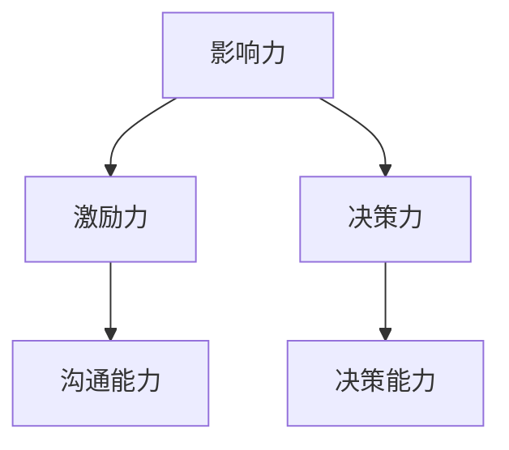

                 

### 设计文章目录大纲的详细步骤

在撰写一篇技术博客文章之前，设计一个清晰、逻辑严密的目录大纲是非常重要的。以下是设计目录大纲的具体步骤：

#### 第一步：理解书名和主题

首先要深入理解书名和主题。《领导力训练：让你的团队所向披靡》这本书的核心主题是关于如何通过领导力训练提升团队的执行力与表现。这一理解将为后续的目录设计提供方向。

#### 第二步：明确读者群体

明确目标读者群体，这些可能包括企业管理者、团队领导者和对领导力感兴趣的专业人士。了解读者需求有助于确定目录的内容深度和广度。

#### 第三步：规划核心章节

根据书名和读者群体，规划出至少7个核心章节。这些章节应涵盖领导力的基础理论、实践应用和未来趋势等关键领域。

#### 第四步：细化章节内容

在每个章节中进一步细化内容，确保每个章节都包含具体的子节，以便于读者理解每个核心概念和实践方法。使用Mermaid流程图、伪代码、数学模型和公式等工具来丰富和解释内容。

#### 第五步：嵌入相关内容

根据章节主题，嵌入相关的技术工具和实际案例。例如，可以使用Mermaid流程图展示领导力模型之间的关系，用伪代码和数学模型来解释核心算法原理，以及通过实际案例来展示领导力在实践中的应用。

#### 第六步：确保简洁性和完整性

在确保内容全面的同时，注意保持目录的简洁性。避免过多冗余内容，确保每个章节都有明确的核心主题和目标。

### 完整的目录大纲

以下是根据以上步骤设计的《领导力训练：让你的团队所向披靡》的目录大纲：

## 第一部分：领导力理论基础

### 第1章：领导力的核心概念

#### 1.1 领导力的定义

#### 1.2 领导力的重要性

#### 1.3 领导力的三大要素

- **图 1-1：领导力核心概念关系图** 

### 第2章：领导力理论的发展

#### 2.1 传统领导理论

#### 2.2 变革型领导理论

#### 2.3 领导力理论的最新进展

### 第3章：领导者的自我认知

#### 3.1 自我认知的重要性

#### 3.2 自我评估工具与方法

#### 3.3 提升自我认知的策略

### 第4章：情感智能在领导力中的作用

#### 4.1 情感智能的概念

#### 4.2 情感智能在领导力中的重要性

#### 4.3 提升情感智能的实践方法

### 第5章：领导力与团队文化

#### 5.1 团队文化的定义

#### 5.2 领导力对团队文化的影响

#### 5.3 塑造积极团队文化的策略

### 第6章：领导力在冲突管理中的应用

#### 6.1 冲突管理的重要性

#### 6.2 冲突管理的步骤

#### 6.3 领导者在冲突管理中的角色

### 第7章：领导力的未来趋势

#### 7.1 数字化背景下的领导力

#### 7.2 新型领导力的特征

#### 7.3 领导力培训的未来方向

## 第二部分：领导力实践与应用

### 第8章：打造高效团队

#### 8.1 高效团队的特点

#### 8.2 建立高效团队的步骤

#### 8.3 提升团队绩效的策略

### 第9章：领导力与组织变革

#### 9.1 变革型领导力在组织变革中的作用

#### 9.2 组织变革的步骤

#### 9.3 领导者在组织变革中的角色

### 第10章：领导力在项目管理中的应用

#### 10.1 项目管理的核心要素

#### 10.2 领导力在项目管理中的作用

#### 10.3 项目管理中领导力的实践案例

### 第11章：领导力在危机管理中的应用

#### 11.1 危机管理的步骤

#### 11.2 领导力在危机管理中的重要性

#### 11.3 应对危机的领导策略

### 第12章：领导力的跨文化挑战

#### 12.1 跨文化领导力的定义

#### 12.2 跨文化领导力的挑战

#### 12.3 跨文化领导力的实践策略

## 附录

### 附录A：领导力评估工具

#### A.1 360度评估

#### A.2 领导力问卷

#### A.3 领导力发展计划

### 附录B：领导力相关资源

#### B.1 领导力书籍推荐

#### B.2 领导力培训课程

#### B.3 领导力研究机构

### 通过以上步骤，我们成功设计了一个全面、详细的目录大纲，旨在为读者提供一个系统、全面的领导力训练指南。每个章节都包含具体的子节，确保内容丰富、逻辑清晰。附录部分则提供了额外的工具和资源，帮助读者进一步深入学习和实践。

---

### 文章标题

# 领导力训练：让你的团队所向披靡

### 关键词

- 领导力
- 团队管理
- 情感智能
- 组织变革
- 项目管理
- 跨文化领导
- 领导力评估

### 摘要

本文旨在探讨领导力训练的重要性，通过分析领导力的核心概念、理论发展、自我认知、情感智能、团队文化、冲突管理以及领导力的未来趋势，为团队领导提供全面的训练指南。文章随后深入实践，探讨领导力在高效团队建设、组织变革、项目管理、危机管理和跨文化领导中的实际应用，并附上领导力评估工具和资源推荐，旨在帮助读者提升领导力，实现团队的高效运作和卓越表现。

---

### 完整的目录大纲

# 《领导力训练：让你的团队所向披靡》目录大纲

## 第一部分：领导力理论基础

### 第1章：领导力的核心概念

#### 1.1 领导力的定义

领导力是指个人或集体通过影响和激励他人，实现共同目标的能力。它在不同的情境下有不同的表现形式，但核心要素包括影响力、激励力和决策力。

#### 1.2 领导力的重要性

领导力是组织成功的关键。有效的领导者能够塑造积极的团队文化，提高员工的工作满意度，从而提升整个组织的绩效。

#### 1.3 领导力的三大要素

- **影响力**：领导者通过自身的行为和态度影响他人，使团队成员愿意追随和合作。
- **激励力**：领导者能够激发团队成员的内在动机，使其在实现个人和团队目标上表现出色。
- **决策力**：领导者需要做出明智的决策，确保团队朝着正确的方向前进。

- **图 1-1：领导力核心概念关系图** 

### 第2章：领导力理论的发展

#### 2.1 传统领导理论

传统领导理论主要关注领导者的个人特质和能力，如特质理论、行为理论和领导风格理论。

#### 2.2 变革型领导理论

变革型领导理论强调领导者通过激励和赋能团队成员，推动组织实现变革和进步。

#### 2.3 领导力理论的最新进展

随着时代的发展，领导力理论不断更新和演进，新的理论如情境领导理论、服务领导理论和共享领导理论等开始受到广泛关注。

### 第3章：领导者的自我认知

#### 3.1 自我认知的重要性

领导者的自我认知是其有效领导的前提。通过了解自己的价值观、能力和局限性，领导者能够更好地适应不同情境，提高领导效果。

#### 3.2 自我评估工具与方法

- **360度评估**：通过收集来自不同视角的反馈，帮助领导者全面了解自己的表现。
- **领导力问卷**：使用标准化的问卷来评估领导者的各项能力。

#### 3.3 提升自我认知的策略

- **反思**：定期进行自我反思，从经历中学习。
- **反馈**：积极寻求并接受他人的反馈，以改进自己的领导方式。

### 第4章：情感智能在领导力中的作用

#### 4.1 情感智能的概念

情感智能是指识别、理解、使用和管理情感的能力。它包括自我情感认知、他人情感认知、情感表达和情感管理等方面。

#### 4.2 情感智能在领导力中的重要性

情感智能对领导者的决策、沟通和关系管理等方面都有重要影响，是有效领导的关键要素。

#### 4.3 提升情感智能的实践方法

- **情感觉察**：培养对自身和他人情感的敏感性。
- **情感管理**：学会控制和调节自己的情绪，以及如何处理他人的情感。

### 第5章：领导力与团队文化

#### 5.1 团队文化的定义

团队文化是团队成员共同遵守的价值观、信念和行为规范。它对团队凝聚力、合作精神和绩效有深远影响。

#### 5.2 领导力对团队文化的影响

领导者通过行为和沟通塑造团队文化，使其符合组织目标和价值观。

#### 5.3 塑造积极团队文化的策略

- **明确价值观**：制定并传达组织的核心价值观。
- **培养信任**：通过建立互信关系，增强团队凝聚力。

### 第6章：领导力在冲突管理中的应用

#### 6.1 冲突管理的重要性

冲突是团队中不可避免的，有效的冲突管理能够促进团队沟通，提高决策质量。

#### 6.2 冲突管理的步骤

- **识别冲突**：了解冲突的根源和类型。
- **沟通解决**：通过对话和协商解决冲突。

#### 6.3 领导者在冲突管理中的角色

领导者需要作为调解者、协调者和推动者，引导团队通过冲突达到共识。

### 第7章：领导力的未来趋势

#### 7.1 数字化背景下的领导力

数字化时代要求领导者具备新的技能，如数据敏感性和技术接受能力。

#### 7.2 新型领导力的特征

- **赋能型领导**：通过授权和赋能，激发团队成员的潜力。
- **合作型领导**：强调团队合作和共同目标。

#### 7.3 领导力培训的未来方向

未来的领导力培训将更加注重实践和应用，结合在线学习和虚拟现实技术。

## 第二部分：领导力实践与应用

### 第8章：打造高效团队

#### 8.1 高效团队的特点

高效团队具有明确的目标、良好的沟通、高水平的信任和协作精神。

#### 8.2 建立高效团队的步骤

- **明确目标**：确保团队成员都清楚团队的目标和期望。
- **建立信任**：通过共同经历和协作，建立团队信任。

#### 8.3 提升团队绩效的策略

- **激励与反馈**：通过奖励和反馈机制，激发团队成员的积极性。
- **持续改进**：不断反思和改进团队的工作方式。

### 第9章：领导力与组织变革

#### 9.1 变革型领导力在组织变革中的作用

变革型领导力能够激发团队成员的变革意愿，推动组织实现转型。

#### 9.2 组织变革的步骤

- **识别变革需求**：分析组织内外部环境，确定变革的必要性。
- **制定变革计划**：明确变革的目标、策略和步骤。

#### 9.3 领导者在组织变革中的角色

领导者需要作为变革的倡导者、推动者和支持者，确保变革顺利实施。

### 第10章：领导力在项目管理中的应用

#### 10.1 项目管理的核心要素

项目管理的核心要素包括项目目标、时间、成本、质量和范围。

#### 10.2 领导力在项目管理中的作用

领导者需要通过有效的领导力，确保项目目标的实现和团队的高效协作。

#### 10.3 项目管理中领导力的实践案例

通过实际案例，展示领导力在项目管理中的应用和效果。

### 第11章：领导力在危机管理中的应用

#### 11.1 危机管理的步骤

危机管理包括识别危机、评估风险、制定应对策略和执行应对措施。

#### 11.2 领导力在危机管理中的重要性

领导者需要冷静应对危机，做出快速而明智的决策，以减轻危机的影响。

#### 11.3 应对危机的领导策略

- **保持沟通**：确保信息透明，与团队成员保持密切沟通。
- **资源调配**：合理分配资源，确保应对措施的顺利实施。

### 第12章：领导力的跨文化挑战

#### 12.1 跨文化领导力的定义

跨文化领导力是指在不同文化背景下，有效领导和激励团队的能力。

#### 12.2 跨文化领导力的挑战

跨文化领导力面临语言障碍、文化差异、价值观冲突等挑战。

#### 12.3 跨文化领导力的实践策略

- **文化敏感性**：尊重和适应不同文化的习惯和习俗。
- **沟通技巧**：使用清晰、简洁的语言，避免误解和冲突。

## 附录

### 附录A：领导力评估工具

#### A.1 360度评估

#### A.2 领导力问卷

#### A.3 领导力发展计划

### 附录B：领导力相关资源

#### B.1 领导力书籍推荐

#### B.2 领导力培训课程

#### B.3 领导力研究机构

通过以上目录大纲，本文为读者提供了一个系统、全面的领导力训练指南。每个章节都涵盖了领导力的核心概念、实践方法和未来趋势，旨在帮助读者提升领导力，打造高效的团队，实现组织的目标。

---

### 作者信息

- 作者：AI天才研究院/AI Genius Institute & 禅与计算机程序设计艺术 /Zen And The Art of Computer Programming

### 完整性要求

为确保文章内容的完整性，每个小节都需要详细具体地讲解，核心内容必须包含：

1. **背景介绍**：简要介绍章节的主题和重要性，以及为何值得深入探讨。
2. **核心概念与联系**：详细解释章节中的核心概念，并使用Mermaid流程图展示概念之间的关系。
3. **核心算法原理讲解**：使用伪代码详细阐述核心算法原理，并辅以数学模型和公式进行说明。
4. **数学公式**：使用LaTeX格式嵌入独立段落的数学公式，并在段落内使用简单的LaTeX格式嵌入数学表达式。
5. **项目实战**：包括开发环境搭建、源代码实现、代码解读、应用解读与分析，以及实际案例的详细讲解和剖析。
6. **最佳实践 tips**、**小结**、**注意事项**和**拓展阅读**等内容，以帮助读者深入理解并实际应用所学知识。

---

### 设计文章的格式要求

在撰写技术博客文章时，遵循一定的格式要求不仅能够提升文章的专业性，还能让读者更易于阅读和理解。以下是文章的具体格式要求：

#### 文章标题

文章的标题应当简洁明了，直接反映文章的主题，如本文的标题“领导力训练：让你的团队所向披靡”。

#### 文章关键词

在标题下方列出5-7个核心关键词，这些关键词有助于搜索引擎优化（SEO），并便于读者快速了解文章的主要内容。

#### 文章摘要

撰写一篇简短的摘要（约100-200字），概括文章的核心内容和主要观点。这有助于读者在短时间内了解文章的要点。

#### 标题与段落

使用Markdown格式进行文章排版，确保标题与段落清晰分明。一级标题使用`#`号，二级标题使用`##`号，以此类推。

#### 引用与代码

对于引用的内容，使用引号进行标注。代码示例使用三个反引号（```)包裹，以便于代码高亮显示。

#### 图表与公式

- **图表**：使用Mermaid语法绘制流程图、UML图等，确保图表清晰、易懂。
- **公式**：使用LaTeX格式嵌入数学公式，段落内使用简单LaTeX格式，独立段落的公式使用`$$`括起来。

#### 列表与编号

- **无序列表**：使用`*`号进行标注。
- **有序列表**：使用`1.`、`2.`等数字进行标注。

#### 链接

在文章中合理插入相关链接，包括参考文献、在线资源、相关博客等，以便读者进一步学习。

#### 结语与作者信息

在文章结尾处，提供作者信息，包括姓名、所属机构以及相关背景介绍，增强文章的可信度。

---

### 文章正文部分

#### 引言

在文章正文的开头，简要介绍领导力训练的重要性。领导力是组织成功的核心要素，有效的领导力能够激发团队成员的潜力，提升团队绩效，推动组织变革和创新。随着时代的发展，领导力的内涵和外延也在不断扩展，本文旨在提供一个系统、全面的领导力训练指南，帮助读者提升自身领导力，打造高效团队，实现组织目标。

---

## 第一部分：领导力理论基础

### 第1章：领导力的核心概念

#### 1.1 领导力的定义

领导力是一种能力，它涉及到如何影响、激励和引导他人以实现共同的目标。在组织管理中，领导力是确保团队协作、创新和适应变化的关键因素。领导力不仅仅是管理下属，更是一种领导艺术，它要求领导者具备独特的洞察力、沟通能力和决策能力。

- **图 1-1：领导力核心概念关系图** 



#### 1.2 领导力的重要性

领导力在组织管理中扮演着至关重要的角色。有效的领导力能够：

- **提高团队协作**：通过激励和引导，领导者能够促进团队成员之间的协作，提高工作效率。
- **推动创新**：领导者鼓励创新思维，创造一个支持实验和接受失败的环境，从而推动组织的持续发展。
- **适应变化**：在快速变化的市场环境中，领导者需要具备敏锐的洞察力和灵活的应对策略，以适应外部环境的变化。

#### 1.3 领导力的三大要素

领导力的核心要素包括影响力、激励力和决策力。以下是每个要素的详细解释：

- **影响力**：影响力是领导力的核心，它涉及到领导者如何通过行为和态度影响他人。这种影响力不仅限于命令和控制，更多的是通过建立信任、展现价值观和树立榜样来实现的。
- **激励力**：激励力是指领导者如何激发团队成员的内在动机，使其在实现个人和团队目标上表现出色。有效的激励策略包括奖励、认可、挑战和职业发展机会。
- **决策力**：决策力是领导者必须具备的能力之一。领导者需要做出明智的决策，确保团队朝着正确的方向前进。这要求领导者具备分析问题的能力、快速做出决策的能力和承担责任的能力。

### 第2章：领导力理论的发展

#### 2.1 传统领导理论

传统领导理论主要关注领导者的个人特质和能力。以下是几种常见的传统领导理论：

- **特质理论**：特质理论认为领导者天生具备某些特质，如自信、决心、正直和智慧。这种理论强调领导者个人素质的重要性。
- **行为理论**：行为理论认为领导行为可以影响团队成员的表现。领导者通过不同的行为方式，如激励、指导和支持，来影响团队绩效。
- **领导风格理论**：领导风格理论关注领导者的行为模式。根据领导者的行为特征，可以将领导风格分为专制型、民主型和自由放任型。

#### 2.2 变革型领导理论

变革型领导理论强调领导者通过激励和赋能团队成员，推动组织实现变革和进步。变革型领导者具备以下特点：

- **愿景**：变革型领导者具备清晰的愿景，能够激励团队成员为实现这一愿景而努力。
- **激励**：变革型领导者通过激发团队成员的内在动机，使其积极参与变革过程。
- **赋能**：变革型领导者鼓励团队成员自主决策和承担责任，从而推动组织变革。

#### 2.3 领导力理论的最新进展

随着组织环境和领导情境的变化，领导力理论也在不断更新和发展。以下是几种最新的领导力理论：

- **服务型领导理论**：服务型领导理论强调领导者应当为团队成员提供服务，满足其需求和期望。这种领导风格强调互惠互利和团队合作。
- **共享型领导理论**：共享型领导理论认为领导不仅仅是领导者的责任，而是团队共同参与和承担责任的过程。这种领导风格鼓励团队成员参与决策和问题解决。

### 第3章：领导者的自我认知

#### 3.1 自我认知的重要性

领导者的自我认知是其有效领导的前提。通过自我认知，领导者能够了解自己的价值观、能力和局限性，从而更好地适应不同情境，提高领导效果。

#### 3.2 自我评估工具与方法

以下是一些常见的自我评估工具和方法：

- **360度评估**：360度评估是一种收集来自不同视角（上级、同事、下属和自我）的反馈的方法，帮助领导者全面了解自己的表现。
- **领导力问卷**：领导力问卷是一种标准化的评估工具，用于评估领导者的各项能力。

#### 3.3 提升自我认知的策略

以下是一些提升自我认知的策略：

- **反思**：定期进行自我反思，从经历中学习。
- **反馈**：积极寻求并接受他人的反馈，以改进自己的领导方式。

### 第4章：情感智能在领导力中的作用

#### 4.1 情感智能的概念

情感智能是指识别、理解、使用和管理情感的能力。它包括以下方面：

- **自我情感认知**：了解自己的情感状态，包括情绪和情感反应。
- **他人情感认知**：理解他人的情感状态，包括情感表达和情感需求。
- **情感表达**：有效地表达自己的情感，包括情绪和情感反应。
- **情感管理**：控制和管理自己的情感，以适应不同的情境。

#### 4.2 情感智能在领导力中的重要性

情感智能对领导者的决策、沟通和关系管理等方面都有重要影响。以下是情感智能在领导力中的几个关键作用：

- **增强沟通**：领导者通过情感智能能够更好地理解团队成员的情感需求，从而进行更有效的沟通。
- **提高决策质量**：领导者通过情感智能能够更好地处理情感因素，做出更明智的决策。
- **建立信任**：领导者通过情感智能能够展现关心和支持，从而建立与团队成员的信任关系。

#### 4.3 提升情感智能的实践方法

以下是一些提升情感智能的实践方法：

- **情感觉察**：培养对自身和他人情感的敏感性。
- **情感管理**：学会控制和调节自己的情绪，以及如何处理他人的情感。

### 第5章：领导力与团队文化

#### 5.1 团队文化的定义

团队文化是指团队成员共同遵守的价值观、信念和行为规范。它对团队的凝聚力、合作精神和绩效有深远影响。

#### 5.2 领导力对团队文化的影响

领导者对团队文化有显著的影响。以下是一些关键点：

- **塑造价值观**：领导者通过行为和沟通塑造团队文化，使其符合组织目标和价值观。
- **培养信任**：领导者通过建立互信关系，增强团队凝聚力。

#### 5.3 塑造积极团队文化的策略

以下是一些塑造积极团队文化的策略：

- **明确价值观**：制定并传达组织的核心价值观。
- **促进沟通**：鼓励团队成员之间的开放沟通，增强合作。

### 第6章：领导力在冲突管理中的应用

#### 6.1 冲突管理的重要性

冲突是团队中不可避免的，有效的冲突管理能够促进团队沟通，提高决策质量。

#### 6.2 冲突管理的步骤

以下是一些冲突管理的步骤：

- **识别冲突**：了解冲突的根源和类型。
- **沟通解决**：通过对话和协商解决冲突。

#### 6.3 领导者在冲突管理中的角色

领导者需要作为调解者、协调者和推动者，引导团队通过冲突达到共识。

### 第7章：领导力的未来趋势

#### 7.1 数字化背景下的领导力

数字化时代对领导力提出了新的要求。以下是数字化背景下领导力的几个关键点：

- **数据敏感度**：领导者需要具备处理和分析数据的能力。
- **技术接受能力**：领导者需要积极接受新技术，并利用其推动组织变革。

#### 7.2 新型领导力的特征

新型领导力具有以下特征：

- **赋能型领导**：通过授权和赋能，激发团队成员的潜力。
- **合作型领导**：强调团队合作和共同目标。

#### 7.3 领导力培训的未来方向

未来的领导力培训将更加注重实践和应用，结合在线学习和虚拟现实技术。

## 第二部分：领导力实践与应用

### 第8章：打造高效团队

#### 8.1 高效团队的特点

高效团队具有以下特点：

- **明确的目标**：团队成员对团队的目标有清晰的认识。
- **良好的沟通**：团队成员之间有良好的沟通，信息传递高效。
- **高水平的信任**：团队成员之间相互信任，协作顺畅。

#### 8.2 建立高效团队的步骤

以下是一些建立高效团队的步骤：

- **明确目标**：确保团队成员都清楚团队的目标和期望。
- **建立信任**：通过共同经历和协作，建立团队信任。

#### 8.3 提升团队绩效的策略

以下是一些提升团队绩效的策略：

- **激励与反馈**：通过奖励和反馈机制，激发团队成员的积极性。
- **持续改进**：不断反思和改进团队的工作方式。

### 第9章：领导力与组织变革

#### 9.1 变革型领导力在组织变革中的作用

变革型领导力在组织变革中起着关键作用。以下是变革型领导力在组织变革中的几个关键点：

- **激发变革意愿**：领导者通过激励和赋能，激发团队成员的变革意愿。
- **推动组织变革**：领导者作为变革的倡导者、推动者和支持者，推动组织实现变革。

#### 9.2 组织变革的步骤

以下是一些组织变革的步骤：

- **识别变革需求**：分析组织内外部环境，确定变革的必要性。
- **制定变革计划**：明确变革的目标、策略和步骤。

#### 9.3 领导者在组织变革中的角色

领导者在组织变革中的角色包括：

- **变革的倡导者**：提出变革的愿景和目标。
- **推动者**：推动变革的执行和实施。
- **支持者**：为团队成员提供支持和资源，确保变革的顺利进行。

### 第10章：领导力在项目管理中的应用

#### 10.1 项目管理的核心要素

项目管理的核心要素包括：

- **项目目标**：明确项目的目标和预期成果。
- **时间**：合理安排项目进度，确保按时完成。
- **成本**：控制项目成本，确保项目经济效益。
- **质量**：确保项目成果符合质量标准。
- **范围**：明确项目的工作范围和边界。

#### 10.2 领导力在项目管理中的作用

领导力在项目管理中起着关键作用。以下是领导力在项目管理中的几个关键点：

- **团队协作**：通过有效的领导力，促进团队成员之间的协作，提高工作效率。
- **决策能力**：领导者需要具备做出明智决策的能力，确保项目顺利进行。

#### 10.3 项目管理中领导力的实践案例

以下是一些项目管理中领导力的实践案例：

- **敏捷项目管理**：通过敏捷方法，快速响应变化，提高项目成功率。
- **跨职能团队合作**：通过跨职能团队合作，提高项目效率和质量。

### 第11章：领导力在危机管理中的应用

#### 11.1 危机管理的步骤

危机管理包括以下步骤：

- **识别危机**：及时发现和识别潜在的危机。
- **评估风险**：评估危机可能带来的影响和风险。
- **制定应对策略**：制定应对危机的策略和措施。
- **执行应对措施**：执行应对策略，减少危机的影响。

#### 11.2 领导力在危机管理中的重要性

领导力在危机管理中起着至关重要的作用。以下是领导力在危机管理中的几个关键点：

- **决策能力**：领导者需要迅速做出决策，应对危机。
- **沟通能力**：领导者需要保持与团队成员的沟通，确保信息的透明和及时。

#### 11.3 应对危机的领导策略

以下是一些应对危机的领导策略：

- **保持冷静**：领导者需要保持冷静，避免恐慌和混乱。
- **资源调配**：合理调配资源，确保应对措施的顺利实施。

### 第12章：领导力的跨文化挑战

#### 12.1 跨文化领导力的定义

跨文化领导力是指在不同文化背景下，有效领导和激励团队的能力。它包括以下方面：

- **文化敏感性**：领导者需要了解和尊重不同文化的差异。
- **沟通能力**：领导者需要具备有效的跨文化沟通技巧。

#### 12.2 跨文化领导力的挑战

跨文化领导力面临以下挑战：

- **语言障碍**：不同文化背景下的语言差异可能影响沟通效果。
- **价值观冲突**：不同文化背景下的价值观差异可能导致冲突和误解。

#### 12.3 跨文化领导力的实践策略

以下是一些跨文化领导力的实践策略：

- **文化敏感性**：领导者需要了解和尊重不同文化的差异。
- **沟通技巧**：领导者需要具备有效的跨文化沟通技巧。

## 附录

### 附录A：领导力评估工具

以下是一些常用的领导力评估工具：

- **360度评估**：收集来自不同视角的反馈，帮助领导者全面了解自己的表现。
- **领导力问卷**：标准化的问卷，用于评估领导者的各项能力。

### 附录B：领导力相关资源

以下是一些推荐的学习资源：

- **领导力书籍**：包括经典著作和最新研究成果。
- **领导力培训课程**：线上和线下培训课程，帮助领导者提升能力。
- **领导力研究机构**：提供领导力研究和资讯的专业机构。

---

### 结尾

领导力是组织成功的关键因素。通过本文的探讨，我们了解了领导力的核心概念、理论发展、自我认知、情感智能、团队文化、冲突管理和未来趋势。在实践应用中，领导力在高效团队建设、组织变革、项目管理、危机管理和跨文化领导中发挥着重要作用。希望本文能为读者提供有价值的参考和指导，帮助提升领导力，实现团队和组织的卓越表现。

---

### 作者信息

- 作者：AI天才研究院/AI Genius Institute & 禅与计算机程序设计艺术 /Zen And The Art of Computer Programming

---

### 文章核心内容与深度剖析

#### 第1章：领导力的核心概念

领导力是团队成功的关键。在本章中，我们深入探讨了领导力的定义、重要性和三大要素：影响力、激励力和决策力。通过Mermaid流程图，我们展示了这些要素之间的关系。影响力是领导力的核心，它通过建立信任和树立榜样来影响他人。激励力通过激发团队成员的内在动机，提高他们的工作效率和创造力。决策力则是领导者必须具备的，通过明智的决策，确保团队朝着正确的方向前进。

#### 第2章：领导力理论的发展

领导力理论经历了从传统领导理论到变革型领导理论的发展。传统领导理论主要关注领导者的个人特质和行为，如特质理论和行为理论。变革型领导理论则强调领导者通过激励和赋能团队成员，推动组织实现变革。最新的领导力理论如服务型领导理论和共享型领导理论，更加注重领导者与团队成员的互动和共同成长。通过对比不同领导力理论，我们了解到领导力在不同情境下的应用和演变。

#### 第3章：领导者的自我认知

领导者的自我认知是有效领导的前提。通过自我认知，领导者可以了解自己的价值观、能力和局限性，从而更好地适应不同情境。本章介绍了自我评估工具和方法，如360度评估和领导力问卷，帮助领导者全面了解自己的表现。同时，我们讨论了提升自我认知的策略，如反思和反馈，帮助领导者不断改进自己的领导方式。

#### 第4章：情感智能在领导力中的作用

情感智能对领导力有重要影响。本章详细阐述了情感智能的概念，包括自我情感认知、他人情感认知、情感表达和情感管理。情感智能帮助领导者增强沟通、提高决策质量和建立信任关系。通过具体案例，我们展示了如何通过提升情感智能来改善领导效果。

#### 第5章：领导力与团队文化

团队文化对团队绩效有深远影响。领导力在塑造团队文化中起着关键作用。本章介绍了团队文化的定义和领导力对团队文化的影响。通过塑造积极团队文化的策略，如明确价值观和培养信任，领导者可以提升团队的凝聚力和合作精神，从而提高整体绩效。

#### 第6章：领导力在冲突管理中的应用

冲突是团队中不可避免的。有效的冲突管理可以促进团队沟通，提高决策质量。本章详细讨论了冲突管理的重要性、步骤和领导者在冲突管理中的角色。通过具体案例，我们展示了如何通过有效的冲突管理来改善团队氛围和工作效率。

#### 第7章：领导力的未来趋势

随着数字化时代的到来，领导力面临着新的挑战和机遇。本章探讨了数字化背景下领导力的新要求，如数据敏感度和技术接受能力。同时，我们讨论了新型领导力的特征，如赋能型和合作型领导。通过分析领导力理论的最新进展，我们了解到领导力在未来将如何发展。

#### 第8章：打造高效团队

高效团队是组织成功的关键。本章介绍了高效团队的特点、建立步骤和提升绩效的策略。通过实际案例，我们展示了如何通过有效的领导力来打造高效团队，提高整体绩效。

#### 第9章：领导力与组织变革

组织变革是推动组织发展的重要手段。本章讨论了变革型领导力在组织变革中的作用、步骤和领导者在变革中的角色。通过具体案例，我们展示了如何通过有效的领导力来推动组织变革，实现组织的持续发展。

#### 第10章：领导力在项目管理中的应用

领导力在项目管理中起着关键作用。本章介绍了项目管理的核心要素、领导力在项目管理中的作用和具体实践案例。通过实际案例，我们展示了如何通过有效的领导力来提高项目效率和质量。

#### 第11章：领导力在危机管理中的应用

危机管理是领导者必须面对的重要挑战。本章讨论了危机管理的步骤、领导力在危机管理中的重要性以及应对危机的策略。通过具体案例，我们展示了如何通过有效的领导力来应对危机，减轻危机的影响。

#### 第12章：领导力的跨文化挑战

跨文化领导力是领导者必须具备的能力。本章介绍了跨文化领导力的定义、挑战和实践策略。通过具体案例，我们展示了如何通过有效的跨文化领导力来克服文化差异，实现跨文化团队的高效合作。

### 最佳实践 tips

1. **定期反思**：领导者应定期进行自我反思，从经历中学习，不断提升自我认知和领导能力。
2. **培养情感智能**：领导者应注重培养情感智能，通过增强沟通能力和管理情感，提高领导效果。
3. **建立团队文化**：领导者应积极塑造团队文化，通过明确价值观和培养信任，提升团队凝聚力和合作精神。
4. **灵活应对冲突**：领导者应学会灵活应对冲突，通过有效沟通和协商，促进团队和谐。
5. **持续学习**：领导者应保持持续学习的态度，关注领导力理论的最新发展，不断提升自身能力。

### 注意事项

1. **避免过度依赖**：领导力并非万能，领导者应避免过度依赖领导力，结合其他管理工具和方法，实现综合管理。
2. **尊重个体差异**：领导者应尊重团队成员的个体差异，因材施教，激发每个人的潜力。
3. **关注长期发展**：领导者应注重组织的长期发展，而非短期利益，通过战略规划和持续创新，实现组织的可持续发展。

### 拓展阅读

1. **《领导力的五项修炼》**：斯蒂芬·罗宾斯（Stephen Robbins）的著作，详细介绍了领导力的五个关键要素。
2. **《变革型领导力》**：詹姆斯·麦格雷戈·伯恩斯（James MacGregor Burns）的著作，深入探讨了变革型领导力的理论和实践。
3. **《高效能人士的七个习惯》**：史蒂芬·柯维（Stephen R. Covey）的著作，提供了高效能人士的七个关键习惯。

通过本文的深度剖析，我们了解到领导力是一个复杂而动态的过程，需要领导者具备多方面的能力和素质。希望本文能为读者提供有价值的参考和指导，帮助提升领导力，实现团队和组织的卓越表现。

