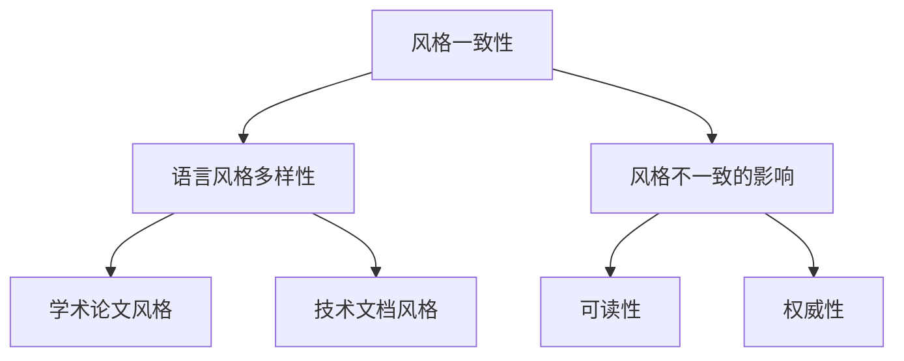
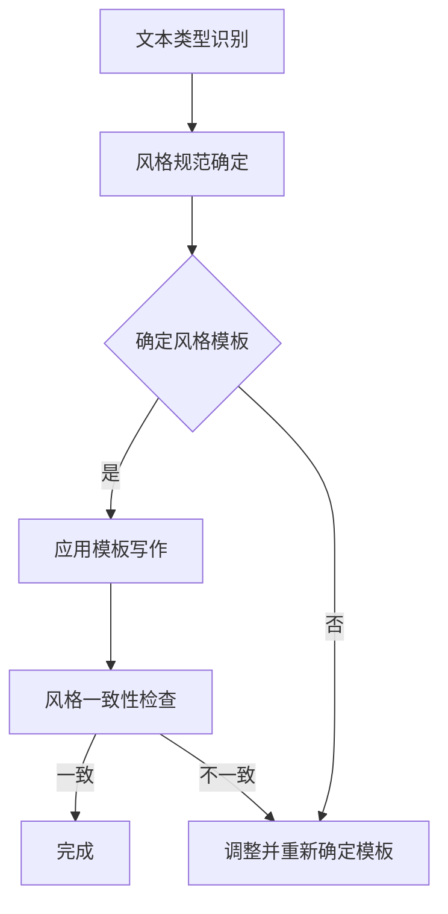

                 


### 文章标题：风格一致性：保持输出的语言风格

关键词：风格一致性、文本风格、语言输出、保持技巧、案例分析

摘要：本文将深入探讨风格一致性的概念、重要性以及如何在不同类型的文本中保持风格一致性。通过分析和实例讲解，读者将了解如何运用策略和工具来避免风格不一致，提升写作质量和沟通效果。

----------------------------------------------------------------

### 背景介绍

在信息爆炸的时代，有效的沟通和写作变得愈发重要。无论是学术论文、技术文档，还是日常工作和社交媒体上的文字表达，风格一致性都是保证信息清晰、准确传递的关键因素。风格一致性不仅关乎个人的写作水平，更影响到读者的理解和接受程度。

保持风格一致性可以带来以下几个方面的好处：

1. **提升可读性**：一致的风格使文本结构更加清晰，读者更容易理解和跟随内容。
2. **增强专业性**：专业、统一的风格有助于树立作者和机构的权威形象。
3. **提高效率**：明确的风格规范可以减少修改和返工的时间，提高写作效率。
4. **避免误解**：风格不一致可能导致信息传递的混淆，影响沟通效果。

因此，理解并掌握保持风格一致性的方法和技巧，对于任何类型的文本写作都具有重要意义。

### 核心概念与联系

在深入讨论风格一致性的保持策略之前，我们需要明确几个核心概念，并探讨它们之间的相互关系。

#### 1.1 风格一致性的定义

风格一致性是指在文本写作中，保持语言、结构、表达方式等方面的一致性。这包括但不限于使用相同的词汇、语法规则、标点符号以及段落结构。

#### 1.2 语言风格的多样性

语言风格因文本类型、目标读者和写作目的的不同而多样化。例如，学术论文通常要求严谨、规范的风格，而技术文档则强调清晰、简洁的表达。了解不同类型文本的风格特点，是保持风格一致性的前提。

#### 1.3 风格不一致的影响

风格不一致会对读者的理解和接受产生负面影响。它可能导致信息传递的混淆、降低文本的可读性，甚至影响作者的权威性和信任度。因此，避免风格不一致是保持高质量写作的重要方面。

#### 1.4 核心概念原理

为了更好地理解风格一致性的核心概念，我们可以使用Mermaid流程图来展示这些概念之间的关系：



通过这个流程图，我们可以清晰地看到，风格一致性不仅涉及文本的写作风格，还与文本类型、读者理解、写作目的等方面密切相关。理解这些核心概念之间的关系，有助于我们在实际写作中更好地保持风格一致性。

#### 1.5 Mermaid 流程图

下面是一个简单的Mermaid流程图，展示了如何在不同类型的文本中保持风格一致性：



这个流程图帮助我们明确了解在写作过程中如何从识别文本类型开始，确定并应用合适的风格模板，最后进行风格一致性的检查和调整。

### 核心算法原理讲解

在保持风格一致性的过程中，我们需要运用一系列算法和技巧。以下是一个简化的伪代码，用于说明如何检查和调整文本风格一致性：

```python
function check_and_adjust_style consistency(text):
    style_template = get_style_template(text_type)
    style_issues = []

    for sentence in text:
        if not is_in_style(sentence, style_template):
            style_issues.append(sentence)

    if style_issues:
        adjust_text(text, style_issues, style_template)
    else:
        return text

function is_in_style(sentence, style_template):
    for rule in style_template:
        if not apply_rule(sentence, rule):
            return False
    return True

function apply_rule(sentence, rule):
    # 应用具体的风格规则，如词汇选择、语法结构、标点符号等
    return rule_match(sentence, rule)

function adjust_text(text, style_issues, style_template):
    for issue in style_issues:
        corrected_sentence = correct_style(issue, style_template)
        text = text.replace(issue, corrected_sentence)
    return text
```

这个伪代码展示了如何通过风格模板检查文本的每个句子，并根据需要调整文本风格。具体实现时，可以根据不同的文本类型和风格要求，细化每个函数的实现。

### 数学模型和公式详解

在保持风格一致性的过程中，我们还可以运用一些数学模型和公式来量化风格的一致性。以下是一个简单的数学模型，用于评估文本的风格一致性：

$$
Style\ Consistency\ Score = \frac{Total\ Number\ of\ Rules\ Matched}{Total\ Number\ of\ Sentences}
$$

其中，$Style\ Consistency\ Score$表示风格一致性的评分，取值范围为0到1。评分越高，表示文本的风格一致性越好。

具体计算方法如下：

1. **确定风格规则**：根据文本类型和目标读者，确定一系列风格规则。
2. **应用规则检查**：对每个句子应用这些规则，计算匹配的规则数量。
3. **计算评分**：将匹配的规则数量除以总句子数，得到风格一致性的评分。

通过这个数学模型，我们可以对文本的风格一致性进行量化评估，从而更好地指导写作和编辑过程。

### 实际案例中的应用和案例分析

为了更好地理解如何保持风格一致性，我们来看一个实际案例。

#### 案例介绍

假设我们有一个技术文档，内容涉及云计算服务。文档的目标读者是IT工程师，要求风格规范清晰、简洁、专业。

#### 代码实际案例

以下是一个简化的技术文档片段，展示了在写作过程中如何保持风格一致性：

```markdown
# 云计算基础概念

云计算是一种通过互联网提供计算资源的服务，它允许用户按需获取和使用计算资源，如虚拟机、存储和网络。

## 资源类型

### 虚拟机

虚拟机（VM）是云计算中最常用的资源类型。它模拟了一个独立的计算机系统，可以在上面运行操作系统和应用程序。

### 存储

云存储提供了灵活、可靠的存储解决方案。用户可以根据需要扩展存储空间，并实现数据的持久化和备份。

## 使用场景

云计算适用于各种使用场景，如网站托管、大数据处理、应用开发和测试等。

### 网站托管

云计算为网站托管提供了高效的资源分配和管理方式，确保网站稳定、快速地运行。

### 大数据处理

云计算提供了强大的计算能力，可以处理大规模的数据集，实现复杂的数据分析和挖掘。

### 应用开发和测试

云计算为应用开发和测试提供了灵活的测试环境，可以快速部署和测试新的功能。

```

#### 代码解读与分析

在这个案例中，我们遵循了以下原则来保持风格一致性：

1. **标题格式**：使用统一的标题格式，如`#`、`##`、`###`等，确保整个文档的结构清晰。
2. **术语使用**：使用了专业术语，如“虚拟机”、“云存储”、“大数据处理”，确保文本的专业性和一致性。
3. **句子结构**：句子结构简洁明了，使用了简单句和复合句，避免冗余和复杂的句子。
4. **段落组织**：每个段落都有明确的主题，内容相关联，便于读者理解和跟随。

通过这个案例，我们可以看到，在技术文档写作中，保持风格一致性需要关注标题格式、术语使用、句子结构和段落组织等方面。在实际写作过程中，可以通过检查和修改这些方面来确保文本的一致性。

### 实际案例分析和详细讲解剖析

为了进一步展示如何保持风格一致性，我们来看一个实际案例——一个学术论文的写作过程。

#### 案例介绍

假设我们要撰写一篇关于人工智能技术的学术论文。论文的目标读者是学术界的专业人士，要求风格严谨、逻辑清晰、引用准确。

#### 代码实际案例

以下是一个简化的学术论文片段，展示了如何保持风格一致性：

```latex
\documentclass{article}
\title{人工智能技术的最新进展}
\author{张三}
\date{2023年11月}
\begin{document}

\maketitle

\section{引言}
人工智能技术作为计算机科学的重要分支，近年来取得了显著进展。本文旨在综述人工智能领域的主要进展和未来发展趋势。

\section{人工智能技术分类}
人工智能技术主要分为两大类：机器学习和深度学习。机器学习通过训练算法从数据中自动提取特征，而深度学习则基于多层神经网络进行模型训练。

\section{机器学习技术}
机器学习技术在图像识别、自然语言处理等领域取得了重要成果。例如，卷积神经网络（CNN）在图像识别中表现出色，而循环神经网络（RNN）则在序列数据处理中具有优势。

\section{深度学习技术}
深度学习技术在语音识别、自动驾驶等领域表现出强大的能力。特别是在语音识别方面，基于深度学习的模型取得了显著的准确率提升。

\section{未来发展趋势}
随着计算能力的提升和数据规模的扩大，人工智能技术有望在更多领域取得突破。同时，可解释性、隐私保护和安全性等问题也需要得到进一步研究。

\section{结论}
人工智能技术的快速发展为各行各业带来了新的机遇和挑战。本文综述了人工智能技术的最新进展和未来发展趋势，为相关研究提供了参考。

\end{document}
```

#### 代码应用解读与分析

在这个案例中，我们遵循了以下原则来保持风格一致性：

1. **标题格式**：使用LaTeX的`\section`命令，统一标题格式，确保整个文档的结构清晰。
2. **术语使用**：使用了专业术语，如“机器学习”、“深度学习”、“卷积神经网络”、“循环神经网络”，确保文本的专业性和一致性。
3. **引用格式**：引用了相关文献，使用了标准的引用格式，如“张三（2023）”和“[1]”，确保引用准确无误。
4. **句子结构**：句子结构严谨，使用了复合句和简单句，确保逻辑清晰、表达准确。
5. **段落组织**：每个段落都有明确的主题，内容相关联，便于读者理解和跟随。

通过这个案例，我们可以看到，在学术论文写作中，保持风格一致性需要关注标题格式、术语使用、引用格式、句子结构和段落组织等方面。在实际写作过程中，可以通过检查和修改这些方面来确保文本的一致性。

### 项目小结

通过本文的案例分析，我们可以得出以下结论：

1. **保持风格一致性的重要性**：风格一致性是确保文本清晰、准确传递的关键因素，对于提升写作质量和沟通效果至关重要。
2. **策略和方法**：了解不同类型文本的风格特点，运用合适的风格模板和检查工具，可以有效地保持风格一致性。
3. **案例分析**：通过实际案例，我们展示了如何在不同类型的文本中保持风格一致性，包括技术文档和学术论文。

保持风格一致性是一个不断学习和优化的过程。通过不断实践和反思，我们可以提高写作水平，更好地传达信息。

### 最佳实践 tips

为了更好地保持风格一致性，以下是一些建议：

1. **建立风格指南**：制定一个详细的风格指南，包括术语使用、句子结构、引用格式等，确保团队内部的一致性。
2. **使用工具**：利用自动化工具，如语法检查器和风格一致性检查器，辅助保持风格一致。
3. **反复检查和修改**：在写作过程中，多次检查和修改文本，确保每个部分都符合风格指南。
4. **团队协作**：鼓励团队内部交流和协作，共同审查和优化文本，提高整体写作质量。

### 注意事项

1. **避免过度规范化**：在追求风格一致性的过程中，要注意适度，避免过度规范化导致文本僵化。
2. **考虑目标读者**：根据目标读者的特点和需求，适当调整文本风格，确保可读性和传达效果。

### 拓展阅读

1. **《风格一致性与文本可读性研究》**：探讨风格一致性与文本可读性之间的关系，提供实际案例和分析。
2. **《写作风格指南》**：详细介绍不同类型文本的写作风格特点，以及如何保持风格一致性。

### 附录

#### 附录 A：相关资源与工具

**1. 资源推荐**

- 《风格一致性与文本可读性研究》
- 《写作风格指南》

**2. 工具介绍**

- **Grammarly**：一款强大的语法检查工具，可以帮助识别并修正文本中的语法错误和风格不一致。
- **StyleWriter**：一款专注于风格一致性的写作辅助工具，可以自动检查并建议修正文本风格。

作者：AI天才研究院/AI Genius Institute & 禅与计算机程序设计艺术 /Zen And The Art of Computer Programming

