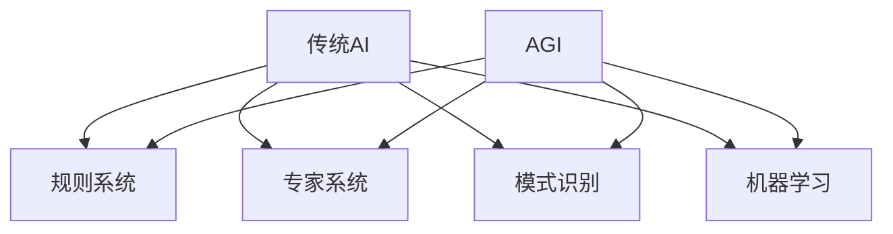
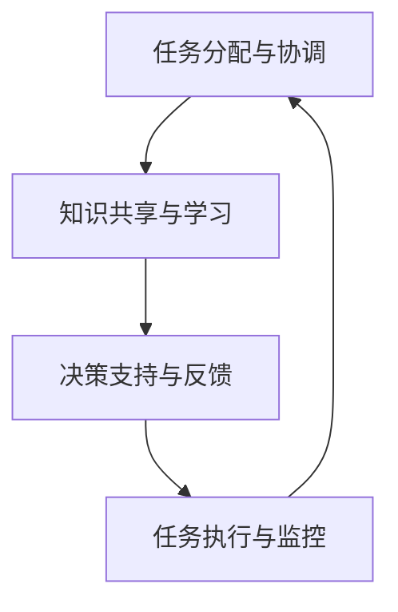

                 

### 《AGI与人类协作：增强智能的新范式》

#### 关键词
- AGI
- 增强智能
- 人类协作
- 深度学习
- 自然语言处理
- 计算机视觉

#### 摘要
本文深入探讨了增强智能（AGI）的概念、发展历程以及与人类协作的新范式。通过分析AGI的核心技术——机器学习、深度学习、自然语言处理和计算机视觉，我们阐述了这些技术在实现AGI中的作用和挑战。同时，本文探讨了AGI与人类协作的模型与框架，以及设计增强智能系统的原则。最后，本文展望了AGI对未来社会的影响，并提出了进一步的研究方向和挑战。

## 第一部分：AGI概述与历史发展

### 第1章：什么是AGI

#### 1.1 AGI的定义与特征

AGI（Artificial General Intelligence，人工通用智能）是指具有与人类相似的广泛认知能力，能够在多种复杂环境和任务中表现优异的人工智能系统。与传统AI（如专家系统、基于规则的系统等）相比，AGI具有以下几个显著特征：

1. **通用性**：AGI应该具备广泛的知识和应用能力，能够在不同的领域和任务中自主学习和适应。
2. **自主性**：AGI能够自我驱动，主动探索和解决问题，而不仅仅是执行预定义的指令。
3. **理解能力**：AGI应该能够理解自然语言、符号系统和复杂情境，从而进行逻辑推理和决策。
4. **灵活性**：AGI能够在不同的环境和任务中表现出高度的灵活性和适应性。

为了更直观地理解AGI与传统AI的区别，我们可以用Mermaid流程图来表示两者之间的关系：

在这个图中，传统AI包括规则系统、专家系统、模式识别和机器学习等技术。而AGI则涵盖了所有这些技术，并在此基础上进一步发展，以实现更广泛的认知能力和自主性。

#### 1.2 AGI与传统AI的区别

传统AI和AGI之间的主要区别在于目标和能力。传统AI旨在解决特定领域的问题，例如图像识别、语音识别、机器翻译等，而AGI则追求在多种领域和任务中表现出人类水平的智能。

传统AI依赖于预定义的规则和算法，而AGI则通过自我学习和自我调整来提高性能。传统AI通常需要人类专家进行大量的标注和调整，而AGI则能够自动从数据中学习，减少对人类干预的依赖。

此外，传统AI通常缺乏理解能力，难以处理不确定性和复杂情境，而AGI则具备更高级的推理和理解能力，能够更好地应对现实世界的复杂性。

#### 1.3 AGI的技术需求

要实现AGI，需要解决以下几个关键的技术挑战：

1. **大规模数据集**：AGI需要大量的高质量数据来训练和验证模型。这些数据应覆盖各种领域和任务，以使AGI具备广泛的认知能力。
2. **高效算法**：AGI需要高效的算法来处理大量的数据，并快速适应新的环境和任务。
3. **自主学习能力**：AGI需要具备强大的自我学习能力，能够从数据中自动提取知识，并在新的情境中应用这些知识。
4. **灵活的推理能力**：AGI需要具备灵活的推理能力，能够处理不确定性和复杂情境，并作出合理的决策。

在下一章中，我们将回顾AGI的发展历史，了解AGI概念提出的时间线和技术里程碑。

## 第一部分：AGI概述与历史发展

### 第2章：AGI的发展历史

#### 2.1 AGI的概念提出

AGI的概念最早可以追溯到20世纪50年代。当时，人工智能的研究者们开始探讨如何使计算机具有类似人类的智能。1950年，艾伦·图灵发表了著名的论文《计算机器与智能》，提出了图灵测试作为评估机器智能的标准。这一时期，人工智能研究主要集中在逻辑推理和符号处理方面，如专家系统和基于规则的系统。

然而，随着计算机性能的提升和数据量的增加，研究者们逐渐意识到，仅依靠逻辑推理和规则系统难以实现真正的智能。因此，在20世纪80年代，机器学习技术开始兴起，为AGI的研究提供了新的思路。

#### 2.2 AGI的技术里程碑

1. **深度学习的兴起（1980年代-2010年代）**
   
   在1980年代，深度学习作为一种人工神经网络技术被提出。然而，由于计算能力的限制，深度学习在早期并未取得显著进展。直到2010年代，随着计算能力的提升和大数据的涌现，深度学习逐渐成为人工智能领域的研究热点。2012年，深度学习在ImageNet图像识别挑战中取得了突破性成果，标志着深度学习的崛起。

2. **自然语言处理的发展（1990年代-2010年代）**
   
   自然语言处理（NLP）是AGI的重要组成部分。在1990年代，研究者们提出了许多NLP模型，如统计语言模型、隐马尔可夫模型和递归神经网络等。然而，NLP的实际应用仍然受到限制。2010年代，随着深度学习技术的应用，NLP取得了显著进展，如机器翻译、语音识别和问答系统等。

3. **计算机视觉的突破（2000年代-2010年代）**
   
   计算机视觉是AGI的另一个关键领域。在2000年代，研究者们提出了许多计算机视觉算法，如卷积神经网络（CNN）和目标检测算法。2010年代，计算机视觉在图像识别、目标检测和视频分析等方面取得了突破性进展。

#### 2.3 当前AGI研究的进展

当前，AGI的研究正在迅速发展。以下是一些重要的进展：

1. **多模态学习**：多模态学习是指将不同类型的数据（如文本、图像、声音等）整合起来，以实现更高级的智能。当前，研究者们正在探索如何将多模态数据融合到AGI系统中，以提高其泛化能力和智能水平。
2. **强化学习**：强化学习是一种通过试错方式来学习策略的机器学习技术。在AGI中，强化学习可以用于训练智能体在复杂环境中作出决策。当前，研究者们正在探索如何将强化学习与深度学习、自然语言处理等相结合，以实现更强大的AGI系统。
3. **跨学科研究**：AGI的研究涉及多个学科，包括计算机科学、认知科学、心理学、神经科学等。跨学科研究有助于解决AGI面临的复杂问题，如认知建模、人类-机器交互等。

总之，AGI的发展历史展示了人工智能从简单到复杂、从特定任务到通用智能的演变过程。当前，随着技术的进步和多学科研究的深入，AGI的研究正在取得重要进展。在下一章中，我们将探讨机器学习、深度学习等核心技术在实现AGI中的作用。

### 第3章：机器学习与深度学习基础

#### 3.1 机器学习的概述

机器学习（Machine Learning，ML）是一门研究如何让计算机从数据中自动学习和改进性能的学科。在机器学习中，计算机通过分析大量数据，从中提取规律和模式，并使用这些规律和模式来作出预测或决策。

机器学习可以分为以下几类：

1. **监督学习（Supervised Learning）**：监督学习是机器学习中的一种主要方法，其核心思想是使用标记数据集来训练模型。标记数据集包含输入数据和对应的输出标签。训练过程中，模型通过学习输入和输出之间的映射关系，以提高预测的准确性。常见的监督学习算法包括线性回归、逻辑回归、支持向量机（SVM）和决策树等。

2. **无监督学习（Unsupervised Learning）**：无监督学习是另一种机器学习方法，其训练数据集不包含标签。无监督学习的目标是从未标记的数据中发现隐藏的结构或模式。常见的无监督学习算法包括聚类算法（如K-means、DBSCAN）和降维算法（如主成分分析PCA、t-SNE）。

3. **半监督学习（Semi-Supervised Learning）**：半监督学习结合了监督学习和无监督学习的方法，其训练数据集包含少量标记数据和大量未标记数据。半监督学习利用未标记数据中的信息来提高模型的性能，从而减少对大量标记数据的依赖。

#### 3.2 深度学习的基本原理

深度学习（Deep Learning，DL）是机器学习的一个分支，它通过构建多层次的神经网络来实现自动特征提取和高级抽象。深度学习的核心思想是利用大量数据来训练深层神经网络，使其能够自动学习复杂的数据表示。

深度学习的基本组件包括：

1. **神经网络（Neural Networks）**：神经网络是由大量相互连接的神经元组成的计算模型。每个神经元都接收来自其他神经元的输入，并通过激活函数产生输出。神经网络通过反向传播算法来训练和优化参数，以提高预测或分类的准确性。

2. **深度神经网络（Deep Neural Networks，DNN）**：深度神经网络是指具有多个隐藏层的神经网络。相比传统的单层神经网络，深度神经网络能够提取更复杂的数据表示，从而提高模型的性能。

3. **激活函数（Activation Functions）**：激活函数是神经网络中的一个关键组件，用于确定神经元的输出。常见的激活函数包括ReLU（Rectified Linear Unit）、Sigmoid和Tanh等。

4. **反向传播算法（Backpropagation Algorithm）**：反向传播算法是一种用于训练神经网络的优化算法。它通过计算输出与实际值之间的误差，反向传播误差信号，并更新网络中的参数，以最小化损失函数。

#### 3.3 常见深度学习模型介绍

深度学习模型广泛应用于图像识别、语音识别、自然语言处理和计算机视觉等领域。以下介绍几种常见的深度学习模型：

1. **卷积神经网络（Convolutional Neural Networks，CNN）**：卷积神经网络是用于图像识别和计算机视觉的深度学习模型。CNN通过卷积操作提取图像的特征，并使用池化操作减少数据维度。常见的CNN架构包括LeNet、AlexNet、VGG、ResNet和Inception等。

2. **循环神经网络（Recurrent Neural Networks，RNN）**：循环神经网络是用于序列数据（如文本、语音、时间序列等）的深度学习模型。RNN通过循环结构保留序列信息，并使用门控机制（如LSTM和GRU）来控制信息流。RNN在自然语言处理、语音识别和时间序列预测等领域有广泛应用。

3. **生成对抗网络（Generative Adversarial Networks，GAN）**：生成对抗网络是一种由生成器和判别器组成的深度学习模型。生成器尝试生成真实数据的分布，而判别器则尝试区分真实数据和生成数据。GAN在图像生成、图像修复、图像到图像的翻译等领域取得了显著成果。

4. ** Transformer模型**：Transformer模型是一种用于自然语言处理的深度学习模型，其核心思想是自注意力机制（Self-Attention）。Transformer在机器翻译、文本生成和问答系统等领域表现出色，已成为自然语言处理领域的主流模型。

通过上述对机器学习和深度学习的基本概念和常见模型的介绍，我们可以看到深度学习在实现AGI中的重要作用。在下一章中，我们将探讨自然语言处理在AGI中的应用。

### 第4章：自然语言处理在AGI中的应用

#### 4.1 语言模型与序列生成

自然语言处理（Natural Language Processing，NLP）是AGI的重要组成部分，其核心任务是使计算机能够理解、生成和处理自然语言。语言模型（Language Model，LM）是NLP中最基础和关键的技术之一，它用于预测文本序列中的下一个单词或字符。

语言模型可以分为统计语言模型和神经语言模型。统计语言模型使用统计方法来计算单词或字符的概率，如N-gram模型。N-gram模型将文本序列分成一系列连续的单词或字符，并计算每个N-gram的概率。虽然N-gram模型简单易实现，但其在处理长文本时表现较差，难以捕捉长距离的依赖关系。

为了解决这些问题，神经语言模型应运而生。神经语言模型使用神经网络来学习文本的复杂特征和依赖关系。其中，最为流行的神经语言模型是Transformer模型，它引入了自注意力机制（Self-Attention），能够有效地捕捉长距离的依赖关系。

语言模型在序列生成中的应用非常广泛，如文本生成、机器翻译和问答系统。在文本生成方面，语言模型可以生成连贯的自然语言文本，如新闻文章、对话文本和故事等。在机器翻译方面，语言模型可以将一种语言的文本翻译成另一种语言，如英译中和法译英。在问答系统方面，语言模型可以回答用户提出的问题，如搜索引擎和智能客服。

#### 4.2 机器翻译与语音识别

机器翻译（Machine Translation，MT）是NLP的重要应用之一，它涉及将一种语言的文本翻译成另一种语言。传统的机器翻译方法主要基于规则和统计方法，如基于短语的机器翻译和基于例句的机器翻译。这些方法在处理简单的翻译任务时效果较好，但在面对复杂的语言现象时表现不佳。

随着深度学习技术的发展，神经机器翻译（Neural Machine Translation，NMT）逐渐成为主流。NMT使用深度神经网络来学习源语言和目标语言之间的映射关系。其中，Transformer模型是NMT的代表性模型，其引入了多头自注意力机制（Multi-Head Self-Attention）和编码器-解码器架构（Encoder-Decoder Architecture），使得NMT在许多翻译任务上取得了显著的性能提升。

语音识别（Automatic Speech Recognition，ASR）是另一项重要的NLP应用，它涉及将语音信号转换为文本。语音识别的过程可以分为两个阶段：声学模型和语言模型。声学模型用于将语音信号映射到可能的单词序列，而语言模型则用于评估这些单词序列的概率。

深度学习在语音识别中的应用主要体现在声学模型中。深度神经网络，如卷积神经网络（CNN）和长短期记忆网络（LSTM），被用来学习声学特征和声学模型。近年来，基于注意力机制的语音识别模型（如Transformer）也在语音识别领域取得了显著成果，使得语音识别的准确率和速度得到了大幅提升。

#### 4.3 问答系统与对话生成

问答系统（Question Answering System，QAS）是NLP的重要应用之一，它能够回答用户提出的问题。问答系统可以分为基于知识的问答系统和基于理解的问答系统。基于知识的问答系统使用预定义的知识库来回答用户的问题，而基于理解的问答系统则通过理解和分析用户问题的语义来生成回答。

深度学习在问答系统中发挥了重要作用，如基于端到端训练的问答系统（如BERT模型）和基于注意力机制的问答系统（如Attention is All You Need）。这些模型能够更好地理解问题的语义，从而生成更准确和自然的回答。

对话生成（Dialogue Generation）是NLP的另一个重要应用，它涉及生成自然语言对话。对话生成可以分为基于模板的对话生成和基于学习的对话生成。基于模板的对话生成使用预定义的模板来生成对话，而基于学习的对话生成则通过学习大量对话数据来生成对话。

近年来，深度学习在对话生成领域取得了显著进展，如基于序列到序列（Seq2Seq）模型的对话生成和基于生成对抗网络（GAN）的对话生成。这些模型能够生成更自然、连贯和流畅的对话，使得对话生成在智能客服、虚拟助手和聊天机器人等领域具有广泛的应用前景。

通过上述对自然语言处理在AGI中的应用的介绍，我们可以看到NLP在实现AGI中的关键作用。在下一章中，我们将探讨计算机视觉与图像处理在AGI中的应用。

### 第5章：计算机视觉与图像处理

#### 5.1 图像识别与分类

计算机视觉（Computer Vision，CV）是AGI的重要组成部分，它涉及使计算机能够像人类一样理解和解释视觉信息。图像识别（Image Recognition）和图像分类（Image Classification）是计算机视觉的两个核心任务。

图像识别是指从图像中识别和定位特定对象或场景。常见的图像识别任务包括人脸识别、物体检测、场景识别等。在人脸识别中，计算机需要从图像中准确地识别和定位人脸，并在数据库中找到匹配的人脸。物体检测则是在图像中定位和识别多个对象，并标注其在图像中的位置。场景识别是识别图像中的整体场景或场景类别，如城市、森林、海滩等。

图像分类是将图像分配到预定义的类别中。在图像分类任务中，每个图像被标记为一个或多个类别标签。常见的图像分类任务包括数字识别、动物识别、植物识别等。图像分类通常使用卷积神经网络（CNN）来实现，因为CNN能够有效地提取图像的局部特征和全局特征。

#### 5.2 目标检测与跟踪

目标检测（Object Detection）是计算机视觉中的一个重要任务，它涉及在图像中定位和识别多个对象，并标注它们的位置和类别。目标检测可以分为单阶段检测和两阶段检测。

单阶段检测器（如SSD和YOLO）直接从图像中检测出对象并预测它们的类别和位置。两阶段检测器（如Faster R-CNN和RetinaNet）首先使用区域提议网络（Region Proposal Network，RPN）生成可能的候选区域，然后对每个候选区域进行分类和定位。

目标跟踪（Object Tracking）是另一个重要的计算机视觉任务，它涉及在视频序列中持续地跟踪和识别对象。目标跟踪可以分为基于检测的跟踪和基于关联的跟踪。

基于检测的跟踪首先使用目标检测器在每一帧图像中检测目标，然后使用跟踪算法（如卡尔曼滤波器和光流法）来估计目标的位置和运动轨迹。基于关联的跟踪则通过比较连续帧中对象的位置和外观来跟踪目标，常用的方法包括匈牙利算法和动态时间规整（Dynamic Time Warping，DTW）。

#### 5.3 图像生成与风格迁移

图像生成（Image Generation）是计算机视觉中的另一个重要任务，它涉及使用深度学习模型生成新的图像。生成对抗网络（GAN）是图像生成的主要技术，GAN由生成器和判别器两个神经网络组成。生成器尝试生成逼真的图像，而判别器则尝试区分生成图像和真实图像。通过训练，生成器逐渐生成更高质量的图像。

图像风格迁移（Image Style Transfer）是将一种图像的风格应用到另一种图像上的技术。风格迁移的目标是生成具有特定艺术风格的图像，如将一张照片的风格迁移到一幅名画上。深度学习模型，如基于卷积神经网络的生成对抗网络（cGAN），被广泛应用于图像风格迁移。

在图像生成与风格迁移中，噪声和细节的保留是一个重要挑战。为了解决这个问题，研究者们提出了许多改进方法，如使用深度卷积生成对抗网络（DCGAN）和风格迁移网络（Style Transfer Network）。这些方法能够在生成图像时更好地保留噪声和细节，提高图像质量。

通过上述对计算机视觉与图像处理的介绍，我们可以看到这些技术在实现AGI中的重要作用。在下一章中，我们将探讨AGI与人类协作的模型与框架。

### 第6章：AGI与人类协作的模型与框架

#### 6.1 AGI协作的基本模型

AGI与人类协作的基本模型可以分为以下几个部分：

1. **任务分配与协调**：在这个阶段，AGI需要根据人类的需求和技能，分配适当的任务。这涉及到对任务的分析、理解以及评估人类和AGI在各个任务上的优势和劣势。

2. **知识共享与学习**：人类和AGI需要共享各自的知识，以便更好地协作。这包括对知识的收集、整理、存储和检索。

3. **决策支持与反馈**：AGI需要为人类提供决策支持，并根据人类的反馈进行调整。这涉及到对决策过程的模拟、评估和优化。

4. **任务执行与监控**：在这个阶段，AGI和人类共同执行任务，并对任务的进展进行监控。这包括对任务执行过程的跟踪、评估和优化。

为了更好地理解这些基本模型，我们可以使用以下Mermaid流程图：

#### 6.2 人类-AGI协作的挑战

尽管AGI与人类协作的潜力巨大，但实现这一目标面临着诸多挑战：

1. **技术挑战**：AGI需要具备高度复杂的技术能力，包括自然语言处理、计算机视觉、机器学习和深度学习等。这些技术的实现和集成是一个巨大的挑战，需要大量的研发和计算资源。

2. **伦理与道德问题**：AGI与人类协作可能会引发一系列伦理和道德问题，如隐私保护、数据安全、责任归属等。这些问题需要制定相应的法律法规和道德规范来保障人类和AGI的权益。

3. **认知差异**：人类和AGI在认知能力和思维方式上存在显著差异，这可能导致协作过程中出现误解和冲突。为了克服这些差异，需要设计合适的协作框架和机制。

4. **用户接受度**：AGI与人类协作需要得到用户的广泛接受。这涉及到对用户的培训和教育，以提高他们对AGI的信任和依赖。

#### 6.3 人类-AGI协作的框架设计

为了实现人类-AGI的协作，我们需要设计一个全面的协作框架，包括以下几个方面：

1. **协作界面**：协作界面是用户与AGI交互的桥梁，需要设计得直观易用。协作界面可以包括文本聊天、语音交互、图形用户界面（GUI）等。

2. **协作协议**：协作协议是确保人类-AGI协作顺利进行的基础，包括任务分配、知识共享、决策支持和反馈等环节的规范和流程。

3. **协作模型**：协作模型是AGI与人类协作的核心，包括任务分配、知识共享、决策支持和任务执行等。协作模型需要具备灵活性，以适应不同的协作场景和需求。

4. **评估与优化**：协作过程需要定期进行评估和优化，以不断提高协作效率和效果。评估与优化可以通过用户反馈、任务完成率、错误率等指标来衡量。

总之，AGI与人类协作是一个复杂且充满挑战的过程，但通过合理的设计和实施，我们可以实现更加高效、智能和安全的协作模式。在下一章中，我们将探讨增强智能系统的设计原则。

### 第7章：增强智能系统的设计原则

#### 7.1 设计原则与最佳实践

为了设计和实现高效、可靠且易于维护的增强智能系统，以下原则和最佳实践是至关重要的：

1. **模块化与可扩展性**：系统应采用模块化设计，使得各个组件可以独立开发和测试。这样可以提高系统的可扩展性，便于在未来添加新功能或更新现有组件。

2. **数据驱动**：系统设计应基于数据驱动的方法，确保系统可以从大量数据中自动学习和优化。数据质量是系统性能的关键，因此需要制定严格的数据采集、处理和存储策略。

3. **可解释性**：增强智能系统的设计应注重可解释性，使得人类用户能够理解系统的决策过程和推理逻辑。这有助于提高系统的透明度和用户信任度。

4. **安全性**：系统设计需考虑数据安全和隐私保护，确保用户数据和系统内部数据的安全性。安全机制包括访问控制、数据加密和审计日志等。

5. **用户友好性**：系统界面应设计得直观、易用，以降低用户的学习成本。用户体验（UX）设计在增强智能系统中至关重要，可以提高用户的满意度和使用频率。

6. **弹性与容错性**：系统设计应具备良好的弹性，能够在面对硬件故障、网络中断等异常情况时保持正常运行。容错性设计包括冗余备份、故障检测和自动恢复机制等。

7. **持续迭代与优化**：系统设计应支持持续迭代和优化，以适应不断变化的环境和需求。定期进行系统性能评估和用户反馈收集，有助于发现和解决潜在问题。

#### 7.2 用户界面设计

用户界面设计（User Interface Design，UI）是增强智能系统的重要组成部分，其目标是为用户提供直观、高效且愉悦的操作体验。以下是一些关键的用户界面设计原则：

1. **简洁性**：界面应保持简洁，避免过多的信息和功能，以减少用户的学习成本。使用清晰、简洁的图标和标签，确保用户能够快速理解并使用系统功能。

2. **一致性**：界面设计应保持一致性，包括颜色、字体、布局和交互元素等。一致性有助于提高用户的操作熟练度和系统易用性。

3. **可访问性**：界面设计应考虑到不同用户的需求，包括视力障碍、听力障碍等。可访问性设计包括使用大字体、高对比度颜色、文本替代图像等。

4. **交互反馈**：界面应提供及时的交互反馈，如按钮按下时的视觉效果、加载进度指示等。这有助于用户了解系统状态，提高操作信心。

5. **适应性与响应性**：界面设计应适应不同设备和屏幕尺寸，提供响应式的布局和交互方式。这有助于提高系统的可访问性和用户体验。

6. **个性化**：界面设计应支持个性化设置，允许用户自定义界面布局、主题颜色等。个性化设置可以提高用户的满意度和使用频率。

#### 7.3 数据隐私与安全

数据隐私与安全是增强智能系统设计中至关重要的方面。以下是一些关键的数据隐私与安全设计原则：

1. **数据加密**：对用户数据进行加密存储和传输，确保数据在传输过程中不会被窃取或篡改。加密算法应采用最新的标准，如AES（Advanced Encryption Standard）。

2. **访问控制**：实施严格的访问控制策略，确保只有授权用户才能访问敏感数据。访问控制机制包括身份验证、权限管理和审计日志等。

3. **数据匿名化**：在可能的情况下，对用户数据进行匿名化处理，以保护用户的隐私。匿名化技术包括数据脱敏、数据遮挡和数据混淆等。

4. **安全审计**：定期进行安全审计和风险评估，发现并解决潜在的安全漏洞。安全审计包括漏洞扫描、安全测试和合规性检查等。

5. **数据备份与恢复**：实施数据备份策略，确保在数据丢失或系统故障时能够快速恢复。数据备份应定期进行，并存储在安全的位置。

6. **隐私政策**：制定清晰的隐私政策，明确告知用户其数据的使用目的、存储方式和保护措施。隐私政策应易于理解，并遵循相关法律法规。

通过遵循上述设计原则和最佳实践，可以设计和实现安全、可靠且用户友好的增强智能系统，为人类-AGI协作提供有力支持。

### 第8章：AGI对社会的潜在影响

#### 8.1 经济与就业的影响

AGI的崛起将对经济和就业市场产生深远的影响。从积极方面来看，AGI有望推动生产力的提升，通过自动化和智能化技术优化生产流程，降低成本，提高效率。例如，制造业中的自动化生产线、物流领域的无人驾驶技术等都将因AGI的应用而变得更加高效和精准。此外，AGI还可以为新兴产业提供强大的技术支持，如智能医疗、金融科技、智慧城市等，从而创造新的经济增长点。

然而，AGI对就业市场的冲击也不容忽视。随着自动化技术的普及，一些重复性、低技能的工作可能会被机器人或智能系统取代，导致大量就业岗位的消失。例如，制造业中的流水线工人、客服行业中的电话销售和客户支持人员等。这种趋势可能导致失业率的上升，特别是在那些依赖传统工业和技术的工作岗位集中的地区。

为了应对这种挑战，政府和企业需要采取措施，积极推动就业市场的转型。一方面，可以通过教育和培训提升劳动者的技能，使其能够适应新兴的AGI相关岗位。例如，推广STEM（科学、技术、工程和数学）教育，提高劳动者的技术素养。另一方面，政府和企业可以合作，创造新的就业机会，促进劳动力市场的多元化发展。

#### 8.2 社会结构与价值观的变革

AGI的广泛应用不仅会对经济和就业产生影响，还会对社会的结构和价值观产生深远影响。首先，AGI的应用将改变社会劳动分工的模式。随着自动化技术的普及，许多工作将从人类转向机器，这可能导致劳动力结构的变化。人们可能不再需要从事那些被机器取代的工作，而是转向需要更高技能和创新能力的岗位。

这种转变将带来一系列社会结构的变革。例如，人们的工作时间可能会缩短，工作与生活的平衡得到改善。此外，社会对教育和技能培训的需求将变得更加迫切，以适应快速变化的工作环境。教育系统可能需要重新设计，以更好地培养适应AGI时代的人才。

价值观方面，AGI的应用也将对人们的信仰、道德观念和社会责任感产生影响。例如，随着智能系统的普及，人们可能会对机器的道德责任和决策透明度提出更高的要求。同时，智能系统的决策可能会触及道德和伦理的灰色地带，如自动驾驶汽车在紧急情况下如何做出道德选择。这些问题需要社会广泛讨论，并制定相应的法律法规和伦理准则。

#### 8.3 法律与伦理问题

AGI的发展和应用引发了诸多法律和伦理问题。首先，隐私保护是一个重要议题。随着智能系统收集和处理的数据量日益增加，如何确保用户隐私不被侵犯成为一个关键问题。法律法规需要明确数据收集、处理和共享的标准，以保护用户的隐私权。

其次，责任归属问题也是一个挑战。当智能系统发生故障或导致事故时，如何确定责任主体？是智能系统制造商、用户还是智能系统本身？这需要建立清晰的责任划分和责任承担机制，确保各方在发生问题时能够承担责任。

此外，智能系统的决策透明度和可解释性也引发了伦理关注。智能系统如何做出决策？这些决策是否公正、透明？这些问题需要通过技术手段和法律规范来解决，以提高智能系统的可信度和用户接受度。

总之，AGI的发展将对社会各个方面产生深远影响。政府、企业和社会各界需要共同努力，制定相应的政策、法律法规和伦理准则，以促进AGI的健康发展，同时确保其对社会的积极影响最大化。

### 第9章：AGI与人类协作的未来

#### 9.1 AGI的发展方向

随着技术的不断进步，AGI的发展方向呈现出多样化和深化的趋势。以下是一些关键的发展方向：

1. **多模态学习**：多模态学习是指将不同类型的数据（如图像、文本、音频等）进行整合和处理。随着传感器技术和数据处理能力的提升，多模态学习将成为AGI发展的重要方向。例如，通过结合视觉和听觉信息，AGI可以更好地理解复杂场景，实现更智能的交互。

2. **强化学习**：强化学习是一种通过试错方式来学习策略的机器学习技术。在AGI中，强化学习可以用于训练智能体在复杂环境中作出决策。未来，随着算法和计算资源的提升，强化学习在AGI中的应用将更加广泛，例如在游戏、自动驾驶和机器人等领域。

3. **认知计算**：认知计算是模拟人类认知过程的计算方法。未来，AGI将更加注重认知计算的研究，以实现更高级的智能。例如，通过模拟人类的记忆、注意力、推理和决策过程，AGI可以更好地理解和适应人类的需求。

4. **跨学科研究**：AGI的发展需要多个学科的协同研究。未来，计算机科学、认知科学、心理学、神经科学等学科将相互融合，推动AGI的理论和技术不断创新。

#### 9.2 人类-AGI协作的新模式

人类-AGI协作的未来模式将更加紧密和高效。以下是一些可能的新模式：

1. **个性化协作**：AGI将更好地理解人类个体的需求和偏好，为其提供个性化的服务和解决方案。例如，在医疗领域，AGI可以帮助医生为患者制定个性化的治疗方案。

2. **协同决策**：AGI将参与人类的决策过程，提供数据分析和预测结果，帮助人类做出更明智的决策。例如，在企业管理中，AGI可以分析市场数据，为管理者提供投资和营销策略建议。

3. **智能代理**：AGI可以充当智能代理，代表人类执行复杂的任务。例如，在家庭生活中，AGI可以成为智能助手，帮助用户管理日常事务，如购物、日程安排和健康监测。

4. **自适应学习**：AGI将具备自适应学习能力，能够根据人类的行为和反馈进行自我调整和优化。例如，在教育领域，AGI可以根据学生的学习进度和兴趣，动态调整教学内容和方法。

#### 9.3 跨学科研究与未来挑战

AGI的研究不仅需要计算机科学的技术支持，还需要其他学科的协同研究。以下是一些未来研究的挑战：

1. **认知建模**：如何准确建模人类的认知过程，以便AGI能够模拟和扩展人类智能。这需要认知科学和心理学的深入研究和理论支持。

2. **伦理与法律**：随着AGI的广泛应用，如何制定相应的伦理准则和法律规范，确保AGI的安全、公正和可控。这需要法律学、伦理学和哲学的参与。

3. **数据隐私与安全**：如何保护用户数据的安全和隐私，确保智能系统不会滥用用户信息。这需要计算机科学和信息安全领域的研究。

4. **社会影响**：如何评估和应对AGI对社会、经济和伦理的影响，确保AGI的发展能够造福人类。这需要社会学、经济学和伦理学的参与。

总之，AGI与人类协作的未来充满机遇和挑战。通过跨学科研究和创新，我们可以实现更加智能和高效的协作模式，为人类创造更美好的未来。

### 附录：资源与进一步阅读

#### 附录A：AGI相关的工具与平台

**1. 开源深度学习框架**

- TensorFlow：由谷歌开发的开源深度学习框架，广泛应用于图像识别、自然语言处理和强化学习等领域。

  - 官网：[TensorFlow官网](https://www.tensorflow.org/)

- PyTorch：由Facebook开发的开源深度学习框架，以其灵活的动态计算图和强大的社区支持而受到欢迎。

  - 官网：[PyTorch官网](https://pytorch.org/)

- Keras：一个基于TensorFlow和Theano的高层次神经网络API，旨在简化深度学习模型的构建和训练。

  - 官网：[Keras官网](https://keras.io/)

**2. 专业的AGI研究机构**

- DeepMind：一家总部位于英国的人工智能研究公司，专注于机器学习和深度学习的研究。

  - 官网：[DeepMind官网](https://www.deepmind.com/)

- OpenAI：一家非营利的人工智能研究公司，致力于推动人工智能的发展和应用。

  - 官网：[OpenAI官网](https://openai.com/)

- Stanford University：斯坦福大学的人工智能实验室（SAIL）在人工智能领域拥有丰富的研究成果。

  - 官网：[SAIL官网](https://ai.stanford.edu/)

**3. 推荐阅读**

- 《深度学习》（Deep Learning），作者：Ian Goodfellow、Yoshua Bengio和Aaron Courville

  - 简介：这本书是深度学习领域的经典教材，涵盖了深度学习的理论基础、算法和应用。

- 《人工智能：一种现代方法》（Artificial Intelligence: A Modern Approach），作者：Stuart J. Russell和Peter Norvig

  - 简介：这本书是人工智能领域的权威教材，详细介绍了人工智能的基本概念、算法和应用。

- 《机器学习》（Machine Learning），作者：Tom M. Mitchell

  - 简介：这本书是机器学习领域的经典教材，介绍了机器学习的基本概念、算法和模型。

### 附录B：常见问题与解答

**1. 什么是AGI？**

AGI（Artificial General Intelligence，人工通用智能）是指具有与人类相似的广泛认知能力，能够在多种复杂环境和任务中表现优异的人工智能系统。

**2. AGI与传统AI有什么区别？**

传统AI主要解决特定领域的问题，依赖于预定义的规则和算法。而AGI则追求在多种领域和任务中表现出人类水平的智能，具备通用性、自主性、理解能力和灵活性。

**3. AGI需要哪些核心技术支持？**

AGI需要支持的核心技术包括机器学习、深度学习、自然语言处理、计算机视觉和强化学习等。

**4. 如何设计高效的人类-AGI协作系统？**

设计高效的人类-AGI协作系统需要遵循模块化、数据驱动、可解释性、安全性和用户友好性等设计原则。同时，还需要关注用户界面设计、数据隐私和安全等方面。

**5. AGI对社会的潜在影响是什么？**

AGI有望推动生产力的提升，但同时也可能对就业市场、社会结构和价值观产生深远影响。此外，AGI的发展还引发了法律和伦理问题，需要制定相应的法律法规和伦理准则。

### 结论

本文探讨了AGI的概念、发展历程、核心技术、人类协作模型以及对社会的影响。通过分析机器学习、深度学习、自然语言处理和计算机视觉等技术在实现AGI中的作用，我们揭示了AGI在实现通用智能、自主学习和理解能力方面的挑战。未来，通过跨学科研究和创新，我们可以实现更加智能和高效的AGI系统，为人类社会带来更多机遇和福祉。作者：AI天才研究院/AI Genius Institute & 禅与计算机程序设计艺术/Zen And The Art of Computer Programming。

