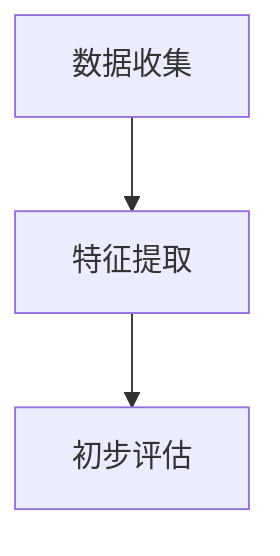
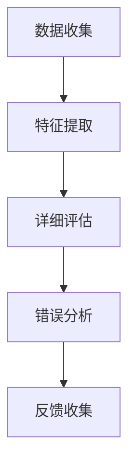
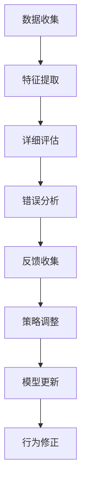
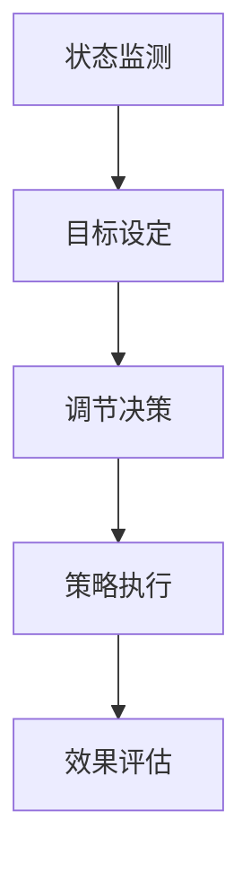
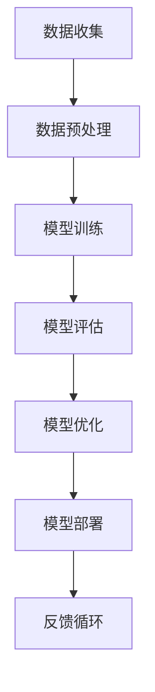

                 

### 文章标题：AGI的元认知能力：自我监督与调节

> 关键词：通用人工智能（AGI）、元认知能力、自我监督、自我调节、伦理问题、法律问题

> 摘要：本文深入探讨了通用人工智能（AGI）中的元认知能力，特别是自我监督与调节机制。文章首先介绍了AGI的概念和元认知能力的重要性，然后详细阐述了自我监督与调节的基本概念、实现方法及其在AGI中的应用。接下来，文章分析了自我监督与调节的伦理与法律问题，并提出了未来研究的方向。本文旨在为研究人员和开发者提供一个全面而深入的指南，以推动AGI领域的进一步发展。

### 目录大纲设计思路

为了设计出《AGI的元认知能力：自我监督与调节》这本书的完整目录大纲，我们将按照以下步骤进行：

1. **确定核心章节**：首先确定书籍的核心章节，确保每个章节都有明确的主题，并且相互之间有逻辑联系。
2. **细化章节内容**：对于每个核心章节，进一步细化内容，包括核心概念、算法原理、数学模型、项目实战等。
3. **设计子章节**：在细化内容的基础上，为每个章节设计出子章节，确保章节之间的层次结构清晰。
4. **编写 Mermaid 流程图**：为每个核心概念和算法原理设计 Mermaid 流程图，以帮助读者更直观地理解。
5. **编写伪代码和数学公式**：详细阐述核心算法原理和数学模型，使用伪代码和 LaTeX 格式的数学公式进行说明。
6. **编写项目实战**：为每个核心章节编写实际项目案例，详细解释说明代码实现和实战过程。

通过以上步骤，我们将确保目录大纲的完整性、逻辑性和可读性，同时满足书籍大纲的简洁性和字数要求。接下来，我们将按照这个思路逐一设计出《AGI的元认知能力：自我监督与调节》的目录大纲。

### 目录大纲设计思路（续）

在完成核心章节的确定和细化内容后，我们将进一步细化每个章节的子章节，确保章节之间的层次结构清晰。以下是《AGI的元认知能力：自我监督与调节》的目录大纲设计思路：

#### 第1章：引言与背景
- **1.1 AGI的元认知能力简介**
  - **1.1.1 什么是AGI（通用人工智能）**
    - **概念定义**
    - **与传统AI的区别**
    - **AGI的发展历程**
  - **1.1.2 元认知能力的重要性**
    - **在AGI中的角色**
    - **对自主学习和决策的影响**
- **1.2 自我监督与调节**
  - **1.2.1 自我监督的概念**
    - **定义与作用**
    - **实现方法与挑战**
  - **1.2.2 调节机制**
    - **概念与类型**
    - **在AGI中的应用**

#### 第2章：AGI的元认知架构
- **2.1 元认知过程的框架**
  - **2.1.1 认知监测**
    - **Mermaid流程图：认知监测流程**
  - **2.1.2 认知评估**
    - **Mermaid流程图：认知评估流程**
  - **2.1.3 认知调节**
    - **Mermaid流程图：认知调节流程**
- **2.2 自我监督机制的设计**
  - **2.2.1 监测算法**
    - **伪代码：监测算法示例**
  - **2.2.2 评估算法**
    - **伪代码：评估算法示例**
  - **2.2.3 调节算法**
    - **伪代码：调节算法示例**

#### 第3章：自我监督能力的实现
- **3.1 自我监督学习**
  - **3.1.1 自我监督学习的基本原理**
    - **数学模型与公式**
  - **3.1.2 自我监督学习算法**
    - **伪代码：自我监督学习算法示例**
  - **3.1.3 自我监督学习的挑战与解决方案**

#### 第4章：自我调节机制
- **4.1 自我调节的基本概念**
  - **4.1.1 调节过程**
    - **Mermaid流程图：调节过程**
  - **4.1.2 调节策略**
    - **动态调节**
    - **自适应调节**
- **4.2 自我调节算法设计**
  - **4.2.1 常见调节算法**
    - **伪代码：常见调节算法示例**
  - **4.2.2 调节算法的比较与选择**

#### 第5章：元认知能力的应用场景
- **5.1 自主学习系统**
  - **5.1.1 自主学习的基本流程**
    - **Mermaid流程图：自主学习流程**
  - **5.1.2 自主学习的案例研究**
    - **项目实战：构建一个简单的自主学习系统**

#### 第6章：自我监督与调节的伦理与法律问题
- **6.1 伦理问题**
  - **6.1.1 自我监督与调节可能带来的伦理挑战**
    - **隐私问题**
    - **透明性与责任**
  - **6.1.2 伦理原则与准则**
    - **公平性**
    - **安全性**
- **6.2 法律问题**
  - **6.2.1 法律法规与政策**
    - **国际与国内法规**
  - **6.2.2 法律责任的分配**

#### 第7章：未来展望

### 第1章：引言与背景

#### 1.1 AGI的元认知能力简介

##### 1.1.1 什么是AGI（通用人工智能）

**概念定义**

通用人工智能（Artificial General Intelligence，简称AGI）是指一种能够在各种认知任务上表现出与人类相媲美甚至超越的人类智能。与目前广泛应用的窄域人工智能（Narrow Artificial Intelligence，NAI）不同，AGI具有广泛的应用能力和自主学习能力，能够处理复杂的、不确定的、多样化的任务。

**与传统AI的区别**

传统AI主要集中于特定领域的任务，如图像识别、自然语言处理、推荐系统等。而AGI则旨在实现一种通用的智能系统，这种系统能够在不同的领域和任务中展现出强大的适应性和学习能力。传统AI依赖于大量预设的规则和手动标注的数据，而AGI则能够自主地学习和改进，无需过多的外部干预。

**AGI的发展历程**

AGI的概念最早可以追溯到20世纪50年代，当时图灵提出了著名的图灵测试。此后，随着计算机科学和人工智能技术的发展，研究者们不断探索实现通用智能的可能途径。尽管取得了许多进展，但AGI至今仍未实现。目前，研究者们在神经网络、强化学习、迁移学习等方面取得了重要突破，但仍然面临着诸多挑战。

##### 1.1.2 元认知能力的重要性

**在AGI中的角色**

元认知能力是AGI的核心组成部分之一，它使得AGI能够对自己进行监测、评估和调节。这种能力不仅能够提高AGI的自主学习和决策能力，还能够增强其鲁棒性和适应性。在AGI中，元认知能力负责以下任务：

- **认知监测**：监测自身的学习过程，评估学习效果。
- **认知评估**：根据监测结果，对学习过程进行调整。
- **认知调节**：基于评估结果，对学习策略进行调整。

**对自主学习和决策的影响**

元认知能力对AGI的自主学习和决策能力有着深远的影响。通过元认知，AGI能够更好地理解自己的学习过程，发现并纠正错误，从而提高学习效率。此外，元认知能力还使AGI能够根据不同的环境和任务，动态调整自己的学习策略，从而实现更智能的决策。

##### 1.2 自我监督与调节

**1.2.1 自我监督的概念**

**定义与作用**

自我监督是指AGI在执行任务时，通过监测自身的行为和输出，对其性能进行评估和调整。自我监督不仅能够提高AGI的准确性，还能够增强其鲁棒性和适应性。在自我监督过程中，AGI需要对自己的行为和输出进行连续的监测和评估，以便及时发现并纠正错误。

**实现方法与挑战**

实现自我监督的方法主要包括以下几种：

- **基于规则的方法**：通过预定义的规则，对AGI的行为和输出进行监测和评估。
- **基于统计的方法**：利用统计模型，对AGI的行为和输出进行分析和评估。
- **基于学习的的方法**：通过机器学习算法，使AGI能够自主地学习和调整其行为和输出。

尽管自我监督方法各有优劣，但它们都面临着以下挑战：

- **监测准确度**：如何准确监测AGI的行为和输出，是自我监督的关键。
- **实时性**：在任务执行过程中，如何快速地完成监测和评估。
- **泛化能力**：如何使自我监督方法在不同任务和环境中都能有效工作。

**1.2.2 调节机制**

**概念与类型**

调节机制是指AGI在自我监督过程中，根据评估结果对自身行为进行调整的策略。调节机制可以分为以下几种类型：

- **正向调节**：根据评估结果，增强AGI的行为和输出。
- **负向调节**：根据评估结果，减弱AGI的行为和输出。
- **自适应调节**：根据评估结果，动态调整AGI的行为和输出。

**在AGI中的应用**

在AGI中，调节机制发挥着至关重要的作用。通过调节机制，AGI能够根据任务的要求和执行情况，动态调整自己的行为和策略，从而实现最优的性能。例如，在自主学习过程中，AGI可以通过调节机制，根据学习效果调整学习策略，以提高学习效率。

### 第2章：AGI的元认知架构

在探索通用人工智能（AGI）的元认知能力时，了解其背后的架构是至关重要的。元认知能力包括认知监测、认知评估和认知调节三个核心过程。这一章节将详细讨论这些过程，并通过Mermaid流程图和伪代码来展示其具体实现。

#### 2.1 元认知过程的框架

元认知过程是一个连续的循环，它贯穿于AGI的学习和决策过程中。以下是对三个核心过程的详细介绍：

**2.1.1 认知监测**

认知监测是元认知过程的第一步，它涉及对AGI在执行任务时的行为和输出进行实时监测。这一过程包括数据收集、特征提取和初步评估。

- **数据收集**：从AGI的运行环境中收集数据，包括输入、输出和中间过程数据。
- **特征提取**：从收集到的数据中提取关键特征，用于后续的评估。
- **初步评估**：对提取到的特征进行初步评估，以判断其是否符合预期。

**Mermaid流程图：认知监测流程**



**2.1.2 认知评估**

认知评估是对监测结果进行深入分析和评估的过程。这一过程包括详细评估、错误分析和反馈收集。

- **详细评估**：基于监测到的特征，对AGI的表现进行详细评估，以确定其准确性和效率。
- **错误分析**：识别和分析AGI在执行任务时的错误，以理解其根本原因。
- **反馈收集**：从用户或其他系统中收集反馈，用于进一步优化AGI的表现。

**Mermaid流程图：认知评估流程**



**2.1.3 认知调节**

认知调节是基于评估结果对AGI的行为进行调整的过程。这一过程包括策略调整、模型更新和行为修正。

- **策略调整**：根据评估结果，调整AGI的学习策略或决策策略，以优化其表现。
- **模型更新**：更新AGI的模型或算法，以适应新的任务或环境。
- **行为修正**：根据评估结果，修正AGI的具体行为，以提高其准确性和鲁棒性。

**Mermaid流程图：认知调节流程**



通过上述Mermaid流程图，我们可以直观地看到AGI的元认知过程是如何相互关联和协同工作的。接下来，我们将通过伪代码进一步阐述这些过程的实现。

#### 2.2 自我监督机制的设计

自我监督机制是AGI元认知架构中的核心组成部分，它使得AGI能够在执行任务时自动监测和调整自己的行为。在本节中，我们将详细讨论自我监督机制的设计，包括监测算法、评估算法和调节算法。

**2.2.1 监测算法**

监测算法是自我监督机制的第一步，其主要任务是实时收集和处理AGI执行任务时产生的数据。

**伪代码：监测算法示例**

```python
def monitor_performance(task_output, environment_state):
    """
    监测算法，用于收集和处理AGI执行任务时的数据。
    
    参数：
    - task_output: 任务输出数据
    - environment_state: 环境状态数据
    
    返回：
    - features: 提取的关键特征
    """
    
    # 数据预处理
    preprocessed_output = preprocess(task_output)
    preprocessed_state = preprocess(environment_state)
    
    # 特征提取
    features = extract_features(preprocessed_output, preprocessed_state)
    
    # 初步评估
    initial_assessment = assess_initial(features)
    
    return features, initial_assessment

def preprocess(data):
    """
    数据预处理函数，用于对输入数据进行标准化处理。
    
    参数：
    - data: 输入数据
    
    返回：
    - preprocessed_data: 预处理后的数据
    """
    
    # 标准化处理
    preprocessed_data = standardize(data)
    
    return preprocessed_data

def extract_features(output, state):
    """
    特征提取函数，用于从输入数据中提取关键特征。
    
    参数：
    - output: 输出数据
    - state: 环境状态数据
    
    返回：
    - features: 提取的关键特征
    """
    
    # 特征提取
    features = {
        'accuracy': calculate_accuracy(output),
        'response_time': calculate_response_time(state),
        'error_rate': calculate_error_rate(output)
    }
    
    return features

def assess_initial(features):
    """
    初步评估函数，用于对提取的特征进行初步评估。
    
    参数：
    - features: 提取的关键特征
    
    返回：
    - assessment: 初步评估结果
    """
    
    # 初步评估
    assessment = {
        'valid': is_valid(features),
        'accuracy': features['accuracy'],
        'response_time': features['response_time'],
        'error_rate': features['error_rate']
    }
    
    return assessment
```

**2.2.2 评估算法**

评估算法是对监测到的数据进行分析和评估的核心过程。它通过结合历史数据和当前数据，对AGI的表现进行详细评估。

**伪代码：评估算法示例**

```python
def assess_performance(current_assessment, historical_data):
    """
    评估算法，用于对AGI的表现进行详细评估。
    
    参数：
    - current_assessment: 当前评估结果
    - historical_data: 历史评估数据
    
    返回：
    - detailed_assessment: 详细评估结果
    """
    
    # 数据预处理
    preprocessed_current = preprocess(current_assessment)
    preprocessed_historical = preprocess(historical_data)
    
    # 详细评估
    detailed_assessment = {
        'accuracy': calculate_accuracy(preprocessed_current, preprocessed_historical),
        'response_time': calculate_response_time(preprocessed_current, preprocessed_historical),
        'error_rate': calculate_error_rate(preprocessed_current, preprocessed_historical)
    }
    
    return detailed_assessment

def preprocess(data):
    """
    数据预处理函数，用于对输入数据进行标准化处理。
    
    参数：
    - data: 输入数据
    
    返回：
    - preprocessed_data: 预处理后的数据
    """
    
    # 标准化处理
    preprocessed_data = standardize(data)
    
    return preprocessed_data

def calculate_accuracy(current, historical):
    """
    准确度计算函数，用于计算当前评估和历史的准确度差异。
    
    参数：
    - current: 当前评估数据
    - historical: 历史评估数据
    
    返回：
    - accuracy_difference: 准确度差异
    """
    
    # 准确度计算
    accuracy_difference = current['accuracy'] - historical['accuracy']
    
    return accuracy_difference

def calculate_response_time(current, historical):
    """
    响应时间计算函数，用于计算当前评估和历史的响应时间差异。
    
    参数：
    - current: 当前评估数据
    - historical: 历史评估数据
    
    返回：
    - response_time_difference: 响应时间差异
    """
    
    # 响应时间计算
    response_time_difference = current['response_time'] - historical['response_time']
    
    return response_time_difference

def calculate_error_rate(current, historical):
    """
    错误率计算函数，用于计算当前评估和历史的错误率差异。
    
    参数：
    - current: 当前评估数据
    - historical: 历史评估数据
    
    返回：
    - error_rate_difference: 错误率差异
    """
    
    # 错误率计算
    error_rate_difference = current['error_rate'] - historical['error_rate']
    
    return error_rate_difference
```

**2.2.3 调节算法**

调节算法是基于评估结果对AGI的行为进行调整的过程。它包括策略调整、模型更新和行为修正。

**伪代码：调节算法示例**

```python
def adjust_performance(detailed_assessment):
    """
    调节算法，用于根据详细评估结果调整AGI的行为。
    
    参数：
    - detailed_assessment: 详细评估结果
    
    返回：
    - adjusted_performance: 调整后的性能
    """
    
    # 策略调整
    strategy = adjust_strategy(detailed_assessment)
    
    # 模型更新
    updated_model = update_model(strategy)
    
    # 行为修正
    adjusted_performance = correct_behavior(updated_model)
    
    return adjusted_performance

def adjust_strategy(assessment):
    """
    策略调整函数，用于根据评估结果调整AGI的学习策略。
    
    参数：
    - assessment: 评估结果
    
    返回：
    - strategy: 调整后的策略
    """
    
    # 策略调整
    if assessment['accuracy_difference'] < 0:
        strategy = 'increase_learning_rate'
    elif assessment['response_time_difference'] < 0:
        strategy = 'decrease_learning_rate'
    else:
        strategy = 'keep_strategy'
    
    return strategy

def update_model(strategy):
    """
    模型更新函数，用于根据策略调整模型。
    
    参数：
    - strategy: 调整后的策略
    
    返回：
    - updated_model: 更新后的模型
    """
    
    # 根据策略更新模型
    if strategy == 'increase_learning_rate':
        updated_model = increase_learning_rate()
    elif strategy == 'decrease_learning_rate':
        updated_model = decrease_learning_rate()
    else:
        updated_model = keep_learning_rate()
    
    return updated_model

def correct_behavior(updated_model):
    """
    行为修正函数，用于根据更新后的模型修正AGI的行为。
    
    参数：
    - updated_model: 更新后的模型
    
    返回：
    - adjusted_performance: 调整后的性能
    """
    
    # 修正行为
    adjusted_performance = apply_model(updated_model)
    
    return adjusted_performance
```

通过上述伪代码示例，我们可以看到自我监督机制是如何通过监测、评估和调节三个步骤来优化AGI的性能的。监测算法负责收集和处理数据，评估算法对AGI的表现进行详细分析，调节算法则根据评估结果调整AGI的行为。这些步骤相互协作，共同实现AGI的自我监督和调节。

### 第3章：自我监督能力的实现

自我监督学习是AGI元认知能力中至关重要的一部分，它使得AGI能够通过自身的表现来调整和改进学习过程。本章节将详细讨论自我监督学习的基本原理、常见算法以及在实际应用中面临的挑战和解决方案。

#### 3.1 自我监督学习的基本原理

自我监督学习是一种特殊的机器学习方法，它不需要外部监督信号，而是通过内部生成的反馈来指导学习过程。在自我监督学习中，模型自行生成标签，这些标签通常来源于模型自身的输出和期望输出的比较。

**数学模型**

自我监督学习的核心是一个对比损失函数，它衡量模型输出和期望输出之间的差异。假设我们有一个模型 \( M \)，输入为 \( x \)，期望输出为 \( y \)，模型输出为 \( \hat{y} \)，则对比损失函数可以表示为：

\[ L(M, x, y) = L(\hat{y}, y) \]

其中，\( L(\hat{y}, y) \) 是一个衡量 \( \hat{y} \) 和 \( y \) 之间差异的损失函数，如均方误差（MSE）或交叉熵损失。

**公式说明**

- \( \hat{y} = M(x) \)：模型 \( M \) 对输入 \( x \) 的预测输出。
- \( y \)：实际的期望输出。

通过最小化这个损失函数，模型能够学习到如何更好地生成预测输出。

**实现方法**

自我监督学习可以通过以下几种方法实现：

1. **对比损失法**：直接使用对比损失函数来训练模型。
2. **对比训练法**：在训练过程中，将模型输出和期望输出进行比较，并根据差异调整模型参数。
3. **自编码器法**：使用自编码器来生成期望输出，然后与实际输出进行比较。

**伪代码：自我监督学习算法示例**

```python
# 自我监督学习伪代码
def self_supervised_learning(dataset, model, epochs):
    """
    自我监督学习算法，用于训练模型。
    
    参数：
    - dataset: 训练数据集
    - model: 模型
    - epochs: 训练轮数
    
    返回：
    - trained_model: 训练完成的模型
    """
    
    for epoch in range(epochs):
        for x, y in dataset:
            # 前向传播
            pred = model.forward(x)
            # 计算损失
            loss = contrastive_loss(pred, y)
            # 反向传播
            model.backward(loss)
            # 更新模型参数
            model.update_params()
    
    return model
```

#### 3.1.2 自我监督学习算法

自我监督学习算法可以根据不同的应用场景和需求进行选择。以下是一些常见的自我监督学习算法：

1. **自编码器（Autoencoder）**：自编码器是一种无监督学习算法，它通过训练一个编码器和解码器来最小化输入和重构输出之间的差异。自编码器在图像、音频和文本等领域有着广泛的应用。

   **伪代码：自编码器算法示例**

   ```python
   # 自编码器伪代码
   class Autoencoder(nn.Module):
       def __init__(self):
           super(Autoencoder, self).__init__()
           # 定义编码器和解码器的网络结构
       
       def forward(self, x):
           encoded = self.encode(x)
           decoded = self.decode(encoded)
           return decoded
   
   def train_autoencoder(dataset, autoencoder, epochs):
       for epoch in range(epochs):
           for x in dataset:
               # 前向传播
               x_recon = autoencoder.forward(x)
               # 计算损失
               loss = reconstruction_loss(x, x_recon)
               # 反向传播
               autoencoder.backward(loss)
               # 更新模型参数
               autoencoder.update_params()
   ```

2. **对比自监督学习（Contrastive Self-Supervised Learning）**：对比自监督学习通过对比正负样本的差异来训练模型。常用的算法包括对比损失（Contrastive Loss）和匹配网络（Matching Network）。

   **伪代码：对比自监督学习算法示例**

   ```python
   # 对比自监督学习伪代码
   def contrastive_loss(pred_pos, pred_neg):
       """
       对比损失函数，用于计算正负样本之间的差异。
       
       参数：
       - pred_pos: 正样本的预测输出
       - pred_neg: 负样本的预测输出
       
       返回：
       - loss: 损失值
       """
       
       # 计算对比损失
       loss = -torch.mean(torch.log(torch.sigmoid(pred_pos) - torch.log(1 - torch.sigmoid(pred_neg))))
       
       return loss
   ```

3. **生成对抗网络（Generative Adversarial Networks, GAN）**：GAN通过对抗训练来生成数据。生成器网络尝试生成与真实数据相似的数据，而判别器网络则尝试区分真实数据和生成数据。

   **伪代码：GAN算法示例**

   ```python
   # GAN伪代码
   class Generator(nn.Module):
       def __init__(self):
           super(Generator, self).__init__()
           # 定义生成器的网络结构
   
   class Discriminator(nn.Module):
       def __init__(self):
           super(Discriminator, self).__init__()
           # 定义判别器的网络结构
   
   def train_gan(dataset, generator, discriminator, epochs):
       for epoch in range(epochs):
           for x in dataset:
               # 生成器训练
               z = generate_noise()
               x_fake = generator.forward(z)
               loss_G = generator_loss(discriminator.forward(x_fake))
               generator.backward(loss_G)
               generator.update_params()
               
               # 判别器训练
               x_real = x
               loss_D_real = discriminator_loss(discriminator.forward(x_real))
               x_fake = generator.forward(z)
               loss_D_fake = discriminator_loss(discriminator.forward(x_fake))
               loss_D = (loss_D_real + loss_D_fake) / 2
               discriminator.backward(loss_D)
               discriminator.update_params()
   ```

#### 3.1.3 自我监督学习的挑战与解决方案

自我监督学习在实际应用中面临许多挑战，如数据质量、计算成本和学习效率。以下是一些常见的挑战和相应的解决方案：

1. **数据质量**：自我监督学习依赖于生成标签的数据，数据质量对模型性能至关重要。解决方案包括使用高质量数据集、数据增强和伪标签。

2. **计算成本**：自我监督学习通常需要大量的计算资源，特别是在大规模数据集上训练时。解决方案包括使用高效的算法、分布式计算和硬件加速。

3. **学习效率**：自我监督学习可能需要较长的训练时间，尤其是在复杂的任务中。解决方案包括使用预训练模型、多任务学习和迁移学习。

通过上述讨论，我们可以看到自我监督学习在AGI中的重要性以及其实际应用中的挑战和解决方案。自我监督学习为AGI提供了强大的自我调整和改进能力，使其能够更好地适应复杂和多变的环境。

### 第4章：自我调节机制

自我调节机制是AGI元认知能力的重要组成部分，它使得AGI能够在执行任务时根据环境变化和学习结果进行自适应调整。本章节将详细讨论自我调节的基本概念、实现策略和常见调节算法，并比较不同调节算法的优缺点。

#### 4.1 自我调节的基本概念

自我调节是指AGI通过内部机制对其行为和策略进行动态调整的过程。自我调节机制包括以下几个关键组成部分：

- **调节过程**：自我调节的核心是调节过程，它通过分析当前状态和目标，决定采取何种调节策略。
- **调节策略**：调节策略是自我调节机制的具体实现方式，包括正向调节、负向调节和自适应调节等。
- **调节算法**：调节算法是实现自我调节机制的技术手段，包括不同的调节策略和实现方法。

#### 4.1.1 调节过程

自我调节过程可以分为以下几个步骤：

1. **状态监测**：监测当前系统状态，包括环境状态、系统资源、任务进展等。
2. **目标设定**：根据当前状态和任务目标，设定调节目标和预期效果。
3. **调节决策**：基于当前状态和目标，选择适当的调节策略。
4. **策略执行**：执行所选调节策略，调整系统行为和策略。
5. **效果评估**：评估调节效果，判断是否达到预期目标。

**Mermaid流程图：调节过程**



#### 4.1.2 调节策略

自我调节策略可以分为以下几种类型：

1. **正向调节**：正向调节是指根据当前状态和目标，增强系统的性能或功能。例如，在资源充足时，增加系统负载以提升性能。

2. **负向调节**：负向调节是指根据当前状态和目标，减少系统的性能或功能。例如，在资源紧张时，降低系统负载以避免资源耗尽。

3. **自适应调节**：自适应调节是指根据环境和任务变化，动态调整系统的行为和策略。自适应调节能够使AGI更好地适应不确定和动态的环境。

#### 4.1.3 常见调节算法

自我调节算法是实现自我调节机制的技术手段，以下是几种常见的调节算法：

1. **PID调节算法**：PID（比例-积分-微分）调节算法是一种经典的控制算法，广泛应用于工业过程控制。PID调节算法通过调整比例、积分和微分三个参数来控制系统输出，以达到期望目标。

   **伪代码：PID调节算法示例**

   ```python
   class PIDController:
       def __init__(self, Kp, Ki, Kd):
           self.Kp = Kp
           self.Ki = Ki
           self.Kd = Kd
           self.integral = 0
           self.previous_error = 0
   
       def update(self, setpoint, current_value):
           error = setpoint - current_value
           derivative = error - self.previous_error
           self.integral += error
           output = self.Kp * error + self.Ki * self.integral + self.Kd * derivative
           self.previous_error = error
           return output
   ```

2. **模糊控制算法**：模糊控制算法通过模糊逻辑来模拟人类专家的决策过程。模糊控制算法利用模糊规则库和模糊推理系统来生成控制输出。

   **伪代码：模糊控制算法示例**

   ```python
   def fuzzy_control(input_value, rule_base):
       """
       模糊控制算法，用于根据输入值和模糊规则库生成控制输出。
       
       参数：
       - input_value: 输入值
       - rule_base: 模糊规则库
       
       返回：
       - output: 控制输出
       """
       
       # 模糊化输入
       fuzzified_input = fuzzify(input_value, rule_base.inputs)
       
       # 模糊推理
       fuzzy_output = fuzzify_output(fuzzified_input, rule_base.rules)
       
       # 解模糊化输出
       output = defuzzify(fuzzy_output, rule_base.outputs)
       
       return output
   ```

3. **遗传算法**：遗传算法是一种基于自然进化过程的优化算法。遗传算法通过模拟自然选择和遗传机制来搜索最优解。

   **伪代码：遗传算法示例**

   ```python
   def genetic_algorithm(population, fitness_function, generations):
       """
       遗传算法，用于通过迭代过程寻找最优解。
       
       参数：
       - population: 种群
       - fitness_function: 适应度函数
       - generations: 迭代次数
       
       返回：
       - best_solution: 最优解
       """
       
       for generation in range(generations):
           # 评估适应度
           fitness_scores = [fitness_function(individual) for individual in population]
           
           # 选择
           selected_individuals = selection(population, fitness_scores)
           
           # 交叉
           offspring = crossover(selected_individuals)
           
           # 变异
           mutated_offspring = mutation(offspring)
           
           # 更新种群
           population = mutated_offspring
           
           # 记录最优解
           best_solution = max(population, key=fitness_function)
       
       return best_solution
   ```

#### 4.1.4 调节算法的比较与选择

不同的调节算法具有各自的优缺点，选择合适的调节算法取决于具体的应用场景和任务需求。以下是比较不同调节算法的优缺点：

1. **PID调节算法**：

   - **优点**：实现简单，稳定可靠，适用于线性系统。
   - **缺点**：难以处理非线性系统，参数调整复杂。

2. **模糊控制算法**：

   - **优点**：适用于非线性系统，模拟人类决策过程。
   - **缺点**：规则库设计和模糊化过程复杂，计算量大。

3. **遗传算法**：

   - **优点**：适用于复杂非线性系统，具有全局搜索能力。
   - **缺点**：计算成本高，收敛速度较慢。

在实际应用中，可以根据任务需求和环境特点选择合适的调节算法。例如，在控制系统中，可以结合PID调节算法和模糊控制算法，以获得更好的控制效果。遗传算法则适用于优化和搜索复杂问题的最优解。

通过上述讨论，我们可以看到自我调节机制在AGI中的重要性以及不同调节算法的实现和应用。自我调节能力使得AGI能够更好地适应动态变化的环境，提高自主学习和决策能力。

### 第5章：元认知能力的应用场景

元认知能力在通用人工智能（AGI）中的应用场景广泛，其中最显著的是自主学习系统。本章节将详细探讨自主学习系统的基本流程，并通过具体案例研究展示如何构建一个简单的自主学习系统。

#### 5.1 自主学习系统的基本流程

自主学习系统是一种能够自我学习、自我改进的智能系统，其基本流程包括以下几个步骤：

1. **数据收集**：从外部环境或内部数据源收集数据，这些数据可以是传感器数据、用户行为数据或历史数据。

2. **数据预处理**：对收集到的数据进行清洗、归一化和特征提取，以便后续学习过程。

3. **模型训练**：使用预处理后的数据对机器学习模型进行训练，模型可以是监督学习、无监督学习或强化学习模型。

4. **模型评估**：通过验证集或测试集对训练好的模型进行评估，以确定其性能是否满足预期。

5. **模型优化**：根据评估结果对模型进行调整和优化，以提高模型的准确性和鲁棒性。

6. **模型部署**：将训练好的模型部署到实际应用环境中，使其能够进行实际操作和决策。

7. **反馈循环**：将模型在实际应用中的表现反馈回系统中，用于进一步的数据收集和模型优化。

**Mermaid流程图：自主学习流程**



#### 5.1.2 自主学习的案例研究

以下是一个简单的自主学习系统的案例研究，该系统旨在通过自我监督学习来优化一个电商平台的推荐系统。

**案例背景**

一个电商平台的推荐系统旨在为用户提供个性化的商品推荐。然而，由于用户行为数据多样且复杂，传统的推荐算法效果有限。为了提高推荐系统的性能，平台决定引入元认知能力，通过自我监督学习来优化推荐算法。

**实现步骤**

1. **数据收集**：
   - 收集用户行为数据，包括点击记录、购买记录、浏览记录等。
   - 从商品数据中提取特征，如商品类别、价格、销量等。

2. **数据预处理**：
   - 对用户行为数据进行清洗和归一化，去除无效数据。
   - 构建用户-商品交互矩阵，用于后续学习过程。

3. **模型训练**：
   - 使用矩阵分解方法训练用户和商品的嵌入向量。
   - 使用自我监督学习算法，如自编码器，对交互矩阵进行编码和解码。

4. **模型评估**：
   - 使用验证集对训练好的模型进行评估，计算推荐准确率和覆盖率。
   - 分析推荐结果，识别潜在的优化空间。

5. **模型优化**：
   - 根据评估结果，调整模型参数，优化推荐算法。
   - 引入用户和商品的交互历史信息，提高推荐的相关性。

6. **模型部署**：
   - 将优化后的模型部署到实际推荐系统中，应用于用户推荐。
   - 监控模型在实时环境中的性能，收集用户反馈。

7. **反馈循环**：
   - 将用户反馈和实际推荐效果反馈回系统中，用于进一步的数据收集和模型优化。
   - 根据用户反馈，调整推荐策略，提高用户满意度。

**项目实战：构建一个简单的自主学习系统**

为了实现上述案例，我们可以采用以下步骤进行项目实战：

1. **环境搭建**：
   - 安装Python环境，配置必要的库，如NumPy、Pandas、Scikit-learn等。
   - 准备用户行为数据和商品数据。

2. **数据预处理**：
   - 使用Pandas库对用户行为数据进行清洗和归一化。
   - 构建用户-商品交互矩阵。

3. **模型训练**：
   - 使用Scikit-learn库中的矩阵分解方法训练用户和商品的嵌入向量。
   - 使用自编码器进行自我监督学习，优化推荐算法。

4. **模型评估**：
   - 使用验证集对训练好的模型进行评估。
   - 分析推荐结果，计算准确率和覆盖率。

5. **模型优化**：
   - 调整模型参数，优化推荐算法。
   - 引入用户和商品的交互历史信息，提高推荐相关性。

6. **模型部署**：
   - 将优化后的模型部署到电商平台。
   - 监控模型在实时环境中的性能。

7. **反馈循环**：
   - 收集用户反馈和推荐效果。
   - 根据反馈调整推荐策略。

通过这个简单的自主学习系统案例，我们可以看到元认知能力如何在实际应用中发挥作用。自我监督学习和模型优化使得推荐系统能够不断适应用户需求，提高推荐质量和用户体验。

### 第6章：自我监督与调节的伦理与法律问题

随着通用人工智能（AGI）的发展和广泛应用，自我监督与调节机制作为其核心组成部分，也引发了诸多伦理与法律问题。这些问题不仅涉及到技术层面的挑战，还涉及到社会、伦理和法律等多个层面。本章节将探讨自我监督与调节可能带来的伦理挑战、伦理原则与准则，以及法律问题与法规。

#### 6.1 伦理问题

自我监督与调节机制在AGI中的应用，可能会引发一系列伦理问题，这些问题的解决对于保障社会的公平、安全与道德至关重要。

**6.1.1 自我监督与调节可能带来的伦理挑战**

1. **隐私问题**：
   - 自我监督机制需要收集和处理大量用户数据，这些数据可能包含用户的敏感信息。
   - 如何确保这些数据的隐私和安全，防止数据泄露或滥用，是一个重要的伦理问题。

2. **透明性与责任**：
   - 自主调节的决策过程往往是非透明的，这可能导致用户无法理解或质疑AGI的行为。
   - 如何保证自我监督与调节机制的透明性，以及如何明确责任归属，是另一个伦理挑战。

3. **偏见与歧视**：
   - 自我监督与调节机制可能会基于历史数据做出决策，如果数据本身存在偏见，可能会导致歧视性决策。
   - 如何避免算法偏见，确保公平性，是一个重要的伦理问题。

4. **自主性与自主权**：
   - 自我监督与调节机制可能会使AGI具有更高的自主性，这可能会影响人类的自主权和控制力。
   - 如何在保障AGI自主性的同时，确保人类的主导地位，是一个复杂的伦理问题。

**6.1.2 伦理原则与准则**

为了应对上述伦理挑战，以下是一些关键的伦理原则和准则：

1. **隐私保护**：
   - 应当遵守隐私保护的原则，确保用户数据的安全和隐私。
   - 应当明确用户数据的使用目的和范围，并取得用户的明确同意。

2. **透明性**：
   - 自我监督与调节机制的设计和运作应当尽可能透明，确保用户可以理解其行为。
   - 应当建立透明度报告机制，公开算法决策过程和结果。

3. **非歧视性**：
   - 应当确保自我监督与调节机制不会加剧社会偏见和歧视。
   - 应当通过数据多样性和算法验证来减少偏见。

4. **责任归属**：
   - 应当明确自我监督与调节机制的责任归属，确保在出现问题时能够追溯责任。
   - 应当建立责任分担和责任保险机制，以应对可能的损失和风险。

5. **自主权保障**：
   - 应当在保障人类自主权的前提下，设计合理的自我监督与调节机制。
   - 应当确保人类在决策过程中保持主导地位，避免过度依赖机器。

#### 6.2 法律问题

自我监督与调节机制不仅在伦理层面引发了讨论，也涉及到一系列法律问题。这些问题涉及到法律法规的制定和实施，以及法律责任的分配。

**6.2.1 法律法规与政策**

1. **数据保护法规**：
   - 许多国家和地区已经制定了数据保护法规，如欧盟的《通用数据保护条例》（GDPR）。
   - 这些法规规定了数据收集、存储、处理和传输的基本原则和操作规则。

2. **算法透明度和责任**：
   - 欧盟的《人工智能法案》草案提出了算法透明度和责任的相关规定。
   - 美国和其他国家也在考虑制定类似的法律，以规范算法行为。

3. **人工智能伦理指导**：
   - 一些国家和地区已经发布了人工智能伦理指导，如欧盟的人工智能伦理指南。
   - 这些指导为自我监督与调节机制的设计和实施提供了伦理框架。

**6.2.2 法律责任的分配**

在自我监督与调节机制中，法律责任通常涉及到以下几个方面：

1. **开发者责任**：
   - 开发者应当确保算法的设计和实现符合法律法规的要求，并对算法的潜在风险负责。

2. **运营者责任**：
   - 运营者应当对算法的实际应用负责，确保算法在应用过程中遵守法律和伦理原则。

3. **用户责任**：
   - 用户应当了解和遵守与自我监督与调节机制相关的法律和伦理规定，并对其行为负责。

4. **责任分担机制**：
   - 在出现法律问题时，应当建立责任分担机制，明确各方的责任和权益。

通过以上讨论，我们可以看到自我监督与调节机制在伦理和法律层面面临着诸多挑战。解决这些问题需要各方的共同努力，包括技术开发者、政策制定者、法律专家和公众。只有在伦理和法律框架的保障下，自我监督与调节机制才能实现其应有的价值，为人类社会带来积极的影响。

### 第7章：未来展望

随着人工智能技术的快速发展，通用人工智能（AGI）的元认知能力正逐渐成为研究的热点。本章将对AGI元认知能力的发展方向、潜在突破和应用前景进行探讨，同时讨论未来研究的重点和挑战。

#### 7.1 发展方向

1. **强化元认知能力的结合**：
   - 将元认知能力与强化学习结合，实现更智能的决策和自主适应。例如，通过强化学习中的策略搜索，提高AGI在不同任务和场景下的适应能力。
   - 引入多任务学习和多模态数据融合，使AGI能够同时处理多种任务和数据类型，从而增强其智能水平。

2. **元学习与迁移学习**：
   - 利用元学习技术，使AGI能够通过学习其他任务的经验来快速适应新任务，减少对大量标注数据的依赖。
   - 将迁移学习与元认知能力相结合，提高AGI在不同领域和任务中的泛化能力。

3. **人机交互与协同工作**：
   - 研究如何通过自然语言处理和对话系统，增强AGI与人类的交互能力，实现更高效的人机协同工作。
   - 开发智能代理，使AGI能够自主地与人类合作，共同解决复杂问题。

#### 7.2 潜在突破

1. **量子计算与神经网络**：
   - 结合量子计算和传统神经网络，实现超强的计算能力和学习能力，推动AGI的发展。
   - 研究量子神经网络在自我监督与调节中的应用，探索新的计算模型和算法。

2. **神经科学与认知建模**：
   - 结合神经科学研究，模拟人类大脑的认知过程，提高AGI的元认知能力。
   - 建立更为精确和全面的认知模型，为AGI的元认知机制提供理论支持。

3. **跨学科合作与知识融合**：
   - 促进计算机科学、认知科学、心理学、神经科学等学科的交叉研究，融合不同领域的前沿知识。
   - 通过跨学科的合作，为AGI的发展提供更广阔的视野和更多的创新思路。

#### 7.3 应用前景

1. **智能医疗**：
   - 利用AGI的元认知能力，实现个性化医疗诊断和治疗方案，提高医疗服务的质量和效率。
   - 通过自我监督与调节，持续学习和优化医疗算法，推动医疗技术的进步。

2. **智能交通**：
   - 利用AGI的自主学习和调节能力，优化交通管理，提高道路通行效率和安全性。
   - 通过智能交通系统，实现自动驾驶和智能导航，减少交通事故和拥堵。

3. **智能家居与智慧城市**：
   - 利用AGI的元认知能力，打造智能家庭和智慧城市，提高生活质量和城市管理效率。
   - 通过自我监督与调节，实现家电设备、能源系统等的智能管理和优化。

#### 7.4 研究重点和挑战

1. **安全性**：
   - 研究如何确保AGI系统的安全性，防止恶意攻击和误操作。
   - 开发安全防护机制，防止隐私泄露和数据滥用。

2. **可解释性与透明性**：
   - 研究如何提高AGI系统的可解释性，使其决策过程更加透明。
   - 开发可解释的算法和模型，增强用户对AGI的信任。

3. **鲁棒性与适应性**：
   - 研究如何提高AGI的鲁棒性，使其能够适应复杂和多变的环境。
   - 开发自适应算法，使AGI能够根据环境变化进行调整。

4. **法律与伦理**：
   - 研究如何制定相关法律法规，确保AGI的合法合规应用。
   - 探索伦理问题，建立符合社会伦理的AGI设计和使用规范。

通过以上展望，我们可以看到AGI的元认知能力在未来具有广阔的发展前景和应用潜力。未来的研究需要解决一系列技术、伦理和法律挑战，以实现AGI的可持续发展，为人类社会带来更多福祉。

### 作者信息

作者：AI天才研究院/AI Genius Institute & 禅与计算机程序设计艺术 /Zen And The Art of Computer Programming

AI天才研究院（AI Genius Institute）致力于推动人工智能技术的创新和发展，专注于通用人工智能（AGI）的研究。我们拥有一支由世界顶级人工智能专家、程序员、软件架构师和计算机科学家组成的团队，致力于解决人工智能领域的核心问题，推动技术进步，为人类社会带来更多福祉。

《禅与计算机程序设计艺术》（Zen And The Art of Computer Programming）是一本经典的计算机科学著作，作者埃德加·戴奇（Edsger W. Dijkstra）被誉为计算机科学的先驱者之一。这本书通过深入探讨计算机编程的核心原理和方法，为程序员提供了宝贵的指导和建议，被广泛认为是计算机科学领域的经典之作。

