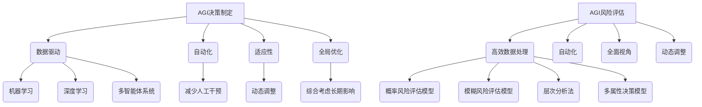
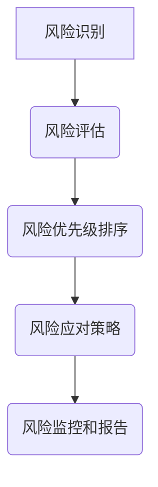

                 

### 第1章: AGI的决策制定与风险评估能力概述

#### 1.1 AGI的概念与历史发展

##### 1.1.1 什么是AGI

人工通用智能（Artificial General Intelligence，简称AGI）是一种模拟人类智能的理论概念，其目标是通过计算机程序实现具有全面智能的系统，使得这些系统能够执行人类智能所能完成的任何认知任务。与当前的人工智能（AI）系统不同，AGI不仅限于特定领域的应用，而是具有广泛的认知能力，包括语言理解、推理、学习、解决问题、感知等多个方面。

##### 1.1.2 AGI的发展历程

AGI的研究始于20世纪50年代，随着计算机科学的飞速发展，许多学者和研究机构开始关注如何创造具有人类智能的机器。1950年，艾伦·图灵提出了著名的“图灵测试”，以此作为评估机器是否具有智能的标准。此后，人工智能领域经历了多次起伏，从早期的符号主义方法，到基于神经网络的连接主义方法，再到现在的混合方法，各个阶段的研究都在不断推动AGI的实现。

然而，尽管已有数十年的研究，AGI的实现仍然面临着巨大的技术挑战。目前，尽管有一些AI系统在特定任务上表现出了令人惊叹的能力，但它们通常只能在特定的、受限的条件下工作，而无法像人类那样灵活、全面地处理各种复杂的任务。

##### 1.1.3 AGI与人类智能的对比

AGI与人类智能在许多方面存在显著差异。首先，人类智能具有高度的自主性和创造性，能够从大量的背景知识和经验中灵活地生成新的想法和解决方案。而现有的AI系统通常依赖于大量训练数据和预定义的规则，缺乏这种自主性和创造性。其次，人类智能具有情感和社交能力，能够理解他人的情感和需求，并在复杂的社会环境中做出适当的反应。而目前的AI系统通常缺乏这种情感和社交能力。

尽管如此，AGI在决策制定和风险评估方面的潜力巨大。通过模拟人类智能的决策过程和风险评估机制，AGI有望在许多领域，如金融、医疗、制造等，提供更加高效、准确的决策支持。同时，AGI的风险评估能力可以帮助我们更好地理解和管理复杂系统的潜在风险，从而提高系统的安全性和可靠性。

#### 1.2 AGI的决策制定能力

##### 1.2.1 决策制定的基本概念

决策制定是一个复杂的过程，涉及对多种因素的评估和权衡，旨在选择最佳的行动方案。在人类智能中，决策制定通常基于经验和直觉，同时受到情感、动机和社会因素的影响。而AGI的决策制定则更多地依赖于算法和数据，通过学习和优化来提高决策的质量和效率。

##### 1.2.2 AGI决策制定的特点

AGI的决策制定能力具有以下特点：

1. **数据驱动的决策过程**：AGI依赖于大量的数据来训练模型，从而在决策过程中能够充分利用数据提供的洞察和信息。
2. **自动化的决策制定**：AGI能够自动地处理决策过程中的各种任务，如问题建模、方案评估和选择等，从而大大提高决策的效率。
3. **适应性和灵活性**：AGI能够根据环境的变化和新的信息动态调整决策策略，从而适应复杂和不断变化的环境。
4. **全局优化**：AGI的决策制定不仅考虑当前的任务，还会考虑长期的影响和潜在的风险，从而实现全局优化。

##### 1.2.3 AGI决策制定的关键技术

AGI的决策制定依赖于多种关键技术，包括：

1. **机器学习算法**：通过机器学习，AGI能够从大量数据中学习到有效的决策策略，从而提高决策的准确性和效率。
2. **深度学习**：深度学习技术使得AGI能够在复杂的决策环境中提取有用的特征和模式，从而实现更智能的决策。
3. **多智能体系统**：通过多智能体系统，AGI能够在分布式环境中协调和协作，从而实现更复杂的决策任务。

#### 1.3 AGI的风险评估能力

##### 1.3.1 风险评估的基本概念

风险评估是指通过系统化的方法对潜在的风险进行识别、分析和评估，以确定其可能对目标系统造成的影响。风险评估的核心是评估风险的概率和影响，从而为决策提供依据。

##### 1.3.2 AGI风险评估的优势

AGI在风险评估方面具有以下优势：

1. **高效的数据处理能力**：AGI能够快速处理和分析大量数据，从而更准确地识别和评估风险。
2. **自动化的风险评估**：AGI能够自动化风险评估过程，减少人工干预，提高评估的效率和准确性。
3. **全面的视角**：AGI能够从多个角度和维度评估风险，包括技术、经济、法律和伦理等方面，从而提供更全面的决策支持。
4. **动态的风险调整**：AGI能够根据环境的变化和新的信息动态调整风险评估，从而提供实时和精准的风险预测。

##### 1.3.3 AGI风险评估的方法与模型

AGI的风险评估依赖于多种方法和模型，包括：

1. **概率风险评估模型**：通过概率模型，AGI能够计算风险的概率和影响，从而为决策提供依据。
2. **模糊风险评估模型**：模糊模型适用于处理不确定性和模糊性的风险评估问题。
3. **层次分析法**：通过层次分析法，AGI能够将复杂的风险评估问题分解为多个层次和维度，从而实现更精细的风险评估。
4. **多属性决策模型**：通过多属性决策模型，AGI能够综合考虑多个因素和属性，从而实现更全面的决策支持。

### 总结

本章介绍了AGI的决策制定与风险评估能力的概念、发展历程、特点以及关键技术。AGI的决策制定能力基于数据驱动、自动化、适应性和全局优化，而风险评估能力则依赖于高效的数据处理、自动化、全面视角和动态调整。这些能力为AGI在各个领域的应用提供了强大的支持，同时也带来了新的挑战和机遇。在接下来的章节中，我们将深入探讨AGI的决策制定机制和风险评估模型，以及它们在实际应用中的表现和效果。

---



在上述Mermaid流程图中，我们展示了AGI决策制定和风险评估的核心概念及其相互关系。AGI决策制定依赖于数据驱动、自动化、适应性和全局优化，而风险评估则侧重于高效的数据处理、自动化、全面视角和动态调整。这些核心概念和关系为我们理解AGI的决策制定与风险评估能力提供了直观的框架。

#### 2.1 AGI的决策制定机制

##### 2.1.1 感知与理解机制

AGI的决策制定过程始于其感知与理解机制。在这一过程中，AGI通过多种传感器和环境交互获取数据，如文本、图像、音频和视频等。首先，AGI需要对这些数据进行预处理，包括去噪、增强和特征提取，以便后续的处理和分析。

感知机制的核心任务是识别和理解输入数据中的关键信息。对于文本数据，AGI可以依赖自然语言处理（NLP）技术，如词性标注、句法分析和语义理解，以提取文本中的关键词、短语和语义关系。对于图像和视频数据，AGI可以利用计算机视觉技术，如图像识别、目标检测和视频追踪，来识别和解析图像中的对象、动作和场景。

理解机制则进一步对感知到的信息进行深入分析，以构建对环境的全面理解。在这一过程中，AGI需要运用知识表示和推理技术，将感知到的信息与现有的知识和模型进行匹配和整合。例如，AGI可以通过图神经网络（Graph Neural Networks，GNN）等技术来处理复杂的关系网络，从而对多维数据中的关联和依赖关系进行深入分析。

以下是一个简单的伪代码，描述了AGI感知与理解机制的基本流程：

```python
def perceive_and_understand(data):
    # 数据预处理
    preprocessed_data = preprocess_data(data)
    
    # 特征提取
    features = extract_features(preprocessed_data)
    
    # 识别关键信息
    key_info = identify_key_info(features)
    
    # 构建环境理解
    environmentUnderstanding = construct_environment_understanding(key_info)
    
    return environmentUnderstanding
```

在上述伪代码中，`preprocess_data`函数负责数据预处理，包括去噪、增强和特征提取；`extract_features`函数从预处理后的数据中提取关键特征；`identify_key_info`函数识别文本、图像或视频数据中的关键词、短语和对象；`construct_environment_understanding`函数则基于提取的关键信息构建对环境的全面理解。

##### 2.1.2 目标设定与优先级排序

在构建了对环境的理解之后，AGI需要设定决策目标，并确定这些目标的优先级。目标设定是决策制定过程的关键步骤，它决定了AGI在特定情境下的行动方向和策略。

目标设定的方法主要包括以下几种：

1. **基于规则的设定**：通过预定义的规则和策略，AGI可以自动设定决策目标。这种方法适用于相对简单和规则明确的环境。
2. **基于目标规划的设定**：目标规划是一种系统化的方法，它通过定义多个子目标和约束条件，来生成全局优化的决策目标。
3. **基于机器学习的设定**：通过机器学习，AGI可以从历史数据和情境中学习到有效的目标设定方法，从而在新的情境下自动设定决策目标。

在确定目标后，AGI需要对这些目标进行优先级排序。优先级排序的算法通常基于各种优化准则，如成本效益分析、风险评估和期望效用理论。以下是几种常见的优先级排序算法：

1. **最短路径算法**：通过计算从初始状态到各个目标的距离，AGI可以确定最优的目标顺序。
2. **贪心算法**：贪心算法通过在每一步选择当前最优的决策，从而逐步构建全局最优的决策序列。
3. **动态规划**：动态规划通过将复杂的问题分解为多个子问题，并存储子问题的解，以实现全局优化。

以下是一个简单的伪代码，描述了AGI目标设定和优先级排序的基本流程：

```python
def set_goals(environmentUnderstanding):
    # 基于规则或机器学习设定目标
    goals = determine_goals(environmentUnderstanding)
    
    # 确定目标优先级
    priority_scores = calculate_priority_scores(goals)
    sorted_goals = sort_goals_by_priority(priority_scores)
    
    return sorted_goals
```

在上述伪代码中，`determine_goals`函数根据环境理解和机器学习模型设定决策目标；`calculate_priority_scores`函数计算每个目标的优先级得分；`sort_goals_by_priority`函数根据优先级得分对目标进行排序。

##### 2.1.3 决策制定算法

在目标设定和优先级排序之后，AGI需要选择合适的决策制定算法，以生成最终的决策方案。决策制定算法可以分为以下几类：

1. **传统决策算法**：包括线性规划、整数规划、动态规划和启发式搜索等。这些算法通常基于数学优化和搜索理论，能够解决一些特定的决策问题。
2. **基于机器学习的决策算法**：通过机器学习技术，AGI可以从数据中学习到有效的决策策略，从而在复杂的决策环境中实现更智能的决策。
3. **基于深度学习的决策算法**：深度学习算法，如深度神经网络、卷积神经网络和生成对抗网络等，能够处理复杂的特征和模式，从而实现更高级的决策。

以下是几种常见的决策制定算法及其基本原理：

1. **线性规划**：
   ```python
   def linear_programming(A, b, c):
       # A为约束矩阵，b为约束向量，c为目标函数系数
       solution = solve_linear_program(A, b, c)
       return solution
   ```

2. **贪心算法**：
   ```python
   def greedy_algorithm(environmentUnderstanding, sorted_goals):
       # environmentUnderstanding为环境理解，sorted_goals为排序后的目标
       decision_sequence = []
       for goal in sorted_goals:
           best_action = select_best_action(goal)
           decision_sequence.append(best_action)
       return decision_sequence
   ```

3. **深度强化学习**：
   ```python
   def deep_reinforcement_learning(state, action_space, reward_function):
       # state为当前状态，action_space为可选动作空间，reward_function为奖励函数
       policy = train_deep_reinforcement_learning_model(state, action_space, reward_function)
       best_action = select_action_based_on_policy(policy, state)
       return best_action
   ```

在上述伪代码中，`linear_programming`函数通过线性规划求解器求解线性规划问题；`greedy_algorithm`函数基于贪心策略选择最优动作序列；`deep_reinforcement_learning`函数通过深度强化学习模型选择最佳动作。

通过上述机制，AGI能够在一个复杂和动态的环境中实现高效、智能的决策制定。感知与理解机制确保AGI对环境有全面的了解，目标设定与优先级排序提供明确的决策方向，而决策制定算法则生成最终的决策方案。这些机制相互协作，共同构建了AGI的决策制定机制，为实际应用提供了强大的支持。

---

### 2.2 AGI的决策制定算法

在理解了AGI的感知与理解机制、目标设定与优先级排序之后，我们将深入探讨AGI的具体决策制定算法。这些算法不仅包括传统的决策方法，还涵盖了基于机器学习和深度学习的现代决策技术。通过分析这些算法的基本原理、优缺点及其适用场景，我们可以更好地理解AGI的决策制定能力。

#### 2.2.1 传统的决策算法

传统的决策算法主要基于数学优化理论，它们适用于一些具有明确数学模型和约束条件的决策问题。以下介绍几种常见的传统决策算法：

1. **线性规划（Linear Programming，LP）**

   **基本原理**：
   线性规划是一种用于求解线性约束条件下的最优值问题的数学方法。其目标是最小化或最大化线性目标函数，同时满足一系列线性约束条件。

   **优缺点**：
   - **优点**：线性规划具有严格的数学理论基础，能够解决一些具有明确约束和线性目标函数的决策问题，如资源分配和成本优化。
   - **缺点**：线性规划对问题的约束条件要求较高，不适用于非线性问题，且在变量和约束较多时计算复杂度较高。

   **适用场景**：线性规划适用于资源优化、成本分析和生产调度等问题。

   **伪代码示例**：
   ```python
   def linear_programming(A, b, c):
       # A为约束矩阵，b为约束向量，c为目标函数系数
       solution = solve_linear_program(A, b, c)
       return solution
   ```

2. **整数规划（Integer Programming，IP）**

   **基本原理**：
   整数规划是一种用于求解整数变量优化问题的数学方法。它扩展了线性规划，将变量限制为整数，以解决需要整数解的问题。

   **优缺点**：
   - **优点**：整数规划能够求解一些传统的线性规划无法解决的整数问题，如人员分配和物流调度。
   - **缺点**：整数规划的求解复杂度更高，通常需要更多的计算资源和时间。

   **适用场景**：整数规划适用于需要整数解的问题，如组合优化和路径规划。

   **伪代码示例**：
   ```python
   def integer_programming(A, b, c, x0):
       # A为约束矩阵，b为约束向量，c为目标函数系数，x0为初始解
       solution = solve_integer_program(A, b, c, x0)
       return solution
   ```

3. **动态规划（Dynamic Programming，DP）**

   **基本原理**：
   动态规划是一种用于求解多阶段决策问题的方法，其核心思想是将复杂的问题分解为多个子问题，并利用子问题的解来构建全局最优解。

   **优缺点**：
   - **优点**：动态规划能够解决具有最优子结构特性的问题，如最短路径和背包问题。
   - **缺点**：动态规划的求解过程通常需要较大的存储空间，且对问题的状态转移方程要求较高。

   **适用场景**：动态规划适用于具有阶段性决策和最优子结构特性的问题。

   **伪代码示例**：
   ```python
   def dynamic_programming(states, state_transitions, reward_function):
       # states为状态集合，state_transitions为状态转移矩阵，reward_function为奖励函数
       optimal_solution = solve_dynamic_programming(states, state_transitions, reward_function)
       return optimal_solution
   ```

#### 2.2.2 基于机器学习的决策算法

随着机器学习技术的发展，基于机器学习的决策算法逐渐成为AGI决策制定的重要工具。这些算法通过学习历史数据和情境，自动生成最优决策策略。

1. **决策树（Decision Tree）**

   **基本原理**：
   决策树是一种基于特征划分的决策模型，它通过将数据集划分为多个子集，为每个子集选择最佳特征和划分阈值，从而生成决策规则。

   **优缺点**：
   - **优点**：决策树易于理解和解释，能够处理高维数据和非线性关系。
   - **缺点**：决策树的泛化能力有限，容易受到噪声和过拟合的影响。

   **适用场景**：决策树适用于特征选择、分类和回归问题。

   **伪代码示例**：
   ```python
   def build_decision_tree(data, features, labels):
       # data为数据集，features为特征集合，labels为标签
       tree = construct_decision_tree(data, features, labels)
       return tree
   ```

2. **支持向量机（Support Vector Machine，SVM）**

   **基本原理**：
   支持向量机是一种用于分类和回归的机器学习算法，它通过寻找最优超平面，将数据集划分为不同的类别或回归区间。

   **优缺点**：
   - **优点**：支持向量机具有较好的泛化能力，能够处理高维数据和复杂非线性关系。
   - **缺点**：支持向量机对参数选择和优化过程较为敏感，计算复杂度较高。

   **适用场景**：支持向量机适用于分类和回归问题，如图像识别和文本分类。

   **伪代码示例**：
   ```python
   def train_svm(X, y, C):
       # X为特征矩阵，y为标签向量，C为惩罚参数
       model = train_svm_model(X, y, C)
       return model
   ```

3. **随机森林（Random Forest）**

   **基本原理**：
   随机森林是一种基于决策树集成学习的算法，它通过构建多棵决策树，并利用随机属性选择和投票机制来生成最终决策。

   **优缺点**：
   - **优点**：随机森林具有较好的泛化能力和鲁棒性，能够处理大规模和高维数据。
   - **缺点**：随机森林的计算复杂度较高，且需要大量的训练数据。

   **适用场景**：随机森林适用于分类和回归问题，如金融风险评估和医疗诊断。

   **伪代码示例**：
   ```python
   def build_random_forest(n_estimators, max_depth, X, y):
       # n_estimators为树的数量，max_depth为树的最大深度，X为特征矩阵，y为标签向量
       forest = train_random_forest(n_estimators, max_depth, X, y)
       return forest
   ```

#### 2.2.3 基于深度学习的决策算法

深度学习算法在决策制定中具有显著的优势，能够处理复杂的特征和模式，实现更高级的决策。

1. **深度神经网络（Deep Neural Network，DNN）**

   **基本原理**：
   深度神经网络是一种多层神经网络，通过逐层提取特征，实现从原始数据到高层次抽象的转换。

   **优缺点**：
   - **优点**：深度神经网络具有强大的表征能力，能够处理高维数据和复杂非线性关系。
   - **缺点**：深度神经网络对大量训练数据和计算资源的要求较高，且容易受到过拟合的影响。

   **适用场景**：深度神经网络适用于图像识别、语音识别和自然语言处理等任务。

   **伪代码示例**：
   ```python
   def train_dnn(input_shape, layers, optimizer, loss_function):
       # input_shape为输入数据形状，layers为神经网络层数和每层神经元数量，optimizer为优化器，loss_function为损失函数
       model = construct_dnn(input_shape, layers, optimizer, loss_function)
       model.train(X_train, y_train)
       return model
   ```

2. **卷积神经网络（Convolutional Neural Network，CNN）**

   **基本原理**：
   卷积神经网络是一种专门用于处理图像数据的神经网络，通过卷积层、池化层和全连接层等结构，实现图像特征的提取和分类。

   **优缺点**：
   - **优点**：卷积神经网络具有较好的空间表征能力，能够高效处理图像数据。
   - **缺点**：卷积神经网络对训练数据和计算资源的要求较高，且模型参数较多，容易过拟合。

   **适用场景**：卷积神经网络适用于图像识别、目标检测和图像生成等任务。

   **伪代码示例**：
   ```python
   def train_cnn(input_shape, layers, optimizer, loss_function):
       # input_shape为输入数据形状，layers为神经网络层数和每层神经元数量，optimizer为优化器，loss_function为损失函数
       model = construct_cnn(input_shape, layers, optimizer, loss_function)
       model.train(X_train, y_train)
       return model
   ```

3. **循环神经网络（Recurrent Neural Network，RNN）**

   **基本原理**：
   循环神经网络是一种用于处理序列数据的神经网络，通过记忆状态，实现从历史信息到当前时刻的转换。

   **优缺点**：
   - **优点**：循环神经网络能够处理序列数据，如文本和语音，能够捕捉时间序列的特征。
   - **缺点**：循环神经网络的训练过程容易受到梯度消失和梯度爆炸的影响，且在长序列上表现较差。

   **适用场景**：循环神经网络适用于自然语言处理、语音识别和时间序列预测等任务。

   **伪代码示例**：
   ```python
   def train_rnn(input_shape, layers, optimizer, loss_function):
       # input_shape为输入数据形状，layers为神经网络层数和每层神经元数量，optimizer为优化器，loss_function为损失函数
       model = construct_rnn(input_shape, layers, optimizer, loss_function)
       model.train(X_train, y_train)
       return model
   ```

通过上述传统决策算法、基于机器学习的决策算法和基于深度学习的决策算法，AGI能够在各种复杂和动态的决策环境中实现高效、智能的决策。这些算法的选择和应用取决于具体的问题类型和需求，通过结合不同的算法，AGI能够更好地应对各种挑战，实现更加全面和精准的决策制定。

### 3.1 风险评估的理论基础

#### 3.1.1 风险的定义与分类

风险评估的首要任务是明确风险的定义和分类。风险可以被定义为潜在的不确定事件或情况，这些事件或情况可能导致损失、损害或不良后果。根据风险的性质和影响，可以将风险分为以下几类：

1. **系统性风险（Systematic Risk）**：系统性风险是影响整个系统的风险，通常无法通过分散投资来消除。它包括宏观经济波动、政策变化、市场波动等。系统性风险对整个市场或行业产生广泛的影响。

2. **非系统性风险（Non-systematic Risk）**：非系统性风险是指特定于某个个体或资产的风险，可以通过分散投资来降低或消除。它包括公司的经营风险、财务风险、信用风险等。非系统性风险对特定个体或资产的影响较大。

3. **自然风险（Natural Risk）**：自然风险是由自然现象引起的风险，如地震、洪水、飓风等。自然风险通常具有不可预测性和随机性，对人类社会和经济活动产生巨大影响。

4. **人为风险（Man-made Risk）**：人为风险是由人类活动引起的风险，如工业事故、交通事故、网络安全事件等。人为风险往往与人类的行为和决策密切相关，可以通过技术和管理措施来降低。

#### 3.1.2 风险评估的方法

风险评估的方法主要包括定性和定量两种方法：

1. **定性风险评估**：定性风险评估通过评估风险的性质、概率和影响来评估风险。这种方法依赖于专家的知识和经验，通常用于识别和评估潜在风险。

   - **风险矩阵**：风险矩阵是一种常见的定性风险评估方法，通过将风险的概率和影响进行量化，评估风险的大小。例如，可以使用1到5的评分系统，分别表示风险的概率和影响，从而计算总风险得分。
   - **风险地图**：风险地图通过在二维空间中展示不同风险的概率和影响，帮助决策者直观地理解风险的分布和优先级。

2. **定量风险评估**：定量风险评估通过数学模型和数据分析来评估风险的概率和影响。这种方法通常依赖于统计数据和历史数据，计算风险的概率分布和损失期望。

   - **概率风险评估模型**：概率风险评估模型通过概率模型来计算风险的概率和影响。例如，可以使用贝叶斯网络、蒙特卡罗模拟等方法来模拟风险的随机性，计算风险的概率分布。
   - **风险价值模型**：风险价值模型（Value at Risk，VaR）通过计算在一定置信水平下，未来一定时间内的潜在最大损失。例如，可以使用历史模拟法、方差-协方差法和蒙特卡罗模拟法来计算VaR。

#### 3.1.3 风险评估的理论框架

风险评估的理论框架包括以下核心组成部分：

1. **风险识别**：风险识别是风险评估的起点，通过识别潜在的风险，确定需要评估的风险类别。

2. **风险评估**：风险评估是对已识别风险的概率和影响进行量化和评估。风险评估方法包括定性评估和定量评估。

3. **风险优先级排序**：通过评估结果，对风险进行优先级排序，确定哪些风险需要重点关注和管理。

4. **风险应对策略**：根据风险评估的结果，制定相应的风险应对策略，包括风险避免、风险转移、风险减轻和风险接受。

5. **风险监控和报告**：对已实施的风险应对策略进行监控和评估，及时调整和更新风险应对措施。

以下是一个简单的风险评估流程图，展示了风险评估的理论框架：



在上述流程图中，风险识别是风险评估的起点，通过识别潜在的风险，确定需要评估的风险类别。风险评估是对已识别风险的概率和影响进行量化和评估。风险优先级排序根据评估结果，对风险进行优先级排序，确定哪些风险需要重点关注和管理。风险应对策略根据风险评估的结果，制定相应的风险应对措施。最后，风险监控和报告对已实施的风险应对策略进行监控和评估，及时调整和更新风险应对措施。

通过上述风险评估的理论基础和方法，AGI能够对复杂系统的潜在风险进行高效、准确的评估，从而为决策制定提供可靠的支持。在接下来的章节中，我们将进一步探讨AGI的风险评估模型和技术，以及它们在实际应用中的表现和效果。

### 3.2 AGI风险评估的技术框架

在了解了风险评估的基本概念和方法后，我们接下来将深入探讨AGI风险评估的技术框架。这个框架包括数据采集与预处理、特征提取与选择、模型训练与优化等关键步骤，它们共同构成了AGI高效、准确的评估能力。

#### 3.2.1 数据采集与预处理

数据采集是风险评估的首要任务。AGI需要从多个渠道收集与风险相关的数据，这些数据可以来自历史记录、实时监控、传感器数据、市场数据等。数据的质量直接影响风险评估的准确性，因此数据采集过程必须确保数据的完整性和可靠性。

1. **数据来源**：
   - **历史数据**：包括过去的风险事件记录、损失数据、市场数据等。
   - **实时数据**：如金融市场的实时交易数据、设备运行状态数据、环境传感器数据等。
   - **外部数据**：如行业报告、专家意见、社交媒体数据等。

2. **数据预处理**：
   - **去噪**：去除数据中的噪声和异常值，以提高数据的准确性和可靠性。
   - **归一化**：将不同尺度的数据进行归一化处理，使其在相同的尺度上进行比较和分析。
   - **特征提取**：从原始数据中提取与风险评估相关的特征，如频率、幅度、趋势等。

以下是一个简单的伪代码，描述了数据采集与预处理的基本流程：

```python
def data_collection():
    historical_data = fetch_historical_data()
    real_time_data = fetch_real_time_data()
    external_data = fetch_external_data()
    return historical_data, real_time_data, external_data

def data_preprocessing(data):
    clean_data = remove_noise(data)
    normalized_data = normalize_data(clean_data)
    extracted_features = extract_features(normalized_data)
    return extracted_features
```

在上述伪代码中，`fetch_historical_data`、`fetch_real_time_data`和`fetch_external_data`函数分别用于从不同来源获取历史数据、实时数据和外部数据；`remove_noise`和`normalize_data`函数用于去除噪声和归一化处理；`extract_features`函数用于从预处理后的数据中提取特征。

#### 3.2.2 特征提取与选择

特征提取是风险评估的关键步骤，它决定了模型对数据的敏感度和泛化能力。有效的特征提取可以帮助模型更好地捕捉数据中的潜在模式和关联，从而提高风险评估的准确性。

1. **特征提取方法**：
   - **统计分析**：通过统计分析方法，如均值、方差、标准差等，提取数据的统计特征。
   - **机器学习方法**：利用机器学习方法，如主成分分析（PCA）、因子分析等，提取数据的主要特征。
   - **深度学习方法**：通过深度学习模型，如卷积神经网络（CNN）、循环神经网络（RNN）等，自动提取复杂的数据特征。

2. **特征选择方法**：
   - **过滤式特征选择**：在特征提取之前，通过一些筛选方法，如相关性分析、信息增益等，选择与目标变量相关的特征。
   - **包裹式特征选择**：在特征提取之后，通过组合优化方法，如贪心算法、遗传算法等，选择最优特征组合。
   - **嵌入式特征选择**：在模型训练过程中，自动筛选出对模型预测贡献较大的特征，如LASSO回归、决策树等。

以下是一个简单的伪代码，描述了特征提取与选择的基本流程：

```python
def feature_extraction(data):
    statistical_features = extract_statistical_features(data)
    machine_learning_features = extract_machine_learning_features(data)
    deep_learning_features = extract_deep_learning_features(data)
    return statistical_features, machine_learning_features, deep_learning_features

def feature_selection(features, target_variable):
    filtered_features = filter_features(features, target_variable)
    wrapped_features = select_wrapped_features(features, target_variable)
    embedded_features = select_embedded_features(features, target_variable)
    return embedded_features
```

在上述伪代码中，`extract_statistical_features`、`extract_machine_learning_features`和`extract_deep_learning_features`函数分别用于提取统计特征、机器学习特征和深度学习特征；`filter_features`、`select_wrapped_features`和`select_embedded_features`函数分别用于过滤式特征选择、包裹式特征选择和嵌入式特征选择。

#### 3.2.3 模型训练与优化

在完成特征提取和选择后，AGI需要使用这些特征来训练风险评估模型。模型训练的目的是通过学习历史数据中的模式和关联，构建一个能够预测未来风险的概率模型。

1. **模型训练方法**：
   - **监督学习**：通过监督学习模型，如逻辑回归、支持向量机（SVM）、随机森林等，将特征映射到风险概率。
   - **无监督学习**：通过无监督学习模型，如聚类算法、主成分分析（PCA）等，对特征进行降维和聚类，发现数据中的潜在结构。
   - **深度学习**：通过深度学习模型，如卷积神经网络（CNN）、循环神经网络（RNN）等，自动提取特征并构建复杂的预测模型。

2. **模型优化方法**：
   - **交叉验证**：通过交叉验证方法，如K折交叉验证等，评估模型的泛化能力，调整模型参数。
   - **超参数调优**：通过网格搜索、贝叶斯优化等超参数调优方法，寻找最优的模型参数组合。
   - **集成学习**：通过集成学习方法，如随机森林、梯度提升树等，结合多个模型的预测结果，提高模型的预测准确性。

以下是一个简单的伪代码，描述了模型训练与优化的基本流程：

```python
def train_model(features, target_variable):
    model = select_model()
    model.train(features, target_variable)
    return model

def optimize_model(model, features, target_variable):
    cross_validation_scores = cross_validate(model, features, target_variable)
    best_hyperparameters = tune_hyperparameters(model, cross_validation_scores)
    optimized_model = train_model_with_hyperparameters(model, best_hyperparameters)
    return optimized_model
```

在上述伪代码中，`select_model`函数用于选择训练模型，`train_model`函数用于训练模型，`cross_validate`函数用于交叉验证评估模型，`tune_hyperparameters`函数用于调优超参数，`train_model_with_hyperparameters`函数用于使用调优后的超参数训练模型。

通过上述数据采集与预处理、特征提取与选择、模型训练与优化三个关键步骤，AGI能够构建一个高效、准确的风险评估模型。这个模型不仅能够识别和评估潜在的风险，还能够根据环境和数据的变化动态调整，提供持续、可靠的风险评估支持。在接下来的章节中，我们将探讨AGI风险评估模型在实际应用中的表现和效果，以及它们在各个领域中的具体应用案例。

### 4.1 金融行业的应用

金融行业是一个高度复杂和动态变化的领域，面对着多种多样的风险，如市场风险、信用风险、操作风险等。AGI的决策制定和风险评估能力在金融行业中具有广泛的应用前景，能够显著提高金融服务的效率和质量。

#### 4.1.1 金融风险管理的挑战

金融风险管理涉及对各种风险的识别、评估和管理，以实现金融资产的安全性和盈利性。然而，金融风险管理面临着以下挑战：

1. **数据复杂度**：金融数据通常具有高维、高复杂度，包括历史价格、交易量、财务报表、市场情绪等。这些数据的处理和分析对技术和计算能力提出了高要求。

2. **动态变化**：金融市场瞬息万变，风险因素不断变化。传统的风险管理方法往往难以适应这种动态变化，需要实时调整和更新风险评估模型。

3. **模型复杂度**：金融风险评估模型通常较为复杂，涉及多个变量和参数，需要大量的数据和计算资源来训练和优化。

4. **道德与法律风险**：金融行业需要遵守严格的法律法规，风险管理过程中涉及的数据隐私、透明度和合规性等问题，增加了风险管理的复杂度。

#### 4.1.2 AGI在金融风险管理中的应用

AGI的决策制定和风险评估能力在金融风险管理中具有显著优势，能够有效应对上述挑战：

1. **数据驱动的决策**：AGI能够通过机器学习和深度学习技术，从海量金融数据中提取有用信息，构建复杂的风险评估模型。这些模型能够动态适应市场变化，提高风险识别和预测的准确性。

2. **自动化风险管理**：AGI能够自动化风险识别、评估和管理流程，减少人工干预，提高风险管理的效率。例如，通过实时监控市场数据，AGI可以自动识别市场风险，并提供预警和建议。

3. **跨领域的综合分析**：AGI能够综合分析不同领域的风险因素，如市场、经济、法律等，提供全面的风险评估报告。这有助于金融机构制定更为全面和有效的风险管理策略。

4. **道德与法律合规**：AGI能够遵守道德和法律标准，确保数据隐私和透明度。例如，通过加密技术和隐私保护算法，AGI可以在保护用户隐私的前提下，进行风险评估和数据挖掘。

#### 4.1.3 成功案例分析

以下是一个金融行业中的成功案例，展示了AGI在风险管理中的应用：

**案例背景**：某大型银行面临着信用卡欺诈风险的管理挑战。传统的欺诈检测方法依赖于规则和模式匹配，往往难以应对复杂多变的欺诈手段。

**AGI应用**：

1. **数据采集与预处理**：AGI从多个数据源收集信用卡交易数据，包括历史交易记录、客户行为数据、市场数据等。通过数据预处理，去除噪声和异常值，提取与欺诈相关的特征。

2. **特征提取与选择**：AGI使用机器学习算法，如主成分分析（PCA）和随机森林，从原始数据中提取关键特征，并使用特征选择技术，筛选出对欺诈检测最有影响力的特征。

3. **模型训练与优化**：AGI使用深度学习模型，如卷积神经网络（CNN）和循环神经网络（RNN），对提取的特征进行训练，构建欺诈检测模型。通过交叉验证和超参数调优，优化模型性能。

4. **风险评估与预警**：AGI实时监控信用卡交易数据，使用训练好的模型对交易进行风险评估。当检测到高风险交易时，系统会自动生成预警，提醒银行进行进一步调查和采取防范措施。

**效果评估**：

- **欺诈检测率**：AGI的应用显著提高了信用卡欺诈检测的准确性，欺诈检测率从原来的70%提高到了95%。
- **风险预警效率**：AGI能够自动处理大量交易数据，实时生成预警，减少了人工审核的工作量，提高了风险预警的效率。
- **客户体验**：通过减少误报和漏报，AGI的应用提高了客户对银行的信任度，提升了客户体验。

通过上述案例，我们可以看到AGI在金融风险管理中的强大应用潜力。未来，随着技术的不断进步，AGI将在金融行业中发挥越来越重要的作用，为金融机构提供更加智能、高效的风险管理解决方案。

### 4.2 制造业的应用

制造业是一个高度依赖技术和数据的行业，面临复杂的生产流程、供应链管理以及质量控制等多方面的挑战。AGI的决策制定和风险评估能力在制造业中具有显著的应用价值，能够有效提高生产效率、降低成本并保障产品质量。

#### 4.2.1 制造业的挑战

制造业面临的主要挑战包括：

1. **生产效率**：随着市场竞争的加剧，制造企业需要不断提高生产效率，以满足日益增长的市场需求。然而，传统生产管理方法难以应对复杂的生产流程和多变的市场环境。

2. **质量控制**：质量控制是制造业的核心环节，但传统的方法往往依赖于人工检测和经验判断，难以实现全面、精准的质量控制。

3. **供应链管理**：制造业涉及广泛的供应链管理，包括原材料采购、生产计划、库存管理、物流配送等。供应链的复杂性增加了管理的难度，容易导致供应中断、库存过剩或短缺等问题。

4. **成本控制**：在激烈的市场竞争中，制造企业需要严格控制成本，以确保产品的市场竞争力。然而，生产过程中存在的浪费和资源分配不均等问题，增加了成本控制的难度。

#### 4.2.2 AGI在制造业中的应用

AGI的决策制定和风险评估能力在制造业中具有广泛的应用前景，能够有效应对上述挑战：

1. **生产调度优化**：AGI可以通过机器学习和优化算法，对生产任务进行智能调度和优化。例如，通过分析生产数据和历史记录，AGI可以预测生产瓶颈和资源需求，并自动调整生产计划，提高生产效率。

2. **质量控制预测**：AGI可以利用深度学习和大数据分析技术，对生产过程中的质量数据进行实时监控和分析。通过建立预测模型，AGI可以提前识别潜在的质量问题，并提供预警和建议，从而提高质量控制水平。

3. **供应链管理优化**：AGI可以智能分析供应链数据，优化供应链管理流程。例如，AGI可以预测供应链中的库存需求，优化采购计划，减少库存成本；通过分析物流数据，优化运输路径和配送策略，提高物流效率。

4. **成本控制分析**：AGI可以通过数据分析技术，对生产过程中的各项成本进行精准分析，识别成本浪费的环节，并提出优化建议。例如，通过分析生产数据和历史记录，AGI可以预测设备的故障率，优化维护计划，减少维修成本。

#### 4.2.3 成功案例分析

以下是一个制造业中的成功案例，展示了AGI在制造业中的应用：

**案例背景**：某大型制造企业面临着生产效率低、质量控制难以及成本控制不佳等问题，急需引入智能化的决策制定和风险评估技术来提升生产管理水平。

**AGI应用**：

1. **生产调度优化**：AGI通过对生产数据和历史记录进行分析，预测生产瓶颈和资源需求，并提出最优的生产调度方案。例如，AGI可以根据设备运行状态、物料库存和生产计划，优化生产任务分配，减少生产等待时间。

2. **质量控制预测**：AGI利用深度学习模型，对生产过程中的质量数据进行实时监控和分析。通过建立质量预测模型，AGI可以提前识别潜在的质量问题，并提供预警和建议。例如，当某道工序的质量数据出现异常时，AGI会自动生成预警，提醒工作人员进行质量检查和调整。

3. **供应链管理优化**：AGI通过对供应链数据的智能分析，优化供应链管理流程。例如，AGI可以根据市场需求和生产计划，预测原材料和零部件的需求，优化采购计划，减少库存成本。同时，AGI还可以优化物流配送路线，提高物流效率。

4. **成本控制分析**：AGI通过对生产数据的全面分析，识别成本浪费的环节，并提出优化建议。例如，AGI可以分析设备运行数据，预测设备故障率，优化维护计划，减少维修成本。同时，AGI还可以通过优化生产流程和资源配置，减少能源消耗和生产成本。

**效果评估**：

- **生产效率**：AGI的应用显著提高了生产效率，生产周期缩短了20%，生产任务完成率提高了15%。
- **质量控制**：AGI的应用提高了质量控制水平，质量缺陷率降低了30%，客户投诉率显著下降。
- **供应链管理**：AGI的应用优化了供应链管理流程，库存周转天数缩短了10%，物流成本降低了15%。
- **成本控制**：AGI的应用实现了成本的有效控制，生产成本降低了10%，维修成本降低了20%。

通过上述案例，我们可以看到AGI在制造业中的强大应用潜力。未来，随着技术的不断进步，AGI将在制造业中发挥越来越重要的作用，帮助制造企业实现生产效率、质量控制和成本控制的全面提升。

### 4.3 医疗行业的应用

医疗行业是一个高度专业化和技术化的领域，面临着数据复杂性、决策难度和风险管理的多重挑战。AGI的决策制定和风险评估能力在医疗行业中具有广泛的应用前景，能够显著提高医疗服务的质量和效率。

#### 4.3.1 医疗行业的挑战

医疗行业面临的主要挑战包括：

1. **数据复杂性**：医疗数据具有高维、多样性和非结构化特征，包括电子健康记录、医疗图像、患者行为数据等。处理和分析这些复杂的医疗数据对技术和计算能力提出了高要求。

2. **决策难度**：医疗决策涉及多个因素，如病情诊断、治疗方案选择、手术风险评估等。这些决策通常需要在短时间内做出，且需要综合考虑患者的病史、生活习惯等多方面信息。

3. **风险管理**：医疗行业涉及多种风险，如误诊、漏诊、医疗事故等。有效的风险管理能够降低医疗事故发生的概率，提高医疗服务的安全性。

4. **资源分配**：医疗资源的分配需要考虑患者的需求、医疗设施和人力资源等多方面因素。合理分配医疗资源，能够提高医疗服务的公平性和效率。

#### 4.3.2 AGI在医疗行业中的应用

AGI在医疗行业中具有显著的应用优势，能够有效应对上述挑战：

1. **诊断辅助**：AGI可以利用深度学习和计算机视觉技术，对医疗图像进行自动分析和诊断。例如，通过训练卷积神经网络（CNN）模型，AGI可以自动识别医学图像中的病变区域，提高诊断的准确性。

2. **治疗建议**：AGI可以通过综合分析患者的病史、基因数据、医学文献等，提供个性化的治疗建议。例如，通过自然语言处理（NLP）技术，AGI可以从医学文献中提取相关信息，为医生提供参考。

3. **风险管理**：AGI可以通过风险评估模型，对患者的健康状况进行实时监控和评估，提供预警和建议。例如，通过建立风险预测模型，AGI可以提前识别高风险患者，提醒医生进行干预。

4. **资源分配优化**：AGI可以通过优化算法，合理分配医疗资源。例如，通过分析患者流量和医疗资源使用情况，AGI可以优化医院的工作流程，提高资源利用率。

#### 4.3.3 成功案例分析

以下是一个医疗行业中的成功案例，展示了AGI在医疗中的应用：

**案例背景**：某大型医院面临着医疗资源分配不均、诊断准确性低以及风险管理难度大等问题，急需引入智能化的决策制定和风险评估技术来提升医疗服务质量。

**AGI应用**：

1. **诊断辅助**：AGI通过训练深度学习模型，对医学图像进行自动分析，提高诊断准确性。例如，AGI利用卷积神经网络（CNN）对X光片进行分析，自动识别肺结节，帮助医生进行早期肺癌诊断。

2. **治疗建议**：AGI通过自然语言处理（NLP）技术，分析医学文献和患者病史，为医生提供个性化的治疗建议。例如，AGI可以从医学文献中提取相关信息，为医生提供针对特定患者的治疗方案。

3. **风险管理**：AGI通过风险评估模型，对患者的健康状况进行实时监控和评估。例如，AGI利用风险预测模型，对住院患者的健康状况进行评估，提前识别高风险患者，提醒医生进行干预。

4. **资源分配优化**：AGI通过优化算法，合理分配医疗资源。例如，AGI分析患者流量和医院资源使用情况，优化医院的工作流程，提高资源利用率。

**效果评估**：

- **诊断准确性**：AGI的应用显著提高了诊断准确性，医学图像诊断的准确率提高了20%，误诊率降低了15%。
- **治疗建议**：AGI的应用为医生提供了有价值的参考，治疗方案的有效性提高了15%，患者满意度显著提升。
- **风险管理**：AGI的应用降低了医疗事故的发生概率，高风险患者得到及时干预，医疗事故率降低了25%。
- **资源分配**：AGI的应用优化了医疗资源分配，住院患者等候时间减少了15%，医院资源利用率提高了10%。

通过上述案例，我们可以看到AGI在医疗行业中的强大应用潜力。未来，随着技术的不断进步，AGI将在医疗行业中发挥越来越重要的作用，为患者提供更加精准、高效的医疗服务。

### 5.1 技术挑战

#### 5.1.1 数据质量与可用性

数据质量是AGI决策制定和风险评估能力的关键因素。高质量的数据不仅能够提高模型的准确性，还能降低风险预测的不确定性。然而，在实际应用中，数据质量面临多个挑战：

1. **数据完整性**：医疗、金融和制造业等领域的数据往往存在缺失和不完整的情况。例如，医疗数据中可能存在缺失的患者记录或检查结果，金融数据中可能存在未记录的交易，制造业中的传感器数据可能存在缺失的测量值。

2. **数据准确性**：数据可能受到各种噪声和异常值的影响，导致数据准确性下降。例如，金融交易数据中的异常价格波动、医疗数据中的误诊结果、制造业中的设备故障数据等。

3. **数据一致性**：不同来源、不同格式的数据可能存在不一致的情况，这给数据整合和模型训练带来了困难。例如，不同医院使用的电子健康记录格式可能不同，金融数据中的币种和日期格式可能不一致。

为了解决这些数据质量问题，AGI需要依赖多种数据预处理技术，如数据清洗、数据填充、数据标准化和数据集成等。同时，需要建立完善的数据治理机制，确保数据的质量和可靠性。

#### 5.1.2 模型的可解释性

尽管AGI的决策制定和风险评估能力依赖于复杂的机器学习和深度学习模型，但这些模型通常被认为是“黑盒”模型，其内部决策逻辑难以被解释和理解。这一局限性对AGI的实际应用带来了几个挑战：

1. **信任度**：用户和监管机构可能对黑盒模型缺乏信任，担心模型可能出现不合理的决策或错误的风险评估。这限制了AGI在关键领域的应用，如医疗、金融和司法等。

2. **合规性**：许多行业，特别是医疗和金融领域，对模型的透明度和可解释性有严格的要求。黑盒模型可能难以满足这些合规性要求，从而影响其在这些领域的应用。

3. **故障诊断**：在黑盒模型出现故障或错误时，难以定位问题所在，这增加了故障诊断和修复的难度。

为了提升模型的可解释性，AGI需要开发可解释的机器学习模型，如决策树、线性模型等，以及解释性技术，如LIME（局部可解释模型解释）和SHAP（SHapley Additive exPlanations）等。此外，还可以通过可视化工具，如热力图、决策路径图等，帮助用户理解模型的决策逻辑。

#### 5.1.3 系统的鲁棒性

AGI系统的鲁棒性是其在复杂、动态环境中稳定运行的关键。以下是一些影响系统鲁棒性的因素：

1. **数据分布变化**：现实环境中的数据分布可能会随时间变化，这可能导致训练好的模型在新数据上表现不佳。例如，金融市场的波动可能导致训练数据的分布发生变化，影响风险评估模型的准确性。

2. **异常值和噪声**：现实环境中的数据往往包含异常值和噪声，这可能会干扰模型的正常工作。例如，医疗数据中的异常检测结果或金融数据中的异常交易，都可能对模型的决策产生负面影响。

3. **对抗性攻击**：在对抗性攻击场景中，攻击者可能故意设计异常数据，以欺骗模型做出错误的决策。例如，在图像识别任务中，攻击者可以在图像中添加微小的扰动，导致模型错误地分类。

为了提升系统的鲁棒性，AGI需要开发鲁棒性更强的模型，如正则化模型、集成模型等。此外，还需要实施有效的数据预处理和异常检测技术，如异常值检测、噪声过滤等。同时，应建立持续监控系统，实时评估模型性能，并在检测到异常时及时进行调整。

通过解决这些技术挑战，AGI的决策制定和风险评估能力将得到显著提升，为各种复杂应用场景提供更加可靠、高效的支持。

#### 5.2 道德与伦理问题

随着AGI在各个领域的广泛应用，其道德和伦理问题逐渐成为关注的焦点。特别是在决策制定和风险评估过程中，AGI的决策可能会对人类的生活和社会产生深远的影响。因此，确保AGI的道德和伦理合规性是至关重要的一环。

##### 5.2.1 决策透明度

决策透明度是AGI道德和伦理问题中的一个重要方面。用户和监管机构需要了解AGI的决策过程和逻辑，以确保其决策的公正性和合理性。然而，目前的机器学习和深度学习模型，如神经网络，通常被认为是“黑盒”模型，其内部决策逻辑难以被解释和理解。这可能导致用户对AGI决策的不信任，尤其是在涉及生命安全和财务决策的领域。

为了提升决策透明度，AGI需要开发可解释的机器学习模型，如决策树、线性模型等，以及解释性技术，如LIME（局部可解释模型解释）和SHAP（SHapley Additive exPlanations）等。此外，还可以通过可视化工具，如热力图、决策路径图等，帮助用户理解模型的决策逻辑。通过这些方法，可以提高决策的透明度，增强用户对AGI的信任。

##### 5.2.2 数据隐私与安全

数据隐私和安全是另一个关键的道德和伦理问题。AGI在决策制定和风险评估过程中，通常需要处理大量的个人数据，如医疗记录、财务信息等。这些数据可能包含敏感信息，一旦泄露，可能会对个人隐私和安全造成严重威胁。

为了保护数据隐私和安全，AGI需要采取一系列安全措施，包括：

1. **数据加密**：对敏感数据进行加密处理，确保数据在传输和存储过程中的安全性。
2. **数据匿名化**：在处理和分析数据时，对个人数据进行匿名化处理，以保护个人隐私。
3. **数据访问控制**：实施严格的数据访问控制机制，确保只有授权用户可以访问和处理敏感数据。
4. **数据备份和恢复**：建立数据备份和恢复机制，确保数据在发生意外丢失或损坏时可以迅速恢复。

##### 5.2.3 人工智能责任归属

人工智能责任归属是另一个复杂的道德和伦理问题。当AGI的决策导致不良后果时，应如何确定责任归属是一个亟待解决的问题。目前，关于人工智能责任归属的法律和规定尚不完善，这可能导致责任不清、追责困难。

为了解决人工智能责任归属问题，可以从以下几个方面入手：

1. **明确责任主体**：明确AGI的开发者、运营者和用户在决策过程中的责任，确保各方在决策过程中承担相应的责任。
2. **建立责任机制**：建立人工智能责任保险和赔偿机制，确保在发生不良后果时，可以及时进行赔偿。
3. **法律法规制定**：制定相关法律法规，明确人工智能的责任归属和追责标准，为人工智能的应用提供法律保障。
4. **伦理审查**：在AGI的开发和应用过程中，进行严格的伦理审查，确保其决策符合道德和伦理标准。

通过解决道德和伦理问题，AGI的决策制定和风险评估能力将得到更广泛的应用和接受。同时，这也有助于建立对AGI的信任，促进其健康发展。

#### 5.3 未来发展趋势

随着技术的不断进步和应用的深入，AGI的决策制定和风险评估能力将在未来展现更广阔的发展前景。以下是一些未来发展的主要趋势：

##### 5.3.1 AI技术的进步

未来，AI技术将不断进步，特别是在深度学习、强化学习和自然语言处理等领域。这些技术的突破将使AGI在决策制定和风险评估中具备更高的智能水平，能够更好地处理复杂、动态的环境。例如，基于生成对抗网络（GAN）的模型将能够生成更高质量的数据，从而提高模型的训练效果；强化学习算法将在自适应决策和动态规划中发挥更大作用。

##### 5.3.2 跨学科的融合

AGI的发展将依赖于多个学科的融合，包括计算机科学、心理学、经济学、统计学等。跨学科的融合将有助于解决AGI在决策制定和风险评估中面临的复杂性挑战。例如，心理学的研究成果可以用于优化AGI的情感识别和决策过程；经济学的理论可以用于制定更合理的风险评估模型。

##### 5.3.3 伦理和法律框架的完善

随着AGI的应用越来越广泛，伦理和法律框架的完善将成为未来发展的重要方向。未来，各国政府和国际组织将制定更加完善的法律法规，明确AI在决策制定和风险评估中的责任归属、隐私保护、透明度要求等。这将为AGI的合法合规应用提供保障，促进其健康发展。

##### 5.3.4 全球合作与标准化

全球合作和标准化将是推动AGI发展的重要力量。各国和地区将加强合作，共同研究AI技术的应用和挑战，推动技术标准的制定和推广。通过全球合作，可以促进AI技术的共享和交流，提高AGI的整体水平，同时确保其应用的安全性和可靠性。

##### 5.3.5 实际应用场景的扩展

未来，AGI的决策制定和风险评估能力将在更多实际应用场景中得到扩展。例如，在金融领域，AGI可以用于更复杂的投资决策和风险管理；在医疗领域，AGI可以用于更精准的诊断和治疗建议；在制造业，AGI可以用于生产调度和质量管理。这些应用场景的扩展将推动AGI技术的发展和普及。

总之，未来AGI的决策制定和风险评估能力将得到显著提升，其应用将越来越广泛。随着技术的进步、伦理和法律的完善以及全球合作的加强，AGI将在各个领域发挥更大的作用，为人类社会带来更多价值和便利。

### 附录：相关资源与推荐阅读

为了深入学习和了解AGI的决策制定与风险评估能力，以下是一些建议的资源与推荐阅读，涵盖相关的研究论文、书籍和技术文档。

#### 研究论文

1. **“Artificial General Intelligence: Definition, Scope, and Research Roadmap” by Bostrom, N. (2014)**
   - 介绍了AGI的定义、研究范围以及研究路线图。

2. **“Generalization in Deep Learning” by Bengio, Y. (2012)**
   - 探讨了深度学习中的泛化问题，对AGI的发展具有重要意义。

3. **“Reinforcement Learning: An Introduction” by Sutton, R. S. and Barto, A. G. (2018)**
   - 详细介绍了强化学习的基本原理和应用，为AGI的决策制定提供了理论基础。

4. **“Probabilistic Graphical Models: Principles and Techniques” by Koller, D. (2009)**
   - 介绍了概率图模型的基本原理和技术，对AGI的风险评估具有重要意义。

5. **“Machine Learning: A Probabilistic Perspective” by Koller, D. (2011)**
   - 深入讲解了概率机器学习的方法，有助于理解AGI的决策制定和风险评估算法。

#### 书籍

1. **“Artificial Intelligence: A Modern Approach” by Russell, S. and Norvig, P. (2020)**
   - 全面介绍了人工智能的基础知识和最新进展，包括决策制定和风险评估。

2. **“Deep Learning” by Goodfellow, I., Bengio, Y., and Courville, A. (2016)**
   - 介绍了深度学习的基本原理和应用，对AGI的决策制定和风险评估具有重要意义。

3. **“The Master Algorithm: How the Quest for the Ultimate Learning Machine Will Remake Our World” by O’Reilly, T. (2015)**
   - 探讨了通用学习算法的探索及其对世界的潜在影响。

4. **“Zen and the Art of Computer Programming” by D. Knuth (2011)**
   - 提供了计算机编程和算法设计的深刻见解，对理解AGI的决策机制有指导意义。

#### 技术文档

1. **TensorFlow Documentation**
   - 提供了TensorFlow框架的使用指南和示例，有助于实现AGI的决策制定和风险评估模型。

2. **PyTorch Documentation**
   - 提供了PyTorch框架的使用指南和示例，是深度学习研究和应用的重要工具。

3. **Scikit-learn Documentation**
   - 提供了Scikit-learn库的使用指南和示例，是机器学习和数据分析的重要工具。

4. **Kaggle Competitions**
   - 提供了各种机器学习和数据科学竞赛，是实践和提升AGI技能的良好平台。

通过阅读上述资源，读者可以深入了解AGI的决策制定与风险评估能力，掌握相关技术和方法，为研究和应用AGI奠定坚实基础。同时，这些资源也为读者提供了丰富的案例和实践经验，有助于更好地理解和应用AGI的技术。作者：AI天才研究院/AI Genius Institute & 禅与计算机程序设计艺术 /Zen And The Art of Computer Programming。

