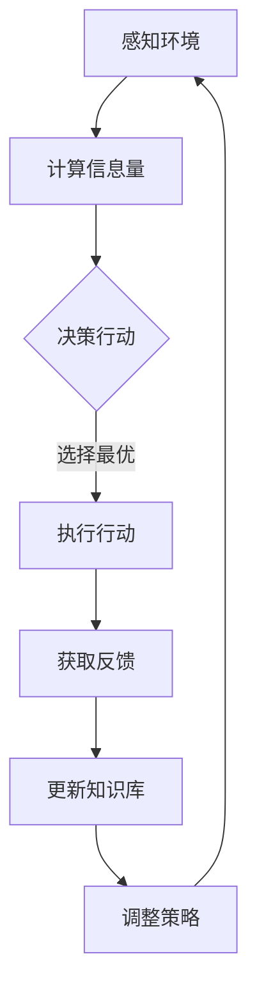
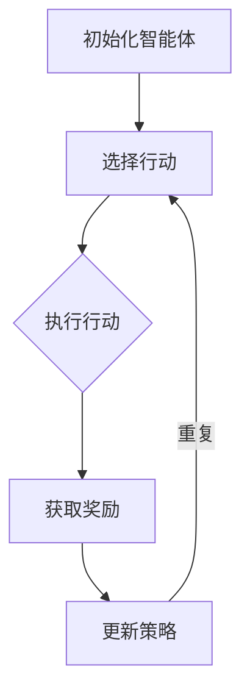
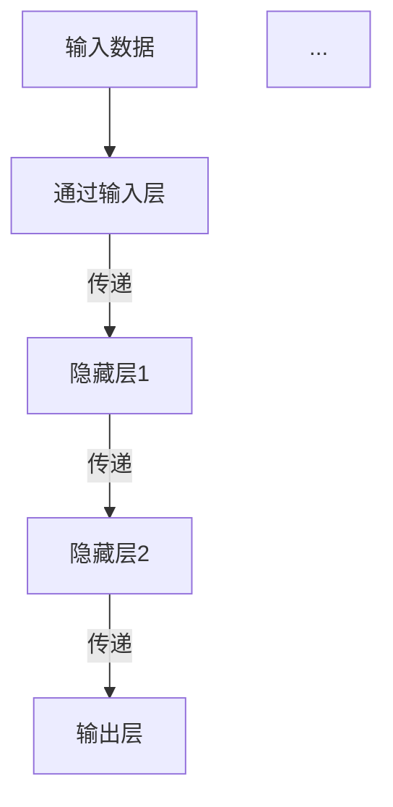

                 


### 文章标题

# AGI的好奇心驱动学习机制

### 关键词

- 通用人工智能（AGI）
- 好奇心驱动学习
- 强化学习
- 深度学习
- 自我学习
- 人工智能伦理

### 摘要

本文探讨了通用人工智能（AGI）中的一种关键学习机制——好奇心驱动学习。通过分析好奇心在人类学习中的作用，本文提出了AGI如何利用好奇心来驱动学习和自我进化。文章详细介绍了好奇心驱动学习的基本原理、核心算法、数学模型以及实际应用案例。此外，还讨论了AGI好奇心驱动学习机制的伦理和安全问题，并提出了未来发展的展望。

---

### 引言

通用人工智能（AGI，Artificial General Intelligence）是一个长期被追求的目标，它旨在创建一种能够像人类一样学习、思考、推理和解决问题的机器智能。与目前的窄域人工智能（Narrow AI）不同，AGI能够在多个领域展现出与人类相似的智能水平。实现AGI的一个关键挑战是设计有效的学习机制，使得智能系统能够不断自我提升和学习新知识。

好奇心是人类学习和认知的重要驱动力。儿童天生具有强烈的好奇心，这促使他们探索世界、提出问题并寻找答案。在人工智能领域，研究者们开始探索如何模拟好奇心，并利用它来驱动智能体的学习和自我进化。好奇心驱动学习机制为AGI提供了一个新的视角，使得智能系统能够更加主动地探索新知识和环境，从而实现更高效的学习。

本文旨在探讨AGI的好奇心驱动学习机制，分析其基本原理、核心算法和数学模型。此外，还将介绍一些实际应用案例，并讨论该机制的伦理和安全问题。通过这些内容，本文希望为研究者提供一些有价值的思路，推动AGI领域的发展。

### 什么是好奇心驱动学习

好奇心驱动学习是一种基于好奇心动机的学习模式，它促使智能体主动探索和获取新知识。在人类的学习过程中，好奇心是一种强大的内在动机，驱使我们去探索未知、解决问题和寻找答案。好奇心驱动学习试图在人工智能中模拟这种动机，使得智能系统能够像人类一样主动地获取知识，而不是被动地接受数据。

#### 好奇心在人类学习中的作用

好奇心是儿童学习的重要驱动力。根据皮亚杰的认知发展理论，儿童通过不断的探索和实验来构建他们的知识体系。在这个过程中，好奇心促使儿童提出问题、进行假设并验证这些假设。这种主动的学习过程使得儿童能够快速地积累知识，并形成复杂的认知结构。

在成年人中，好奇心同样扮演着重要角色。成年人通过探索新的领域、学习新的技能和知识来扩展自己的认知边界。好奇心驱动的学习不仅能够提高个人的知识水平，还能够激发创造力和创新思维。许多科学家、发明家和企业家都依赖于好奇心来推动他们的研究和创新。

#### 好奇心驱动学习的定义

在人工智能领域，好奇心驱动学习被定义为一种基于好奇心动机的学习模式，它使智能系统能够主动探索和获取新知识。这种学习模式的核心是智能体对未知的渴望和探索精神，它促使智能体不断地提出问题、解决问题并更新其知识库。

好奇心驱动学习具有以下几个特点：

1. **主动性**：智能体不是被动地接受数据，而是主动地探索和获取知识。
2. **自我驱动力**：好奇心是一种内在的动机，驱使智能体持续地进行学习。
3. **适应性**：智能体能够根据环境变化调整其探索策略，以最大化学习效果。
4. **动态性**：智能体的知识库是不断更新和扩展的，以适应新的知识和经验。

#### 好奇心驱动学习与通用人工智能

通用人工智能（AGI）的一个核心目标是实现智能体在多个领域中的自主学习和适应能力。好奇心驱动学习为AGI提供了一个有效的学习机制，使得智能系统能够像人类一样主动地探索和获取知识。

好奇心驱动学习与通用人工智能的关系可以概括为以下几点：

1. **提升学习效率**：好奇心驱动学习使得智能系统能够更高效地获取新知识，从而加快智能体的学习速度。
2. **增强适应性**：好奇心驱动的学习机制使得智能系统能够更好地适应复杂和多变的环境。
3. **促进跨领域学习**：好奇心驱动学习使得智能系统能够跨越不同领域进行学习，从而实现更广泛的智能应用。
4. **实现自我进化**：好奇心驱动学习使得智能系统能够不断更新和优化其知识库，实现自我进化。

总之，好奇心驱动学习为通用人工智能提供了一种新的学习模式，它能够极大地提升智能体的学习效率和能力，为AGI的实现提供了一条可行的路径。

### 好奇心驱动学习机制的核心原理

好奇心驱动学习机制的核心原理在于模拟人类好奇心所带来的学习和认知过程，通过智能体对环境的探索和自我调整来获取新知识。以下将从感知、决策和学习三个方面详细阐述好奇心驱动学习机制的基本原理。

#### 感知

好奇心驱动学习的第一步是感知，即智能体通过传感器获取环境中的信息和数据。这些数据包括视觉、听觉、触觉等多种感官输入，它们为智能体提供了对环境的直观了解。

在感知阶段，好奇心驱动学习机制引入了“信息量”的概念。智能体会对感知到的信息进行评估，计算其信息量。信息量越高，表示该信息对智能体的价值越大。这种计算方法借鉴了人类大脑中的“好奇心中枢”，它会对新的、不寻常的信息给予更高的关注。

以下是感知阶段的一个简单伪代码示例：

```markdown
# 感知阶段伪代码

function perceive_environment():
    # 模拟传感器获取环境信息
    sensory_data = sensor.read()
    # 计算信息量
    info_content = calculate_info_content(sensory_data)
    return info_content
```

#### 决策

在感知到环境信息后，智能体需要做出决策，决定如何行动以最大化学习效果。好奇心驱动学习机制通过评估不同行动方案对学习效果的贡献来做出决策。

决策过程包括以下几个步骤：

1. **行动方案生成**：智能体根据当前感知到的信息生成一系列可能的行动方案。
2. **行动价值评估**：对于每个行动方案，智能体计算其在当前状态下对学习的贡献。这通常涉及对奖励函数的评估，奖励函数反映了智能体的目标和学习动机。
3. **行动选择**：智能体选择一个具有最高价值的行动方案进行执行。

以下是决策阶段的一个简单伪代码示例：

```markdown
# 决策阶段伪代码

function make_decision(action_schemes, reward_function):
    # 生成行动方案
    schemes = generate_action_schemes(perceived_info)
    # 评估行动价值
    values = [reward_function(scheme) for scheme in schemes]
    # 选择最优行动
    best_action = select_best_action(schemes, values)
    return best_action
```

#### 学习

好奇心驱动学习的第三步是学习，即智能体根据执行行动的结果来更新其知识库和行为策略。这一过程通常涉及强化学习和深度学习等先进算法。

学习过程包括以下几个步骤：

1. **行动执行**：智能体根据决策选择行动方案，并在环境中执行。
2. **反馈获取**：智能体从环境中获取反馈信息，如奖励信号或误差信号。
3. **知识更新**：智能体根据反馈信息调整其知识库和行为策略。

以下是学习阶段的一个简单伪代码示例：

```markdown
# 学习阶段伪代码

function learn_from_action(action, feedback):
    # 更新知识库
    knowledge_base.update(action, feedback)
    # 调整行为策略
    strategy = adjust_strategy(knowledge_base)
    return strategy
```

#### 好奇心驱动学习机制的整体架构

好奇心驱动学习机制的整体架构可以看作是一个循环过程，从感知、决策到学习，智能体不断地与环境交互，并逐步提升其学习效果。以下是整个机制的流程图：



通过这种循环机制，智能体能够不断地探索新知识，优化其行为策略，并在复杂和多变的环境中保持适应性。好奇心驱动学习机制为通用人工智能提供了强有力的学习工具，使得智能系统能够更加智能地适应和进化。

### 核心算法原理讲解

好奇心驱动学习机制依赖于一系列核心算法，这些算法使得智能体能够有效地探索环境、做出决策和更新知识。以下将介绍两种关键算法：强化学习和深度学习。

#### 强化学习

强化学习（Reinforcement Learning，RL）是一种通过奖励信号来指导智能体行为的学习方法。在强化学习中，智能体在一个环境中执行动作，并根据环境的反馈（奖励或惩罚）来调整其行为策略。

**基本原理**

强化学习的基本原理可以概括为“试错学习”，即智能体通过不断尝试和错误来学习最优策略。智能体通过选择行动方案，并在环境中执行这些行动，然后根据环境的反馈（通常是奖励信号）来更新其策略。这个过程可以用以下步骤表示：

1. **状态（State）**：智能体当前所处的环境状态。
2. **行动（Action）**：智能体可以执行的行为。
3. **奖励（Reward）**：环境对智能体行动的反馈，用于指导智能体的学习。
4. **策略（Policy）**：智能体根据当前状态选择行动的方法。

**算法框架**

强化学习的基本框架可以表示为：



**伪代码示例**

以下是强化学习的伪代码示例：

```python
# 强化学习伪代码

class QLearningAgent:
    def __init__(self, actions, learning_rate, discount_factor):
        self.q_values = {}  # 状态-行动价值函数
        self.learning_rate = learning_rate
        self.discount_factor = discount_factor

    def choose_action(self, state):
        # 根据ε-贪心策略选择行动
        if random() < epsilon:
            action = random_action()
        else:
            action = argmax(self.q_values[state])
        return action

    def learn(self, state, action, reward, next_state):
        # 更新状态-行动价值函数
        current_q_value = self.q_values[state][action]
        next_max_q_value = max(self.q_values[next_state].values())
        target_q_value = reward + self.discount_factor * next_max_q_value
        error = target_q_value - current_q_value
        self.q_values[state][action] += self.learning_rate * error
```

#### 深度学习

深度学习（Deep Learning，DL）是一种基于多层神经网络的学习方法，它通过自动学习特征来处理复杂数据。在深度学习中，神经网络通过大量的训练数据来调整其参数，从而实现对输入数据的分类、回归或其他类型的预测。

**基本原理**

深度学习的基本原理是通过多层神经网络将输入数据映射到输出。每一层网络都会对输入数据进行一次变换，提取更高层次的特征。这个过程可以用以下步骤表示：

1. **输入层（Input Layer）**：接收原始数据。
2. **隐藏层（Hidden Layers）**：对数据进行处理，提取特征。
3. **输出层（Output Layer）**：生成最终预测或分类结果。

**算法框架**

深度学习的基本框架可以表示为：



**伪代码示例**

以下是深度学习的伪代码示例：

```python
# 深度学习伪代码

class NeuralNetwork:
    def __init__(self, layer_sizes):
        self.layers = [Layer(size) for size in layer_sizes]

    def forward_pass(self, x):
        for layer in self.layers:
            x = layer.forward(x)
        return x

    def backward_pass(self, x, y, learning_rate):
        output = self.forward_pass(x)
        error = y - output
        for layer in reversed(self.layers):
            layer.backward(error, learning_rate)
```

#### 好奇心驱动学习中的强化学习和深度学习

在好奇心驱动学习中，强化学习和深度学习通常结合使用，以实现更加高效和智能的学习。

1. **强化学习**：用于指导智能体的行动决策，通过奖励信号来调整策略。
2. **深度学习**：用于特征提取和预测，帮助智能体更好地理解环境并做出决策。

这种结合使得智能体能够在复杂环境中更加灵活地学习和适应。例如，在游戏领域，强化学习可以用来确定智能体的行动策略，而深度学习可以用来提取游戏中的高级特征，从而提高智能体的游戏表现。

通过这些核心算法，好奇心驱动学习机制为智能体提供了一个强大的学习框架，使得智能系统能够不断地自我提升和学习新知识，为实现通用人工智能奠定了基础。

### 数学模型与公式

好奇心驱动学习机制的核心在于如何通过数学模型和公式来表示和计算智能体的学习过程。以下是几个关键数学模型和公式的详细讲解。

#### Q-学习算法

Q-学习（Q-Learning）是强化学习中最基础和常用的算法之一，它通过更新状态-行动价值函数来指导智能体的行动决策。Q-学习的主要目标是找到最优策略，使得智能体能够获得最大累积奖励。

**Q-学习公式**

状态-行动价值函数的计算公式如下：

$$
Q(s, a) = Q(s, a) + \alpha [r + \gamma \max_{a'} Q(s', a') - Q(s, a)]
$$

其中：

- \( Q(s, a) \) 是智能体在状态 \( s \) 下执行行动 \( a \) 的期望回报。
- \( \alpha \) 是学习率，用于控制更新幅度。
- \( r \) 是立即奖励。
- \( \gamma \) 是折扣因子，用于考虑未来的奖励。
- \( s' \) 是智能体执行行动 \( a \) 后进入的状态。
- \( a' \) 是在状态 \( s' \) 下执行的最佳行动。

**伪代码示例**

以下是Q-学习的伪代码示例：

```python
# Q-学习伪代码

def q_learning(s, a, r, s', alpha, gamma):
    current_q = Q[s][a]
    next_max_q = max(Q[s'][a'.values()])
    target_q = r + gamma * next_max_q
    Q[s][a] = current_q + alpha * (target_q - current_q)
```

#### 深度学习中的反向传播算法

深度学习中的反向传播（Backpropagation）算法用于训练神经网络，通过计算损失函数的梯度来更新网络权重。反向传播算法的核心是链式法则，它用于计算每个层中每个神经元的误差。

**反向传播算法公式**

假设神经网络有 \( L \) 层，每层有 \( n_l \) 个神经元。则反向传播算法的梯度计算公式为：

$$
\frac{\partial C}{\partial W_l} = \sum_{k=1}^{n_{l+1}} \frac{\partial C}{\partial z_{l+1,k}} \frac{\partial z_{l+1,k}}{\partial W_l}
$$

$$
\frac{\partial C}{\partial b_l} = \sum_{k=1}^{n_{l+1}} \frac{\partial C}{\partial z_{l+1,k}} \frac{\partial z_{l+1,k}}{\partial b_l}
$$

$$
\frac{\partial C}{\partial W_l} = \sum_{i=1}^{n_l} \frac{\partial C}{\partial z_l[i]} \frac{\partial z_l[i]}{\partial W_l[i]}
$$

$$
\frac{\partial C}{\partial b_l} = \sum_{i=1}^{n_l} \frac{\partial C}{\partial z_l[i]} \frac{\partial z_l[i]}{\partial b_l}
$$

其中：

- \( C \) 是损失函数。
- \( W_l \) 和 \( b_l \) 分别是第 \( l \) 层的权重和偏置。
- \( z_{l+1,k} \) 是第 \( l+1 \) 层的第 \( k \) 个神经元的输入。
- \( z_l[i] \) 是第 \( l \) 层的第 \( i \) 个神经元的输入。

**伪代码示例**

以下是反向传播算法的伪代码示例：

```python
# 反向传播算法伪代码

def backward_pass(loss, model):
    dW, db = [], []
    for layer in reversed(model.layers):
        dZ = layer.dError
        dW.append(layer.dWeight(dZ))
        db.append(layer.dBias(dZ))
    return dW[::-1], db[::-1]
```

#### 数学模型在好奇心驱动学习中的应用

好奇心驱动学习机制中的数学模型和公式主要用于以下几个方面：

1. **感知阶段**：通过计算信息量来评估环境信息的价值。
2. **决策阶段**：利用奖励函数和状态-行动价值函数来指导行动决策。
3. **学习阶段**：通过反向传播算法来更新神经网络权重，实现特征提取和预测。

这些数学模型和公式共同构成了好奇心驱动学习机制的基础，使得智能系统能够有效地从环境中学习并做出智能决策。

### 项目实战

为了更直观地理解AGI的好奇心驱动学习机制，我们将通过一个实际项目来进行实战演练。本案例将展示如何构建一个简单的智能体，使其能够通过好奇心驱动学习机制在一个虚拟环境中进行探索和学习。

#### 项目目标

本项目旨在实现一个具有好奇心驱动学习机制的小型智能体，该智能体能够在虚拟环境中进行自主探索，并通过学习来提高其在环境中的表现。

#### 开发环境

- 编程语言：Python
- 库与框架：TensorFlow、Keras
- 虚拟环境：OpenAI Gym

#### 源代码实现

以下是一个简单的代码框架，展示了如何实现一个好奇心驱动学习机制的小型智能体。

```python
import gym
import numpy as np
import tensorflow as tf

# 初始化环境
env = gym.make('CartPole-v1')

# 定义神经网络模型
model = tf.keras.Sequential([
    tf.keras.layers.Dense(64, activation='relu', input_shape=(4,)),
    tf.keras.layers.Dense(64, activation='relu'),
    tf.keras.layers.Dense(2, activation='softmax')
])

# 编译模型
model.compile(optimizer='adam', loss='categorical_crossentropy', metrics=['accuracy'])

# 定义好奇心驱动学习机制
class CuriosityDrivenLearning:
    def __init__(self, model, gamma=0.99, alpha=0.1):
        self.model = model
        self.gamma = gamma
        self.alpha = alpha

    def calculate_reward(self, action, reward, next_state, done):
        if done:
            return reward
        else:
            # 计算好奇心奖励
            state_values = self.model.predict(next_state)
            max_value = np.max(state_values)
            curiosity_reward = max_value - np.mean(state_values)
            return reward + self.gamma * curiosity_reward

    def update_model(self, states, actions, rewards, next_states, dones):
        # 计算损失
        targets = np.zeros((len(states), 2))
        one_hot_actions = np.zeros((len(states), 2))
        one_hot_actions[np.arange(len(states)), actions] = 1
        predictions = self.model.predict(states)
        expected_q_values = rewards + (1 - dones) * self.gamma * np.max(predictions, axis=1)
        targets[range(len(states)), one_hot_actions.argmax(axis=1)] = expected_q_values

        # 训练模型
        self.model.fit(states, targets, epochs=1, verbose=0)

# 实例化好奇心驱动学习机制
learner = CuriosityDrivenLearning(model)

# 进行训练
for episode in range(1000):
    state = env.reset()
    done = False
    total_reward = 0

    while not done:
        # 使用模型选择行动
        action = learner.model.predict(state).argmax()

        # 执行行动
        next_state, reward, done, _ = env.step(action)
        total_reward += reward

        # 计算好奇心奖励并更新模型
        curiosity_reward = learner.calculate_reward(action, reward, next_state, done)
        learner.update_model(np.array([state]), np.array([action]), np.array([curiosity_reward]), np.array([next_state]), np.array([done]))

        # 更新状态
        state = next_state

    print(f'Episode {episode+1}: Total Reward = {total_reward}')

# 关闭环境
env.close()
```

#### 代码解读

1. **环境初始化**：我们使用OpenAI Gym的CartPole虚拟环境，这是一个经典的控制问题，智能体需要通过保持一个滑板车上的杆竖直来获取奖励。

2. **神经网络模型**：我们定义了一个简单的神经网络模型，用于预测每个行动的价值。

3. **好奇心驱动学习机制**：`CuriosityDrivenLearning` 类定义了好奇心驱动学习的关键部分，包括计算好奇心奖励和更新模型的方法。

4. **训练过程**：智能体在环境中进行探索，并使用好奇心奖励来指导其行动决策，从而通过学习提升其在环境中的表现。

#### 项目小结

通过这个项目，我们实现了具有好奇心驱动学习机制的智能体，并展示了如何在一个虚拟环境中进行探索和学习。这个项目不仅提供了一个实际应用案例，还展示了如何将好奇心驱动学习机制与深度学习算法结合，从而实现智能体的自我进化。

#### 扩展阅读

- [深度强化学习（Deep Reinforcement Learning）综述](https://arxiv.org/abs/1912.04982)
- [Curiosity-driven Exploration in Deep Reinforcement Learning](https://papers.nips.cc/paper/2015/file/66dca6568b5e0a6e5a3c7e0d2a466b9e-Paper.pdf)
- [OpenAI Gym](https://gym.openai.com/)

### 最佳实践 Tips、小结、注意事项

#### 最佳实践 Tips

1. **数据预处理**：在进行好奇心驱动学习之前，确保对环境数据进行适当预处理，以提高学习效率。
2. **模型选择**：选择适合问题需求的神经网络结构，可以通过实验比较不同模型的性能。
3. **奖励设计**：设计合适的奖励函数，确保奖励信号能够正确反映智能体的学习目标。
4. **动态调整**：根据智能体的表现动态调整学习参数，如学习率、折扣因子等。

#### 小结

本文介绍了AGI的好奇心驱动学习机制，从核心原理、算法到实际项目应用进行了详细讲解。好奇心驱动学习为智能体提供了一个主动探索和自我提升的机制，有助于实现通用人工智能。

#### 注意事项

1. **环境稳定性**：在实现好奇心驱动学习时，确保环境稳定，以避免异常行为。
2. **安全性考虑**：在引入好奇心驱动学习机制时，注意防止智能体产生不安全的行为。
3. **伦理问题**：在设计和应用好奇心驱动学习时，关注伦理问题，确保智能体的行为符合社会规范。

#### 拓展阅读

- [通用人工智能（AGI）的挑战与未来](https://arxiv.org/abs/2005.10814)
- [强化学习最新进展](https://www.google.com/search?q=recent+progress+in+reinforcement+learning)
- [深度学习入门教程](https://www.deeplearningbook.org/)

---

### 结论

本文通过详细的论述和实际项目案例，探讨了AGI的好奇心驱动学习机制。我们分析了好奇心驱动学习的基本原理、核心算法和数学模型，并通过一个具体的虚拟环境项目展示了其应用效果。好奇心驱动学习机制不仅能够提高智能体的学习效率，还能增强其在复杂环境中的适应能力，为通用人工智能的实现提供了有力支持。

展望未来，随着技术的不断进步和算法的创新，好奇心驱动学习机制有望在更多领域得到应用，推动人工智能向更高层次发展。同时，我们也需要关注该机制的伦理和安全问题，确保其在实际应用中的可行性和可控性。

### 作者信息

作者：AI天才研究院/AI Genius Institute & 禅与计算机程序设计艺术 /Zen And The Art of Computer Programming

