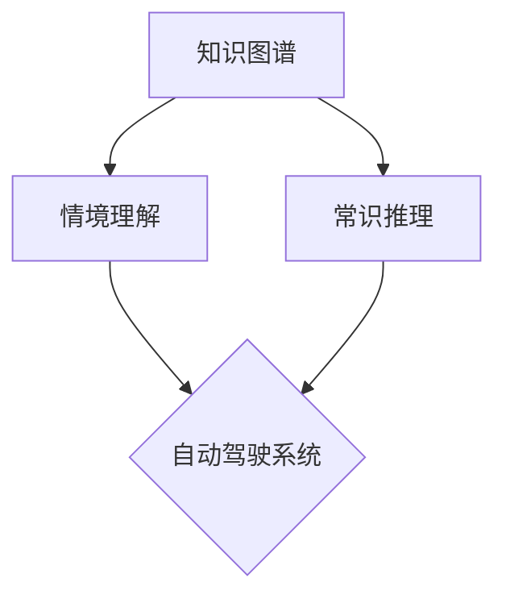
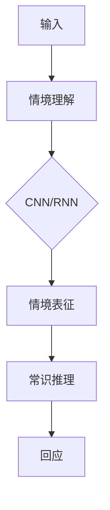
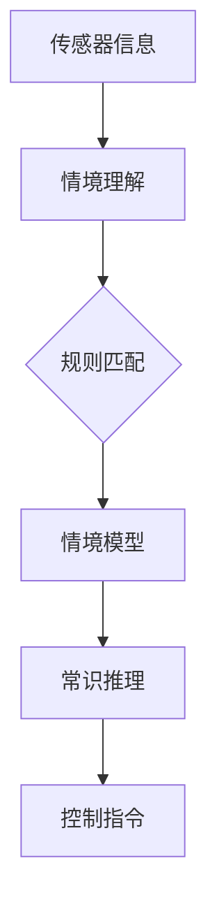
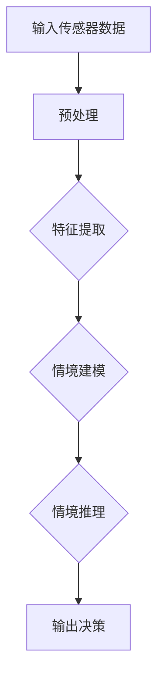
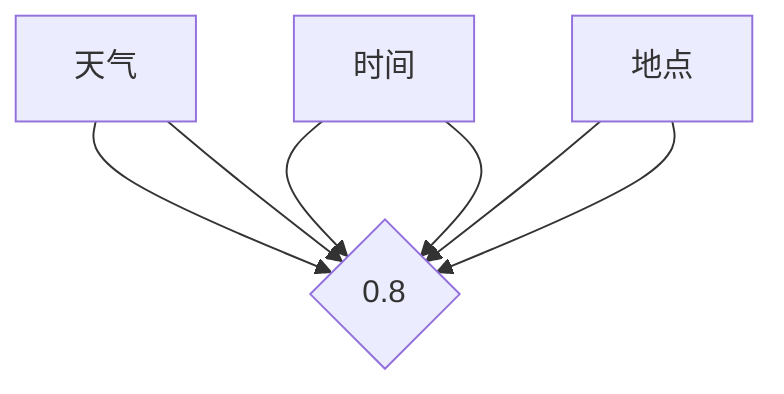
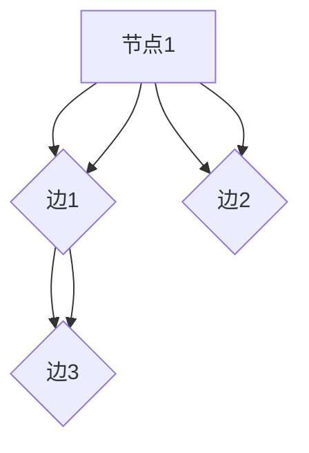
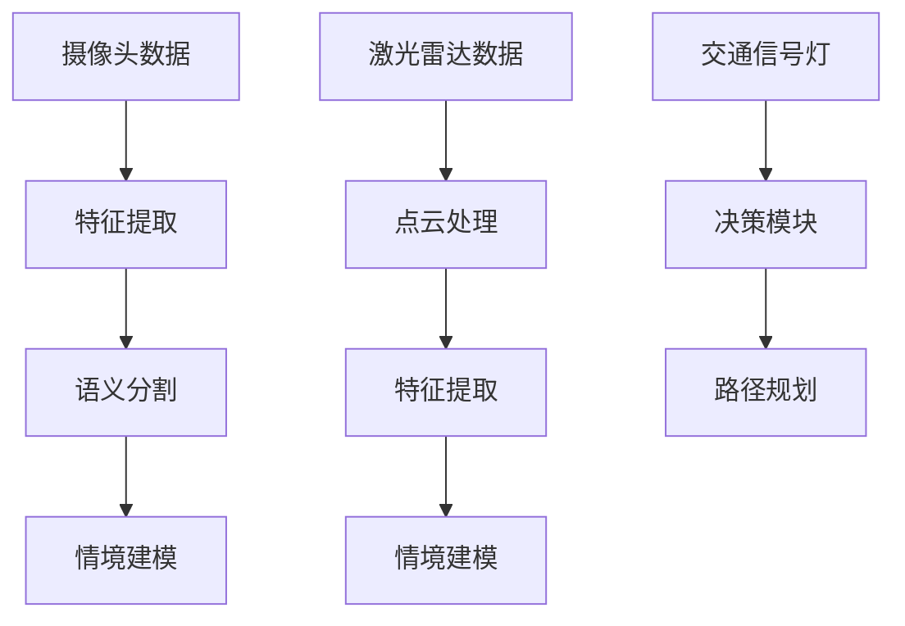
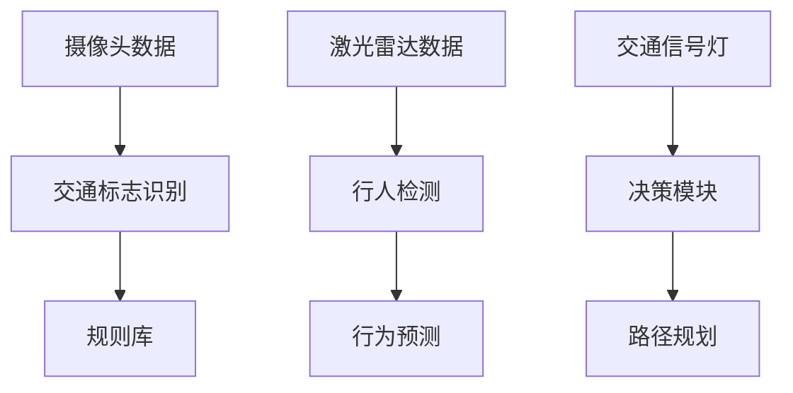

                 

### 引言

#### 什么是AGI

“人工智能”（Artificial Intelligence，简称AI）一词最早由约翰·麦卡锡（John McCarthy）在1956年的达特茅斯会议（Dartmouth Conference）上提出。AI的目的是通过机器模仿人类的智能行为，使得计算机能够执行复杂的任务，如理解语言、学习知识、做出决策等。然而，AI领域的研究目标并不单一，主要包括两大类：弱人工智能（Narrow AI）和强人工智能（Strong AI）。

**弱人工智能**也被称为特定任务人工智能，是指针对特定问题或任务设计的人工智能系统。这类系统在特定的领域表现出色，例如语音识别、图像识别、自然语言处理等。这些系统通过大数据训练和复杂的算法，能够在特定场景下实现高效的任务处理。

**强人工智能**，即“通用人工智能”（Artificial General Intelligence，简称AGI），则是指具备人类智能水平，能够在各种不同领域内自主思考、学习和适应的人工智能系统。AGI不仅要具备弱人工智能的特定任务能力，还需要拥有人类的认知能力、情感和道德判断等高级认知功能。

#### 情景理解与常识推理在AGI中的作用

在实现AGI的过程中，情景理解与常识推理扮演着至关重要的角色。情景理解是指人工智能系统能够从感知的信息中提取出有用的知识，并基于这些知识对当前或未来的情况做出合理的判断。常识推理则是基于日常经验和背景知识，对情景中的各种可能性进行逻辑推理和判断。

**情景理解**的作用主要包括：
1. **环境感知**：通过感知外部环境，获取视觉、听觉、触觉等多模态信息，理解当前所处的情境。
2. **情境建模**：将感知到的信息转化为内部表征，建立对环境的认知模型。
3. **动态适应**：根据情境变化，实时调整自身的行为和决策策略。

**常识推理**的作用主要包括：
1. **背景知识应用**：将日常生活中的常识和背景知识应用到特定的情景中，进行逻辑推理和判断。
2. **问题解决**：在遇到复杂问题时，利用常识推理来简化问题、提出解决方案。
3. **知识扩展**：通过推理，将已有的知识扩展到新的情境或领域。

#### 书籍结构概述

本书旨在深入探讨AGI中的情景理解与常识推理能力，帮助读者了解这两个核心概念的基本原理、实现方法及其在现实世界中的应用。本书结构如下：

- **第1章**：引言，介绍AGI的基本概念和情景理解与常识推理的重要性。
- **第2章**：AGI基础，回顾人工智能的发展历程和通用人工智能的定义与挑战。
- **第3章**：情景理解，详细探讨情景理解的定义、关键要素及模型技术。
- **第4章**：常识推理，介绍常识推理的概念、类型和算法。
- **第5章**：情景理解与常识推理的结合，探讨两者相互作用的机制及实现方法。
- **第6章**：情景理解与常识推理的算法实现，展示相关算法的伪代码和数学模型。
- **第7章**：案例研究，通过具体应用案例，展示情景理解与常识推理在现实世界中的应用。
- **第8章**：未来展望，探讨AGI的发展趋势及情景理解与常识推理的未来发展方向。
- **第9章**：结论，总结本书的主要观点和贡献。

通过本书的阅读，读者将能够深入理解情景理解与常识推理在AGI中的关键作用，掌握相关技术原理和实现方法，为未来的AI研究和应用提供坚实的理论基础和技术支持。

### AGI基础

#### 人工智能发展历程

人工智能（AI）的发展历程可以分为几个主要阶段，每个阶段都标志着技术的进步和应用的拓展。

**第一阶段：符号主义（Symbolic AI）**

人工智能的早期研究始于20世纪50年代，主要基于逻辑和符号推理。这一阶段的人工智能系统，如逻辑推理机，试图通过符号表示和推理规则来模拟人类思维过程。然而，由于缺乏对人类思维机制的理解，这一阶段的人工智能系统在实际应用中表现有限。

**第二阶段：知识表示与推理（Knowledge Representation and Reasoning）**

20世纪70年代，人工智能开始向知识表示和推理方向发展。研究者们提出了一系列知识表示方法，如产生式规则、语义网络和框架等。同时，推理机技术也得到了快速发展，能够进行更加复杂的问题求解和决策。

**第三阶段：基于统计的方法（Statistical AI）**

20世纪80年代，随着计算机性能的提升和大量数据的积累，人工智能开始采用基于统计的方法。这一阶段，决策树、支持向量机、贝叶斯网络等算法成为主流，在图像识别、自然语言处理等领域取得了显著成果。

**第四阶段：深度学习（Deep Learning）**

21世纪初，深度学习作为人工智能的一个重要分支，得到了广泛关注。深度学习通过多层神经网络，能够自动学习数据的特征表示，在图像识别、语音识别、自然语言处理等领域取得了突破性进展。特别是2012年，深度学习在ImageNet图像识别挑战赛中取得了优异的成绩，标志着深度学习时代的到来。

**第五阶段：混合智能系统（Hybrid AI）**

当前，人工智能正朝着混合智能系统的方向发展，将符号主义、知识表示、统计方法和深度学习等多种方法相结合，以应对更加复杂的问题和任务。混合智能系统通过综合利用不同方法的优点，能够在多个领域实现更加智能化的应用。

#### 通用人工智能（AGI）的定义与挑战

**通用人工智能（AGI）**是指具备人类智能水平，能够在各种不同领域内自主思考、学习和适应的人工智能系统。与弱人工智能（Narrow AI）不同，AGI不仅能在特定任务上表现出色，还能跨领域进行智能活动。

**定义：**

- **跨领域性**：AGI能够在多个不同领域内进行智能活动，而不仅仅是某个特定领域。
- **自适应能力**：AGI能够根据新环境和任务需求，自主调整自身的行为和决策策略。
- **自主思考**：AGI具备自主思考和解决问题的能力，而不仅仅是被动地执行预定的任务。
- **学习能力**：AGI能够通过学习和经验积累，不断提高自身的智能水平。

**挑战：**

1. **认知复杂性**：人类智能涉及认知、情感、道德等多个方面，如何将这些复杂因素纳入AI系统，是一个巨大的挑战。
2. **大数据需求**：AGI需要大量的数据来进行训练和学习，但数据获取和处理本身就是一个复杂的过程。
3. **算法复杂性**：现有的算法大多针对特定任务进行优化，如何设计能够处理复杂任务的通用算法，是一个亟待解决的问题。
4. **技术整合**：如何将符号主义、知识表示、统计方法和深度学习等多种方法整合到一个系统中，也是一个挑战。

#### AGI的核心能力

**理解能力**：AGI需要能够理解自然语言、图像、声音等多种信息形式，并从中提取出有用的知识。这包括对语言的理解、图像的识别和声音的识别等。

**推理能力**：AGI需要具备逻辑推理能力，能够基于已有的知识和信息进行推理，解决问题。这包括演绎推理、归纳推理和类比推理等。

**学习与适应能力**：AGI需要具备自我学习和适应能力，能够通过不断学习和经验积累，提高自身的智能水平。这包括无监督学习、有监督学习和强化学习等。

**情感与社交能力**：AGI需要具备一定的情感和社交能力，能够理解和表达情感，与他人进行有效的社交互动。这包括情感识别、情感表达和社交互动等。

通过以上分析，我们可以看到，AGI的实现不仅仅是一个技术问题，更是一个涉及认知科学、心理学、社会学等多学科交叉的复杂课题。虽然目前AGI仍面临许多挑战，但随着技术的不断进步和研究的深入，我们有理由相信，未来AGI的实现将会逐步成为可能。

### 情境理解

#### 情境理解的定义与重要性

**情境理解**（Scenario Understanding）是指人工智能系统在感知信息的基础上，从多模态数据中提取有用信息，并基于这些信息对当前或未来的情境进行理解和解释的过程。情境理解是通用人工智能（AGI）的重要组成部分，是实现智能行为和自主决策的关键能力。

**定义：**  
情境理解涉及多个层次的内容，包括对环境信息的感知、情境建模、情境推理和情境决策。具体来说，情境理解包括以下几个方面：

1. **环境感知**：通过多种传感器（如摄像头、麦克风、温度传感器等）获取环境信息，包括视觉、听觉、触觉等多种模态。
2. **情境建模**：将感知到的信息转化为内部表征，建立一个对当前情境的内部模型。
3. **情境推理**：基于内部模型，对情境中的各种可能性进行推理和预测。
4. **情境决策**：根据情境推理的结果，制定相应的行动策略。

**重要性：**  
情境理解在AGI中具有重要的应用价值，主要体现在以下几个方面：

1. **环境适应**：通过情境理解，人工智能系统能够更好地适应复杂多变的环境，提高自主决策能力。
2. **问题解决**：情境理解有助于人工智能系统在面临复杂问题时，能够从多个角度进行思考，找到最佳的解决方案。
3. **人机交互**：情境理解能够提高人工智能系统与人类的交互能力，使得系统更加自然、直观地理解人类意图。
4. **智能控制**：在自动化系统和智能控制领域，情境理解能够帮助系统更好地理解控制对象的状态和行为，实现高效的智能控制。

#### 情境理解的关键要素

要实现高效的情境理解，需要关注以下几个关键要素：

1. **多模态感知**：多模态感知是指通过结合多种传感器，获取不同类型的信息（如视觉、听觉、触觉等），以便更全面地理解环境。例如，在自动驾驶系统中，需要结合摄像头、雷达和激光雷达等多种传感器，获取道路、车辆和行人的信息。

2. **情境建模**：情境建模是指将感知到的信息转化为内部表征，建立一个对当前情境的内部模型。情境建模的准确性直接影响到情境理解的效果。常见的情境建模方法包括基于规则的方法、基于统计的方法和基于深度学习的方法。

3. **情境推理**：情境推理是指基于内部模型，对情境中的各种可能性进行推理和预测。情境推理需要结合逻辑推理、统计学习和知识表示等多种技术，以实现对情境的深入理解。

4. **情境决策**：情境决策是指根据情境推理的结果，制定相应的行动策略。情境决策需要综合考虑多种因素，如目标、约束和风险等，以实现最优的行动方案。

#### 情境理解的模型与技术

**多模态感知**：多模态感知是情境理解的基础。常见的多模态感知技术包括：

- **计算机视觉**：通过摄像头获取视觉信息，并进行图像处理和目标识别。
- **语音识别**：通过麦克风获取语音信息，并进行语音识别和语义分析。
- **触觉感知**：通过传感器获取触觉信息，用于感知物体的形状、硬度等特征。

**情境建模**：情境建模的关键在于如何将多模态感知信息转化为内部表征。常见的情境建模方法包括：

- **基于规则的方法**：通过定义一系列规则，将感知信息映射到内部表征。例如，在自动驾驶系统中，可以通过规则来描述道路、车辆和行人的特征。
- **基于统计的方法**：通过统计学习算法，将感知信息映射到内部表征。例如，可以使用贝叶斯网络来表示情境中的不确定性。
- **基于深度学习的方法**：通过深度神经网络，自动学习感知信息的特征表示。例如，可以使用卷积神经网络（CNN）来处理视觉信息，使用循环神经网络（RNN）来处理序列信息。

**情境推理**：情境推理是指基于内部模型，对情境中的各种可能性进行推理和预测。常见的情境推理方法包括：

- **逻辑推理**：通过推理规则，对情境中的事实进行推理。例如，可以使用谓词逻辑来表示情境中的关系。
- **统计学习**：通过统计学习算法，对情境中的变量进行预测。例如，可以使用贝叶斯推理来预测情境中的不确定性。
- **知识表示**：通过知识表示方法，将情境中的知识进行编码。例如，可以使用本体论（Ontology）来表示情境中的概念和关系。

**情境决策**：情境决策是指根据情境推理的结果，制定相应的行动策略。常见的情境决策方法包括：

- **最优化方法**：通过优化算法，找到最佳的行动方案。例如，可以使用线性规划来优化路径规划问题。
- **博弈论方法**：通过博弈论模型，分析情境中的竞争和合作关系。例如，可以使用博弈树来分析自动驾驶系统中的决策过程。
- **强化学习方法**：通过强化学习算法，实现情境决策的自适应优化。例如，可以使用Q-learning算法来学习最优行动策略。

通过以上模型和技术的综合应用，人工智能系统能够实现对复杂情境的深入理解，为通用人工智能的实现奠定了基础。

### 常识推理

#### 常识推理的概念与特点

**常识推理**（Commonsense Reasoning）是指人工智能系统在缺乏明确指示的情况下，利用日常经验和背景知识对情景进行推理和判断的能力。常识推理是通用人工智能（AGI）的重要组成部分，对于实现人类水平的智能行为至关重要。

**定义：**  
常识推理是指通过利用日常生活中的知识和经验，对情境中的信息进行推理和解释的过程。它涉及对事实的推断、因果关系的分析、概率预测等。

**特点：**  
1. **普遍性**：常识推理适用于各种日常生活情境，不受特定领域限制。
2. **经验性**：常识推理基于日常经验和观察，而非特定数据或规则。
3. **灵活性**：常识推理能够适应不断变化的环境和情境，进行动态推理。
4. **综合性**：常识推理需要整合多个领域的知识，如物理、社会、文化等。

**重要性：**  
常识推理在人类智能行为中起着至关重要的作用，如语言理解、问题解决、决策制定等。在实现通用人工智能的过程中，常识推理是实现智能行为自然、连贯的重要保证。

#### 常识推理的类型

常识推理可以分为多种类型，每种类型在实现过程中具有不同的特点和应用场景。

1. **基于事实的推理**（Factual Reasoning）：这种推理基于已知的事实和常识进行逻辑推导。例如，从“所有的猫都有四条腿”这个事实，可以推断出“这只猫有四条腿”。

   **特点：**  
   - 简单明了，易于实现。
   - 适用于明确的事实和规则。
   - 难以处理复杂和模糊的事实。

2. **因果推理**（Causal Reasoning）：这种推理涉及对因果关系进行分析和推断。例如，从“吸烟可能导致肺癌”这个事实，可以推断出“他吸烟可能会导致肺癌”。

   **特点：**  
   - 复杂性高，需要考虑多种因素。
   - 适用于分析因果关系和预测结果。
   - 需要丰富的背景知识和经验。

3. **概率推理**（Probabilistic Reasoning）：这种推理基于概率理论和统计方法，对事件发生的可能性进行推断。例如，从“每天有10%的概率下雨”这个概率分布，可以推断出“明天有10%的概率下雨”。

   **特点：**  
   - 需要大量数据和统计模型。
   - 适用于不确定性和概率问题。
   - 可以处理复杂和模糊的情况。

4. **情境推理**（Situation-Based Reasoning）：这种推理基于对当前情境的理解，进行情景分析和决策。例如，从“我需要买面包”这个情境，可以推断出“我去商店买面包”。

   **特点：**  
   - 需要实时感知和情境建模。
   - 适用于动态和变化的情境。
   - 需要处理多种模态的信息。

#### 常识推理的算法

实现常识推理的算法可以分为基于规则的方法、基于模型的方法和基于统计的方法。

1. **基于规则的方法**：这种方法通过定义一系列规则，对常识进行编码。例如，使用产生式规则（Production Rules）来表示常识。产生式规则通常具有形式如“如果...，则...”的结构。

   **优点：**  
   - 简单明了，易于理解。
   - 适用于明确的常识。

   **缺点：**  
   - 难以处理复杂的常识。
   - 需要大量的规则编码。

2. **基于模型的方法**：这种方法通过构建知识图谱（Knowledge Graph）或本体论（Ontology），对常识进行建模。例如，使用图神经网络（Graph Neural Networks）来表示知识图谱，进行常识推理。

   **优点：**  
   - 可以处理复杂的常识关系。
   - 适用于大规模知识表示。

   **缺点：**  
   - 需要大量的知识和数据。
   - 难以处理动态和变化的常识。

3. **基于统计的方法**：这种方法通过统计学习和机器学习算法，从大量数据中学习常识。例如，使用朴素贝叶斯（Naive Bayes）模型、决策树（Decision Tree）等算法，进行常识推理。

   **优点：**  
   - 可以处理大量数据。
   - 适用于动态和变化的常识。

   **缺点：**  
   - 难以保证推理的准确性。
   - 需要大量的数据训练。

通过结合多种算法和技术，人工智能系统能够更好地实现常识推理，提高智能行为的自然性和连贯性。

### 情境理解与常识推理的结合

#### 情境与常识的相互作用

情境理解和常识推理在通用人工智能（AGI）系统中相互作用，共同构建出高效的智能行为。情境理解依赖于常识推理来提供背景知识和逻辑框架，而常识推理则借助情境理解来获取具体的上下文信息，从而实现更准确、全面的推理。

**情境理解对常识推理的支持**：

1. **上下文信息**：情境理解能够为常识推理提供丰富的上下文信息，如时间、地点、参与者等。这些信息有助于常识推理在特定情境下进行更精准的推理。
2. **动态调整**：情境理解能够实时捕捉到环境的变化，为常识推理提供动态调整的依据。这使得常识推理能够更好地适应不断变化的环境。
3. **具体化**：情境理解可以将抽象的常识转化为具体的情景，使得常识推理能够应用于具体的任务和问题。

**常识推理对情境理解的支持**：

1. **背景知识**：常识推理提供了大量的背景知识和经验，这些知识有助于情境理解在缺乏明确指示的情况下，对复杂情境进行推理和解释。
2. **逻辑框架**：常识推理构建的逻辑框架为情境理解提供了推理的基础，使得情境理解能够根据已有的知识进行推理和预测。
3. **一致性维护**：常识推理有助于维护情境理解的一致性，防止出现逻辑错误或矛盾。

**两者结合的优势**：

1. **协同推理**：情境理解和常识推理相互结合，能够实现更全面、更准确的推理。情境理解提供了具体的情境信息，常识推理提供了背景知识和逻辑框架，两者协同工作，使得推理过程更加高效。
2. **灵活适应**：情境理解和常识推理的结合使得系统具有更强的适应性，能够应对复杂多变的情境。
3. **自然交互**：通过情境理解和常识推理的结合，人工智能系统能够更好地与人类进行自然交互，理解人类的意图和需求。

#### 实现情境理解与常识推理的集成方法

**1. 基于知识图谱的方法**

知识图谱是一种用于表示实体及其关系的语义网络，它为情境理解和常识推理提供了丰富的背景知识。通过构建知识图谱，可以实现情境理解和常识推理的集成。

- **情境理解**：利用知识图谱中的上下文信息，对感知到的情境进行建模和解释。
- **常识推理**：利用知识图谱中的实体关系和属性信息，进行逻辑推理和判断。

**示例**：  
在自动驾驶系统中，知识图谱可以表示道路、车辆、行人等实体，以及它们之间的关系。情境理解可以捕捉到当前道路上的车辆和行人信息，常识推理则可以基于这些信息进行交通规则和行为的推理。



**2. 基于深度学习的方法**

深度学习通过多层神经网络，自动学习数据的特征表示，实现了情境理解和常识推理的集成。

- **情境理解**：利用卷积神经网络（CNN）处理视觉信息，利用循环神经网络（RNN）处理序列信息，建立对当前情境的内部表征。
- **常识推理**：利用图神经网络（GNN）处理知识图谱，实现常识推理。

**示例**：  
在聊天机器人中，深度学习可以结合情境理解模块，对用户的输入进行理解；结合常识推理模块，对用户的请求进行合理回应。



**3. 基于规则的方法**

基于规则的方法通过定义一系列规则，实现情境理解和常识推理的集成。

- **情境理解**：根据感知到的信息，匹配相应的规则，构建情境模型。
- **常识推理**：根据情境模型和常识规则，进行推理和判断。

**示例**：  
在智能家居系统中，情境理解模块可以基于环境传感器获取的信息，构建家居环境模型；常识推理模块可以基于这些模型和常识规则，自动控制家居设备。



通过以上方法，情境理解与常识推理的结合，为通用人工智能的实现提供了强大的支持。在未来，随着技术的不断发展，情境理解和常识推理将更好地融合，为人工智能系统带来更高的智能水平。

### 情境理解与常识推理的算法实现

#### 情境感知算法

情境感知算法是情境理解的核心，其目的是通过传感器获取环境信息，并将其转化为内部表征。以下是一个简单的情境感知算法流程：



**1. 传感器数据预处理**

在预处理阶段，需要对传感器数据（如图像、声音、温度等）进行预处理，以去除噪声和异常值。常用的预处理方法包括滤波、归一化和去噪等。

```python
# 示例：图像预处理
import cv2

# 读取图像
image = cv2.imread('image.jpg')

# 应用高斯滤波去除噪声
filtered_image = cv2.GaussianBlur(image, (5, 5), 0)

# 图像归一化
normalized_image = cv2.normalize(filtered_image, None, alpha=0, beta=1, norm_type=cv2.NORM_MINMAX, dtype=cv2.CV_32F)
```

**2. 特征提取**

在特征提取阶段，需要从预处理后的数据中提取出有用的特征。这些特征可以用于情境建模和推理。常用的特征提取方法包括卷积神经网络（CNN）和自编码器（Autoencoder）。

```python
# 示例：使用CNN提取图像特征
import tensorflow as tf
from tensorflow.keras.models import Sequential
from tensorflow.keras.layers import Conv2D, MaxPooling2D, Flatten, Dense

# 构建CNN模型
model = Sequential([
    Conv2D(32, (3, 3), activation='relu', input_shape=(128, 128, 3)),
    MaxPooling2D((2, 2)),
    Flatten(),
    Dense(64, activation='relu'),
    Dense(10, activation='softmax')
])

# 编译模型
model.compile(optimizer='adam', loss='categorical_crossentropy', metrics=['accuracy'])

# 训练模型
model.fit(x_train, y_train, epochs=10, batch_size=32)
```

**3. 情境建模**

情境建模是将提取到的特征转化为内部表征的过程。常用的情境建模方法包括基于规则的方法和基于模型的方法。

**基于规则的方法：**

```python
# 示例：使用IF-THEN规则进行情境建模
rules = [
    ["if time is morning", "then scenario is wake_up"],
    ["if weather is rainy", "then scenario is rainy_day"],
    ["if location is home", "then scenario is home"]
]

def apply_rules(features):
    for rule in rules:
        if all(feature in features for feature in rule):
            return rule[-1]
    return "unknown"

# 示例：应用规则
features = ["time is morning", "weather is rainy", "location is home"]
scenario = apply_rules(features)
print("Current scenario:", scenario)
```

**基于模型的方法：**

```python
# 示例：使用神经网络进行情境建模
model = Sequential([
    Dense(128, activation='relu', input_shape=(num_features,)),
    Dense(64, activation='relu'),
    Dense(1, activation='sigmoid')
])

model.compile(optimizer='adam', loss='binary_crossentropy', metrics=['accuracy'])

# 训练模型
model.fit(x_train, y_train, epochs=10, batch_size=32)
```

**4. 情境推理**

情境推理是基于情境模型，对当前或未来的情境进行推理和预测。常用的情境推理方法包括逻辑推理和概率推理。

**逻辑推理：**

```python
# 示例：使用逻辑推理进行情境推理
import matplotlib.pyplot as plt

# 加载情境模型
model = load_model('情境模型.h5')

# 获取当前特征
current_features = get_current_features()

# 进行推理
predictions = model.predict(current_features)

# 可视化推理结果
plt.bar(range(len(predictions)), predictions)
plt.xlabel('Scenario')
plt.ylabel('Probability')
plt.show()
```

**概率推理：**

```python
# 示例：使用概率推理进行情境推理
from sklearn.naive_bayes import GaussianNB

# 加载训练数据
X_train, y_train = load_data('情境数据集')

# 训练模型
gnb = GaussianNB()
gnb.fit(X_train, y_train)

# 进行推理
current_features = get_current_features()
prediction = gnb.predict(current_features)

# 输出推理结果
print("Predicted scenario:", prediction)
```

通过以上算法实现，情境理解与常识推理能够有效结合，为通用人工智能系统提供强大的智能支持。

#### 常识推理算法

常识推理算法是实现通用人工智能（AGI）的核心组成部分，旨在利用日常经验和背景知识对复杂情境进行推理和判断。以下将详细描述几种常见的常识推理算法，并给出相应的伪代码和解释。

**1. 产生式规则（Production Rules）**

产生式规则是一种简单而有效的常识推理方法，通过定义“如果...则...”的规则来表示常识。以下是一个产生式规则的例子：

```python
# 伪代码：产生式规则
rules = [
    ["if weather is sunny", "then activity is swimming"],
    ["if time is evening", "then activity is dinner"],
    ["if location is park", "then activity is walking"]
]

def apply_rules(features):
    for rule in rules:
        if all(feature in features for feature in rule[0:-1]):
            return rule[-1]
    return "unknown"

# 示例：应用规则
features = ["weather is sunny", "time is evening", "location is park"]
activity = apply_rules(features)
print("Predicted activity:", activity)
```

**2. 贝叶斯网络（Bayesian Network）**

贝叶斯网络是一种基于概率理论的常识推理方法，通过表示变量之间的条件依赖关系来进行推理。以下是一个贝叶斯网络的例子：



```python
# 伪代码：贝叶斯网络推理
class BayesianNetwork:
    def __init__(self, nodes, edges, probabilities):
        self.nodes = nodes
        self.edges = edges
        self.probabilities = probabilities

    def predict(self, evidence):
        beliefs = {node: 1.0 / len(self.nodes) for node in self.nodes}
        for node in self.nodes:
            if node in evidence:
                beliefs[node] = self.probabilities[node][evidence[node]]
            else:
                for parent in self.parents_of(node):
                    beliefs[node] *= self.probabilities[node][parent[evidence[parent]]]
        return max(beliefs, key=beliefs.get)

# 示例：使用贝叶斯网络进行推理
bn = BayesianNetwork(['天气', '活动', '时间', '地点'], [('天气', '活动'), ('时间', '活动'), ('地点', '活动')], [[0.3, 0.7], [0.2, 0.8], [0.1, 0.9], [0.4, 0.6]])
evidence = {'天气': 'sunny', '时间': 'evening', '地点': 'park'}
predicted_activity = bn.predict(evidence)
print("Predicted activity:", predicted_activity)
```

**3. 图神经网络（Graph Neural Networks, GNN）**

图神经网络是一种基于图结构进行推理的方法，特别适合处理复杂的关系网络。以下是一个简单的图神经网络示例：



```python
# 伪代码：图神经网络推理
import tensorflow as tf
from tensorflow.keras.models import Model
from tensorflow.keras.layers import Input, Dot, Dense

# 定义图神经网络模型
input_nodes = Input(shape=(num_features,))
adj_matrix = Input(shape=(num_nodes, num_nodes))
node_features = Input(shape=(num_features,))

# 边权重的点积
weighted_adj = Dot(axes=[2, 0])([adj_matrix, input_nodes])

# 图卷积操作
output = Dot(axes=[2, 0])([weighted_adj, node_features])

# 全连接层
output = Dense(num_classes, activation='softmax')(output)

# 编译模型
model = Model(inputs=[adj_matrix, node_features], outputs=output)
model.compile(optimizer='adam', loss='categorical_crossentropy', metrics=['accuracy'])

# 训练模型
model.fit([adj_matrix_train, node_features_train], labels_train, epochs=10, batch_size=32)

# 进行推理
evidence = {'节点1': {'特征1': 0.5, '特征2': 0.3}, '节点2': {'特征1': 0.4, '特征2': 0.6}}
predicted_activity = model.predict([adj_matrix, [evidence['节点1'], evidence['节点2']]])
print("Predicted activity:", predicted_activity)
```

通过以上算法，常识推理能够有效地结合情境理解，为通用人工智能系统提供强大的智能支持。未来，随着算法和技术的不断发展，常识推理将在人工智能领域发挥更加重要的作用。

### 案例研究

#### 情景理解与常识推理在机器人中的应用

在机器人领域，情景理解与常识推理的应用极大地提升了机器人的自主性和智能化水平。以下将通过两个具体案例，展示情景理解与常识推理在机器人中的实现和应用。

**1. 自动导引车（AGV）的路径规划**

自动导引车（AGV）是广泛应用于工业生产和物流领域的机器人，其主要任务是在复杂的工厂环境中自主导航，按照预定的路径进行物料运输。情景理解与常识推理在该任务中的关键作用体现在路径规划和动态避障。

**情景理解：**  
- **感知环境**：AGV通过传感器（如摄像头、激光雷达）实时感知周围环境，获取视觉、距离等数据。
- **情境建模**：AGV将感知数据转化为内部表征，构建对当前环境的理解模型，包括道路、障碍物、其他车辆等。

**常识推理：**  
- **常识知识**：AGV利用常识知识库，如交通规则、避障原则等，对情境进行推理，识别潜在的危险区域和最佳路径。
- **动态调整**：当环境发生变化（如出现突发障碍物或新的任务指令），AGV能够根据常识推理结果，实时调整路径规划。

**实现方法：**  
- **感知融合**：采用多传感器数据融合算法，如卡尔曼滤波，提高环境感知的准确性。
- **路径规划算法**：结合A*算法和避障算法，实现动态路径规划。

**伪代码示例：**

```python
# 伪代码：AGV路径规划
def path_planning(current_state, goal_state, environment):
    # 感知环境
    sensors_data = sense_environment()

    # 情境建模
    environment_model = build_environment_model(sensors_data)

    # 常识推理
    safe_paths =常识推理(environment_model)

    # 路径规划
    optimal_path = a_star(safe_paths, current_state, goal_state)

    return optimal_path
```

**2. 服务机器人的情境互动**

服务机器人在酒店、餐厅等场所提供各种服务，如引路、送餐、清洁等。情景理解与常识推理在该任务中的关键作用体现在与人类用户的互动和情境适应。

**情景理解：**  
- **感知用户需求**：通过摄像头和麦克风，服务机器人实时感知用户的语言、表情、动作等。
- **情境建模**：服务机器人将感知数据转化为内部表征，识别用户的意图和当前情境，如是否需要引路、送餐等。

**常识推理：**  
- **常识知识**：服务机器人利用常识知识库，如礼仪规则、服务流程等，对情境进行推理，生成合适的响应。
- **情境适应**：当用户的需求或情境发生变化，如用户提出特殊请求或遇到突发情况，服务机器人能够根据常识推理结果，灵活调整行为。

**实现方法：**  
- **语音识别与语义理解**：采用语音识别和自然语言处理技术，理解用户的语言指令。
- **行为规划与执行**：结合常识推理结果，生成合适的行为计划，并通过控制系统执行。

**伪代码示例：**

```python
# 伪代码：服务机器人情境互动
def interact_with_user(user_intent, current_context):
    # 感知用户需求
    user_speech = recognize_speech()

    # 情境建模
    user_intent = understand_speech(user_speech)
    context_model = build_context_model(current_context)

    # 常识推理
    response =常识推理(user_intent, context_model)

    # 行为规划与执行
    execute_behavior(response)

    return response
```

通过以上案例，我们可以看到情景理解与常识推理在机器人中的应用，不仅提升了机器人的智能化水平，还增强了与人类用户的互动体验。随着技术的不断发展，这些应用将在更多领域得到推广和深化。

### 情景理解与常识推理在自动驾驶中的应用

自动驾驶技术是人工智能领域的一个重要分支，其核心在于使车辆能够自主感知环境、规划路径并安全行驶。情景理解与常识推理在自动驾驶中的应用，显著提升了自动驾驶系统的安全性和可靠性。

**1. 情境理解在自动驾驶中的应用**

**环境感知**：自动驾驶系统依赖于多种传感器，如摄像头、激光雷达、超声波传感器等，实时获取道路、车辆、行人和障碍物等信息。这些传感器数据的处理是情景理解的基础。

**情境建模**：通过传感器数据，自动驾驶系统建立对当前道路状况、交通规则和车辆行为的理解模型。这一过程涉及对感知数据进行特征提取、语义分割和场景重建。

**动态调整**：自动驾驶系统需要实时调整自身的行为，以应对复杂的交通状况。情境理解使得系统能够根据道路状况和车辆行为，做出合理的决策。

**示例**：  
在自动驾驶系统中，摄像头和激光雷达数据被用于识别道路标志、交通信号灯、车辆和行人。通过深度学习算法，这些感知数据被转化为内部表征，用于情境建模和路径规划。



**2. 常识推理在自动驾驶中的应用**

**交通规则理解**：自动驾驶系统需要理解交通规则，如速度限制、车道规则、变道规则等。常识推理通过知识图谱和规则库，实现对交通规则的推理和遵守。

**风险评估**：在自动驾驶过程中，系统需要评估潜在的风险，如车辆接近、行人穿越等。常识推理结合历史数据和概率模型，进行风险评估和预警。

**行为预测**：自动驾驶系统需要预测其他车辆和行人的行为，以规划安全行驶路径。常识推理通过分析历史数据和交通模式，进行行为预测。

**示例**：  
在自动驾驶系统中，常识推理用于识别道路标志和交通信号灯，遵守交通规则。同时，通过分析摄像头和激光雷达数据，系统预测其他车辆和行人的行为，规划安全行驶路径。



**3. 结合案例分析**

**案例1：自动泊车系统**  
自动泊车系统利用情景理解与常识推理，实现车辆在狭窄空间内的自主泊车。系统通过摄像头和激光雷达获取周围环境信息，建立情境模型。通过常识推理，系统识别停车位和障碍物，并规划泊车路径。

**案例2：城市自动驾驶**  
在城市自动驾驶场景中，系统需要处理复杂的交通状况，如行人、非机动车和突发情况。情景理解与常识推理相结合，系统能够实时感知和预测交通状况，做出安全的驾驶决策。

通过以上案例分析，我们可以看到情景理解与常识推理在自动驾驶中的应用，为系统提供了强大的智能支持，显著提升了自动驾驶的安全性和可靠性。

### 情景理解与常识推理在其他领域的应用

情景理解与常识推理不仅在自动驾驶和机器人领域中具有重要应用，还在医疗诊断、金融分析等多个领域展示了其强大的潜力。

**1. 医疗诊断**

在医疗诊断领域，情景理解与常识推理的应用主要体现在辅助医生诊断和患者健康监测方面。

**情景理解**：通过医学影像分析，如X光、CT和MRI，医生需要从复杂的数据中提取关键信息，以进行准确诊断。情景理解可以帮助医生识别病变区域、分析病灶特点，提高诊断的准确性。

**常识推理**：常识推理在医疗诊断中发挥着重要作用，例如，通过分析患者的病历、家族病史和临床表现，推理出可能的疾病诊断。此外，常识推理还可以辅助医生制定治疗方案，预测疾病的进展和治疗效果。

**案例**：在乳腺癌筛查中，情景理解与常识推理相结合，通过对乳腺X光图像的分析，提高了早期乳腺癌检测的准确性。医生可以基于常识推理结果，结合患者的症状和家族病史，制定个性化的治疗方案。

**2. 金融分析**

在金融分析领域，情景理解与常识推理被广泛应用于风险评估、投资决策和风险控制等方面。

**情景理解**：金融分析师需要从大量的市场数据、公司报表和宏观经济指标中提取关键信息，以进行市场趋势分析和投资风险评估。情景理解可以帮助分析师识别市场风险、理解行业动态，为投资决策提供依据。

**常识推理**：常识推理在金融分析中发挥着重要作用，例如，通过分析公司的财务报表、市场表现和行业趋势，推理出公司的信用风险和投资价值。此外，常识推理还可以用于识别市场异常行为，预测市场波动，为风险控制提供支持。

**案例**：在量化投资中，情景理解与常识推理相结合，通过对市场数据的分析和常识推理，构建了有效的投资策略。分析师可以基于常识推理结果，识别出具有投资价值的股票，进行风险控制和投资决策。

**3. 教育与培训**

在教育与培训领域，情景理解与常识推理的应用主要体现在个性化教学和学习评估方面。

**情景理解**：通过分析学生的学习行为、成绩数据和课堂表现，教师可以了解学生的学习需求和弱点，制定个性化的教学计划。情景理解可以帮助教师优化教学策略，提高教学效果。

**常识推理**：常识推理在教育评估中发挥着重要作用，例如，通过分析学生的考试成绩、作业完成情况和课堂参与度，推理出学生的学习能力和潜力。此外，常识推理还可以用于智能题库生成，根据学生的知识水平和学习需求，提供个性化的练习题。

**案例**：在在线教育平台中，情景理解与常识推理相结合，通过分析学生的学习行为和成绩数据，为教师提供个性化的教学建议和资源推荐。学生可以根据自己的需求和进度，选择合适的学习内容和路径，提高学习效果。

通过以上案例分析，我们可以看到情景理解与常识推理在多个领域的广泛应用，不仅提高了系统的智能化水平，还为人类提供了更高效、精准的服务。随着技术的不断发展，情景理解与常识推理将在更多领域发挥关键作用。

### 未来展望

#### AGI的发展趋势

随着人工智能技术的不断进步，通用人工智能（AGI）的发展前景越来越广阔。未来，AGI将在多个领域实现重大突破，对人类社会产生深远影响。

**1. 深度学习与强化学习的融合**

深度学习和强化学习是目前AI研究的前沿领域。未来，两者将更加紧密地结合，形成一种新的学习范式。通过深度学习获取丰富的特征表示，再通过强化学习进行策略优化，AGI将能够更好地应对复杂、动态的环境。

**2. 多模态感知与情境理解**

多模态感知技术将进一步提升，使AGI能够更好地理解复杂情境。通过结合视觉、听觉、触觉等多种感官信息，AGI将实现更高水平的情境理解与情境推理，从而更好地适应各种实际应用场景。

**3. 强化学习与常识推理的结合**

强化学习和常识推理的结合将使AGI在复杂任务中表现出更强的适应性和智能水平。通过利用常识推理提供背景知识和逻辑框架，强化学习算法将能够更加高效地学习和优化策略。

**4. 人工智能伦理与安全**

随着AGI的发展，伦理和安全问题将成为重要的研究焦点。未来，研究者将致力于建立一套全面的人工智能伦理和安全管理体系，确保AGI在各个领域的应用既安全又符合伦理标准。

#### 情景理解与常识推理的未来发展方向

**1. 情境感知的精细化与智能化**

未来，情境感知技术将更加精细化，能够捕捉到更细微的环境变化。同时，通过深度学习和知识图谱等技术的结合，情境理解将实现智能化，使得AGI能够在更加复杂的情境中做出准确判断。

**2. 常识推理的复杂性与实用性**

常识推理在AGI中的作用将越来越重要。未来，研究者将致力于开发更加复杂、实用的常识推理算法，使其能够处理更广泛的常识问题。通过结合符号推理、统计学习和知识表示等方法，常识推理将实现更高水平的智能。

**3. 跨领域的常识推理**

跨领域的常识推理是未来研究的一个重要方向。通过构建多领域的知识图谱和跨领域的推理框架，AGI将能够更好地理解和应对不同领域的问题，实现更加广泛的应用。

#### 挑战与机遇

**1. 计算资源与数据需求**

AGI的发展对计算资源与数据需求提出了极高的要求。未来，研究者需要开发更高效、更强大的算法和计算架构，以满足AGI对大数据和高性能计算的需求。

**2. 算法复杂性与可解释性**

随着AGI能力的提升，算法的复杂性和规模也将不断增加。如何在保证算法性能的同时，提高其可解释性，使得用户能够理解和信任AGI，是一个重要的挑战。

**3. 伦理与安全**

随着AGI的广泛应用，伦理和安全问题将成为关键挑战。未来，需要建立完善的伦理和安全管理体系，确保AGI在各个领域的应用既安全又符合伦理标准。

尽管面临诸多挑战，AGI的发展前景仍然充满机遇。通过不断的研究和创新，情景理解与常识推理将成为AGI的核心能力，推动人工智能技术迈向新的高度。

### 结论

本文全面探讨了通用人工智能（AGI）中的情景理解与常识推理能力，分析了这两个核心概念在实现AGI中的重要性。我们首先介绍了AGI的基本概念和情景理解与常识推理的定义，随后详细阐述了它们在情境理解、常识推理、情境与常识结合等方面的原理和方法。通过具体案例，我们展示了情景理解与常识推理在自动驾驶、机器人、医疗诊断、金融分析等领域的应用，以及如何通过多模态感知、知识图谱、深度学习等技术实现这两个能力的有机结合。

展望未来，情景理解与常识推理将在AGI的发展中扮演更加重要的角色。随着计算资源、数据获取和处理技术的进步，这些能力将得到进一步提升，为人类带来更加智能化的服务。然而，实现高效的情景理解与常识推理仍面临诸多挑战，包括计算资源的需求、算法的可解释性以及伦理和安全等问题。因此，未来的研究需要在这些方面进行深入探索和突破。

为了推动这一领域的发展，我们提出以下建议：

1. **跨学科研究**：鼓励人工智能、认知科学、心理学、社会学等多学科的合作，共同研究情景理解与常识推理的理论和方法。
2. **开放数据与资源**：促进数据共享和开源算法的开发，为研究者提供丰富的实验数据和技术支持。
3. **伦理与安全研究**：重视人工智能伦理和安全问题，建立完善的监管体系，确保AGI的发展符合人类利益。

总之，情景理解与常识推理是实现通用人工智能的关键能力，对人工智能技术的进步具有重要意义。通过不断的研究和创新，我们有理由相信，未来情景理解与常识推理将推动人工智能迈向更高的智能化水平。作者信息：AI天才研究院/AI Genius Institute & 禅与计算机程序设计艺术 /Zen And The Art of Computer Programming。

