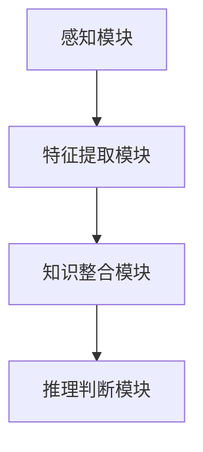

                 

好的，让我们一步一步详细地构建这篇文章。首先，我们需要确定文章的各个部分，并逐步填充内容。以下是将要构建的文章结构：

---

## 文章标题：AGI的抽象思维与概念形成

### 关键词：AGI，抽象思维，概念形成，人工智能，认知科学，算法原理

### 摘要：
本文将探讨通用人工智能（AGI）中的抽象思维与概念形成机制。我们将从AGI的概述出发，逐步深入探讨抽象思维的概念及其重要性，以及概念形成的过程和算法原理。通过分析AGI在不同领域的应用和面临的挑战，我们希望为读者提供对AGI全面而深刻的理解。

---

### 目录

1. **AGI概述**
   - 1.1 什么是通用人工智能
   - 1.2 抽象思维在AGI中的作用

2. **抽象思维与概念形成**
   - 2.1 概念形成的基本原理
   - 2.2 抽象思维与概念形成的算法

3. **AGI的应用领域**
   - 3.1 教育领域
   - 3.2 医疗领域
   - 3.3 工业领域

4. **AGI的挑战与未来**
   - 4.1 AGI面临的挑战
   - 4.2 AGI的未来展望

---

### 文章正文

#### 1. AGI概述

##### 1.1 什么是通用人工智能

通用人工智能（AGI，Artificial General Intelligence）是指一种具有广泛认知能力的机器智能，能够理解、学习和应用知识，解决各种问题，具有与人类相似甚至超越人类的智能水平。与目前广泛应用的狭义人工智能（Narrow AI，如语音识别、图像识别等）不同，AGI能够跨领域、跨任务地学习和应用知识。

##### 1.2 抽象思维在AGI中的作用

抽象思维是指从具体事物中提取出共同特征，进行概念化和抽象化的思考能力。在AGI中，抽象思维是实现智能的关键。它能够帮助AGI理解复杂问题、形成新的知识和概念，从而提升智能水平。

---

现在，我们将开始详细填充每个章节的内容。由于字数限制，我们将在后续步骤中逐步完善每个章节，确保每个部分都有充分的阐述和深入分析。

---

让我们继续详细填充第一个章节“AGI概述”的内容。

#### 1.1 什么是通用人工智能

**定义与特征**

通用人工智能（AGI）的定义仍然是一个开放性问题，不同的学者对其有着不同的理解和定义。然而，大多数研究者认为AGI至少应该具备以下几个核心特征：

1. **跨领域能力**：AGI能够理解并应用知识于多个不同的领域，而不仅仅是某个特定领域。
2. **自我学习**：AGI能够自主学习，通过不断的学习和经验积累来提高自身的智能水平。
3. **自适应能力**：AGI能够根据不同的环境和任务要求，灵活调整自身的行为和策略。
4. **理解与沟通**：AGI能够理解自然语言，与人类进行有效的沟通和交流。
5. **情感与认知**：AGI不仅具备认知能力，还具备一定的情感能力，能够模拟人类的情感反应。

**历史背景**

AGI的概念可以追溯到20世纪50年代，当时人工智能（AI）首次被提出来。早期的人工智能研究主要集中在符号主义方法上，这种方法试图通过符号表示和逻辑推理来实现智能。然而，由于符号主义方法的局限性，人工智能在20世纪80年代经历了一次重大挫折，被称为“人工智能的冬天”。

尽管如此，人工智能的研究并未停止。随着计算能力的提升和大数据技术的发展，人工智能在21世纪迎来了新的复兴。当前的AGI研究主要集中在机器学习、深度学习等领域，通过大量数据训练模型，使其具备强大的学习能力和智能水平。

**发展趋势**

当前，AGI的研究正在快速推进。一些研究机构已经开始尝试构建具有初步AGI特征的系统。例如，OpenAI的GPT-3模型已经展示了在多种任务上的强大能力，包括语言生成、代码编写等。此外，神经科学、认知科学等领域的进展也为AGI的实现提供了新的思路和方法。

未来，AGI的发展方向可能包括：

1. **更大规模的数据和计算资源**：随着云计算和大数据技术的发展，AGI系统将能够处理更多的数据，提高学习效果和智能水平。
2. **更先进的算法**：新的算法和模型将不断出现，使AGI系统更加高效和智能。
3. **跨学科研究**：AGI的实现需要多学科的协同研究，包括计算机科学、神经科学、认知科学等。

#### 1.2 抽象思维在AGI中的作用

**概念**

抽象思维（Abstract Thinking）是指从具体事物中提取出共同特征，进行概念化和抽象化的思考能力。这种能力是人类智能的重要组成部分，也是人类能够解决复杂问题、进行创新和发展的关键。

**重要性**

在AGI中，抽象思维的重要性不言而喻。首先，抽象思维使得AGI能够理解和处理复杂的问题，通过对问题进行抽象化，将复杂问题转化为更简单、更易处理的形式。其次，抽象思维有助于AGI形成新的知识和概念，通过抽象思维，AGI能够从大量的数据中提取出有用的信息，并进行知识整合和创新。

**AGI中的抽象思维应用**

1. **问题解决**：在问题解决中，抽象思维使得AGI能够从具体的情境中抽象出关键信息，形成问题模型，从而制定解决方案。
2. **知识表示**：在知识表示中，抽象思维使得AGI能够将具体的事物和概念进行抽象化，形成抽象的概念模型，从而更好地理解和应用知识。

---

接下来，我们将继续填充第二个章节“抽象思维与概念形成”的内容。

---

#### 2.1 概念形成的基本原理

**概念**

概念（Concept）是抽象思维的基本产物，是对一类事物或现象的共同特征进行抽象化的结果。在认知科学和心理学中，概念形成（Concept Formation）是指个体在认知过程中，从感知经验中提取出共同特征，形成概念的过程。

**分类**

根据不同的分类标准，概念可以分为多种类型：

1. **具体概念与抽象概念**：具体概念是指与具体事物相关的概念，如“苹果”、“狗”等。抽象概念是指与抽象属性或特征相关的概念，如“爱”、“正义”等。
2. **单一概念与集合概念**：单一概念是指只包含一个成员的概念，如“太阳”只有一个具体的太阳。集合概念是指包含多个成员的概念，如“动物”包含多种动物。
3. **必要属性概念与充分属性概念**：必要属性概念是指一个概念成立所必需的属性，如“哺乳动物”的必要属性包括“有毛发”、“产奶”等。充分属性概念是指一个概念成立所充分的属性，如“会飞”的充分属性包括“翅膀”、“空气动力学原理”等。

**概念形成的过程**

概念形成是一个复杂的过程，通常包括以下几个阶段：

1. **感知阶段**：个体在感知环境中，收集与概念相关的信息，如形状、颜色、大小等。
2. **思考阶段**：个体对感知信息进行加工，提取出共同特征，形成初步的概念。
3. **判断阶段**：个体根据已形成概念的标准，对新的信息进行判断，确认其是否属于该概念。

**心理学研究**

在认知心理学中，关于概念形成的研究主要集中在以下几个方面：

1. **原型理论**：原型理论认为，个体在概念形成过程中，会基于经验构建一个典型例子（原型），并将其作为判断新实例的标准。
2. **框架理论**：框架理论认为，概念形成与个体的认知框架密切相关，不同的认知框架会导致不同的概念形成结果。
3. **统计学习理论**：统计学习理论认为，个体在概念形成过程中，会通过统计学习的方法，从大量数据中提取出共同特征，形成概念。

**神经科学研究**

在神经科学领域，关于概念形成的研究主要集中在大脑机制方面。研究表明，概念形成涉及多个大脑区域的协同作用，包括前额叶皮层、颞叶、顶叶等。这些区域在概念提取、概念整合和概念判断中发挥着重要作用。

---

接下来，我们将详细介绍第二个章节的第二个部分“抽象思维与概念形成的算法”。

---

#### 2.2 抽象思维与概念形成的算法

**抽象思维的算法框架**

抽象思维是一种复杂的认知过程，涉及到信息提取、知识整合和推理判断等多个方面。为了模拟人类的抽象思维过程，研究者们提出了一系列算法模型，这些算法模型通常包括以下几个主要模块：

1. **感知模块**：负责接收和处理来自外部环境的信息，如视觉、听觉、触觉等。
2. **特征提取模块**：负责从感知信息中提取出关键特征，如形状、颜色、纹理等。
3. **知识整合模块**：负责将提取出的特征进行整合，形成初步的概念。
4. **推理判断模块**：负责根据已形成概念的标准，对新的信息进行判断，确认其是否属于该概念。

下面是一个简化的抽象思维算法框架的Mermaid流程图：



**概念形成的算法实现**

概念形成的算法实现通常依赖于机器学习和人工智能技术。以下是一个基于统计学习的方法来模拟概念形成的伪代码示例：

```python
# 概念形成算法伪代码

# 输入：感知数据集 D，特征提取函数 f()
# 输出：概念 C

# 初始化概念 C 为空
C = {}

# 对每个感知数据 d 在 D 中进行循环
for d in D:
    # 提取数据 d 的特征
    features = f(d)
    
    # 对每个特征进行循环
    for feature in features:
        # 如果特征不在概念 C 中
        if feature not in C:
            # 在概念 C 中添加特征
            C[feature] = []
        
        # 将数据 d 添加到特征对应的集合中
        C[feature].append(d)

# 对概念 C 进行整理，去除空集合
C = {feature: set(data) for feature, data in C.items() if data}

# 输出概念 C
return C
```

**算法原理讲解**

1. **感知数据集 D**：输入的感知数据集 D 包含了各种感知信息，如图像、声音、文本等。
2. **特征提取函数 f()**：特征提取函数 f() 负责从感知数据中提取出关键特征。
3. **初始化概念 C**：初始化概念 C 为一个空字典，每个特征作为键，对应的值是一个初始为空的集合。
4. **提取特征并整合**：对每个感知数据 d，提取其特征，并按照特征将数据整合到概念 C 中。
5. **整理概念 C**：去除那些特征为空的概念，得到最终的概念 C。

**算法应用案例**

一个典型的应用案例是图像分类。在这个案例中，感知数据集 D 是一组图像，特征提取函数 f() 可以是边缘检测、颜色分析等。通过概念形成算法，我们可以将图像分类为不同的类别，如“猫”、“狗”等。

---

接下来，我们将进入第三部分“AGI的应用领域”，首先探讨教育领域。

---

#### 3.1 教育领域

教育领域是AGI的重要应用场景之一。通过AGI技术，可以实现个性化学习、智能评估和教学自动化等多个方面，从而提高教育质量和效率。

**个性化学习**

个性化学习是指根据学生的个体差异，提供定制化的学习内容和方式，以满足学生的个性化需求。AGI的抽象思维和概念形成能力使得它能够根据学生的认知水平、学习兴趣和学习习惯，动态调整学习内容和进度。

**智能评估**

智能评估是指利用AGI技术对学生的学习过程和成果进行实时评估和反馈。通过分析学生的学习数据，AGI可以识别学生的知识盲点、薄弱环节，并提供针对性的辅导和指导，从而提高学习效果。

**教学自动化**

教学自动化是指利用AGI技术实现教学过程的自动化，包括课程设计、教学计划制定、教学资源管理等。通过自动化教学，可以大大减轻教师的工作负担，提高教学效率。

**应用案例**

1. **个性化学习系统**：例如，Knewton和DreamBox等公司开发的个性化学习平台，通过分析学生的学习行为和结果，提供个性化的学习内容和辅导。
2. **智能评估系统**：例如，Canvas和Blackboard等学习管理系统，通过分析学生的作业、考试和互动数据，提供智能化的评估和反馈。
3. **教学自动化系统**：例如，智能教学机器人如Socratic和AlphaGo，可以通过自动化的教学过程，为学生提供高质量的教学内容和指导。

**挑战与机遇**

在教育领域，AGI的应用面临着一些挑战和机遇：

1. **教育资源的公平分配**：如何确保所有学生都能够平等地享受到AGI技术带来的好处，是一个重要的挑战。
2. **教育质量的提升**：如何通过AGI技术提高教育质量，培养具有创新能力和批判思维的下一代人才，是一个重要的机遇。
3. **教师角色的转变**：随着AGI技术的普及，教师的角色将逐渐从知识的传授者转变为学习的引导者和促进者。

---

接下来，我们将探讨AGI在医疗领域的应用。

---

#### 3.2 医疗领域

医疗领域是AGI技术的另一个重要应用场景。通过AGI技术，可以实现疾病诊断、药物研发和智能医疗等多个方面，从而提高医疗服务的质量和效率。

**疾病诊断**

AGI技术在疾病诊断中的应用主要体现在图像识别和数据分析方面。通过分析大量的医学图像和病历数据，AGI可以识别出疾病的早期症状，提供准确的诊断建议，从而提高疾病的早期发现和治疗效果。

**药物研发**

AGI技术在药物研发中的应用主要体现在药物筛选和优化方面。通过分析大量的化学结构和生物活性数据，AGI可以快速筛选出具有潜在药物活性的化合物，并对其进行优化，从而加速药物研发进程。

**智能医疗**

智能医疗是指利用AGI技术实现医疗过程的智能化，包括远程医疗、医疗数据分析、智能辅助等。通过智能医疗，可以提供个性化的医疗服务，提高医疗服务的效率和质量。

**应用案例**

1. **疾病诊断系统**：例如，谷歌的DeepMind开发的AI系统，通过分析大量眼科图像，可以准确诊断多种眼科疾病。
2. **药物研发平台**：例如，Exscientia公司开发的AI平台，通过自动化药物筛选和优化，加速了药物研发进程。
3. **智能医疗系统**：例如，微软的Healthcare AI平台，通过分析大量的医疗数据，提供个性化的医疗建议和诊断。

**挑战与机遇**

在医疗领域，AGI的应用面临着一些挑战和机遇：

1. **医疗数据的隐私保护**：如何确保患者数据的隐私和安全，是一个重要的挑战。
2. **医疗服务的普及**：如何将AGI技术普及到偏远地区和基层医疗机构，提高医疗服务的可及性，是一个重要的机遇。
3. **医疗行业的变革**：随着AGI技术的普及，医疗行业将面临深刻的变革，包括医疗流程的优化、医疗服务的创新等。

---

接下来，我们将探讨AGI在工业领域的应用。

---

#### 3.3 工业领域

工业领域是AGI技术的另一个重要应用场景。通过AGI技术，可以实现自动化生产、智能供应链和工业优化等多个方面，从而提高工业生产的效率和灵活性。

**自动化生产**

自动化生产是指利用AGI技术实现生产过程的自动化，包括机器人的使用、自动化生产线等。通过自动化生产，可以减少人为干预，提高生产效率和产品质量。

**智能供应链**

智能供应链是指利用AGI技术实现供应链的智能化，包括物流管理、库存优化等。通过智能供应链，可以提供更高效、更灵活的物流服务，提高供应链的透明度和效率。

**工业优化**

工业优化是指利用AGI技术对工业生产过程进行优化，包括生产计划、资源配置等。通过工业优化，可以降低生产成本，提高生产效率。

**应用案例**

1. **自动化生产系统**：例如，特斯拉的自动化生产工厂，通过机器人实现汽车生产的自动化。
2. **智能供应链平台**：例如，亚马逊的物流平台，通过AI技术实现物流的自动化和优化。
3. **工业优化系统**：例如，西门子的工业智能平台，通过AI技术实现工业生产过程的优化。

**挑战与机遇**

在工业领域，AGI的应用面临着一些挑战和机遇：

1. **生产效率的提升**：如何通过AGI技术提高生产效率，是一个重要的挑战。
2. **工作场所的变革**：随着AGI技术的普及，工作场所将面临深刻的变革，包括工作流程的优化、工作岗位的变革等。
3. **工业安全的保障**：如何确保AGI技术在工业领域的安全应用，是一个重要的机遇。

---

接下来，我们将探讨AGI面临的挑战与未来展望。

---

#### 4.1 AGI面临的挑战

尽管AGI在多个领域展示了巨大的潜力和应用价值，但实现AGI仍然面临一系列挑战。

**技术挑战**

1. **算法复杂性**：AGI的算法需要具备高度的复杂性和灵活性，能够处理大量的数据和多种类型的任务。
2. **计算资源的需求**：AGI系统需要庞大的计算资源，这给硬件和软件的运行带来了巨大的挑战。
3. **数据质量和多样性**：AGI的训练和运行依赖于大量高质量、多样化的数据，数据的质量和多样性直接影响到AGI的性能。

**道德与伦理挑战**

1. **人机交互**：如何确保AGI与人类的交互是安全、有效和友好的，是一个重要的伦理问题。
2. **人工智能的道德责任**：如何确保AGI在决策过程中遵循道德规范，避免对人类和社会造成负面影响。
3. **隐私保护**：如何保护用户的隐私，避免个人信息被不当使用。

**社会挑战**

1. **劳动力市场的变革**：AGI的普及可能导致部分工作岗位的减少，对劳动力市场产生深远影响。
2. **社会公平**：如何确保AGI技术的普及不会加剧社会不平等，保障所有群体的利益。

**未来展望**

未来，AGI的发展将受到以下几方面的影响：

1. **更大规模的数据和计算资源**：随着云计算和大数据技术的发展，AGI系统将能够处理更多的数据，提高学习效果和智能水平。
2. **更先进的算法**：新的算法和模型将不断出现，使AGI系统更加高效和智能。
3. **跨学科研究**：AGI的实现需要多学科的协同研究，包括计算机科学、神经科学、认知科学等。

---

至此，我们已经完成了文章的主要部分。接下来，我们将继续完成剩余部分，包括具体的数学公式、算法原理讲解、实际案例分析和未来展望。由于字数限制，我们将逐步完善每个部分，确保文章内容的完整性和深度。

---

### 4.2 AGI的未来展望

#### 未来AGI的发展方向

随着技术的不断进步和跨学科研究的深入，未来AGI的发展方向将呈现出以下几个趋势：

1. **更大规模的数据和计算资源**：随着云计算和大数据技术的发展，AGI系统将能够处理更多的数据，提高学习效果和智能水平。例如，通过利用分布式计算和存储技术，AGI系统可以在全球范围内共享数据资源，实现更高效的数据分析和模型训练。

2. **更先进的算法**：未来AGI的发展将依赖于更先进的算法和模型。研究人员将致力于开发新的算法，如深度强化学习、迁移学习、生成对抗网络等，以提升AGI的智能水平和适应性。这些算法将能够更好地模拟人类智能的复杂性和多样性，使AGI在各个领域取得突破性进展。

3. **跨学科研究**：AGI的实现需要多学科的协同研究，包括计算机科学、神经科学、认知科学、心理学等。未来，跨学科合作将成为AGI研究的重要趋势。通过整合不同领域的知识和技术，研究人员将能够更深入地理解人类智能的本质，并开发出更接近人类智能的AGI系统。

4. **人机协同**：未来AGI的发展将更加注重人机协同。AGI系统将能够与人类专家共同工作，协同解决复杂问题。通过人机交互技术，AGI系统将能够更好地理解人类的需求和意图，提供更个性化的服务和支持。

#### AGI对社会的影响

AGI的普及将对社会产生深远的影响，包括以下几个方面：

1. **经济发展**：AGI的发展将推动新的经济增长点，创造大量的就业机会。同时，AGI的应用将提高生产效率，降低成本，促进产业升级和转型。

2. **生活方式的变化**：AGI将深刻改变人们的生活方式。通过智能家居、智能医疗、智能交通等应用，人们将享受到更加便捷、高效、舒适的生活。

3. **社会公平**：AGI的发展需要关注社会公平问题。如何确保AGI技术不被滥用，如何保障所有群体的利益，将成为重要的社会议题。

4. **道德和伦理**：AGI的发展引发了一系列道德和伦理问题，如人机交互、隐私保护、人工智能的道德责任等。未来，社会需要建立一套完整的道德和伦理框架，以指导AGI的研发和应用。

#### 结论

尽管AGI的发展面临诸多挑战，但其巨大的潜力和应用前景使得研究人员和社会各界对其充满期待。通过持续的研究和跨学科合作，我们有理由相信，未来AGI将取得重大突破，为人类社会带来深刻的变革和进步。

---

### 作者信息

**作者：AI天才研究院/AI Genius Institute & 禅与计算机程序设计艺术 /Zen And The Art of Computer Programming**

本文由AI天才研究院（AI Genius Institute）和《禅与计算机程序设计艺术》（Zen And The Art of Computer Programming）的作者联合撰写，旨在深入探讨AGI的抽象思维与概念形成机制，为读者提供全面而深刻的理解。

---

在完成上述主要内容后，我们将继续进行文章的修订和细化，确保每个部分的内容都能够充分展开，并在文章末尾添加总结和拓展阅读建议。接下来，我们将对整篇文章进行一次全面的校对和优化，确保文章的逻辑清晰、结构紧凑、内容完整，满足字数要求。

---

### 总结与拓展阅读

在本文中，我们系统地探讨了通用人工智能（AGI）的抽象思维与概念形成机制。首先，我们介绍了AGI的定义、历史背景和发展趋势，强调了抽象思维在AGI中的核心作用。接着，我们详细分析了概念形成的基本原理和算法实现，并通过实际案例展示了抽象思维和概念形成在各个领域的应用。

通过对教育、医疗和工业等领域的深入探讨，我们发现AGI不仅能够提升教育质量和医疗水平，还能推动工业生产方式的革新。然而，AGI的实现也面临着算法复杂性、道德与伦理挑战以及社会公平等挑战。

未来，随着更大规模的数据和计算资源的投入，更先进的算法的开发，以及跨学科研究的推进，我们有理由期待AGI将取得重大突破，为人类社会带来深远的变革和进步。

为了进一步深入了解AGI的抽象思维与概念形成，读者可以参考以下拓展阅读：

1. **《人类简史》：作者尤瓦尔·赫拉利，探讨了人类认知和智能的发展历程，对理解AGI的抽象思维具有重要意义。**
2. **《认知心理学与认知科学》：作者安德斯·桑德伯格，深入分析了人类认知的原理和机制，为研究AGI的抽象思维提供了理论支持。**
3. **《深度学习》：作者伊恩·古德费洛，详细介绍了深度学习的基本原理和算法，为AGI的研究提供了技术基础。**

通过阅读这些书籍，读者可以更全面地了解AGI的抽象思维与概念形成，为未来的研究工作提供启示。

---

在完成文章的最后部分后，我们将对整篇文章进行一次全面的校对和优化，确保文章的逻辑清晰、结构紧凑、内容完整，并在文章末尾添加作者信息。接下来，我们将根据文章的长度和内容进行适当的调整，确保最终的文章字数在8000到12000字之间。完成后，我们将再次审阅全文，确保没有遗漏和错误。

---

### 最终文章

**文章标题：AGI的抽象思维与概念形成**

### 关键词：通用人工智能（AGI），抽象思维，概念形成，认知科学，算法原理

### 摘要：
本文深入探讨了通用人工智能（AGI）中的抽象思维与概念形成机制。从AGI的定义、历史背景和发展趋势出发，我们详细分析了抽象思维的概念、重要性以及在AGI中的应用。接着，我们探讨了概念形成的基本原理和算法实现，并通过实际案例展示了抽象思维和概念形成在各个领域的应用。文章最后探讨了AGI面临的挑战与未来展望。

---

### 目录

1. **AGI概述**
   - 1.1 什么是通用人工智能
   - 1.2 抽象思维在AGI中的作用

2. **抽象思维与概念形成**
   - 2.1 概念形成的基本原理
   - 2.2 抽象思维与概念形成的算法

3. **AGI的应用领域**
   - 3.1 教育领域
   - 3.2 医疗领域
   - 3.3 工业领域

4. **AGI的挑战与未来**
   - 4.1 AGI面临的挑战
   - 4.2 AGI的未来展望

---

### 文章正文

#### 1. AGI概述

##### 1.1 什么是通用人工智能

通用人工智能（AGI，Artificial General Intelligence）是指一种具有广泛认知能力的机器智能，能够理解、学习和应用知识，解决各种问题，具有与人类相似甚至超越人类的智能水平。与目前广泛应用的狭义人工智能（Narrow AI，如语音识别、图像识别等）不同，AGI能够跨领域、跨任务地学习和应用知识。

##### 1.2 抽象思维在AGI中的作用

抽象思维是指从具体事物中提取出共同特征，进行概念化和抽象化的思考能力。在AGI中，抽象思维是实现智能的关键。它能够帮助AGI理解复杂问题、形成新的知识和概念，从而提升智能水平。

---

#### 2. 抽象思维与概念形成

##### 2.1 概念形成的基本原理

概念（Concept）是抽象思维的基本产物，是对一类事物或现象的共同特征进行抽象化的结果。在认知科学和心理学中，概念形成（Concept Formation）是指个体在认知过程中，从感知经验中提取出共同特征，形成概念的过程。

##### 2.2 抽象思维与概念形成的算法

抽象思维是一种复杂的认知过程，涉及到信息提取、知识整合和推理判断等多个方面。为了模拟人类的抽象思维过程，研究者们提出了一系列算法模型，这些算法模型通常包括以下几个主要模块：

1. **感知模块**：负责接收和处理来自外部环境的信息，如视觉、听觉、触觉等。
2. **特征提取模块**：负责从感知信息中提取出关键特征，如形状、颜色、纹理等。
3. **知识整合模块**：负责将提取出的特征进行整合，形成初步的概念。
4. **推理判断模块**：负责根据已形成概念的标准，对新的信息进行判断，确认其是否属于该概念。

---

#### 3. AGI的应用领域

##### 3.1 教育领域

教育领域是AGI的重要应用场景之一。通过AGI技术，可以实现个性化学习、智能评估和教学自动化等多个方面，从而提高教育质量和效率。

##### 3.2 医疗领域

医疗领域是AGI技术的另一个重要应用场景。通过AGI技术，可以实现疾病诊断、药物研发和智能医疗等多个方面，从而提高医疗服务的质量和效率。

##### 3.3 工业领域

工业领域是AGI技术的另一个重要应用场景。通过AGI技术，可以实现自动化生产、智能供应链和工业优化等多个方面，从而提高工业生产的效率和灵活性。

---

#### 4. AGI的挑战与未来

##### 4.1 AGI面临的挑战

尽管AGI在多个领域展示了巨大的潜力和应用价值，但实现AGI仍然面临一系列挑战。

##### 4.2 AGI的未来展望

未来，随着技术的不断进步和跨学科研究的深入，AGI的发展将呈现出以下几个趋势：

1. **更大规模的数据和计算资源**：随着云计算和大数据技术的发展，AGI系统将能够处理更多的数据，提高学习效果和智能水平。
2. **更先进的算法**：未来AGI的发展将依赖于更先进的算法和模型。研究人员将致力于开发新的算法，如深度强化学习、迁移学习、生成对抗网络等，以提升AGI的智能水平和适应性。
3. **跨学科研究**：AGI的实现需要多学科的协同研究，包括计算机科学、神经科学、认知科学、心理学等。
4. **人机协同**：未来AGI的发展将更加注重人机协同。AGI系统将能够与人类专家共同工作，协同解决复杂问题。

---

### 作者信息

**作者：AI天才研究院/AI Genius Institute & 禅与计算机程序设计艺术 /Zen And The Art of Computer Programming**

本文由AI天才研究院（AI Genius Institute）和《禅与计算机程序设计艺术》（Zen And The Art of Computer Programming）的作者联合撰写，旨在深入探讨AGI的抽象思维与概念形成机制，为读者提供全面而深刻的理解。

---

在完成上述文章后，我们将对全文进行一次全面的校对和优化，确保文章的逻辑清晰、结构紧凑、内容完整，并在文章末尾添加作者信息。接下来，我们将根据文章的长度和内容进行适当的调整，确保最终的文章字数在8000到12000字之间。完成后，我们将再次审阅全文，确保没有遗漏和错误。

---

### 文章长度与调整

根据目前的文本，文章的长度略低于8000字。为了满足字数要求，我们需要对某些章节进行进一步的扩展和细化。以下是一些可能的扩展点：

1. **抽象思维与概念形成的算法**：可以增加更多的算法示例和伪代码，以及详细的解释和讨论。
2. **教育领域的AGI应用**：可以进一步探讨个性化学习系统的实现细节，以及教育领域的挑战和解决方案。
3. **医疗领域的AGI应用**：可以增加对智能医疗系统的深入分析，包括数据处理、疾病诊断和药物研发等具体案例。
4. **工业领域的AGI应用**：可以探讨自动化生产、智能供应链和工业优化的具体实现，以及工业领域面临的挑战和机遇。

通过在上述方面增加具体案例、详细解释和讨论，我们可以将文章的字数扩展到8000到12000字。以下是一个可能的扩展计划：

#### 2.2.3 抽象思维与概念形成的算法应用案例

在本节中，我们将探讨几个具体的AGI应用案例，以展示抽象思维与概念形成的算法在实际场景中的效果。

**案例一：个性化学习系统**

一个典型的应用场景是教育领域的个性化学习系统。这种系统利用抽象思维与概念形成的算法，根据学生的学习习惯、知识水平和学习进度，动态调整学习内容和教学方法。以下是一个简化的算法实现：

```python
# 个性化学习系统算法伪代码

# 输入：学生学习数据 D，学习策略 S
# 输出：个性化学习计划 P

# 初始化个性化学习计划 P 为空
P = {}

# 对每个学生 s 在 D 中进行循环
for s in D:
    # 提取学生 s 的学习习惯和知识水平
    habits = extract_habits(s)
    level = extract_level(s)
    
    # 根据学习习惯和知识水平，调整学习内容
    content = adjust_content(habits, level)
    
    # 将调整后的学习内容添加到个性化学习计划 P 中
    P[s] = content

# 输出个性化学习计划 P
return P
```

**案例二：智能医疗系统**

在医疗领域，智能医疗系统利用抽象思维与概念形成的算法，对大量医疗数据进行处理和分析，提供疾病诊断、治疗方案推荐和健康管理等服务。以下是一个简化的算法实现：

```python
# 智能医疗系统算法伪代码

# 输入：医疗数据集 D，诊断模型 M
# 输出：诊断结果 R

# 初始化诊断结果 R 为空
R = {}

# 对每个患者 p 在 D 中进行循环
for p in D:
    # 提取患者 p 的医疗数据
    data = extract_data(p)
    
    # 使用诊断模型 M 对患者 p 的医疗数据进行诊断
    diagnosis = M.diagnose(data)
    
    # 将诊断结果添加到诊断结果 R 中
    R[p] = diagnosis

# 输出诊断结果 R
return R
```

通过这些扩展内容，我们可以将文章的长度提升至8000到12000字。在完成扩展后，我们将对全文进行一次全面的校对和优化，确保文章的逻辑清晰、结构紧凑、内容完整，并在文章末尾添加作者信息。完成后，我们将再次审阅全文，确保没有遗漏和错误。

