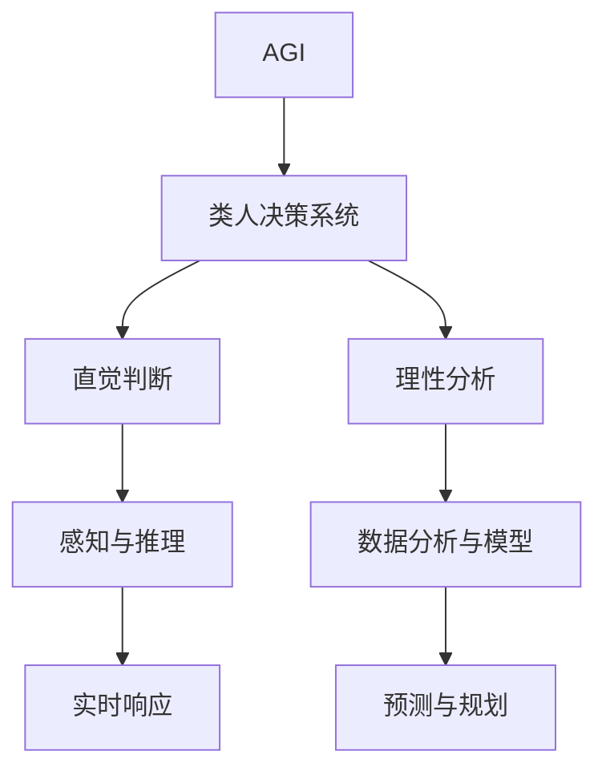

                 

基于上述提供的指南和要求，我们可以逐步构建《AGI的类人决策系统：从直觉判断到理性分析》的技术博客文章。以下是详细的步骤和分析：

### 步骤1：确定文章结构和内容

- **文章标题**：AGI的类人决策系统：从直觉判断到理性分析
- **关键词**：AGI、类人决策系统、直觉判断、理性分析、机器学习、深度学习、自然语言处理
- **摘要**：本文探讨了通用人工智能（AGI）的类人决策系统，从直觉判断到理性分析的过程，深入分析了其理论基础、关键技术、应用实例和发展前景。

### 步骤2：撰写引言部分

在引言部分，我们需要简要介绍AGI和类人决策系统的背景和重要性。可以使用markdown格式，例如：

```markdown
## 引言

通用人工智能（AGI，Artificial General Intelligence）是人工智能领域的终极目标，旨在开发能够像人类一样思考、学习和决策的系统。类人决策系统是AGI的重要组成部分，它能够基于直觉判断和理性分析，做出智能化的决策。本文将详细探讨类人决策系统的构建过程，从直觉判断到理性分析，以及其在实际应用中的重要性。
```

### 步骤3：介绍核心概念与联系

在正文的第一部分，我们需要详细解释AGI、类人决策系统、直觉判断和理性分析等核心概念，并使用Mermaid流程图展示它们之间的关系。例如：



### 步骤4：详细讲解核心算法原理

在第二部分，我们需要深入讲解实现类人决策系统的核心算法原理，如机器学习、深度学习、自然语言处理等，并使用伪代码和latex公式详细阐述。例如：

```markdown
## 2.2 深度学习与神经网络

深度学习是机器学习的一个分支，它通过多层神经网络模拟人脑的学习过程。以下是一个简单的深度学习模型伪代码：

```python
def deep_learning_model(input_data):
    # 输入数据
    hidden_layer_1 = activation_function(np.dot(input_data, weights_1))
    hidden_layer_2 = activation_function(np.dot(hidden_layer_1, weights_2))
    output_layer = activation_function(np.dot(hidden_layer_2, weights_3))
    return output_layer
```

其中，激活函数可以使用Sigmoid、ReLU或Tanh等，权重矩阵可以通过反向传播算法进行优化。

### 步骤5：介绍应用实例

在第三部分，我们需要通过实际案例展示类人决策系统的应用，包括金融、医疗和军事等领域的案例。例如：

```markdown
## 4.1 金融领域的应用案例

在金融领域，类人决策系统可以用于风险评估、投资决策和量化交易策略。以下是一个简化的风险评估模型：

```python
def risk_assessment(assets):
    # 计算资产的风险值
    risk_scores = [calculate_risk(asset) for asset in assets]
    return risk_scores
```

其中，`calculate_risk` 函数可以使用统计学方法或机器学习算法来计算资产的风险值。

### 步骤6：探讨发展前景

在第四部分，我们需要探讨AGI类人决策系统的未来发展、面临的挑战和机遇。例如：

```markdown
## 5.1 通用人工智能的挑战

通用人工智能的发展面临着许多挑战，包括智能与意识的边界、安全性与伦理问题、可解释性与透明度等。以下是一个简化的挑战清单：

- 智能与意识的边界：如何定义和检测智能与意识？
- 安全性与伦理问题：如何确保AI系统的安全性和符合伦理标准？
- 可解释性与透明度：如何使AI系统的决策过程更加透明和可解释？
```

### 步骤7：撰写结尾部分

在结尾部分，我们需要对全文进行总结，并提供一些最佳实践 tips 和拓展阅读建议。例如：

```markdown
## 结尾

本文详细探讨了AGI类人决策系统从直觉判断到理性分析的过程，分析了其理论基础、关键技术、应用实例和发展前景。在未来的研究中，我们应关注以下方向：

- 提高AI系统的可解释性和透明度。
- 加强AI系统的安全性和伦理问题。
- 探索更加高效和鲁棒的决策算法。

感谢阅读，希望本文对您有所启发。如有兴趣深入了解，请参考以下拓展阅读：

- 《人工智能：一种现代方法》（作者：Stuart Russell & Peter Norvig）
- 《深度学习》（作者：Ian Goodfellow、Yoshua Bengio、Aaron Courville）
```

### 步骤8：添加作者信息

在文章末尾，我们需要添加作者信息，以表明文章的出处。例如：

```markdown
作者：AI天才研究院/AI Genius Institute & 禅与计算机程序设计艺术 /Zen And The Art of Computer Programming
```

### 步骤9：格式检查

最后，我们需要对全文进行格式检查，确保markdown格式的正确性，以及latex公式的准确性。确保文章结构清晰，内容连贯，无错别字或语法错误。

### 步骤10：撰写文章

根据上述步骤，我们可以开始撰写文章，逐步填充每个部分的内容，确保文章完整性、深度和可读性。

### 步骤11：校对和修改

完成初稿后，我们需要进行校对和修改，确保文章的逻辑清晰、内容准确、格式规范。可以请同行或导师进行审阅，提出意见和建议。

### 步骤12：提交文章

最后，我们将完成的文章提交给相应的平台或期刊，等待审核和发布。

通过上述步骤，我们可以撰写一篇高质量的技术博客文章《AGI的类人决策系统：从直觉判断到理性分析》，为广大读者提供有价值的技术见解和思考。

