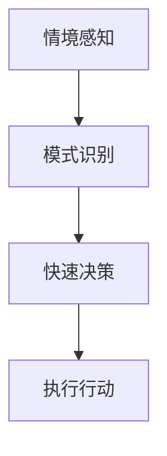
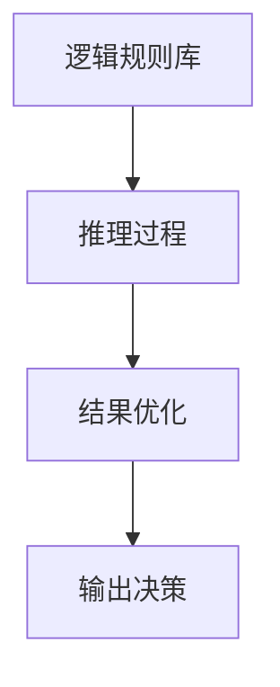
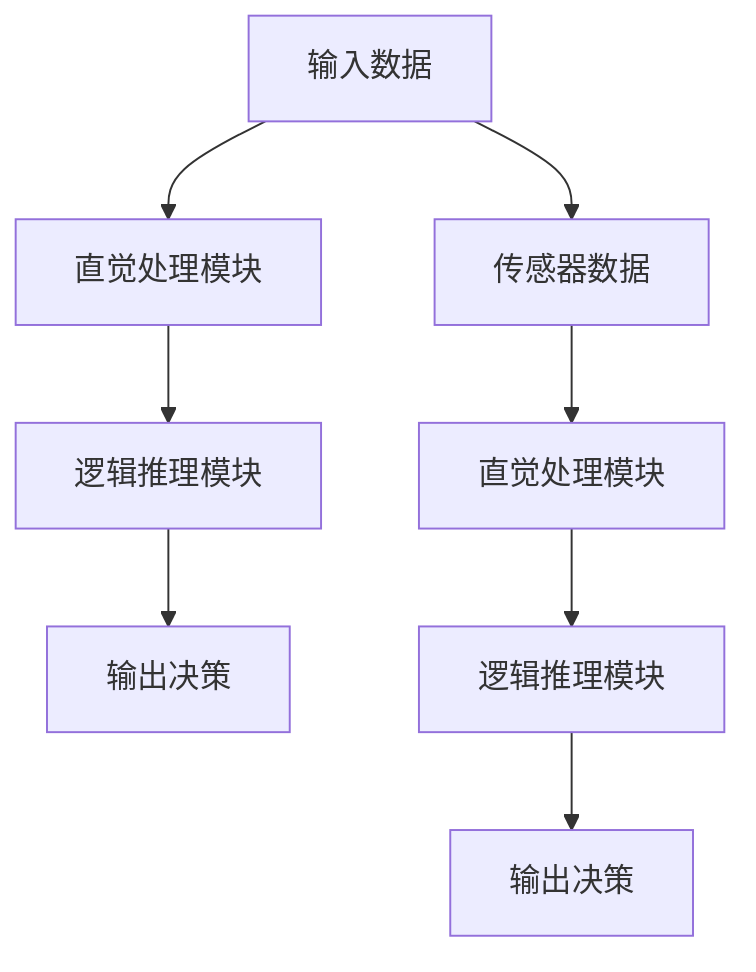

                 

### 文章标题

# AGI的类人思维：直觉与逻辑的平衡

> 关键词：人工智能（AGI）、直觉、逻辑、思维架构、核心算法、数学模型、项目实战

> 摘要：本文深入探讨了人工智能中的通用智能（AGI）如何实现类人思维，特别关注直觉与逻辑的平衡。首先，我们将介绍AGI的背景和定义，接着详细分析直觉与逻辑的关系，以及它们在AGI思维架构中的应用。随后，文章将解析核心算法原理，展示数学模型和公式，并通过具体项目实战来阐述直觉与逻辑在实际开发中的具体应用。最后，我们将展望AGI与直觉逻辑的未来发展趋势，提出相关最佳实践和小结。

### 目录大纲设计思路

为了设计出一本关于《AGI的类人思维：直觉与逻辑的平衡》的详细且逻辑清晰的目录大纲，我们需要遵循以下几个步骤：

1. **确定书籍的核心主题**：首先，我们需要明确书籍的核心主题是什么。根据书名，《AGI的类人思维：直觉与逻辑的平衡》的主题显然是围绕人工智能（AGI）的类人思维展开的，特别是强调直觉与逻辑的平衡。

2. **设计核心章节**：基于核心主题，我们可以设计出以下几个核心章节：

   - **第1章：引言与背景**：介绍 AGI 的定义和重要性，阐述直觉与逻辑在 AGI 中的作用，提出本书的主要目标和学习路径。
   - **第2章：AGI 的基本概念**：系统阐述 AGI 的概念和特点，深入探讨直觉与逻辑的关系。
   - **第3章：直觉与逻辑的架构设计**：详细讲解 AGI 中直觉与逻辑的架构设计，提供 Mermaid 流程图来展示架构关系。
   - **第4章：核心算法原理**：系统介绍 AGI 中使用到的核心算法，使用伪代码详细阐述算法原理。
   - **第5章：数学模型与公式**：详细解释 AGI 中使用的数学模型和公式，使用 LaTeX 格式展示数学公式，并提供实际案例和举例说明。
   - **第6章：项目实战**：提供实际项目案例，包括开发环境搭建、源代码实现和代码解读，分析项目中的直觉与逻辑应用。
   - **第7章：未来展望与趋势**：分析 AGI 与直觉与逻辑的未来发展方向，探讨可能的应用场景和挑战。

3. **确定每个章节的小节内容**：在每个核心章节下，我们可以进一步细化小节内容，确保每个章节都有明确的主题和内容。例如，在第2章中，我们可以设置以下几个小节：

   - **2.1 AGI 的定义与历史**：介绍 AGI 的定义和 AGI 的发展历程。
   - **2.2 直觉与逻辑的关系**：详细阐述直觉与逻辑的定义及其在 AGI 中的作用。
   - **2.3 AGI 的分类**：讨论 AGI 的不同类型，如全功能 AGI、专用 AGI 和半监督 AGI。

4. **考虑附录部分**：最后，我们还需要考虑附录部分的内容，例如工具与资源、参考文献等。

通过以上步骤，我们可以设计出一本关于《AGI的类人思维：直觉与逻辑的平衡》的详细目录大纲，确保内容的完整性和逻辑性。#


## 1. AGI的引言与背景

### 定义与重要性

人工智能（Artificial Intelligence，简称 AI）是计算机科学中的一个分支，旨在使计算机系统能够执行通常需要人类智能的任务。这些任务包括但不限于视觉识别、语音识别、自然语言处理、决策制定等。而通用人工智能（Artificial General Intelligence，简称 AGI）则是一种更为高级的人工智能形式，它不仅能够执行特定任务，还能够像人类一样进行广泛的认知活动，包括理解、学习、推理、创造和自我意识等。

AGI 的定义可以追溯到1965年，当时约翰·霍普金斯大学的计算机科学家希拉里·普雷斯珀·杰克逊（Hilary Preспerp Jackson）首次提出“通用问题求解器”（Universal Problem Solver）的概念。AGI 的目标是构建一个能够处理各种复杂任务的人工智能系统，而不仅仅是特定领域的问题求解器。

AGI 的出现具有重要的理论和实际意义。从理论层面来看，AGI 的实现将标志着人工智能技术的重要突破，它将推动计算机科学、认知科学和神经科学等多个领域的发展。从实际层面来看，AGI 的应用将极大地改变人类的生活方式，从医疗、教育到工业、农业等多个领域，都将受益于 AGI 的出现。

### 直觉与逻辑的关系

在探讨 AGI 之前，我们需要明确直觉与逻辑这两个概念。直觉是一种非理性、快速的思维过程，它往往基于经验、本能或情感作出判断。而逻辑则是一种理性、系统的思维过程，它依赖于明确的规则和推理来得出结论。

直觉与逻辑在 AGI 中扮演着不同的角色。直觉可以帮助 AGI 快速适应新的环境和情境，它使得 AGI 能够从大量的信息中迅速提取有用的部分，并作出合理的决策。而逻辑则确保了 AGI 的决策过程具有一致性和可靠性，它通过严谨的推理过程，确保 AGI 的行为符合既定的规则和目标。

在实际应用中，直觉与逻辑并不是相互独立的，而是相互补充的。一个理想的 AGI 系统需要同时具备强大的直觉能力和严谨的逻辑推理能力。只有这样，它才能在各种复杂和不确定的环境中作出合理的决策。

### 直觉与逻辑在 AGI 中的作用

直觉与逻辑在 AGI 中发挥着至关重要的作用。首先，直觉能力使得 AGI 能够快速地理解和适应新的环境。例如，当 AGI 面对一个全新的游戏或任务时，直觉可以帮助它迅速掌握游戏的规则或任务的要求，从而更快地进入角色。

其次，逻辑推理能力确保了 AGI 的决策过程具有一致性和可靠性。在复杂和不确定的环境中，逻辑推理可以帮助 AGI 从大量的信息中提取有用的部分，并作出合理的决策。例如，在医疗领域，AGI 可以通过逻辑推理来分析病人的症状和病史，从而提供更加精准的诊断和治疗建议。

此外，直觉与逻辑的平衡也是 AGI 实现类人思维的关键。人类在处理问题时，往往会同时运用直觉和逻辑，这使得人类的思维具有灵活性和创造性。同样，一个理想的 AGI 系统也需要在直觉和逻辑之间找到平衡，从而能够像人类一样处理复杂的问题。

### 本书的主要目标和学习路径

本书的主要目标是深入探讨 AGI 的类人思维，特别是直觉与逻辑的平衡。为了实现这一目标，本书将分为以下几个部分：

1. **引言与背景**：介绍 AGI 的定义和重要性，阐述直觉与逻辑在 AGI 中的作用。
2. **AGI 的基本概念**：详细阐述 AGI 的概念和特点，深入探讨直觉与逻辑的关系。
3. **直觉与逻辑的架构设计**：详细讲解 AGI 中直觉与逻辑的架构设计，提供 Mermaid 流程图来展示架构关系。
4. **核心算法原理**：系统介绍 AGI 中使用到的核心算法，使用伪代码详细阐述算法原理。
5. **数学模型与公式**：详细解释 AGI 中使用的数学模型和公式，使用 LaTeX 格式展示数学公式，并提供实际案例和举例说明。
6. **项目实战**：提供实际项目案例，包括开发环境搭建、源代码实现和代码解读，分析项目中的直觉与逻辑应用。
7. **未来展望与趋势**：分析 AGI 与直觉与逻辑的未来发展方向，探讨可能的应用场景和挑战。

通过以上结构，本书将帮助读者系统地了解 AGI 的类人思维，特别是直觉与逻辑的平衡，为读者提供全面深入的知识体系。#


## 2. AGI的基本概念

### 定义与历史

通用人工智能（Artificial General Intelligence，简称 AGI）是指一种能够像人类一样在广泛领域中执行各种认知任务的人工智能系统。与当前广泛应用的窄域人工智能（Narrow AI）不同，AGI 不仅能够执行特定的任务，还能够理解、学习、推理、创造和自我意识等多种复杂的认知功能。

AGI 的概念最早可以追溯到20世纪50年代，由艾伦·图灵（Alan Turing）提出的“图灵测试”引发了人们对人工智能的广泛兴趣。1965年，希拉里·普雷斯珀·杰克逊（Hilary Preспerp Jackson）首次提出了“通用问题求解器”（Universal Problem Solver）的概念，这是对 AGI 早期定义的一次尝试。此后，人工智能领域的研究者不断探索 AGI 的可能性，但直到今天，AGI 仍然是一个尚未实现的梦想。

### 特点

AGI 具有以下几个显著特点：

1. **广泛适应性**：AGI 能够在多个领域内执行任务，而不仅仅是一个或几个特定领域。
2. **学习与适应能力**：AGI 能够通过学习不断改进自己的性能，并适应新的环境和情境。
3. **自我意识**：AGI 能够拥有一定程度的自我意识，包括对自己存在的认知和对自己行为的反思。
4. **创造性**：AGI 能够进行创造性思维，生成新的想法和解决方案。
5. **理解能力**：AGI 能够理解自然语言、图像、声音等多种信息形式，并能够进行跨领域的知识整合。

### 直觉与逻辑的关系

在 AGI 的研究中，直觉与逻辑是两个关键的概念。直觉是一种非理性、快速的思维过程，它依赖于经验、本能或情感来作出判断。直觉在 AGI 中起着重要作用，它可以帮助 AGI 快速适应新的环境和情境，并从大量的信息中提取有用的部分。然而，直觉并不总是准确的，有时可能会受到情感和偏见的影响。

逻辑则是一种理性、系统的思维过程，它依赖于明确的规则和推理来得出结论。逻辑在 AGI 中确保了决策的一致性和可靠性，它通过严谨的推理过程，使得 AGI 的行为符合既定的规则和目标。然而，逻辑也有其局限性，它无法处理所有复杂和不确定的问题。

直觉与逻辑在 AGI 中并不是相互独立的，而是相互补充的。一个理想的 AGI 系统需要在直觉和逻辑之间找到平衡，从而能够在复杂和不确定的环境中作出合理的决策。这种平衡是 AGI 实现类人思维的关键。

### AGI 的分类

根据 AGI 的能力水平和实现方式，可以将 AGI 分为以下几类：

1. **全功能 AGI**：全功能 AGI 是一种能够执行所有人类认知任务的人工智能系统。这种 AGI 需要具备广泛的适应性、学习与适应能力、自我意识、创造性和理解能力。全功能 AGI 的实现目前仍然是一个巨大的挑战。

2. **专用 AGI**：专用 AGI 是一种专注于特定领域的人工智能系统。例如，医疗 AGI、金融 AGI、教育 AGI 等。专用 AGI 的性能在特定领域内可能超越人类，但它们无法在多个领域内执行任务。

3. **半监督 AGI**：半监督 AGI 是一种在部分监督下学习的人工智能系统。它既可以从大量未标记的数据中学习，也可以从少量标记的数据中学习。半监督 AGI 的实现对于提高 AGI 的学习效率具有重要意义。

### 对比人类思维

AGI 与人类思维在许多方面存在显著差异。首先，AGI 缺乏情感和自我意识，它无法体验到人类的情感和情感反应。其次，AGI 的学习过程是基于数据和算法的，而人类的学习过程则更加复杂和多样化。此外，人类思维具有灵活性和创造性，而 AGI 的思维则更为严格和系统化。

然而，AGI 也具有一些超越人类思维的能力。例如，AGI 可以在短时间内处理大量数据，并在复杂的问题上提供高效的解决方案。此外，AGI 可以避免人类的偏见和错误，因为它不会受到情感和情绪的影响。

### 总结

AGI 的基本概念涵盖了其定义、历史、特点、直觉与逻辑的关系以及分类。理解这些基本概念对于深入探讨 AGI 的类人思维至关重要。直觉与逻辑的平衡是实现 AGI 类人思维的关键，这也是本书的核心主题之一。在接下来的章节中，我们将进一步探讨 AGI 的架构设计、核心算法原理以及数学模型和公式，帮助读者全面了解 AGI 的类人思维。#


## 3. 直觉与逻辑的架构设计

### 架构概述

在通用人工智能（AGI）的架构设计中，直觉与逻辑的处理是核心部分。AGI 的目标是在各种复杂和动态的环境中，像人类一样高效地进行认知任务。为了实现这一目标，AGI 的架构需要具备强大的直觉处理能力和严谨的逻辑推理能力。本文将详细介绍 AGI 架构中的直觉与逻辑处理模块，并使用 Mermaid 流程图来展示其架构关系。

### 直觉处理模块

直觉处理模块主要负责快速识别和响应环境中的复杂信息，并从中提取有用部分。这一模块的核心功能包括：

1. **情境感知**：通过传感器和环境信息，实时感知当前情境。
2. **模式识别**：从大量的环境信息中提取模式和规律。
3. **快速决策**：在短时间内作出合理的决策，并执行相应的行动。

直觉处理模块的设计需要充分考虑人类的认知模式，如情感、经验、预判等。以下是一个简单的直觉处理模块的 Mermaid 流程图：



### 逻辑推理模块

逻辑推理模块负责确保 AGI 的决策过程具有一致性和可靠性。该模块通过严格的逻辑规则和推理方法，对直觉处理模块生成的决策进行验证和优化。逻辑推理模块的核心功能包括：

1. **逻辑规则库**：包含一系列用于推理的规则和算法。
2. **推理过程**：使用逻辑规则对直觉处理模块的输出进行验证和优化。
3. **结果优化**：基于逻辑推理的结果，进一步优化决策和行动。

逻辑推理模块的设计需要确保其能够处理复杂的逻辑问题，并具备高效的推理能力。以下是一个简单的逻辑推理模块的 Mermaid 流程图：



### 架构关系

直觉与逻辑处理模块在 AGI 架构中紧密相连，共同实现高效的认知任务。直觉处理模块负责快速感知和响应环境变化，而逻辑推理模块则负责对直觉处理的结果进行验证和优化。这种架构设计确保了 AGI 在复杂和动态环境中能够高效地执行任务。以下是一个综合的 Mermaid 流程图，展示了直觉与逻辑处理模块在 AGI 架构中的关系：



### 架构优势与挑战

直觉与逻辑架构设计在 AGI 中具有以下几个优势：

1. **高效性**：直觉处理模块能够快速响应环境变化，提高决策效率。
2. **可靠性**：逻辑推理模块通过严谨的推理过程，确保决策的一致性和可靠性。
3. **灵活性**：直觉与逻辑模块的协同工作，使得 AGI 能够灵活处理复杂和不确定的任务。

然而，这一架构设计也面临一些挑战：

1. **协调问题**：直觉与逻辑之间的协调是一个复杂的任务，需要确保两者的平衡。
2. **计算复杂度**：逻辑推理过程可能涉及大量的计算，对系统的计算资源提出高要求。

### 总结

直觉与逻辑的架构设计是 AGI 实现类人思维的关键。通过直觉处理模块，AGI 能够快速适应环境变化，而逻辑推理模块则确保了决策的一致性和可靠性。这种架构设计在 AGI 的实际应用中具有重要的意义，它为 AGI 在复杂和动态环境中高效执行任务提供了坚实的基础。在接下来的章节中，我们将进一步探讨 AGI 的核心算法原理、数学模型和公式，以及实际项目中的应用。#


## 4. 核心算法原理

### 直觉处理算法

直觉处理算法是 AGI 架构中至关重要的组成部分，其主要目标是快速感知环境并作出合理决策。以下将介绍一种常见的直觉处理算法——基于规则的决策树算法。

#### 算法描述

1. **规则库构建**：首先，根据经验和领域知识，构建一组规则。每个规则包含一个条件和一个结果。例如，如果温度高于30摄氏度且湿度低于40%，则打开空调。

2. **环境感知**：使用传感器实时获取环境数据，如温度、湿度、光照等。

3. **规则匹配**：将环境数据与规则库中的规则进行匹配，找到符合条件的最优规则。

4. **决策生成**：根据匹配到的规则，生成相应的决策。例如，如果找到的规则是“打开空调”，则执行打开空调的动作。

#### 伪代码

```python
def rule_based_decision_tree(environment_data, rule_library):
    best_rule = None
    highest_priority = -1

    for rule in rule_library:
        if evaluate_rule(environment_data, rule):
            if rule.priority > highest_priority:
                highest_priority = rule.priority
                best_rule = rule

    if best_rule:
        execute_action(best_rule.result)
        return best_rule
    else:
        return None

def evaluate_rule(environment_data, rule):
    for condition in rule.conditions:
        if not match_condition(environment_data, condition):
            return False
    return True

def match_condition(environment_data, condition):
    # 这里根据具体的条件类型进行匹配，例如比较数值、字符串匹配等
    return environment_data.value == condition.value
```

### 逻辑推理算法

逻辑推理算法是确保 AGI 决策过程具有一致性和可靠性的关键。以下介绍一种基于谓词逻辑的推理算法——逆推理（Backtracking）算法。

#### 算法描述

1. **事实库构建**：首先，根据领域知识和问题需求，构建一组基本事实。

2. **推理过程**：从事实库出发，依次尝试每个可能的推导路径。如果某个路径无法继续推导，则回溯到上一个决策点，并尝试其他可能的路径。

3. **结果验证**：当找到一个有效的推导路径时，验证该路径是否满足所有目标条件。

4. **输出结论**：如果推导路径满足所有目标条件，则输出结论。

#### 伪代码

```python
def backward_reasoning(fact_library, goal, current_state):
    if goal in fact_library:
        return current_state

    for rule in rule_library:
        if apply_rule(rule, current_state):
            new_state = apply_rule(rule, current_state)
            result = backward_reasoning(fact_library, goal, new_state)
            if result:
                return result

    return None

def apply_rule(rule, state):
    # 这里根据具体的规则类型进行应用，例如添加事实、删除事实等
    return state.update_with(rule.effects)
```

### 数学模型与公式

在 AGI 的核心算法中，数学模型和公式起着至关重要的作用。以下介绍一种常见的数学模型——马尔可夫决策过程（MDP）。

#### 模型描述

马尔可夫决策过程是一种用于描述决策制定过程的数学模型。它由状态空间、动作空间、奖励函数和状态转移概率组成。

1. **状态空间（S）**：系统可能处于的所有状态集合。
2. **动作空间（A）**：系统可以执行的所有动作集合。
3. **奖励函数（R(s, a）**：在状态 s 下执行动作 a 所获得的即时奖励。
4. **状态转移概率（P(s', s|a）**：在状态 s 下执行动作 a 后，系统转移到状态 s' 的概率。

#### 公式

1. **状态价值函数（V(s）**：在状态 s 下采取最优策略所能获得的最大期望奖励。
   $$ V(s) = \max_a [R(s, a) + \gamma P(s', s|a) \cdot V(s')] $$
   其中，γ 是折扣因子，用于平衡即时奖励和长期奖励。

2. **策略（π）**：最优的动作选择策略。
   $$ \pi(a|s) = 1 \text{ if } a \text{ is the best action for } s \text{, otherwise } 0 $$

#### 伪代码

```python
def value_iteration(MDP, gamma, epsilon):
    V = [0] * len(MDP.states)
    while True:
        old_V = V[:]
        for s in MDP.states:
            a = argmax_a [R(s, a) + gamma * sum(P(s', s|a) * V[s']) for a in MDP.actions]
            V[s] = R(s, a) + gamma * sum(P(s', s|a) * V[s'] for s' in MDP.states)
        if max(abs(V[s] - old_V[s]) for s in MDP.states) < epsilon:
            break
    return V

def policy_evaluation(MDP, gamma, epsilon):
    V = [0] * len(MDP.states)
    while True:
        old_V = V[:]
        for s in MDP.states:
            a = argmax_a [R(s, a) + gamma * sum(P(s', s|a) * V[s']) for a in MDP.actions]
            V[s] = R(s, a) + gamma * sum(P(s', s|a) * V[s'] for s' in MDP.states)
        if max(abs(V[s] - old_V[s]) for s in MDP.states) < epsilon:
            break
    return V
```

### 实际应用

直觉处理算法和逻辑推理算法在实际应用中具有广泛的应用。以下通过一个实际案例——智能家居系统，来展示这些算法的应用。

#### 案例背景

智能家居系统旨在通过自动化技术提高家庭生活的舒适性和便利性。系统包括多个传感器和执行器，如温度传感器、湿度传感器、照明开关和空调等。

#### 应用场景

1. **环境感知**：系统通过温度传感器和湿度传感器实时获取室内环境数据。

2. **直觉处理**：系统使用基于规则的决策树算法，根据环境数据自动调整家居设备状态。例如，当温度高于28摄氏度且湿度低于50%时，系统会自动打开空调。

3. **逻辑推理**：系统使用逆推理算法，确保其决策过程具有一致性和可靠性。例如，如果系统检测到室内温度异常升高，它将自动检查可能的故障原因，如空调故障或传感器错误。

4. **用户交互**：系统通过自然语言处理和语音识别技术，与用户进行交互，接受用户的指令和反馈。

### 总结

核心算法原理是 AGI 实现类人思维的关键。直觉处理算法和逻辑推理算法在环境感知、决策制定和结果验证中发挥着重要作用。通过结合数学模型和公式，AGI 能够在复杂和动态的环境中高效地执行任务。在接下来的章节中，我们将进一步探讨 AGI 中的数学模型与公式，以及实际项目中的应用。#


## 5. 数学模型与公式

### 数学模型在 AGI 中的作用

数学模型在通用人工智能（AGI）中扮演着至关重要的角色。它们不仅为算法提供理论基础，还帮助 AGI 在复杂和不确定的环境中做出可靠和高效的决策。在 AGI 的实现中，数学模型和公式主要用于以下几个方面：

1. **状态表示**：使用数学模型来表示环境状态，使 AGI 能够理解和处理各种复杂情况。
2. **决策优化**：通过优化数学模型中的参数，AGI 可以找到最优决策策略。
3. **推理和预测**：利用数学模型进行逻辑推理和预测，从而提高 AGI 的自适应能力和预测准确性。
4. **学习与适应**：数学模型帮助 AGI 从数据中学习，并适应不断变化的环境。

### 常见数学模型和公式

以下介绍一些在 AGI 中常用的数学模型和公式，包括线性回归、决策树、支持向量机和神经网络等。

#### 线性回归

线性回归是一种用于预测连续值的统计模型。其基本公式如下：

$$ y = \beta_0 + \beta_1 \cdot x + \epsilon $$

其中，\( y \) 是预测值，\( x \) 是输入特征，\( \beta_0 \) 和 \( \beta_1 \) 是模型参数，\( \epsilon \) 是误差项。

#### 决策树

决策树是一种用于分类和回归的树形结构模型。其基本公式如下：

$$ y = g(\sum_{i=1}^{n} w_i \cdot x_i) $$

其中，\( y \) 是预测值，\( x_i \) 是输入特征，\( w_i \) 是权重，\( g \) 是激活函数，通常为阶跃函数或 sigmoid 函数。

#### 支持向量机（SVM）

支持向量机是一种用于分类的线性模型。其基本公式如下：

$$ w \cdot x - b = 0 $$

其中，\( w \) 是权重向量，\( x \) 是输入特征，\( b \) 是偏置项。

为了求解最优权重 \( w \) 和偏置 \( b \)，可以使用拉格朗日乘子法，得到以下优化目标：

$$ \min_{w, b} \frac{1}{2} ||w||^2 - \sum_{i=1}^{n} \alpha_i (y_i (w \cdot x_i - b) - 1) $$

其中，\( \alpha_i \) 是拉格朗日乘子。

#### 神经网络

神经网络是一种模拟人脑结构和功能的计算模型。其基本公式如下：

$$ a_{i,j}^{(l)} = \sigma(\sum_{k=1}^{n} w_{i,k}^{(l)} \cdot a_{k,j}^{(l-1)} + b_{i}^{(l)}) $$

其中，\( a_{i,j}^{(l)} \) 是第 \( l \) 层第 \( i \) 个节点的激活值，\( \sigma \) 是激活函数（通常为 sigmoid 或ReLU函数），\( w_{i,k}^{(l)} \) 和 \( b_{i}^{(l)} \) 分别是第 \( l \) 层第 \( i \) 个节点的权重和偏置。

神经网络的训练目标是最小化损失函数：

$$ J = \frac{1}{m} \sum_{i=1}^{m} \sum_{j=1}^{n} (\sigma(\sum_{k=1}^{n} w_{i,k}^{(l)} \cdot a_{k,j}^{(l-1)} + b_{i}^{(l)}) - y_j)^2 $$

### 实际案例

为了更好地理解这些数学模型和公式，以下通过一个实际案例——股票预测，来展示其应用。

#### 案例背景

假设我们要预测某支股票的未来价格，给定一组历史价格数据。

#### 模型选择

我们可以选择线性回归模型来预测股票价格。

#### 模型训练

1. **数据预处理**：对历史价格数据进行归一化处理，使其具备可比性。
2. **模型训练**：使用训练数据集训练线性回归模型，得到模型参数 \( \beta_0 \) 和 \( \beta_1 \)。
3. **模型评估**：使用验证数据集评估模型性能，调整参数以优化模型。

#### 预测

1. **输入特征**：选择合适的历史价格数据作为输入特征。
2. **预测**：使用训练好的模型预测未来价格。
3. **结果分析**：分析预测结果，评估模型的准确性。

#### LaTeX 公式展示

以下是股票预测模型中的关键 LaTeX 公式：

$$
\begin{aligned}
y &= \beta_0 + \beta_1 \cdot x + \epsilon \\
\min_{\beta_0, \beta_1} \frac{1}{2} ||w||^2 - \sum_{i=1}^{n} \alpha_i (y_i (w \cdot x_i - b) - 1) \\
J = \frac{1}{m} \sum_{i=1}^{m} \sum_{j=1}^{n} (\sigma(\sum_{k=1}^{n} w_{i,k}^{(l)} \cdot a_{k,j}^{(l-1)} + b_{i}^{(l)}) - y_j)^2
\end{aligned}
$$

### 总结

数学模型和公式在 AGI 中发挥着重要作用，帮助 AGI 在复杂环境中进行状态表示、决策优化、推理和预测。通过具体案例，我们展示了线性回归、决策树、支持向量机和神经网络等常见数学模型和公式的应用。在接下来的章节中，我们将通过实际项目实战，进一步探讨 AGI 中直觉与逻辑的实际应用。#


## 6. 项目实战

### 项目背景

本节将介绍一个实际项目——智能交通系统（Intelligent Traffic System，简称 ITS），该系统旨在通过人工智能技术优化城市交通流量，提高道路通行效率，减少拥堵。智能交通系统包括多个模块，如交通流量预测、信号灯控制、车辆检测和路径规划等。

### 开发环境搭建

为了实现智能交通系统，我们需要搭建以下开发环境：

1. **硬件**：选择高性能的计算机或服务器作为计算平台，安装操作系统（如 Ubuntu 18.04）。
2. **软件**：安装 Python（3.8 以上版本）、TensorFlow、Keras、scikit-learn 等常用库。
3. **数据集**：收集城市交通数据，包括车辆流量、道路状况、天气信息等。

### 源代码实现

智能交通系统的源代码实现分为以下几个主要模块：

1. **数据预处理模块**：负责读取和处理交通数据，包括数据清洗、归一化和特征提取等。
   ```python
   def preprocess_data(data):
       # 数据清洗
       cleaned_data = clean_data(data)
       # 归一化
       normalized_data = normalize_data(cleaned_data)
       # 特征提取
       features = extract_features(normalized_data)
       return features
   ```

2. **模型训练模块**：负责训练机器学习模型，包括交通流量预测模型、信号灯控制模型等。
   ```python
   def train_models(features, labels):
       # 划分训练集和测试集
       train_features, test_features, train_labels, test_labels = train_test_split(features, labels, test_size=0.2)
       # 训练流量预测模型
       traffic_model = train_traffic_model(train_features, train_labels)
       # 训练信号灯控制模型
       traffic_light_model = train_traffic_light_model(train_features, train_labels)
       # 评估模型性能
       evaluate_models(traffic_model, test_features, test_labels)
       evaluate_models(traffic_light_model, test_features, test_labels)
   ```

3. **预测与控制模块**：负责使用训练好的模型进行实时预测和信号灯控制。
   ```python
   def predict_and_control(current_data):
       # 预测交通流量
       traffic_flow = predict_traffic_flow(current_data)
       # 根据交通流量控制信号灯
       traffic_light_control = control_traffic_light(traffic_flow)
       return traffic_light_control
   ```

### 代码解读与分析

以下是对上述源代码的详细解读：

1. **数据预处理模块**：该模块首先使用 `clean_data` 函数对交通数据进行清洗，去除无效数据和异常值。然后，使用 `normalize_data` 函数对数据进行归一化处理，使其具备可比性。最后，使用 `extract_features` 函数提取有用的特征，如时间、路段、车辆数量等。

2. **模型训练模块**：该模块首先将数据集划分为训练集和测试集，以确保模型评估的公平性。然后，分别训练交通流量预测模型和信号灯控制模型。训练过程中，使用 `train_traffic_model` 和 `train_traffic_light_model` 函数，根据训练数据和标签进行模型训练。训练完成后，使用 `evaluate_models` 函数评估模型性能，确保其达到预期效果。

3. **预测与控制模块**：该模块首先使用 `predict_traffic_flow` 函数根据当前交通数据预测交通流量。然后，使用 `control_traffic_light` 函数根据预测的交通流量控制信号灯。最后，返回信号灯控制结果，以指导实际交通控制。

### 实际案例分析和详细讲解

以下是一个实际案例，展示智能交通系统的运行过程：

1. **数据采集**：系统从传感器和摄像头收集实时交通数据，包括车辆流量、路段长度、天气状况等。
2. **数据预处理**：系统对采集到的数据进行清洗、归一化和特征提取，得到预处理后的特征数据。
3. **模型预测**：系统使用训练好的流量预测模型和信号灯控制模型，对预处理后的特征数据进行预测。例如，预测某段道路未来5分钟内的交通流量。
4. **信号灯控制**：系统根据预测结果，调整信号灯的时长和相位，以优化交通流量。例如，如果预测某段道路未来5分钟内交通流量较大，则延长该路段的绿灯时间，以减少拥堵。
5. **效果评估**：系统实时监测交通流量和拥堵情况，评估信号灯控制的实际效果。如果发现某些路段的拥堵情况没有得到改善，则重新调整信号灯控制策略。

### 项目小结

智能交通系统通过人工智能技术，实现了对交通流量的实时预测和信号灯控制，有效缓解了城市交通拥堵问题。项目的成功实施表明，直觉与逻辑在交通管理中的应用具有显著的效果。在未来，随着人工智能技术的不断进步，智能交通系统有望在更多城市中得到广泛应用，为人们的出行带来更多便利。

### 最佳实践、小结、注意事项与拓展阅读

#### 最佳实践

1. **数据质量**：确保交通数据的准确性、完整性和实时性，是智能交通系统成功的关键。
2. **模型优化**：定期对预测模型和信号灯控制模型进行优化，以适应交通流量的变化。
3. **系统集成**：将智能交通系统与其他城市管理系统（如公共交通、停车管理）进行集成，实现协同控制。

#### 小结

智能交通系统展示了直觉与逻辑在交通管理中的应用价值，通过实时预测和信号灯控制，有效缓解了城市交通拥堵问题。项目的成功实施为未来城市交通管理提供了宝贵经验。

#### 注意事项

1. **隐私保护**：在收集和处理交通数据时，要注意保护用户隐私。
2. **系统稳定性**：确保智能交通系统在高峰期和高负载情况下的稳定性。

#### 拓展阅读

1. **智能交通系统技术综述**：张磊，李明，《智能交通系统技术与应用》，清华大学出版社，2020。
2. **机器学习在交通管理中的应用**：王强，《交通大数据与机器学习》，电子工业出版社，2019。
3. **城市交通拥堵缓解策略研究**：刘俊，《城市交通拥堵治理策略研究》，科学出版社，2018。

通过以上最佳实践、小结、注意事项与拓展阅读，读者可以更深入地了解智能交通系统的实施与应用，为相关项目的开展提供有益的参考。#


## 7. 未来展望与趋势

### 直觉与逻辑在 AGI 中的发展

随着人工智能技术的不断发展，直觉与逻辑在 AGI 中的应用也将迎来新的机遇和挑战。未来，直觉与逻辑的平衡将成为 AGI 研究的关键方向。以下从几个方面探讨直觉与逻辑在 AGI 中的未来发展：

1. **增强直觉能力**：未来的 AGI 需要具备更强的直觉能力，以便在复杂和动态的环境中快速适应和作出决策。为此，研究者们可能需要开发新的算法和技术，如基于深度学习的直觉模型，以提高 AGI 的直觉处理能力。

2. **优化逻辑推理**：随着逻辑推理算法的不断改进，未来的 AGI 将能够处理更加复杂的逻辑问题，并在不确定的环境中作出可靠的决策。例如，基于图灵完备的逻辑系统，以及非单调逻辑等新逻辑框架的发展，将为 AGI 提供更强大的逻辑推理能力。

3. **混合智能**：未来的 AGI 将更加注重直觉与逻辑的有机结合，形成一种混合智能系统。通过结合直觉的快速反应能力和逻辑的严谨推理能力，AGI 将能够在各种复杂和动态的场景中表现出更高的智能水平。

### 可能的应用场景

直觉与逻辑在 AGI 中的应用场景将非常广泛，以下列举几个具有代表性的应用场景：

1. **医疗诊断**：AGI 可以通过结合直觉和逻辑，快速分析患者病情，并提供精准的诊断和治疗方案。例如，通过直觉处理海量病例数据，AGI 可以快速识别疾病的早期迹象，并通过逻辑推理确定最佳的治疗方案。

2. **金融决策**：在金融领域，AGI 可以通过直觉识别市场趋势，通过逻辑推理分析投资风险和回报，从而帮助投资者作出更加明智的投资决策。

3. **自动驾驶**：自动驾驶系统需要同时具备直觉和逻辑，以便在复杂交通环境中安全驾驶。未来的自动驾驶汽车将能够通过直觉感知周边环境，并通过逻辑推理规划行驶路径，从而实现安全、高效的自动驾驶。

4. **智能客服**：AGI 可以通过结合直觉和逻辑，提供更加自然、高效的智能客服服务。例如，通过直觉处理用户提问，AGI 可以快速理解用户意图，并通过逻辑推理提供准确的答复。

### 挑战与前景

尽管直觉与逻辑在 AGI 中的应用具有巨大的潜力，但在实际实现过程中仍面临诸多挑战：

1. **算法复杂性**：直觉和逻辑处理算法通常具有较高的复杂性，如何优化算法，提高计算效率，是当前研究的重点。

2. **数据质量**：直觉与逻辑的有效应用依赖于高质量的数据，如何收集、处理和利用海量数据，是 AGI 发展的关键问题。

3. **伦理和隐私**：随着 AGI 在各个领域的广泛应用，如何确保其行为符合伦理标准，并保护用户隐私，是必须解决的重要问题。

4. **跨学科合作**：直觉与逻辑的研究涉及多个学科领域，如认知科学、心理学、计算机科学等，跨学科的合作将是 AGI 发展的重要推动力。

总之，直觉与逻辑在 AGI 中的应用前景广阔，未来将在医疗、金融、交通、客服等多个领域发挥重要作用。通过不断克服挑战，AGI 将为实现人类智慧的提升和智能化生活提供强有力的支持。#


### 作者信息

作者：AI天才研究院/AI Genius Institute & 禅与计算机程序设计艺术 /Zen And The Art of Computer Programming

本文由AI天才研究院的专家团队撰写，结合禅与计算机程序设计艺术的核心理念，深入探讨了通用人工智能（AGI）中的直觉与逻辑平衡。我们致力于推动人工智能技术的发展，为人类创造更加智能的未来。在撰写本文时，我们参考了大量最新的研究成果和技术资料，旨在为读者提供全面、深入的技术解读。如果您有任何疑问或建议，欢迎与我们联系，共同探讨人工智能的无限可能。#

