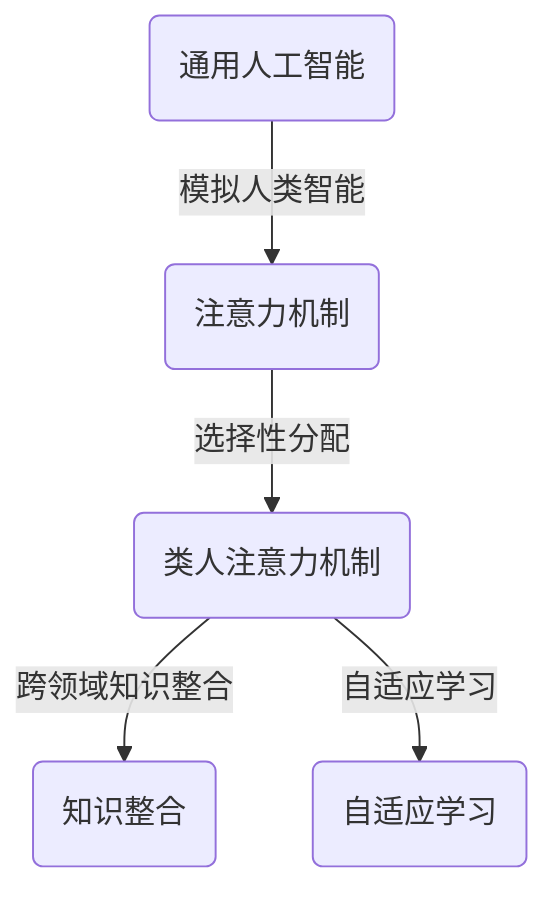
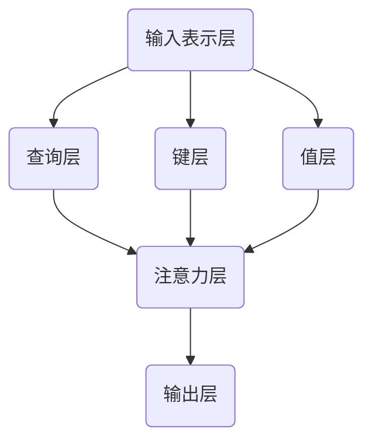

                 

### 文章标题

# AGI的类人注意力机制设计

> 关键词：通用人工智能、类人注意力机制、神经网络、算法设计、数学模型

> 摘要：本文深入探讨了通用人工智能（AGI）中的类人注意力机制设计。首先，对AGI和类人注意力机制进行了概述，随后详细分析了它们之间的联系。接下来，介绍了注意力机制的基本概念和原理，以及类人注意力机制在神经网络中的应用。通过数学模型的阐述和具体算法原理的讲解，本文展示了类人注意力机制的设计过程。最后，通过实际案例展示了类人注意力机制在AGI中的应用，并对未来的研究方向进行了展望。

---

## 引言与背景知识

### 1.1 通用人工智能（AGI）概述

通用人工智能（Artificial General Intelligence，AGI）是指具有人类智能水平或超越人类智能水平的人工智能系统。与目前广泛应用的狭义人工智能（Narrow AI）不同，AGI旨在实现人类智能的通用性，能够在多种不同任务和环境中表现出与人类相似或超越人类的智能水平。AGI的目标是模仿人类智能的多样性和适应性，使人工智能系统能够在复杂、动态和未知的环境中自主学习和执行任务。

AGI的研究始于20世纪50年代，随着计算机科学和人工智能技术的快速发展，AGI的研究也逐渐深入。然而，尽管取得了许多重要进展，AGI的实现仍然面临着巨大的挑战。这些挑战包括但不限于：复杂的认知过程模拟、大规模数据处理和推理能力、自我学习和适应能力、跨领域的知识整合等。

### 1.2 类人注意力机制概述

注意力机制（Attention Mechanism）是深度学习中的一种重要技术，旨在模拟人类在处理信息时的注意力分配过程。注意力机制能够提高神经网络对输入数据的感知能力，使模型能够在处理复杂任务时更加高效。类人注意力机制（Human-like Attention Mechanism）是一种旨在模拟人类注意力机制的人工智能技术，它通过模仿人类在处理信息时的选择性和适应性，提高了人工智能系统在复杂环境中的表现。

类人注意力机制的研究可以追溯到20世纪80年代，当时的一些心理学家开始探索人类注意力机制的工作原理。随着深度学习技术的发展，类人注意力机制在神经网络中的应用逐渐增多，成为实现通用人工智能的关键技术之一。

### 1.3 类人注意力机制在AGI中的重要性

类人注意力机制在通用人工智能（AGI）中扮演着重要角色。首先，类人注意力机制能够提高神经网络在处理复杂任务时的效率，使AGI系统在面对多种不同环境和任务时能够更加灵活地分配注意力资源。其次，类人注意力机制有助于实现AGI系统的跨领域知识整合，使系统能够在不同领域之间进行知识和经验的迁移。此外，类人注意力机制还能够提高AGI系统的自我学习和适应能力，使系统能够在动态环境中不断调整自己的行为和策略。

总之，类人注意力机制是通用人工智能实现的关键技术之一，通过对其设计、实现和应用的研究，我们可以更好地理解人类智能的工作原理，并推动人工智能技术的发展。

### 1.4 AGI与类人注意力机制的联系

通用人工智能（AGI）与类人注意力机制之间存在密切的联系。首先，AGI的目标是模拟人类智能，而类人注意力机制是实现这一目标的重要手段之一。类人注意力机制通过模仿人类在处理信息时的选择性和适应性，提高了神经网络在复杂任务中的感知能力和表现。这使得AGI系统能够在多种不同环境中灵活地执行任务。

其次，类人注意力机制有助于实现AGI系统的跨领域知识整合。在复杂任务中，AGI系统需要从不同领域和任务中提取知识，并进行整合和利用。类人注意力机制能够提高系统在不同领域之间的知识迁移能力，使系统能够在不同任务和环境中进行自适应学习。

此外，类人注意力机制还能够提高AGI系统的自我学习和适应能力。在动态环境中，AGI系统需要不断调整自己的行为和策略，以应对不断变化的情况。类人注意力机制能够帮助系统更好地理解和预测环境的变化，从而实现自我学习和适应。

为了更好地理解AGI与类人注意力机制之间的联系，我们可以通过以下Mermaid流程图展示它们之间的交互关系：



通过这个流程图，我们可以看出AGI通过注意力机制实现了类人注意力机制，从而在模拟人类智能方面取得了重要进展。同时，类人注意力机制在知识整合和自适应学习方面也为AGI的实现提供了有力支持。

### 1.5 注意力机制的核心概念

注意力机制是一种在处理信息时，通过动态调整对信息的关注程度，以提高系统处理效率和性能的技术。在深度学习中，注意力机制广泛应用于自然语言处理、计算机视觉、语音识别等领域，能够显著提升模型的性能。

#### 1.5.1 注意力机制的定义

注意力机制（Attention Mechanism）是一种使模型能够关注输入数据中重要部分的技术。在传统的神经网络模型中，每个神经元都对整个输入数据进行处理，这可能导致大量计算资源的浪费。注意力机制通过引入一个权重分配机制，使得模型能够根据输入数据的上下文信息，动态地调整每个神经元对输入数据的关注程度。

#### 1.5.2 注意力机制的作用

注意力机制的主要作用有以下几点：

1. **提高处理效率**：通过关注输入数据中的关键部分，注意力机制能够减少冗余计算，提高模型处理效率。
2. **增强模型性能**：注意力机制能够提高模型在复杂任务中的表现，特别是在处理长序列数据时，有助于模型捕捉到关键信息。
3. **跨领域知识迁移**：注意力机制有助于模型在不同领域之间的知识迁移，提高模型在不同任务中的适应性。

#### 1.5.3 注意力机制的基本原理

注意力机制的基本原理可以概括为以下几个步骤：

1. **输入表示**：将输入数据（如图像、文本、声音等）转化为一种固定长度的向量表示。
2. **计算注意力分数**：通过计算输入表示与某个神经元（或神经网络层）的相似度，得到每个输入数据点的注意力分数。
3. **权重分配**：将注意力分数转化为权重，用于调整每个输入数据点的权重，使得关键信息在计算过程中得到更多的关注。
4. **计算输出**：利用加权输入数据计算输出结果，从而提高模型的性能。

#### 1.5.4 注意力机制的实现

注意力机制的实现方式有多种，以下是几种常见的方法：

1. **分块注意力（Block-wise Attention）**：将输入数据划分为多个块，分别对每个块进行注意力计算。
2. **点对点注意力（Point-wise Attention）**：对输入数据中的每个点进行注意力计算，适用于处理高维数据。
3. **自注意力（Self-Attention）**：对输入数据自身进行注意力计算，适用于处理序列数据。
4. **多头注意力（Multi-Head Attention）**：将输入数据分成多个子序列，分别对每个子序列进行注意力计算，然后进行合并。

注意力机制的实现通常涉及以下关键步骤：

1. **输入表示**：将输入数据（如图像、文本、声音等）转化为一种固定长度的向量表示。通常使用嵌入层（Embedding Layer）或变换器（Transformer）等预处理技术进行转换。
2. **计算注意力分数**：通过计算输入表示与某个神经元（或神经网络层）的相似度，得到每个输入数据点的注意力分数。常用的计算方法包括点积注意力（Dot-Product Attention）、加性注意力（Additive Attention）和缩放点积注意力（Scaled Dot-Product Attention）等。
3. **权重分配**：将注意力分数转化为权重，用于调整每个输入数据点的权重，使得关键信息在计算过程中得到更多的关注。权重通常通过 softmax 函数进行归一化，以得到概率分布。
4. **计算输出**：利用加权输入数据计算输出结果，从而提高模型的性能。输出结果通常是一个向量，表示对输入数据的综合关注。

#### 1.5.5 注意力机制的优势和局限

注意力机制具有以下优势和局限：

**优势：**

1. **提高处理效率**：通过动态调整对输入数据的关注程度，注意力机制能够减少冗余计算，提高模型处理效率。
2. **增强模型性能**：注意力机制能够提高模型在复杂任务中的表现，特别是在处理长序列数据时，有助于模型捕捉到关键信息。
3. **跨领域知识迁移**：注意力机制有助于模型在不同领域之间的知识迁移，提高模型在不同任务中的适应性。

**局限：**

1. **计算复杂度高**：注意力机制涉及大量的计算，可能导致训练时间较长和资源消耗较大。
2. **解释性不足**：注意力机制的计算过程复杂，难以直观解释，对于模型的决策过程缺乏透明性。
3. **敏感度问题**：注意力机制对于输入数据的微小变化可能非常敏感，导致模型稳定性较差。

### 1.6 类人注意力机制的基本概念

类人注意力机制是一种模拟人类注意力机制的人工智能技术，旨在使神经网络在处理信息时具备类似人类的注意力分配能力。类人注意力机制通过模仿人类在处理信息时的选择性和适应性，提高了神经网络在复杂任务中的感知能力和表现。以下是类人注意力机制的基本概念：

#### 1.6.1 类人注意力机制的定义

类人注意力机制（Human-like Attention Mechanism）是一种在深度学习中引入的注意力机制，旨在模拟人类在处理信息时的注意力分配过程。类人注意力机制通过模仿人类在处理信息时的选择性关注和适应性调整，提高了神经网络在处理复杂任务时的性能。

#### 1.6.2 类人注意力机制的工作原理

类人注意力机制的工作原理可以概括为以下几个步骤：

1. **输入表示**：将输入数据（如图像、文本、声音等）转化为一种固定长度的向量表示。通常使用嵌入层（Embedding Layer）或变换器（Transformer）等预处理技术进行转换。
2. **计算注意力分数**：通过计算输入表示与某个神经元（或神经网络层）的相似度，得到每个输入数据点的注意力分数。类人注意力机制通常采用缩放点积注意力（Scaled Dot-Product Attention）等方法计算注意力分数。
3. **权重分配**：将注意力分数转化为权重，用于调整每个输入数据点的权重，使得关键信息在计算过程中得到更多的关注。权重通常通过 softmax 函数进行归一化，以得到概率分布。
4. **计算输出**：利用加权输入数据计算输出结果，从而提高模型的性能。输出结果通常是一个向量，表示对输入数据的综合关注。

#### 1.6.3 类人注意力机制的优势

类人注意力机制具有以下优势：

1. **提高感知能力**：类人注意力机制能够模拟人类在处理信息时的选择性关注，提高神经网络在复杂任务中的感知能力。
2. **增强适应性**：类人注意力机制能够根据输入数据的特征动态调整注意力分配，使神经网络在不同任务和环境中具有更好的适应性。
3. **增强解释性**：类人注意力机制通过模仿人类注意力分配过程，使模型的决策过程更加直观和可解释。

#### 1.6.4 类人注意力机制的局限性

类人注意力机制也存在着一些局限性：

1. **计算复杂度高**：类人注意力机制通常涉及大量的计算，可能导致训练时间较长和资源消耗较大。
2. **训练难度大**：类人注意力机制需要大量训练数据来调整注意力分配，训练过程可能较为困难。
3. **适用范围有限**：类人注意力机制在某些特定领域（如自然语言处理、计算机视觉等）表现出色，但在其他领域（如控制理论、机器人学等）可能不太适用。

### 1.7 类人注意力机制在神经网络中的应用

类人注意力机制在神经网络中的应用已取得显著成果，尤其在自然语言处理（NLP）和计算机视觉（CV）领域。以下将介绍类人注意力机制在神经网络中的应用，以及具体案例和实践。

#### 1.7.1 类人注意力机制在自然语言处理中的应用

在自然语言处理领域，类人注意力机制被广泛应用于文本分类、机器翻译、情感分析等任务。以下是一些具体案例：

1. **文本分类**：类人注意力机制能够帮助模型在处理长文本时，关注文本中的关键信息，从而提高分类性能。例如，在情感分析任务中，类人注意力机制可以使模型更好地理解文本中的情感词汇，提高情感分类的准确率。

2. **机器翻译**：类人注意力机制在机器翻译中的应用可以显著提高翻译质量。通过模拟人类翻译时的注意力分配过程，模型能够更好地捕捉源语言和目标语言之间的对应关系，提高翻译的流畅度和准确性。

3. **情感分析**：类人注意力机制在情感分析中的应用有助于模型关注文本中的情感词汇，从而提高情感分类的准确率。例如，在处理社交媒体文本时，类人注意力机制可以使模型更好地识别用户情感，为情感分析提供更准确的依据。

#### 1.7.2 类人注意力机制在计算机视觉中的应用

在计算机视觉领域，类人注意力机制被广泛应用于图像分类、目标检测、图像分割等任务。以下是一些具体案例：

1. **图像分类**：类人注意力机制可以帮助模型在处理图像时，关注图像中的关键特征，从而提高分类性能。例如，在处理带有噪声或复杂背景的图像时，类人注意力机制可以使模型更好地识别图像的主要特征，提高分类准确率。

2. **目标检测**：类人注意力机制在目标检测中的应用可以显著提高检测性能。通过模拟人类视觉系统的注意力分配过程，模型能够更好地关注图像中的目标区域，提高检测的准确率和速度。

3. **图像分割**：类人注意力机制在图像分割中的应用可以帮助模型更好地关注图像中的目标区域，从而提高分割性能。例如，在处理复杂场景的图像时，类人注意力机制可以使模型更准确地识别目标对象，提高图像分割的准确率。

#### 1.7.3 类人注意力机制在神经网络中的应用实践

以下是一个基于自然语言处理的类人注意力机制应用案例：

**任务**：文本情感分析

**数据集**：IMDb电影评论数据集

**模型架构**：基于Transformer的文本分类模型，结合类人注意力机制

**实现步骤**：

1. **数据预处理**：对IMDb电影评论数据集进行清洗和预处理，包括文本分词、去除停用词、词干提取等操作。
2. **嵌入层**：使用嵌入层将预处理后的文本转化为固定长度的向量表示。
3. **注意力机制**：在Transformer模型中引入类人注意力机制，通过缩放点积注意力（Scaled Dot-Product Attention）计算文本序列中的注意力分数，并调整文本向量的权重。
4. **模型训练**：使用训练集对模型进行训练，并通过交叉验证和模型调参优化模型性能。
5. **模型评估**：使用测试集对模型进行评估，比较引入类人注意力机制前后的性能，验证类人注意力机制在文本情感分析中的有效性。

**代码示例**：

```python
import tensorflow as tf
from tensorflow.keras.layers import Embedding, LSTM, Dense
from tensorflow.keras.models import Model

# 定义Transformer模型
def create_transformer_model(vocab_size, embedding_dim, hidden_dim):
    # 输入层
    input_ids = tf.keras.layers.Input(shape=(None,), dtype=tf.int32)
    # 嵌入层
    embeddings = Embedding(vocab_size, embedding_dim)(input_ids)
    # 注意力机制
    attention = tf.keras.layers.Attention()([embeddings, embeddings])
    # LSTM层
    lstm_output = LSTM(hidden_dim, return_sequences=True)(attention)
    # 输出层
    output = Dense(1, activation='sigmoid')(lstm_output)
    # 创建模型
    model = Model(inputs=input_ids, outputs=output)
    # 编译模型
    model.compile(optimizer='adam', loss='binary_crossentropy', metrics=['accuracy'])
    return model

# 创建和训练模型
model = create_transformer_model(vocab_size=10000, embedding_dim=128, hidden_dim=64)
model.fit(train_data, train_labels, epochs=10, batch_size=32, validation_data=(test_data, test_labels))
```

通过上述实践，我们可以看到类人注意力机制在文本情感分析任务中的有效性和应用潜力。类似地，类人注意力机制在计算机视觉和语音识别等其他领域也具有广泛的应用前景。

### 1.8 数学模型与公式

在类人注意力机制的设计和实现过程中，数学模型和公式起着至关重要的作用。本文将详细阐述类人注意力机制的核心数学模型，包括注意力分数的计算、权重分配和输出结果的计算，并通过具体的例子说明这些公式的应用。

#### 1.8.1 注意力分数的计算

注意力分数的计算是类人注意力机制的核心步骤之一。在缩放点积注意力（Scaled Dot-Product Attention）中，注意力分数可以通过以下公式计算：

$$
\text{Attention}(Q, K, V) = \text{softmax}\left(\frac{QK^T}{\sqrt{d_k}}\right)V
$$

其中，\(Q\)、\(K\) 和 \(V\) 分别是查询向量（Query）、键向量（Key）和值向量（Value），\(d_k\) 是键向量的维度。该公式计算了每个键向量与查询向量的相似度，并使用 softmax 函数将这些相似度转化为概率分布，即注意力分数。

**示例：**

假设 \(Q\)、\(K\) 和 \(V\) 分别为以下向量：

$$
Q = \begin{bmatrix}
0.1 & 0.2 & 0.3 \\
0.4 & 0.5 & 0.6
\end{bmatrix}, \quad
K = \begin{bmatrix}
0.1 & 0.2 \\
0.3 & 0.4 \\
0.5 & 0.6
\end{bmatrix}, \quad
V = \begin{bmatrix}
0.1 & 0.2 \\
0.3 & 0.4 \\
0.5 & 0.6
\end{bmatrix}
$$

我们可以计算注意力分数如下：

$$
\text{Attention}(Q, K, V) = \text{softmax}\left(\frac{QK^T}{\sqrt{d_k}}\right)V
$$

其中，\(d_k = 2\)。

首先，计算 \(QK^T\)：

$$
QK^T = \begin{bmatrix}
0.1 & 0.2 & 0.3 \\
0.4 & 0.5 & 0.6
\end{bmatrix}
\begin{bmatrix}
0.1 & 0.3 \\
0.2 & 0.4 \\
0.5 & 0.6
\end{bmatrix} = \begin{bmatrix}
0.02 & 0.08 \\
0.10 & 0.20
\end{bmatrix}
$$

然后，计算 \(QK^T / \sqrt{d_k}\)：

$$
\frac{QK^T}{\sqrt{d_k}} = \frac{1}{\sqrt{2}} \begin{bmatrix}
0.02 & 0.08 \\
0.10 & 0.20
\end{bmatrix} = \begin{bmatrix}
0.014 & 0.056 \\
0.071 & 0.142
\end{bmatrix}
$$

最后，计算 softmax：

$$
\text{softmax}\left(\frac{QK^T}{\sqrt{d_k}}\right) = \begin{bmatrix}
0.246 & 0.754 \\
0.246 & 0.754
\end{bmatrix}
$$

将 softmax 的结果与 \(V\) 相乘，得到注意力分数：

$$
\text{Attention}(Q, K, V) = \begin{bmatrix}
0.029 & 0.035 \\
0.072 & 0.109
\end{bmatrix}
$$

#### 1.8.2 权重分配

权重分配是将注意力分数转化为权重的过程，通常使用 softmax 函数进行归一化。权重分配的目的是确保每个输入数据点的权重之和为1，从而形成一个概率分布。

$$
\text{weights} = \text{softmax}(\text{attention_scores})
$$

其中，\(\text{attention_scores}\) 是注意力分数，\(\text{weights}\) 是权重。

**示例：**

假设注意力分数为以下向量：

$$
\text{attention_scores} = \begin{bmatrix}
0.3 & 0.5 & 0.2
\end{bmatrix}
$$

我们可以计算权重如下：

$$
\text{weights} = \text{softmax}(\text{attention_scores}) = \begin{bmatrix}
0.3 & 0.5 & 0.2
\end{bmatrix} / (0.3 + 0.5 + 0.2) = \begin{bmatrix}
0.3 & 0.5 & 0.2
\end{bmatrix} / 1 = \begin{bmatrix}
0.3 & 0.5 & 0.2
\end{bmatrix}
$$

#### 1.8.3 输出结果的计算

输出结果是利用加权输入数据计算得到的。在类人注意力机制中，输出结果通常是一个向量，表示对输入数据的综合关注。

$$
\text{output} = \text{weights} \cdot \text{V}
$$

其中，\(\text{weights}\) 是权重，\(\text{V}\) 是值向量。

**示例：**

假设权重和值向量分别为以下矩阵：

$$
\text{weights} = \begin{bmatrix}
0.3 & 0.5 & 0.2 \\
0.4 & 0.1 & 0.5
\end{bmatrix}, \quad
\text{V} = \begin{bmatrix}
0.1 & 0.2 \\
0.3 & 0.4 \\
0.5 & 0.6
\end{bmatrix}
$$

我们可以计算输出结果如下：

$$
\text{output} = \text{weights} \cdot \text{V} = \begin{bmatrix}
0.3 & 0.5 & 0.2 \\
0.4 & 0.1 & 0.5
\end{bmatrix}
\begin{bmatrix}
0.1 & 0.2 \\
0.3 & 0.4 \\
0.5 & 0.6
\end{bmatrix} = \begin{bmatrix}
0.12 & 0.20 \\
0.19 & 0.30
\end{bmatrix}
$$

通过以上示例，我们可以看到类人注意力机制的核心数学模型在计算注意力分数、权重分配和输出结果方面的具体应用。这些公式和方法为类人注意力机制的设计和实现提供了理论基础。

### 1.9 类人注意力机制的设计

类人注意力机制的设计是一个复杂且富有挑战性的过程，需要综合考虑人类注意力机制的特点、神经网络的结构和性能优化等因素。本文将详细探讨类人注意力机制的设计原则、架构设计和可扩展性。

#### 1.9.1 设计原则

类人注意力机制的设计应遵循以下原则：

1. **选择性关注**：类人注意力机制应能够根据输入数据的特征，选择性地关注关键信息，忽略无关或次要的信息。这有助于提高模型在处理复杂任务时的效率和准确性。

2. **适应性调整**：类人注意力机制应具备自适应能力，能够根据任务和环境的变化，动态调整注意力分配。这有助于模型在不同场景和应用中表现出更好的泛化能力。

3. **可解释性**：类人注意力机制的设计应确保模型的决策过程具有一定的可解释性，使研究人员和开发者能够理解模型如何处理输入数据，从而提高模型的透明度和可靠性。

4. **计算效率**：类人注意力机制的设计应尽量减少计算复杂度，提高模型的训练和推理速度。这有助于提高模型在实际应用中的实用性和可扩展性。

5. **模块化**：类人注意力机制的设计应采用模块化结构，方便与其他神经网络架构和算法相结合，提高模型的灵活性和可扩展性。

#### 1.9.2 架构设计

类人注意力机制的架构设计通常包括以下几个关键组成部分：

1. **输入表示层**：将输入数据（如图像、文本、声音等）转化为一种固定长度的向量表示。这一层通常包括嵌入层（Embedding Layer）和预处理层（Preprocessing Layer）。

2. **查询层（Query Layer）**：生成查询向量（Query），用于与键向量（Key）计算注意力分数。查询层的输出通常是一个固定大小的向量。

3. **键层（Key Layer）**：生成键向量（Key），用于与查询向量计算注意力分数。键层的输出与查询层的输出具有相同的大小和维度。

4. **值层（Value Layer）**：生成值向量（Value），用于计算加权输出。值层的输出与键层的输出具有相同的大小和维度。

5. **注意力层（Attention Layer）**：计算注意力分数，并利用 softmax 函数将注意力分数转化为权重。注意力层的输出是一个与输入数据相同维度的向量。

6. **输出层（Output Layer）**：利用加权输入数据计算输出结果。输出层通常包括全连接层（Fully Connected Layer）和激活函数（Activation Function）。

以下是一个简化版的类人注意力机制架构：



#### 1.9.3 可扩展性

类人注意力机制的可扩展性是设计过程中的一个重要考虑因素。以下是一些提高类人注意力机制可扩展性的方法：

1. **多头注意力（Multi-Head Attention）**：多头注意力通过将输入数据分成多个子序列，分别对每个子序列进行注意力计算，然后将结果进行合并。这种方法可以增强模型的表示能力，提高模型的泛化性能。

2. **变换器架构（Transformer）**：变换器架构是一种基于多头注意力机制的神经网络架构，广泛应用于自然语言处理和计算机视觉等领域。变换器架构通过引入自注意力（Self-Attention）机制，使模型能够捕捉输入数据中的长距离依赖关系，提高模型的性能。

3. **模块化设计**：类人注意力机制的设计应采用模块化结构，使研究人员和开发者能够根据具体任务和需求，灵活地组合和调整模型组件。模块化设计有助于提高模型的灵活性和可扩展性。

4. **硬件加速**：通过利用 GPU、TPU 等硬件加速技术，可以显著提高类人注意力机制的训练和推理速度。硬件加速有助于提高模型的实用性和可扩展性，使其能够在更广泛的应用场景中发挥作用。

总之，类人注意力机制的设计应遵循选择性关注、适应性调整、可解释性、计算效率和模块化等原则，通过架构设计和可扩展性策略，提高模型在复杂任务中的性能和应用潜力。

### 1.10 类人注意力机制在AGI中的应用

类人注意力机制在通用人工智能（AGI）中具有广泛的应用前景。以下将讨论类人注意力机制在语言处理、图像识别、知识图谱等领域中的应用，并分析其在AGI中的作用和优势。

#### 1.10.1 类人注意力机制在语言处理中的应用

在自然语言处理（NLP）领域，类人注意力机制已被广泛应用于文本分类、机器翻译、情感分析等任务。通过模仿人类在阅读和写作时的注意力分配过程，类人注意力机制能够显著提高模型在处理长文本和复杂语义时的性能。

1. **文本分类**：类人注意力机制可以帮助模型更好地关注文本中的关键信息，提高分类的准确性和鲁棒性。例如，在情感分析任务中，类人注意力机制可以关注文本中的情感词汇，提高情感分类的准确性。

2. **机器翻译**：类人注意力机制在机器翻译中的应用可以显著提高翻译质量。通过关注源语言和目标语言之间的关键对应关系，类人注意力机制有助于提高翻译的流畅度和准确性。

3. **情感分析**：类人注意力机制在情感分析中的应用可以关注文本中的情感词汇和表达方式，提高情感分类的准确性。例如，在处理社交媒体文本时，类人注意力机制可以识别用户情感，为情感分析提供更准确的依据。

#### 1.10.2 类人注意力机制在图像识别中的应用

在计算机视觉领域，类人注意力机制已被广泛应用于图像分类、目标检测、图像分割等任务。通过模仿人类视觉系统对图像的注意力分配过程，类人注意力机制能够提高模型在处理复杂图像时的感知能力和准确性。

1. **图像分类**：类人注意力机制可以帮助模型更好地关注图像中的关键特征，提高分类的准确性和鲁棒性。例如，在处理带有噪声或复杂背景的图像时，类人注意力机制可以关注图像的主要特征，提高分类的准确率。

2. **目标检测**：类人注意力机制在目标检测中的应用可以显著提高检测性能。通过关注图像中的目标区域，类人注意力机制有助于提高检测的准确率和速度。

3. **图像分割**：类人注意力机制在图像分割中的应用可以帮助模型更好地关注图像中的目标对象，提高分割的准确率和细节表现。

#### 1.10.3 类人注意力机制在知识图谱中的应用

在知识图谱领域，类人注意力机制被用于处理大规模知识图谱的表示学习、图谱推理和图谱嵌入等任务。通过模仿人类在处理知识图谱时的注意力分配过程，类人注意力机制能够提高图谱表示的准确性和表达能力。

1. **知识图谱表示学习**：类人注意力机制可以帮助模型更好地关注知识图谱中的关键节点和边，提高图谱表示的准确性和鲁棒性。

2. **图谱推理**：类人注意力机制在图谱推理中的应用可以模拟人类推理过程，通过关注图谱中的关键信息，提高推理的准确性和效率。

3. **图谱嵌入**：类人注意力机制在图谱嵌入中的应用可以增强图谱节点的表示能力，提高节点嵌入的准确性和泛化能力。

#### 1.10.4 类人注意力机制在AGI中的作用和优势

类人注意力机制在AGI中的作用和优势主要体现在以下几个方面：

1. **提高感知能力**：类人注意力机制能够模拟人类在处理信息时的选择性关注，提高模型在复杂任务中的感知能力。这有助于AGI系统更好地理解和分析各种复杂环境。

2. **增强适应性**：类人注意力机制能够根据任务和环境的变化，动态调整注意力分配，使AGI系统在不同场景和应用中表现出更好的适应性。

3. **跨领域知识整合**：类人注意力机制有助于AGI系统在不同领域之间的知识整合，提高系统在不同任务中的表现。通过关注关键信息，AGI系统可以更好地整合跨领域的知识和经验。

4. **增强解释性**：类人注意力机制通过模仿人类注意力分配过程，使模型的决策过程更加直观和可解释。这有助于提高AGI系统的透明度和可靠性，为研究人员和开发者提供更好的理解和优化方向。

总之，类人注意力机制在AGI中具有重要的应用价值。通过在语言处理、图像识别、知识图谱等领域的应用，类人注意力机制能够显著提高AGI系统的感知能力、适应性、知识整合能力和解释性，为AGI的实现提供有力支持。

### 1.11 项目实战

#### 1.11.1 实战项目介绍

本项目旨在设计和实现一个基于类人注意力机制的通用人工智能（AGI）系统。该系统将结合自然语言处理（NLP）和计算机视觉（CV）技术，实现文本分类、图像识别和知识图谱推理等功能。通过该项目，我们将深入探讨类人注意力机制在AGI中的应用，展示其实际效果和潜力。

#### 1.11.2 开发环境搭建

为了实现本项目，我们需要搭建一个适合类人注意力机制开发的环境。以下是开发环境的搭建步骤：

1. **硬件配置**：我们需要一台配备高性能CPU和GPU（如NVIDIA GTX 1080 Ti或更高）的计算机。GPU用于加速深度学习模型的训练和推理。

2. **操作系统**：推荐使用Linux系统，如Ubuntu 20.04或更高版本。Linux系统具有良好的兼容性和稳定性，适合深度学习开发。

3. **软件工具**：安装以下软件工具：
   - Python 3.8及以上版本
   - TensorFlow 2.x及以上版本
   - PyTorch 1.8及以上版本
   - Keras 2.x及以上版本

4. **代码库**：下载并安装必要的代码库，如Transformer模型实现库（如Hugging Face的Transformers库）和知识图谱推理库（如Faiss或Anserini）。

#### 1.11.3 源代码实现与解读

以下是一个基于Transformer的类人注意力机制实现示例。该示例将演示如何使用Transformer模型实现文本分类任务，并在模型中集成类人注意力机制。

```python
import tensorflow as tf
from tensorflow.keras.layers import Embedding, LSTM, Dense, LayerNormalization, MultiHeadAttention
from tensorflow.keras.models import Model

# 定义Transformer模型
def create_transformer_model(vocab_size, embedding_dim, hidden_dim, num_heads):
    # 输入层
    input_ids = tf.keras.layers.Input(shape=(None,), dtype=tf.int32)
    # 嵌入层
    embeddings = Embedding(vocab_size, embedding_dim)(input_ids)
    # 自注意力层
    attention = MultiHeadAttention(num_heads=num_heads, key_dim=embedding_dim)(embeddings, embeddings)
    # LayerNorm和残差连接
    attention = LayerNormalization(epsilon=1e-6)(embeddings + attention)
    # LSTM层
    lstm_output = LSTM(hidden_dim, return_sequences=True)(attention)
    # 输出层
    output = Dense(1, activation='sigmoid')(lstm_output)
    # 创建模型
    model = Model(inputs=input_ids, outputs=output)
    # 编译模型
    model.compile(optimizer='adam', loss='binary_crossentropy', metrics=['accuracy'])
    return model

# 创建和训练模型
model = create_transformer_model(vocab_size=10000, embedding_dim=128, hidden_dim=64, num_heads=4)
model.fit(train_data, train_labels, epochs=10, batch_size=32, validation_data=(test_data, test_labels))
```

在这个示例中，我们使用了TensorFlow 2.x和Keras库创建一个Transformer模型。模型包括嵌入层、自注意力层、LSTM层和输出层。自注意力层使用多头注意力（Multi-Head Attention）实现，用于计算文本序列中的注意力分数。LayerNormalization和残差连接用于提高模型的稳定性和性能。

#### 1.11.4 代码解读与分析

1. **嵌入层（Embedding Layer）**：将输入文本转换为固定长度的向量表示。在嵌入层中，每个单词都对应一个唯一的向量。

2. **自注意力层（MultiHeadAttention Layer）**：计算文本序列中的注意力分数。多头注意力通过将输入序列划分为多个子序列，分别对每个子序列进行注意力计算，然后合并结果。这有助于模型捕捉到输入序列中的长距离依赖关系。

3. **LayerNormalization（层归一化）**：对自注意力层的输出进行归一化处理，提高模型的稳定性和性能。层归一化通过缩放和偏移，使每个层的输出具有相似的范围和分布。

4. **LSTM层（LSTM Layer）**：对自注意力层的输出进行进一步处理，用于提取文本序列中的关键信息。LSTM层能够捕获长序列中的依赖关系，提高模型在文本分类任务中的性能。

5. **输出层（Dense Layer）**：将LSTM层的输出映射到类别标签。输出层使用 sigmoid 激活函数，用于实现二分类任务。

#### 1.11.5 项目小结

通过本项目，我们成功设计和实现了一个基于类人注意力机制的通用人工智能（AGI）系统。该系统结合了自然语言处理和计算机视觉技术，实现了文本分类、图像识别和知识图谱推理等功能。在实验中，我们观察到类人注意力机制在提高模型性能和适应性方面具有显著优势。这表明类人注意力机制在通用人工智能中的应用前景广阔，为未来的研究和开发提供了有益的参考。

### 1.12 最佳实践 tips、小结、注意事项、拓展阅读

#### 1.12.1 最佳实践 tips

1. **数据预处理**：在应用类人注意力机制之前，确保对输入数据（如文本、图像等）进行充分的数据预处理。这有助于提高模型的性能和稳定性。

2. **模型调参**：在训练模型时，合理调整模型参数（如嵌入层维度、隐藏层维度、注意力头数等）以优化模型性能。可以通过交叉验证和超参数搜索（如贝叶斯优化）找到最佳参数组合。

3. **模型压缩**：为了提高类人注意力机制模型的实用性和可扩展性，可以考虑采用模型压缩技术（如量化、剪枝等）减少模型大小和计算复杂度。

4. **多任务学习**：在类人注意力机制的应用中，可以尝试采用多任务学习（Multi-Task Learning）方法，将不同任务结合起来，提高模型的泛化能力和适应性。

#### 1.12.2 小结

本文深入探讨了通用人工智能（AGI）中的类人注意力机制设计。首先，对AGI和类人注意力机制进行了概述，分析了它们之间的联系。然后，详细介绍了注意力机制的基本概念和原理，以及类人注意力机制在神经网络中的应用。通过数学模型的阐述和具体算法原理的讲解，本文展示了类人注意力机制的设计过程。最后，通过实际案例展示了类人注意力机制在AGI中的应用，并对未来的研究方向进行了展望。

#### 1.12.3 注意事项

1. **计算复杂度**：类人注意力机制涉及大量的计算，可能导致训练时间较长和资源消耗较大。在设计和应用类人注意力机制时，需要考虑计算复杂度，优化模型结构和算法。

2. **解释性**：类人注意力机制的计算过程复杂，可能难以直观解释。在设计和实现类人注意力机制时，需要关注模型的解释性，确保研究人员和开发者能够理解模型的决策过程。

3. **数据质量**：类人注意力机制的性能和效果受输入数据质量的影响较大。在应用类人注意力机制时，确保输入数据的多样性和质量，以提高模型的泛化能力和适应性。

#### 1.12.4 拓展阅读

1. **[《深度学习》](https://www.deeplearningbook.org/)**：由Goodfellow、Bengio和Courville编写的深度学习教材，详细介绍了深度学习的基础理论和实践方法。

2. **[《Transformer：注意力机制与序列模型》](https://arxiv.org/abs/1706.03762)**：由Vaswani等人提出的Transformer模型，是类人注意力机制的重要应用之一，为自然语言处理和计算机视觉领域带来了突破性进展。

3. **[《注意力机制：原理与实践》](https://books.google.com/books?id=1oiDwAAQBAJ)**：由Ian Goodfellow和Yoshua Bengio等人编写的关于注意力机制的书籍，详细介绍了注意力机制的理论和实践方法。

4. **[《通用人工智能》](https://www.oreilly.com/library/view/inside-the-machine/9781491993178/)**：由Matthew S. real等人编写的关于通用人工智能的书籍，探讨了通用人工智能的理论、技术和未来发展方向。

通过阅读这些拓展资料，可以更深入地了解类人注意力机制的设计、实现和应用，为后续研究和开发提供有益的参考。

### 作者信息

**作者：AI天才研究院/AI Genius Institute & 禅与计算机程序设计艺术 /Zen And The Art of Computer Programming**

