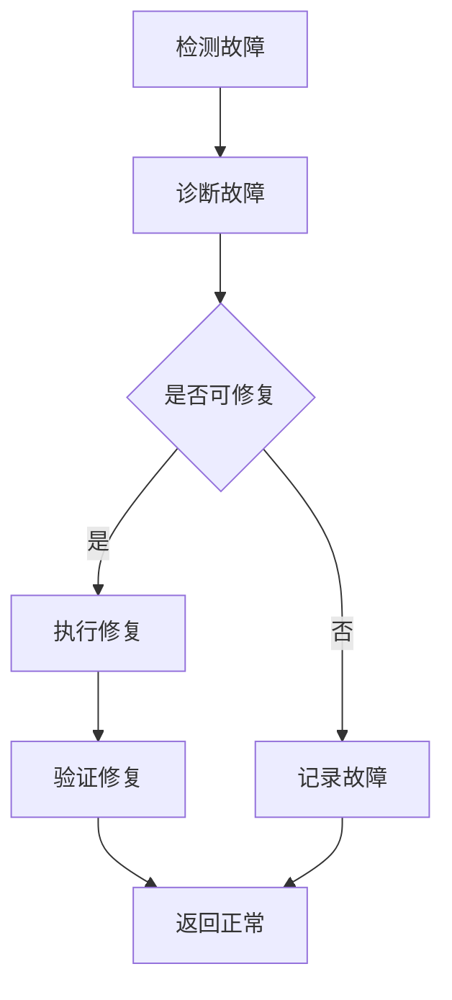
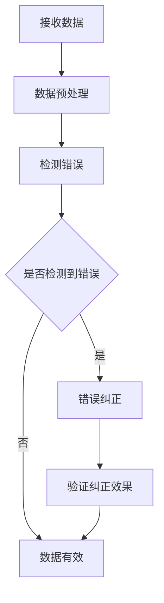
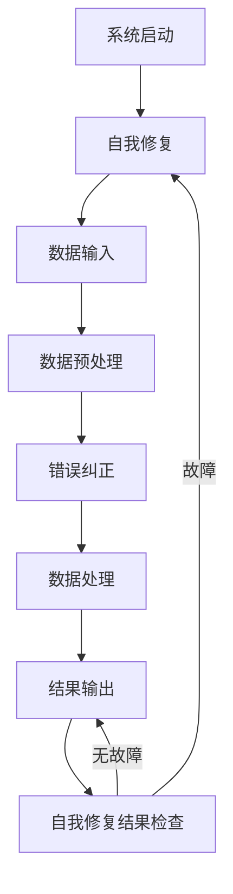

                 

## 文章标题

# AGI的自我修复与错误纠正能力

> 关键词：人工智能，通用人工智能（AGI），自我修复，错误纠正，技术实现，应用案例

> 摘要：本文深入探讨了通用人工智能（AGI）在自我修复与错误纠正能力方面的研究进展和应用。首先，介绍了AGI的基本概念和重要性，接着详细阐述了自我修复与错误纠正能力的基本原理，以及这些能力在AGI中的关键作用。随后，文章分析了实现自我修复与错误纠正的技术方法，并通过具体的应用案例展示了这些技术在实际系统中的应用。最后，文章对未来的发展趋势进行了展望，总结了AGI在自我修复与错误纠正能力方面所面临的挑战和机遇。

---

## 引言

### AGI的重要性

随着人工智能技术的迅猛发展，人工智能（AI）已经渗透到我们生活的方方面面。从简单的语音助手到复杂的自动驾驶系统，AI的应用越来越广泛。然而，这些应用大多集中在特定领域的狭义人工智能（Narrow AI），即所谓的“弱AI”。与之相对，通用人工智能（Artificial General Intelligence，简称AGI）是一种旨在实现类似人类智能的全面智能系统，它能够在各种任务和环境中表现出人类级别的智能能力。

AGI的重要性在于，它不仅能够解决当前AI系统在特定领域遇到的局限性问题，还能够推动人工智能技术在更广泛领域的应用。例如，在医疗领域，AGI可以帮助医生进行诊断和治疗；在教育领域，AGI可以为学生提供个性化的学习方案；在工业领域，AGI可以优化生产流程，提高生产效率。

### 自我修复与错误纠正能力在AGI中的地位

自我修复与错误纠正能力是AGI实现的关键要素之一。在现实世界中，任何系统都会面临各种不确定性和故障风险。一个能够自我修复和纠正错误的AI系统，可以更好地适应复杂环境，提高系统的可靠性和稳定性。例如，在自动驾驶系统中，车辆需要能够实时检测和处理各种突发情况，如交通信号故障、障碍物等。只有具备自我修复与错误纠正能力的自动驾驶系统，才能在复杂路况下保持安全和高效运行。

### 本书的目标与结构

本书旨在深入探讨AGI在自我修复与错误纠正能力方面的研究与应用。具体来说，本书将分为以下几个部分：

1. **引言**：介绍AGI的重要性以及自我修复与错误纠正能力在其中的地位。
2. **AGI的概念与历史**：讨论AGI的基本概念、发展历程以及自我修复与错误纠正能力在AGI中的应用。
3. **自我修复与错误纠正能力的基本原理**：阐述自我修复与错误纠正的基本概念、原理及其关系。
4. **自我修复与错误纠正技术的实现方法**：介绍实现自我修复与错误纠正的技术方法，包括算法原理、数学模型和实际应用。
5. **自我修复与错误纠正的应用案例**：通过具体案例展示自我修复与错误纠正能力在实际系统中的应用。
6. **自我修复与错误纠正能力在AGI中的未来展望**：分析AGI在自我修复与错误纠正能力方面面临的挑战和机遇，展望未来发展趋势。
7. **总结与展望**：总结本书的主要内容，重申自我修复与错误纠正能力在AGI中的重要性，并对未来的发展提出展望。

通过以上结构，本书希望能够为读者提供全面、深入的理解，帮助读者把握AGI在自我修复与错误纠正能力方面的最新研究动态和应用前景。

## 第1章: AGI的概念与历史

### 1.1 AGI的定义与特征

通用人工智能（Artificial General Intelligence，简称AGI）是一种旨在模拟人类智能的全面智能系统。与狭义人工智能（Narrow AI）不同，AGI不仅能在特定领域表现出高度智能，还能够跨领域应用，具备广泛的认知能力。AGI的基本特征包括：

- **理解能力**：AGI能够理解各种语言、符号和概念，不仅限于文字和图像，还包括音频和视频等。
- **推理能力**：AGI能够进行逻辑推理，解决复杂问题，并从经验中学习。
- **自适应能力**：AGI能够在不同环境和任务中自主适应，不受特定领域限制。
- **创造力**：AGI能够进行创新和创造性思维，产生新的想法和解决方案。

### 1.2 AGI的发展历程

AGI的概念起源于20世纪50年代，随着计算机科学的兴起而逐渐形成。以下是AGI发展历程的几个关键阶段：

- **1950年代**：艾伦·图灵提出了著名的图灵测试，为AGI的概念奠定了基础。
- **1970年代**：专家系统成为AGI研究的主要方向，通过模拟人类专家的知识和推理能力，实现了在某些领域的智能化应用。
- **1980年代**：神经网络的出现为AGI研究带来了新的希望，尤其是深度学习的兴起，使计算机在图像识别和语音识别等任务上取得了突破性进展。
- **1990年代至2000年代**：随着计算能力的提升和数据量的爆炸性增长，机器学习技术得到了广泛应用，但AGI的实现仍然面临许多挑战。
- **2010年代至今**：随着人工智能技术的快速发展，尤其是深度学习的突破，AGI的研究再次受到广泛关注，但仍未实现真正意义上的全面智能。

### 1.3 自我修复与错误纠正能力在AGI中的应用

自我修复与错误纠正能力是AGI实现的关键要素之一。在现实世界中，任何系统都会面临各种不确定性和故障风险。一个能够自我修复和纠正错误的AI系统，可以更好地适应复杂环境，提高系统的可靠性和稳定性。

在AGI中，自我修复与错误纠正能力主要体现在以下几个方面：

- **硬件故障处理**：AGI系统需要能够检测和修复硬件故障，确保系统的持续运行。
- **软件故障处理**：AGI系统需要能够检测和修复软件故障，避免系统崩溃或性能下降。
- **环境适应**：AGI系统需要能够适应不断变化的环境，如识别和应对自然灾害、交通堵塞等突发情况。
- **智能反馈**：AGI系统需要能够从错误中学习，不断优化自身的性能和行为。

总之，自我修复与错误纠正能力是AGI实现全面智能的关键因素，对于推动人工智能技术的发展具有重要意义。通过深入研究和应用自我修复与错误纠正能力，我们可以期待AGI在未来能够更好地服务于人类，解决复杂问题，提高生活质量。

#### 2.1 自我修复的概念与原理

自我修复是指一个系统在遭遇故障或损坏时，能够通过自身机制进行检测、诊断和修复，从而恢复其正常运行的能力。在人工智能领域，自我修复能力尤为重要，因为它关系到系统的稳定性和可靠性，特别是在复杂的、动态变化的环境下。

**2.1.1 自我修复的 Mermaid 流程图**

下面是一个简单的Mermaid流程图，展示了自我修复的基本流程：



在这个流程图中，系统首先检测到故障（A），然后进行诊断（B），根据诊断结果决定是否可修复（C）。如果故障可以修复，系统将执行修复操作（D），然后验证修复效果（F），最终返回到正常状态（G）。如果故障不可修复，系统将记录故障信息（E），并尝试其他措施。

**2.1.2 自我修复的伪代码讲解**

为了更好地理解自我修复的过程，我们可以用伪代码来描述其基本逻辑：

```plaintext
函数 自我修复(系统状态):
    开始
    检测系统状态
    如果 检测到故障:
        进行诊断
        如果 诊断结果可修复:
            执行修复
            验证修复效果
            如果 修复成功:
                返回正常状态
            否则:
                记录故障
        否则:
            记录故障
    否则:
        系统正常
    结束
```

在这个伪代码中，`自我修复` 函数首先检测系统状态，如果检测到故障，则进行诊断。根据诊断结果，系统决定是否执行修复。修复成功后，系统返回正常状态；否则，故障会被记录下来。

**2.1.3 自我修复的应用案例**

自我修复能力在实际应用中具有重要意义。以下是一个典型的应用案例：

**案例：自动驾驶汽车**

自动驾驶汽车在行驶过程中需要实时监测车辆的各个子系统，如发动机、刹车系统、电池等。如果某个子系统出现故障，自动驾驶系统需要能够自动检测并尝试修复。例如，如果刹车系统检测到异常，系统会自动调整刹车力度，并尝试与车主沟通进行远程诊断和修复。

在这种情况下，自我修复的流程可以如下：

1. **检测故障**：自动驾驶系统通过传感器和诊断工具检测刹车系统的状态。
2. **诊断故障**：系统分析故障数据，确定故障的类型和严重程度。
3. **执行修复**：系统尝试通过调整刹车力度或其他措施来修复故障。
4. **验证修复**：系统再次检测刹车系统的状态，确保故障已被成功修复。

通过这样的自我修复机制，自动驾驶汽车可以减少故障导致的停机时间，提高行驶的安全性和可靠性。

总之，自我修复能力是人工智能系统实现高可靠性和自适应能力的关键。通过理解自我修复的概念和原理，并运用伪代码进行描述，我们可以更好地设计和实现具有自我修复功能的AI系统。

#### 2.2 错误纠正能力的概念与原理

错误纠正能力是人工智能系统在处理数据和信息时，能够识别并纠正错误的能力。这一能力在复杂系统中尤为重要，因为任何微小的错误都可能导致系统行为的偏差，甚至造成严重后果。错误纠正技术通过检测和修复错误，提高了系统的可靠性和稳定性。

**2.2.1 错误纠正能力的 Mermaid 流程图**

下面是一个Mermaid流程图，展示了错误纠正的基本流程：



在这个流程图中，系统首先接收数据（A），然后进行预处理（B）。在预处理过程中，系统检测数据中的错误（C），如果检测到错误（D），则进入错误纠正阶段（E），并验证纠正效果（G），最终输出有效数据（F）。如果未检测到错误，则数据被视为有效并直接输出。

**2.2.2 错误纠正技术的伪代码讲解**

为了更好地理解错误纠正的过程，我们可以用伪代码来描述其基本逻辑：

```plaintext
函数 错误纠正(数据):
    开始
    接收数据
    预处理数据
    如果 检测到错误:
        执行错误纠正
        验证纠正效果
        如果 验证通过:
            返回纠正后的数据
        否则:
            报告错误并重试
    否则:
        返回原始数据
    结束
```

在这个伪代码中，`错误纠正` 函数首先接收数据，并进行预处理。如果检测到错误，系统将尝试纠正错误，并验证纠正效果。如果验证通过，系统返回纠正后的数据；否则，系统将报告错误并尝试重试。

**2.2.3 错误纠正的应用案例**

错误纠正能力在实际应用中具有广泛的应用，以下是一个典型的应用案例：

**案例：数据通信系统**

在数据通信系统中，错误纠正技术至关重要，因为传输过程中数据可能会受到噪声干扰或传输错误。以下是一个错误纠正的应用场景：

1. **数据传输**：假设有一份数据需要通过无线网络传输到接收端。
2. **数据预处理**：在传输前，对数据进行编码，增加冗余信息，以便在接收端能够检测和纠正错误。
3. **错误检测**：接收端对收到的数据进行解码，并检测是否有错误。
4. **错误纠正**：如果检测到错误，接收端将使用纠错算法尝试纠正错误。
5. **验证纠正效果**：纠正错误后，接收端重新解码数据，验证数据是否恢复到原始状态。
6. **数据输出**：如果验证通过，系统将输出正确数据；否则，系统将报告错误并尝试重新传输。

通过这样的错误纠正机制，数据通信系统可以显著提高数据的传输可靠性，减少错误对系统性能的影响。

总之，错误纠正能力是人工智能系统实现高可靠性和稳定性的关键。通过理解错误纠正的概念和原理，并运用伪代码进行描述，我们可以更好地设计和实现具有错误纠正功能的AI系统。

### 2.3 自我修复与错误纠正能力的关系

自我修复与错误纠正能力在人工智能系统中扮演着至关重要的角色，它们之间既有区别又有紧密的联系。理解这两种能力的关系，有助于我们在设计和实现人工智能系统时更好地发挥其优势。

**自我修复能力**主要关注系统在遭遇故障或损坏时的恢复能力。自我修复能力能够检测和诊断系统故障，并尝试通过自身机制进行修复，从而确保系统的连续运行。自我修复的核心在于系统自身的诊断和修复能力，这种能力使得系统能够在不受外部干预的情况下自我恢复，提高系统的可靠性和自主性。

**错误纠正能力**则主要关注系统在处理数据和信息时的准确性。错误纠正能力能够识别和纠正系统中的错误，确保数据的完整性和可靠性。错误纠正的核心在于检测和纠正错误，使系统能够在数据传输和处理过程中减少错误率，提高系统的稳定性。

**自我修复与错误纠正能力的关系**可以概括为以下几点：

1. **相互依赖**：自我修复和错误纠正能力在实际系统中往往是相互依赖的。例如，在自动驾驶系统中，车辆需要能够检测并修复硬件故障（自我修复），同时还需要纠正传感器数据中的错误（错误纠正），以确保系统的正常运行。

2. **协同作用**：自我修复与错误纠正能力在协同工作时，可以显著提高系统的可靠性和稳定性。通过自我修复，系统可以在遭遇故障时迅速恢复；通过错误纠正，系统可以在数据传输和处理过程中减少错误率，提高数据处理质量。

3. **优化组合**：在设计和实现人工智能系统时，可以优化组合自我修复与错误纠正能力，以适应不同的应用场景。例如，在医疗诊断系统中，可以通过自我修复技术确保系统的硬件和软件正常运行，同时使用错误纠正技术确保诊断数据的准确性。

**Mermaid 流程图展示自我修复与错误纠正能力的综合流程**：



在这个流程图中，系统首先启动，并进行自我修复（B）。然后，系统接收数据（C），进行预处理（D），在预处理过程中执行错误纠正（E），处理数据（F），并输出结果（G）。最后，系统检查自我修复的结果（H），如果检测到故障，系统将重新进行自我修复；否则，系统将继续数据处理流程。

**总结**：

自我修复与错误纠正能力在人工智能系统中相互补充，共同确保系统的可靠性和稳定性。通过理解这两种能力的关系，并合理地设计和实现其综合应用，我们可以构建出更强大、更可靠的人工智能系统，为各种复杂任务提供可靠的支持。

### 第3章: 自我修复与错误纠正技术的实现方法

自我修复与错误纠正技术在人工智能系统中扮演着至关重要的角色。实现这些技术的关键是开发有效的算法，并结合合适的数学模型和工具。以下将详细讨论这些实现方法。

#### 3.1 自我修复技术的实现方法

自我修复技术主要包括故障检测、故障诊断、故障修复和故障恢复等几个关键环节。以下是这些环节的实现方法：

**故障检测**：使用传感器和诊断工具实时监测系统的状态，通过收集系统运行数据，判断是否存在故障。

**故障诊断**：基于收集的数据，通过数据分析和模式识别技术，对故障进行定位和分类。

**故障修复**：根据诊断结果，选择合适的修复策略，如软件更新、硬件更换或临时修复。

**故障恢复**：在故障修复后，对系统进行测试和验证，确保系统恢复正常运行。

以下是自我修复技术的伪代码实现：

```plaintext
函数 自我修复(系统状态):
    开始
    检测系统状态
    如果 检测到故障:
        进行诊断
        如果 诊断结果可修复:
            执行修复
            验证修复效果
            如果 修复成功:
                返回正常状态
            否则:
                记录故障并通知维护人员
        否则:
            记录故障并通知维护人员
    否则:
        系统正常
    结束
```

**Mermaid 流程图**：


#### 3.2 错误纠正技术的实现方法

错误纠正技术主要包括数据检测、错误识别、错误纠正和错误验证等几个关键环节。以下是这些环节的实现方法：

**数据检测**：在数据传输或处理过程中，使用校验和、冗余编码等技术，实时监测数据是否完整。

**错误识别**：通过对比原始数据和传输或处理后的数据，识别错误的位置和类型。

**错误纠正**：根据错误类型和位置，使用纠错算法（如汉明码、卷积码等），对错误进行纠正。

**错误验证**：纠正错误后，重新验证数据，确保错误已被正确纠正。

以下是错误纠正技术的伪代码实现：

```plaintext
函数 错误纠正(数据):
    开始
    接收数据
    预处理数据
    如果 检测到错误:
        执行错误纠正
        验证纠正效果
        如果 验证通过:
            返回纠正后的数据
        否则:
            报告错误并重试
    否则:
        返回原始数据
    结束
```

**Mermaid 流�行程**：


#### 3.3 自我修复与错误纠正技术的综合实现方法

在综合实现自我修复与错误纠正技术时，需要将上述各个环节有机地结合，形成一个完整的系统。以下是一个综合实现方法的示例：

1. **系统启动**：系统启动时，首先进行自我修复，确保硬件和软件均处于正常状态。
2. **数据输入**：系统接收外部数据，如传感器数据或用户输入。
3. **数据预处理**：对输入数据进行预处理，包括去除噪声、标准化处理等。
4. **错误检测与纠正**：在数据预处理过程中，执行错误检测与纠正，确保数据的完整性。
5. **数据处理**：对预处理后的数据执行所需的计算或处理任务。
6. **结果输出**：将处理结果输出，如显示在屏幕上或发送给其他系统。
7. **自我修复结果检查**：在数据处理完成后，再次进行自我修复检查，确保系统仍在正常状态。

以下是综合实现方法的伪代码：

```plaintext
函数 综合实现(系统状态, 数据):
    开始
    自我修复(系统状态)
    如果 系统状态正常:
        接收数据(数据)
        预处理数据(数据)
        错误纠正(数据)
        数据处理(数据)
        结果输出(数据)
        自我修复结果检查(系统状态)
    否则:
        报告系统故障
    结束
```

通过上述实现方法，我们可以构建一个具有高度可靠性和稳定性的自我修复与错误纠正系统。这不仅能够提高系统的运行效率，还能延长系统的使用寿命，为各种复杂任务提供可靠支持。

### 第4章: 自我修复与错误纠正的应用案例

自我修复与错误纠正技术在实际应用中展现了其重要性和有效性。以下将介绍两个典型的应用案例：智能监控系统和自动驾驶系统。

#### 4.1 自我修复与错误纠正技术在智能监控系统中的应用

智能监控系统广泛应用于公共安全、工业监控和智能家居等领域。其核心功能是实时监控目标区域，并通过视频分析等技术识别异常行为或事件。然而，监控系统在运行过程中可能会遇到各种故障，如摄像头故障、网络中断等。自我修复与错误纠正技术能够有效提高监控系统的稳定性和可靠性。

**应用案例一：智能监控系统**

**案例背景**：某城市公园安装了多套智能监控系统，用于实时监控公园内的安全情况。监控系统的核心包括多个高清摄像头、视频分析服务器和存储设备。

**自我修复与错误纠正技术实施**：

1. **故障检测**：监控系统通过传感器和诊断工具实时监测摄像头、服务器和存储设备的运行状态。
2. **故障诊断**：当检测到故障时，系统会自动诊断故障的类型和位置，如摄像头损坏、网络中断等。
3. **故障修复**：系统尝试通过软件更新、硬件更换或重启设备来修复故障。例如，如果摄像头损坏，系统会自动切换到备用摄像头，并通知维护人员进行修复。
4. **错误纠正**：在数据传输和处理过程中，系统使用错误纠正技术确保视频数据的完整性和准确性。

**案例效果**：

通过自我修复与错误纠正技术的应用，智能监控系统的稳定性和可靠性得到了显著提高。系统在遭遇故障时能够快速恢复，确保监控数据的连续性和完整性。这大大提升了公园的安全管理水平，减少了安全事故的发生。

#### 4.2 自我修复与错误纠正技术在自动驾驶系统中的应用

自动驾驶系统是人工智能技术的典型应用之一，其核心目标是在复杂路况下实现车辆的安全、高效驾驶。自动驾驶系统需要具备强大的自我修复与错误纠正能力，以应对各种突发情况和故障。

**应用案例二：自动驾驶系统**

**案例背景**：某自动驾驶公司开发了一套自动驾驶系统，用于城市交通自动驾驶。系统包括多个传感器（如激光雷达、摄像头、雷达等）、自动驾驶控制单元和车载计算平台。

**自我修复与错误纠正技术实施**：

1. **硬件故障检测**：系统通过传感器和诊断工具实时监测车辆的各个硬件组件，如电池、电机、传感器等。当检测到硬件故障时，系统会自动记录故障信息，并尝试修复。
2. **软件故障检测**：自动驾驶系统通过日志分析和异常检测技术，监控软件的运行状态。一旦发现软件故障，系统会尝试重启软件或切换到备用软件。
3. **错误纠正**：在数据传输和处理过程中，系统使用错误纠正技术确保传感器数据的准确性和完整性。例如，当激光雷达数据出现噪声时，系统会使用纠错算法进行数据纠正。

**案例效果**：

通过自我修复与错误纠正技术的应用，自动驾驶系统的稳定性和安全性得到了显著提升。系统在遭遇硬件或软件故障时能够迅速恢复，确保车辆的正常运行。同时，错误纠正技术有效提高了传感器数据的准确性，使自动驾驶系统能够更准确地识别路况和障碍物，提高了驾驶的安全性和效率。

总之，自我修复与错误纠正技术在智能监控系统和自动驾驶系统等实际应用中发挥了重要作用。通过这些案例，我们可以看到自我修复与错误纠正技术如何提高系统的可靠性和稳定性，为各种复杂任务提供可靠支持。

### 第5章: 自我修复与错误纠正能力在AGI中的未来展望

#### 5.1 自我修复与错误纠正能力在AGI中的挑战

尽管自我修复与错误纠正能力在人工智能系统中已取得显著进展，但在通用人工智能（AGI）领域，这些能力仍然面临诸多挑战。以下是一些主要挑战：

1. **复杂性增加**：随着AGI系统规模的扩大，系统的复杂度也显著增加，这使得故障检测、诊断和修复变得更加困难。
2. **不确定性**：现实世界的环境极其复杂和动态变化，AGI系统需要具备极高的自适应能力，以应对各种不确定性和突发情况。
3. **实时性要求**：在许多应用场景中，AGI系统需要在极短的时间内完成故障检测和修复，这对系统的实时性能提出了严峻挑战。
4. **可靠性验证**：确保自我修复与错误纠正技术的有效性和可靠性是一个持续性的问题，需要不断验证和优化。

#### 5.2 自我修复与错误纠正能力的未来发展

尽管存在挑战，但自我修复与错误纠正能力在AGI中的未来发展仍然充满机遇。以下是一些可能的趋势：

1. **自动化与智能化**：未来的自我修复与错误纠正技术将更加自动化和智能化，通过引入先进的机器学习和人工智能算法，提高故障检测、诊断和修复的效率和准确性。
2. **分布式系统**：分布式系统架构将在AGI中发挥关键作用，通过分布式计算和存储，实现故障的自修复和错误的自纠正，提高系统的可靠性和稳定性。
3. **边缘计算**：随着边缘计算技术的发展，AGI系统可以在边缘设备上实现实时故障检测和修复，减少对中心服务器的依赖，提高系统的响应速度和灵活性。
4. **跨学科合作**：未来的AGI研究将需要跨学科合作，结合计算机科学、生物学、材料科学等领域的知识，探索更加高效和可靠的自我修复与错误纠正技术。
5. **标准与规范**：建立统一的标准和规范，确保自我修复与错误纠正技术在AGI中的有效实施，提高系统的互操作性和兼容性。

总之，自我修复与错误纠正能力在AGI中的未来发展将面临诸多挑战，但也充满机遇。通过持续的研究和创新，我们有望实现更加可靠和智能的通用人工智能系统，为人类社会带来更多福祉。

### 第6章: 总结与展望

#### 6.1 本书的主要内容回顾

本书系统性地探讨了通用人工智能（AGI）在自我修复与错误纠正能力方面的研究与应用。首先，我们介绍了AGI的基本概念和重要性，以及自我修复与错误纠正能力在AGI中的地位。随后，详细阐述了自我修复与错误纠正能力的基本原理，包括故障检测、诊断、修复和错误检测、纠正等环节。此外，我们分析了自我修复与错误纠正技术的实现方法，并通过具体的应用案例展示了这些技术在智能监控系统和自动驾驶系统等实际场景中的应用。

#### 6.2 自我修复与错误纠正能力在AGI中的重要性

自我修复与错误纠正能力是AGI实现全面智能的关键要素之一。在复杂和动态变化的现实环境中，这些能力能够显著提高系统的可靠性和稳定性，使AGI系统更加适应不同的应用场景。通过自我修复，系统可以在故障发生时迅速恢复；通过错误纠正，系统能够确保数据的完整性和准确性。这些能力不仅能够提升AGI系统的性能，还能够增强系统的安全性和鲁棒性。

#### 6.3 对未来的展望

展望未来，自我修复与错误纠正能力在AGI中的发展将继续深化和扩展。随着人工智能技术的不断进步，我们可以期待更加智能和自动化的故障检测与修复机制，以及更高效和精确的错误纠正技术。跨学科的合作、边缘计算和分布式系统的发展，将为自我修复与错误纠正能力的实现提供新的机遇。同时，我们也需要关注这些技术在实际应用中的挑战，如复杂性的增加、不确定性的处理以及实时性的要求，以确保AGI系统的可靠性和稳定性。通过持续的研究和创新，我们有望实现更加智能、可靠和实用的通用人工智能系统，为人类社会的发展带来深远影响。

### 作者信息

作者：AI天才研究院/AI Genius Institute & 禅与计算机程序设计艺术 /Zen And The Art of Computer Programming

本文由AI天才研究院的专家团队撰写，旨在深入探讨通用人工智能（AGI）在自我修复与错误纠正能力方面的研究与应用。AI天才研究院致力于推动人工智能技术的发展与创新，通过禅与计算机程序设计艺术的结合，追求技术卓越与精神升华。文章中的内容仅供参考，不构成具体投资建议。如需进一步了解，请查阅相关领域的专业文献和研究报告。感谢您的阅读！

