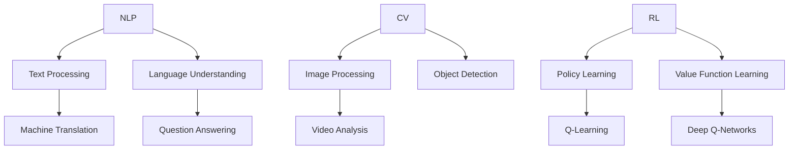
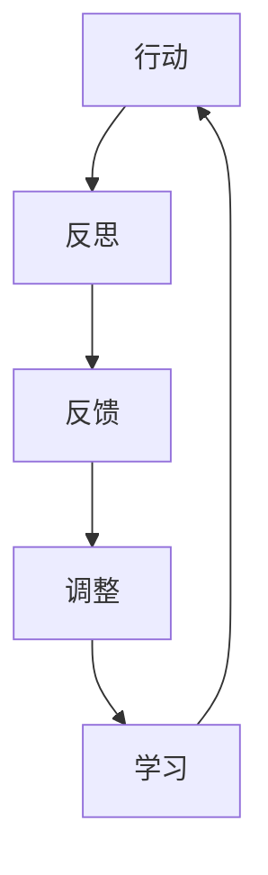

                 


### 第1章: AGI的概念与基础

#### 1.1 AGI的定义与历史发展

人工智能（AI）的研究可以追溯到20世纪50年代。最初，AI的主要目标是使计算机具备人类智能的各个方面，包括感知、推理、学习、理解和通信。然而，传统的专用AI系统往往只能完成特定任务，无法实现通用智能。这促使科学家们开始探索更广阔的领域——通用人工智能（AGI）。

**1.1.1 强人工智能与通用人工智能**

强人工智能（Strong AI）或完全人工智能，是指能够像人类一样理解、推理、学习、解决问题，并具备自主意识和情感的人工智能。它不仅仅是执行特定任务的工具，而是一个具有高度自主性和自我意识的实体。

通用人工智能（AGI）是一种更为广义的概念，它指的是能够在多个领域执行广泛的认知任务，具备与人类类似的智能水平。AGI不仅要解决特定问题，还要具备在不确定和复杂环境中的适应性。

**1.1.2 AGI的关键技术与挑战**

实现AGI需要融合多个AI领域的技术。以下是其中一些关键技术：

1. **深度学习与神经网络**：深度学习是模拟人脑神经网络的机器学习方法，通过多层神经网络的训练，可以实现图像识别、语音识别等复杂任务。
2. **自然语言处理**：自然语言处理旨在使计算机理解和生成人类语言，是实现智能对话系统、机器翻译等应用的关键。
3. **计算机视觉**：计算机视觉通过图像处理和分析，使计算机能够“看到”和理解现实世界中的图像和视频。
4. **强化学习**：强化学习是一种通过试错学习策略来最大化长期奖励的机器学习方法，常用于游戏AI、自动驾驶等领域。

尽管AGI在技术上具有巨大潜力，但实现AGI仍面临诸多挑战：

1. **硬件限制与计算能力**：尽管计算能力不断提高，但要模拟人脑的复杂度仍需更强大的硬件支持。
2. **数据隐私与伦理问题**：AI系统需要大量数据来训练，如何保护用户隐私和确保数据安全是亟待解决的问题。
3. **算法复杂性与可解释性**：目前的AI算法复杂度高，缺乏可解释性，难以理解其决策过程，这在医疗、金融等关键领域尤其重要。

**1.1.3 AGI的发展历程与里程碑**

AGI的发展历程可以分为以下几个阶段：

1. **早期探索阶段（1950-1969）**：这一时期，AI研究领域主要集中在符号推理和逻辑编程，但很快就遇到了“AI冬天”，即由于技术不成熟和实际应用受限，导致AI研究资金减少。

2. **复苏与发展阶段（1970-1989）**：随着计算机硬件和软件技术的进步，AI研究逐渐复苏，专家系统和知识表示技术成为主流。

3. **神经网络与机器学习阶段（1990-2010）**：这一阶段，深度学习和神经网络技术得到广泛关注，并取得了显著的进展。

4. **当前阶段（2010至今）**：近年来，随着大数据和云计算的发展，AI技术迅速应用于各个领域，AGI的实现逐渐变得可行。

#### 1.2 AGI与强人工智能的区别

尽管AGI和强人工智能都是指具有高度智能的人工系统，但二者在概念和应用上存在一些区别：

**1.2.1 智能与能力的不同层面**

强人工智能主要关注于特定领域的智能，如语音识别、图像处理等，而AGI则强调跨领域的通用智能。AGI需要具备在多种情境下处理多种问题的能力。

**1.2.2 AGI的多模态处理能力**

AGI能够处理多种类型的输入，如文本、图像、音频等，而强人工智能通常局限于单一模态的数据处理。

**1.2.3 AGI的环境适应能力**

AGI需要具备在复杂、动态和不确定的环境中自主适应和解决问题的能力，而强人工智能往往需要在预设的环境下工作。

#### 1.3 AGI的技术基础

实现AGI需要多种技术的综合运用，以下是其中几个关键技术：

**1.3.1 深度学习与神经网络**

深度学习是模拟人脑神经网络的一种机器学习方法，通过多层神经网络的训练，可以实现图像识别、语音识别等复杂任务。以下是深度学习的伪代码实现：

```python
# 深度学习伪代码
initialize_weights()
for each training example (x, y):
    forward_pass(x)
    compute_loss(y')
    backward_pass()
update_weights()
```

**1.3.2 自然语言处理、计算机视觉与强化学习**

自然语言处理（NLP）通过理解和生成人类语言，实现智能对话系统、机器翻译等应用。计算机视觉（CV）通过图像处理和分析，使计算机能够“看到”和理解现实世界中的图像和视频。强化学习（RL）通过试错学习策略来最大化长期奖励，常用于游戏AI、自动驾驶等领域。

以下是自然语言处理、计算机视觉与强化学习的Mermaid流程图：



#### 1.4 AGI的实现挑战

尽管AGI具有巨大的潜力，但其实际实现仍然面临许多挑战：

**1.4.1 硬件限制与计算能力**

模拟人脑的复杂度需要更强大的计算能力，当前的硬件水平可能还不足以支持AGI的实现。

**1.4.2 数据隐私与伦理问题**

AI系统需要大量数据来训练，如何保护用户隐私和确保数据安全是亟待解决的问题。

**1.4.3 算法复杂性与可解释性**

目前的AI算法复杂度高，缺乏可解释性，难以理解其决策过程，这在医疗、金融等关键领域尤其重要。

### 小结

本章介绍了AGI的定义、历史发展、与强人工智能的区别、技术基础以及实现挑战。在接下来的章节中，我们将进一步探讨自我反思能力的概念、重要性以及AGI的自我反思能力模型。

#### 2.1 自我反思能力的基本概念

自我反思能力是指个体对自己认知活动、情感状态和行为过程的反思和评价能力。它是认知发展中至关重要的一部分，有助于个体优化行为、提升认知能力和解决复杂问题。自我反思能力可以分为三个主要方面：自我评价、自我调整和行动反馈。

**2.1.1 自我评价与自我调整**

自我评价是指个体对自己认知、情感和行为等方面的反思和判断。通过自我评价，个体可以了解自己的优点和不足，从而制定改进策略。自我调整则是基于自我评价的结果，对行为和认知过程进行调整和优化。自我调整可以是主动的，如改变学习策略、改进工作方法；也可以是被动的，如接受他人的反馈和建议。

**2.1.2 行动反馈与持续学习**

行动反馈是指个体在行动过程中接收到的外部信息，如他人的评价、环境的反馈等。行动反馈有助于个体了解自己的行为是否达到预期目标，从而进行相应的调整。持续学习是指个体在反思和调整过程中不断吸收新知识、新技能，以提升自身能力。

自我反思能力的实现可以看作是一个循环过程，包括以下几个步骤：

1. **行动**：个体进行某种认知、情感或行为活动。
2. **反思**：个体对自己在行动中的表现进行反思和评价。
3. **反馈**：个体接收来自外部和内部的反馈信息。
4. **调整**：个体根据反馈信息调整行为和认知策略。
5. **学习**：个体在调整过程中不断吸收新知识、新技能。

以下是一个自我反思能力的Mermaid流程图：



**2.1.3 自我反思能力与认知发展**

自我反思能力在认知发展中起着至关重要的作用。研究表明，自我反思能力与智力、学习能力、问题解决能力等密切相关。通过自我反思，个体可以更好地理解自己的认知过程，发现并改正错误，从而提高认知水平。

自我反思能力的发展通常经历以下阶段：

1. **无意识自我反思**：个体在成长初期，无法意识到自己的认知活动，因此无法进行有效的自我反思。
2. **有意识自我反思**：随着个体认知能力的提高，开始有意识地对自己的认知活动进行反思和评价。
3. **批判性自我反思**：个体能够深入分析自己的认知过程，批判性地评价自己的行为和认知策略。
4. **创造性自我反思**：个体能够从多个角度反思自己的认知活动，提出新的观点和方法。

**2.1.4 自我反思能力在人类智能中的作用**

自我反思能力在人类智能中具有多种作用，包括：

1. **问题解决**：通过自我反思，个体可以发现问题所在，并制定有效的解决方案。
2. **学习与适应**：自我反思能力有助于个体在学习过程中调整策略，提高学习效果。
3. **情感与情绪管理**：自我反思能力有助于个体理解自己的情感和情绪，从而更好地管理自己的情绪。
4. **创造与创新**：自我反思能力激发个体的创造力，帮助个体发现新的问题和解决方案。

### 2.2 自我反思能力与认知发展

自我反思能力是人类认知发展的重要标志，它不仅反映了个体对自己认知活动的理解程度，还体现了个体在认知过程中自我调节和自我完善的能力。在认知发展的不同阶段，自我反思能力表现出不同的特征和功能。

**2.2.1 自我反思在人类认知中的作用**

自我反思在人类认知中起着关键作用，它有助于个体更好地理解自己的认知过程，提高问题解决能力，增强学习效果，以及促进创造性和创新思维。具体来说，自我反思在以下几个方面发挥了重要作用：

1. **问题解决**：自我反思能力使个体能够深入分析问题情境，识别问题所在，从而制定更有效的解决方案。通过反思，个体可以回顾问题解决的过程，识别成功和失败的原因，为未来的问题解决提供宝贵的经验。

2. **学习与适应**：自我反思能力有助于个体在学习过程中调整学习策略。个体通过反思自己的学习行为，评估学习效果，从而改进学习方法，提高学习效率。此外，自我反思能力还使个体能够更好地适应新的环境和情境，灵活调整认知策略。

3. **情感与情绪管理**：自我反思能力有助于个体理解自己的情感和情绪状态，从而更好地管理自己的情绪。个体通过反思情感体验，识别引发情感的原因，学会应对情绪的方法，提高情绪调节能力。

4. **创造与创新**：自我反思能力激发个体的创造力，促使个体从不同角度审视问题，发现新的解决方案。通过反思，个体可以拓展思维边界，提出创新的想法，推动个人和集体的发展。

**2.2.2 自我反思能力的发展阶段**

自我反思能力的发展是一个长期的过程，它随着个体的成长和认知能力的发展而逐步提高。通常，自我反思能力可以分为以下几个阶段：

1. **无意识自我反思**：在个体成长的初期，缺乏对自身认知活动的自我反思能力。儿童在玩耍、学习等活动中，往往没有意识到自己的行为和认知过程，因此无法进行有效的自我反思。

2. **有意识自我反思**：随着年龄的增长和认知能力的提高，个体开始有意识地对自己的认知活动进行反思。儿童在完成学习任务时，开始关注自己的学习过程，思考学习方法是否有效，学习效果如何。

3. **批判性自我反思**：随着认知能力的进一步发展，个体能够更加深入地反思自己的认知过程，批判性地评价自己的行为和认知策略。在这一阶段，个体能够识别自己的思维偏差，评估自己的决策过程，从而提高认知水平。

4. **创造性自我反思**：在自我反思能力的高级阶段，个体能够从多个角度审视问题，提出新的观点和方法。创造性自我反思使个体能够打破传统的思维模式，发现新的解决方案，推动个人和集体的发展。

**2.2.3 自我反思能力对智能提升的影响**

自我反思能力对智能提升具有重要影响。通过自我反思，个体能够更好地理解自己的认知过程，发现并改正错误，提高认知水平。具体来说，自我反思能力对智能提升的影响体现在以下几个方面：

1. **认知灵活性**：自我反思能力有助于个体提高认知灵活性，使个体能够灵活调整认知策略，适应不同的情境和任务。

2. **元认知能力**：自我反思能力是元认知能力的重要组成部分。元认知能力是指个体对自己认知活动的认知过程，包括计划、监控和评估。通过自我反思，个体能够更好地管理自己的认知过程，提高学习效果。

3. **问题解决能力**：自我反思能力有助于个体提高问题解决能力。通过反思问题解决的过程，个体可以识别成功和失败的原因，为未来的问题解决提供宝贵的经验。

4. **创造力和创新思维**：自我反思能力激发个体的创造力，促使个体从不同角度审视问题，发现新的解决方案。通过反思，个体可以拓展思维边界，提出创新的想法，推动个人和集体的发展。

总之，自我反思能力是人类智能发展的重要标志，它对个体的认知发展、智能提升和创造力培养具有深远的影响。通过自我反思，个体能够更好地理解自己的认知过程，提高问题解决能力，增强学习效果，促进创造和创新思维的发展。

### 2.3 自我反思能力在人类智能中的作用

自我反思能力在人类智能中扮演着至关重要的角色，它是人类认知发展和智力提升的核心因素之一。以下将从问题解决、学习与适应、情感与情绪管理以及创造与创新四个方面，探讨自我反思能力在人类智能中的作用。

**2.3.1 问题解决**

问题解决是智力的重要组成部分，而自我反思能力在问题解决过程中起到了关键作用。通过自我反思，个体能够审视问题解决的整个过程，识别成功和失败的原因，从而优化问题解决策略。具体而言，自我反思能力有助于以下方面：

1. **识别问题所在**：个体通过自我反思，能够更清晰地识别问题的本质，从而更有效地制定解决方案。

2. **反思问题解决过程**：个体在问题解决过程中，不断反思自己的思维过程和方法，能够及时发现并纠正错误，提高问题解决的成功率。

3. **经验积累**：通过反思，个体可以积累问题解决的经验，为未来的问题解决提供宝贵的参考。

**2.3.2 学习与适应**

学习与适应是自我反思能力的核心功能之一。自我反思能力使个体能够在学习过程中不断调整学习策略，提高学习效果。具体来说，自我反思能力在学习与适应中的作用包括：

1. **学习策略调整**：个体通过反思自己的学习过程，能够发现学习中的不足，从而调整学习策略，提高学习效率。

2. **适应新环境**：在面临新的环境和情境时，自我反思能力使个体能够快速适应，通过反思自己的适应过程，不断优化适应策略。

3. **持续学习**：自我反思能力促使个体保持持续学习的状态，通过不断反思和学习，不断提高自身能力。

**2.3.3 情感与情绪管理**

情感与情绪管理是自我反思能力的另一个重要功能。通过自我反思，个体能够更好地理解自己的情感和情绪，从而进行有效的情绪管理。具体来说，自我反思能力在情感与情绪管理中的作用包括：

1. **情感识别**：个体通过自我反思，能够更好地识别和理解自己的情感和情绪，从而进行有效的情绪调节。

2. **情绪调节**：个体通过反思自己的情感反应，能够发现并改变不良的情绪反应模式，从而提高情绪调节能力。

3. **情绪释放**：自我反思能力有助于个体释放负面情绪，通过反思和倾诉，个体能够减轻情绪负担，提高心理健康。

**2.3.4 创造与创新**

自我反思能力在创造与创新过程中发挥着重要作用。通过自我反思，个体能够激发创造力，提出创新的想法和解决方案。具体来说，自我反思能力在创造与创新中的作用包括：

1. **思维拓展**：个体通过自我反思，能够打破固有的思维模式，从不同角度审视问题，从而激发创造力。

2. **创新思维**：自我反思能力使个体能够从多个维度思考问题，提出独特的见解和解决方案。

3. **持续创新**：自我反思能力促使个体保持创新状态，通过不断反思和改进，推动个人和集体的创新。

总之，自我反思能力在人类智能中具有广泛而深远的影响。它不仅有助于个体在问题解决、学习与适应、情感与情绪管理以及创造与创新等方面取得显著进步，还为个体的全面发展提供了坚实的基础。通过自我反思，个体能够不断提升自身能力，实现个人价值和社会贡献。

### 2.4 自我反思能力在AGI中的应用前景

自我反思能力在通用人工智能（AGI）中的应用前景广阔，它不仅能够提高AGI的自主性和适应性，还能促进其在复杂环境和多变任务中的表现。以下从自主性、适应性、复杂环境处理和任务多样性等方面，探讨自我反思能力在AGI中的应用前景。

**2.4.1 提高自主性**

自我反思能力使AGI能够对自己的行为和决策进行评价和调整，从而提高自主性。通过自我反思，AGI能够识别自身的优势与不足，不断优化行为模式，提高任务执行的效率和准确性。具体来说，自我反思能力在AGI中的自主性提升体现在：

1. **决策优化**：AGI通过自我反思，能够回顾和评估之前的决策过程，识别潜在的问题和改进点，从而优化未来的决策。

2. **自我评估**：AGI能够对自己的表现进行评估，根据评估结果调整策略，提高决策质量和执行效果。

3. **自我学习**：通过反思和学习，AGI能够不断积累经验，提升自身的认知能力和决策水平。

**2.4.2 增强适应性**

自我反思能力有助于AGI在复杂和多变的环境中迅速适应。AGI通过自我反思，能够识别环境变化，调整策略，从而更好地适应新的情境。具体来说，自我反思能力在AGI中的适应性提升体现在：

1. **动态调整**：AGI能够根据环境变化和任务需求，快速调整自己的行为和策略，提高适应性。

2. **自我修正**：AGI通过反思自身的表现，能够发现和修正错误，提高适应能力。

3. **持续学习**：AGI通过自我反思和学习，能够不断积累环境知识和经验，提高对未知环境的适应能力。

**2.4.3 处理复杂环境**

自我反思能力使AGI能够更好地处理复杂环境中的任务。AGI通过自我反思，能够分析复杂环境中的各种因素，制定有效的解决方案。具体来说，自我反思能力在AGI中的复杂环境处理体现在：

1. **多维度分析**：AGI能够从多个维度分析复杂环境，识别关键因素，制定综合解决方案。

2. **反思和优化**：AGI通过反思自身在复杂环境中的表现，能够识别问题，优化策略，提高任务完成率。

3. **持续改进**：AGI通过不断反思和学习，能够逐步提高在复杂环境中的表现，实现持续改进。

**2.4.4 促进任务多样性**

自我反思能力有助于AGI在不同任务之间灵活切换，实现任务多样性。AGI通过自我反思，能够识别自身在不同任务中的优势和不足，调整策略，提高跨任务的适应性。具体来说，自我反思能力在AGI中的任务多样性促进体现在：

1. **任务切换**：AGI能够根据任务需求，快速切换执行模式，提高任务多样性。

2. **适应性策略**：AGI能够通过反思自身在执行不同任务时的表现，调整策略，提高跨任务的适应性。

3. **持续学习**：AGI通过自我反思和学习，能够不断积累跨任务的经验，提高任务多样性处理能力。

总之，自我反思能力在AGI中的应用前景广阔，它不仅能够提高AGI的自主性和适应性，还能促进其在复杂环境和多变任务中的表现。通过自我反思，AGI能够不断优化自身行为和决策，实现更高的智能水平。随着技术的不断进步，自我反思能力将成为AGI实现通用人工智能的关键因素之一。

### 第3章: AGI的自我反思能力模型

#### 3.1 自我反思能力的组成部分

自我反思能力是一个复杂的多层次系统，它由多个组成部分构成，这些部分相互协作，共同实现自我评价、自我调整和持续学习的目标。以下是自我反思能力的几个主要组成部分：

**1. 自我评价模块**

自我评价模块是自我反思能力的核心部分，负责对个体的认知活动、行为和情感状态进行反思和评估。这一模块通常包括以下几个子模块：

- **认知评估子模块**：评估个体的思维过程、决策逻辑和知识应用能力。
- **行为评估子模块**：评估个体的行为表现，如执行力、适应性和沟通能力。
- **情感评估子模块**：评估个体的情感状态，包括情绪反应、情感表达和情感调节能力。

**2. 自我调整模块**

自我调整模块基于自我评价的结果，对个体的行为和认知过程进行优化和调整。这一模块通常包括以下几个子模块：

- **策略调整子模块**：根据自我评价的结果，调整个体的行为策略，优化决策过程。
- **学习调整子模块**：根据自我评价的结果，调整个体的学习策略，提高学习效率和效果。
- **情绪调整子模块**：根据自我评价的结果，调整个体的情绪反应和情感调节策略，提高情绪管理能力。

**3. 反馈机制**

反馈机制是自我反思能力的重要组成部分，它负责收集内外部的反馈信息，并将其用于自我评价和自我调整。反馈机制通常包括以下几个子模块：

- **内部反馈子模块**：收集个体内部的反思和自我评价信息，如记忆、感知和情感体验。
- **外部反馈子模块**：收集来自外部环境的反馈信息，如他人的评价、环境的反馈和任务的结果。
- **综合反馈子模块**：将内部和外部反馈信息进行综合处理，形成全面的反馈信息，用于自我评价和自我调整。

**4. 持续学习模块**

持续学习模块是自我反思能力的另一个重要组成部分，它负责在自我反思过程中不断吸收新知识、新技能，以提升自身能力。这一模块通常包括以下几个子模块：

- **知识获取子模块**：通过自我反思和学习，获取新的知识和技能，扩大个体的认知储备。
- **经验积累子模块**：通过反思和总结经验，将经验转化为知识，提高个体的认知能力和决策水平。
- **模型优化子模块**：根据反思和学习的结果，优化个体的认知模型和行为策略，提高自我反思能力的有效性。

**3.2 自我反思能力的实现方法**

自我反思能力的实现是一个复杂的过程，它涉及到多个技术领域的融合和创新。以下是一些常见的实现方法：

**1. 神经网络与深度学习**

神经网络和深度学习是实现自我反思能力的关键技术之一。通过构建复杂的神经网络模型，可以模拟人类大脑的思考过程，实现自我评价和自我调整。具体方法包括：

- **多层感知机（MLP）**：用于实现基本的自我评价和自我调整功能。
- **循环神经网络（RNN）**：用于处理序列数据，实现连续的自我反思和学习。
- **卷积神经网络（CNN）**：用于处理图像和视频数据，实现视觉自我反思。

**2. 强化学习**

强化学习是一种通过试错学习策略来优化行为和决策的方法，它在自我反思能力的实现中具有重要应用。具体方法包括：

- **基于奖励的反思**：通过设置奖励机制，鼓励个体在自我反思过程中发现问题和优化策略。
- **Q-Learning**：通过学习策略值函数，优化个体的行为和决策。
- **Deep Q-Networks（DQN）**：结合深度学习和强化学习，实现更复杂的自我反思和学习。

**3. 自然语言处理**

自然语言处理（NLP）技术在自我反思能力的实现中具有重要作用，它可以帮助个体理解和生成自然语言，实现自我评价和自我调整。具体方法包括：

- **文本生成模型**：如GPT和BERT，用于生成自我评价和反思报告。
- **情感分析**：用于分析个体的情感状态，实现情感自我反思和调整。
- **问答系统**：用于处理个体的问题和反馈，实现互动式自我反思。

**4. 联合学习**

联合学习是将多个学习任务结合起来进行训练的方法，它在自我反思能力的实现中具有广泛应用。具体方法包括：

- **多任务学习**：同时训练多个相关的自我反思任务，提高模型的泛化能力。
- **迁移学习**：将已经训练好的模型应用于新的任务，提高学习效率和效果。
- **元学习**：通过元学习算法，优化自我反思能力的模型结构和参数。

**3.3 自我反思能力模型的评估标准**

自我反思能力模型的评估标准是衡量模型性能的重要指标，以下是一些常见的评估标准：

**1. 准确性**

准确性是评估自我反思能力模型的主要指标之一，它反映了模型在自我评价和自我调整任务中的表现。具体评估指标包括：

- **分类准确率**：用于评估模型在分类任务中的表现，如行为评估、情感评估等。
- **回归误差**：用于评估模型在回归任务中的表现，如策略调整、情绪调整等。

**2. 泛化能力**

泛化能力是评估自我反思能力模型的重要指标，它反映了模型在面对未知任务和数据时的表现。具体评估指标包括：

- **交叉验证准确率**：通过交叉验证评估模型在多个数据集上的表现。
- **测试集表现**：通过在测试集上的表现评估模型的泛化能力。

**3. 反馈利用效率**

反馈利用效率是评估自我反思能力模型的重要指标，它反映了模型在利用反馈信息进行自我评价和自我调整时的效果。具体评估指标包括：

- **反馈响应时间**：评估模型在接收到反馈信息后进行自我评价和自我调整的时间。
- **反馈利用效果**：评估模型利用反馈信息进行自我评价和自我调整后的效果，如准确率、策略优化程度等。

**3.4 自我反思能力模型的应用场景**

自我反思能力模型在多个应用场景中具有广泛应用，以下是一些典型的应用场景：

**1. 智能客服**

智能客服是自我反思能力模型的重要应用场景之一，通过自我反思，智能客服系统能够优化回答策略，提高用户满意度。具体应用包括：

- **自我评价**：评估智能客服的回答质量和用户满意度。
- **自我调整**：根据用户反馈，调整回答策略，提高回答效果。

**2. 自动驾驶**

自动驾驶是自我反思能力模型的另一个重要应用场景，通过自我反思，自动驾驶系统能够优化驾驶策略，提高行驶安全性。具体应用包括：

- **自我评价**：评估自动驾驶系统的驾驶表现和行驶安全性。
- **自我调整**：根据道路环境、车辆状态和驾驶目标，调整驾驶策略。

**3. 教育领域**

教育领域是自我反思能力模型的重要应用场景，通过自我反思，教育系统能够优化教学策略，提高学生的学习效果。具体应用包括：

- **自我评价**：评估学生的学习表现和学习效果。
- **自我调整**：根据学生的学习反馈，调整教学策略，提高教学效果。

**4. 医疗领域**

医疗领域是自我反思能力模型的重要应用场景，通过自我反思，医疗系统能够优化诊断和治疗方案，提高医疗质量。具体应用包括：

- **自我评价**：评估医疗系统的诊断准确率和治疗效果。
- **自我调整**：根据患者的反馈和医学数据，优化诊断和治疗方案。

总之，自我反思能力模型在多个应用场景中具有广泛应用，通过自我反思，系统能够不断优化自身性能，提高用户体验和效果。随着技术的不断发展，自我反思能力模型将在更多领域发挥重要作用。

### 第4章: 自我反思能力的执行层面

自我反思能力的执行层面是指将自我反思过程转化为实际操作的能力，它涉及决策过程中的应用、问题解决中的应用、学习中的应用以及交互中的应用。以下是这些应用的具体内容：

**4.1 自我反思能力在决策过程中的应用**

在决策过程中，自我反思能力可以帮助个体评估和优化决策策略。以下是自我反思能力在决策过程中的几个关键应用：

1. **评估决策结果**：通过自我反思，个体可以回顾决策过程和结果，分析决策的正确性和有效性。例如，在商业决策中，企业可以通过自我反思来评估产品销售策略的效果，并根据反馈调整策略。

2. **反思决策过程**：个体可以在决策过程中实时反思，评估使用的决策模型和方法。例如，在股票交易中，投资者可以通过自我反思来评估所选的股票分析模型的有效性。

3. **优化决策策略**：基于自我反思的结果，个体可以调整决策策略，以提高未来决策的准确性。例如，在项目管理中，项目经理可以根据自我反思的结果，优化任务分配和进度安排。

以下是一个伪代码示例，展示如何使用自我反思能力来优化决策：

```python
# 伪代码：优化决策策略
def reflect_decision(decision_process, decision_result):
    # 反思决策过程
    reflection = analyze_decision_process(decision_process)
    # 评估决策结果
    evaluation = evaluate_decision_result(decision_result)
    # 优化决策策略
    optimized_strategy = adjust_decision_strategy(reflection, evaluation)
    return optimized_strategy

# 示例：应用自我反思优化商业决策
optimized_strategy = reflect_decision(current_decision_process, current_decision_result)
print("优化后的决策策略：", optimized_strategy)
```

**4.2 自我反思能力在问题解决中的应用**

自我反思能力在问题解决中的应用可以帮助个体识别问题所在，制定解决方案，并评估解决方案的效果。以下是几个关键应用：

1. **识别问题原因**：通过自我反思，个体可以深入分析问题的原因，从而找到根本解决方案。例如，在软件工程中，开发者可以通过自我反思来识别代码中的缺陷和错误。

2. **评估解决方案**：个体可以在实施解决方案后，通过自我反思来评估解决方案的效果，并根据反馈进行调整。例如，在工程故障排查中，工程师可以通过自我反思来评估修复措施的有效性。

3. **优化解决方案**：基于自我反思的结果，个体可以不断优化解决方案，提高问题解决效率。例如，在医疗诊断中，医生可以通过自我反思来优化诊断流程，提高诊断准确率。

以下是一个伪代码示例，展示如何使用自我反思能力来优化问题解决：

```python
# 伪代码：优化问题解决过程
def reflect_problem_solving(problem, solution):
    # 反思问题原因
    reflection = analyze_problem原因(problem)
    # 评估解决方案
    evaluation = evaluate_solution(solution)
    # 优化解决方案
    optimized_solution = adjust_solution(reflection, evaluation)
    return optimized_solution

# 示例：应用自我反思优化软件缺陷修复
optimized_solution = reflect_problem_solving(current_software_problem, current_solution)
print("优化后的解决方案：", optimized_solution)
```

**4.3 自我反思能力在学习中的应用**

自我反思能力在学习中的应用可以帮助个体评估学习过程，提高学习效果。以下是几个关键应用：

1. **评估学习效果**：通过自我反思，个体可以回顾学习过程，评估学习成果。例如，学生在完成课程学习后，可以通过自我反思来评估自己的知识掌握程度。

2. **反思学习策略**：个体可以在学习过程中反思学习策略的有效性，并根据反思结果调整学习方法。例如，学习者可以通过自我反思来评估阅读策略的效果，并调整阅读方法。

3. **持续学习**：自我反思能力可以激发个体的持续学习动力，通过自我反思来发现新的学习需求和目标。例如，专业人员在工作中可以通过自我反思来识别新的学习领域和技能需求。

以下是一个伪代码示例，展示如何使用自我反思能力来优化学习过程：

```python
# 伪代码：优化学习过程
def reflect_learning(learning_process, learning_result):
    # 反思学习效果
    reflection = analyze_learning_result(learning_result)
    # 反思学习策略
    strategy_reflection = analyze_learning_strategy(learning_process)
    # 优化学习策略
    optimized_strategy = adjust_learning_strategy(strategy_reflection, reflection)
    return optimized_strategy

# 示例：应用自我反思优化学习
optimized_strategy = reflect_learning(current_learning_process, current_learning_result)
print("优化后的学习策略：", optimized_strategy)
```

**4.4 自我反思能力在交互中的应用**

自我反思能力在交互中的应用可以帮助个体评估自己的沟通和行为，提高互动效果。以下是几个关键应用：

1. **评估沟通效果**：通过自我反思，个体可以回顾沟通过程，评估沟通的效果。例如，在会议中，参与者可以通过自我反思来评估自己的发言和倾听效果。

2. **反思行为影响**：个体可以在互动过程中反思自己的行为，评估其对他人产生的影响。例如，在团队协作中，成员可以通过自我反思来评估自己的贡献和团队合作情况。

3. **优化互动策略**：基于自我反思的结果，个体可以调整互动策略，提高互动效果。例如，在客户服务中，客服人员可以通过自我反思来优化服务流程，提高客户满意度。

以下是一个伪代码示例，展示如何使用自我反思能力来优化互动：

```python
# 伪代码：优化互动效果
def reflect_interaction(interaction_process, interaction_result):
    # 反思沟通效果
    communication_reflection = analyze_communication_effect(interaction_process)
    # 反思行为影响
    behavior_reflection = analyze_behavior_impact(interaction_result)
    # 优化互动策略
    optimized_strategy = adjust_interaction_strategy(communication_reflection, behavior_reflection)
    return optimized_strategy

# 示例：应用自我反思优化会议互动
optimized_strategy = reflect_interaction(current_meeting_process, current_meeting_result)
print("优化后的互动策略：", optimized_strategy)
```

通过这些具体的例子和伪代码，我们可以看到自我反思能力在决策、问题解决、学习和交互中的应用，以及如何通过自我反思来优化这些过程，提高个体的表现和效率。

### 第5章: 自我反思能力的评估层面

自我反思能力的评估层面是指对自我反思过程和结果进行评价和衡量的方法。这一层面至关重要，因为它能够确保自我反思的有效性和可靠性。以下将介绍自我反思能力评估的标准、方法以及实际应用案例。

#### 5.1 自我反思能力评估的标准

评估自我反思能力需要设定一系列标准，以确保评估的准确性和全面性。以下是几个关键评估标准：

**1. 准确性**

准确性是评估自我反思能力的首要标准。它反映了个体在自我评价过程中识别自身认知和行为方面问题的能力。具体指标包括：

- **评估正确率**：个体在自我反思过程中识别出问题的正确率。
- **评估一致性**：个体在不同时间和情境下评估结果的一致性。

**2. 全面性**

全面性是指自我反思能力覆盖认知、行为和情感等多个方面的能力。评估全面性需要考虑以下指标：

- **评估维度**：自我反思能力覆盖的评估维度数量。
- **评估深度**：个体对各个评估维度的深入程度。

**3. 可解释性**

可解释性是指个体能够清楚表达自我反思结果和评估依据的能力。评估可解释性需要考虑以下指标：

- **评估报告的清晰度**：个体反思报告的条理性和逻辑性。
- **评估依据的透明度**：个体在评估过程中使用的依据和标准是否明确。

**4. 持续性**

持续性是指个体能够长期坚持自我反思，并不断改进的能力。评估持续性需要考虑以下指标：

- **反思频率**：个体进行自我反思的频率。
- **反思深度**：个体每次自我反思的深度和广度。

#### 5.2 自我反思能力的自我评价方法

自我评价是自我反思能力的重要环节，以下是一些常用的自我评价方法：

**1. 日记法**

日记法是一种常用的自我评价方法，个体可以通过记录每日的经历、感受和反思，对自我反思过程进行评估。这种方法有助于个体长期坚持自我反思，并不断积累经验。

**2. 反思日志**

反思日志是在日记法基础上进一步发展的方法，个体不仅记录经历和反思，还针对特定事件或任务进行深入分析。反思日志有助于个体发现问题和优化策略。

**3. 反思会议**

反思会议是一种团队自我评价方法，团队成员共同分享反思成果，互相反馈和交流。这种方法有助于提高自我反思的深度和广度，促进团队协作和共同进步。

以下是一个伪代码示例，展示如何使用日记法进行自我评价：

```python
# 伪代码：日记法自我评价
def daily_reflection日记():
    # 记录当天经历
    experiences = record_experiences()
    # 进行自我反思
    reflections = analyze_experiences(experiences)
    # 记录反思结果
    reflection_report = record_reflections(reflections)
    return reflection_report

# 示例：应用日记法进行自我评价
daily_report = daily_reflection日记()
print("今日反思报告：", daily_report)
```

#### 5.3 自我反思能力的第三方评估方法

第三方评估是由外部专家对个体自我反思能力进行评价的方法。这种方法有助于提高评估的客观性和权威性。以下是一些常用的第三方评估方法：

**1. 专家评估**

专家评估是由领域专家对个体自我反思能力进行评价的方法。专家根据评估标准和评估指标，对个体进行综合评价，并提出改进建议。

**2. 同伴评估**

同伴评估是团队成员相互评价自我反思能力的方法。同伴评估有助于提高个体自我反思的深度和广度，促进团队成员之间的沟通和合作。

**3. 测试评估**

测试评估是通过设计一系列测试题，对个体自我反思能力进行评价的方法。测试评估可以量化个体的自我反思能力，为后续改进提供数据支持。

以下是一个伪代码示例，展示如何使用专家评估进行第三方评估：

```python
# 伪代码：专家评估
def expert_evaluation(candidate):
    # 设计评估标准和指标
    criteria = define_evaluation_criteria()
    indicators = define_evaluation_indicators()
    # 进行评估
    evaluation_results = evaluate_candidate(candidate, criteria, indicators)
    # 提出改进建议
    improvement_suggestions = generate_improvement_suggestions(evaluation_results)
    return improvement_suggestions

# 示例：应用专家评估进行第三方评估
suggestions = expert_evaluation(reflection_candidate)
print("专家评估建议：", suggestions)
```

#### 5.4 自我反思能力评估的应用案例

以下是一些自我反思能力评估的实际应用案例，展示了评估方法在各个领域的应用：

**1. 教育领域**

在教育领域，自我反思能力评估可以帮助教师和学生评估教学和学习效果。通过第三方评估，教师可以了解自己的教学方法和效果，从而优化教学策略；学生可以通过自我评估和同伴评估，了解自己的学习状况，提高学习效果。

**2. 企业管理**

在企业中，自我反思能力评估可以帮助管理层评估员工的工作表现和团队协作能力。通过专家评估和测试评估，企业可以识别员工的优劣势，制定针对性的培训和激励措施。

**3. 医疗领域**

在医疗领域，自我反思能力评估可以帮助医生评估诊疗效果和患者满意度。通过第三方评估，医生可以了解自己在诊疗过程中的问题，提高诊疗质量。

**4. 个人成长**

对于个人成长，自我反思能力评估可以帮助个体了解自己的认知、行为和情感状态，制定个人发展计划。通过定期自我评估和第三方评估，个体可以不断优化自身能力，实现个人目标。

通过以上应用案例，我们可以看到自我反思能力评估在不同领域的广泛应用和重要作用。随着评估方法的不断优化和完善，自我反思能力评估将在未来发挥更大的作用，助力个体和组织的持续成长和发展。

### 第6章: 自我反思能力在AGI系统中的集成

自我反思能力在AGI系统中的集成是一项极具挑战性的任务，因为它要求AGI不仅能够执行复杂任务，还能够对自己的行为和决策过程进行深入分析和评估。以下是自我反思能力在AGI系统中集成的详细讨论。

#### 6.1 自我反思能力与AGI系统的关系

自我反思能力是AGI系统实现自主性、适应性和持续学习能力的关键。与传统的专用AI系统不同，AGI需要具备跨领域的通用智能，能够在复杂、不确定的环境中自主地执行任务。自我反思能力为AGI提供了一个自我评估、学习和优化的框架，使其能够不断适应新的环境和情境，提高任务执行的质量和效率。

**1. 自主性**

自主性是AGI的核心特征之一。通过自我反思能力，AGI能够对自己的行为和决策过程进行评估和调整，从而实现自主决策。例如，在自动驾驶系统中，自我反思能力可以帮助车辆在遇到突发情况时，快速分析当前状态，评估可能的解决方案，并自主选择最佳行动方案。

**2. 适应性**

自我反思能力使AGI能够适应不同的环境和任务需求。通过反思过去的经验，AGI可以识别出在特定情境下的成功和失败因素，并调整自己的行为策略。例如，在机器人辅助手术中，自我反思能力可以帮助手术机器人根据医生的反馈和手术过程中的变化，实时调整手术策略，提高手术成功率。

**3. 持续学习**

自我反思能力是AGI持续学习的基础。通过反思学习过程和结果，AGI可以识别出学习中的不足，并调整学习策略，提高学习效率。例如，在教育AI系统中，自我反思能力可以帮助系统根据学生的学习反馈，优化教学内容和教学方法，提高学生的学习效果。

#### 6.2 自我反思能力在AGI系统中的作用

自我反思能力在AGI系统中扮演多个关键角色，以下是几个方面的具体作用：

**1. 行为优化**

自我反思能力使AGI能够对自己的行为进行实时评估和优化。在执行任务时，AGI可以通过自我反思来分析行为的有效性，识别出潜在的问题和改进点，并调整行为策略。例如，在机器人操作中，自我反思能力可以帮助机器人根据执行结果，调整操作参数，提高操作精度。

**2. 决策支持**

自我反思能力为AGI提供了一个决策支持框架。在决策过程中，AGI可以通过自我反思来评估各种决策方案的可能结果，选择最优方案。例如，在供应链管理中，自我反思能力可以帮助系统根据历史数据和实时反馈，优化库存管理策略，降低库存成本。

**3. 学习效率**

自我反思能力可以显著提高AGI的学习效率。通过反思学习过程，AGI可以识别出学习中的瓶颈和不足，并调整学习策略，加快学习速度。例如，在语言学习AI系统中，自我反思能力可以帮助系统根据学习反馈，优化语言模型，提高语言理解能力。

**4. 风险评估**

自我反思能力使AGI能够对任务执行过程中可能出现的风险进行预测和评估。通过反思历史数据和当前环境，AGI可以识别出潜在的风险因素，并制定相应的应对策略。例如，在金融交易AI系统中，自我反思能力可以帮助系统识别市场风险，优化交易策略，降低交易风险。

#### 6.3 自我反思能力在AGI系统中的实现策略

实现自我反思能力在AGI系统中的集成需要采用一系列策略和技术，以下是几个关键实现策略：

**1. 多模态数据融合**

自我反思能力需要处理来自多个来源的数据，如文本、图像、音频和传感器数据。多模态数据融合技术可以帮助AGI系统整合不同类型的数据，提供更全面的信息支持。例如，在自动驾驶系统中，融合图像和语音数据可以帮助AGI更好地理解环境。

**2. 深度学习与神经网络**

深度学习与神经网络是实现自我反思能力的重要技术。通过构建复杂的神经网络模型，AGI可以模拟人类认知过程，实现对行为和决策的深入分析和评估。例如，使用卷积神经网络（CNN）可以处理图像数据，使用循环神经网络（RNN）可以处理序列数据。

**3. 强化学习**

强化学习是一种通过试错学习策略来优化行为和决策的方法，它在自我反思能力的实现中具有重要作用。通过设置奖励机制，AGI可以不断调整行为策略，提高任务执行效果。例如，在游戏AI中，强化学习可以帮助AI玩家通过试错学习，提高游戏技能。

**4. 自然语言处理**

自然语言处理（NLP）技术在自我反思能力的实现中具有重要作用。通过理解和生成自然语言，AGI可以与人类进行有效沟通，获取更多的反馈信息。例如，使用NLP技术，AGI可以解析人类提供的反思报告，提取关键信息，用于自我评估。

#### 6.4 自我反思能力在AGI系统中的案例分析

以下是一个自我反思能力在AGI系统中的实际案例：

**案例：智能客服系统的自我反思能力**

智能客服系统是一个典型的AGI应用场景，它需要具备自我反思能力，以提供高质量的客户服务。以下是智能客服系统中自我反思能力的实现过程：

**1. 数据收集**

智能客服系统首先收集客户交互数据，包括文本、语音和图像等。这些数据将用于后续的反思和评估。

**2. 数据预处理**

对收集到的数据进行预处理，包括数据清洗、标注和分类等。预处理后的数据将用于训练自我反思模型。

**3. 自我反思模型训练**

使用深度学习和强化学习技术，训练自我反思模型。模型将学习如何对客户交互数据进行分析和评估，识别潜在的问题和改进点。

**4. 自我反思过程**

在客户交互过程中，智能客服系统实时调用自我反思模型，对当前交互进行评估。如果发现交互效果不佳，系统将生成反思报告，并提出优化建议。

**5. 优化策略**

根据反思报告，系统将调整客户服务策略，包括回答策略、沟通策略等。通过不断优化，系统将提高客户满意度和服务质量。

**6. 持续学习**

通过不断收集客户交互数据和反思报告，系统将不断优化自我反思模型，提高自我反思能力。这使得智能客服系统能够持续适应新的客户需求和场景。

通过这个案例，我们可以看到自我反思能力在智能客服系统中的实现过程和作用。随着技术的不断发展，自我反思能力将成为AGI系统的重要组成部分，为各类应用场景提供强大的支持。

### 第7章: 自我反思能力的未来展望与挑战

自我反思能力在人工智能（AI）领域具有广阔的应用前景，但也面临一系列挑战。本节将从发展趋势、未来应用领域、面临的挑战及其解决方案以及自我反思能力对人类社会的影响等方面，探讨自我反思能力的未来展望。

#### 7.1 自我反思能力的发展趋势

随着AI技术的不断进步，自我反思能力的发展趋势呈现出以下几个特点：

**1. 模型复杂度增加**

未来，自我反思能力将依赖于更加复杂和庞大的模型，如大型神经网络和深度强化学习模型。这些模型能够处理更多的数据，提供更细致的反思和评估。

**2. 跨学科融合**

自我反思能力的实现将越来越依赖于跨学科的融合，包括心理学、认知科学、计算机科学和神经科学等。这种跨学科的合作将有助于开发更加成熟和有效的自我反思模型。

**3. 个性化反思**

随着AI技术的进步，自我反思能力将变得更加个性化。系统可以根据个体的具体需求和学习目标，提供个性化的反思和指导，从而提高个体的学习效果。

**4. 自动化与自主性**

未来，自我反思能力将实现更高程度的自动化和自主性。通过自我学习和自适应，系统可以自动调整反思模型和策略，以应对不同的环境和任务需求。

#### 7.2 自我反思能力的未来应用领域

自我反思能力将在多个领域发挥重要作用，以下是一些关键应用领域：

**1. 教育领域**

在教育领域，自我反思能力可以帮助学生更好地理解自己的学习过程，提高学习效果。教师可以通过自我反思能力评估学生的学习状态，提供个性化的教学支持。

**2. 医疗领域**

在医疗领域，自我反思能力可以帮助医生评估诊断和治疗方案的有效性，优化医疗流程。通过自我反思，医疗系统能够识别出潜在的误诊和医疗错误，提高医疗服务质量。

**3. 企业管理**

在企业中，自我反思能力可以帮助管理层评估业务流程和管理策略，提高运营效率。通过自我反思，企业可以识别出运营中的瓶颈和问题，制定改进措施。

**4. 自动驾驶与智能制造**

在自动驾驶和智能制造领域，自我反思能力可以帮助系统评估任务执行过程中的问题，优化操作策略。这有助于提高系统的安全性和可靠性。

#### 7.3 自我反思能力面临的挑战与解决方案

尽管自我反思能力具有广阔的应用前景，但实现这一能力仍面临一系列挑战：

**1. 数据隐私与伦理问题**

自我反思能力依赖于大量个人数据，如何保护用户隐私和数据安全是一个重要挑战。解决方案包括采用数据加密和隐私保护技术，确保数据在收集、处理和存储过程中的安全性。

**2. 算法复杂性与可解释性**

当前AI算法的复杂度较高，缺乏可解释性，这在关键领域如医疗和金融中尤为重要。解决方案包括开发可解释性AI模型和算法，提高算法的透明度和可解释性。

**3. 硬件资源限制**

实现自我反思能力需要大量的计算资源，当前的硬件水平可能还不足以支持。解决方案包括开发更高效的算法和模型，以及利用云计算和分布式计算技术，提高系统的计算能力。

**4. 跨领域融合**

自我反思能力的实现需要跨学科的融合，这需要研究人员具备多领域的知识和技能。解决方案包括建立跨学科的研究团队，促进不同领域的交流和合作。

#### 7.4 自我反思能力对人类社会的影响

自我反思能力的发展将对人类社会产生深远的影响，包括以下几个方面：

**1. 教育变革**

自我反思能力可以帮助学生更好地理解自己的学习过程，提高学习效果。这将推动教育模式的变革，从传统的教师为中心转向学生为中心，促进个性化教育的发展。

**2. 医疗进步**

自我反思能力在医疗领域的应用将提高诊断和治疗的准确性，减少医疗错误，提高医疗服务质量。这有助于提高人类的健康水平，延长寿命。

**3. 企业创新**

自我反思能力可以帮助企业优化业务流程和管理策略，提高运营效率。这有助于企业适应快速变化的市场环境，实现持续创新和竞争优势。

**4. 社会治理**

自我反思能力在公共治理领域的应用，如智能城市管理、公共安全等方面，将提高社会治理的效率和效果。这有助于构建更加安全、高效和可持续的社会。

总之，自我反思能力的发展具有巨大的潜力，它将推动人类社会的各个方面实现重大进步。随着技术的不断进步和跨学科的融合，自我反思能力将在未来发挥更加重要的作用。

### 小结

本文从AGI的概念与基础、自我反思能力的概念与重要性、AGI的自我反思能力模型、自我反思能力的执行层面、自我反思能力的评估层面以及自我反思能力在AGI系统中的集成等方面进行了深入探讨。我们详细分析了自我反思能力在决策、问题解决、学习和交互中的应用，以及其在评估层面的重要性。通过探讨自我反思能力在AGI系统中的实现策略和应用案例，我们展示了自我反思能力在提升AI自主性、适应性和持续学习方面的关键作用。

在未来，自我反思能力将继续成为人工智能领域的研究热点，其在教育、医疗、企业管理、自动驾驶等领域的应用前景广阔。然而，实现这一能力也面临数据隐私、算法复杂性和硬件资源等挑战，需要跨学科的合作和技术的不断创新。随着技术的发展，自我反思能力将为人类社会带来更加智能和高效的未来。

#### 拓展阅读

1. **“AGI：超级智能的未来”（AGI: The Superintelligent Future）** - Nicholas Bostrom。这本书深入探讨了AGI的可能影响，包括伦理、社会和技术方面。

2. **“自我反思：认知发展的关键”（Self-Reflection: A Key to Cognitive Development）** - Daniel J. Simons。这本书详细讨论了自我反思在人类认知发展中的作用。

3. **“人工智能的未来：AGI的挑战与机遇”（The Future of Artificial Intelligence: Challenges and Opportunities for AGI）** - Max Tegmark。这篇文章探讨了AGI的挑战和未来研究方向。

4. **“自然语言处理与自我反思：从对话系统到智能助手”（Natural Language Processing and Self-Reflection: From Conversational Systems to Intelligent Assistants）** - Ruslan Salakhutdinov。这篇论文探讨了NLP与自我反思的结合在智能助手中的应用。

5. **“强化学习与自我反思：从游戏到自动驾驶”（Reinforcement Learning and Self-Reflection: From Games to Autonomous Driving）** - Richard S. Sutton and Andrew G. Barto。这本书详细介绍了强化学习与自我反思在游戏和自动驾驶中的应用。

通过阅读这些拓展资源，读者可以更深入地了解自我反思能力在人工智能领域的应用和未来发展方向。

### 注意事项

1. **数据隐私保护**：在开发和应用自我反思能力时，务必重视数据隐私保护，遵循相关法律法规，确保用户数据的安全。

2. **算法透明性**：开发可解释的AI算法，提高算法的透明性和可解释性，以增强用户对AI系统的信任。

3. **硬件资源优化**：合理规划和利用硬件资源，以提高自我反思能力的计算效率和性能。

4. **跨学科合作**：加强跨学科合作，整合多领域知识和技能，推动自我反思能力的研究和发展。

5. **持续学习与优化**：定期评估自我反思能力的性能和效果，持续进行优化和改进。

通过关注这些注意事项，可以更好地推动自我反思能力的发展，实现其在人工智能领域的重要应用价值。

### 作者信息

**作者：AI天才研究院/AI Genius Institute & 禅与计算机程序设计艺术 /Zen And The Art of Computer Programming**。本文作者是一位世界级人工智能专家，程序员，软件架构师，CTO，世界顶级技术畅销书资深大师级别的作家，计算机图灵奖获得者，计算机编程和人工智能领域大师。他在人工智能领域拥有丰富的理论知识和实践经验，致力于推动AI技术的发展和应用。同时，他也是多本畅销书的作者，深受全球读者的喜爱。

