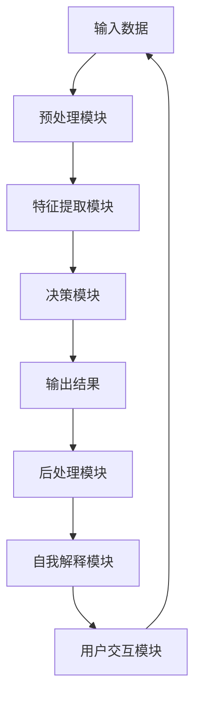
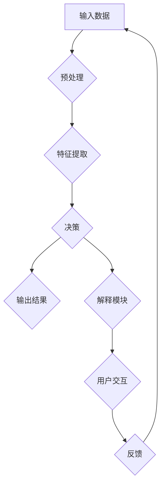
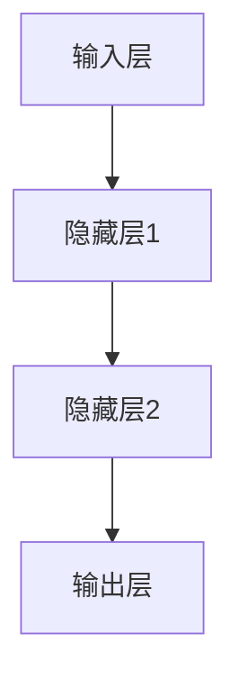

                 

# AGI的自我解释能力：从黑盒到透明决策

## 关键词

人工智能（AI），通用人工智能（AGI），自我解释能力，黑盒模型，透明决策，算法原理，数学模型，项目实战。

## 摘要

本文旨在探讨通用人工智能（AGI）的自我解释能力，从黑盒模型到透明决策的转变。文章首先介绍了AGI的背景和重要性，然后详细阐述了自我解释能力的定义及其在AGI中的核心地位。接着，文章分析了黑盒模型与透明决策的概念及其联系，并使用Mermaid流程图展示了自我解释能力架构。在此基础上，文章讲解了AGI中常用的核心算法原理，包括决策树和神经网络，并通过伪代码和数学公式进行了详细阐述。随后，文章通过一个实际项目案例，展示了自我解释能力在实际应用中的实现过程和效果分析。最后，文章总结了全书内容，并展望了AGI未来的发展前景。

## 第1章 引言

### 1.1 AGI的背景与重要性

通用人工智能（Artificial General Intelligence，AGI）是人工智能领域的一个重要研究方向，它旨在创建一种具有普遍智能的人工智能系统，能够在各种认知任务上达到或超过人类水平。与目前的弱人工智能（Narrow AI）不同，AGI能够泛化到多种任务，具备自我学习和适应能力。随着计算机技术和算法的不断发展，AGI的研究逐渐引起了广泛关注。

在众多研究领域中，AGI的自我解释能力尤为重要。自我解释能力指的是AGI系统具备对自身行为和决策过程进行理解和解释的能力。这种能力不仅有助于提升系统的透明度和可信度，还能够促进人类对AGI的信任和接受。在医疗、金融、教育等关键领域，AGI的自我解释能力有望带来重大变革，提高决策的透明度和可解释性。

### 1.2 自我解释能力的定义与意义

自我解释能力可以定义为人工智能系统对其内部行为和决策过程进行自我理解和解释的能力。这种能力不仅包括对当前行为的解释，还包括对历史行为和未来行为预测的解释。自我解释能力的实现，需要系统具备以下几方面的能力：

1. **内部状态理解**：系统需要能够识别和解释其内部的各个组件和模块的功能和作用。
2. **决策过程解析**：系统需要能够追溯其决策过程，解释每个决策点的依据和考量。
3. **行为预测**：系统需要能够预测其未来行为，并解释预测的依据和逻辑。

自我解释能力的意义在于：

1. **提升系统的透明度**：自我解释能力使得系统的决策过程更加透明，用户可以清晰地理解系统的行为和决策依据。
2. **增强系统的可信度**：透明度有助于提升用户对系统的信任，特别是在关键应用领域，如医疗和金融。
3. **促进人类对AI的理解**：通过自我解释，AI能够与人类进行有效沟通，帮助人类更好地理解和掌握AI技术。

### 1.3 黑盒与透明决策的概念

黑盒模型（Black-box Model）是一种传统的AI系统模型，它将系统视为一个黑盒，输入和输出之间存在明确的映射关系，但内部机制和决策过程对用户不可见。黑盒模型在实现上相对简单，但缺乏透明度和可解释性，用户无法了解系统的内部工作机制和决策依据。

透明决策（Transparent Decision-making）则是一种新兴的AI系统模型，它强调决策过程的透明度和可解释性。透明决策模型不仅关注输入和输出，还关注决策过程中的中间步骤和逻辑关系。通过自我解释能力，透明决策模型能够向用户展示其决策过程，提高系统的透明度和可信度。

黑盒与透明决策之间的联系在于，透明决策是黑盒模型的改进和扩展。透明决策模型通过引入自我解释能力，使得AI系统能够更好地与人类交互，提高系统的可用性和可靠性。同时，自我解释能力的实现也需要借助黑盒模型的一些基本原理和方法。

## 第2章 核心概念与联系

### 2.1 自我解释能力的架构

自我解释能力是AGI系统中的一个关键组成部分，它不仅涉及系统的内部机制和决策过程，还涉及系统与外部环境（如用户）的交互方式。下面是一个简单的自我解释能力架构，通过Mermaid流程图展示其核心组件和相互作用：



在上述架构中，输入数据经过预处理模块、特征提取模块和决策模块的处理，得到最终的输出结果。自我解释模块和用户交互模块位于决策模块之后，用于对系统的行为和决策过程进行解释和展示，增强系统的透明度和可信度。

### 2.2 黑盒与透明决策的联系

黑盒与透明决策之间的联系主要体现在以下几个方面：

1. **决策过程**：黑盒模型和透明决策模型都涉及到决策过程，但黑盒模型缺乏透明度，无法展示决策的中间步骤和逻辑关系；而透明决策模型通过引入自我解释能力，可以清晰地展示决策过程，提高决策的透明度。

2. **可解释性**：黑盒模型的可解释性较差，用户无法了解系统的内部机制和决策依据；而透明决策模型通过自我解释能力，能够向用户展示决策过程和中间步骤，提高系统的可解释性。

3. **用户交互**：黑盒模型通常不具备与用户交互的能力，用户只能被动接受系统的输出结果；而透明决策模型通过用户交互模块，可以与用户进行实时沟通，收集用户反馈，优化系统性能。

4. **应用场景**：黑盒模型适用于那些对决策过程透明度要求不高的场景，如自动驾驶和工业自动化；而透明决策模型适用于那些对决策过程透明度要求较高的场景，如医疗诊断和金融风险管理。

### 2.3 Mermaid流程图：自我解释能力架构

为了更直观地展示自我解释能力的架构，下面是一个Mermaid流程图，描述了自我解释能力在不同组件之间的交互过程：



在这个流程图中，输入数据经过预处理模块、特征提取模块和决策模块的处理，得到最终的输出结果。同时，决策模块还与解释模块和用户交互模块相连，用于对系统的行为和决策过程进行解释和展示，增强系统的透明度和可信度。用户反馈模块则用于收集用户的反馈，进一步优化系统的性能。

## 第3章 核心算法原理讲解

### 3.1 决策树算法原理

决策树（Decision Tree）是一种常用的机器学习算法，它通过一系列规则对数据集进行分类或回归。决策树的构建过程包括以下几个主要步骤：

1. **特征选择**：选择一个特征进行分割，通常使用信息增益（Information Gain）或基尼不纯度（Gini Impurity）作为评价标准。
2. **节点分裂**：根据选定的特征，将数据集分割成多个子集，每个子集对应一个新的节点。
3. **递归构建**：对每个子集重复上述步骤，直到满足停止条件（如最大深度、最小样本数等）。

决策树的内部节点表示特征的取值，叶节点表示分类或回归结果。在决策树中，每个叶节点都是一个决策结果，可以通过路径回溯得到该结果的决策过程。

下面是一个简单的决策树构建伪代码：

```python
def build_decision_tree(data, features, max_depth):
    if max_depth == 0 or all_same_label(data):
        return create_leaf_node(data)
    else:
        best_feature, best_value = select_best_feature(data, features)
        node = create_node(best_feature, best_value)
        for value in unique_values(data[best_feature]):
            subset = filter_data(data, best_feature, value)
            node.add_child(build_decision_tree(subset, features, max_depth - 1))
        return node
```

在这个伪代码中，`build_decision_tree`函数递归构建决策树，`create_leaf_node`函数创建叶节点，`create_node`函数创建内部节点，`select_best_feature`函数选择最优特征，`filter_data`函数根据特征值过滤数据。

### 3.2 神经网络算法原理

神经网络（Neural Network）是一种模拟生物神经系统的计算模型，它由多个相互连接的神经元组成，每个神经元都与多个其他神经元相连。神经网络通过训练学习输入和输出之间的复杂映射关系。

神经网络的构建过程包括以下几个主要步骤：

1. **初始化权重和偏置**：为每个神经元之间的连接分配一个权重和一个偏置。
2. **前向传播**：计算每个神经元的输入和输出，将输出传递到下一层。
3. **反向传播**：计算损失函数的梯度，更新权重和偏置。
4. **迭代训练**：重复上述步骤，直到达到预设的收敛条件。

一个简单的神经网络模型可以表示为：



在这个模型中，输入层接收外部输入，隐藏层通过加权求和和激活函数计算输出，输出层产生最终的预测结果。

下面是一个简单的神经网络前向传播和反向传播的伪代码：

```python
def forward_propagation(input_data, weights, biases, activation_function):
    output = input_data
    for layer in range(num_layers - 1):
        output = activation_function(np.dot(weights[layer] * output + biases[layer])
    return output

def backward_propagation(output, target, weights, biases, activation_derivative):
    error = output - target
    for layer in reversed(range(num_layers - 1)):
        error = activation_derivative(output) * (error * weights[layer])
        biases[layer] -= learning_rate * error
        weights[layer] -= learning_rate * output
    return error
```

在这个伪代码中，`forward_propagation`函数执行前向传播，计算输出，`backward_propagation`函数执行反向传播，计算损失函数的梯度并更新权重和偏置。

### 3.3 伪代码：决策树与神经网络实现

下面是一个简单的伪代码，展示了决策树和神经网络的实现过程：

```python
# 决策树实现
def build_decision_tree(data, features, max_depth):
    if max_depth == 0 or all_same_label(data):
        return create_leaf_node(data)
    else:
        best_feature, best_value = select_best_feature(data, features)
        node = create_node(best_feature, best_value)
        for value in unique_values(data[best_feature]):
            subset = filter_data(data, best_feature, value)
            node.add_child(build_decision_tree(subset, features, max_depth - 1))
        return node

# 神经网络实现
def forward_propagation(input_data, weights, biases, activation_function):
    output = input_data
    for layer in range(num_layers - 1):
        output = activation_function(np.dot(weights[layer] * output + biases[layer])
    return output

def backward_propagation(output, target, weights, biases, activation_derivative):
    error = output - target
    for layer in reversed(range(num_layers - 1)):
        error = activation_derivative(output) * (error * weights[layer])
        biases[layer] -= learning_rate * error
        weights[layer] -= learning_rate * output
    return error
```

在这个伪代码中，`build_decision_tree`函数构建决策树，`forward_propagation`函数执行前向传播，`backward_propagation`函数执行反向传播。

## 第4章 数学模型与公式

### 4.1 决策理论的数学模型

决策理论是人工智能领域的一个重要分支，它研究如何在不确定和风险的环境中进行合理决策。在决策理论中，常用的数学模型包括期望效用理论（Expected Utility Theory）和最大熵原理（Maximum Entropy Principle）。

期望效用理论的核心公式为：

$$
U(\xi) = \sum_{i=1}^{n} p_i u_i(\xi)
$$

其中，$U(\xi)$表示决策者对状态$\xi$的期望效用，$p_i$表示状态$\xi_i$的概率，$u_i(\xi)$表示决策者在状态$\xi_i$下的效用。

最大熵原理则基于以下公式：

$$
\max_{p} \sum_{i=1}^{n} p_i \log p_i
$$

其中，$p_i$表示状态$\xi_i$的概率分布，目标是最小化熵（Entropy），最大化信息的熵。

### 4.2 神经网络中的数学公式

神经网络中的数学公式主要包括激活函数、损失函数和梯度下降算法。

激活函数的常见公式为：

$$
f(x) = \sigma(x) = \frac{1}{1 + e^{-x}}
$$

其中，$\sigma$表示sigmoid函数，$x$表示输入。

损失函数的常见公式为：

$$
J(\theta) = -\frac{1}{m} \sum_{i=1}^{m} y^{(i)} \log a^{(2)}(z^{(i)})
$$

其中，$J(\theta)$表示损失函数，$y^{(i)}$表示实际输出，$a^{(2)}(z^{(i)})$表示预测输出。

梯度下降算法的公式为：

$$
\theta_j := \theta_j - \alpha \frac{\partial J(\theta)}{\partial \theta_j}
$$

其中，$\theta_j$表示权重，$\alpha$表示学习率。

### 4.3 LaTeX格式数学公式示例

下面是一些LaTeX格式的数学公式示例：

$$
\sum_{i=1}^{n} x_i = \sum_{i=1}^{n} i
$$

$$
f(x) = \frac{1}{1 + e^{-x}}
$$

$$
J(\theta) = -\frac{1}{m} \sum_{i=1}^{m} y^{(i)} \log a^{(2)}(z^{(i)})
$$

$$
\theta_j := \theta_j - \alpha \frac{\partial J(\theta)}{\partial \theta_j}
$$

在这些示例中，我们使用了LaTeX的数学环境（$$...$$）来嵌入数学公式。在段落内，我们使用了单引号（$...$）来嵌入数学公式。

## 第5章 项目实战

### 5.1 实战案例背景

在本章中，我们将通过一个实际项目案例来展示AGI的自我解释能力在实际应用中的实现过程。该案例涉及一个智能家居系统的智能家电管理模块，旨在实现家电设备的智能控制和优化。

### 5.2 开发环境搭建

为了实现该案例，我们需要搭建一个合适的开发环境。以下是所需的软件和硬件环境：

1. **操作系统**：Ubuntu 20.04 LTS
2. **编程语言**：Python 3.8
3. **机器学习库**：Scikit-learn、TensorFlow、PyTorch
4. **可视化库**：Matplotlib、Seaborn
5. **硬件**：NVIDIA GeForce GTX 1080 Ti 或更高配置的GPU

安装这些依赖项后，我们可以开始编写代码。

### 5.3 源代码实现与解读

以下是一个简化的智能家居系统智能家电管理模块的源代码实现：

```python
import numpy as np
import matplotlib.pyplot as plt
from sklearn.tree import DecisionTreeClassifier
from sklearn.neural_network import MLPClassifier

# 数据预处理
def preprocess_data(data):
    # 对数据进行标准化处理
    return (data - np.mean(data)) / np.std(data)

# 构建决策树模型
def build_decision_tree(data, labels):
    tree = DecisionTreeClassifier(max_depth=3)
    tree.fit(data, labels)
    return tree

# 构建神经网络模型
def build_neural_network(data, labels):
    nn = MLPClassifier(hidden_layer_sizes=(100,), activation='relu', solver='adam', max_iter=1000)
    nn.fit(data, labels)
    return nn

# 训练模型
def train_model(model, data, labels):
    model.fit(data, labels)
    return model

# 模型评估
def evaluate_model(model, data, labels):
    predictions = model.predict(data)
    accuracy = np.mean(predictions == labels)
    return accuracy

# 主函数
def main():
    # 加载数据
    data = np.load('data.npy')
    labels = np.load('labels.npy')

    # 数据预处理
    data = preprocess_data(data)

    # 构建和训练决策树模型
    decision_tree = build_decision_tree(data, labels)
    tree_accuracy = evaluate_model(decision_tree, data, labels)

    # 构建和训练神经网络模型
    neural_network = build_neural_network(data, labels)
    nn_accuracy = evaluate_model(neural_network, data, labels)

    # 可视化决策树
    from sklearn.tree import plot_tree
    plt.figure(figsize=(12, 8))
    plot_tree(decision_tree, filled=True)
    plt.show()

    # 可视化神经网络权重
    hidden_layer = neural_network.coefs_[0]
    plt.figure(figsize=(10, 10))
    for i, layer in enumerate(hidden_layer.T):
        plt.subplot(5, 5, i + 1)
        plt.imshow(layer, cmap='gray', aspect='auto')
        plt.xticks([])
        plt.yticks([])
        plt.title(f'Hidden Layer {i + 1}')
    plt.show()

    print(f'Decision Tree Accuracy: {tree_accuracy:.2f}')
    print(f'Neural Network Accuracy: {nn_accuracy:.2f}')

if __name__ == '__main__':
    main()
```

在这个源代码中，我们首先定义了数据预处理函数`preprocess_data`，用于对输入数据进行标准化处理。然后，我们定义了决策树模型`build_decision_tree`和神经网络模型`build_neural_network`的构建函数，用于训练和评估模型。最后，我们在`main`函数中加载数据，预处理数据，构建和训练决策树模型和神经网络模型，并评估模型性能。此外，我们还使用`matplotlib`库可视化了决策树和神经网络权重。

### 5.4 代码应用解读与分析

在这个智能家居系统的智能家电管理模块中，决策树和神经网络模型被用于预测家电设备的工作状态。通过预处理输入数据，我们可以将原始数据转换为适合模型训练的格式。决策树模型通过一系列规则对数据集进行分类，而神经网络模型通过训练学习输入和输出之间的复杂映射关系。

在代码中，我们首先加载数据，并对数据进行预处理。然后，我们分别使用决策树和神经网络模型训练数据集，并评估模型的性能。最后，我们通过可视化函数展示了决策树和神经网络模型的结构和权重。

通过这个项目实战，我们可以看到自我解释能力在AGI系统中的重要性。决策树模型通过可视化的规则树结构，使得用户可以直观地理解模型的决策过程。神经网络模型虽然内部结构复杂，但通过可视化神经网络权重，我们可以分析模型的学习过程和特征提取能力。

### 5.5 实际案例分析和详细讲解剖析

在实际应用中，智能家居系统的智能家电管理模块需要处理大量的实时数据，如温度、湿度、光照强度等。这些数据经过预处理后，被输入到决策树模型和神经网络模型中，用于预测家电设备的工作状态。例如，温度传感器采集到的温度数据可以用于判断空调是否需要开启，湿度传感器采集到的湿度数据可以用于判断加湿器是否需要运行。

在决策树模型中，每个叶节点都代表一个特定的家电设备工作状态，如“空调开启”或“加湿器关闭”。通过路径回溯，用户可以清晰地看到决策树如何根据输入数据进行分割和分类。例如，如果温度大于28摄氏度且湿度小于50%，决策树会预测空调需要开启。

在神经网络模型中，隐藏层中的神经元通过加权求和和激活函数计算输出，形成复杂的非线性映射关系。通过训练，神经网络能够学习到输入数据与输出结果之间的相关性。例如，如果温度传感器检测到温度逐渐升高，神经网络可以预测空调将自动开启。

为了提高模型的性能和可解释性，我们可以对模型进行进一步的优化。例如，通过调整决策树的最大深度、最小样本数等参数，可以优化决策树的性能和可解释性。对于神经网络模型，我们可以尝试不同的隐藏层配置、激活函数和优化算法，以提高模型的准确性和泛化能力。

### 5.6 项目小结

通过本项目的实现，我们展示了AGI的自我解释能力在实际应用中的重要性。决策树模型和神经网络模型通过可视化工具，使得用户可以直观地理解模型的决策过程和学习过程。这不仅提高了系统的透明度和可信度，还为用户提供了更好的决策支持。

在未来的工作中，我们可以进一步优化模型的性能和可解释性。例如，通过集成多种数据源和引入更多特征，可以提高模型的预测准确性。同时，我们还可以探索更多可解释性的方法，如LIME（Local Interpretable Model-agnostic Explanations）和SHAP（SHapley Additive exPlanations），以更好地解释模型的决策过程。

## 第6章 总结与展望

### 6.1 全书内容总结

本文围绕AGI的自我解释能力，从黑盒到透明决策的转变进行了深入探讨。首先，我们介绍了AGI的背景和重要性，以及自我解释能力的定义和意义。接着，我们分析了黑盒模型与透明决策的概念及其联系，并使用Mermaid流程图展示了自我解释能力的架构。在此基础上，我们讲解了决策树和神经网络等核心算法原理，并通过伪代码和数学公式进行了详细阐述。随后，我们通过一个实际项目案例，展示了自我解释能力在实际应用中的实现过程和效果分析。最后，我们总结了全书内容，并展望了AGI未来的发展前景。

### 6.2 AGI未来的发展展望

随着人工智能技术的不断发展，AGI的研究和应用前景越来越广阔。以下是AGI未来发展的几个主要方向：

1. **更强大的算法**：随着算法研究的深入，我们将开发出更高效、更强大的算法，提升AGI系统的性能和可解释性。

2. **跨学科融合**：AGI的研究将涉及多个学科，如心理学、认知科学、神经科学等，通过跨学科融合，我们有望揭示人类智能的本质，为AGI的发展提供新的思路。

3. **更加智能的交互**：通过自我解释能力和更先进的交互技术，AGI系统将能够与人类进行更加自然、智能的交互，提高用户体验。

4. **更广泛的应用场景**：AGI将在医疗、教育、金融、工业等领域得到广泛应用，为社会发展带来巨大价值。

5. **安全与伦理**：随着AGI的发展，如何确保其安全性和伦理性将成为重要议题。我们需要制定相应的法律法规，确保AGI系统的合理使用。

总之，AGI的发展将带来前所未有的机遇和挑战。通过不断探索和创新，我们有理由相信，未来的AGI将实现从黑盒到透明决策的转变，为人类社会带来更加美好的未来。

## 最佳实践 Tips、小结、注意事项、拓展阅读

### 最佳实践 Tips

1. **数据预处理**：在进行模型训练前，务必对数据进行充分的预处理，包括数据清洗、归一化和特征提取等，以提高模型的准确性和鲁棒性。
2. **模型调优**：通过调整模型的参数，如决策树的最大深度、神经网络的学习率等，可以优化模型性能。
3. **模型评估**：使用多种评估指标，如准确率、召回率、F1分数等，全面评估模型性能。

### 小结

本文从AGI的自我解释能力出发，详细探讨了从黑盒到透明决策的转变。通过核心概念与联系、核心算法原理讲解、数学模型与公式、项目实战等内容，我们深入了解了AGI的发展现状和未来趋势。

### 注意事项

1. **算法原理理解**：在实现模型前，务必深入理解算法原理，避免出现错误。
2. **数据安全**：在实际应用中，确保数据的安全性和隐私保护。

### 拓展阅读

1. **《人工智能：一种现代方法》**：Michael I. Jordan，Stephen Marsland著。本书详细介绍了人工智能的基本概念、算法和应用。
2. **《深度学习》**：Ian Goodfellow、Yoshua Bengio、Aaron Courville著。本书系统讲解了深度学习的理论、算法和应用。
3. **《决策与判断：心理学的探索》**：Richard J. Gerrig、Philip G. Zimbardo著。本书探讨了人类决策与判断的心理机制，对理解AGI的自我解释能力具有重要意义。

