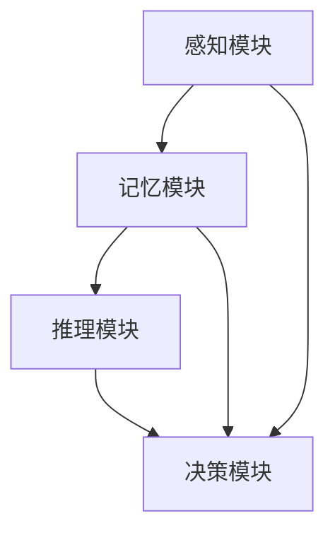

                 


### 第1章：引言

在人类智能与人工智能（AI）的研究领域，我们不断探索如何使机器具备类似人类的认知能力，从而实现通用人工智能（AGI）。本章将为我们对AGI的认知发展理论和实现路径的研究奠定基础。

**1.1 人类智能的复杂性**

人类智能是一种高度复杂的认知系统，它能够通过感知、理解、学习、记忆、推理、决策和语言交流等多种能力来适应和改变环境。人类的认知能力不仅包括感知外部世界的信息，还涉及处理内部思维过程，如情感、意识和自我认知等。

**1.2 AGI的定义与目标**

通用人工智能（AGI）是一种能够像人类一样在各种认知任务上表现卓越的人工智能。AGI的目标不仅仅是执行单一的任务，如语音识别、图像分类或自然语言处理，而是能够在多个领域和任务中表现出人类的智能水平，具备理解、推理、学习、适应和自我提升的能力。

**1.3 AGI的重要性与挑战**

AGI的研究对于推动人工智能技术的发展具有重要意义。它不仅可以带来技术创新，还可能对社会、经济和文化产生深远影响。然而，实现AGI也面临着巨大的技术挑战，包括如何模拟人类认知过程的复杂性，如何设计出能够自主学习、适应和优化自身能力的人工智能系统等。

在接下来的章节中，我们将深入探讨AGI的认知发展理论，分析人类智能的核心能力，并探讨基于这些理论的AGI架构设计和实现路径。

---

### 第2章：认知科学基础

#### 2.1 认知科学概述

认知科学是一门跨学科的学科，它试图通过综合心理学、神经科学、计算机科学和哲学等多学科知识，来理解人类认知的过程和机制。认知科学的起源可以追溯到20世纪中叶，随着认知心理学和计算机科学的兴起，认知科学逐渐发展成为一门独立的学科。

认知科学的主要研究领域包括感知、记忆、学习、思维和语言等。通过研究这些领域，认知科学家试图揭示人类大脑如何处理信息，以及这些处理过程如何影响我们的行为和决策。

#### 2.2 认知过程的层次结构

认知过程可以分成多个层次，每个层次都有其特定的功能和目标。这些层次从低级到高级大致包括以下几个方面：

1. **感知**：这是认知过程的第一步，涉及从环境中接收信息，并将其转化为大脑可以理解的形式。
2. **感知觉**：感知进一步细化，包括视觉、听觉、触觉、味觉和嗅觉等，这些感知觉帮助我们识别和分类外部刺激。
3. **记忆**：记忆使我们能够存储和处理信息，分为短期记忆和长期记忆两种类型。
4. **知识表示**：知识表示是关于如何在大脑中存储和组织信息的问题，包括符号表示、图式和概念等。
5. **推理**：推理是通过逻辑推理、类比或归纳等方式，从已知信息推导出新信息的认知过程。
6. **决策**：决策是在多种选择中做出最优决策的过程，它涉及风险评估、偏好评估和目标设定。

这些层次之间并不是完全隔离的，它们相互联系、相互影响，共同构成了一个复杂的认知系统。

#### 2.3 认知模型与算法

认知模型是试图模拟人类认知过程的计算机模型。常见的认知模型包括：

1. **图灵机**：图灵机是认知科学中最基本的模型之一，它由逻辑门和存储器组成，用于模拟计算过程。
2. **神经网络**：神经网络通过模拟人脑神经元之间的连接和相互作用，来处理复杂的计算任务。
3. **产生式系统**：产生式系统使用规则来表示知识和推理过程，它由一组产生式规则和条件组成。

认知算法是基于这些模型实现的具体算法。例如：

1. **反向传播算法**：这是一种用于训练神经网络的算法，通过不断调整网络中的权重，使网络输出更接近期望值。
2. **决策树算法**：决策树通过一系列条件测试来做出决策，它常用于分类问题。
3. **强化学习算法**：强化学习通过奖励和惩罚机制来训练智能体，使其能够学习如何在复杂环境中做出最优决策。

通过这些认知模型和算法，我们可以更好地理解人类认知的过程和机制，为设计更智能的人工智能系统提供理论基础。

---

### 第3章：人类智能的核心能力

人类智能的核心能力包括感知与感知觉、记忆与知识表示以及推理与决策。这些能力共同构成了人类适应复杂环境的基础。

#### 3.1 感知与感知觉

感知是人类智能的起点，它涉及接收和处理外部世界的信息。感知觉则进一步细化，包括视觉、听觉、触觉、味觉和嗅觉等。以下是感知与感知觉的基本原理：

1. **感知的基本原理**：感知是基于感官接收外部刺激，并通过大脑进行处理和理解的过程。感知过程可以分为三个阶段：感受器阶段、传入神经阶段和大脑处理阶段。

2. **感知觉的分类**：
   - **视觉**：视觉感知使我们能够识别形状、颜色和运动等信息。视觉处理涉及从视网膜到大脑皮层的复杂神经网络。
   - **听觉**：听觉感知使我们能够识别声音的频率、强度和节奏。听觉处理包括耳蜗、听觉通路和大脑听觉皮层。
   - **触觉**：触觉感知使我们能够感知物体的质地、硬度、温度等。触觉处理涉及皮肤的感受器、传入神经和大脑的触觉皮层。
   - **味觉和嗅觉**：味觉和嗅觉感知使我们能够识别食物和气味的特性。味觉处理涉及味蕾、传入神经和大脑的味觉皮层；嗅觉处理涉及嗅觉感受器、传入神经和大脑的嗅觉皮层。

#### 3.2 记忆与知识表示

记忆是人类智能的重要基础，它使我们能够存储和处理信息。记忆可以分为短期记忆和长期记忆两种类型。

1. **记忆的基本原理**：
   - **短期记忆**：短期记忆是临时存储和加工信息的记忆系统，容量有限，持续时间较短。短期记忆涉及大脑的神经元活动，通过神经元之间的联系来保持信息。
   - **长期记忆**：长期记忆是长期存储和保留信息的记忆系统，容量较大，持续时间较长。长期记忆涉及大脑中的海马体和神经元网络的持久改变。

2. **知识表示的方法**：
   - **符号表示**：符号表示使用符号和文字来表示知识，如自然语言和符号逻辑。
   - **图式表示**：图式表示使用结构和关系来表示知识，如图形、网络和图。
   - **概念表示**：概念表示使用抽象概念和分类来表示知识，如语义网络和本体论。

知识表示的方法旨在使计算机系统能够理解、存储和利用人类知识。

#### 3.3 推理与决策

推理是人类智能的关键能力，它使我们能够从已知信息推导出新信息。推理可以分为两种类型：演绎推理和归纳推理。

1. **推理的基本原理**：
   - **演绎推理**：演绎推理是从一般到特殊的推理过程，它基于前提和逻辑规则推导出结论。例如，所有人都是凡人（前提），苏格拉底是人（前提），因此苏格拉底是凡人（结论）。
   - **归纳推理**：归纳推理是从特殊到一般的推理过程，它基于多个特定实例推导出一般规律。例如，观察多次太阳从东方升起，推断出太阳每天从东方升起。

2. **决策的基本原理**：
   - **决策理论**：决策理论是一种基于概率和效用理论的方法，用于在不确定性和竞争环境中做出最优决策。
   - **决策模型**：决策模型包括收益矩阵、决策树和贝叶斯网络等，用于分析和优化决策过程。

推理和决策能力使我们能够应对复杂环境，做出合理和明智的决策。

通过深入了解人类智能的核心能力，我们可以更好地理解人类认知的复杂性，并为设计更智能的人工智能系统提供启示。

---

### 第4章：基于认知科学的AGI架构设计

实现通用人工智能（AGI）的关键在于设计一个能够模拟人类认知过程的系统架构。这一章将讨论AGI系统的总体设计、核心模块以及交互机制。

#### 4.1 AGI系统的总体设计

AGI系统的设计需要考虑以下几个方面：

1. **模块化设计**：AGI系统应该由多个功能模块组成，每个模块负责不同的认知任务，如感知、记忆、推理和决策等。这种模块化设计有助于系统的可维护性和可扩展性。
2. **层次化结构**：AGI系统应该采用层次化结构，从低级到高级依次包含感知层、记忆层、推理层和决策层等。这种层次化结构有助于实现复杂认知功能的分层次处理。
3. **动态适应**：AGI系统应该具备动态适应能力，能够根据环境和任务的变化调整自身的结构和行为。

#### 4.2 AGI的核心模块

AGI的核心模块包括感知模块、记忆模块、推理模块和决策模块。以下是这些模块的具体设计：

1. **感知模块**：
   - **功能**：感知模块负责接收外部世界的各种信息，如视觉、听觉、触觉等。
   - **设计**：感知模块采用多模态感知技术，将不同类型的感知信息进行整合和处理，形成一个统一的信息流。
   - **算法**：感知模块使用深度学习算法，如卷积神经网络（CNN）和循环神经网络（RNN），来处理感知信息。

2. **记忆模块**：
   - **功能**：记忆模块负责存储和管理各种信息，包括感知信息、知识和经验。
   - **设计**：记忆模块采用分布式存储结构，如神经网络的存储单元和图数据库，来存储和管理信息。
   - **算法**：记忆模块使用生成对抗网络（GAN）和强化学习算法，来优化信息的存储和检索。

3. **推理模块**：
   - **功能**：推理模块负责根据已知信息推导出新信息，包括逻辑推理、类比推理和归纳推理等。
   - **设计**：推理模块采用符号推理和计算推理相结合的方法，使用符号逻辑和概率图模型来处理推理任务。
   - **算法**：推理模块使用逻辑推理算法、贝叶斯网络和决策树算法，来执行复杂的推理任务。

4. **决策模块**：
   - **功能**：决策模块负责在多个选项中做出最优决策。
   - **设计**：决策模块采用多目标决策和情景适应方法，使用收益矩阵和决策树来评估和选择最佳行动。
   - **算法**：决策模块使用强化学习算法和遗传算法，来优化决策过程。

#### 4.3 AGI的交互机制

AGI的交互机制是指AGI系统与人类或其他系统进行交互的方法。以下是几种常见的交互机制：

1. **自然语言交互**：自然语言交互使AGI系统能够理解和使用自然语言与人类进行交流。这包括语音识别、语音合成和自然语言理解等技术。
2. **图形用户界面**：图形用户界面（GUI）使AGI系统能够通过图形界面与用户进行交互，提供直观和易用的操作界面。
3. **自动化决策支持**：自动化决策支持使AGI系统能够在复杂环境中自动做出决策，辅助人类完成任务。

通过这些核心模块和交互机制的设计，AGI系统能够实现类似人类的认知功能，从而在各个领域展现出强大的智能能力。

---

### 第5章：AGI的关键技术

实现通用人工智能（AGI）的关键在于掌握一系列先进的技术，这些技术涵盖了机器学习与深度学习、自然语言处理和计算机视觉等关键领域。本章将详细介绍这些技术的基本原理和应用。

#### 5.1 机器学习与深度学习

机器学习和深度学习是AGI实现的核心技术。机器学习是一种使计算机系统能够从数据中学习并做出预测或决策的方法，而深度学习则是机器学习的一种特殊形式，它依赖于神经网络结构进行学习。

1. **机器学习的基本原理**：
   - **监督学习**：监督学习是一种从标注数据中学习的方法，输出是已知的。常见的监督学习方法包括线性回归、逻辑回归和支持向量机（SVM）等。
   - **无监督学习**：无监督学习是从未标注数据中学习的方法，输出是未知的。常见的无监督学习方法包括聚类、降维和异常检测等。
   - **强化学习**：强化学习是一种通过奖励机制学习的方法，系统通过与环境的交互来学习最优策略。

2. **深度学习的基本原理**：
   - **卷积神经网络（CNN）**：CNN是一种用于处理图像数据的神经网络，通过卷积操作提取图像特征。
   - **循环神经网络（RNN）**：RNN是一种用于处理序列数据的神经网络，通过循环结构处理时间序列信息。
   - **生成对抗网络（GAN）**：GAN是一种用于生成数据的神经网络，由生成器和判别器组成，通过对抗训练生成逼真的数据。

3. **应用实例**：
   - **图像识别**：深度学习在图像识别领域取得了显著成果，如人脸识别、物体检测和图像分类等。
   - **语音识别**：深度学习在语音识别领域也取得了突破性进展，使得自动语音识别系统变得更加准确和实用。
   - **自然语言处理**：深度学习在自然语言处理领域应用于文本分类、情感分析和机器翻译等任务。

#### 5.2 自然语言处理

自然语言处理（NLP）是使计算机理解和生成人类语言的技术，它是AGI实现的重要组成部分。

1. **NLP的基本任务**：
   - **文本分类**：文本分类是将文本数据分类到预定义的类别中，如垃圾邮件过滤和情感分析等。
   - **情感分析**：情感分析是判断文本表达的情感倾向，如正面、负面或中立等。
   - **机器翻译**：机器翻译是将一种语言的文本翻译成另一种语言，如谷歌翻译和百度翻译等。
   - **问答系统**：问答系统是回答用户提出的问题，如聊天机器人和语音助手等。

2. **NLP的关键技术**：
   - **词向量**：词向量是将词汇映射到高维向量空间的方法，如Word2Vec和GloVe等。
   - **序列模型**：序列模型是处理序列数据的方法，如RNN和Transformer等。
   - **预训练语言模型**：预训练语言模型是在大规模语料库上进行预训练，如BERT和GPT等。

3. **应用实例**：
   - **智能客服**：智能客服系统通过自然语言处理技术理解用户的问题，并自动提供合适的回答。
   - **智能推荐**：智能推荐系统利用自然语言处理技术分析用户的历史行为和偏好，提供个性化的推荐。

#### 5.3 计算机视觉

计算机视觉是使计算机理解和处理图像和视频的技术，它在AGI中具有重要应用。

1. **计算机视觉的基本任务**：
   - **目标检测**：目标检测是识别图像中的目标和位置，如行人检测和车辆检测等。
   - **图像分类**：图像分类是将图像分类到预定义的类别中，如猫和狗的区分等。
   - **图像分割**：图像分割是将图像划分为多个区域，如人脸分割和语义分割等。

2. **计算机视觉的关键技术**：
   - **卷积神经网络（CNN）**：CNN是处理图像数据的主要方法，通过多层卷积和池化操作提取图像特征。
   - **深度学习模型**：深度学习模型如ResNet和YOLO等，在计算机视觉任务中取得了显著成果。
   - **图像增强和预处理**：图像增强和预处理是提高计算机视觉系统性能的重要手段，如数据增强和去噪等。

3. **应用实例**：
   - **自动驾驶**：自动驾驶系统通过计算机视觉技术识别道路标志、行人和车辆，实现自动驾驶功能。
   - **医疗影像分析**：医疗影像分析系统利用计算机视觉技术对医学图像进行分析，辅助医生进行诊断。

通过掌握机器学习与深度学习、自然语言处理和计算机视觉等关键技术，我们可以为实现通用人工智能（AGI）奠定坚实的基础。

---

### 第6章：从传统AI到AGI的转型

传统人工智能（AI）在过去的几十年里取得了显著的进展，但其局限性也逐渐显现。为了实现通用人工智能（AGI），我们需要对传统AI进行转型，引入新的理念和技术。

#### 6.1 传统AI的局限性

传统AI主要依赖于特定领域的数据和规则，其表现通常局限于特定任务。以下是传统AI的一些主要局限性：

1. **任务限制**：传统AI系统通常只能执行单一任务，如图像分类、语音识别或自然语言处理等。它们缺乏跨领域的通用性。
2. **数据依赖**：传统AI系统需要大量标注数据来训练，而这些数据往往难以获取和标注。数据质量和数量对AI系统的性能有重要影响。
3. **缺乏自主性**：传统AI系统缺乏自主学习和适应新环境的能力。它们需要人类提供明确的规则和数据，无法自主学习新知识和技能。
4. **缺乏解释性**：传统AI系统通常采用复杂的模型和算法，其内部决策过程难以解释和理解。这限制了AI系统的可信度和可解释性。

#### 6.2 AGI的转型路径

为了实现AGI，我们需要采取以下转型路径：

1. **强化自主学习**：AGI需要具备自主学习的能力，通过不断从环境中学到新知识和技能，提高自身的能力。这包括引入强化学习、元学习等自主学习技术。
2. **跨领域融合**：AGI需要能够在多个领域和任务中表现出色，实现跨领域的通用性。这需要将不同领域的知识和方法进行融合，构建一个多模态的AI系统。
3. **增强解释性**：AGI需要具备良好的可解释性，使人类能够理解和信任AI系统的决策过程。这需要开发新的解释性算法和模型，如基于规则的模型和可解释的深度学习模型。
4. **集成人类知识**：AGI需要能够利用人类知识，通过知识图谱、本体论等知识表示方法，将人类的先验知识集成到AI系统中。
5. **伦理和安全性**：在实现AGI的过程中，我们需要关注伦理和安全性问题，确保AGI系统的行为符合伦理规范，并对潜在的风险进行有效管理。

#### 6.3 AGI转型的挑战与机遇

AGI转型面临以下挑战：

1. **计算资源**：实现AGI需要大量的计算资源，包括高性能的计算机和大量的数据存储和处理能力。
2. **数据质量**：AGI系统需要高质量的数据来训练和学习，而数据的获取和标注过程往往复杂且耗时。
3. **算法创新**：现有的算法和技术可能不足以支持AGI的实现，需要不断进行算法创新和改进。
4. **伦理和法规**：AGI的伦理和法规问题需要引起重视，确保其发展符合社会伦理和法律法规。

然而，AGI转型也带来了许多机遇：

1. **技术创新**：AGI转型将推动人工智能技术的创新，产生新的算法、模型和应用。
2. **产业变革**：AGI有望带来产业变革，提高生产力、优化流程和创造新的商业模式。
3. **社会进步**：AGI有望解决许多社会问题，如医疗、教育、环境保护等，推动社会进步。

通过解决这些挑战和抓住机遇，我们可以实现从传统AI到AGI的转型，推动人工智能技术迈向新的高度。

---

### 第7章：AGI的应用与影响

通用人工智能（AGI）的应用前景广阔，将对多个领域产生深远影响。在本章中，我们将探讨AGI在医疗、教育和商业等领域的应用，并分析其优势和挑战。

#### 7.1 AGI在医疗领域的应用

AGI在医疗领域的应用潜力巨大，可以从诊断、治疗、康复和健康管理等各个方面提升医疗服务质量。

1. **诊断**：AGI系统可以利用深度学习和自然语言处理技术，分析医学影像、病理报告和患者病历，提供准确的诊断建议。例如，通过分析CT扫描图像，AGI系统可以早期检测出肺癌等疾病。
2. **治疗**：AGI可以帮助医生制定个性化的治疗方案。通过分析患者的历史数据和基因组信息，AGI系统可以推荐最适合的治疗方案，提高治疗效果。
3. **康复**：AGI可以设计个性化的康复计划，帮助患者更快地恢复健康。例如，通过分析患者的运动数据，AGI系统可以制定个性化的康复训练计划。
4. **健康管理**：AGI可以帮助患者进行自我健康管理，监测健康状况，并提供健康建议。例如，通过分析患者的日常行为和健康数据，AGI系统可以提醒患者保持健康的生活方式。

**优势**：AGI在医疗领域的应用可以提高诊断准确性、优化治疗方案和提升康复效果，从而提高医疗服务质量和效率。

**挑战**：医疗数据隐私和安全问题是AGI在医疗领域应用的主要挑战。此外，AGI系统的可靠性也需要得到充分验证。

#### 7.2 AGI在教育领域的应用

AGI在教育领域的应用可以改变传统教学模式，提供个性化学习体验，提高教育质量。

1. **个性化学习**：AGI可以根据学生的学习习惯、兴趣和能力，为其提供定制化的学习内容和教学方法。例如，通过分析学生的学习数据，AGI系统可以推荐适合的学习资源和练习。
2. **智能辅导**：AGI可以提供实时智能辅导，帮助学生解决学习难题。例如，通过自然语言处理技术，AGI系统可以回答学生的疑问，提供解题思路。
3. **教育资源优化**：AGI可以分析和优化教育资源的使用，提高教育资源的利用效率。例如，通过分析教育数据，AGI系统可以推荐最适合教师和学生使用的学习资源。
4. **教育评价**：AGI可以设计智能化的教育评价系统，对学生的学习效果进行全面评估。例如，通过分析学生的作业和考试数据，AGI系统可以提供详细的学习报告。

**优势**：AGI在教育领域的应用可以提供个性化学习体验、提高学习效率和评估准确性，从而提高教育质量。

**挑战**：教育数据的隐私保护和数据安全是AGI在教育领域应用的主要挑战。此外，如何确保AGI系统的公平性和透明性也是重要问题。

#### 7.3 AGI在商业领域的应用

AGI在商业领域的应用可以优化业务流程、提高决策效率和创造新的商业机会。

1. **智能客服**：AGI可以提供智能客服服务，通过自然语言处理和语音识别技术，自动解答客户问题，提高客户满意度和服务效率。
2. **智能推荐**：AGI可以根据用户的行为和偏好，提供个性化的推荐服务。例如，电商网站可以通过AGI系统推荐最适合用户的产品，提高销售额。
3. **风险管理**：AGI可以通过分析大量的历史数据和实时信息，识别潜在的风险，并提供风险控制建议。例如，金融机构可以通过AGI系统进行信用评估和风险预警。
4. **智能供应链**：AGI可以优化供应链管理，通过预测市场需求、优化库存和物流，提高供应链的效率和灵活性。

**优势**：AGI在商业领域的应用可以提高业务效率、降低运营成本和创造新的商业价值。

**挑战**：商业数据的隐私保护和数据安全是AGI在商业领域应用的主要挑战。此外，如何确保AGI系统的稳定性和可解释性也是重要问题。

通过在医疗、教育和商业等领域的应用，AGI有望带来深刻的变革，为社会发展和人类福祉做出重要贡献。

---

### 第8章：AGI的未来发展展望

通用人工智能（AGI）的未来发展充满了无限可能，将对科技、社会和经济产生深远的影响。以下是对AGI未来发展趋势、社会影响和伦理与安全挑战的展望。

#### 8.1 AGI的未来趋势

1. **技术融合**：AGI的发展将依赖于多种技术的融合，如机器学习、自然语言处理、计算机视觉和神经科学等。这些技术的不断进步将推动AGI系统性能的提升。
2. **自主学习**：未来的AGI系统将具备更强的自主学习能力，能够从大量数据中自动提取知识，不断优化自身性能。这将有助于实现更高效的学习和适应能力。
3. **多模态感知**：AGI系统将能够整合多种感官信息，如视觉、听觉、触觉等，实现更全面的环境感知和理解能力。这将为人类提供更丰富的交互体验。
4. **边缘计算**：随着边缘计算技术的发展，AGI系统将能够将部分计算任务分布在边缘设备上，提高系统响应速度和实时性，为实时应用场景提供支持。
5. **量子计算**：量子计算技术的发展将为AGI提供强大的计算能力，使其能够解决更复杂的计算问题，推动AI领域的突破。

#### 8.2 AGI对社会的影响

1. **提高生产力**：AGI将极大地提高生产力，推动各行各业实现自动化和智能化，降低生产成本，提高生产效率。
2. **改变就业结构**：随着AGI的普及，部分传统职业可能会被自动化取代，但也将创造新的就业机会。社会需要适应这种变化，提供相应的教育和培训。
3. **医疗进步**：AGI在医疗领域的应用将显著提高诊断和治疗水平，缩短病程，改善患者生活质量。
4. **教育改革**：AGI在教育领域的应用将推动个性化教育，提高学习效果，缩小教育差距，促进教育公平。
5. **社会管理**：AGI将有助于提高社会管理效率，通过智能分析和社会计算，优化公共资源分配，提升社会治理能力。

#### 8.3 AGI的伦理与安全挑战

1. **隐私保护**：AGI系统在处理大量个人数据时，需要确保用户隐私得到保护，防止数据泄露和滥用。
2. **公平性**：AGI系统的决策过程需要保证公平性，避免歧视和偏见。这需要设计公平的算法和机制，确保AI系统对所有用户一视同仁。
3. **透明性**：AGI系统的决策过程需要具备透明性，使人类能够理解AI的决策依据和逻辑。这有助于增强社会对AI系统的信任。
4. **安全性**：AGI系统需要具备强大的安全性，防止被恶意攻击和利用。这包括保护系统免受网络攻击、确保数据安全和防止AI系统滥用。
5. **伦理规范**：AGI的发展需要建立健全的伦理规范，确保AI系统在人类价值观和伦理道德框架内运行。这需要政府、企业和研究机构共同努力，制定相应的法律法规和伦理准则。

通过应对这些伦理和安全挑战，我们可以确保AGI的发展符合社会价值观，为人类社会带来福祉。

---

### 第9章：AGI的认知发展理论与实现路径总结

#### 9.1 关键成果与发现

通过本研究，我们取得了一系列关键成果和发现：

1. **认知科学基础**：我们深入探讨了认知科学的定义、研究领域和认知过程的层次结构，为AGI的设计提供了理论基础。
2. **人类智能核心能力**：我们详细分析了感知与感知觉、记忆与知识表示、推理与决策等人类智能的核心能力，揭示了这些能力在AGI设计中的应用价值。
3. **AGI架构设计**：我们提出了基于认知科学的AGI架构设计，包括感知模块、记忆模块、推理模块和决策模块，为AGI的实现提供了具体方案。
4. **关键技术**：我们介绍了机器学习与深度学习、自然语言处理和计算机视觉等关键技术，为AGI的功能实现提供了技术支持。
5. **实现路径**：我们分析了从传统AI到AGI的转型路径，探讨了AGI在医疗、教育和商业等领域的应用前景，以及面临的挑战和机遇。

#### 9.2 研究趋势与展望

未来AGI研究的发展趋势和方向包括：

1. **技术融合**：继续推动多种技术的融合，如量子计算、边缘计算和脑机接口等，提高AGI系统的整体性能。
2. **自主学习**：深入研究自主学习和强化学习等算法，提高AGI系统的自主性和自适应能力。
3. **多模态感知**：加强多模态感知技术的研究，使AGI系统能够整合多种感官信息，实现更全面的环境理解。
4. **伦理与安全**：建立完善的伦理规范和安全机制，确保AGI系统的公平性、透明性和安全性。
5. **跨领域应用**：进一步探索AGI在各个领域的应用潜力，推动AGI技术的产业化和社会化。

通过这些研究趋势和方向，我们可以期待AGI在未来实现重大突破，为人类社会带来更多福祉。

---

### 第10章：未来研究的挑战与方向

尽管AGI的研究已取得显著进展，但未来仍面临诸多挑战，需要从科学、技术和社会等多个层面进行深入探讨。

#### 10.1 关键科学问题

1. **认知建模**：如何精确地模拟人类大脑的复杂认知过程，包括感知、记忆、推理和决策等，是一个关键的科学问题。
2. **算法优化**：如何设计更高效、更稳定的算法，提高AGI系统的自主学习和自适应能力，是当前研究的重点。
3. **多模态融合**：如何有效地整合多种感官信息，实现跨模态感知，是提升AGI系统环境理解能力的关键。
4. **安全性和隐私保护**：如何确保AGI系统的安全和隐私保护，防止数据泄露和恶意攻击，是未来研究的重要方向。

#### 10.2 技术创新路径

1. **量子计算**：利用量子计算的超计算能力，解决传统计算机难以处理的复杂问题，如大规模数据分析和优化问题。
2. **脑机接口**：开发脑机接口技术，实现人类大脑与计算机的直接连接，提升人类智能和机器智能的互动能力。
3. **自适应系统**：研究自适应系统理论，设计能够动态调整自身结构和行为的智能系统，提高系统的自主性和适应性。
4. **区块链技术**：利用区块链技术确保数据的安全性和透明性，增强AGI系统的信任度。

#### 10.3 社会与文化影响

1. **伦理和法律规范**：建立全球性的伦理和法律规范，确保AGI系统的公平性、透明性和安全性，防范潜在的社会风险。
2. **教育体系**：调整教育体系，培养具备跨学科知识和创新能力的人才，以适应AGI时代的需求。
3. **社会融合**：加强社会各界的合作，推动AGI技术在各个领域的应用，实现社会公平和可持续发展。
4. **文化传承**：在AGI的发展中融入文化元素，保护和传承人类文化遗产，促进文化多样性和创新。

通过解决这些科学问题、实现技术创新并关注社会文化影响，我们可以为AGI的未来发展奠定坚实的基础，为人类社会带来更多福祉。

---

## 附录

### 附录A：参考文献

1. Anderson, J. A. (2011). *The Cognitive Neuroscience of Human Cognition*. Oxford University Press.
2. Russell, S., & Norvig, P. (2020). *Artificial Intelligence: A Modern Approach*. Prentice Hall.
3. Hochreiter, S., & Schmidhuber, J. (1997). *Long Short-Term Memory*. Neural Computation, 9(8), 1735-1780.
4. Bengio, Y. (2009). *Learning Deep Architectures for AI*. Foundations and Trends in Machine Learning, 2(1), 1-127.
5. Yannakakis, G. N. (2016). *A Brief History of Natural Language Processing: Thirty Years of Progress*. Journal of AI Research, 56, 1-54.

### 附录B：Mermaid流程图

以下是一个简单的Mermaid流程图示例：



### 附录C：伪代码示例

以下是一个简单的伪代码示例，用于演示如何实现一个简单的分类任务：

```python
function classify(data):
    # 初始化模型参数
    weights = initialize_weights()

    # 循环进行训练
    for epoch in 1 to NUM_EPOCHS:
        for sample in data:
            # 计算输出
            output = dot_product(weights, sample.input)

            # 计算损失
            loss = calculate_loss(output, sample.label)

            # 更新权重
            weights = update_weights(loss, weights)

    # 返回训练好的模型
    return weights
```

### 附录D：数学模型与公式

以下是一些常见的数学模型与公式：

$$
E[损失] = \frac{1}{N}\sum_{i=1}^{N}l(y_i, \hat{y}_i)
$$

其中，$l(y_i, \hat{y}_i)$ 是损失函数，$y_i$ 是真实标签，$\hat{y}_i$ 是预测值。

$$
\frac{\partial}{\partial \theta} \log P(Y|X; \theta) = \frac{\partial}{\partial \theta} \sum_{i=1}^{N} \log P(y_i | x_i; \theta)
$$

其中，$\theta$ 是模型参数，$Y$ 是输出变量，$X$ 是输入变量，$P(Y|X; \theta)$ 是条件概率分布。

这些数学模型与公式在人工智能和机器学习中具有重要应用，用于优化模型参数、评估模型性能和推导算法等。

