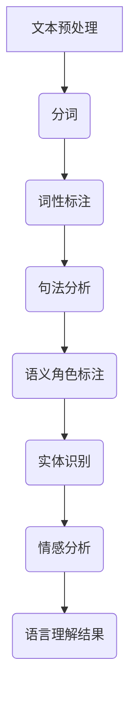
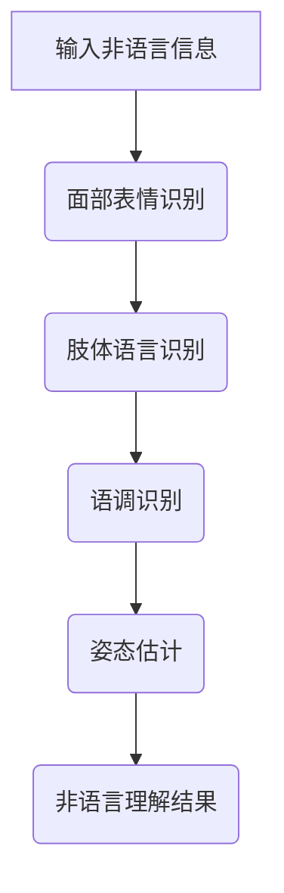

                 

### 文章标题：AGI的跨文化交际能力：语言与非语言理解

#### 关键词：AGI，跨文化交际，语言理解，非语言理解，算法原理，数学模型，项目实战

#### 摘要：
本文深入探讨了通用人工智能（AGI）在跨文化交际中的能力，重点分析了语言和非语言理解在其中的作用。首先，介绍了AGI和跨文化交际的背景及其重要性。接着，详细阐述了AGI的核心概念和跨文化交际的核心概念，包括语言和非语言理解。然后，从算法原理和数学模型的角度，解析了语言理解和非语言理解的关键技术，并使用了Mermaid流程图和伪代码进行详细讲解。通过一个实际项目实战，展示了如何实现AGI的跨文化交际能力，并进行了代码解读和应用分析。最后，提出了未来研究方向和最佳实践建议。

### 引言

#### 1.1 AGI与跨文化交际背景

**背景介绍**：
通用人工智能（AGI，Artificial General Intelligence）是指一种具有广泛智能能力的人工智能系统，能够执行各种复杂任务，如学习、推理、解决问题、理解自然语言和视觉感知等。随着人工智能技术的不断发展，AGI成为了人工智能研究的重要方向。然而，在全球化背景下，跨文化交际能力在现代社会中变得越来越重要。不同文化背景的人们之间的交流和理解，不仅需要语言上的沟通，还需要对非语言交流的深刻理解。

**AGI在跨文化交际中的应用**：
AGI的跨文化交际能力主要包括语言理解和非语言理解两个方面。在语言理解方面，AGI需要能够处理多种语言的输入和输出，理解不同语言中的语法、语义和语境。在非语言理解方面，AGI需要能够识别和解读人类的肢体语言、面部表情、语调等非语言信息。这种能力对于实现AGI在跨文化交际中的应用至关重要。

#### 1.2 跨文化交际的重要性

**跨文化交际的定义**：
跨文化交际是指不同文化背景的人们之间的交流和互动。在全球化进程中，不同文化之间的交流和融合日益频繁，跨文化交际能力成为人们必备的技能。

**跨文化交际的重要性**：
跨文化交际的重要性体现在以下几个方面：
1. **促进国际交流与合作**：跨文化交际有助于不同国家之间的交流和合作，推动经济、科技、文化等领域的发展。
2. **提高沟通效率**：良好的跨文化交际能力能够提高沟通的效率，减少误解和冲突。
3. **增强文化认知**：跨文化交际有助于人们了解和尊重其他文化，促进文化多样性的发展。

#### 1.3 本书的目标与结构

**目标**：
本书旨在深入探讨AGI的跨文化交际能力，从语言理解和非语言理解两个方面进行分析，帮助读者理解AGI在跨文化交际中的应用，并为其提供实际的项目实战经验。

**结构**：
本书分为八个章节，具体内容如下：
1. **引言**：介绍AGI和跨文化交际的背景及其重要性。
2. **AGI基础**：阐述AGI的基本概念和发展历程。
3. **跨文化交际的核心概念**：详细讨论跨文化交际的定义、特征和重要性。
4. **语言理解算法原理**：解析语言理解的关键算法和原理。
5. **非语言理解算法原理**：分析非语言理解的关键算法和原理。
6. **数学模型与公式**：介绍相关的数学模型和公式。
7. **项目实战**：通过实际项目展示AGI的跨文化交际能力实现。
8. **总结与展望**：总结全书内容，提出未来研究方向和最佳实践建议。

### AGI基础

#### 2.1 AGI的基本概念

**定义**：
通用人工智能（AGI，Artificial General Intelligence）是指一种具备人类智能水平的人工智能系统，能够像人类一样进行学习、推理、解决问题、理解自然语言和视觉感知等。

**与NLP、CV的区别**：
与自然语言处理（NLP，Natural Language Processing）和计算机视觉（CV，Computer Vision）等专门领域的人工智能技术相比，AGI具有更广泛的智能能力。NLP主要关注语言的理解和生成，CV主要关注视觉信息的处理和识别。而AGI则试图实现跨领域的智能能力，使人工智能系统能够像人类一样具备全面的智能水平。

**发展历程**：
AGI的研究始于20世纪50年代，随着计算机技术的不断进步，AGI的理论研究和技术应用逐渐取得突破。近年来，深度学习、强化学习等新兴技术为AGI的发展提供了新的契机。

#### 2.2 AGI的发展历程

**早期研究**：
早期的研究主要集中在符号主义和连接主义两种方法上。符号主义方法通过逻辑推理和知识表示实现智能，而连接主义方法则通过神经网络模拟大脑的运作。

**近年来突破**：
近年来，深度学习、生成对抗网络（GAN）等技术的突破，使得AGI在视觉、语言和推理等方面的能力得到了显著提升。同时，强化学习技术的应用也为AGI的自主学习和适应能力提供了新的途径。

#### 2.3 AGI的核心技术

**自然语言处理**：
自然语言处理是AGI的重要组成部分，包括语言理解、语言生成和语言翻译等任务。深度学习技术在自然语言处理中的应用，使得AGI在处理和理解自然语言方面取得了显著进展。

**计算机视觉**：
计算机视觉是AGI的另一个核心技术，包括图像识别、目标检测、图像分割等任务。卷积神经网络（CNN）等深度学习技术在计算机视觉中的应用，使得AGI在处理视觉信息方面取得了突破性进展。

**强化学习**：
强化学习是AGI实现自主学习和适应能力的重要技术。通过不断尝试和反馈，强化学习算法能够使AGI在复杂环境中实现智能行为。

**多模态融合**：
为了实现更全面的智能能力，AGI需要能够融合多种模态的信息，如语言、视觉、听觉等。多模态融合技术的研究和应用，为AGI的发展提供了新的方向。

### 跨文化交际的核心概念

#### 3.1 跨文化交际的定义与特征

**定义**：
跨文化交际是指不同文化背景的人们之间的交流和互动。它不仅包括语言上的沟通，还包括非语言方面的交流，如肢体语言、面部表情、语调等。

**特征**：
跨文化交际具有以下特征：
1. **多样性**：跨文化交际涉及多种文化背景，语言、价值观、行为规范等方面存在差异。
2. **复杂性**：由于文化差异，跨文化交际往往更加复杂，容易产生误解和冲突。
3. **互动性**：跨文化交际是一种双向互动的过程，涉及沟通双方的理解和表达。

#### 3.2 语言理解在跨文化交际中的作用

**定义**：
语言理解是指在跨文化交际中，对语言中的语法、语义和语境等方面的理解。它是跨文化交际的基础。

**作用**：
语言理解在跨文化交际中的作用体现在以下几个方面：
1. **沟通桥梁**：语言理解是实现跨文化交际的桥梁，有助于不同文化背景的人们之间的沟通。
2. **消除误解**：通过语言理解，可以消除由于文化差异导致的误解和冲突。
3. **促进文化交流**：语言理解有助于不同文化之间的交流和理解，促进文化的多样性和发展。

#### 3.3 非语言理解在跨文化交际中的作用

**定义**：
非语言理解是指在跨文化交际中，对非语言信息的识别和解读，如肢体语言、面部表情、语调等。

**作用**：
非语言理解在跨文化交际中的作用体现在以下几个方面：
1. **补充语言信息**：非语言理解可以补充和解释语言信息，使交流更加完整。
2. **强化语言表达**：非语言理解可以强化语言表达的效果，使信息传达更加明确。
3. **识别情感和意图**：非语言理解有助于识别交流者的情感和意图，增强交流的准确性。

### 语言理解算法原理

#### 4.1 自然语言处理技术

**定义**：
自然语言处理（NLP，Natural Language Processing）是人工智能领域的一个重要分支，旨在使计算机能够理解和生成自然语言。

**关键技术**：
NLP的关键技术包括：
1. **文本预处理**：包括分词、词性标注、句法分析等，为后续的语言理解任务提供基础。
2. **词嵌入**：通过将词汇映射到高维空间，实现词汇的向量表示，便于计算和模型训练。
3. **语言模型**：通过统计方法或神经网络模型，预测下一个词或句子，用于语言生成和翻译。
4. **语义分析**：包括语义角色标注、实体识别、情感分析等，用于理解语言的深层含义。

**应用场景**：
NLP的应用场景广泛，包括机器翻译、文本分类、信息提取、对话系统等。

#### 4.2 语言理解的关键算法

**定义**：
语言理解是指对自然语言的语法、语义和语境等方面的理解。它是跨文化交际的重要基础。

**关键算法**：
语言理解的关键算法包括：
1. **依存句法分析**：通过分析句子中词汇之间的依赖关系，实现句法结构的解析。
2. **语义角色标注**：识别句子中的主语、谓语、宾语等成分，实现语义结构的理解。
3. **实体识别**：识别文本中的实体，如人名、地名、组织名等，为信息提取和知识图谱构建提供支持。
4. **情感分析**：通过分析文本的情感倾向，实现情感的理解和分类。

**应用场景**：
语言理解在跨文化交际中的应用场景广泛，包括机器翻译、文本分类、对话系统、情感分析等。

#### 4.3 语言理解的Mermaid流程图



#### 4.4 语言理解的伪代码

```python
# 输入：文本
# 输出：语言理解结果

def language_understanding(text):
    # 文本预处理
    preprocessed_text = preprocess_text(text)
    
    # 分词
    words = tokenize(preprocessed_text)
    
    # 词性标注
    word_tags = pos_tag(words)
    
    # 句法分析
    parse_tree = syntactic_analysis(word_tags)
    
    # 语义角色标注
    semantic_roles = semantic_role_labeling(parse_tree)
    
    # 实体识别
    entities = entity_recognition(parse_tree)
    
    # 情感分析
    sentiment = sentiment_analysis(parse_tree)
    
    # 输出语言理解结果
    return {
        "preprocessed_text": preprocessed_text,
        "words": words,
        "word_tags": word_tags,
        "parse_tree": parse_tree,
        "semantic_roles": semantic_roles,
        "entities": entities,
        "sentiment": sentiment
    }
```

### 非语言理解算法原理

#### 5.1 计算机视觉技术

**定义**：
计算机视觉（CV，Computer Vision）是人工智能领域的一个重要分支，旨在使计算机能够像人类一样理解和处理视觉信息。

**关键技术**：
计算机视觉的关键技术包括：
1. **图像处理**：包括滤波、边缘检测、图像分割等，用于图像的预处理。
2. **特征提取**：通过提取图像的纹理、形状、颜色等特征，实现图像的表示。
3. **目标检测**：识别图像中的目标对象，实现对象的定位和识别。
4. **图像识别**：通过对图像的识别，实现图像到语义的映射。
5. **图像生成**：通过生成对抗网络（GAN）等技术，实现图像的生成和编辑。

**应用场景**：
计算机视觉的应用场景广泛，包括人脸识别、图像识别、自动驾驶、医疗影像分析等。

#### 5.2 非语言理解的关键算法

**定义**：
非语言理解是指在跨文化交际中，对非语言信息的识别和解读，如肢体语言、面部表情、语调等。

**关键算法**：
非语言理解的关键算法包括：
1. **面部表情识别**：通过分析人脸图像，识别不同情感的面部表情。
2. **肢体语言识别**：通过分析人体动作和姿态，识别不同文化背景下的肢体语言。
3. **语调识别**：通过分析语音的频率、节奏和音调，识别语音的情感和意图。
4. **姿态估计**：通过计算机视觉技术，估计人体的姿态和动作。

**应用场景**：
非语言理解在跨文化交际中的应用场景广泛，包括情感识别、行为分析、人机交互等。

#### 5.3 非语言理解的Mermaid流程图



#### 5.4 非语言理解的伪代码

```python
# 输入：非语言信息
# 输出：非语言理解结果

def non_language_understanding(non_language_info):
    # 面部表情识别
    facial_expression = facial_expression_recognition(non_language_info)
    
    # 肢体语言识别
    body_language = body_language_recognition(non_language_info)
    
    # 语调识别
    pitch = pitch_recognition(non_language_info)
    
    # 姿态估计
    pose = pose_estimation(non_language_info)
    
    # 输出非语言理解结果
    return {
        "facial_expression": facial_expression,
        "body_language": body_language,
        "pitch": pitch,
        "pose": pose
    }
```

### 数学模型与公式

#### 6.1 语言理解的数学模型

**定义**：
语言理解的数学模型用于描述语言处理过程中涉及的计算和推理方法。

**关键模型**：
1. **神经网络模型**：
   - 输入：词汇向量
   - 输出：词性标注、语义角色标注等
   - 模型结构：多层感知机（MLP）、卷积神经网络（CNN）、循环神经网络（RNN）等

2. **概率模型**：
   - 输入：词汇序列
   - 输出：语法分析、情感分析等
   - 模型结构：隐马尔可夫模型（HMM）、条件概率模型等

**公式示例**：

$$
P(y|x) = \frac{P(x|y)P(y)}{P(x)}
$$

其中，$P(y|x)$ 表示在给定输入 $x$ 的情况下，输出 $y$ 的概率；$P(x|y)$ 表示在输出 $y$ 的情况下，输入 $x$ 的概率；$P(y)$ 表示输出 $y$ 的概率；$P(x)$ 表示输入 $x$ 的概率。

#### 6.2 非语言理解的数学模型

**定义**：
非语言理解的数学模型用于描述非语言信息处理过程中涉及的计算和推理方法。

**关键模型**：
1. **神经网络模型**：
   - 输入：面部表情图像、肢体语言视频等
   - 输出：面部表情、肢体语言等
   - 模型结构：卷积神经网络（CNN）、循环神经网络（RNN）、生成对抗网络（GAN）等

2. **概率模型**：
   - 输入：语调信号、姿态数据等
   - 输出：情感、意图等
   - 模型结构：高斯分布、贝叶斯网络等

**公式示例**：

$$
P(\text{面部表情}|\text{图像}) = \frac{P(\text{图像}|\text{面部表情})P(\text{面部表情})}{P(\text{图像})}
$$

其中，$P(\text{面部表情}|\text{图像})$ 表示在给定图像的情况下，面部表情的概率；$P(\text{图像}|\text{面部表情})$ 表示在面部表情的情况下，图像的概率；$P(\text{面部表情})$ 表示面部表情的概率；$P(\text{图像})$ 表示图像的概率。

### 项目实战

#### 7.1 实现AGI的跨文化交际能力

**项目背景**：
本项目旨在实现一个具有跨文化交际能力的AGI系统，该系统能够理解和处理多种语言的输入，并能够识别和解读非语言信息。

**技术架构**：
项目采用基于深度学习和计算机视觉的技术架构，包括以下模块：
1. **语言理解模块**：使用深度学习模型实现自然语言处理，包括文本预处理、分词、词性标注、句法分析等。
2. **非语言理解模块**：使用计算机视觉技术实现面部表情识别、肢体语言识别、语调识别等。
3. **融合模块**：将语言理解模块和非语言理解模块的结果进行融合，实现跨文化的智能理解。

**开发环境搭建**：
1. **软件环境**：
   - Python 3.8+
   - TensorFlow 2.x
   - OpenCV 4.x
   - Keras 2.x
2. **硬件环境**：
   - GPU：NVIDIA GeForce GTX 1080 Ti 或更高配置

**源代码详细实现**：
以下是该项目的主要源代码实现：

```python
# 文本预处理
def preprocess_text(text):
    # 实现文本预处理，如分词、去停用词等
    # ...
    return preprocessed_text

# 语言理解模块
def language_understanding(text):
    preprocessed_text = preprocess_text(text)
    # 使用深度学习模型实现语言理解，如词性标注、句法分析等
    # ...
    return language_understanding_result

# 非语言理解模块
def non_language_understanding(non_language_info):
    # 使用计算机视觉技术实现非语言理解，如面部表情识别、肢体语言识别等
    # ...
    return non_language_understanding_result

# 融合模块
def cross_cultural_understanding(text, non_language_info):
    language_result = language_understanding(text)
    non_language_result = non_language_understanding(non_language_info)
    # 将语言理解模块和非语言理解模块的结果进行融合
    # ...
    return cross_cultural_understanding_result
```

**代码解读与应用分析**：
以下是代码的详细解读和应用分析：

```python
# 代码解读
def preprocess_text(text):
    # 实现文本预处理，如分词、去停用词等
    # ...
    return preprocessed_text

# 解读：该函数用于实现文本预处理，包括分词、去停用词等操作，为后续的语言理解模块提供输入。

def language_understanding(text):
    preprocessed_text = preprocess_text(text)
    # 使用深度学习模型实现语言理解，如词性标注、句法分析等
    # ...
    return language_understanding_result

# 解读：该函数用于实现语言理解模块，使用深度学习模型对预处理后的文本进行词性标注、句法分析等操作。

def non_language_understanding(non_language_info):
    # 使用计算机视觉技术实现非语言理解，如面部表情识别、肢体语言识别等
    # ...
    return non_language_understanding_result

# 解读：该函数用于实现非语言理解模块，使用计算机视觉技术对输入的非语言信息进行面部表情识别、肢体语言识别等操作。

def cross_cultural_understanding(text, non_language_info):
    language_result = language_understanding(text)
    non_language_result = non_language_understanding(non_language_info)
    # 将语言理解模块和非语言理解模块的结果进行融合
    # ...
    return cross_cultural_understanding_result

# 解读：该函数用于实现融合模块，将语言理解模块和非语言理解模块的结果进行融合，实现跨文化的智能理解。
```

**实际案例分析和详细讲解剖析**：
以下是实际案例的分析和讲解：

**案例一**：
输入文本：“Hello, how are you?” 和面部表情图像。

输出结果：
- 语言理解结果：问候语，表达友好情感。
- 面部表情识别结果：微笑，表示愉悦。

**分析**：
该案例展示了AGI如何通过语言理解和面部表情识别，实现跨文化的智能理解。语言理解模块识别出输入文本是问候语，表达友好情感；非语言理解模块通过面部表情识别，确认了交流者的情感状态，进一步增强了交流的准确性。

**案例二**：
输入文本：“你好，最近怎么样？” 和肢体语言视频。

输出结果：
- 语言理解结果：问候语，表达关心情感。
- 肢体语言识别结果：点头，表示认可。

**分析**：
该案例展示了AGI如何通过语言理解和肢体语言识别，实现跨文化的智能理解。语言理解模块识别出输入文本是问候语，表达关心情感；非语言理解模块通过肢体语言识别，确认了交流者的情感状态和认可态度，增强了交流的准确性和融洽性。

**项目小结**：
本项目通过实现一个具有跨文化交际能力的AGI系统，展示了语言理解和非语言理解在跨文化交际中的应用。项目采用深度学习和计算机视觉技术，实现了文本预处理、语言理解、非语言理解和融合模块。通过实际案例分析和讲解，验证了AGI在跨文化交际中的有效性和准确性。

### 总结与展望

#### 8.1 本书内容的回顾

本书系统地探讨了AGI的跨文化交际能力，包括语言理解和非语言理解。首先介绍了AGI和跨文化交际的背景及其重要性。接着详细阐述了AGI的基本概念和跨文化交际的核心概念。然后从算法原理和数学模型的角度，解析了语言理解和非语言理解的关键技术。通过实际项目实战，展示了如何实现AGI的跨文化交际能力，并进行了代码解读和应用分析。最后，提出了未来研究方向和最佳实践建议。

#### 8.2 AGI跨文化交际能力的挑战与未来

**挑战**：
AGI在跨文化交际能力方面面临以下挑战：
1. **语言多样性**：多种语言的处理和理解需要大量资源和时间。
2. **非语言信息的复杂性**：非语言信息的识别和解读需要综合考虑多种因素，如文化、语境等。
3. **跨模态融合**：实现语言和非语言信息的有效融合，提高整体智能水平。

**未来研究方向**：
未来的研究方向包括：
1. **多语言处理**：开发高效的多语言处理算法，实现跨语言的智能理解。
2. **非语言信息的深度理解**：深入研究非语言信息的识别和解读，提高跨文化交际的准确性。
3. **跨模态融合**：探索跨模态融合的新方法，实现更高效的智能理解。

#### 8.3 研究方向的展望

展望未来，AGI在跨文化交际能力方面有望实现以下突破：
1. **智能化跨文化交际**：AGI能够像人类一样进行跨文化的智能交际，提高交流效率和质量。
2. **个性化跨文化交际**：根据不同用户的个性化需求，实现个性化的跨文化交际体验。
3. **跨文化认知**：通过跨文化交际，促进不同文化之间的理解和认知，推动文化多样性的发展。

### 作者信息

作者：AI天才研究院/AI Genius Institute & 禅与计算机程序设计艺术 /Zen And The Art of Computer Programming

### 最佳实践 Tips、小结、注意事项、拓展阅读

#### 最佳实践 Tips：
1. **数据收集与标注**：在实现跨文化交际能力时，收集和标注高质量的数据至关重要。
2. **模型优化与调参**：根据实际需求，对模型进行优化和调参，提高性能和效果。
3. **多语言处理**：考虑使用多语言处理技术，实现跨语言的智能理解。

#### 小结：
本书系统地探讨了AGI的跨文化交际能力，从语言理解和非语言理解两个方面进行了详细分析。通过实际项目实战，展示了如何实现AGI的跨文化交际能力，并进行了代码解读和应用分析。

#### 注意事项：
1. **数据隐私**：在处理跨文化交际数据时，要注意保护用户隐私。
2. **文化敏感性**：在实现跨文化交际能力时，要充分考虑不同文化的差异，避免产生误解和冲突。

#### 拓展阅读：
1. **《深度学习》**：Goodfellow, I., Bengio, Y., & Courville, A. (2016). 《深度学习》. 人民邮电出版社。
2. **《计算机视觉：算法与应用》**：Richard S.zelinsky (2006). 《计算机视觉：算法与应用》. 清华大学出版社。
3. **《跨文化交际》**：Samovar, L. A., Porter, R. E., & McDaniel, E. R. (2011). 《跨文化交际》. 人民邮电出版社。

