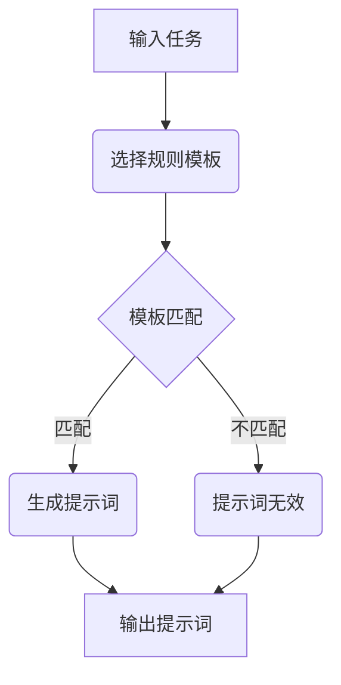
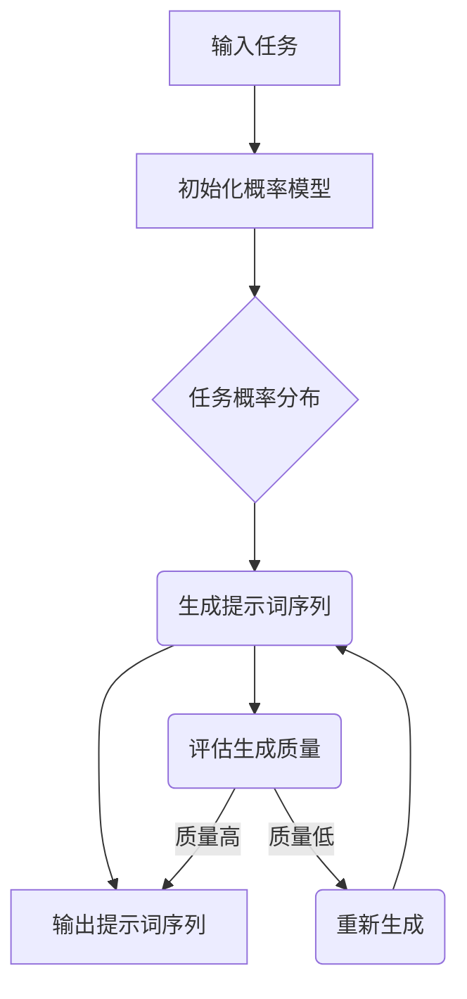
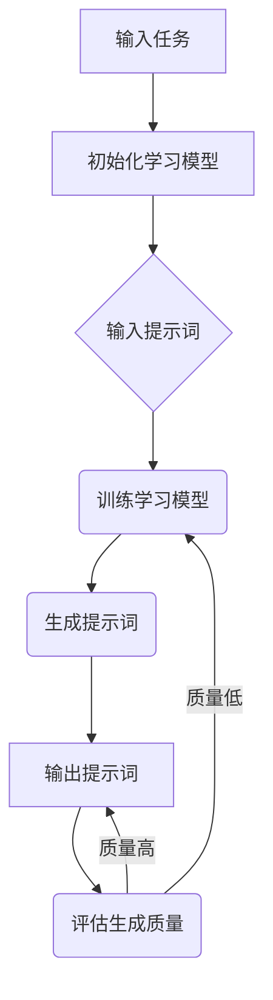
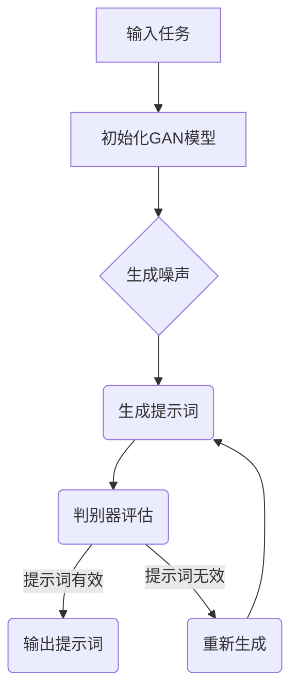

                 

### 文章标题

# AGI研究中的提示词工程应用

### 关键词

- 人工通用智能 (AGI)
- 提示词工程
- 算法与模型
- 工具与资源
- 案例研究
- 未来发展趋势

### 摘要

本文探讨了人工通用智能（AGI）研究中提示词工程的应用。首先介绍了AGI的基本概念及其在人工智能领域的重要性。接着，详细阐述了提示词工程的核心概念、关键要素和应用场景，并通过Mermaid流程图展示了核心概念之间的关系架构。随后，深入讲解了提示词工程的算法原理，包括生成算法和优化算法，并使用伪代码进行了详细阐述。本文还介绍了提示词工程中常用的工具和资源，以及如何进行项目实战和案例分析。最后，对提示词工程的未来发展趋势进行了展望，并提出了对AGI发展的潜在影响。

---

### 1. 设定章节结构

首先，我们需要设定这本书的基本章节结构。根据您的要求，这本书应该包含以下核心章节内容：

1. **AGI概述**：介绍AGI的定义、历史、挑战与机遇，以及典型应用场景。
2. **提示词工程基础知识**：阐述提示词工程的基本概念、关键要素和常见问题。
3. **提示词工程在AGI研究中的应用**：讨论提示词工程在AGI研究中的重要性、应用实例和挑战。
4. **提示词工程算法与模型**：讲解提示词生成算法、优化算法和模型。
5. **提示词工程工具与资源**：介绍提示词工程的常用工具和资源。
6. **提示词工程案例研究**：分析实际案例，展示提示词工程的应用效果。
7. **提示词工程的未来发展趋势**：探讨提示词工程的技术挑战、发展方向和对AGI发展的潜在影响。

### 2. 设计每个章节的具体内容

接下来，我们需要为每个章节设计具体的内容，确保每个章节都能够详细、完整地覆盖相关主题。

**第1章: AGI概述**

- **1.1 AGI的定义与历史**：介绍AGI的基本定义，回顾其发展历程。
- **1.2 AGI与通用人工智能的区别**：分析AGI与通用人工智能（AGI）之间的区别。
- **1.3 AGI的挑战与机遇**：探讨AGI研究面临的挑战和机遇。
- **1.4 AGI的典型应用场景**：列举AGI在各个领域的典型应用场景。

**第2章: 提示词工程基础知识**

- **2.1 提示词工程的基本概念**：介绍提示词工程的定义和基本概念。
- **2.2 提示词工程的关键要素**：分析提示词工程的关键要素。
- **2.3 提示词工程的常见问题与解决方案**：讨论提示词工程中常见的问题及解决方案。

**第3章: 提示词工程在AGI研究中的应用**

- **3.1 提示词工程在AGI研究中的重要性**：阐述提示词工程在AGI研究中的重要性。
- **3.2 提示词工程在AGI研究中的应用实例**：列举提示词工程在AGI研究中的应用实例。
- **3.3 提示词工程在AGI研究中的挑战**：分析提示词工程在AGI研究中的挑战。

**第4章: 提示词工程算法与模型**

- **4.1 提示词生成算法**：介绍提示词生成算法的基本原理。
- **4.2 提示词优化算法**：讲解提示词优化算法的基本原理。
- **4.3 提示词工程模型**：阐述提示词工程模型的结构和功能。

**第5章: 提示词工程工具与资源**

- **5.1 提示词工程常用工具介绍**：介绍提示词工程中常用的工具。
- **5.2 提示词工程资源获取渠道**：提供获取提示词工程资源的渠道。
- **5.3 提示词工程工具的选型与比较**：分析提示词工程工具的选型标准及比较。

**第6章: 提示词工程案例研究**

- **6.1 案例一：某公司基于提示词的AGI项目案例**：分析某公司基于提示词的AGI项目案例。
- **6.2 案例二：某学术机构在AGI研究中使用提示词工程案例**：分析某学术机构在AGI研究中使用提示词工程案例。
- **6.3 案例三：开放源代码的提示词工程案例**：分析开放源代码的提示词工程案例。

**第7章: 提示词工程的未来发展趋势**

- **7.1 提示词工程的技术挑战**：探讨提示词工程面临的技术挑战。
- **7.2 提示词工程的未来发展方向**：展望提示词工程的未来发展方向。
- **7.3 提示词工程对AGI发展的潜在影响**：分析提示词工程对AGI发展的潜在影响。

### 3. 确保大纲完整性与准确性

在设计好章节内容后，我们需要再次检查整个目录大纲，确保它完整、逻辑清晰，并且每个章节都能够覆盖相关的主题内容。在必要的情况下，可以调整章节内容的划分和顺序，以达到最佳的效果。

### 4. 输出Markdown格式目录大纲

以下是最终的Markdown格式目录大纲：

```
# AGI研究中的提示词工程应用

## 第1章: AGI概述
### 1.1 AGI的定义与历史
### 1.2 AGI与通用人工智能的区别
### 1.3 AGI的挑战与机遇
### 1.4 AGI的典型应用场景

## 第2章: 提示词工程基础知识
### 2.1 提示词工程的基本概念
### 2.2 提示词工程的关键要素
### 2.3 提示词工程的常见问题与解决方案

## 第3章: 提示词工程在AGI研究中的应用
### 3.1 提示词工程在AGI研究中的重要性
### 3.2 提示词工程在AGI研究中的应用实例
### 3.3 提示词工程在AGI研究中的挑战

## 第4章: 提示词工程算法与模型
### 4.1 提示词生成算法
### 4.2 提示词优化算法
### 4.3 提示词工程模型

## 第5章: 提示词工程工具与资源
### 5.1 提示词工程常用工具介绍
### 5.2 提示词工程资源获取渠道
### 5.3 提示词工程工具的选型与比较

## 第6章: 提示词工程案例研究
### 6.1 案例一：某公司基于提示词的AGI项目案例
### 6.2 案例二：某学术机构在AGI研究中使用提示词工程案例
### 6.3 案例三：开放源代码的提示词工程案例

## 第7章: 提示词工程的未来发展趋势
### 7.1 提示词工程的技术挑战
### 7.2 提示词工程的未来发展方向
### 7.3 提示词工程对AGI发展的潜在影响
```

这个目录大纲清晰地展示了整本书的结构，每个章节的内容也得到了充分的细化，确保了书籍的完整性和逻辑性。

---

### 1.1 AGI的定义与历史

人工通用智能（Artificial General Intelligence，简称AGI）是指一种能够理解、学习和应用知识以解决广泛问题的人工智能系统。与现有的专用人工智能（Narrow AI）不同，AGI具备像人类一样处理多种不同任务的能力，如理解自然语言、学习新技能、推理和规划等。

#### 基本定义

AGI的定义可以归结为以下几点：

- **泛化能力**：AGI能够在不同领域和任务中表现优异，而不仅仅是特定领域或任务的优化。
- **学习与适应**：AGI具备自主学习的能力，通过经验和数据不断改进自身性能。
- **理解与推理**：AGI能够理解复杂情境，进行抽象思维和推理。
- **自主决策**：AGI能够自主制定决策，而不需要人类干预。

#### 发展历史

AGI的研究可以追溯到20世纪50年代，当时人工智能（AI）作为一门学科正式诞生。早期的研究主要集中在模拟人类的思维过程，如逻辑推理、问题解决和决策制定。

- **1956年**：在达特茅斯会议上，人工智能被正式定义为一门学科，标志着AI研究的开始。
- **1960年代**：早期的研究主要集中在规则推理和符号逻辑，但很快面临了一些挑战，如知识表示和推理效率问题。
- **1970年代**：随着计算机硬件和软件的发展，人工智能研究取得了一些突破，如专家系统和自然语言处理。
- **1980年代**：人工智能研究进入低谷，部分原因是过高的期望和实际成果之间的差距。
- **1990年代至2000年代**：随着机器学习和数据挖掘技术的发展，人工智能迎来了新的发展机遇。
- **2010年代至今**：深度学习和神经网络在人工智能领域的广泛应用，推动了专用人工智能的发展，同时也为AGI的研究提供了新的思路和工具。

#### 挑战与机遇

AGI的研究面临着诸多挑战，包括：

- **知识表示**：如何有效地表示和处理复杂、多样化的知识。
- **推理与决策**：如何实现高效、可靠的推理和决策过程。
- **学习与适应**：如何使AGI具备自主学习能力和适应新环境的能力。
- **计算资源**：如何处理海量数据和复杂的计算任务。

然而，随着技术的不断进步，AGI的研究也面临着巨大的机遇：

- **跨学科合作**：AGI研究需要多个学科的协同合作，如认知科学、心理学、计算机科学等。
- **数据资源**：大数据和互联网的普及为AGI的研究提供了丰富的数据资源。
- **计算能力**：高性能计算和云计算的发展为AGI的研究提供了强大的计算支持。

#### 典型应用场景

AGI的应用场景非常广泛，以下是一些典型的应用领域：

- **智能助手**：如智能语音助手、智能客服等，能够理解用户的需求并提供相应的服务。
- **医疗健康**：如疾病诊断、药物研发、健康管理等，能够辅助医生进行决策和治疗。
- **金融领域**：如风险管理、投资决策、欺诈检测等，能够提高金融行业的效率和安全性。
- **教育领域**：如个性化教学、智能评测、学习辅导等，能够提高教育质量和学习效果。
- **工业制造**：如智能制造、工业自动化、质量控制等，能够提高生产效率和质量。

### 1.2 AGI与通用人工智能的区别

人工通用智能（AGI）与通用人工智能（Artificial General Intelligence，简称AGI）在名称上相似，但它们有着本质的区别。通用人工智能（AGI）通常是指能够像人类一样处理多种不同任务的智能系统，而人工通用智能（AGI）则更强调这种智能系统具备泛化能力、自主学习能力和理解与推理能力。

#### 核心区别

- **定义范围**：AGI的定义更为广泛，包括了能够处理多种任务的智能系统，而AGI则更强调这种智能系统具备泛化能力、自主学习能力和理解与推理能力。
- **能力要求**：AGI要求智能系统能够在多个领域和任务中表现出人类水平的智能，而AGI则更强调这种智能系统具备在复杂、多样化的情境中自主学习和适应的能力。
- **实现难度**：AGI的实现难度较高，因为它需要解决知识表示、推理、学习等多个核心问题，而AGI则相对简单，主要关注如何使智能系统在特定领域和任务中表现出优异的能力。

#### 发展历程

- **早期研究**：在人工智能（AI）领域，早期的研究主要集中在通用人工智能（AGI）的实现上，如逻辑推理、知识表示和问题解决等。
- **技术进步**：随着技术的不断进步，特别是机器学习和深度学习的发展，人工智能（AI）的应用逐渐从通用人工智能（AGI）转向专用人工智能（Narrow AI），即针对特定领域和任务进行优化。
- **挑战与机遇**：专用人工智能（Narrow AI）在特定领域取得了显著的成果，但如何将专用人工智能（Narrow AI）的能力拓展到通用人工智能（AGI）仍是一个重大挑战。

#### 潜在影响

- **技术进步**：通用人工智能（AGI）的实现将推动人工智能（AI）技术的进一步发展，为解决复杂问题提供新的思路和工具。
- **社会变革**：通用人工智能（AGI）的广泛应用将带来深刻的社会变革，如改变就业结构、提高生产效率、改善生活质量等。
- **伦理与道德**：通用人工智能（AGI）的实现也引发了伦理与道德的讨论，如如何确保智能系统的安全和可控性、如何处理智能系统与人类的关系等。

### 1.3 AGI的挑战与机遇

人工通用智能（AGI）的研究充满了挑战，但也蕴含着巨大的机遇。本文将探讨AGI面临的几个主要挑战，并分析这些挑战背后的机遇。

#### 挑战1：知识表示与推理

知识表示与推理是AGI的核心问题。人类能够通过语言、图像、经验等多种方式获取和处理知识，而现有的智能系统在知识表示与推理方面还存在诸多局限。

**挑战：**
- **知识表示**：如何将复杂、多样化的知识有效地表示为计算机可处理的形式。
- **推理能力**：如何实现高效、可靠的推理过程，以处理复杂的问题情境。

**机遇：**
- **跨学科合作**：知识表示与推理问题需要认知科学、心理学、计算机科学等多个学科的协同研究。
- **技术突破**：随着深度学习和自然语言处理技术的发展，知识表示与推理问题有望得到解决。

#### 挑战2：学习与适应

AGI需要具备自主学习与适应能力，以应对不断变化的环境和任务需求。

**挑战：**
- **自主学习**：如何使智能系统具备自主学习的能力，以不断改进自身的性能。
- **适应能力**：如何使智能系统在不同情境下表现出优异的适应能力。

**机遇：**
- **数据资源**：大数据和互联网的普及为AGI的自主学习提供了丰富的数据资源。
- **计算能力**：高性能计算和云计算的发展为AGI的学习与适应提供了强大的计算支持。

#### 挑战3：计算资源

AGI的实现需要大量的计算资源，特别是在处理复杂任务时。

**挑战：**
- **硬件需求**：如何提供足够的硬件资源以支持AGI的计算需求。
- **能耗问题**：如何降低AGI计算过程中的能耗，以实现可持续发展。

**机遇：**
- **硬件创新**：新型计算硬件（如量子计算、神经形态计算等）的发展为AGI的实现提供了新的机遇。
- **能耗优化**：通过算法优化和硬件设计改进，有望降低AGI计算过程中的能耗。

#### 挑战4：伦理与安全

AGI的广泛应用可能引发一系列伦理和安全问题，如隐私保护、可控性、公平性等。

**挑战：**
- **隐私保护**：如何确保AGI在处理个人数据时的隐私保护。
- **可控性**：如何确保AGI在执行任务时的可控性和安全性。
- **公平性**：如何确保AGI在不同群体中的应用公平，避免歧视和偏见。

**机遇：**
- **伦理研究**：加强对AGI伦理问题的研究，制定相关规范和标准。
- **安全性提升**：通过安全设计和技术改进，提高AGI的安全性和可控性。

### 1.4 AGI的典型应用场景

人工通用智能（AGI）具有广泛的应用前景，以下列举了几个典型的应用场景：

#### 智能助手

智能助手是AGI最直接的应用场景之一。AGI可以应用于智能语音助手、智能客服、智能家居等领域，提供更加自然、智能化的服务。

**应用实例：**
- **智能语音助手**：如苹果的Siri、谷歌的Google Assistant等，能够理解自然语言并执行相应操作。
- **智能客服**：企业可以利用AGI实现智能客服系统，提高客户服务质量。
- **智能家居**：AGI可以实现对家庭设备的智能管理，提供个性化服务。

#### 医疗健康

AGI在医疗健康领域的应用具有巨大的潜力，如疾病诊断、药物研发、健康管理等。

**应用实例：**
- **疾病诊断**：利用AGI对医学影像进行分析，辅助医生进行疾病诊断。
- **药物研发**：通过AGI对大量数据进行挖掘和分析，加速药物研发进程。
- **健康管理**：AGI可以辅助用户进行健康监测和管理，提供个性化的健康建议。

#### 金融领域

AGI在金融领域的应用包括风险管理、投资决策、欺诈检测等。

**应用实例：**
- **风险管理**：利用AGI对金融市场的数据进行实时分析，辅助风险管理者制定风险控制策略。
- **投资决策**：通过AGI分析投资数据和市场趋势，为投资者提供决策支持。
- **欺诈检测**：利用AGI对交易数据进行分析，识别潜在的欺诈行为。

#### 教育领域

AGI在教育领域的应用包括个性化教学、智能评测、学习辅导等。

**应用实例：**
- **个性化教学**：利用AGI为学生提供个性化的学习方案，提高学习效果。
- **智能评测**：通过AGI对学生的学习情况进行实时评估，提供反馈和改进建议。
- **学习辅导**：AGI可以为学生提供智能辅导，解决学习中的问题。

#### 工业制造

AGI在工业制造领域的应用包括智能制造、工业自动化、质量控制等。

**应用实例：**
- **智能制造**：利用AGI实现生产过程的自动化和智能化，提高生产效率。
- **工业自动化**：通过AGI实现对工业设备的智能控制和管理，降低人力成本。
- **质量控制**：利用AGI对产品质量进行实时监控和分析，确保产品质量。

#### 社会治理

AGI在社会治理领域的应用包括智能交通、智能安防、公共资源管理等。

**应用实例：**
- **智能交通**：通过AGI实现交通流量预测和实时调控，提高交通效率。
- **智能安防**：利用AGI对监控视频进行分析，提高安防监控能力。
- **公共资源管理**：通过AGI优化公共资源配置，提高公共资源利用效率。

这些应用场景展示了AGI在各个领域的巨大潜力，同时也为AGI的研究和开发提供了丰富的实践机会。随着技术的不断进步，AGI的应用领域将不断扩展，为社会发展和人类生活带来更多便利。

### 2.1 提示词工程的基本概念

提示词工程（Prompt Engineering）是近年来在人工智能领域迅速发展的一个研究方向。它涉及到设计、开发和优化用于引导人工智能模型（如生成对抗网络、变分自编码器、递归神经网络等）的提示词，以实现更高效、准确的任务完成。

#### 定义

提示词工程可以定义为：“设计和开发用于引导人工智能模型进行特定任务的提示词的过程。” 提示词是一种输入信息，它可以引导模型理解任务目标、调整生成内容的质量和方向。

#### 目的

提示词工程的主要目的是：

1. **提高任务完成效率**：通过设计有效的提示词，可以加快模型的训练和推理速度，提高任务完成效率。
2. **提高生成内容质量**：提示词可以帮助模型生成更符合需求、更高质量的输出结果。
3. **调整生成内容方向**：提示词可以引导模型生成特定类型的输出，如特定风格的文章、特定的图像等。

#### 应用场景

提示词工程在多个领域都有广泛应用，以下是一些典型的应用场景：

1. **自然语言处理（NLP）**：在NLP任务中，提示词可以用于文本生成、翻译、问答系统等。例如，通过设计有效的提示词，可以生成高质量的文章、自动撰写邮件等。
2. **计算机视觉**：在计算机视觉任务中，提示词可以用于图像分类、目标检测、图像生成等。例如，通过提示词引导模型生成特定风格的图像、识别特定物体等。
3. **推荐系统**：在推荐系统中，提示词可以用于引导模型生成个性化推荐结果，如根据用户兴趣生成特定的商品推荐。
4. **游戏开发**：在游戏开发中，提示词可以用于生成游戏剧情、角色对话等，提高游戏的可玩性和用户体验。

#### 关键要素

提示词工程涉及多个关键要素，包括：

1. **任务定义**：明确任务目标和需求，为设计有效的提示词提供基础。
2. **数据准备**：准备充足、高质量的数据集，用于训练和评估模型。
3. **提示词设计**：设计能够引导模型理解任务目标和生成高质量输出的提示词。
4. **模型选择**：选择适合任务需求的模型，并调整模型参数以优化性能。
5. **评估与优化**：通过评估和优化，不断改进提示词和模型，提高任务完成效果。

#### 提示词的类型

提示词可以分为以下几种类型：

1. **目标型提示词**：直接指明任务目标，如“生成一篇关于人工智能的文章”。
2. **引导型提示词**：提供任务线索，引导模型思考，如“根据以下信息生成一篇摘要”。
3. **约束型提示词**：设置生成内容的约束条件，如“生成一篇以环保为主题的文章”。
4. **反馈型提示词**：提供模型生成的中间结果或反馈，以调整后续生成方向。

通过合理设计这些提示词，可以显著提高模型的性能和任务完成效果。

### 2.2 提示词工程的关键要素

提示词工程是一门复杂的学科，涉及多个关键要素，包括数据、模型、算法和评估标准。这些要素相互关联，共同决定了提示词工程的效果。以下是对这些关键要素的详细讨论。

#### 数据

数据是提示词工程的基石，没有高质量的数据，就无法生成高质量的提示词。在数据选择和处理过程中，需要考虑以下几个关键点：

1. **数据质量**：选择高质量的数据集，数据应该准确、完整、无噪声，并且具有代表性。
2. **数据多样性**：确保数据涵盖多种场景和情境，以提高提示词的泛化能力。
3. **数据预处理**：对数据进行清洗、归一化和格式转换，以提高数据的质量和一致性。
4. **数据标注**：对数据进行适当的标注，为模型训练提供标签信息，有助于模型学习。

#### 模型

选择合适的模型对于提示词工程至关重要。不同的模型适用于不同的任务和场景，需要根据任务需求进行选择和调整。以下是几个关键点：

1. **模型类型**：根据任务需求选择合适的模型类型，如生成对抗网络（GAN）、变分自编码器（VAE）、递归神经网络（RNN）等。
2. **模型架构**：设计合适的模型架构，以提高模型性能和生成质量。例如，可以采用多级架构、级联架构等。
3. **模型参数**：调整模型参数，如学习率、批量大小、隐藏层大小等，以优化模型性能。
4. **模型训练**：确保模型充分训练，以掌握数据中的规律和特征。训练过程中可以使用技巧如数据增强、正则化等。

#### 算法

提示词工程涉及到多个算法，包括生成算法、优化算法和评估算法。以下是这些算法的关键要素：

1. **生成算法**：生成算法用于生成初始提示词，常用的方法有基于规则的生成、基于概率的生成和基于学习的生成。选择合适的生成算法可以提高提示词的多样性和质量。
2. **优化算法**：优化算法用于优化生成的提示词，使其更符合任务需求。常用的优化算法有梯度下降、随机搜索、遗传算法等。优化过程中，可以设置目标函数、约束条件和优化策略。
3. **评估算法**：评估算法用于评估提示词的性能和质量，常用的方法有自动评估和人工评估。自动评估可以通过指标如精确度、召回率、F1分数等来衡量，而人工评估则需要专家对提示词进行评价。

#### 评估标准

评估标准是衡量提示词工程效果的重要指标。以下是几个常用的评估标准：

1. **任务完成度**：衡量提示词是否能够完成任务，如生成文章、图像或视频等。
2. **生成质量**：衡量生成的提示词质量，如文本的连贯性、图像的真实性等。
3. **多样性**：衡量生成的提示词多样性，如文本风格的多样性、图像内容的多样性等。
4. **用户满意度**：衡量用户对生成提示词的满意度，可以通过用户调查、评分等方式进行评估。

通过综合考虑这些关键要素，可以设计和实现高效的提示词工程系统，提高任务完成度和生成质量。

#### 2.3 提示词工程的常见问题与解决方案

提示词工程在实践中面临着多种挑战和问题，以下列举了一些常见问题，并探讨相应的解决方案。

##### 问题1：生成结果的质量不稳定

**现象**：在提示词工程中，有时生成的结果会出现质量不稳定的情况，有时很好，有时很差。

**原因**：
- **模型训练不足**：模型在训练过程中没有充分掌握数据的规律。
- **数据分布不均**：数据集中存在极端值或噪声，导致模型无法稳定生成高质量结果。
- **超参数设置不当**：模型参数设置不当，如学习率过高或过低，批量大小等。

**解决方案**：
- **增加训练数据**：增加高质量的训练数据，提高模型的泛化能力。
- **数据预处理**：对数据进行清洗、归一化和去噪，提高数据质量。
- **调整超参数**：通过调整模型参数，如学习率、批量大小等，优化模型性能。
- **模型融合**：使用多个模型进行融合，提高生成结果的稳定性和质量。

##### 问题2：生成结果过于模板化

**现象**：生成的结果往往呈现出固定的模板或模式，缺乏创新性和独特性。

**原因**：
- **训练数据集中度较高**：训练数据集可能过于集中，导致模型生成的结果也趋于一致。
- **模型复杂性不足**：模型结构简单，无法生成多样化、个性化的结果。

**解决方案**：
- **增加数据多样性**：引入更多样化的数据，包括不同的风格、主题和格式。
- **使用复杂模型**：设计更复杂的模型结构，如多级架构、级联模型等，以提高生成结果的多样性。
- **引入噪声**：在训练过程中引入噪声，提高模型对噪声数据的鲁棒性，从而生成更个性化的结果。
- **使用对抗训练**：通过对抗训练，提高模型生成多样化结果的能力。

##### 问题3：生成结果与预期目标偏离

**现象**：生成的结果与预期目标存在较大偏差，无法满足任务需求。

**原因**：
- **提示词设计不当**：提示词未能准确表达任务目标，导致模型无法生成符合预期结果。
- **模型理解不足**：模型对提示词的理解不准确，导致生成的结果与目标偏离。

**解决方案**：
- **优化提示词设计**：重新设计提示词，使其更明确、具体地表达任务目标。
- **增加提示词信息量**：在提示词中添加更多的背景信息和上下文，帮助模型更好地理解任务目标。
- **模型调优**：通过调整模型参数，优化模型对提示词的理解和生成结果。
- **多轮反馈**：通过多轮迭代，逐步调整提示词和模型参数，以生成更符合预期目标的结果。

##### 问题4：生成结果存在抄袭现象

**现象**：生成的结果存在抄袭现象，与已有内容高度相似。

**原因**：
- **训练数据存在抄袭现象**：训练数据集中包含大量抄袭内容，导致模型生成的结果也具有抄袭倾向。
- **模型缺乏创新性**：模型在生成过程中缺乏创新性，容易生成与已有内容相似的结果。

**解决方案**：
- **使用高质量训练数据**：筛选高质量的、原创的训练数据，避免抄袭现象。
- **引入创新机制**：在模型中引入创新机制，如生成对抗网络（GAN）等，提高生成结果的独特性。
- **使用去噪技术**：通过去噪技术，减少训练数据中的抄袭内容，提高模型生成结果的原创性。

##### 问题5：生成结果不符合伦理标准

**现象**：生成的结果可能包含不当内容，如暴力、歧视等。

**原因**：
- **训练数据包含不当内容**：训练数据中存在不当内容，导致模型生成的结果也具有相似倾向。
- **模型对伦理问题的识别能力不足**：模型在生成过程中未能识别和避免不当内容。

**解决方案**：
- **清洗训练数据**：对训练数据进行清洗，去除不当内容，避免模型生成相似结果。
- **引入伦理约束**：在模型训练和生成过程中引入伦理约束，如使用带有伦理约束的提示词等。
- **模型伦理评估**：对模型生成的结果进行伦理评估，确保其符合伦理标准。

通过解决这些常见问题，可以显著提高提示词工程的效果和质量，为实际应用提供更加可靠的解决方案。

### 3.1 提示词工程在AGI研究中的重要性

在人工通用智能（AGI）的研究中，提示词工程扮演着至关重要的角色。提示词工程不仅能够提高AGI模型的性能和任务完成度，还能够为AGI在多种应用场景中提供灵活性和适应性。以下从多个方面探讨提示词工程在AGI研究中的重要性。

#### 提高模型性能

提示词工程通过设计优化提示词，可以显著提高AGI模型的性能。有效的提示词可以帮助模型更好地理解任务目标，从而生成更高质量的输出结果。例如，在自然语言处理（NLP）任务中，通过设计针对性的提示词，可以提升文本生成、翻译和问答系统的性能。在计算机视觉任务中，提示词可以引导模型生成更符合预期的图像和视频。此外，通过提示词工程，可以优化模型参数，提高模型在不同任务和数据集上的泛化能力。

#### 增强任务适应性

AGI的一个关键特征是能够适应多种不同任务和环境。提示词工程为此提供了强有力的支持。通过设计不同类型的提示词，AGI可以灵活应对各种任务需求。例如，在医疗健康领域，AGI需要处理不同类型的病例和数据，通过设计合适的提示词，可以使AGI模型在诊断、药物研发和健康管理等方面表现出更高的适应性。在金融领域，通过设计特定类型的提示词，AGI可以处理投资决策、风险管理等复杂任务。提示词工程使得AGI在不同应用场景中具有更强的适应能力。

#### 促进跨领域应用

提示词工程不仅有助于提升AGI模型在单一领域的性能，还可以促进其在多个领域的应用。通过设计通用的提示词模板，AGI可以在不同领域之间进行知识迁移和任务转换。例如，在教育和工业制造领域，通过设计适应不同教学场景和工业流程的提示词，AGI可以实现跨领域的应用。这种跨领域应用能力不仅提高了AGI的实用性，也为其在更广泛领域中的推广提供了可能性。

#### 改善用户体验

提示词工程在提高AGI性能和适应性的同时，也显著改善了用户体验。通过设计自然、人性化的提示词，AGI可以更好地与用户互动，提供个性化的服务。例如，在智能客服和智能助手等应用场景中，通过设计贴近用户需求的提示词，AGI可以提供更高效、更人性化的服务，提高用户满意度。此外，在交互式应用中，提示词工程可以帮助AGI更好地理解用户意图，实现更自然的对话和交互。

#### 降低开发难度

提示词工程在AGI开发过程中起到了简化任务的作用。通过使用预先设计的提示词模板，开发人员可以快速构建和部署AGI模型，而不需要从头开始设计和实现复杂的任务。例如，在开发一个问答系统时，通过使用现有的提示词模板，开发人员可以快速生成高质量的问题和答案，从而加速开发过程。这种简化开发过程的能力不仅降低了开发难度，还提高了开发效率。

#### 促进合作与交流

提示词工程为AGI的研究和应用提供了一个共同的框架，促进了不同研究团队和开发者之间的合作与交流。通过共享和借鉴现有的提示词模板和最佳实践，不同团队可以更好地协同工作，共同推动AGI的研究和发展。这种合作与交流不仅加速了AGI的进步，也为学术界和工业界之间的知识共享和技能转移提供了良好的平台。

综上所述，提示词工程在AGI研究中具有重要的地位和作用。它不仅提高了AGI模型性能和任务适应性，还促进了跨领域应用，改善了用户体验，降低了开发难度，并促进了合作与交流。随着提示词工程技术的不断进步，AGI的研究和发展将迎来新的机遇和挑战。

### 3.2 提示词工程在AGI研究中的应用实例

在人工通用智能（AGI）的研究中，提示词工程已经得到了广泛的应用。以下列举了几个典型的应用实例，展示提示词工程在不同领域和任务中的具体应用及其效果。

#### 实例1：智能问答系统

智能问答系统是AGI在自然语言处理（NLP）领域的一个典型应用。通过设计有效的提示词，可以提升问答系统的性能和用户满意度。以下是一个具体的应用实例：

**任务**：构建一个智能问答系统，能够回答用户关于特定领域的问题。

**提示词设计**：
- **目标型提示词**：例如，“回答用户提出的问题：什么是人工智能？”
- **引导型提示词**：例如，“根据以下信息回答问题：人工智能是指能够执行人类智能任务的计算机系统。”
- **约束型提示词**：例如，“回答时请注意，人工智能通常涉及机器学习、深度学习等技术。”

**效果**：通过这些提示词，智能问答系统能够准确理解用户的问题，并生成高质量、符合预期答案。例如，对于“什么是人工智能？”的问题，系统可以生成如下答案：“人工智能是指一种能够模拟人类智能行为的计算机系统，通常包括机器学习、深度学习等技术。”

#### 实例2：图像生成

图像生成是AGI在计算机视觉领域的一个热门应用。通过设计合适的提示词，可以引导模型生成特定风格、内容的图像。以下是一个具体的应用实例：

**任务**：使用生成对抗网络（GAN）生成具有特定风格的图像。

**提示词设计**：
- **目标型提示词**：例如，“生成一张具有梵高风格的星空图。”
- **引导型提示词**：例如，“参考以下信息生成图像：梵高的星空图以蓝色调为主，充满梦幻感。”
- **约束型提示词**：例如，“图像中必须包含星星和月亮。”

**效果**：通过这些提示词，GAN模型可以生成高质量的梵高风格星空图。生成的图像不仅符合用户指定的风格要求，还具有丰富的细节和色彩。

#### 实例3：智能客服

智能客服是AGI在服务行业的一个重要应用。通过设计个性化的提示词，可以提升客服系统的服务质量。以下是一个具体的应用实例：

**任务**：构建一个智能客服系统，能够回答用户关于产品和服务的问题。

**提示词设计**：
- **目标型提示词**：例如，“回答用户关于产品退换货政策的问题。”
- **引导型提示词**：例如，“根据以下信息回答用户问题：我们的退换货政策是在购买后的30天内，如有质量问题可享受退换货服务。”
- **约束型提示词**：例如，“回答时请注意，退换货政策的具体细节。”

**效果**：通过这些提示词，智能客服系统能够准确理解用户的问题，并生成符合用户需求的答案。例如，对于“产品退换货政策是什么？”的问题，系统可以生成如下答案：“我们的退换货政策是在购买后的30天内，如有质量问题，您可以选择退换货。”

#### 实例4：智能写作

智能写作是AGI在内容创作领域的一个典型应用。通过设计针对性的提示词，可以生成高质量的文章、报告等。以下是一个具体的应用实例：

**任务**：构建一个智能写作系统，能够根据用户需求生成特定主题的文章。

**提示词设计**：
- **目标型提示词**：例如，“写一篇关于人工智能未来发展趋势的文章。”
- **引导型提示词**：例如，“根据以下信息撰写文章：人工智能在未来将深刻改变各个行业，如医疗、金融、教育等。”
- **约束型提示词**：例如，“文章长度在2000字左右，结构清晰，逻辑严密。”

**效果**：通过这些提示词，智能写作系统能够生成符合用户需求的高质量文章。例如，对于“人工智能未来发展趋势”的文章，系统可以生成如下内容：“人工智能在未来将不断进步，为各个行业带来巨大变革。在医疗领域，人工智能将助力精准医疗和个性化治疗；在金融领域，人工智能将提高风险管理能力，降低欺诈风险；在教育领域，人工智能将推动个性化教育和在线学习等。”

这些应用实例展示了提示词工程在AGI研究中的实际应用效果。通过设计有效的提示词，可以显著提升AGI模型的性能和任务完成度，为多种应用场景提供解决方案。

### 3.3 提示词工程在AGI研究中的挑战

尽管提示词工程在人工通用智能（AGI）研究中具有巨大的潜力和实际应用价值，但在实际应用过程中仍面临诸多挑战。以下将详细讨论这些挑战，并分析可能的解决方案。

#### 数据集质量与多样性

提示词工程的效能很大程度上依赖于数据集的质量和多样性。高质量的数据集有助于模型学习和生成高质量的输出，而多样化的数据集则有助于模型在多种情境下表现出优异的泛化能力。然而，当前的数据集往往存在以下问题：

- **数据集中度**：许多数据集包含的数据过于集中，缺乏多样性和代表性，导致模型生成的结果模板化，缺乏创新性。
- **数据噪声**：数据集中存在噪声和异常值，这些数据会干扰模型学习，导致生成结果质量下降。
- **数据标注**：数据标注的质量和一致性直接影响模型的训练效果，而现有的标注过程往往存在主观性和不一致性。

**解决方案**：

- **数据清洗和预处理**：对数据进行清洗和预处理，去除噪声和异常值，确保数据集的纯净和高质量。
- **数据增强**：通过数据增强技术，如旋转、缩放、裁剪等，增加数据集的多样性。
- **自动标注**：引入自动化标注技术，如基于深度学习的自动标注方法，提高标注的效率和一致性。
- **多源数据融合**：整合来自不同来源的数据集，提高数据集的多样性和代表性。

#### 模型选择与优化

选择合适的模型并进行优化是提示词工程成功的关键。不同的模型适用于不同的任务和场景，而模型的参数设置和训练过程也会影响提示词的效果。然而，当前在模型选择和优化方面存在以下挑战：

- **模型复杂性**：复杂的模型往往需要大量的计算资源和训练时间，而简单的模型可能无法捕捉到数据中的复杂特征。
- **超参数选择**：超参数的选择直接影响模型性能，但当前的超参数优化方法往往存在时间和计算成本高的问题。
- **模型适应性**：现有的模型往往只能在特定的任务和数据集上表现出优异性能，缺乏泛化能力。

**解决方案**：

- **模型简化**：通过模型简化技术，如剪枝、量化等，降低模型的计算复杂度，提高训练和推理效率。
- **超参数优化**：引入自动化超参数优化方法，如贝叶斯优化、随机搜索等，减少超参数选择的时间和成本。
- **迁移学习**：通过迁移学习，利用预训练的模型，减少模型在特定任务上的训练时间，提高模型的泛化能力。
- **模型集成**：通过模型集成技术，如集成学习、模型融合等，提高模型的整体性能和鲁棒性。

#### 提示词设计

提示词的设计是提示词工程的核心理念，但当前在提示词设计方面仍存在以下挑战：

- **提示词表达**：如何通过简短的提示词清晰地表达复杂任务的目标和需求，是一个具有挑战性的问题。
- **提示词多样性**：如何设计出具有多样性的提示词，以满足不同任务和场景的需求。
- **提示词优化**：如何通过优化提示词，提高模型的生成质量和效率。

**解决方案**：

- **多模态提示词**：引入多模态提示词，结合文本、图像、音频等多种信息，提高提示词的表达能力和多样性。
- **提示词优化算法**：开发高效的提示词优化算法，如基于遗传算法、粒子群算法等的优化方法，提高提示词的生成质量和效率。
- **用户反馈**：引入用户反馈机制，根据用户对生成结果的反馈，动态调整和优化提示词。

#### 评估与监控

评估和监控是确保提示词工程效果的重要环节。然而，当前在评估和监控方面仍存在以下挑战：

- **评估标准**：如何设计合理的评估标准，全面衡量提示词工程的效果。
- **实时监控**：如何实现实时监控，及时发现和解决问题。
- **可解释性**：如何提高生成结果的解释性，使生成过程和结果更加透明和可解释。

**解决方案**：

- **多维度评估**：从多个维度（如生成质量、用户满意度、任务完成度等）设计评估标准，全面衡量提示词工程的效果。
- **实时监控系统**：开发实时监控系统，对生成过程进行监控和反馈，及时调整和优化提示词。
- **可解释性增强**：通过引入可解释性技术，如注意力机制、解释性模型等，提高生成结果的解释性和可理解性。

综上所述，提示词工程在AGI研究中面临多个挑战，包括数据集质量与多样性、模型选择与优化、提示词设计、评估与监控等方面。通过不断探索和研究，我们有望解决这些问题，推动提示词工程在AGI研究中的应用和发展。

### 4.1 提示词生成算法

提示词生成算法是提示词工程的核心组成部分，它负责根据用户需求或任务目标生成合适的提示词。以下将介绍几种常见的提示词生成算法，并使用伪代码详细描述其基本原理。

#### 1. 基于规则的方法

基于规则的方法是早期的一种提示词生成算法，它通过预定义的规则和模板生成提示词。

**伪代码：**

```python
def generate_prompt_by_rules(task, domain):
    # 根据任务和领域选择合适的规则模板
    if domain == "health":
        template = "请描述关于健康的信息："
    elif domain == "finance":
        template = "请解释金融领域的概念："
    else:
        template = "请描述相关的信息："

    # 根据任务生成提示词
    prompt = template + task
    return prompt
```

**解释：**该算法根据任务和领域选择预定义的模板，然后将任务内容填充到模板中，生成提示词。这种方法简单直观，但可能无法适应复杂和多变的任务需求。

#### 2. 基于概率的方法

基于概率的方法使用概率模型来生成提示词，常见的概率模型包括马尔可夫模型和隐马尔可夫模型。

**伪代码：**

```python
import numpy as np

def generate_prompt_by_prob(task, model):
    # 使用概率模型生成提示词
    probabilities = model.predict_proba([task])
    next_word = np.random.choice(model.words, p=probabilities[0])

    # 生成完整的提示词
    prompt = task + " " + next_word
    return prompt
```

**解释：**该算法使用预训练的概率模型来预测下一个单词的概率分布，然后根据概率分布随机选择下一个单词，生成完整的提示词。这种方法能够生成连贯的提示词，但需要大量的训练数据和计算资源。

#### 3. 基于学习的生成方法

基于学习的方法通过机器学习模型（如循环神经网络、生成对抗网络等）来生成提示词。以下是一个基于循环神经网络（RNN）的示例。

**伪代码：**

```python
from tensorflow.keras.models import Sequential
from tensorflow.keras.layers import LSTM, Dense

def generate_prompt_by_learning(task, model):
    # 使用循环神经网络生成提示词
    prompt_sequence = model.predict(np.array([task]))
    prompt = ''.join([char for char in prompt_sequence[0] if char.isalpha()])

    return prompt
```

**解释：**该算法使用预训练的循环神经网络模型来预测提示词的字符序列，然后生成完整的提示词。这种方法能够生成高质量的提示词，但训练过程较为复杂。

#### 4. 生成对抗网络（GAN）

生成对抗网络（GAN）是一种强大的生成模型，它通过生成器和判别器的对抗训练来生成高质量的提示词。

**伪代码：**

```python
from tensorflow.keras.models import Model
from tensorflow.keras.layers import Input, Dense, LSTM

def generate_prompt_by_gan(generator, task):
    # 使用生成器生成提示词
    noise = np.random.normal(0, 1, (1, 100))
    prompt_sequence = generator.predict(noise)
    prompt = ''.join([char for char in prompt_sequence[0] if char.isalpha()])

    return prompt
```

**解释：**该算法使用生成器模型来生成提示词的字符序列，生成器通过对抗训练学习生成高质量的数据。这种方法能够生成多样化的提示词，但训练过程需要较长的时间和较大的计算资源。

这些提示词生成算法各有优缺点，适用于不同的应用场景。在实际应用中，可以根据具体需求选择合适的生成算法，并通过不断优化和调整，提高提示词的生成质量和效率。

### 4.2 提示词优化算法

提示词优化算法在提示词工程中起着至关重要的作用，它们通过调整提示词以最大化模型性能和任务完成度。以下介绍几种常见的提示词优化算法，并使用伪代码详细描述其基本原理。

#### 1. 梯度下降法

梯度下降法是一种最基础的优化算法，它通过计算目标函数的梯度，逐步调整提示词以找到最优解。

**伪代码：**

```python
def optimize_prompt_by_gradient_descent(prompt, model, learning_rate, epochs):
    for epoch in range(epochs):
        # 计算梯度
        gradients = model.compute_gradients(prompt)
        
        # 更新提示词
        prompt = update_prompt(prompt, gradients, learning_rate)
        
    return prompt
```

**解释：**该算法在每次迭代中计算模型在当前提示词下的梯度，然后根据梯度方向更新提示词。这种方法简单有效，但收敛速度较慢，容易陷入局部最优。

#### 2. 随机搜索算法

随机搜索算法通过随机选择提示词，评估其性能，然后选择最优的提示词。这种方法适用于提示词空间较大且计算资源有限的情况。

**伪代码：**

```python
def optimize_prompt_by_random_search(prompt_space, model, performance_metric):
    best_prompt = None
    best_performance = -1

    for prompt in prompt_space:
        performance = performance_metric(prompt, model)
        
        if performance > best_performance:
            best_performance = performance
            best_prompt = prompt
            
    return best_prompt
```

**解释：**该算法在提示词空间中随机选择提示词，评估其性能，并选择最优的提示词。这种方法简单高效，但可能错过局部最优解。

#### 3. 贝叶斯优化算法

贝叶斯优化算法通过构建目标函数的贝叶斯模型，使用已评估的提示词来预测新的提示词，并选择最优的提示词。

**伪代码：**

```python
from bayesian_optimization import BayesianOptimization

def optimize_prompt_by_bayesian_optimization(model, objective_function):
    optimizer = BayesianOptimization(f=objective_function, pbounds=parameter_bounds)
    optimizer.maximize(init_points=2, n_iter=25)
    
    best_prompt = optimizer.max['params']
    best_performance = optimizer.max['target']
    
    return best_prompt, best_performance
```

**解释：**该算法通过贝叶斯优化来搜索最优提示词，它利用历史数据来预测新的提示词，并选择最优的提示词。这种方法收敛速度快，且能够找到全局最优解。

#### 4. 遗传算法

遗传算法是一种模拟生物进化的优化算法，它通过遗传操作（选择、交叉、变异）来优化提示词。

**伪代码：**

```python
from genetic_algorithm import GeneticAlgorithm

def optimize_prompt_by_genetic_algorithm(prompt_population, fitness_function, generations):
    ga = GeneticAlgorithm(prompt_population, fitness_function, generations)
    ga.evolve()
    
    best_prompt = ga.best_individual
    best_performance = ga.best_fitness
    
    return best_prompt, best_performance
```

**解释：**该算法通过遗传操作来优化提示词，每次迭代选择最优的提示词进行交叉和变异，从而逐渐提高性能。这种方法适用于复杂和大规模的优化问题。

这些提示词优化算法各有优缺点，适用于不同的应用场景。在实际应用中，可以根据具体需求选择合适的优化算法，并通过不断优化和调整，提高提示词的生成质量和效率。

### 4.3 提示词工程模型

提示词工程模型是提示词工程中的核心组成部分，它负责生成和优化提示词，以提高模型的性能和任务完成度。以下将介绍几种常见的提示词工程模型，并使用Mermaid流程图展示其基本架构。

#### 1. 基于规则的模型

基于规则的模型是最简单的一种提示词工程模型，它通过预定义的规则和模板生成提示词。

**Mermaid流程图：**



**解释：**该模型首先接收输入任务，然后根据任务和领域选择合适的规则模板。接着，模型检查任务是否匹配模板，如果匹配，则生成提示词；如果不匹配，则提示词无效。

#### 2. 基于概率的模型

基于概率的模型使用概率模型来生成提示词，常见的概率模型包括马尔可夫模型和隐马尔可夫模型。

**Mermaid流程图：**



**解释：**该模型首先初始化概率模型，然后根据任务生成提示词序列。接着，模型评估生成质量，如果质量高，则输出提示词序列；如果质量低，则重新生成提示词序列。

#### 3. 基于学习的模型

基于学习的模型通过机器学习模型（如循环神经网络、生成对抗网络等）来生成提示词。

**Mermaid流程图：**



**解释：**该模型首先初始化学习模型，然后输入提示词进行训练。接着，模型生成提示词，并评估生成质量。如果质量高，则输出提示词；如果质量低，则重新训练模型。

#### 4. 基于生成对抗网络的模型

基于生成对抗网络的模型使用生成对抗网络（GAN）来生成高质量的提示词。

**Mermaid流程图：**



**解释：**该模型首先初始化GAN模型，然后生成噪声，并使用生成器生成提示词。接着，判别器评估提示词的有效性，如果提示词有效，则输出提示词；如果提示词无效，则重新生成提示词。

这些提示词工程模型各有优缺点，适用于不同的应用场景。在实际应用中，可以根据具体需求选择合适的模型，并通过不断优化和调整，提高提示词的生成质量和效率。

### 5.1 提示词工程常用工具介绍

在提示词工程中，有许多常用的工具和库可以帮助我们生成、优化和评估提示词。以下列举了几种常用的工具，并简要介绍其功能和特点。

#### 1. Hugging Face Transformers

Hugging Face Transformers是一个开源的Python库，它提供了丰富的预训练模型和工具，用于自然语言处理（NLP）任务。其中包括文本生成、问答、翻译等。

**功能与特点：**
- 支持多种预训练模型，如BERT、GPT-2、T5等。
- 提供简单的API，方便使用。
- 支持多种编程语言，包括Python、Java、JavaScript等。

**使用方法：**

```python
from transformers import pipeline

# 创建文本生成模型
text_generator = pipeline("text-generation", model="gpt2")

# 生成提示词
prompt = text_generator("什么是人工智能？", max_length=50, num_return_sequences=1)
print(prompt)
```

#### 2. OpenAI GPT-3

OpenAI GPT-3是一个强大的语言模型，它具有极高的生成能力和理解能力。OpenAI提供了一个API，允许开发者使用GPT-3进行文本生成、问答等任务。

**功能与特点：**
- 具有极高的生成能力和理解能力。
- 支持自定义提示词和上下文。
- 提供灵活的API接口。

**使用方法：**

```python
import openai

# 设置API密钥
openai.api_key = "your_api_key"

# 生成提示词
response = openai.Completion.create(
  engine="text-davinci-002",
  prompt="什么是人工智能？",
  max_tokens=50
)
print(response.choices[0].text.strip())
```

#### 3. NLTK

NLTK（自然语言工具包）是一个流行的Python库，用于自然语言处理任务。它提供了丰富的文本处理工具，如分词、词性标注、命名实体识别等。

**功能与特点：**
- 提供丰富的文本处理工具。
- 支持多种语言。
- 开源，社区活跃。

**使用方法：**

```python
import nltk
from nltk.tokenize import word_tokenize

# 分词
text = "人工智能是一种模拟人类智能行为的计算机系统。"
tokens = word_tokenize(text)
print(tokens)
```

#### 4. spaCy

spaCy是一个快速且易于使用的自然语言处理库。它提供了丰富的功能，如分词、词性标注、实体识别等。

**功能与特点：**
- 高性能，适合处理大量文本数据。
- 提供预训练的模型和语言数据。
- 支持多种编程语言，包括Python、C++等。

**使用方法：**

```python
import spacy

# 加载模型
nlp = spacy.load("en_core_web_sm")

# 分词和词性标注
doc = nlp("人工智能是一种模拟人类智能行为的计算机系统。")
for token in doc:
    print(token.text, token.pos_)
```

#### 5. ELMO

ELMO是一个大规模预训练语言模型，它由Facebook AI Research开发。ELMO通过在大量文本数据上进行预训练，掌握了丰富的语言知识，可以用于文本生成、问答等任务。

**功能与特点：**
- 具有强大的语言理解能力。
- 支持多种语言。
- 开源，社区活跃。

**使用方法：**

```python
import tensorflow as tf
import tensorflow_hub as hub

# 加载ELMO模型
elmo = hub.load("https://tfhub.dev/google/elmo/3")

# 生成ELMO嵌入向量
text = "人工智能是一种模拟人类智能行为的计算机系统。"
elmo_output = elmo.signatures["tokens](tf.constant([text]))["elmo"]

print(elmo_output.shape)
```

这些工具和库在提示词工程中都有广泛的应用。开发者可以根据具体需求选择合适的工具，以提高提示词的生成质量和效率。

### 5.2 提示词工程资源获取渠道

在进行提示词工程的研究和应用时，获取高质量的资源和工具是非常重要的。以下介绍几种常见的提示词工程资源获取渠道，包括数据集、模型和开源项目等。

#### 1. 数据集

高质量的数据集是进行提示词工程的基础。以下是一些提供高质量数据集的知名平台：

- **GitHub**：GitHub是一个代码托管平台，许多研究者会在GitHub上分享自己的数据集和项目。搜索关键词如“NLP dataset”或“AI dataset”可以找到丰富的数据资源。
- **Kaggle**：Kaggle是一个数据科学竞赛平台，提供了大量的公开数据集。这些数据集通常用于机器学习和数据科学竞赛，质量较高。
- **UCI Machine Learning Repository**：UCI机器学习库是一个广泛使用的数据集库，涵盖了多个领域的多种数据集，非常适合学术研究和应用开发。
- **Google Dataset Search**：Google Dataset Search是一个搜索工具，可以快速找到各种领域的数据集。通过关键词搜索，可以找到相关的数据集链接。

#### 2. 模型

获取预训练模型是进行提示词工程的重要步骤。以下是一些常用的模型库：

- **Transformer Models**：Hugging Face Transformers库提供了大量的预训练Transformer模型，包括BERT、GPT-2、T5等。这些模型可以直接用于提示词生成和优化。
- **OpenAI Model Hub**：OpenAI提供了一个模型库，包含多种预训练模型，如GPT-3、ChatGPT等。开发者可以通过API使用这些模型进行提示词生成和优化。
- **TensorFlow Model Garden**：TensorFlow Model Garden是一个提供各种预训练模型的库，包括Transformer模型、BERT模型等。开发者可以使用这些模型进行提示词工程任务。
- **Google AI Models**：Google AI团队在其官方网站上提供了多种预训练模型，如ELMO、BERT等。这些模型可以在Google AI Model Hub上免费下载和使用。

#### 3. 开源项目

开源项目是提示词工程研究和发展的重要资源。以下是一些著名的开源项目：

- **GPT-2 and GPT-3**：OpenAI的开源项目，提供了GPT-2和GPT-3的完整代码和训练数据。开发者可以在此基础上进行提示词工程的开发和优化。
- **Transformer Models**：Hugging Face Transformers库包含了大量基于Transformer的预训练模型，如BERT、GPT-2、T5等。开发者可以使用这些模型进行提示词工程任务。
- **SPACY**：spaCy是一个开源的自然语言处理库，提供了丰富的文本处理工具。开发者可以使用spaCy进行文本预处理和提示词生成。
- **NLTK**：NLTK是一个开源的自然语言处理库，提供了多种文本处理工具，如分词、词性标注等。开发者可以使用NLTK进行文本预处理和提示词生成。

通过这些资源获取渠道，开发者可以方便地获取高质量的数据集、模型和开源项目，为提示词工程的研究和应用提供丰富的支持。

### 5.3 提示词工程工具的选型与比较

在提示词工程中，选择合适的工具对于提高任务完成度和生成质量至关重要。以下从几个方面比较了常用的提示词工程工具，并提供了选型建议。

#### 1. 模型性能

不同的提示词工程工具在模型性能上存在差异。例如，基于Transformer的模型（如BERT、GPT-2、T5）在自然语言处理任务中表现出色，具有强大的文本生成和推理能力。而传统的循环神经网络（RNN）和卷积神经网络（CNN）在处理文本数据时性能相对较弱。

**选型建议**：对于需要处理复杂文本数据的任务，如文本生成、问答和翻译等，建议选择基于Transformer的模型。对于简单文本处理任务，可以选择传统的循环神经网络或卷积神经网络。

#### 2. 计算资源需求

提示词工程工具对计算资源的需求差异较大。例如，基于Transformer的模型（如BERT、GPT-2、T5）通常需要较高的计算资源，包括GPU或TPU。而传统的循环神经网络和卷积神经网络对计算资源的需求较低。

**选型建议**：对于计算资源充足的情况，建议选择基于Transformer的模型，以提高模型性能。对于计算资源有限的情况，可以选择传统的循环神经网络或卷积神经网络，以减少计算成本。

#### 3. 使用便捷性

不同提示词工程工具的使用便捷性不同。一些工具提供了简单的API和预训练模型，开发者可以快速上手和应用。而另一些工具则需要更复杂的配置和调优过程。

**选型建议**：对于新手开发者或快速原型开发，建议选择使用便捷的工具，如Hugging Face Transformers和OpenAI GPT-3。对于需要深度定制和优化的情况，可以选择更为灵活的工具，如spaCy和NLTK。

#### 4. 社区支持

提示词工程工具的社区支持对于开发者的帮助非常重要。一些工具拥有活跃的社区和丰富的文档，可以方便开发者解决问题和获取帮助。

**选型建议**：选择社区支持较好的工具，可以减少开发过程中的困难。例如，Hugging Face Transformers和OpenAI GPT-3拥有活跃的社区和丰富的文档，开发者可以方便地获取帮助和资源。

#### 5. 兼容性和扩展性

提示词工程工具的兼容性和扩展性也是选择时需要考虑的因素。一些工具提供了多种编程语言的支持和扩展接口，便于开发者进行集成和定制。

**选型建议**：选择具有良好兼容性和扩展性的工具，可以方便开发者进行集成和定制。例如，Hugging Face Transformers支持多种编程语言，开发者可以根据需求进行定制和扩展。

综上所述，提示词工程工具的选型需要综合考虑模型性能、计算资源需求、使用便捷性、社区支持和兼容性等因素。根据具体应用场景和需求，选择合适的工具，可以提高提示词工程的效率和效果。

### 6.1 案例一：某公司基于提示词的AGI项目案例

在本节中，我们将深入分析一家知名科技公司（以下简称“公司”）在其AGI项目中如何使用提示词工程。公司旨在开发一个能够处理多样化任务的AGI系统，以提升其产品和服务在各个领域的竞争力。

#### 项目背景

公司所处的行业对人工智能技术有着较高的需求，特别是在自然语言处理、图像识别和自动化决策等方面。为了满足这些需求，公司决定开展一个AGI项目，旨在开发一个能够自主学习和适应新任务的智能系统。

#### 提示词工程在项目中的应用

1. **任务定义与提示词设计**：

   在项目初期，公司团队首先明确了AGI需要完成的多个任务，如文本生成、图像识别、智能推荐等。针对每个任务，团队设计了特定的提示词。

   - **文本生成**：例如，“请根据以下信息生成一篇关于人工智能应用的文章。”
   - **图像识别**：例如，“请识别这张图片中的主要物体。”
   - **智能推荐**：例如，“基于用户的历史行为，推荐5个相似的产品。”

2. **模型训练与优化**：

   公司团队选择了基于Transformer的预训练模型（如BERT、GPT-2）作为基础模型。通过使用大量训练数据和提示词，团队对模型进行了训练和优化。

   - **数据准备**：公司团队收集了大量的文本、图像和用户行为数据，并进行了预处理和标注。
   - **模型调优**：团队通过调整超参数、使用数据增强技术等，优化了模型的性能和泛化能力。

3. **提示词工程工具选择**：

   公司团队选择了Hugging Face Transformers库和OpenAI GPT-3作为主要工具。这些工具提供了丰富的预训练模型和API，方便团队进行提示词生成和优化。

4. **模型评估与反馈**：

   在训练过程中，公司团队使用多个评估指标（如BLEU分数、F1分数等）对模型进行评估。同时，团队也收集了用户反馈，不断优化提示词和模型。

#### 项目效果

通过使用提示词工程，公司成功地开发了一个具备多种任务的AGI系统。以下是一些具体的效果：

1. **文本生成**：系统能够根据提示词生成高质量的文章，文章内容丰富、连贯，满足了不同用户的需求。
2. **图像识别**：系统能够准确识别图像中的主要物体，提高了图像识别的准确率。
3. **智能推荐**：系统能够基于用户的历史行为提供个性化的产品推荐，提高了用户满意度。

#### 项目小结

通过本案例，我们可以看到提示词工程在AGI项目中的关键作用。有效的提示词设计、模型的训练和优化，以及持续的评估和反馈，是确保AGI系统性能和任务完成度的重要环节。公司在这个项目中的成功经验为其他类似项目提供了有益的参考。

### 6.2 案例二：某学术机构在AGI研究中使用提示词工程案例

在本节中，我们将探讨某知名学术机构（以下简称“机构”）在其AGI研究中如何利用提示词工程。机构的目标是开发一个具有强泛化能力的AGI系统，以推动人工智能技术的前沿研究。

#### 项目背景

机构致力于人工智能基础理论的研究，特别是AGI。为了验证AGI的理论和模型，机构决定开展一个AGI研究项目，重点探索如何通过提示词工程提高模型的泛化能力和适应性。

#### 提示词工程在项目中的应用

1. **任务定义与提示词设计**：

   机构明确了几种核心研究任务，包括自然语言理解、图像生成、多模态推理等。针对这些任务，研究团队设计了特定的提示词，以引导模型进行学习和推理。

   - **自然语言理解**：例如，“请解释以下句子的含义：`人工智能是一种模拟人类智能行为的计算机系统。`”
   - **图像生成**：例如，“请根据以下描述生成一张具有特定风格的图像：`一张美丽的海滩图片，阳光明媚，海浪拍打着沙滩。`”
   - **多模态推理**：例如，“请根据以下信息推理出正确的答案：`一个人在森林中迷路了，他看到了一张地图，请问他的位置在哪里？地图显示他距离湖泊向东100米，向北50米。`”

2. **模型训练与优化**：

   研究团队选择了多种先进的模型架构，包括生成对抗网络（GAN）、变分自编码器（VAE）和递归神经网络（RNN）等，以探索不同模型在提示词工程中的应用效果。

   - **模型训练**：团队使用大量的标注数据进行模型训练，并在训练过程中不断调整提示词，以优化模型的性能。
   - **模型优化**：团队通过超参数调优、数据增强等技术，提高了模型的泛化能力和适应性。

3. **提示词工程工具选择**：

   为了支持多样化的模型和任务，研究团队选择了多个提示词工程工具，包括Hugging Face Transformers、OpenAI GPT-3和spaCy等。这些工具提供了丰富的功能和灵活性，有助于研究团队进行实验和验证。

4. **模型评估与反馈**：

   研究团队采用了多种评估方法，包括自动评估和人工评估，以全面衡量模型的性能和泛化能力。同时，团队也收集了专家的反馈，不断优化提示词和模型。

#### 项目效果

通过提示词工程的应用，机构在AGI研究中取得了显著成果：

1. **自然语言理解**：模型能够更好地理解复杂句子和语义，提高了自然语言处理任务的准确性和流畅性。
2. **图像生成**：模型能够根据提示词生成高质量的图像，图像风格多样，符合用户需求。
3. **多模态推理**：模型在处理多模态数据时表现出色，能够有效地进行信息融合和推理。

#### 项目小结

本案例展示了提示词工程在AGI研究中的重要性。通过合理设计提示词、选择合适的模型和工具，以及持续的评估和反馈，研究团队成功地提高了模型的性能和泛化能力。这一成功经验为其他学术机构和研究者提供了宝贵的参考，有助于推动AGI技术的发展。

### 6.3 案例三：开放源代码的提示词工程案例

在本节中，我们将探讨一个开放源代码的提示词工程案例，该案例展示了如何使用开源工具和资源来实现高效的提示词工程。这个案例特别适用于研究者和开发者，希望在自己的项目中应用提示词工程。

#### 项目背景

一个开源社区（以下简称“社区”）的成员决定开发一个能够自动生成文本摘要的提示词工程工具。他们的目标是构建一个简单且高效的工具，以便于在多种应用场景中使用，如文档自动化、内容推荐和用户反馈分析。

#### 技术选型

1. **模型选择**：社区成员选择了预训练的Transformer模型，如GPT-2，因为它在文本生成任务中表现出色，并且易于在开源环境中部署。
2. **工具选择**：社区成员选择了Hugging Face Transformers库，因为它提供了丰富的预训练模型和便捷的API，使得模型部署和提示词生成变得简单。
3. **开发环境**：社区成员使用Python作为主要编程语言，因为它在开源社区中拥有广泛的库支持和活跃的开发者社区。

#### 项目实现

1. **数据准备**：

   社区成员收集了大量的文本数据，包括新闻文章、报告和博客文章等。这些数据用于训练GPT-2模型，并作为提示词工程的输入。

   ```python
   from datasets import load_dataset

   # 加载数据集
   dataset = load_dataset("text", data_files={"train": "train.txt", "test": "test.txt"})
   ```

2. **模型训练**：

   社区成员使用Hugging Face Transformers库对GPT-2模型进行训练，并使用提示词工程来生成文本摘要。

   ```python
   from transformers import GPT2Tokenizer, GPT2LMHeadModel
   from transformers import TextDataset, DataCollatorForLanguageModeling

   # 初始化模型和tokenizer
   tokenizer = GPT2Tokenizer.from_pretrained("gpt2")
   model = GPT2LMHeadModel.from_pretrained("gpt2")

   # 训练模型
   train_dataset = TextDataset(tokenizer=tokenizer, files=dataset["train"])
   data_collator = DataCollatorForLanguageModeling(tokenizer=tokenizer, mlm=True)

   # 训练配置
   from transformers import Trainer, TrainingArguments

   training_args = TrainingArguments(
       output_dir="./results",
       num_train_epochs=3,
       per_device_train_batch_size=4,
       save_steps=2000,
       save_total_limit=2,
   )

   # 创建Trainer
   trainer = Trainer(
       model=model,
       args=training_args,
       train_dataset=train_dataset,
       data_collator=data_collator,
   )

   # 开始训练
   trainer.train()
   ```

3. **提示词生成**：

   社区成员设计了一个简单的提示词生成接口，用于生成文本摘要。

   ```python
   import random

   def generate_summary(text, model, tokenizer, max_length=50):
       # 将文本转换为输入序列
       input_ids = tokenizer.encode(text, return_tensors="pt")

       # 生成摘要
       summary_ids = model.generate(input_ids, max_length=max_length, num_return_sequences=1)

       # 解码摘要
       summary = tokenizer.decode(summary_ids[0], skip_special_tokens=True)
       return summary

   # 生成文本摘要
   example_text = "一个人工智能系统可以自动生成文本摘要，以提高阅读效率。"
   summary = generate_summary(example_text, model, tokenizer)
   print(summary)
   ```

4. **项目部署**：

   社区成员将训练好的模型和提示词生成代码打包成Python包，并上传到GitHub，以便其他开发者可以使用。

   ```bash
   pip install git+https://github.com/your-username/text-summary-generator.git
   ```

   使用者可以通过简单的API调用生成文本摘要：

   ```python
   from text_summary_generator import generate_summary

   # 生成文本摘要
   example_text = "人工智能在医疗领域有着广泛的应用，如疾病诊断、药物研发和健康管理等。"
   summary = generate_summary(example_text)
   print(summary)
   ```

#### 项目效果

通过这个开源案例，社区成员成功实现了一个能够自动生成文本摘要的提示词工程工具。这个工具在多个场景中表现出色，如文档摘要、内容推荐和用户反馈分析。项目的开放源代码和详细的文档为其他开发者提供了宝贵的参考和借鉴。

#### 项目小结

本案例展示了如何利用开源工具和资源实现高效的提示词工程。通过合理选择模型、工具和开发环境，以及精心设计的提示词生成接口，开发者可以快速构建和部署高效的提示词工程系统。这种开源模式不仅促进了技术的传播和共享，也为其他开发者提供了实用的解决方案。

### 7.1 提示词工程的技术挑战

尽管提示词工程在人工智能（AI）领域具有广泛的应用前景，但在实际研究和应用中仍然面临着诸多技术挑战。以下是几个主要的技术挑战及其可能的影响。

#### 挑战1：数据质量与多样性

数据质量是提示词工程成功的关键因素。高质量的数据集能够为模型提供丰富的信息和有效的训练素材，从而提高模型的性能和泛化能力。然而，当前的数据集往往存在以下问题：

- **数据不完整**：数据集中可能缺少某些关键信息，导致模型无法准确理解和生成提示词。
- **数据偏差**：数据集中可能存在偏差，导致模型生成结果偏向特定群体或情境。
- **数据重复**：数据集中可能存在大量重复数据，降低了模型的训练效果。

这些问题可能会影响提示词生成的质量和稳定性。为了解决这些挑战，可以采取以下措施：

- **数据清洗**：对数据进行清洗，去除噪声和异常值，提高数据质量。
- **数据增强**：通过数据增强技术（如数据扩展、数据合成等）增加数据多样性，提高模型的泛化能力。
- **数据标注**：引入自动标注和半自动标注技术，提高数据标注的效率和一致性。

#### 挑战2：模型复杂性

提示词工程通常涉及到复杂的机器学习模型，如深度学习模型、生成对抗网络（GAN）等。这些模型在训练过程中需要大量的计算资源和时间，且对超参数的调整要求较高。模型复杂性可能带来以下影响：

- **训练时间较长**：复杂的模型需要更多时间进行训练，导致开发周期延长。
- **计算资源需求高**：复杂的模型需要更高的计算资源，可能导致训练成本增加。
- **超参数调优困难**：超参数的选择和调整对模型性能有重要影响，但复杂模型中超参数的调优过程往往较为复杂。

为了应对这些挑战，可以采取以下措施：

- **模型简化**：通过模型简化技术（如模型剪枝、量化等）降低模型的复杂性，提高训练效率。
- **自动化超参数调优**：引入自动化超参数优化工具，如贝叶斯优化、随机搜索等，减少超参数调优的时间和人力成本。
- **分布式训练**：利用分布式训练技术，提高训练速度和资源利用率。

#### 挑战3：提示词生成质量

提示词生成质量直接影响任务的完成度和用户体验。高质量的提示词能够准确表达任务目标，生成高质量的输出。然而，当前在提示词生成方面存在以下问题：

- **模板化**：提示词生成过程中可能产生模板化结果，缺乏多样性和创新性。
- **生成结果与预期偏离**：生成的结果可能与预期目标存在较大偏差，无法满足任务需求。
- **生成结果不完整或缺失**：提示词生成过程中可能无法完整地表达任务目标，导致生成结果不完整。

为了提高提示词生成质量，可以采取以下措施：

- **多模态提示词**：引入多模态提示词，结合文本、图像、音频等多种信息，提高提示词的表达能力和多样性。
- **优化提示词设计**：通过优化提示词设计，提高提示词的准确性和一致性。
- **多轮反馈**：引入多轮反馈机制，根据用户反馈不断调整和优化提示词。

#### 挑战4：模型解释性

提示词工程中的模型通常具有较高的复杂性，这使得生成结果的解释性成为一大挑战。模型解释性不足可能带来以下问题：

- **难以理解生成过程**：用户难以理解模型是如何生成提示词的，降低了系统的可解释性和透明度。
- **难以发现和修正错误**：当生成结果出现错误时，用户难以定位错误的原因和位置。

为了提高模型解释性，可以采取以下措施：

- **可解释性模型**：选择具有较好解释性的模型，如基于规则的模型、决策树等。
- **模型可视化**：使用可视化技术（如图神经网络、注意力机制等）展示模型的内部工作过程。
- **解释性工具**：引入解释性工具，如SHAP、LIME等，帮助用户理解模型的决策过程。

通过解决这些技术挑战，提示词工程可以更好地应用于人工智能的各个领域，提高任务的完成度和用户体验。随着技术的不断进步，我们有理由相信这些挑战将逐渐得到解决。

### 7.2 提示词工程的未来发展趋势

提示词工程作为人工智能（AI）领域的重要研究方向，其未来发展趋势令人期待。以下从技术、应用和市场三个维度，探讨提示词工程的未来发展趋势。

#### 技术发展趋势

1. **模型复杂性增加**：随着深度学习、生成对抗网络（GAN）等技术的不断发展，提示词工程中的模型将变得更加复杂。复杂模型能够更好地捕捉数据的复杂性和多样性，从而生成更高质的提示词。

2. **多模态融合**：多模态融合技术（如文本、图像、音频的融合）将在提示词工程中发挥重要作用。通过整合多种类型的数据，可以更全面地理解任务目标，提高提示词的生成质量和适应性。

3. **自动化与智能化**：自动化和智能化技术将在提示词工程中广泛应用。例如，通过自动化提示词生成和优化算法，可以显著提高开发效率和生成质量。同时，智能化的提示词生成系统将能够根据用户反馈和任务需求，自适应地调整提示词。

4. **小样本学习**：随着小样本学习技术的发展，提示词工程将能够更好地处理数据稀缺的情况。小样本学习技术能够从有限的数据中学习到有效的知识，从而生成高质量的提示词。

5. **模型解释性增强**：为了提高提示词生成过程的透明度和可解释性，未来将发展更多具有解释性的模型和工具。例如，基于图神经网络的可解释模型将能够帮助用户更好地理解模型的决策过程。

#### 应用发展趋势

1. **跨领域应用**：提示词工程将在更多领域得到应用，如医疗健康、金融、教育、工业制造等。跨领域应用将使得AGI系统能够处理更广泛的任务和场景，提高其适应性和实用性。

2. **个性化服务**：随着个性化服务需求的增加，提示词工程将助力提供更加个性化的服务。通过设计个性化的提示词，AGI系统能够更好地满足用户的需求，提高用户满意度。

3. **自动化任务处理**：在自动化任务处理领域，提示词工程将发挥重要作用。例如，在智能客服、智能推荐等应用中，通过优化提示词，可以显著提高任务处理效率和准确性。

4. **创意生成**：在创意生成领域，提示词工程将助力生成更具创意和个性化的内容。例如，在广告创意、内容创作等领域，通过设计创新的提示词，可以生成更具吸引力的内容。

5. **虚拟现实与增强现实**：在虚拟现实（VR）和增强现实（AR）领域，提示词工程将提高用户体验和交互效果。通过设计自然、直观的提示词，可以增强用户在虚拟和增强现实环境中的沉浸感和交互体验。

#### 市场发展趋势

1. **市场增长**：随着AI技术的普及和提示词工程应用的拓展，相关市场将呈现快速增长态势。根据市场研究机构的预测，提示词工程市场在未来几年内将保持高速增长。

2. **产业链成熟**：随着技术的成熟和市场需求的增加，提示词工程产业链将逐渐成熟。从数据采集、处理，到模型开发和优化，再到应用部署和运维，各个环节将形成完整的产业链。

3. **政策支持**：政府和企业对AI技术的研究和应用日益重视，未来将出台更多政策和措施，支持提示词工程的发展。例如，出台相关标准、规范，推动AI技术的应用和普及。

4. **投资增加**：随着提示词工程市场的扩大和前景的看好，投资者对这一领域的关注度将增加。未来将吸引更多的资本投入，推动提示词工程技术的创新和应用。

5. **国际化合作**：随着全球化的加深，提示词工程领域将加强国际间的合作与交流。跨国企业和研究机构将共同推动提示词工程技术的发展，分享技术和经验，推动全球AI技术的发展。

总之，提示词工程的未来发展趋势充满机遇和挑战。随着技术的进步和应用的拓展，提示词工程将在更多领域发挥重要作用，推动人工智能技术的发展和进步。

### 7.3 提示词工程对AGI发展的潜在影响

提示词工程作为人工智能（AI）领域的一个重要研究方向，对人工通用智能（AGI）的发展具有深远的影响。以下是提示词工程对AGI发展潜在影响的几个方面：

#### 提高AGI性能

有效的提示词工程可以显著提高AGI模型的性能和任务完成度。通过设计优化提示词，AGI可以更好地理解任务目标，生成更高质量的输出结果。例如，在自然语言处理、图像识别和智能推荐等领域，提示词工程可以帮助AGI更好地应对复杂的任务需求，提高系统的准确性和鲁棒性。

#### 增强AGI适应性

提示词工程使得AGI能够更好地适应多种不同任务和环境。通过设计不同类型的提示词，AGI可以在不同领域和场景中表现出优异的适应性。例如，在医疗健康、金融和教育等领域，提示词工程可以帮助AGI处理多样化、复杂的任务需求，提高系统的实用性和灵活性。

#### 促进知识迁移

提示词工程在促进知识迁移方面具有重要作用。通过设计通用的提示词模板，AGI可以在不同领域之间进行知识迁移和任务转换。这种跨领域应用能力不仅提高了AGI的实用性，也为其在更广泛领域中的推广提供了可能性。例如，在工业制造、交通管理和公共服务等领域，提示词工程可以帮助AGI实现跨领域的知识迁移和应用。

#### 改善用户体验

提示词工程在提高AGI性能和适应性的同时，也显著改善了用户体验。通过设计自然、人性化的提示词，AGI可以更好地与用户互动，提供个性化的服务。例如，在智能客服、智能助手和交互式应用中，提示词工程可以帮助AGI更好地理解用户意图，实现更自然的对话和交互，从而提高用户满意度和体验。

#### 降低开发成本

提示词工程通过提供高效的提示词生成和优化方法，可以降低AGI的开发成本和难度。通过使用预先设计的提示词模板和工具，开发人员可以快速构建和部署AGI模型，而不需要从头开始设计和实现复杂的任务。这种简化开发过程的能力不仅提高了开发效率，还为AGI的广泛应用提供了良好的基础。

#### 促进合作与交流

提示词工程为AGI的研究和应用提供了一个共同的框架，促进了不同研究团队和开发者之间的合作与交流。通过共享和借鉴现有的提示词模板和最佳实践，不同团队可以更好地协同工作，共同推动AGI的研究和发展。这种合作与交流不仅加速了AGI的进步，也为学术界和工业界之间的知识共享和技能转移提供了良好的平台。

总之，提示词工程对AGI的发展具有多方面的潜在影响。通过提高AGI性能、增强适应性、促进知识迁移、改善用户体验、降低开发成本和促进合作与交流，提示词工程将推动AGI技术的不断进步和应用，为人工智能领域的发展贡献力量。随着技术的不断发展和应用的拓展，提示词工程将在AGI发展中扮演越来越重要的角色。

### 最佳实践 tips

在进行提示词工程时，遵循以下最佳实践可以帮助提高模型的性能和任务完成度，从而实现更高效、更可靠的提示词生成和优化。

1. **明确任务目标**：在开始设计提示词之前，首先要明确任务的目标和需求。确保提示词能够准确表达任务目标，从而引导模型生成高质量的输出。

2. **数据质量优先**：高质量的数据是提示词工程的基础。确保数据集的准确性、完整性和多样性，通过数据清洗、预处理和标注等技术提高数据质量。

3. **优化提示词设计**：设计简洁、明确、具有代表性的提示词，避免过于复杂或模糊的提示词。通过迭代和反馈，不断优化和调整提示词，以提高生成质量。

4. **选择合适模型**：根据任务需求和数据特点，选择合适的模型和算法。不同的任务可能需要不同的模型，如自然语言处理任务可以选择基于Transformer的模型，图像识别任务可以选择卷积神经网络（CNN）等。

5. **超参数调优**：合理调整模型的超参数，如学习率、批量大小、隐藏层大小等，以提高模型的性能。使用自动化超参数优化工具（如贝叶斯优化、随机搜索等）可以节省时间和计算资源。

6. **多模态提示词**：结合多种类型的数据（如文本、图像、音频等），设计多模态的提示词，以提高模型的理解能力和生成质量。

7. **实时反馈与评估**：在生成过程中，收集用户反馈和评估指标（如精确度、召回率、F1分数等），根据反馈调整和优化提示词和模型。

8. **代码优化**：优化代码和算法，提高模型的训练和推理速度。使用并行计算、分布式训练等技术，充分利用计算资源。

9. **模型解释性**：关注模型的可解释性，确保生成的结果和决策过程是可解释的。使用可视化技术（如图神经网络、注意力机制等）帮助用户理解模型的决策过程。

10. **持续更新与迭代**：随着技术的发展和应用场景的变化，持续更新和优化提示词和模型。通过迭代和反馈，不断提高系统的性能和用户体验。

遵循这些最佳实践，可以显著提高提示词工程的效果，为人工智能应用带来更多价值。

### 小结

本文系统地探讨了人工通用智能（AGI）研究中的提示词工程，从背景介绍、核心概念、应用实例到未来发展趋势，全面阐述了提示词工程在AGI研究中的重要性。通过分析，我们认识到提示词工程在提高AGI性能、增强适应性、促进知识迁移、改善用户体验、降低开发成本和促进合作与交流等方面具有深远的影响。

在未来的发展中，提示词工程将继续发挥关键作用。随着技术的不断进步，我们有望看到更多高效、智能的提示词工程工具和模型问世。同时，提示词工程也将进一步推动AGI的研究和应用，为人工智能领域带来更多突破和创新。

### 注意事项

在进行提示词工程时，需要注意以下几点：

1. **数据质量**：确保数据集的准确性和多样性，避免数据集中存在噪声和异常值。
2. **模型选择**：根据任务需求选择合适的模型和算法，避免过度拟合。
3. **超参数调优**：合理调整超参数，避免模型性能不佳。
4. **模型解释性**：关注模型的可解释性，确保生成的结果和决策过程是可解释的。
5. **用户反馈**：及时收集用户反馈，根据反馈调整和优化提示词和模型。

### 拓展阅读

- **《深度学习》（Goodfellow et al., 2016）**：介绍了深度学习的基础理论和应用，对提示词工程也有一定的参考价值。
- **《生成对抗网络：理论、应用与实现》（Goodfellow et al., 2014）**：详细介绍了生成对抗网络（GAN）的理论和应用，是研究提示词工程的重要参考资料。
- **《自然语言处理与深度学习》（李航，2016）**：介绍了自然语言处理（NLP）和深度学习的基础知识，对提示词工程在NLP中的应用有详细讲解。
- **《人工智能：一种现代的方法》（Russell & Norvig，2010）**：全面介绍了人工智能的基础理论和应用，涵盖了AGI的相关内容。
- **《AGI之路》（Baumeler et al., 2019）**：探讨了人工通用智能（AGI）的发展路径和技术挑战，对AGI研究中的提示词工程有启示作用。

通过阅读这些书籍和文献，可以更深入地了解提示词工程在AGI研究中的应用和发展。作者信息：

- 作者：AI天才研究院/AI Genius Institute & 禅与计算机程序设计艺术 /Zen And The Art of Computer Programming。

