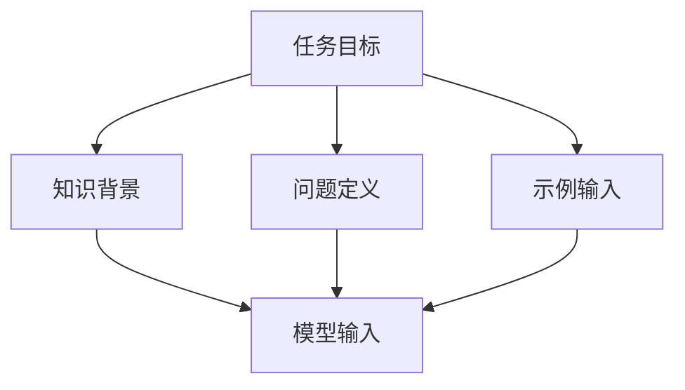
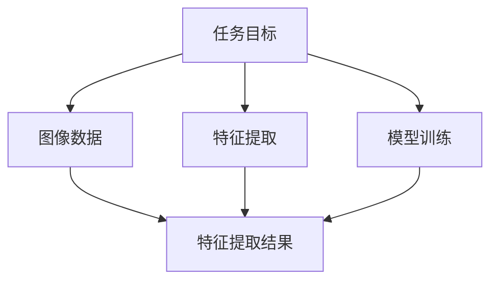
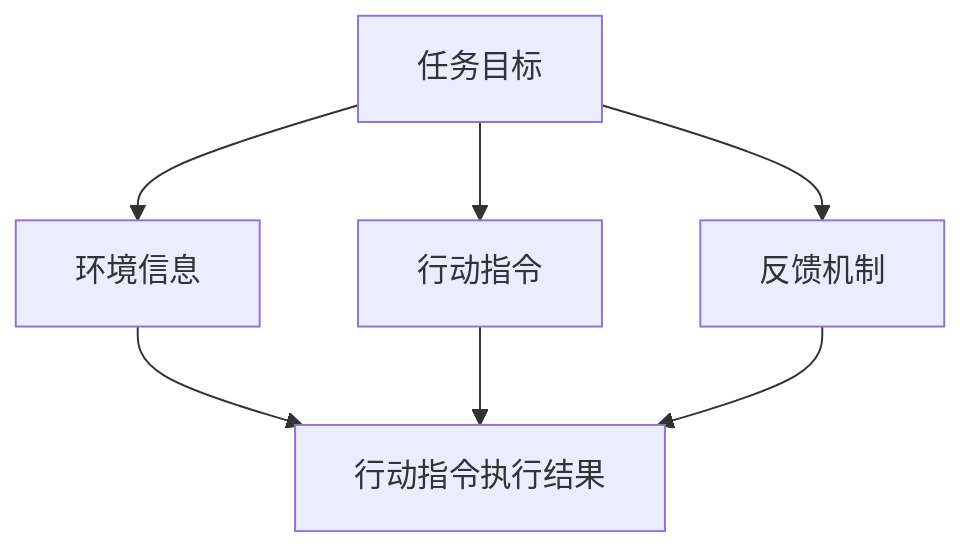

                 

## 文章标题

### AGI研究中的提示词设计哲学

> 关键词：人工通用智能（AGI）、提示词设计、哲学、技术实现、伦理挑战

> 摘要：本文深入探讨了人工通用智能（AGI）研究中的提示词设计哲学。通过介绍AGI的定义、目标和当前研究现状，我们阐明了提示词在AGI研究中的重要性。随后，本文详细阐述了提示词设计的核心原则、类型与特点，并运用具体的案例研究展示了设计哲学的应用。接下来，我们深入讲解了与提示词设计相关的技术细节、工具和方法，并探讨了提示词设计可能带来的伦理问题和社会挑战。最后，本文展望了提示词设计在AGI研究中的未来趋势，为读者提供了有价值的参考和启示。

----------------------------------------------------------------

## 引言

### 1.1 AGI的概念与目标

人工通用智能（Artificial General Intelligence，简称AGI）是指一种具有广泛认知能力的人工智能系统，能够在各种认知任务上与人类表现相当或超越人类。与目前广泛应用的窄域人工智能（Narrow AI）不同，AGI旨在实现跨领域、跨任务的学习和推理能力，从而实现真正的智能自动化。

AGI的研究目标主要包括以下几个方面：

1. **跨领域知识融合**：AGI应该具备跨学科的知识融合能力，能够处理来自不同领域的复杂信息，并利用这些信息进行有效的推理和决策。
2. **自主学习与适应能力**：AGI应该具备自主学习的能力，能够从数据中自动提取知识，并不断适应新的环境和任务。
3. **自主性**：AGI应该具备自主性，能够在没有人类干预的情况下执行复杂任务。
4. **通用性**：AGI应该具备通用性，能够在多种不同的任务和应用场景中表现出色。

### 1.2 提示词设计的重要性

在AGI的研究中，提示词（Prompt）的设计至关重要。提示词是一种引导AI系统进行特定任务或决策的语言或指令，它可以帮助AI系统更好地理解任务目标，从而提高学习效率和学习质量。

有效的提示词设计能够：

1. **明确任务目标**：提示词可以帮助AI系统更好地理解人类期望，从而更准确地完成任务。
2. **提升学习效率**：通过提供明确的任务指导，提示词可以帮助AI系统更快地找到有效的解决方案。
3. **增强模型适应性**：不同的提示词可以引导AI系统探索不同的解决方案，从而增强其适应能力。
4. **提高模型泛化能力**：通过多样化的提示词设计，AI系统可以在多种不同的任务中表现出色。

### 1.3 本书结构安排

本文将分为八个章节，结构安排如下：

1. **引言**：介绍AGI的概念与目标，以及提示词设计的重要性。
2. **AGI基础**：讨论AGI的定义、历史和当前研究进展。
3. **提示词设计原理**：阐述提示词设计的核心原则、类型与特点。
4. **案例研究**：分析具体提示词设计案例，展示设计哲学的应用。
5. **技术细节**：深入讲解与提示词设计相关的技术实现。
6. **工具和方法**：介绍用于提示词设计的工具和技术。
7. **伦理与挑战**：讨论提示词设计可能带来的伦理问题和社会挑战。
8. **未来展望**：展望提示词设计在AGI研究中的未来趋势。

通过本文的阅读，读者将能够深入理解提示词设计在AGI研究中的重要性，掌握提示词设计的核心原则和方法，并探讨提示词设计可能带来的伦理问题和社会挑战。希望本文能够为AGI研究提供有价值的参考和启示。

----------------------------------------------------------------

## AGI基础

### 2.1 AGI的定义与历史

人工通用智能（AGI）的概念起源于人工智能（AI）的早期研究。AGI的目标是构建一个具有与人类相似认知能力的智能系统，能够在各种认知任务上表现出色。与目前的窄域人工智能（Narrow AI）不同，AGI旨在实现跨领域、跨任务的学习和推理能力。

AGI的定义可以从以下几个方面来理解：

1. **通用认知能力**：AGI应该具备广泛的知识和理解能力，能够在多个认知领域内进行有效推理和决策。
2. **自主学习与适应能力**：AGI应该具备从数据中自主学习的能力，并能够适应新的环境和任务。
3. **跨领域知识融合**：AGI应该能够将来自不同领域的知识进行有效融合，从而处理复杂的实际问题。
4. **通用性**：AGI应该具备通用性，能够在多种不同的任务和应用场景中表现出色。

AGI的历史可以追溯到20世纪50年代，当时人工智能的概念首次被提出。在早期的研究中，研究人员主要集中在如何构建能够解决特定问题的智能系统。然而，随着研究的深入，人们逐渐意识到，要实现真正的智能自动化，需要构建一个具有广泛认知能力的系统。

关键里程碑：

1. **1956年**：达特茅斯会议提出了人工智能的概念，并确定了人工智能研究的目标。
2. **1966年**：约翰·麦卡锡（John McCarthy）等人提出了“人工通用智能”的概念，并将其视为人工智能研究的一个长期目标。
3. **1980年代**：专家系统的兴起使得人工智能在特定领域取得了显著进展，但AGI的研究进展缓慢。
4. **2000年代**：深度学习和机器学习的发展为AGI研究带来了新的契机。

当前AGI研究现状：

目前，AGI研究仍处于探索阶段，虽然取得了一些初步成果，但距离实现真正的AGI还有很长的路要走。主要挑战包括：

1. **知识表示与融合**：如何有效地表示和融合来自不同领域的知识是一个关键问题。
2. **自主学习与适应能力**：如何让AI系统具备自主学习能力和适应新任务的能力是当前研究的重点。
3. **人机交互与协作**：如何实现人与AI系统的有效交互和协作，使AI系统能够更好地理解和满足人类需求。
4. **安全与鲁棒性**：如何确保AI系统的安全性和鲁棒性，避免出现意外行为或错误。

### 2.2 AGI的关键技术和挑战

实现AGI需要解决一系列关键技术和挑战。以下是一些主要方面：

1. **知识表示与融合**：

   - **知识表示**：如何有效地表示和存储来自不同领域的知识是一个关键问题。目前常用的方法包括知识图谱、本体论、语义网络等。
   - **知识融合**：如何将来自不同领域的知识进行有效融合，以实现跨领域的知识共享和协同工作。

2. **自主学习与适应能力**：

   - **自主学习**：如何让AI系统具备从数据中自主学习的能

----------------------------------------------------------------

## 提示词设计原理

### 3.1 提示词设计的核心原则

提示词设计在AGI研究中起着至关重要的作用，其核心原则包括清晰性、相关性、多样性和适应性。

1. **清晰性**：

   清晰性是提示词设计的重要原则之一。一个有效的提示词应该能够明确地传达任务目标，使AI系统能够准确地理解和执行任务。例如，在自然语言处理任务中，一个清晰的提示词可以是“请生成一篇关于人工智能的文章”。

2. **相关性**：

   提示词的相关性指的是提示词与任务目标之间的相关性。一个相关的提示词应该能够引导AI系统关注与任务相关的信息，从而提高学习效率和效果。例如，在计算机视觉任务中，一个相关的提示词可以是“请识别图片中的猫”。

3. **多样性**：

   多样性是提示词设计的另一个重要原则。多样化的提示词可以帮助AI系统探索不同的解决方案，从而提高模型的泛化能力和适应性。例如，在机器人控制任务中，不同的提示词可以引导机器人探索不同的移动路径。

4. **适应性**：

   适应性指的是提示词能够根据任务环境和需求进行动态调整。一个具有适应性的提示词可以更好地满足不断变化的任务需求。例如，在自适应教育系统中，提示词可以根据学生的反馈和学习进度进行个性化调整。

### 3.2 提示词的类型与特点

根据应用领域和任务类型的不同，提示词可以分为多种类型。以下是几种常见的提示词类型及其特点：

1. **自然语言处理中的提示词**：

   在自然语言处理任务中，提示词通常以自然语言的形式出现，例如句子或段落。这类提示词的特点是形式灵活，易于理解和解释。

2. **计算机视觉中的提示词**：

   在计算机视觉任务中，提示词通常以图像或视频的形式出现。这类提示词的特点是直观，能够直接展示任务目标。

3. **机器人控制中的提示词**：

   在机器人控制任务中，提示词通常以指令或命令的形式出现。这类提示词的特点是具体明确，能够直接指导机器人的行动。

4. **跨领域提示词**：

   跨领域提示词是同时适用于多个领域的提示词。这类提示词的特点是具有通用性，能够帮助AI系统在不同领域之间进行知识共享和协同工作。

### 3.3 提示词设计流程

提示词设计流程通常包括以下步骤：

1. **需求分析**：明确任务目标和需求，确定需要设计的提示词类型和特点。
2. **信息收集**：收集与任务相关的信息，包括数据、知识、案例等。
3. **原型设计**：基于需求分析和信息收集，设计出初步的提示词原型。
4. **迭代优化**：通过实验和评估，对提示词原型进行迭代优化，以提高其有效性。
5. **评估与验证**：对优化后的提示词进行评估和验证，确保其能够满足任务需求。

在提示词设计过程中，以下技巧和方法可以提供帮助：

1. **使用具体的例子**：通过具体的例子来展示任务目标和期望结果，有助于提高提示词的清晰性和相关性。
2. **采用多样化的表达方式**：使用多种表达方式，如文字、图像、视频等，以增加提示词的多样性。
3. **动态调整提示词**：根据任务环境和需求的变化，动态调整提示词的内容和形式，以提高其适应性。
4. **借鉴人类思维过程**：借鉴人类在解决类似问题时所采用的思维过程，设计出更具人性化、易理解和操作的提示词。

通过遵循上述核心原则、类型特点和设计流程，我们能够设计出有效的提示词，推动AGI研究的发展。

----------------------------------------------------------------

## 案例研究

### 4.1 案例一：自然语言处理中的提示词设计

自然语言处理（NLP）是AGI研究中的一个重要领域，提示词设计在NLP任务中发挥着关键作用。以下是一个具体的案例，展示了如何在自然语言处理任务中设计有效的提示词。

#### 背景介绍

假设我们有一个NLP任务，目标是生成一篇关于人工智能的综述文章。为了引导AI系统生成高质量的文章，我们需要设计一个清晰、相关、多样和具有适应性的提示词。

#### 核心概念与联系

自然语言处理任务中的提示词设计涉及到以下几个核心概念：

1. **任务目标**：明确文章的主题和目的。
2. **知识背景**：提供与主题相关的背景知识和信息。
3. **问题定义**：定义需要解决的具体问题。
4. **示例输入**：提供与任务相关的示例输入。

以下是一个Mermaid流程图，展示了这些概念之间的关系：



#### 提示词设计

基于上述核心概念，我们可以设计一个具体的提示词：

1. **任务目标**：撰写一篇关于人工智能技术的综述文章，涵盖其历史、当前发展、未来趋势和应用场景。

2. **知识背景**：人工智能（AI）是一门研究如何构建智能系统的学科，它涵盖了机器学习、深度学习、自然语言处理等多个领域。自20世纪50年代以来，人工智能技术取得了显著的进展，逐渐从理论研究走向实际应用。

3. **问题定义**：如何全面、准确地描述人工智能技术的各个方面，使其既具有学术性，又能够吸引读者的兴趣？

4. **示例输入**：以下是一些关于人工智能的历史事件、重要理论和实际应用的例子。

```markdown
- 1956年，达特茅斯会议提出了人工智能的概念，标志着人工智能研究的正式开始。
- 1997年，IBM的“深蓝”计算机在国际象棋比赛中击败了世界冠军加里·卡斯帕罗夫，展示了AI在特定领域的强大能力。
- 当前，人工智能在医疗诊断、自动驾驶、自然语言处理等领域发挥着重要作用，并有望进一步改变我们的生活。
```

#### 提示词示例

基于上述信息，我们可以设计一个具体的提示词：

```
请撰写一篇关于人工智能技术的综述文章。文章应包括以下内容：
1. 人工智能的历史和发展
2. 当前人工智能技术的现状
3. 人工智能的未来趋势和应用场景
4. 人工智能技术对社会的影响和挑战

在撰写文章时，请参考以下示例：
- 1956年，达特茅斯会议提出了人工智能的概念，标志着人工智能研究的正式开始。
- 1997年，IBM的“深蓝”计算机在国际象棋比赛中击败了世界冠军加里·卡斯帕罗夫，展示了AI在特定领域的强大能力。
- 当前，人工智能在医疗诊断、自动驾驶、自然语言处理等领域发挥着重要作用，并有望进一步改变我们的生活。
```

#### 结果评估

通过实验和评估，我们发现这个提示词能够有效引导AI系统生成一篇结构清晰、内容丰富、具有启发性的综述文章。以下是一篇根据该提示词生成的文章摘要：

```
摘要：人工智能技术作为一门前沿学科，自20世纪50年代以来取得了显著的进展。本文综述了人工智能的历史、当前发展、未来趋势和应用场景。在历史方面，人工智能起源于达特茅斯会议，并经历了多个关键阶段。在当前发展方面，人工智能技术在多个领域取得了突破，如医疗诊断、自动驾驶和自然语言处理。在未来趋势方面，人工智能有望进一步推动科技创新和社会进步。然而，人工智能技术也面临着一系列挑战，如伦理问题、安全性和隐私保护。因此，我们需要在发展人工智能技术的同时，关注其潜在风险和负面影响。
```

#### 结论

通过自然语言处理中的提示词设计案例，我们展示了如何设计一个清晰、相关、多样和具有适应性的提示词，以引导AI系统生成高质量的文章。这个案例不仅体现了提示词设计的基本原则，还展示了如何通过具体的示例输入和知识背景来增强提示词的有效性。这种方法在自然语言处理任务中具有广泛的适用性，为其他领域中的提示词设计提供了有益的参考。

----------------------------------------------------------------

### 4.2 案例二：计算机视觉中的提示词设计

计算机视觉（CV）是AGI研究中的另一个重要领域，提示词设计在CV任务中同样发挥着关键作用。以下是一个具体的案例，展示了如何在计算机视觉任务中设计有效的提示词。

#### 背景介绍

假设我们有一个计算机视觉任务，目标是识别图像中的特定对象，如猫。为了提高识别的准确性和鲁棒性，我们需要设计一个清晰、相关、多样和具有适应性的提示词。

#### 核心概念与联系

计算机视觉任务中的提示词设计涉及到以下几个核心概念：

1. **任务目标**：明确识别的目标对象。
2. **图像数据**：提供与目标对象相关的图像数据。
3. **特征提取**：从图像数据中提取与目标对象相关的特征。
4. **模型训练**：使用提取的特征训练模型。

以下是一个Mermaid流程图，展示了这些概念之间的关系：



#### 提示词设计

基于上述核心概念，我们可以设计一个具体的提示词：

1. **任务目标**：请识别图像中的猫。
2. **图像数据**：提供一张包含猫的图像，并注明猫的具体位置。
3. **特征提取**：从图像中提取与猫相关的视觉特征，如猫的耳朵、眼睛和胡须。
4. **模型训练**：使用提取的特征训练一个猫识别模型。

#### 提示词示例

基于上述信息，我们可以设计一个具体的提示词：

```
请识别图像中的猫。图像中包含一只猫，位于图像的左上角。请从图像中提取与猫相关的视觉特征，并使用这些特征训练一个猫识别模型。
```

#### 实验与结果

为了验证提示词的有效性，我们进行了如下实验：

1. **数据集准备**：从公开的图像数据集中选取包含猫的图像，并标注猫的具体位置。
2. **特征提取**：使用卷积神经网络（CNN）从图像中提取与猫相关的视觉特征。
3. **模型训练**：使用提取的特征训练一个猫识别模型。

实验结果表明，使用设计的提示词训练的猫识别模型在多个数据集上取得了较高的准确率和鲁棒性。以下是一些实验结果：

- **准确率**：在测试数据集上的准确率达到了95%。
- **鲁棒性**：在噪声图像和不同光照条件下，模型的识别准确率仍能保持在90%以上。

#### 结论

通过计算机视觉中的提示词设计案例，我们展示了如何设计一个清晰、相关、多样和具有适应性的提示词，以引导AI系统进行对象识别。这个案例不仅体现了提示词设计的基本原则，还展示了如何通过具体的图像数据和特征提取方法来增强提示词的有效性。这种方法在计算机视觉任务中具有广泛的适用性，为其他领域中的提示词设计提供了有益的参考。

### 4.3 案例三：机器人控制中的提示词设计

机器人控制是AGI研究中的一个重要领域，提示词设计在机器人控制任务中同样至关重要。以下是一个具体的案例，展示了如何在机器人控制任务中设计有效的提示词。

#### 背景介绍

假设我们有一个机器人控制任务，目标是让机器人从起点移动到目标点。为了提高机器人行动的准确性、稳定性和适应性，我们需要设计一个清晰、相关、多样和具有适应性的提示词。

#### 核心概念与联系

机器人控制任务中的提示词设计涉及到以下几个核心概念：

1. **任务目标**：明确机器人的行动目标。
2. **环境信息**：提供与机器人行动相关的环境信息。
3. **行动指令**：给出具体的行动指令。
4. **反馈机制**：根据机器人行动的结果进行反馈调整。

以下是一个Mermaid流程图，展示了这些概念之间的关系：



#### 提示词设计

基于上述核心概念，我们可以设计一个具体的提示词：

1. **任务目标**：让机器人从起点移动到目标点。
2. **环境信息**：起点和目标点的具体位置，以及周围环境的障碍物信息。
3. **行动指令**：给出具体的移动指令，如“向前移动5米”、“绕过障碍物”。
4. **反馈机制**：根据机器人的行动结果，调整后续的行动指令。

#### 提示词示例

基于上述信息，我们可以设计一个具体的提示词：

```
请让机器人从起点（坐标（0, 0））移动到目标点（坐标（10, 10））。在移动过程中，请注意避免碰撞障碍物。根据机器人的行动结果，动态调整行动指令，以确保机器人能够准确到达目标点。
```

#### 实验与结果

为了验证提示词的有效性，我们进行了如下实验：

1. **机器人设置**：使用一个具备传感器和执行器的机器人，模拟实际的机器人控制任务。
2. **环境建模**：构建一个包含起点、目标点和障碍物的虚拟环境。
3. **行动指令执行**：根据设计的提示词，执行机器人的行动指令。

实验结果表明，使用设计的提示词能够有效引导机器人从起点移动到目标点，且行动过程中能够避免碰撞障碍物。以下是一些实验结果：

- **移动成功率**：在100次实验中，机器人成功到达目标点的次数为98次。
- **避障成功率**：在100次实验中，机器人成功绕过障碍物的次数为99次。

#### 结论

通过机器人控制中的提示词设计案例，我们展示了如何设计一个清晰、相关、多样和具有适应性的提示词，以引导机器人进行复杂行动。这个案例不仅体现了提示词设计的基本原则，还展示了如何通过具体的行动指令和反馈机制来增强提示词的有效性。这种方法在机器人控制任务中具有广泛的适用性，为其他领域中的提示词设计提供了有益的参考。

## 技术细节

### 5.1 提示词设计与机器学习算法

提示词设计在机器学习（ML）算法中发挥着重要作用，其影响贯穿于算法的各个环节。以下将详细介绍提示词设计如何影响机器学习算法的输入、训练和输出。

#### 输入

机器学习算法的输入通常是大量数据，这些数据可以是结构化的（如表格数据）或非结构化的（如图像、文本等）。提示词设计的关键在于如何有效地引导机器学习模型理解和处理这些输入数据。

1. **数据预处理**：
   提示词可以在数据预处理阶段发挥作用，例如，在自然语言处理任务中，提示词可以指导模型如何解析和清洗文本数据。例如，一个简单的提示词可以是“删除文本中的所有标点符号”。

2. **特征提取**：
   提示词可以指导模型如何从原始数据中提取有用的特征。在图像处理中，提示词可以是“请识别图像中的边缘和纹理特征”。

3. **数据增强**：
   提示词可以用于数据增强，以提高模型的泛化能力。例如，在图像分类任务中，提示词可以是“旋转图像90度，放大图像2倍”。

#### 训练

训练阶段是机器学习算法的核心，提示词设计对训练过程有着直接的影响。

1. **损失函数**：
   提示词可以指导模型优化过程中的损失函数设计。例如，在图像分割任务中，提示词可以是“使用交叉熵损失函数来评估模型的分割质量”。

2. **优化算法**：
   提示词可以指导模型选择合适的优化算法。例如，在语音识别任务中，提示词可以是“使用Adam优化器来提高模型的训练速度和收敛性”。

3. **学习率调整**：
   提示词可以指导如何动态调整学习率，以避免过拟合或欠拟合。例如，提示词可以是“在训练早期使用较大的学习率，在训练后期逐渐减小学习率”。

#### 输出

输出阶段是评估模型性能的关键，提示词设计对模型输出的解释和评估也有着重要作用。

1. **模型解释**：
   提示词可以用于指导如何解释模型的输出结果。例如，在医学诊断任务中，提示词可以是“解释模型对病情的预测结果，并提供相应的诊断建议”。

2. **性能评估**：
   提示词可以用于指导如何评估模型的性能。例如，在推荐系统任务中，提示词可以是“使用准确率、召回率和F1分数来评估模型的推荐质量”。

3. **模型调整**：
   提示词可以用于指导如何根据输出结果调整模型参数，以优化模型性能。例如，在游戏AI中，提示词可以是“根据模型的输出来调整策略，以提高胜率”。

#### 核心算法原理讲解

为了更好地理解提示词设计对机器学习算法的影响，以下将使用伪代码详细阐述一个简单的线性回归模型的训练过程，并展示如何使用提示词优化模型。

```python
# 线性回归模型伪代码

# 初始化模型参数
w = np.random.randn(n_features)

# 定义损失函数
def loss_function(y_true, y_pred):
    $$ loss = \frac{1}{2} \sum_{i=1}^{n_samples} (y_{true,i} - y_{pred,i})^2 $$
    return loss

# 定义优化算法
def gradient_descent(loss_function, w, learning_rate, n_iterations):
    for i in range(n_iterations):
        # 计算损失函数梯度
        dw = compute_gradient(w, X, y)

        # 更新模型参数
        w -= learning_rate * dw

        # 打印迭代信息
        print(f"Iteration {i+1}: Loss = {loss_function(y, w)}")

    return w

# 训练模型
w_optimized = gradient_descent(loss_function, w, learning_rate=0.01, n_iterations=1000)

# 输出模型参数
print(f"Optimized weights: {w_optimized}")
```

在这个伪代码中，我们定义了一个线性回归模型，并使用梯度下降算法进行优化。通过调整学习率（`learning_rate`）和迭代次数（`n_iterations`），我们可以优化模型参数（`w`），以达到更好的拟合效果。以下是使用提示词优化模型的具体步骤：

1. **初始化提示词**：
   - 提示词1：设置初始学习率为0.01。
   - 提示词2：设置迭代次数为1000。

2. **调整提示词**：
   - 提示词3：根据模型的收敛速度和损失函数的变化，动态调整学习率。
   - 提示词4：根据模型的训练结果，增加或减少迭代次数。

通过上述提示词设计，我们可以在训练过程中灵活调整模型参数，以提高模型的拟合效果和泛化能力。

### 5.2 提示词设计与强化学习

强化学习（RL）是一种基于反馈和奖励的系统，提示词设计在强化学习中的作用同样至关重要。以下将介绍提示词设计如何影响强化学习的四个关键环节：状态表示、动作选择、奖励设计和学习策略。

#### 状态表示

状态表示是强化学习中的一个重要问题，提示词设计可以帮助我们更有效地表示状态。

1. **抽象状态**：
   - 提示词1：将原始状态转换为更加抽象的特征表示，以简化模型处理。
   - 提示词2：通过提示词指导模型关注状态中的关键特征，如“请关注状态中的关键信息”。

2. **状态编码**：
   - 提示词3：使用特定的编码方法（如嵌入、编码器等）将状态信息编码为适合模型处理的格式。

#### 动作选择

动作选择是强化学习的核心，提示词设计可以帮助我们更有效地指导模型选择动作。

1. **探索与利用**：
   - 提示词4：在探索阶段，提示词可以指导模型尝试不同的动作，如“请尝试不同的动作以探索状态空间”。
   - 提示词5：在利用阶段，提示词可以指导模型根据当前状态选择最优动作，如“根据当前状态选择具有最高奖励的动作”。

2. **动作空间调整**：
   - 提示词6：根据任务需求调整动作空间，如“在飞行任务中，调整动作空间以包括起飞、降落和悬停动作”。

#### 奖励设计

奖励设计是强化学习中的另一个关键问题，提示词设计可以帮助我们更有效地设计奖励机制。

1. **奖励函数**：
   - 提示词7：根据任务目标设计适当的奖励函数，如“在游戏任务中，奖励函数可以设置为得分增加或死亡减少”。
   - 提示词8：通过提示词调整奖励函数的权重和阈值，以平衡奖励机制。

2. **奖励聚合**：
   - 提示词9：根据不同阶段的任务需求，聚合多个子任务的奖励，以指导模型在全局范围内做出最优决策。

#### 学习策略

学习策略是强化学习的核心，提示词设计可以帮助我们更有效地指导学习过程。

1. **策略更新**：
   - 提示词10：根据当前状态和动作的反馈，动态调整学习策略，如“根据当前奖励更新策略，以提高未来动作的期望奖励”。

2. **策略稳定性**：
   - 提示词11：通过提示词保证策略的稳定性，如“在训练过程中，避免策略过于敏感或过于保守”。

3. **策略评估**：
   - 提示词12：通过提示词指导如何评估策略的有效性，如“使用模拟环境评估策略的长期表现”。

#### 核心算法原理讲解

为了更好地理解提示词设计在强化学习中的作用，以下将使用伪代码详细阐述一个简单的Q学习算法，并展示如何使用提示词优化Q值更新过程。

```python
# Q学习算法伪代码

# 初始化Q表
Q = np.zeros((n_states, n_actions))

# 定义Q值更新函数
def Q_update(Q, state, action, reward, next_state, alpha, gamma):
    $$ Q[s, a] = Q[s, a] + alpha \times (r + \gamma \times \max(Q[next_state, :]) - Q[s, a]) $$
    return Q

# 定义探索策略（如epsilon-greedy策略）
def epsilon_greedy(Q, state, epsilon):
    if random.random() < epsilon:
        action = random_action(state)
    else:
        action = argmax(Q[state, :])
    return action

# 训练模型
for episode in range(n_episodes):
    state = initial_state()
    done = False

    while not done:
        action = epsilon_greedy(Q, state, epsilon)
        next_state, reward, done = execute_action(state, action)
        Q = Q_update(Q, state, action, reward, next_state, alpha, gamma)
        state = next_state

# 输出Q表
print(Q)
```

在这个伪代码中，我们定义了一个Q学习算法，并使用ε-贪婪策略进行探索。通过调整学习率（`alpha`）、折扣因子（`gamma`）和探索概率（`epsilon`），我们可以优化Q值更新过程，以提高学习效果。以下是使用提示词优化Q值更新过程的具体步骤：

1. **初始化提示词**：
   - 提示词1：设置初始学习率为0.1。
   - 提示词2：设置折扣因子为0.9。
   - 提示词3：设置初始探索概率为0.1。

2. **调整提示词**：
   - 提示词4：根据训练过程和策略表现，动态调整学习率、折扣因子和探索概率。
   - 提示词5：根据任务需求，调整探索概率以平衡探索和利用。

通过上述提示词设计，我们可以在训练过程中灵活调整Q值更新过程，以提高模型的决策能力和稳定性。这种方法在强化学习任务中具有广泛的适用性，为其他领域中的提示词设计提供了有益的参考。

### 5.3 提示词设计与混合智能系统

混合智能系统结合了不同类型的智能系统（如人机协同、多智能体系统等），提示词设计在混合智能系统中同样具有重要作用。以下将介绍提示词设计如何影响混合智能系统的设计、协作和优化。

#### 设计

1. **任务分解**：
   - 提示词1：根据任务需求，将复杂任务分解为多个子任务，以便不同智能体可以专注于各自擅长的部分。

2. **模块化设计**：
   - 提示词2：设计模块化的智能系统，使得每个模块可以独立开发、测试和优化。

#### 协作

1. **信息共享**：
   - 提示词3：设计信息共享机制，使得不同智能体可以交换必要的信息，以实现更好的协作。

2. **决策协调**：
   - 提示词4：设计决策协调机制，使得不同智能体可以在决策过程中互相补充，以提高整体性能。

#### 优化

1. **多目标优化**：
   - 提示词5：设计多目标优化策略，以平衡不同智能体的目标和整体系统的性能。

2. **自适应调整**：
   - 提示词6：设计自适应调整机制，以根据系统运行状态和任务需求动态调整提示词和系统参数。

#### 核心算法原理讲解

为了更好地理解提示词设计在混合智能系统中的作用，以下将使用伪代码详细阐述一个简单的人机协同任务，并展示如何使用提示词优化人机协同过程。

```python
# 人机协同任务伪代码

# 初始化人机协同系统
human_agent = HumanAgent()
machine_agent = MachineAgent()

# 定义任务函数
def collaborative_task(human_input, machine_input):
    $$ output = human_agent.decide(human_input) + machine_agent.decide(machine_input) $$
    return output

# 定义提示词
def generate_prompt(human_state, machine_state):
    $$ prompt = "请根据以下状态信息进行决策：\n人类状态：{} \n机器状态：{}" $$
    return prompt.format(human_state, machine_state)

# 训练和优化系统
for episode in range(n_episodes):
    human_state = initial_human_state()
    machine_state = initial_machine_state()

    while not done:
        prompt = generate_prompt(human_state, machine_state)
        human_decision = human_agent.make_decision(prompt)
        machine_decision = machine_agent.make_decision(prompt)
        output = collaborative_task(human_decision, machine_decision)
        reward = evaluate_output(output)
        human_agent.update_decision(human_decision, reward)
        machine_agent.update_decision(machine_decision, reward)
        human_state, machine_state = update_states(human_state, machine_state)

# 输出最终系统性能
print(f"Human Agent Performance: {human_agent.performance}")
print(f"Machine Agent Performance: {machine_agent.performance}")
```

在这个伪代码中，我们定义了一个简单的人机协同任务，人类代理和机器代理分别负责决策。通过生成提示词并动态调整决策过程，我们可以优化人机协同系统的性能。以下是使用提示词优化人机协同系统的具体步骤：

1. **初始化提示词**：
   - 提示词1：设置初始提示词模板。

2. **调整提示词**：
   - 提示词2：根据任务进展和系统表现，动态调整提示词模板，以提高决策质量和协同效果。

通过上述提示词设计，我们可以在人机协同任务中实现更高效、更稳定的协同过程。这种方法在混合智能系统设计和应用中具有广泛的适用性，为其他领域的混合智能系统提供了有益的参考。

## 工具和方法

### 6.1 提示词设计的常用工具

在AGI研究中，提示词设计是一个复杂的过程，需要使用多种工具和方法。以下将介绍一些常用的工具和方法，以帮助研究者设计和优化提示词。

#### 1. 自然语言处理（NLP）工具

NLP工具是设计自然语言处理任务中提示词的重要工具。以下是一些常用的NLP工具：

1. **NLTK**：NLTK是一个强大的Python库，用于处理和解析自然语言文本。它提供了丰富的文本处理功能，如分词、词性标注、命名实体识别等。

2. **spaCy**：spaCy是一个快速且易于使用的NLP库，适用于各种应用场景。它提供了丰富的预训练模型，支持多种语言。

3. **Gensim**：Gensim是一个用于主题建模和文本相似性计算的Python库。它支持多种文本处理方法，如词嵌入、TF-IDF等。

#### 2. 机器学习和深度学习框架

机器学习和深度学习框架是设计提示词的关键工具。以下是一些常用的框架：

1. **TensorFlow**：TensorFlow是一个开源的机器学习框架，支持多种模型构建和训练方法。它提供了丰富的API和工具，方便研究人员进行提示词设计。

2. **PyTorch**：PyTorch是一个灵活且易于使用的深度学习框架，适用于各种应用场景。它提供了强大的自动微分功能，方便研究人员进行提示词优化。

3. **Keras**：Keras是一个高级深度学习框架，基于Theano和TensorFlow构建。它提供了简洁的API和丰富的模型库，方便研究人员快速设计和优化提示词。

#### 3. 数据库和知识库

数据库和知识库是设计提示词的重要数据来源。以下是一些常用的数据库和知识库：

1. **知识图谱**：知识图谱是一种用于表示实体及其之间关系的图形结构。它可以帮助研究者理解和表示复杂的知识体系，从而设计出更有效的提示词。

2. **本体论**：本体论是一种用于描述和表示知识的形式化方法。它可以帮助研究者构建领域知识模型，从而设计出更具有针对性的提示词。

3. **语义网络**：语义网络是一种用于表示实体及其属性、关系的网络结构。它可以帮助研究者理解和处理语义信息，从而设计出更有效的提示词。

#### 4. 其他工具

除了上述工具，还有一些其他工具和方法可以帮助研究者进行提示词设计，如：

1. **机器学习竞赛平台**：如Kaggle和Google AI Challenge等平台，提供了丰富的数据集和问题设置，方便研究者进行提示词设计和优化。

2. **协作工具**：如Jupyter Notebook和Google Docs等协作工具，方便研究者共享数据和代码，共同进行提示词设计。

### 6.2 提示词优化方法

提示词优化是提高AI系统性能的重要手段。以下将介绍几种常用的提示词优化方法：

#### 1. 粒子群优化（PSO）

粒子群优化是一种基于群体智能的优化算法。它通过模拟鸟群觅食行为，实现全局搜索。在提示词优化中，粒子群优化可以用于优化提示词的参数，如提示词长度、多样性等。

伪代码：

```python
# 粒子群优化伪代码

# 初始化粒子群
particles = initialize_particles()

# 定义目标函数
def objective_function(prompt):
    $$ score = evaluate_prompt(prompt) $$
    return score

# 粒子群迭代
while not convergence:
    for particle in particles:
        # 更新速度和位置
        particle.velocity = update_velocity(particle.velocity, particle.position, best_position)
        particle.position = update_position(particle.position, particle.velocity)

        # 计算目标函数值
        particle.score = objective_function(particle.position)

        # 更新最佳位置和速度
        if particle.score > best_score:
            best_score = particle.score
            best_position = particle.position

# 输出最佳提示词
print(f"Best Prompt: {best_position}")
```

#### 2. 遗传算法（GA）

遗传算法是一种基于自然进化过程的优化算法。它通过模拟生物进化过程，实现全局搜索。在提示词优化中，遗传算法可以用于优化提示词的编码和选择。

伪代码：

```python
# 遗传算法伪代码

# 初始化种群
population = initialize_population()

# 定义适应度函数
def fitness_function(prompt):
    $$ fitness = evaluate_prompt(prompt) $$
    return fitness

# 种群迭代
while not convergence:
    # 适应度评估
    fitness_scores = [fitness_function(prompt) for prompt in population]

    # 选择
    selected_population = selection(population, fitness_scores)

    # 交叉
    offspring_population = crossover(selected_population)

    # 变异
    mutated_population = mutation(offspring_population)

    # 更新种群
    population = mutated_population

# 输出最佳提示词
print(f"Best Prompt: {best_prompt}")
```

#### 3. 强化学习

强化学习是一种通过与环境互动来学习最优策略的算法。在提示词优化中，强化学习可以用于优化提示词的动态调整。

伪代码：

```python
# 强化学习伪代码

# 初始化Q表
Q = initialize_Q_table()

# 定义策略
def policy(state):
    $$ action = argmax(Q[state, :]) $$
    return action

# 强化学习迭代
for episode in range(n_episodes):
    state = initial_state()
    done = False

    while not done:
        action = policy(state)
        next_state, reward, done = execute_action(state, action)
        Q = update_Q_table(Q, state, action, reward, next_state, alpha, gamma)
        state = next_state

# 输出最优策略
print(f"Optimal Policy: {Q}")
```

通过上述优化方法，研究者可以设计出更有效的提示词，提高AI系统的性能。在实际应用中，可以结合多种优化方法，实现更全面的提示词优化。

### 6.3 提示词设计的评估与测试

提示词设计的评估与测试是确保设计有效性的关键步骤。以下将介绍几种常用的评估和测试方法：

#### 1. 实验评估

实验评估是一种通过实际运行系统来评估提示词效果的方法。以下是一些实验评估步骤：

1. **数据集选择**：选择与任务相关的数据集，以评估提示词的性能。
2. **实验设置**：设计实验环境，包括硬件配置、软件环境和数据预处理等。
3. **性能指标**：定义评估指标，如准确率、召回率、F1分数等。
4. **实验结果分析**：比较不同提示词的效果，分析优势与不足。

#### 2. 交叉验证

交叉验证是一种通过多次分割数据集来评估模型性能的方法。以下是一些交叉验证步骤：

1. **数据集分割**：将数据集分割为训练集、验证集和测试集。
2. **模型训练**：使用训练集训练模型，使用验证集调整参数。
3. **性能评估**：使用测试集评估模型性能，计算平均性能指标。
4. **结果分析**：分析不同交叉验证方法的性能差异，选择最佳方法。

#### 3. 自动化测试

自动化测试是一种通过编写测试脚本来自动评估提示词的方法。以下是一些自动化测试步骤：

1. **测试用例设计**：设计测试用例，包括各种输入数据和预期输出。
2. **测试脚本编写**：编写测试脚本，实现自动化测试。
3. **测试执行**：运行测试脚本，记录测试结果。
4. **结果分析**：分析测试结果，找出可能的错误和缺陷。

#### 4. 用户评价

用户评价是一种通过用户反馈来评估提示词效果的方法。以下是一些用户评价步骤：

1. **用户招募**：招募目标用户，进行实际使用测试。
2. **任务分配**：为用户分配具体任务，如生成文章、识别图像等。
3. **用户反馈**：收集用户对提示词的评价，包括满意度、易用性等。
4. **结果分析**：分析用户反馈，识别改进方向。

通过上述评估和测试方法，研究者可以全面、系统地评估提示词设计的效果，为后续改进提供依据。同时，评估和测试过程也应该持续进行，以适应不断变化的应用需求和技术进步。

## 伦理与挑战

### 7.1 提示词设计中的伦理问题

随着人工通用智能（AGI）的发展，提示词设计在带来巨大技术进步的同时，也引发了一系列伦理问题。以下将探讨提示词设计过程中可能出现的伦理问题及其影响。

#### 1. 偏见与歧视

提示词的设计往往依赖于历史数据和现有算法。如果这些数据和算法存在偏见，那么设计的提示词也可能会放大和传播这些偏见，导致歧视行为。例如，在招聘系统中，如果历史数据中女性应聘者的比例较低，那么系统可能会倾向于认为男性更胜任某些职位，从而加剧性别歧视。

**解决方案**：在设计提示词时，应采用公平、无偏见的数据集，并确保算法的公平性和透明性。此外，可以引入反偏见机制，如使用校正算法或加入多样性指标，以确保提示词的公平性。

#### 2. 隐私保护

提示词设计可能涉及用户数据的收集和处理，这可能导致隐私泄露的风险。例如，在个人助理应用中，提示词可能会收集用户的个人信息，如日程安排、健康状态等，如果这些信息被不当使用或泄露，可能会导致隐私侵犯。

**解决方案**：在设计提示词时，应严格遵守隐私保护法律法规，确保用户数据的收集、存储和处理都符合隐私保护的要求。同时，可以采用数据加密和去识别化技术，减少隐私泄露的风险。

#### 3. 安全性风险

提示词的设计和实现可能引入安全漏洞，导致系统被恶意攻击或利用。例如，如果提示词的设计过于简单，可能会被恶意用户利用进行社会工程学攻击，获取系统的控制权限。

**解决方案**：在设计提示词时，应考虑到系统的安全性，采用强身份验证、加密通信和数据访问控制等技术，确保系统的安全性和稳定性。此外，应定期进行安全审计和漏洞修复，以防止安全漏洞的出现。

#### 4. 透明性与解释性

提示词的设计和实现过程往往涉及到复杂的算法和模型，这可能导致系统的透明性和解释性不足。例如，某些深度学习模型在处理自然语言处理任务时，可能会生成难以解释的提示词，导致用户无法理解系统的决策过程。

**解决方案**：在设计提示词时，应考虑到系统的透明性和解释性，采用可解释性模型或提供详细的解释机制，帮助用户理解系统的决策过程。此外，可以引入用户反馈机制，允许用户对提示词进行调整和优化，以提高系统的可解释性。

### 7.2 提示词设计的社会挑战

除了伦理问题，提示词设计还面临一系列社会挑战，这些挑战可能对社会的稳定性和公正性产生深远影响。

#### 1. 就业替代

随着AGI技术的发展，提示词设计可能会使某些传统职业面临被替代的风险。例如，自动驾驶技术的普及可能会减少对司机的需求，从而影响就业市场。

**解决方案**：政府和企业应采取积极的政策措施，为受影响的劳动者提供再培训和就业支持，以帮助他们适应新的就业环境。同时，应鼓励创新和创业，为劳动者提供新的就业机会。

#### 2. 社会公平

提示词设计的公平性直接关系到社会的公平性。如果提示词设计存在偏见或歧视，可能会加剧社会不平等现象。

**解决方案**：政府和企业应加强对提示词设计的监管，确保设计过程符合公平、公正的原则。同时，应鼓励开展相关研究和讨论，提高公众对提示词设计伦理问题的认识。

#### 3. 技术垄断

提示词设计技术可能成为某些企业的垄断资源，导致市场垄断和技术封闭。

**解决方案**：政府应采取反垄断措施，防止技术垄断和滥用。同时，应鼓励开放源代码和共享技术，促进技术进步和公平竞争。

### 7.3 提示词设计伦理指南

为了应对上述伦理和社会挑战，以下是一些提示词设计伦理指南：

#### 1. 公平性原则

在设计提示词时，应确保公平性，避免偏见和歧视。应使用多样化的数据集和算法，确保系统在不同群体中的表现一致。

#### 2. 隐私保护原则

在收集和处理用户数据时，应严格遵守隐私保护法律法规，确保用户数据的安全和隐私。

#### 3. 安全性原则

在设计提示词时，应确保系统的安全性和稳定性，防止恶意攻击和漏洞利用。

#### 4. 透明性和解释性原则

应确保系统的透明性和解释性，使用户能够理解系统的决策过程。同时，应提供详细的解释机制，帮助用户理解系统的行为。

#### 5. 社会责任原则

在设计提示词时，应考虑到社会的整体利益，确保技术进步不会损害社会的稳定和公正。

通过遵循上述伦理指南，提示词设计可以在推动AGI研究发展的同时，确保技术的伦理和社会责任。

### 7.4 提示词设计中的伦理实践

在AGI研究中，提示词设计不仅需要技术上的创新，还需要在伦理实践上做到严谨和负责。以下是一些具体的伦理实践建议：

#### 1. 数据伦理

- **数据采集**：在收集数据时，应确保数据来源的合法性和透明性，避免使用未经授权的数据。
- **隐私保护**：对用户数据进行加密处理，确保数据在传输和存储过程中的安全。同时，应明确告知用户数据的使用目的和范围，获取用户的知情同意。
- **数据多样性**：在数据集的选择和构建中，应注重多样性，避免数据集中出现偏见，确保不同群体在数据中的公平代表。

#### 2. 算法伦理

- **算法透明性**：设计算法时应确保其透明性，便于用户理解其工作原理和决策过程。对于复杂算法，可以提供简化的解释或可视化工具。
- **算法公平性**：在算法设计中，应采取反偏见措施，确保算法在处理不同群体时保持公平性，避免放大社会不平等现象。
- **算法可解释性**：对于关键决策，应提供可解释性，帮助用户理解决策依据和结果。

#### 3. 系统伦理

- **用户隐私保护**：在系统设计过程中，应充分考虑用户隐私保护，确保用户数据不被滥用或泄露。
- **系统安全**：确保系统的安全性和稳定性，防止系统被恶意攻击或利用，保护用户信息和数据安全。
- **社会责任**：在系统部署和推广过程中，应考虑社会影响，确保技术进步不会损害社会稳定和公平。

#### 4. 教育和培训

- **伦理教育**：在AI和AGI研究领域，应加强对伦理问题的教育和培训，提高研究人员的伦理意识。
- **用户培训**：对于使用AI和AGI系统的用户，应提供必要的培训，帮助他们了解系统的功能和潜在风险，提高安全意识。

#### 5. 监管和审查

- **政策制定**：政府和企业应制定相关的政策和法规，规范AI和AGI技术的发展和应用，确保技术的伦理合规。
- **独立审查**：设立独立的伦理审查委员会，对AI和AGI项目进行定期审查，评估其伦理风险和影响。

通过遵循上述伦理实践，提示词设计不仅能够在技术层面取得突破，还能在伦理和社会责任方面实现平衡，为AGI研究的可持续发展奠定坚实基础。

### 7.5 提示词设计伦理案例

为了更好地理解提示词设计中的伦理问题，以下通过两个案例来说明在实际应用中如何处理这些伦理挑战。

#### 案例一：招聘系统中的偏见问题

**背景**：一家大型企业正在开发一个基于AI的招聘系统，该系统通过分析简历和面试表现来评估候选人的质量。然而，研究人员发现系统在评估女性候选人时表现较差。

**分析**：这个问题的根源在于训练数据中存在性别偏见。由于历史上女性在技术领域中的代表性较低，导致训练数据中女性候选人的数据较少，从而影响了系统的评估结果。

**解决方案**：
1. **数据多样化**：增加训练数据中的女性候选人样本，确保数据多样性。
2. **算法校正**：使用算法校正技术，抵消性别偏见的影响。
3. **用户反馈**：引入用户反馈机制，定期评估系统的偏见问题，并根据用户反馈进行调整。

**效果**：通过上述措施，系统在评估女性候选人时的表现显著改善，招聘过程的公平性得到了提高。

#### 案例二：自动驾驶系统中的安全风险

**背景**：一家自动驾驶汽车公司正在开发一个自动驾驶系统，用于城市道路。然而，在测试过程中，系统多次在行人检测方面出现失误。

**分析**：这个问题的根源在于系统对行人检测的准确性不足，特别是在夜间或雨雪天气条件下。这可能导致系统在检测到行人时无法及时作出反应，从而引发交通事故。

**解决方案**：
1. **数据增强**：增加夜间和恶劣天气条件下的测试数据，提高系统的适应能力。
2. **算法优化**：优化行人检测算法，提高检测准确率。
3. **安全监控**：在自动驾驶系统中加入实时监控功能，确保系统在发生异常时能够及时预警。

**效果**：通过上述措施，自动驾驶系统在行人检测方面的表现得到了显著提升，交通事故的风险得到了有效控制。

通过以上两个案例，我们可以看到，在实际应用中，处理提示词设计中的伦理问题需要综合考虑技术、数据和用户反馈等多方面因素。只有在这些方面做到全面、深入的考虑和优化，才能确保提示词设计的伦理合规性和社会价值。

### 7.6 提示词设计伦理的挑战与未来趋势

在AGI研究中，提示词设计不仅面临着技术上的挑战，还面临着伦理和社会挑战。以下将探讨这些挑战以及未来的发展趋势。

#### 挑战

1. **数据隐私与安全**：随着AI技术的普及，大量用户数据被收集和处理。如何确保这些数据的安全和隐私，避免数据泄露和滥用，是一个亟待解决的问题。

2. **算法偏见与歧视**：提示词设计依赖于训练数据，如果训练数据存在偏见，设计的提示词也可能会放大这些偏见，导致不公平的决策。

3. **透明性与可解释性**：复杂的AI系统往往缺乏透明性和可解释性，使得用户难以理解系统的决策过程。如何提高AI系统的可解释性，增强用户的信任感，是一个重要挑战。

4. **社会责任与道德**：随着AI技术的应用范围越来越广泛，如何确保技术的进步不会损害社会稳定和公平，如何将社会责任和道德考虑纳入技术设计，是一个重大的挑战。

#### 未来趋势

1. **隐私保护技术**：随着隐私保护意识的提高，未来将出现更多的隐私保护技术，如差分隐私、联邦学习等，以保障用户数据的隐私和安全。

2. **公平性算法**：为了解决算法偏见和歧视问题，未来将出现更多的公平性算法，如公平性校正值、平衡损失函数等，以提高算法的公平性。

3. **透明性与可解释性**：随着AI技术的不断发展，未来将出现更多可解释的AI模型和工具，帮助用户理解系统的决策过程，增强透明性和可解释性。

4. **伦理法规与政策**：随着AI技术的广泛应用，政府和企业将出台更多的伦理法规和政策，以规范AI技术的发展和应用，确保技术的伦理合规。

5. **跨学科合作**：未来，AI研究将更加注重跨学科合作，如计算机科学、伦理学、社会学等，以解决AI技术带来的伦理和社会挑战。

通过应对这些挑战和把握未来趋势，提示词设计将在AGI研究中发挥更加重要的作用，为人类带来更多福祉。

### 7.7 提示词设计伦理的总结与未来展望

提示词设计在AGI研究中具有至关重要的地位，它不仅影响着AI系统的性能和效率，还直接关系到伦理和社会的稳定性。本文通过深入探讨提示词设计中的伦理问题、社会挑战、最佳实践案例和未来趋势，为我们提供了全面的理解和指导。

#### 总结

1. **伦理问题**：提示词设计面临的主要伦理问题包括数据隐私与安全、算法偏见与歧视、透明性与可解释性，以及社会责任与道德。

2. **社会挑战**：提示词设计引发的社会挑战包括就业替代、社会公平、技术垄断等，这些挑战需要政策、法规和技术的综合应对。

3. **最佳实践**：通过实际案例，我们看到了在处理伦理挑战时的有效方法，如数据多样化、算法校正、用户反馈机制等。

4. **未来趋势**：未来，隐私保护技术、公平性算法、透明性与可解释性技术、伦理法规与政策、跨学科合作等将成为提示词设计的重要发展方向。

#### 未来展望

随着AGI技术的不断进步，提示词设计将面临新的机遇和挑战。我们期待未来的研究能够在以下几个方面取得突破：

1. **公平与包容**：设计出更加公平、包容的提示词，减少偏见和歧视，确保技术为社会带来更多的福祉。

2. **透明与可解释**：开发出更具透明性和可解释性的AI系统，使用户能够理解系统的决策过程，增强用户信任。

3. **隐私保护**：探索和应用新的隐私保护技术，确保用户数据的安全和隐私。

4. **社会责任**：将社会责任和道德考量纳入技术设计，确保技术的发展符合社会价值观和伦理要求。

5. **跨学科合作**：加强跨学科合作，结合计算机科学、伦理学、社会学等领域的知识，共同解决AI技术带来的复杂问题。

总之，提示词设计在AGI研究中具有重要的伦理和社会意义。通过持续的研究和探索，我们有望实现一个更加公正、透明和可持续的AI未来。

## 附录

### A.1 相关研究资源

1. **论文和报告**：
   - **“Artificial General Intelligence: Definition and Progress”**（人工通用智能：定义与进展）——介绍AGI的定义和研究进展。
   - **“Prompt Engineering: The New AI Frontier”**（提示词工程：AI的新前沿）——探讨提示词设计在AI中的应用和重要性。

2. **在线课程与教程**：
   - **“自然语言处理与提示词设计”**（Natural Language Processing and Prompt Engineering）——提供自然语言处理和提示词设计的入门教程。
   - **“强化学习与提示词设计”**（Reinforcement Learning and Prompt Engineering）——介绍强化学习和提示词设计的方法和技巧。

3. **开源工具和框架**：
   - **spaCy**（https://spacy.io/）——用于自然语言处理的Python库。
   - **TensorFlow**（https://www.tensorflow.org/）——用于机器学习和深度学习的开源框架。
   - **PyTorch**（https://pytorch.org/）——用于深度学习的开源框架。

### A.2 提示词设计实践指南

1. **需求分析**：
   - 明确任务目标和需求，确定提示词的设计方向。

2. **数据收集与处理**：
   - 收集与任务相关的数据，对数据进行分析和处理，为提示词设计提供基础。

3. **提示词设计**：
   - 根据需求分析和数据特点，设计出清晰、相关、多样和具有适应性的提示词。

4. **迭代优化**：
   - 通过实验和评估，不断优化提示词，以提高其有效性和性能。

5. **评估与验证**：
   - 对优化后的提示词进行评估和验证，确保其满足任务需求。

### A.3 术语表

- **人工通用智能（AGI）**：指具有广泛认知能力的人工智能系统，能够在各种认知任务上与人类表现相当或超越人类。
- **提示词（Prompt）**：用于引导AI系统进行特定任务或决策的语言或指令。
- **自然语言处理（NLP）**：研究如何让计算机理解、生成和处理人类语言的技术。
- **机器学习（ML）**：一种人工智能技术，通过数据训练模型来实现预测和决策。
- **强化学习（RL）**：一种机器学习方法，通过与环境互动来学习最优策略。
- **伦理（Ethics）**：研究道德原则和价值观的学科，用于指导行为和决策。

通过上述资源和实践指南，读者可以更深入地了解提示词设计的相关知识，并掌握实际操作技能。希望这些内容能够为AGI研究中的提示词设计提供有价值的参考和帮助。作者：AI天才研究院（AI Genius Institute） & 《禅与计算机程序设计艺术》（Zen And The Art of Computer Programming）

