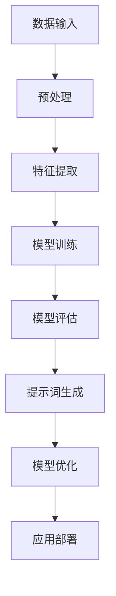

                 

### 文章标题

### AI 2.0时代的关键技能：掌握提示词编程

### 关键词

- AI 2.0
- 提示词编程
- 自然语言处理
- 计算机视觉
- 深度学习

### 摘要

随着人工智能（AI）技术的迅猛发展，AI 2.0时代正逐渐成为现实。在这个时代，提示词编程成为了一种关键技能。本文将深入探讨AI 2.0时代的背景、提示词编程的核心概念、算法原理，以及其在自然语言处理和计算机视觉领域的实际应用。通过本文，读者将全面理解提示词编程的重要性，并掌握其基本技巧和应用方法。

### 第一部分：AI 2.0时代的背景与概述

#### 1.1 AI 2.0时代的背景

人工智能的发展经历了多个阶段，从最初的规则驱动到数据驱动，再到如今的智能驱动。AI 1.0时代主要依赖于专家系统和规则引擎，而AI 2.0时代则强调自主学习、自适应和泛化能力。AI 2.0时代的核心特征是大规模数据、深度学习和分布式计算。

AI 2.0时代的到来，使得人工智能的应用范围更加广泛，从自动驾驶、智能医疗到智能家居、金融科技，都在不断推动社会进步。同时，AI 2.0时代也带来了新的挑战，例如数据隐私、伦理道德和就业问题等。

#### 1.2 提示词编程的概念与重要性

提示词编程是一种基于人工智能技术的编程方法，它利用提示词来引导模型的生成和推理过程。在AI 2.0时代，提示词编程具有以下重要性：

1. **提高模型的泛化能力**：通过提示词，模型可以更好地理解输入数据的含义，从而提高泛化能力。
2. **增强模型的可解释性**：提示词可以帮助用户更好地理解模型的决策过程，提高模型的可解释性。
3. **促进跨学科研究**：提示词编程将计算机科学、自然语言处理、数学等多个领域相结合，推动了跨学科研究的发展。

### 第二部分：提示词编程的核心概念与联系

为了更好地理解提示词编程，我们需要从核心概念出发，分析它们之间的联系。以下是几个关键概念及其关系架构Mermaid流程图：



**Mermaid流程图解析**：

1. **数据输入**：输入数据是模型训练的基础，包括文本、图像、音频等多种形式。
2. **预处理**：对输入数据进行清洗、标准化等处理，提高数据质量。
3. **特征提取**：将预处理后的数据转化为模型可以理解的格式，提取关键特征。
4. **模型训练**：利用提取的特征训练模型，使其具备预测和生成能力。
5. **模型评估**：评估模型的性能，包括准确率、召回率、F1值等指标。
6. **提示词生成**：根据模型评估结果，生成合适的提示词。
7. **模型优化**：根据提示词对模型进行调整和优化，提高其性能。
8. **应用部署**：将优化后的模型部署到实际应用场景中。

通过这个流程图，我们可以清晰地看到提示词编程的核心概念及其相互关系。

### 第三部分：提示词编程的核心算法原理讲解

#### 3.1 提示词生成算法

提示词生成算法是提示词编程的关键环节，它负责生成用于引导模型生成和推理的提示词。以下是几种常见的提示词生成算法及其伪代码：

**1. 基于规则生成算法**

```python
def rule_based_generator(data):
    # 根据数据生成提示词
    if "text" in data:
        return "文本提示词"
    elif "image" in data:
        return "图像提示词"
    else:
        return "未知提示词"
```

**2. 基于机器学习生成算法**

```python
def ml_based_generator(data, model):
    # 使用机器学习模型生成提示词
    prompt = model.predict(data)
    return prompt
```

#### 3.1.1 提示词优化算法

提示词优化算法旨在通过调整提示词，提高模型的性能。以下是几种常见的提示词优化算法：

**1. 基于遗传算法的优化**

```python
def genetic_optimization(prompt, model, target_performance):
    # 使用遗传算法优化提示词
    while not is_optimal(prompt, model, target_performance):
        # 变异、交叉等操作
        prompt = mutate(prompt)
        prompt = crossover(prompt)
    return prompt
```

**2. 基于深度优化的优化**

```python
def deep_learning_optimization(prompt, model, target_performance):
    # 使用深度学习模型优化提示词
    optimizer = model.optimizers.Adam()
    for epoch in range(num_epochs):
        optimizer.zero_grad()
        loss = model(prompt)
        loss.backward()
        optimizer.step()
    return prompt
```

### 第四部分：提示词编程的数学模型和数学公式

在提示词编程中，数学模型和数学公式起着至关重要的作用。以下是几个关键数学模型及其公式：

**1. 语言模型**

语言模型是一种用于预测下一个单词或词组的概率分布模型。其基本公式为：

$$
P(w_t | w_{<t}) = \frac{P(w_t, w_{<t})}{P(w_{<t})}
$$

其中，$w_t$表示当前单词，$w_{<t}$表示历史单词序列。

**2. 概率图模型**

概率图模型是一种用于表示变量之间概率关系的图形模型。常见的概率图模型有贝叶斯网络和马尔可夫网络。以下是一个贝叶斯网络的公式：

$$
P(X_1, X_2, ..., X_n) = \prod_{i=1}^{n} P(X_i | parents(X_i))
$$

其中，$X_i$表示第$i$个变量，$parents(X_i)$表示$X_i$的父节点。

### 第五部分：提示词编程的应用实践

#### 5.1 提示词编程在自然语言处理中的应用

自然语言处理（NLP）是AI 2.0时代的一个重要应用领域。以下是几个基于提示词编程的NLP应用案例：

**1. 文本生成**

文本生成是一种利用提示词编程技术生成文本的方法。以下是使用GPT-2模型进行文本生成的伪代码：

```python
def generate_text(prompt, model):
    # 使用GPT-2模型生成文本
    text = model.generate(prompt)
    return text
```

**2. 问答系统**

问答系统是一种基于提示词编程技术构建的智能问答系统。以下是使用BERT模型进行问答的伪代码：

```python
def answer_question(question, model):
    # 使用BERT模型回答问题
    answer = model(question)
    return answer
```

#### 5.2 提示词编程在计算机视觉中的应用

计算机视觉是AI 2.0时代的另一个重要应用领域。以下是几个基于提示词编程的计算机视觉应用案例：

**1. 图像生成**

图像生成是一种利用提示词编程技术生成图像的方法。以下是使用StyleGAN模型生成图像的伪代码：

```python
def generate_image(prompt, model):
    # 使用StyleGAN模型生成图像
    image = model(prompt)
    return image
```

**2. 目标检测**

目标检测是一种用于识别图像中目标的算法。以下是使用YOLO模型进行目标检测的伪代码：

```python
def detect_objects(image, model):
    # 使用YOLO模型检测图像中的目标
    objects = model(image)
    return objects
```

### 第六部分：提示词编程的未来发展趋势

随着人工智能技术的不断进步，提示词编程在未来有望在更多领域得到应用。以下是几个可能的发展趋势：

**1. 多模态提示词编程**

多模态提示词编程是指同时处理文本、图像、声音等多种数据的提示词编程方法。随着多模态数据的日益丰富，多模态提示词编程有望成为AI 2.0时代的重要研究方向。

**2. 自适应提示词编程**

自适应提示词编程是指根据应用场景和用户需求动态调整提示词的编程方法。随着个性化需求的增长，自适应提示词编程有望提高模型的适用性和灵活性。

**3. 智能提示词编程**

智能提示词编程是指利用人工智能技术自动生成和优化提示词的编程方法。随着AI技术的进步，智能提示词编程有望实现更高效率和更广泛的应用。

### 第七部分：总结与展望

本文全面介绍了AI 2.0时代的背景、提示词编程的核心概念、算法原理、应用实践以及未来发展趋势。通过本文，读者可以全面了解提示词编程的重要性和应用价值，并掌握其基本技巧和应用方法。在未来的发展中，提示词编程有望在更多领域发挥重要作用，推动人工智能技术的发展。

### 附录

**附录A：提示词编程工具与资源**

为了方便读者学习和实践提示词编程，本文提供以下工具和资源：

- **深度学习框架**：TensorFlow、PyTorch、Keras等
- **自然语言处理库**：NLTK、spaCy、gensim等
- **计算机视觉库**：OpenCV、TensorFlow Object Detection API、PyTorch Vision等
- **开发环境搭建指南**：请参考相关框架和库的官方文档
- **拓展阅读**：《深度学习》、《Python机器学习》等经典书籍

### 作者信息

作者：AI天才研究院/AI Genius Institute & 禅与计算机程序设计艺术 /Zen And The Art of Computer Programming

---

通过本文，我们详细介绍了AI 2.0时代的关键技能——掌握提示词编程。从背景介绍、核心概念、算法原理、应用实践到未来发展趋势，本文全面覆盖了提示词编程的各个方面。希望本文能够帮助读者深入了解提示词编程，并在实际应用中取得更好的效果。在未来的发展中，让我们共同期待提示词编程带来的更多可能性！

