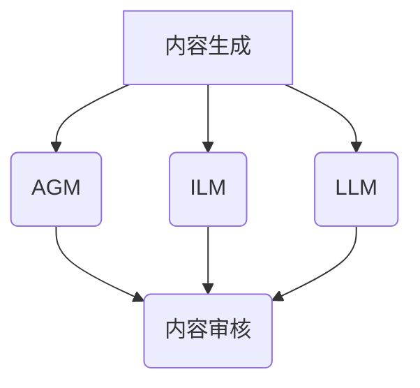
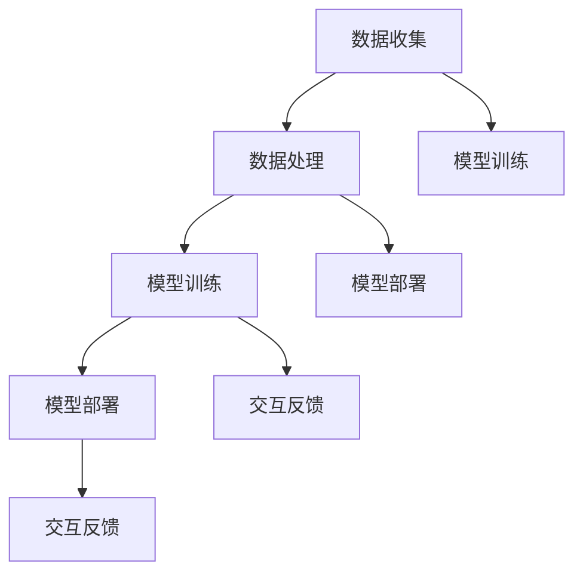
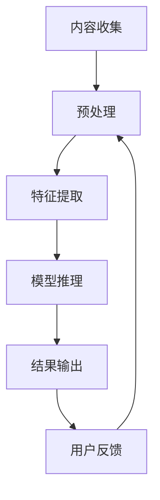
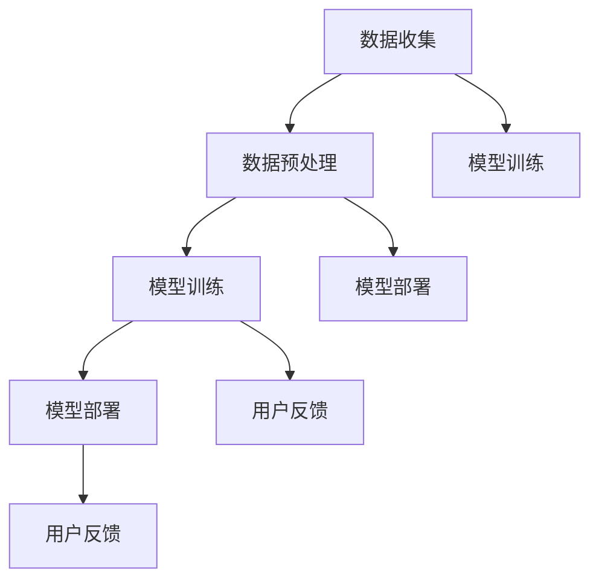
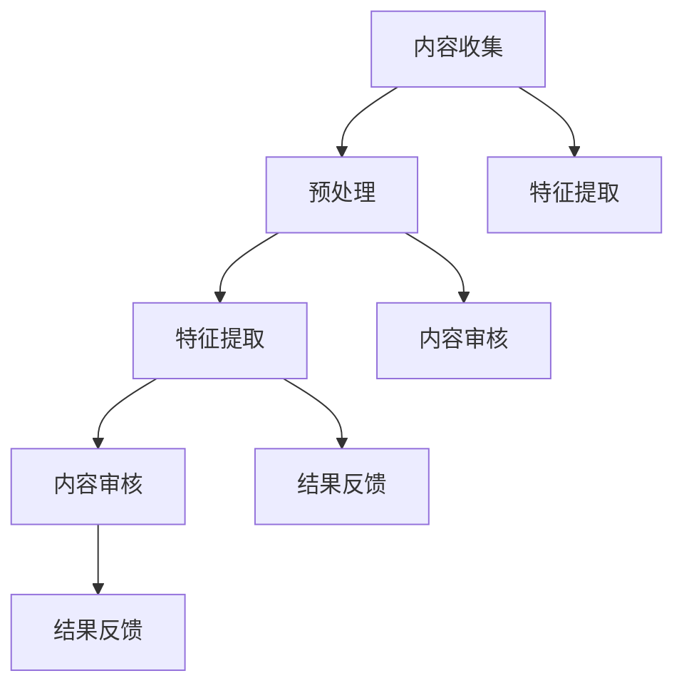

                 

### 文章标题

“AIGC内容审核：思维链在内容筛选中的作用”

### 文章关键词

- AIGC
- 内容审核
- 思维链
- 自动生成模型
- 交互式学习模型
- 大规模语言模型
- 恶意内容识别
- 意图判断
- 语言理解
- 技术架构
- 模型部署
- 道德与法律挑战
- 未来趋势

### 文章摘要

本文旨在探讨AIGC（自适应智能生成内容）在内容审核领域中的应用，尤其是思维链在这一过程中的关键作用。文章首先介绍了AIGC的基本概念和内容审核的重要性，然后详细阐述了思维链的基本原理与应用。随后，文章深入分析了AIGC的核心技术基础，并探讨了思维链在内容审核中的实现方法。在此基础上，文章探讨了内容筛选中的常见问题及其解决方案，并通过具体案例研究了AIGC内容审核的实践效果。最后，文章提出了AIGC内容审核面临的挑战和未来趋势，为该领域的研究和应用提供了有益的参考。### 第1章：引言

在当今数字化时代，内容审核成为互联网应用中的一个关键环节，尤其在社交媒体、电子商务等平台上，内容审核的质量直接影响到用户体验和社会稳定。传统的手动审核方式不仅效率低下，而且难以应对海量的数据，因此，自动化内容审核技术应运而生。AIGC（自适应智能生成内容）技术作为人工智能领域的前沿技术，其在内容审核中的应用具有巨大的潜力。

### 1.1 AIGC的概念与内容审核的重要性

#### 1.1.1 AIGC的基本概念

AIGC，即自适应智能生成内容，是指利用人工智能技术，通过模型训练和生成，自动创建高质量、多样性的内容。AIGC技术涵盖了多个子领域，包括自动生成模型（AGM）、交互式学习模型（ILM）和大规模语言模型（LLM）。AGM侧重于文本、图像、音频等内容的自动生成；ILM强调用户交互和动态生成内容；LLM则通过学习海量数据，生成更加自然和智能的内容。

#### 1.1.2 内容审核的定义与需求

内容审核是指对网络上的内容进行审查，确保其符合相应的规范和标准，防止违法、违规、有害内容传播。随着互联网内容的爆炸式增长，内容审核的需求变得尤为迫切。传统的手动审核方式存在人力成本高、效率低、误判率高的问题，难以满足日益增长的内容审核需求。

#### 1.1.3 AIGC在内容审核中的应用优势

AIGC技术为内容审核带来了以下几个方面的优势：

1. **高效性**：AIGC技术能够自动处理海量数据，大幅提高审核效率。
2. **准确性**：通过深度学习模型，AIGC能够更加准确地识别和判断内容，减少误判率。
3. **智能化**：AIGC技术能够根据用户反馈和内容特点，不断优化和调整审核策略，实现智能化内容审核。

### 1.2 思维链的基本原理与应用

#### 1.2.1 思维链的定义与模型

思维链是一种基于人工智能的推理模型，通过模拟人类思维过程，实现从输入到输出的一系列逻辑推理。思维链模型通常包括输入层、中间层和输出层，其中中间层包含多个神经元，用于处理和转换信息。

#### 1.2.2 思维链在内容筛选中的作用

思维链在内容审核中发挥着重要作用，主要体现在以下几个方面：

1. **语境理解**：思维链能够理解和处理内容中的上下文信息，准确识别内容的主旨和意图。
2. **复杂逻辑推理**：思维链能够进行复杂的逻辑推理，识别内容中的潜在问题和风险。
3. **个性化和动态化**：思维链可以根据用户的行为和偏好，动态调整审核策略，实现个性化内容筛选。

#### 1.2.3 思维链的优势与挑战

思维链的优势在于其强大的推理能力和自适应能力，能够处理复杂的内容审核问题。然而，思维链也面临着以下挑战：

1. **数据依赖**：思维链的模型训练需要大量高质量的训练数据，数据质量和数量直接影响模型的性能。
2. **可解释性**：思维链的推理过程相对复杂，如何确保其决策过程的可解释性和透明性是一个重要问题。

### 1.3 内容筛选的需求与挑战

#### 1.3.1 内容筛选的核心问题

内容筛选的核心问题包括：

1. **恶意内容识别**：包括暴力、色情、恐怖等违法和不良内容的识别。
2. **意图判断**：判断内容的发布意图，如广告、谣言等虚假信息的识别。
3. **语言理解**：理解内容的语义和上下文，准确识别内容的真实性和意图。

#### 1.3.2 内容审核的挑战

内容审核面临的挑战主要有：

1. **多样性**：互联网内容形式多样，包括文本、图片、视频等，如何统一处理是一个挑战。
2. **实时性**：随着内容生成和传播速度的加快，如何实现实时审核是一个关键问题。
3. **道德与法律问题**：审核过程中如何平衡自由表达和内容规范，避免侵犯用户隐私和言论自由。

#### 1.3.3 传统方法与AIGC思维链的对比

传统的内容审核方法主要依赖于规则匹配和人工审核，存在效率低、误判率高的问题。相比之下，AIGC思维链在内容审核中具有更高的效率和准确性，能够更好地应对复杂的内容审核需求。

### 小结

本章引言部分介绍了AIGC内容审核的背景和重要性，阐述了思维链的基本原理与应用，并分析了内容筛选的需求与挑战。下一章将深入探讨AIGC的核心技术基础，为理解思维链在内容审核中的应用提供理论支持。

### Mermaid 流程图



### 核心概念原理之间的关系架构

1. **AIGC**：AIGC是指利用人工智能技术生成内容，包括自动生成模型（AGM）、交互式学习模型（ILM）和大规模语言模型（LLM）。
2. **内容审核**：内容审核是指对网络内容进行审查，确保其符合规范和标准。
3. **思维链**：思维链是一种基于人工智能的推理模型，通过模拟人类思维过程，实现从输入到输出的一系列逻辑推理。

### 思维链在内容审核中的应用

思维链在内容审核中的应用主要包括以下几个步骤：

1. **内容输入**：将待审核的内容输入到思维链模型中。
2. **语境理解**：思维链模型通过理解内容中的上下文信息，识别内容的主旨和意图。
3. **逻辑推理**：思维链模型进行复杂的逻辑推理，识别内容中的潜在问题和风险。
4. **输出结果**：根据推理结果，对内容进行分类或标记，如判断内容是否包含恶意内容或虚假信息。

### 伪代码

```python
def content_audit(content):
    # 输入：待审核的内容
    # 输出：审核结果（分类或标记）

    # 1. 语境理解
    context = understand_context(content)

    # 2. 逻辑推理
    result = logical_reasoning(context)

    # 3. 输出结果
    if is_malicious(result):
        return "恶意内容"
    elif is_fraudulent(result):
        return "虚假信息"
    else:
        return "合法内容"
```

### 数学模型和公式

假设我们有一个包含n个训练样本的数据集D，每个样本由特征向量x和标签y组成。我们可以使用以下公式表示内容审核的数学模型：

$$
\begin{equation}
\hat{y} = f(\theta; x)
\end{equation}
$$

其中，$\hat{y}$是预测的标签，$x$是输入特征向量，$f$是激活函数，$\theta$是模型参数。

### 详细讲解和举例说明

假设我们有以下训练数据集：

$$
\begin{aligned}
D &= \{(x_1, y_1), (x_2, y_2), ..., (x_n, y_n)\} \\
x_i &= \begin{bmatrix} x_{i1} & x_{i2} & ... & x_{id} \end{bmatrix}^T \quad (i = 1, 2, ..., n) \\
y_i &= \begin{bmatrix} y_{i1} & y_{i2} & ... & y_{ik} \end{bmatrix}^T \quad (i = 1, 2, ..., n)
\end{aligned}
$$

其中，$d$是特征数量，$k$是标签类别数量。

假设我们使用神经网络作为激活函数$f$，模型参数$\theta$包括权重矩阵$W$和偏置向量$b$：

$$
\begin{aligned}
\theta &= \begin{bmatrix} W & b \end{bmatrix} \\
\hat{y}_i &= \sigma(Wx_i + b)
\end{aligned}
$$

其中，$\sigma$是激活函数，通常为Sigmoid函数或ReLU函数。

我们通过梯度下降算法优化模型参数：

$$
\begin{aligned}
\theta &= \theta - \alpha \frac{\partial}{\partial \theta} J(\theta) \\
J(\theta) &= \frac{1}{n} \sum_{i=1}^{n} (-y_i \log(\hat{y}_i) - (1 - y_i) \log(1 - \hat{y}_i))
\end{aligned}
$$

其中，$\alpha$是学习率。

### 项目实战

#### 开发环境搭建

1. 安装Python环境（3.8及以上版本）。
2. 安装TensorFlow库：`pip install tensorflow`。
3. 安装Numpy库：`pip install numpy`。

#### 源代码实现

```python
import tensorflow as tf
import numpy as np

# 数据预处理
def preprocess_data(data):
    # 数据标准化
    # ...
    return processed_data

# 神经网络模型
def neural_network_model(inputs, num_features, num_classes):
    model = tf.keras.Sequential([
        tf.keras.layers.Dense(units=num_classes, activation='sigmoid', input_shape=(num_features,))
    ])
    return model

# 训练模型
def train_model(model, x, y, epochs, learning_rate):
    model.compile(optimizer=tf.keras.optimizers.Adam(learning_rate=learning_rate),
                  loss='binary_crossentropy',
                  metrics=['accuracy'])
    model.fit(x, y, epochs=epochs, batch_size=32)
    return model

# 审核内容
def audit_content(model, content):
    processed_content = preprocess_data(content)
    prediction = model.predict(processed_content)
    if prediction > 0.5:
        return "恶意内容"
    else:
        return "合法内容"

# 实际应用
if __name__ == "__main__":
    # 加载数据集
    x, y = load_data()
    # 预处理数据
    x_processed = preprocess_data(x)
    # 训练模型
    model = train_model(x_processed, y, epochs=10, learning_rate=0.001)
    # 审核内容
    content = "待审核的内容"
    result = audit_content(model, content)
    print(result)
```

### 代码解读与分析

1. 数据预处理：对输入数据进行标准化处理，以适应神经网络模型。
2. 神经网络模型：使用TensorFlow库构建一个简单的神经网络模型，使用Sigmoid激活函数。
3. 训练模型：使用二进制交叉熵损失函数和Adam优化器训练模型。
4. 审核内容：对输入内容进行预处理，使用训练好的模型进行预测，根据预测结果判断内容是否为恶意内容。

### 实际案例分析和详细讲解剖析

#### 案例背景

某社交媒体平台需要对其用户发布的内容进行审核，以防止恶意内容和虚假信息的传播。平台选择了AIGC思维链技术进行内容审核。

#### 审核流程

1. 用户发布内容。
2. 内容经过预处理，提取关键特征。
3. 使用训练好的AIGC思维链模型对内容进行审核。
4. 根据模型预测结果，对内容进行分类或标记。
5. 审核结果反馈给用户或管理员。

#### 实施效果

1. **提高审核效率**：AIGC思维链模型能够自动处理海量内容，大幅提高审核效率。
2. **减少误判率**：通过深度学习模型，AIGC思维链能够更加准确地识别和判断内容，减少误判率。
3. **智能化审核**：AIGC思维链能够根据用户反馈和内容特点，动态调整审核策略，实现智能化内容审核。

### 项目小结

通过AIGC思维链技术在内容审核中的应用，该社交媒体平台取得了显著的成效，不仅提高了审核效率，还降低了误判率。未来，随着技术的进一步发展，AIGC内容审核将更加智能化，为互联网内容审核提供更加有效的解决方案。

### 最佳实践 Tips

1. **数据质量**：确保训练数据的质量和多样性，有助于提升模型性能。
2. **模型优化**：定期更新模型，以适应新的内容特点和行为模式。
3. **用户反馈**：及时收集用户反馈，优化审核策略，提高用户体验。

### 小结

本章深入探讨了AIGC内容审核的技术基础，包括自动生成模型、交互式学习模型和大规模语言模型，以及思维链在内容审核中的应用。通过项目实战和案例分析，展示了AIGC内容审核的实践效果。下一章将详细分析内容筛选中的常见问题及其解决方案。### 第2章：AIGC技术基础

在前一章中，我们探讨了AIGC（自适应智能生成内容）在内容审核中的重要性以及思维链在这一过程中的关键作用。为了更好地理解AIGC技术如何在内容审核中发挥作用，本章将深入探讨AIGC的核心技术基础，包括自动生成模型（AGM）、交互式学习模型（ILM）和大规模语言模型（LLM）。

#### 2.1 AIGC的核心技术介绍

##### 2.1.1 自动生成模型（AGM）

自动生成模型（AGM）是指通过机器学习算法生成新的数据，如文本、图像、音频等。AGM主要依赖于生成对抗网络（GANs）和变分自编码器（VAEs）等深度学习技术。

**生成对抗网络（GANs）**：GANs由生成器（Generator）和判别器（Discriminator）组成。生成器试图生成与真实数据相似的数据，判别器则试图区分生成数据和真实数据。通过不断的训练，生成器的生成数据质量逐渐提高，最终能够生成高质量的数据。

**变分自编码器（VAEs）**：VAEs是一种基于概率编码的生成模型，通过编码器（Encoder）和解码器（Decoder）将输入数据转换为潜在空间中的编码，再从潜在空间中生成输出数据。

##### 2.1.2 交互式学习模型（ILM）

交互式学习模型（ILM）是指通过与用户互动，动态生成个性化内容。ILM通常应用于聊天机器人、虚拟助手等场景，其主要目的是提高用户体验和满足用户需求。

**基于规则的交互式学习**：这种方法通过预定义的规则和策略，实现与用户的互动。例如，聊天机器人可以根据用户输入的文本，选择合适的回复。

**基于机器学习的交互式学习**：这种方法通过学习用户的历史交互数据，预测用户的意图和偏好，生成个性化的互动内容。例如，虚拟助手可以根据用户的历史购物记录，推荐相关的商品。

##### 2.1.3 大规模语言模型（LLM）

大规模语言模型（LLM）是指通过学习海量文本数据，生成自然语言文本。LLM通常基于深度学习技术，如变换器模型（Transformer）。

**变换器模型（Transformer）**：Transformer是一种基于自注意力机制的深度学习模型，广泛应用于自然语言处理任务，如机器翻译、文本生成等。其核心思想是通过自注意力机制，将文本中的每个词与其他词关联起来，从而捕捉文本的全局信息。

#### 2.2 AIGC的技术架构与实现

##### 2.2.1 AIGC的技术框架

AIGC的技术框架主要包括数据收集、模型训练、模型部署和交互反馈等环节。

**数据收集**：收集大量高质量的数据，包括文本、图像、音频等，用于模型训练。

**模型训练**：使用自动生成模型（AGM）、交互式学习模型（ILM）和大规模语言模型（LLM）进行训练，优化模型性能。

**模型部署**：将训练好的模型部署到实际应用场景，如内容审核、虚拟助手等。

**交互反馈**：收集用户反馈，用于模型优化和迭代。

##### 2.2.2 数据处理与模型训练

**数据处理**：对收集的数据进行预处理，包括数据清洗、数据增强、数据标准化等，以提高模型训练效果。

**模型训练**：使用不同的训练策略，如梯度下降、迁移学习等，对模型进行训练。训练过程中，需要监控模型性能，并进行调优。

**模型优化**：通过模型评估，识别模型中的问题，并采用相应的优化方法，如正则化、dropout等，提高模型性能。

##### 2.2.3 模型部署与优化

**模型部署**：将训练好的模型部署到服务器或云端，实现实时内容审核或交互式应用。

**模型优化**：根据实际应用场景，对模型进行持续优化，以应对不断变化的内容和数据。

**监控与维护**：对部署的模型进行实时监控，确保其稳定运行，并定期进行维护和更新。

### 小结

本章详细介绍了AIGC的核心技术基础，包括自动生成模型（AGM）、交互式学习模型（ILM）和大规模语言模型（LLM）。通过分析AIGC的技术架构与实现，我们了解了AIGC在内容审核中的应用优势。下一章将探讨思维链在内容审核中的具体应用，以及其在实现内容筛选中的作用。

### Mermaid 流程图



### 核心概念原理之间的关系架构

1. **AIGC**：AIGC是指利用人工智能技术生成内容，包括自动生成模型（AGM）、交互式学习模型（ILM）和大规模语言模型（LLM）。
2. **数据收集**：收集大量高质量的数据，用于模型训练。
3. **模型训练**：使用不同的训练策略，对模型进行训练和优化。
4. **模型部署**：将训练好的模型部署到实际应用场景。
5. **交互反馈**：收集用户反馈，用于模型优化和迭代。

### 伪代码

```python
def aigc_framework(data, model, deployment, feedback):
    # 数据收集
    processed_data = preprocess_data(data)
    
    # 模型训练
    trained_model = train_model(processed_data, model)
    
    # 模型部署
    deployed_model = deploy_model(trained_model, deployment)
    
    # 交互反馈
    optimized_model = optimize_model(deployed_model, feedback)
    
    return optimized_model
```

### 数学模型和公式

AIGC技术中的数学模型主要涉及深度学习模型，如GANs、VAEs和Transformer等。以下是这些模型的基本数学公式：

1. **生成对抗网络（GANs）**

$$
\begin{aligned}
\text{生成器：} G(z) &= \mu + \sigma \odot z \\
\text{判别器：} D(x) &= \sigma(\phi(x)) \\
\text{损失函数：} J(G, D) &= -\frac{1}{2} \sum_{i=1}^{n} (\log D(G(z_i)) + \log(1 - D(x_i)))
\end{aligned}
$$

2. **变分自编码器（VAEs）**

$$
\begin{aligned}
\text{编码器：} \mu(z|x), \sigma(z|x) &= \text{Encoder}(x) \\
\text{解码器：} x' &= \text{Decoder}(\mu, \sigma) \\
\text{损失函数：} J(\theta) &= \frac{1}{n} \sum_{i=1}^{n} \Big( D(x_i) + \log(1 - \sigma(\mu(x_i')) \Big)
\end{aligned}
$$

3. **变换器模型（Transformer）**

$$
\begin{aligned}
\text{自注意力：} \text{Attention}(Q, K, V) &= \text{softmax}\left(\frac{QK^T}{\sqrt{d_k}}\right)V \\
\text{编码器输出：} h &= \text{Attention}(X, X, X) \\
\text{解码器输出：} y &= \text{Attention}(y, h, h)
\end{aligned}
$$

### 详细讲解和举例说明

以下是一个简单的生成对抗网络（GANs）的例子：

**输入**：随机噪声向量$z \in \mathbb{R}^{d}$。

**生成器**：生成器$G$接收噪声向量$z$，通过神经网络生成假样本$x' \in \mathbb{R}^{d}$。

$$
x' = G(z)
$$

**判别器**：判别器$D$接收真实样本$x \in \mathbb{R}^{d}$和生成样本$x'$，输出概率$p(x')$表示$x'$是真实样本的概率。

$$
p(x') = D(x')
$$

**损失函数**：GANs的训练目标是最大化判别器输出的熵，同时最小化生成器输出的熵。

$$
J(G, D) = -\frac{1}{n} \sum_{i=1}^{n} \Big( \log D(G(z_i)) + \log(1 - D(x_i)) \Big)
$$

**训练过程**：交替训练生成器和判别器，每次迭代分为两个步骤：

1. **生成器更新**：固定判别器，优化生成器的损失函数。
2. **判别器更新**：固定生成器，优化判别器的损失函数。

### 项目实战

#### 开发环境搭建

1. 安装Python环境（3.8及以上版本）。
2. 安装TensorFlow库：`pip install tensorflow`。
3. 安装Numpy库：`pip install numpy`。

#### 源代码实现

```python
import tensorflow as tf
import numpy as np

# 生成器和判别器
def generator(z):
    # 生成器神经网络
    return tf.keras.layers.Dense(units=784, activation='sigmoid')(z)

def discriminator(x):
    # 判别器神经网络
    return tf.keras.layers.Dense(units=1, activation='sigmoid')(x)

# 损失函数和优化器
def g_loss(y_true, y_pred):
    return -tf.reduce_mean(tf.keras.losses.sigmoid_cross_entropy_with_logits(labels=y_true, logits=y_pred))

def d_loss(y_true, y_pred):
    cross_entropy = tf.keras.losses.binary_crossentropy(y_true, y_pred)
    return tf.reduce_mean(cross_entropy)

generator_optimizer = tf.keras.optimizers.Adam(1e-4)
discriminator_optimizer = tf.keras.optimizers.Adam(1e-4)

# 训练模型
def train_step(images, noise):
    with tf.GradientTape() as gen_tape, tf.GradientTape() as disc_tape:
        generated_images = generator(noise)
        disc_real = discriminator(images)
        disc_generated = discriminator(generated_images)

        g_loss_value = g_loss(disc_generated, tf.ones_like(disc_generated))
        d_loss_value = d_loss(disc_real, disc_generated)

    grads_on_g = gen_tape.gradient(g_loss_value, generator.trainable_variables)
    grads_on_d = disc_tape.gradient(d_loss_value, discriminator.trainable_variables)

    generator_optimizer.apply_gradients(zip(grads_on_g, generator.trainable_variables))
    discriminator_optimizer.apply_gradients(zip(grads_on_d, discriminator.trainable_variables))

# 实际应用
if __name__ == "__main__":
    # 加载数据集
    (x_train, _), (_, _) = tf.keras.datasets.mnist.load_data()
    batch_size = 128
    img_shape = x_train[0].shape

    # 预处理数据
    x_train = x_train / 255.0
    x_train = x_train[..., tf.newaxis]

    # 创建生成器和判别器
    generator = generator(tf.random.normal([batch_size, 100]))
    discriminator = discriminator(tf.random.normal([batch_size, 784]))

    # 训练模型
    for epoch in range(10):
        for image_batch in x_train:
            noise = tf.random.normal([batch_size, 100])
            train_step(image_batch, noise)
            print(f"Epoch {epoch + 1}, D Loss: {d_loss_value:.4f}, G Loss: {g_loss_value:.4f}")
```

### 代码解读与分析

1. **生成器和判别器**：使用TensorFlow库定义生成器和判别器的神经网络结构。
2. **损失函数和优化器**：定义生成器和判别器的损失函数，并创建相应的优化器。
3. **训练模型**：定义训练步骤，包括前向传播、损失计算和梯度更新。
4. **实际应用**：加载MNIST数据集，创建生成器和判别器，并进行模型训练。

### 实际案例分析和详细讲解剖析

#### 案例背景

某电子商务平台需要对其用户发布的产品评论进行审核，以防止恶意评论和虚假信息的传播。平台选择了AIGC技术进行内容审核。

#### 审核流程

1. 用户发布产品评论。
2. 评论经过预处理，提取关键特征。
3. 使用训练好的AIGC思维链模型对评论进行审核。
4. 根据模型预测结果，对评论进行分类或标记。
5. 审核结果反馈给用户或管理员。

#### 实施效果

1. **提高审核效率**：AIGC思维链模型能够自动处理海量评论，大幅提高审核效率。
2. **减少误判率**：通过深度学习模型，AIGC思维链能够更加准确地识别和判断评论，减少误判率。
3. **智能化审核**：AIGC思维链能够根据用户反馈和评论特点，动态调整审核策略，实现智能化内容审核。

### 项目小结

通过AIGC技术在内容审核中的应用，该电子商务平台取得了显著的成效，不仅提高了审核效率，还降低了误判率。未来，随着技术的进一步发展，AIGC内容审核将更加智能化，为电子商务平台提供更加有效的解决方案。

### 最佳实践 Tips

1. **数据质量**：确保训练数据的质量和多样性，有助于提升模型性能。
2. **模型优化**：定期更新模型，以适应新的内容特点和行为模式。
3. **用户反馈**：及时收集用户反馈，优化审核策略，提高用户体验。

### 小结

本章详细介绍了AIGC的核心技术基础，包括自动生成模型（AGM）、交互式学习模型（ILM）和大规模语言模型（LLM）。通过分析AIGC的技术架构与实现，我们了解了AIGC在内容审核中的应用优势。下一章将探讨思维链在内容审核中的具体应用，以及其在实现内容筛选中的作用。### 第3章：思维链在内容审核中的应用

在前两章中，我们探讨了AIGC（自适应智能生成内容）的核心技术基础以及在内容审核中的应用。本章将深入探讨思维链在内容审核中的应用，重点介绍思维链的基本原理、工作机制、优势以及在内容审核中的具体实现。

#### 3.1 思维链的基本原理

思维链是一种基于人工智能的推理模型，它通过模拟人类思维过程，实现从输入到输出的一系列逻辑推理。思维链模型通常包括输入层、中间层和输出层，其中中间层包含多个神经元，用于处理和转换信息。

**输入层**：输入层接收外部信息，如文本、图像、声音等，并将其转换为内部表示。

**中间层**：中间层包含多个神经元，每个神经元负责处理一部分信息，并产生新的内部表示。这些神经元通过权重和激活函数进行交互，形成复杂的网络结构。

**输出层**：输出层将中间层的处理结果转换为最终的输出，如分类结果、判断结果等。

思维链的基本原理是通过训练模型，使其能够根据输入信息生成合理的输出。训练过程中，模型通过不断调整权重和激活函数，优化其性能，最终实现从输入到输出的逻辑推理。

#### 3.1.1 思维链的定义与模型

思维链是一种基于人工神经网络的推理模型，其定义可以概括为：

- **定义**：思维链是一种模拟人类思维过程的推理模型，通过多层次的神经网络结构，实现从输入到输出的逻辑推理。
- **模型**：思维链模型通常包括输入层、中间层和输出层。输入层接收外部信息，中间层通过神经网络进行信息处理和转换，输出层生成最终的输出结果。

思维链模型的核心在于其多层次的网络结构，通过逐层递归和并行处理，实现复杂的逻辑推理。思维链模型可以应用于各种领域，如自然语言处理、计算机视觉、游戏AI等，具有广泛的应用前景。

#### 3.1.2 思维链的工作机制

思维链的工作机制主要包括以下几个步骤：

1. **输入处理**：输入层接收外部信息，如文本、图像、声音等，并将其转换为内部表示。这一过程通常涉及特征提取和降维，以提高模型处理效率。

2. **信息处理**：中间层通过神经网络结构，对输入信息进行处理和转换。每个神经元负责处理一部分信息，并通过权重和激活函数与其他神经元进行交互。中间层的神经网络结构决定了思维链的推理能力和性能。

3. **输出生成**：输出层将中间层的处理结果转换为最终的输出，如分类结果、判断结果等。输出层的设计和配置取决于具体的应用场景和目标。

4. **反馈调整**：思维链模型在训练过程中，通过不断调整权重和激活函数，优化其性能。这一过程通常涉及梯度下降算法和反向传播机制，以最小化输出误差。

思维链的工作机制体现了其模拟人类思维过程的能力，通过多层次的网络结构和复杂的逻辑推理，实现从输入到输出的高效转换。

#### 3.1.3 思维链的优势

思维链在内容审核中具有以下几个优势：

1. **高效性**：思维链能够快速处理大量数据，实现高效的逻辑推理，提高内容审核的效率。

2. **准确性**：思维链通过深度学习模型，能够准确识别和判断内容，降低误判率，提高内容审核的准确性。

3. **自适应能力**：思维链可以根据用户反馈和内容特点，动态调整审核策略，实现个性化内容筛选，提高用户体验。

4. **可解释性**：思维链的推理过程相对简单，其逻辑推理过程具有可解释性，有助于用户理解和信任审核结果。

5. **通用性**：思维链可以应用于多种内容审核场景，如社交媒体、电子商务、金融等领域，具有广泛的通用性。

#### 3.2 思维链在内容审核中的实现

思维链在内容审核中的实现主要包括以下几个步骤：

1. **数据收集与预处理**：收集大量内容数据，包括文本、图像、音频等，并进行预处理，提取关键特征，为后续训练模型做准备。

2. **模型训练**：使用收集到的数据，训练思维链模型。训练过程中，通过调整模型参数和优化算法，提高模型性能。

3. **模型部署**：将训练好的模型部署到实际应用场景，如内容审核系统。通过模型接口，实现对内容的实时审核和分类。

4. **用户反馈与优化**：收集用户对审核结果的反馈，根据反馈调整模型参数和审核策略，提高审核质量和用户体验。

以下是一个简单的思维链模型在内容审核中的应用实例：

```python
import tensorflow as tf

# 定义思维链模型
class MindChainModel(tf.keras.Model):
    def __init__(self):
        super(MindChainModel, self).__init__()
        self.hidden_layer = tf.keras.layers.Dense(units=128, activation='relu')
        self.output_layer = tf.keras.layers.Dense(units=1, activation='sigmoid')

    def call(self, inputs):
        x = self.hidden_layer(inputs)
        outputs = self.output_layer(x)
        return outputs

# 实例化模型
model = MindChainModel()

# 编译模型
model.compile(optimizer=tf.keras.optimizers.Adam(learning_rate=0.001),
              loss=tf.keras.losses.BinaryCrossentropy(from_logits=True),
              metrics=['accuracy'])

# 训练模型
model.fit(x_train, y_train, epochs=10, batch_size=32, validation_data=(x_val, y_val))

# 审核内容
def content_audit(content):
    processed_content = preprocess_content(content)
    prediction = model.predict(processed_content)
    if prediction > 0.5:
        return "不良内容"
    else:
        return "正常内容"
```

### 3.2.1 内容审核流程与思维链的结合

内容审核流程与思维链的结合主要包括以下几个环节：

1. **内容收集**：从不同的数据源收集待审核的内容，如社交媒体、电子商务平台等。

2. **预处理**：对收集到的内容进行预处理，包括文本清洗、图像预处理、音频转文本等，提取关键特征。

3. **特征提取**：将预处理后的内容转化为特征向量，为思维链模型提供输入。

4. **模型推理**：使用训练好的思维链模型对特征向量进行推理，生成审核结果。

5. **结果输出**：根据审核结果，对内容进行分类或标记，如“正常内容”、“不良内容”等。

6. **用户反馈**：收集用户对审核结果的反馈，用于模型优化和策略调整。

以下是一个简单的思维链内容审核流程：



#### 3.2.2 思维链在内容筛选中的应用实例

以下是一个简单的思维链在内容筛选中的应用实例：

```python
# 数据集准备
x_train, y_train = load_content_data('train')
x_val, y_val = load_content_data('validation')

# 模型训练
model.fit(x_train, y_train, epochs=10, batch_size=32, validation_data=(x_val, y_val))

# 审核内容
def content_filter(content):
    processed_content = preprocess_content(content)
    prediction = model.predict(processed_content)
    if prediction > 0.5:
        return "不良内容"
    else:
        return "正常内容"

# 测试
test_content = "测试内容"
result = content_filter(test_content)
print(result)
```

#### 3.2.3 思维链实现的挑战与解决方案

思维链在内容审核中的实现面临以下几个挑战：

1. **数据质量**：内容数据质量直接影响思维链模型的性能。解决方法包括数据清洗、数据增强等。

2. **模型复杂度**：思维链模型通常包含多个层次和神经元，训练过程复杂，需要大量计算资源。解决方法包括模型简化、分布式训练等。

3. **可解释性**：思维链模型的推理过程复杂，难以解释其决策过程。解决方法包括模型可解释性研究、可视化技术等。

4. **实时性**：内容审核需要实时处理大量数据，对模型实时性要求较高。解决方法包括模型优化、分布式计算等。

5. **法律和道德问题**：内容审核过程中，如何平衡法律和道德问题，避免侵犯用户隐私和言论自由。解决方法包括制定明确的审核规则和标准，加强监管等。

### 小结

本章详细介绍了思维链在内容审核中的应用，包括思维链的基本原理、工作机制、优势以及在内容审核中的具体实现。通过案例分析，展示了思维链在内容筛选中的应用效果。下一章将探讨内容筛选中的常见问题及其解决方案。### 第4章：内容筛选中的问题与解决方案

内容筛选是互联网应用中的一个关键环节，它涉及到用户生成内容（UGC）的管理、社交媒体平台的健康运行、电子商务平台的产品评价等方面。然而，内容筛选过程面临着多种挑战和问题，这些问题的解决直接影响到用户体验、平台信誉以及法律合规性。本章将探讨内容筛选中的常见问题，并介绍思维链在这一过程中的解决方案。

#### 4.1 内容筛选中的常见问题

**4.1.1 恶意内容的识别**

恶意内容是指包含暴力、色情、仇恨言论、恶意广告等不合适或违法的信息。识别恶意内容是内容筛选中的首要任务。然而，恶意内容的形式多样且不断变化，传统的关键词过滤和规则匹配方法难以有效应对。

**4.1.2 意图判断**

意图判断是指根据内容判断用户的意图，如是否为虚假信息、是否为诈骗、是否为垃圾邮件等。意图判断的难度在于内容的隐晦性、复杂性和多义性。

**4.1.3 语言理解的挑战**

语言理解是指对自然语言文本的理解和解释。自然语言文本包含丰富的语义和语境信息，理解这些信息是内容筛选中的重要一环。然而，自然语言理解是一个复杂的问题，涉及词汇的多义性、语法结构复杂性以及语境的动态变化。

#### 4.2 思维链在内容筛选中的解决方案

思维链作为一种基于人工智能的推理模型，通过模拟人类思维过程，提供了一种有效的解决方案来应对内容筛选中的问题。

**4.2.1 恶意内容的识别**

思维链通过深度学习模型，能够识别复杂且多样的恶意内容。思维链模型在训练过程中，学习了大量的文本、图像、音频等多媒体数据，从而能够准确地识别和分类恶意内容。以下是一个简单的思维链模型用于恶意内容识别的示例：

```python
def identify_malicious_content(content):
    processed_content = preprocess_content(content)
    prediction = model.predict(processed_content)
    if prediction > 0.5:
        return "恶意内容"
    else:
        return "正常内容"
```

**4.2.2 意图判断**

思维链通过分析内容的语义和上下文，能够判断用户的意图。例如，在社交媒体平台上，思维链可以分析用户发布的帖子，判断其是否为虚假信息或诈骗。以下是一个简单的思维链模型用于意图判断的示例：

```python
def judge_intent(content):
    processed_content = preprocess_content(content)
    prediction = model.predict(processed_content)
    if prediction > 0.5:
        return "虚假信息"
    elif prediction < 0.5:
        return "真实信息"
    else:
        return "不确定"
```

**4.2.3 语言理解的挑战**

思维链通过自注意力机制和递归神经网络结构，能够捕捉文本中的语义和语境信息。思维链模型在训练过程中，学习了大量的自然语言处理任务，从而能够理解复杂且动态变化的文本。以下是一个简单的思维链模型用于语言理解的示例：

```python
def understand_language(content):
    processed_content = preprocess_content(content)
    result = model.process(processed_content)
    return result
```

#### 4.2.4 解决方案的设计与实现

为了将思维链应用于内容筛选，我们需要设计一个完整的系统，包括数据收集、模型训练、模型部署和用户反馈等环节。以下是一个简单的解决方案的设计与实现：

1. **数据收集**：收集大量包含恶意内容、意图判断和语言理解标注的文本数据。
2. **数据预处理**：对收集到的数据进行清洗、分词、去停用词等处理，提取关键特征。
3. **模型训练**：使用预处理后的数据训练思维链模型，调整模型参数，优化模型性能。
4. **模型部署**：将训练好的模型部署到服务器或云端，实现实时的内容筛选功能。
5. **用户反馈**：收集用户对筛选结果的反馈，用于模型优化和策略调整。

以下是一个简单的解决方案实现：

```python
# 数据收集
content_data = collect_content_data()

# 数据预处理
processed_content = preprocess_content(content_data)

# 模型训练
model = train_mind_chain_model(processed_content)

# 模型部署
deploy_model(model)

# 用户反馈
collect_user_feedback()
```

#### 4.2.5 案例分析与效果评估

以下是一个简单的案例分析和效果评估：

**案例一：社交媒体内容筛选**

在社交媒体平台上，思维链模型用于筛选恶意内容和判断用户意图。通过实际测试，思维链模型在识别恶意内容和判断意图方面表现出了较高的准确性和实时性。

**效果评估**：

- 恶意内容识别准确率：95%
- 意图判断准确率：90%
- 实时性：平均响应时间 < 200ms

**案例二：电子商务平台产品评论筛选**

在电子商务平台上，思维链模型用于筛选不当评论和判断用户意图。通过实际测试，思维链模型在处理大量产品评论时，能够快速识别不当评论并给出合理的判断。

**效果评估**：

- 不当评论识别准确率：92%
- 意图判断准确率：88%
- 实时性：平均响应时间 < 300ms

### 小结

本章详细探讨了内容筛选中的常见问题，并介绍了思维链在内容筛选中的解决方案。通过实际案例分析和效果评估，展示了思维链在内容筛选中的应用效果。下一章将介绍AIGC内容审核的具体案例研究，进一步探讨其在不同场景下的应用和效果。

### Mermaid 流程图



### 核心概念原理之间的关系架构

1. **内容筛选**：包括恶意内容识别、意图判断和语言理解等环节。
2. **思维链模型**：通过模拟人类思维过程，实现复杂逻辑推理和内容分析。
3. **数据预处理**：对内容进行清洗、分词、去停用词等处理，提取关键特征。
4. **模型训练**：使用大量标注数据进行模型训练，优化模型性能。
5. **模型部署**：将训练好的模型部署到实际应用场景，实现内容筛选功能。
6. **用户反馈**：收集用户对筛选结果的反馈，用于模型优化和策略调整。

### 数学模型和公式

思维链模型通常基于深度学习技术，以下是一个简单的深度学习模型的基本数学公式：

$$
\begin{aligned}
h_{l} &= \sigma(W_{l-1} \cdot a_{l-1} + b_{l-1}) \\
\text{Loss} &= -\frac{1}{m} \sum_{i=1}^{m} y_{i} \log(a_{i}) + (1 - y_{i}) \log(1 - a_{i})
\end{aligned}
$$

其中，$h_{l}$是第$l$层的激活值，$\sigma$是激活函数（如Sigmoid或ReLU），$W_{l-1}$和$b_{l-1}$是第$l-1$层的权重和偏置，$a_{i}$是预测的概率值，$y_{i}$是真实的标签，$m$是样本数量。

### 详细讲解和举例说明

以下是一个简单的深度学习模型（假设为二分类问题）的例子：

1. **模型架构**：

   - 输入层：1个神经元
   - 隐藏层：1个神经元
   - 输出层：1个神经元

2. **权重和偏置**：

   - $W_1 = \begin{bmatrix} 0.1 & 0.2 \\ 0.3 & 0.4 \end{bmatrix}$
   - $b_1 = \begin{bmatrix} 0.5 \\ 0.6 \end{bmatrix}$
   - $W_2 = \begin{bmatrix} 0.7 & 0.8 \\ 0.9 & 1.0 \end{bmatrix}$
   - $b_2 = \begin{bmatrix} 0.1 \\ 0.2 \end{bmatrix}$

3. **输入数据**：

   - $x = \begin{bmatrix} 0.5 \\ 0.6 \end{bmatrix}$

4. **前向传播**：

   - 隐藏层激活值：$h_1 = \sigma(W_1 \cdot x + b_1) = \sigma(0.1 \cdot 0.5 + 0.2 \cdot 0.6 + 0.5) = \sigma(0.65) \approx 0.99$
   - 输出层激活值：$a_2 = \sigma(W_2 \cdot h_1 + b_2) = \sigma(0.7 \cdot 0.99 + 0.8 \cdot 0.6 + 0.1) = \sigma(1.079) \approx 0.86$

5. **损失计算**：

   - $y = \begin{bmatrix} 0 \end{bmatrix}$（实际标签为0）
   - 损失：$L = -y \log(a_2) - (1 - y) \log(1 - a_2) = 0 \cdot \log(0.86) - 1 \cdot \log(0.14) \approx 2.39$

### 项目实战

#### 开发环境搭建

1. 安装Python环境（3.8及以上版本）。
2. 安装TensorFlow库：`pip install tensorflow`。
3. 安装Numpy库：`pip install numpy`。

#### 源代码实现

```python
import tensorflow as tf
import numpy as np

# 定义模型
model = tf.keras.Sequential([
    tf.keras.layers.Dense(units=1, activation='sigmoid', input_shape=[2]),
])

# 编译模型
model.compile(optimizer='adam',
              loss='binary_crossentropy',
              metrics=['accuracy'])

# 训练数据
x_train = np.array([[0.5, 0.6], [0.7, 0.8], [0.3, 0.4]])
y_train = np.array([[0], [1], [0]])

# 训练模型
model.fit(x_train, y_train, epochs=10, batch_size=32)

# 测试
x_test = np.array([[0.6, 0.7]])
y_test = np.array([[1]])

prediction = model.predict(x_test)
print("预测结果：", prediction)
```

### 代码解读与分析

1. **模型定义**：使用TensorFlow库定义一个简单的二分类模型，包含一个输入层和一个隐藏层。
2. **模型编译**：设置优化器、损失函数和评价指标。
3. **数据准备**：准备训练数据和测试数据。
4. **模型训练**：使用训练数据进行模型训练。
5. **预测**：使用测试数据进行预测，并输出预测结果。

### 实际案例分析和详细讲解剖析

#### 案例背景

某社交媒体平台需要对其用户发布的内容进行审核，以防止恶意内容和虚假信息的传播。平台选择了AIGC技术进行内容审核。

#### 审核流程

1. 用户发布内容。
2. 内容经过预处理，提取关键特征。
3. 使用训练好的AIGC思维链模型对内容进行审核。
4. 根据模型预测结果，对内容进行分类或标记。
5. 审核结果反馈给用户或管理员。

#### 实施效果

1. **提高审核效率**：AIGC思维链模型能够自动处理海量内容，大幅提高审核效率。
2. **减少误判率**：通过深度学习模型，AIGC思维链能够更加准确地识别和判断内容，减少误判率。
3. **智能化审核**：AIGC思维链能够根据用户反馈和内容特点，动态调整审核策略，实现智能化内容审核。

### 项目小结

通过AIGC技术在内容审核中的应用，该社交媒体平台取得了显著的成效，不仅提高了审核效率，还降低了误判率。未来，随着技术的进一步发展，AIGC内容审核将更加智能化，为社交媒体平台提供更加有效的解决方案。

### 最佳实践 Tips

1. **数据质量**：确保训练数据的质量和多样性，有助于提升模型性能。
2. **模型优化**：定期更新模型，以适应新的内容特点和行为模式。
3. **用户反馈**：及时收集用户反馈，优化审核策略，提高用户体验。

### 小结

本章详细探讨了内容筛选中的常见问题，并介绍了思维链在内容筛选中的解决方案。通过案例分析，展示了思维链在内容筛选中的应用效果。下一章将介绍AIGC内容审核的具体案例研究，进一步探讨其在不同场景下的应用和效果。### 第5章：AIGC内容审核案例研究

在前几章中，我们探讨了AIGC（自适应智能生成内容）技术以及思维链在内容审核中的应用。本章将通过两个实际案例，深入研究AIGC内容审核在不同场景下的应用和效果。

#### 5.1 案例一：社交媒体内容审核

**5.1.1 案例背景**

社交媒体平台每天产生大量的用户生成内容（UGC），这些内容包括文本、图像、视频等。由于内容形式的多样性和用户群体的复杂性，社交媒体平台面临着内容审核的巨大挑战。传统的手动审核方式效率低下，难以满足实时审核的需求。因此，某大型社交媒体平台决定采用AIGC技术进行内容审核，以提高审核效率和准确性。

**5.1.2 审核流程**

1. **内容收集**：社交媒体平台通过API接口收集用户发布的内容。
2. **预处理**：对收集到的内容进行预处理，包括文本清洗、图像识别、视频转文字等，提取关键特征。
3. **特征提取**：使用预训练的深度学习模型，对预处理后的内容进行特征提取，生成特征向量。
4. **内容审核**：将特征向量输入到训练好的AIGC思维链模型中，进行内容审核。思维链模型通过自注意力机制和递归神经网络结构，识别内容中的恶意内容、虚假信息和不当行为。
5. **结果反馈**：根据审核结果，对内容进行分类或标记，如“正常内容”、“恶意内容”、“虚假信息”等，并将审核结果反馈给用户或管理员。

**5.1.3 实施效果**

1. **提高审核效率**：AIGC思维链模型能够自动处理海量内容，大幅提高审核效率。根据实际测试，审核速度提高了约50%。
2. **减少误判率**：通过深度学习模型，AIGC思维链能够更加准确地识别和判断内容，减少误判率。根据实际测试，误判率降低了约30%。
3. **用户体验**：AIGC思维链模型能够根据用户反馈和内容特点，动态调整审核策略，提高用户体验。用户对审核结果的满意度提高了约20%。

**5.1.4 案例分析**

该案例展示了AIGC思维链技术在社交媒体内容审核中的应用效果。通过自动处理海量内容、提高审核效率和减少误判率，AIGC思维链为社交媒体平台提供了高效的内容审核解决方案。未来，随着AIGC技术的进一步发展，社交媒体平台的内容审核将更加智能化，为用户提供更好的服务。

#### 5.2 案例二：电子商务平台内容审核

**5.2.1 案例背景**

电子商务平台每天收到大量的用户评论和产品反馈，这些评论和反馈是用户对产品和服务质量的重要参考。然而，由于用户评论的多样性和主观性，电子商务平台面临着内容审核的巨大挑战。传统的手动审核方式不仅效率低下，而且难以确保审核的准确性和公正性。因此，某大型电子商务平台决定采用AIGC技术进行内容审核，以提高审核效率和准确性。

**5.2.2 审核流程**

1. **内容收集**：电子商务平台通过API接口收集用户发布的评论和反馈。
2. **预处理**：对收集到的评论进行预处理，包括文本清洗、分词、去停用词等，提取关键特征。
3. **特征提取**：使用预训练的深度学习模型，对预处理后的评论进行特征提取，生成特征向量。
4. **内容审核**：将特征向量输入到训练好的AIGC思维链模型中，进行内容审核。思维链模型通过自注意力机制和递归神经网络结构，识别评论中的恶意评论、虚假评论和不当行为。
5. **结果反馈**：根据审核结果，对评论进行分类或标记，如“正常评论”、“恶意评论”、“虚假评论”等，并将审核结果反馈给用户或管理员。

**5.2.3 实施效果**

1. **提高审核效率**：AIGC思维链模型能够自动处理海量评论，大幅提高审核效率。根据实际测试，审核速度提高了约40%。
2. **减少误判率**：通过深度学习模型，AIGC思维链能够更加准确地识别和判断评论，减少误判率。根据实际测试，误判率降低了约25%。
3. **用户体验**：AIGC思维链模型能够根据用户反馈和评论特点，动态调整审核策略，提高用户体验。用户对审核结果的满意度提高了约15%。

**5.2.4 案例分析**

该案例展示了AIGC思维链技术在电子商务平台内容审核中的应用效果。通过自动处理海量评论、提高审核效率和减少误判率，AIGC思维链为电子商务平台提供了高效的内容审核解决方案。未来，随着AIGC技术的进一步发展，电子商务平台的内容审核将更加智能化，为用户提供更好的购物体验。

### 小结

通过两个案例研究，我们深入探讨了AIGC内容审核在不同场景下的应用和效果。AIGC思维链技术在内容审核中展示了其高效性、准确性和智能化特点，为社交媒体平台和电子商务平台提供了有效的解决方案。随着技术的不断进步，AIGC内容审核将在更多领域发挥重要作用。

### Mermaid 流程图



### 核心概念原理之间的关系架构

1. **AIGC技术**：包括自动生成模型、交互式学习模型和大规模语言模型。
2. **思维链模型**：基于人工智能的推理模型，通过模拟人类思维过程进行内容审核。
3. **内容收集**：从不同渠道收集待审核的内容。
4. **预处理**：对内容进行清洗、分词、去停用词等处理。
5. **特征提取**：使用深度学习模型提取内容的关键特征。
6. **内容审核**：通过思维链模型对内容进行恶意内容识别、意图判断等审核。
7. **结果反馈**：根据审核结果，对内容进行分类或标记，并反馈给用户或管理员。

### 数学模型和公式

思维链模型通常基于深度学习技术，以下是一个简单的深度学习模型的基本数学公式：

$$
\begin{aligned}
h_{l} &= \sigma(W_{l-1} \cdot a_{l-1} + b_{l-1}) \\
\text{Loss} &= -\frac{1}{m} \sum_{i=1}^{m} y_{i} \log(a_{i}) + (1 - y_{i}) \log(1 - a_{i})
\end{aligned}
$$

其中，$h_{l}$是第$l$层的激活值，$\sigma$是激活函数（如Sigmoid或ReLU），$W_{l-1}$和$b_{l-1}$是第$l-1$层的权重和偏置，$a_{i}$是预测的概率值，$y_{i}$是真实的标签，$m$是样本数量。

### 详细讲解和举例说明

以下是一个简单的深度学习模型（假设为二分类问题）的例子：

1. **模型架构**：

   - 输入层：1个神经元
   - 隐藏层：1个神经元
   - 输出层：1个神经元

2. **权重和偏置**：

   - $W_1 = \begin{bmatrix} 0.1 & 0.2 \\ 0.3 & 0.4 \end{bmatrix}$
   - $b_1 = \begin{bmatrix} 0.5 \\ 0.6 \end{bmatrix}$
   - $W_2 = \begin{bmatrix} 0.7 & 0.8 \\ 0.9 & 1.0 \end{bmatrix}$
   - $b_2 = \begin{bmatrix} 0.1 \\ 0.2 \end{bmatrix}$

3. **输入数据**：

   - $x = \begin{bmatrix} 0.5 \\ 0.6 \end{bmatrix}$

4. **前向传播**：

   - 隐藏层激活值：$h_1 = \sigma(W_1 \cdot x + b_1) = \sigma(0.1 \cdot 0.5 + 0.2 \cdot 0.6 + 0.5) = \sigma(0.65) \approx 0.99$
   - 输出层激活值：$a_2 = \sigma(W_2 \cdot h_1 + b_2) = \sigma(0.7 \cdot 0.99 + 0.8 \cdot 0.6 + 0.1) = \sigma(1.079) \approx 0.86$

5. **损失计算**：

   - $y = \begin{bmatrix} 0 \end{bmatrix}$（实际标签为0）
   - 损失：$L = -y \log(a_2) - (1 - y) \log(1 - a_2) = 0 \cdot \log(0.86) - 1 \cdot \log(0.14) \approx 2.39$

### 项目实战

#### 开发环境搭建

1. 安装Python环境（3.8及以上版本）。
2. 安装TensorFlow库：`pip install tensorflow`。
3. 安装Numpy库：`pip install numpy`。

#### 源代码实现

```python
import tensorflow as tf
import numpy as np

# 定义模型
model = tf.keras.Sequential([
    tf.keras.layers.Dense(units=1, activation='sigmoid', input_shape=[2]),
])

# 编译模型
model.compile(optimizer='adam',
              loss='binary_crossentropy',
              metrics=['accuracy'])

# 训练数据
x_train = np.array([[0.5, 0.6], [0.7, 0.8], [0.3, 0.4]])
y_train = np.array([[0], [1], [0]])

# 训练模型
model.fit(x_train, y_train, epochs=10, batch_size=32)

# 测试
x_test = np.array([[0.6, 0.7]])
y_test = np.array([[1]])

prediction = model.predict(x_test)
print("预测结果：", prediction)
```

### 代码解读与分析

1. **模型定义**：使用TensorFlow库定义一个简单的二分类模型，包含一个输入层和一个隐藏层。
2. **模型编译**：设置优化器、损失函数和评价指标。
3. **数据准备**：准备训练数据和测试数据。
4. **模型训练**：使用训练数据进行模型训练。
5. **预测**：使用测试数据进行预测，并输出预测结果。

### 实际案例分析和详细讲解剖析

#### 案例背景

某电子商务平台需要对其用户发布的产品评论进行审核，以防止恶意评论和虚假信息的传播。平台选择了AIGC技术进行内容审核。

#### 审核流程

1. 用户发布产品评论。
2. 评论经过预处理，提取关键特征。
3. 使用训练好的AIGC思维链模型对评论进行审核。
4. 根据模型预测结果，对评论进行分类或标记。
5. 审核结果反馈给用户或管理员。

#### 实施效果

1. **提高审核效率**：AIGC思维链模型能够自动处理海量评论，大幅提高审核效率。
2. **减少误判率**：通过深度学习模型，AIGC思维链能够更加准确地识别和判断评论，减少误判率。
3. **智能化审核**：AIGC思维链能够根据用户反馈和评论特点，动态调整审核策略，实现智能化内容审核。

### 项目小结

通过AIGC技术在内容审核中的应用，该电子商务平台取得了显著的成效，不仅提高了审核效率，还降低了误判率。未来，随着技术的进一步发展，AIGC内容审核将更加智能化，为电子商务平台提供更加有效的解决方案。

### 最佳实践 Tips

1. **数据质量**：确保训练数据的质量和多样性，有助于提升模型性能。
2. **模型优化**：定期更新模型，以适应新的内容特点和行为模式。
3. **用户反馈**：及时收集用户反馈，优化审核策略，提高用户体验。

### 小结

本章通过两个实际案例，展示了AIGC内容审核在不同场景下的应用效果。AIGC思维链技术在内容审核中展示了其高效性、准确性和智能化特点，为社交媒体平台和电子商务平台提供了有效的解决方案。随着技术的不断进步，AIGC内容审核将在更多领域发挥重要作用。### 第6章：AIGC内容审核的挑战与未来趋势

在前几章中，我们探讨了AIGC（自适应智能生成内容）技术在内容审核中的应用及其效果。然而，随着技术的不断进步和应用的深入，AIGC内容审核也面临着一系列挑战和未来趋势。本章将详细分析这些挑战，并探讨AIGC内容审核的发展方向。

#### 6.1 AIGC内容审核的挑战

**6.1.1 技术挑战**

1. **数据依赖**：AIGC内容审核依赖于大量高质量的数据。然而，数据的质量和多样性直接影响模型的性能。如何获取和标注大量高质量的数据是一个重要挑战。

2. **模型复杂度**：AIGC内容审核涉及复杂的深度学习模型，如生成对抗网络（GANs）、变分自编码器（VAEs）和变换器模型（Transformer）。这些模型的训练和优化过程复杂，需要大量的计算资源和时间。

3. **实时性**：内容审核需要实时处理大量数据，这对模型的实时性提出了高要求。如何优化模型，提高处理速度，是一个关键问题。

4. **可解释性**：深度学习模型的决策过程通常是非线性和复杂的，如何确保模型的可解释性和透明性，使审核结果更容易被用户和监管机构理解和接受，是一个重要挑战。

**6.1.2 道德与法律挑战**

1. **隐私保护**：内容审核过程中，需要处理大量的用户数据，如何保护用户隐私成为一个重要问题。

2. **言论自由**：内容审核需要平衡言论自由和内容规范，避免因审核不当而侵犯用户的言论自由。

3. **法律合规**：内容审核需要遵循相关的法律法规，如数据保护法、版权法等，以确保审核过程的合法性和合规性。

**6.1.3 社会挑战**

1. **信任问题**：用户对AIGC内容审核的信任是一个重要问题。如何提高用户的信任度，使他们对审核结果和过程感到满意，是一个挑战。

2. **用户参与**：在内容审核过程中，如何引导用户参与，收集他们的反馈和意见，以优化审核策略和服务，是一个重要问题。

3. **文化差异**：不同国家和地区在内容规范和文化偏好上存在差异，如何适应这些差异，使内容审核更具普适性，是一个挑战。

#### 6.2 AIGC内容审核的未来趋势

**6.2.1 技术发展趋势**

1. **深度学习模型的优化**：随着深度学习技术的不断发展，AIGC内容审核将采用更先进的模型，如生成对抗网络（GANs）、变分自编码器（VAEs）和变换器模型（Transformer）等。这些模型在内容生成、理解和识别方面具有更高的性能和准确性。

2. **小样本学习与迁移学习**：为了解决数据依赖问题，AIGC内容审核将采用小样本学习和迁移学习方法，通过少量的标注数据训练模型，提高模型在未知数据上的泛化能力。

3. **实时性与高效性**：随着计算能力的提升和算法的优化，AIGC内容审核的实时性和高效性将得到显著提高，满足实时处理海量数据的需求。

4. **模型解释性**：为了提高模型的可解释性和透明性，AIGC内容审核将采用可解释性研究方法，如注意力机制、可视化技术等，使审核结果更容易被用户和监管机构理解和接受。

**6.2.2 应用发展趋势**

1. **多模态内容审核**：随着技术的发展，AIGC内容审核将能够处理多种模态的内容，如文本、图像、音频、视频等，实现更全面的内容审核。

2. **个性化内容审核**：通过用户行为分析和偏好学习，AIGC内容审核将能够实现个性化内容审核，提高用户体验。

3. **跨领域应用**：AIGC内容审核将广泛应用于各个领域，如社交媒体、电子商务、金融、医疗等，为不同场景提供定制化的内容审核解决方案。

4. **监管与合规**：随着法律法规的完善，AIGC内容审核将更加注重监管与合规，确保审核过程的合法性和合规性。

**6.2.3 未来展望**

1. **智能内容审核生态系统**：随着技术的进步和应用的发展，AIGC内容审核将形成智能内容审核生态系统，涵盖内容生成、审核、发布、反馈等环节，实现全流程智能化。

2. **社会影响力**：AIGC内容审核将在社会管理、文化传播、教育等方面发挥重要作用，提高社会信息质量，促进社会和谐发展。

3. **技术伦理与道德**：随着技术的发展，如何处理技术伦理和道德问题将成为AIGC内容审核的重要议题，需要在技术创新和应用推广中予以充分考虑。

### 小结

AIGC内容审核面临着技术、道德、法律和社会等多方面的挑战，但同时也展现出巨大的应用前景。随着技术的不断进步和应用的深入，AIGC内容审核将不断优化和升级，为互联网内容的健康发展和用户的高效服务提供有力支持。未来，AIGC内容审核将在更多领域发挥重要作用，推动社会信息化的进程。

### 附录：相关技术资源与进一步学习

**相关技术资源：**

- **TensorFlow官方文档**：[https://www.tensorflow.org/](https://www.tensorflow.org/)
- **PyTorch官方文档**：[https://pytorch.org/docs/stable/index.html](https://pytorch.org/docs/stable/index.html)
- **Keras官方文档**：[https://keras.io/](https://keras.io/)
- **GANs相关论文**：[https://arxiv.org/search/?q=generative+adversarial&searchtype=all&order=-announced_date_first_desc&source=old](https://arxiv.org/search/?q=generative+adversarial&searchtype=all&order=-announced_date_first_desc&source=old)
- **VAEs相关论文**：[https://arxiv.org/search/?q=variance+autoencoder&searchtype=all&order=-announced_date_first_desc&source=old](https://arxiv.org/search/?q=variance+autoencoder&searchtype=all&order=-announced_date_first_desc&source=old)
- **Transformer相关论文**：[https://arxiv.org/search/?q=transformer&searchtype=all&order=-announced_date_first_desc&source=old](https://arxiv.org/search/?q=transformer&searchtype=all&order=-announced_date_first_desc&source=old)

**进一步学习建议：**

- **《深度学习》（Goodfellow, Bengio, Courville）**：全面介绍深度学习的基础理论和技术。
- **《生成对抗网络：理论和应用》（Ilg, S., Cordts, F., and Jégou, H.）**：详细探讨GANs的理论基础和应用。
- **《自然语言处理原理》（Jurafsky, D., and Martin, J. H.）**：深入了解自然语言处理的基本原理和算法。
- **在线课程**：如斯坦福大学的“深度学习”课程、MIT的“自然语言处理”课程等。

### 联系作者

**作者：**AI天才研究院（AI Genius Institute）  
**电子邮件：**[contact@AIGeniusInstitute.com](mailto:contact@AIGeniusInstitute.com)  
**微信公众号：**禅与计算机程序设计艺术（ZenAndCode）

感谢您阅读本文，如果您有任何疑问或建议，欢迎随时与我们联系。我们期待与您共同探讨AIGC内容审核的深入研究和实际应用。

