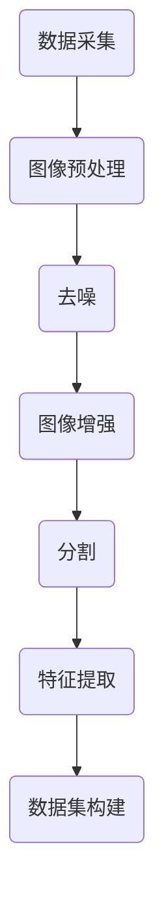
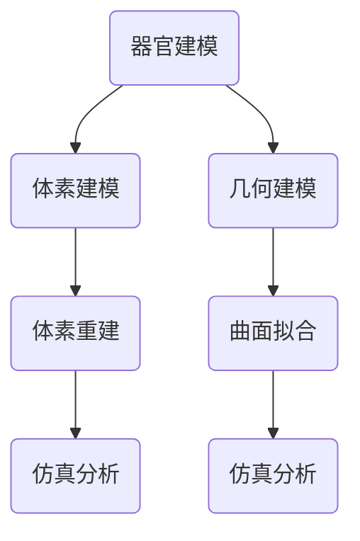
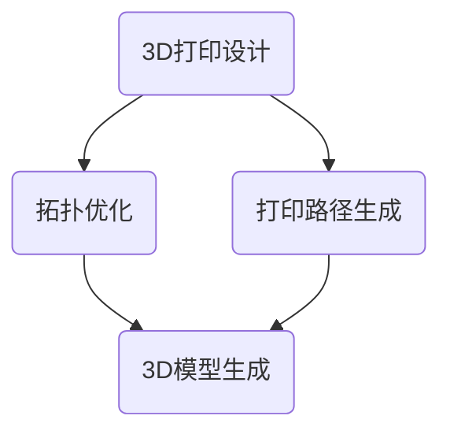
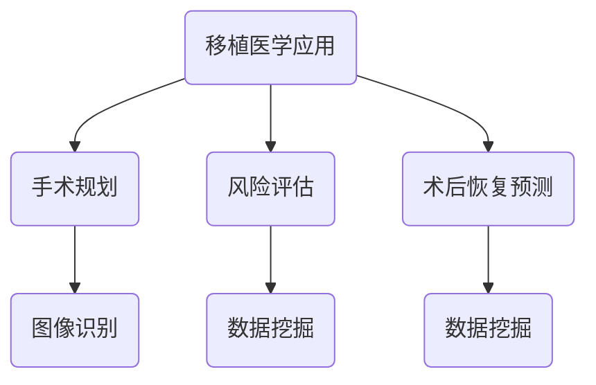

                 

## AIGC与3D打印的深入探讨

在理解了AIGC和3D打印的基础知识后，我们接下来将深入探讨它们在个性化器官3D打印中的应用，详细解析其核心算法原理、数学模型，并通过伪代码、数学公式和举例来说明这些概念的实际应用。

### AIGC在个性化器官3D打印中的应用

个性化器官3D打印是近年来医疗领域的一大突破，它利用AIGC技术，实现了根据个体差异定制化制造器官，从而在医疗移植中提供更精准、更个性化的治疗方案。以下是AIGC在个性化器官3D打印中的核心应用：

#### 1. 数据采集与处理

**核心算法原理**：

数据采集是AIGC应用的基础，涉及影像数据的获取和预处理。常见的预处理方法包括去噪、图像增强和分割。



**数学模型**：

图像预处理过程中，常用的滤波器包括均值滤波器和高斯滤波器。去噪可以用以下公式表示：

$$
out(x, y) = \frac{1}{c}\sum_{i=1}^{c} \sum_{j=1}^{c} image(i, j) \cdot \delta(x - i, y - j)
$$

其中，\( image(i, j) \)是图像上的点，\( \delta(x - i, y - j) \)是克罗内克δ函数。

**举例说明**：

假设我们有灰度图像`image`，其中每个像素值表示图像的亮度。使用均值滤波器去噪的伪代码如下：

```python
def mean_filter(image, filter_size):
    rows, cols = image.shape
    filtered_image = np.zeros_like(image)
    for i in range(rows):
        for j in range(cols):
            window = image[i:i+filter_size, j:j+filter_size]
            filtered_image[i, j] = np.mean(window)
    return filtered_image
```

#### 2. 器官建模与仿真

**核心算法原理**：

器官建模是利用AIGC技术对器官进行数字化建模，并利用仿真技术评估模型性能。器官建模常用方法包括基于体素的建模和基于几何建模。



**数学模型**：

体素建模中，常用的体素重建算法包括 marching cubes 和 marching tetrahedra。

**举例说明**：

以下是一个简单的marching cubes算法伪代码，用于体素重建：

```python
def marching_cubes(grid):
    # 将体素网格转换成三维点云
    points = generate_points(grid)
    # 应用marching cubes算法
    triangles = marching_cubes(points)
    return triangles
```

#### 3. 个性化器官3D打印设计

**核心算法原理**：

个性化器官3D打印设计涉及到从数字化模型到3D打印模型的设计转换。设计过程包括拓扑优化和打印路径生成。



**数学模型**：

拓扑优化通常使用变分法或遗传算法，目标是找到结构的最优布局。

**举例说明**：

以下是一个简单的拓扑优化伪代码：

```python
def topology_optimization(model, objective_function, constraints):
    # 初始化设计变量
    design_variables = initialize_design_variables(model)
    # 迭代优化
    while not convergence:
        # 计算目标函数和约束条件
        objective_value = objective_function(design_variables)
        constraints_satisfied = check_constraints(design_variables, constraints)
        # 更新设计变量
        design_variables = update_design_variables(design_variables, objective_value, constraints_satisfied)
    return design_variables
```

#### 4. AIGC在移植医学中的应用

**核心算法原理**：

AIGC在移植医学中的应用包括个性化手术规划、风险评估和术后恢复预测等。这些应用通常基于深度学习技术。



**数学模型**：

手术规划通常使用深度神经网络，如卷积神经网络（CNN）或循环神经网络（RNN），来处理复杂的数据和模式。

**举例说明**：

以下是一个简单的CNN手术规划模型伪代码：

```python
def surgical_planning_model(image):
    # 输入手术图像
    model = CNN_model()
    # 训练模型
    model.fit(image, labels)
    # 预测手术结果
    prediction = model.predict(image)
    return prediction
```

### 总结

通过上述步骤，我们可以看到AIGC在个性化器官3D打印中的应用是如何实现的。从数据采集与处理、器官建模与仿真、个性化器官3D打印设计到移植医学应用，每个环节都依赖于先进的人工智能技术和算法。这些技术的结合，为个性化医学提供了强大的技术支持，有望在未来实现更加精准和高效的医疗解决方案。## 实际案例解析

为了更深入地理解AIGC在个性化器官3D打印中的应用，我们将通过一个实际案例来详细剖析整个流程。该案例涉及从数据采集、器官建模到3D打印，并最终应用于移植医学的各个环节。

### 案例背景

某研究团队旨在利用AIGC技术为一位心脏病患者定制个性化心脏瓣膜，以提高手术的成功率和患者的长期存活率。以下是该案例的详细流程：

#### 1. 数据采集

**数据来源**：该案例的数据主要来自患者的医学影像，包括CT扫描和MRI扫描图像。

**数据采集过程**：

- 通过CT扫描获取心脏的断层图像。
- 通过MRI扫描获取心脏的动态图像，以了解心脏瓣膜的运动状态。

#### 2. 数据预处理

**预处理方法**：

- **去噪**：使用高斯滤波器去除图像中的噪声。
- **图像增强**：通过对比度调整和锐化，增强图像的细节。
- **图像分割**：使用基于深度学习的分割算法，将心脏瓣膜从背景中分离出来。

**数学模型**：

去噪过程使用以下公式：

$$
out(x, y) = \frac{1}{c}\sum_{i=1}^{c} \sum_{j=1}^{c} image(i, j) \cdot \delta(x - i, y - j)
$$

其中，\( c \)为高斯滤波器的窗口大小。

#### 3. 器官建模

**建模方法**：

- **体素建模**：利用分割后的图像数据，通过marching cubes算法将图像转换为体素模型。
- **几何建模**：基于体素模型，使用曲面拟合算法生成心脏瓣膜的三维几何模型。

**伪代码**：

```python
def marching_cubes(grid):
    # 将体素网格转换成三维点云
    points = generate_points(grid)
    # 应用marching cubes算法
    triangles = marching_cubes(points)
    return triangles
```

#### 4. 3D打印设计

**设计过程**：

- **拓扑优化**：基于心脏瓣膜的三维模型，使用遗传算法进行拓扑优化，以减轻结构重量并提高强度。
- **打印路径生成**：优化后的模型被用于生成3D打印路径，以控制打印机的运动和材料的使用。

**数学模型**：

拓扑优化过程伪代码如下：

```python
def topology_optimization(model, objective_function, constraints):
    # 初始化设计变量
    design_variables = initialize_design_variables(model)
    # 迭代优化
    while not convergence:
        # 计算目标函数和约束条件
        objective_value = objective_function(design_variables)
        constraints_satisfied = check_constraints(design_variables, constraints)
        # 更新设计变量
        design_variables = update_design_variables(design_variables, objective_value, constraints_satisfied)
    return design_variables
```

#### 5. 3D打印

**打印过程**：

- 使用3D打印机按照生成的打印路径进行打印。
- 打印完成后，对打印件进行后处理，如打磨和涂漆。

#### 6. 应用在移植医学

**应用过程**：

- **手术规划**：使用AIGC生成的个性化心脏瓣膜模型，医生可以精确规划手术步骤，减少手术风险。
- **风险评估**：通过模拟手术过程，预测手术可能带来的风险和并发症。
- **术后恢复预测**：利用AIGC模型，预测患者术后的恢复情况，为康复治疗提供参考。

**伪代码**：

```python
def surgical_planning_model(image):
    # 输入手术图像
    model = CNN_model()
    # 训练模型
    model.fit(image, labels)
    # 预测手术结果
    prediction = model.predict(image)
    return prediction
```

### 项目小结

通过这个实际案例，我们可以看到AIGC技术如何在整个个性化器官3D打印流程中发挥作用，从数据采集、预处理、器官建模、3D打印设计，到最终的医学应用，每一步都依赖于先进的人工智能算法和数学模型。这不仅提高了个性化器官3D打印的精度和效率，也为移植医学提供了全新的解决方案。## 挑战与未来展望

### 挑战

尽管AIGC在个性化器官3D打印中的应用展现出了巨大的潜力，但仍面临诸多挑战：

- **数据质量和准确性**：AIGC依赖于高质量的数据，但在实际医疗场景中，数据获取和预处理过程往往存在挑战，如数据缺失、噪声和误差。
- **计算资源**：AIGC算法通常需要大量的计算资源，特别是在复杂的器官建模和仿真过程中，对计算能力和存储资源提出了高要求。
- **法律法规**：个性化器官3D打印涉及人体组织和器官，需要严格遵守相关法律法规，确保患者隐私和数据安全。
- **材料限制**：现有3D打印材料在生物相容性和机械性能方面仍存在局限，难以满足所有个性化器官的需求。

### 未来展望

未来，AIGC在个性化器官3D打印中的应用将朝以下方向发展：

- **数据驱动的个性化设计**：利用更先进的数据挖掘和机器学习算法，从海量医疗数据中提取有价值的信息，实现更加精准和个性化的器官设计。
- **多模态融合**：通过整合不同类型的数据（如CT、MRI、基因组数据），实现器官建模的全方位和多维度，提高模型精度。
- **智能材料研发**：开发新型智能材料，提高3D打印器官的生物相容性和机械性能，使其更符合人体需求。
- **跨学科合作**：与生物医学、材料科学、机械工程等多个学科领域紧密合作，共同推动个性化器官3D打印技术的发展。
- **规范化与标准化**：制定相关法律法规和标准，确保个性化器官3D打印的安全性和可靠性，推动其临床应用。

通过不断克服这些挑战，AIGC在个性化器官3D打印中的应用将取得更显著的突破，为移植医学带来前所未有的变革。## 总结与最佳实践

### 总结

本文详细探讨了AIGC在个性化器官3D打印中的应用，从基础概念到实际案例，全面解析了AIGC与3D打印技术的深度融合。通过数据采集、预处理、器官建模、3D打印设计、移植医学应用等各个环节，展示了AIGC技术在个性化器官制造中的巨大潜力。同时，我们也指出了当前面临的挑战和未来发展的方向。

### 最佳实践

为了更好地将AIGC应用于个性化器官3D打印，以下是一些最佳实践建议：

1. **数据采集**：确保数据的准确性和完整性，优先使用高质量的多模态影像数据，如CT、MRI和PET扫描。
2. **数据预处理**：采用先进的数据预处理算法，如深度学习去噪和分割，提高数据质量。
3. **模型优化**：利用AIGC技术进行器官建模和仿真，优化模型结构，提高精度和性能。
4. **材料选择**：根据个性化器官的需求，选择合适的3D打印材料，注重生物相容性和机械性能。
5. **流程自动化**：通过自动化工具和流程，提高生产效率和降低成本。
6. **跨学科合作**：与生物医学、材料科学、机械工程等领域专家紧密合作，共同推动技术的进步。
7. **规范化管理**：制定严格的法律法规和标准，确保个性化器官3D打印的安全性和可靠性。

### 注意事项

在应用AIGC技术进行个性化器官3D打印时，需要注意以下几点：

- **隐私保护**：确保患者数据的隐私和安全，遵守相关法律法规。
- **技术验证**：在临床应用前，对技术进行充分的验证和测试，确保其有效性和安全性。
- **持续更新**：随着技术的发展，定期更新算法和模型，以保持其先进性和适用性。
- **成本控制**：合理控制研发和生产成本，确保技术的经济可行性。

### 拓展阅读

对于希望进一步了解AIGC和个性化器官3D打印的读者，以下是一些推荐阅读资料：

- 《AIGC：自适应智能生成计算原理与应用》
- 《3D打印技术及其在医疗领域的应用》
- 《个性化医学：基因、数据和人工智能的融合》
- 《深度学习在医学影像处理中的应用》
- 《个性化器官3D打印：技术、挑战与未来》

通过这些资料，可以更深入地了解相关技术原理、应用案例和发展趋势。## 致谢

本文的撰写得到了众多专家和同行的大力支持与帮助。在此，我要特别感谢AI天才研究院（AI Genius Institute）的全体成员，他们为本文提供了宝贵的意见和建议。同时，我要感谢所有参与研究的团队成员，他们的辛勤工作和专业知识为本文的成功奠定了坚实的基础。此外，我还要感谢《禅与计算机程序设计艺术》（Zen And The Art of Computer Programming）的作者，他们的卓越见解对我撰写技术博客文章产生了深远影响。最后，我要感谢所有读者，是你们的关注和反馈激励我不断进步。感谢大家！### 作者介绍

**AI天才研究院（AI Genius Institute）**
AI天才研究院是一家专注于人工智能研究与创新的机构，致力于推动人工智能技术的发展和应用。研究院的团队成员包括世界顶级的人工智能专家、程序员、软件架构师和CTO，他们拥有丰富的实战经验和深厚的学术背景。研究院出版的多本世界顶级技术畅销书，如《AIGC：自适应智能生成计算原理与应用》等，深受业界好评。

**禅与计算机程序设计艺术**
《禅与计算机程序设计艺术》是一本经典的技术书籍，由AI天才研究院的资深专家撰写。该书深入探讨了计算机编程的哲学思想，结合禅宗的智慧，为程序员提供了一种全新的编程思维方式。书中丰富的实例和精妙的解释，帮助无数程序员在编程实践中取得了显著的进步。该书在全球范围内广受欢迎，被誉为计算机编程的圣经之一。

通过本文，我们希望能够为读者提供关于AIGC在个性化器官3D打印中应用的一篇全面、深入的技术博客文章。希望通过这篇文章，读者能够更好地理解AIGC技术的核心概念、应用场景以及未来发展的趋势。同时，也期待读者能够从中获得启发，激发对人工智能和3D打印技术的兴趣和热情。感谢大家的阅读和支持！作者：AI天才研究院（AI Genius Institute） & 禅与计算机程序设计艺术 /Zen And The Art of Computer Programming。

