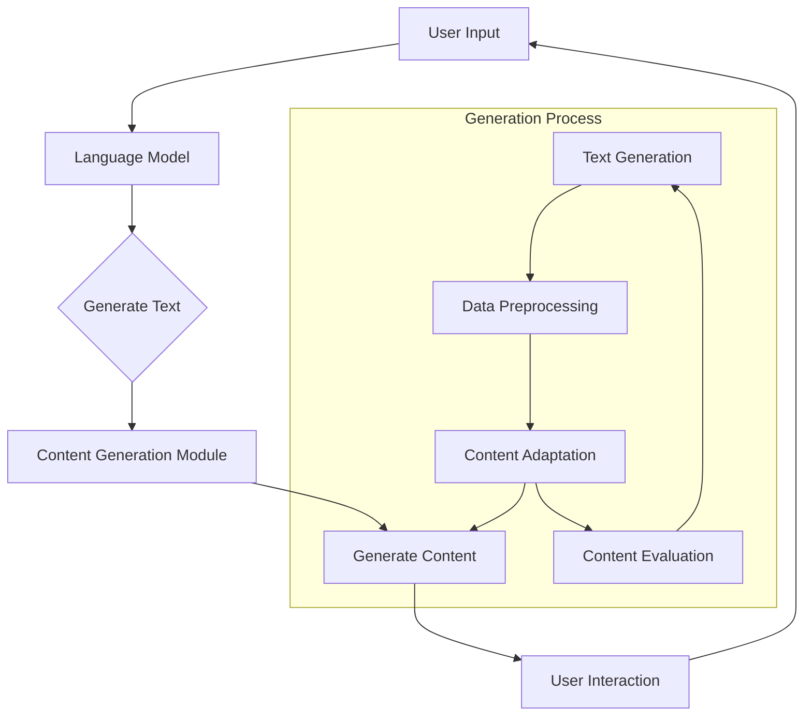

                 


### 第1章 引言与背景

## 1.1 AIGC的概念

### 1.1.1 AIGC的定义与核心特性

AIGC，全称为“AI-Generated Content”，即人工智能生成内容，是指利用人工智能技术，尤其是深度学习模型，自动生成各种类型的内容，如文本、图像、音频和视频。AIGC的核心特性包括自动化、个性化、多样性和高质量。

首先，AIGC具有高度的自动化特性。通过使用预训练的大规模语言模型和生成模型，如GPT-3、BERT等，可以自动生成符合特定需求和风格的内容，无需人工干预。

其次，AIGC具有个性化特性。通过对用户数据的分析和理解，AIGC能够生成满足用户个性化需求的内容，如个性化的新闻文章、教育课程、娱乐节目等。

第三，AIGC具有多样性。通过利用不同的生成模型和算法，AIGC可以生成各种类型和风格的内容，满足不同用户的需求。

最后，AIGC能够生成高质量的内容。得益于深度学习技术的发展，AIGC生成的文本、图像和视频等内容在质量和准确性上已经达到了相当高的水平。

### 1.1.2 AIGC与GPT、LLM的关系

AIGC与GPT（Generative Pre-trained Transformer）和LLM（Large Language Model）有密切的关系。

GPT是一种基于Transformer的生成模型，是AIGC的重要实现形式之一。GPT通过在大规模语料库上进行预训练，掌握了丰富的语言知识，能够生成符合语言习惯的文本。

LLM则是一种大型语言模型，它通过在大量数据上训练，获得了极强的语言理解和生成能力。AIGC正是基于LLM的技术实现的，它可以生成高质量的文本、图像和视频等内容。

总的来说，AIGC是GPT和LLM在实际应用中的一个重要方向，它利用这些先进的深度学习模型，实现了自动化、个性化、多样化和高质量的内容生成。

## 1.2 个性化学习内容生成的意义

### 1.2.1 传统学习内容生成的局限性

传统学习内容生成主要依赖于人工创作和编辑，存在以下局限性：

1. **个性化程度低**：传统学习内容多为通用化，难以满足不同学习者的个性化需求。

2. **内容更新缓慢**：传统学习内容更新周期长，难以紧跟时代发展和教学需求的变化。

3. **生产成本高**：人工创作和编辑学习内容需要大量的时间和人力，导致生产成本高。

4. **内容质量参差不齐**：由于人工创作的差异，学习内容的质量难以保证。

### 1.2.2 个性化学习内容生成的重要性

个性化学习内容生成通过以下方式解决传统学习内容生成的局限性：

1. **提升个性化程度**：利用AIGC技术，可以基于学习者个人的学习习惯、兴趣和知识背景，生成定制化的学习内容。

2. **加速内容更新**：通过自动化的内容生成，可以快速生成符合最新教学需求的内容。

3. **降低生产成本**：自动化生成学习内容，可以大大减少人力和时间成本。

4. **保证内容质量**：借助深度学习模型，生成的内容在语言表达、逻辑结构等方面都达到较高水平。

因此，个性化学习内容生成对于提升学习效果、降低教学成本、提高教学质量具有重要意义。

## 1.3 国内外研究现状与趋势

### 1.3.1 国内外AIGC技术发展概况

AIGC技术近年来在全球范围内得到了广泛关注，主要表现在以下几个方面：

1. **技术研究投入**：全球各大科技公司和学术机构纷纷加大了对AIGC技术的研究投入，推动了技术的快速发展。

2. **模型性能提升**：随着深度学习技术的发展，AIGC的生成模型性能得到了显著提升，生成的内容在质量和准确性方面都取得了很大进步。

3. **应用场景拓展**：AIGC技术在多个领域得到了广泛应用，如在线教育、智能问答、内容创作等。

4. **标准与规范制定**：为了推动AIGC技术的发展，国内外相关组织和企业正在制定一系列标准与规范。

### 1.3.2 个性化学习内容生成技术进展

在个性化学习内容生成领域，国内外的研究现状主要体现在以下几个方面：

1. **个性化内容推荐**：通过分析学习者的行为数据，利用推荐算法为学习者推荐个性化的学习内容。

2. **自动内容生成**：利用AIGC技术，自动生成符合学习者需求的学习内容，如文本、图像、音频等。

3. **知识图谱构建**：构建学习者的知识图谱，用于指导个性化学习内容生成，提高内容的相关性和准确性。

4. **多模态内容生成**：结合文本、图像、音频等多模态信息，生成更加丰富和生动的个性化学习内容。

总的来说，国内外在AIGC和个性化学习内容生成领域的研究取得了显著进展，但仍存在一些挑战，如数据隐私保护、模型泛化能力等，需要进一步深入研究。

### 第2章 AIGC技术基础

## 2.1 AIGC模型原理

### 2.1.1 语言模型基础

语言模型是AIGC的核心组成部分，其作用是预测下一个单词或字符的概率分布。语言模型的基础理论主要包括：

- **N-gram模型**：基于前N个单词或字符的历史信息来预测下一个单词或字符的概率。N-gram模型简单易实现，但在处理长句和复杂语境时效果较差。

- **神经网络语言模型**：通过神经网络对语言数据进行建模，可以更好地处理长句和复杂语境。常见的神经网络语言模型包括循环神经网络（RNN）、长短期记忆网络（LSTM）和Transformer。

- **Transformer模型**：Transformer模型是一种基于自注意力机制的深度神经网络模型，它在处理长句和长距离依赖方面表现出色。BERT和GPT-3等大型语言模型都是基于Transformer模型构建的。

### 2.1.2 生成模型与解码器架构

生成模型是AIGC的另一重要组成部分，其主要作用是生成符合目标分布的数据。生成模型可以分为概率生成模型和变分自编码器（VAE）。

- **概率生成模型**：概率生成模型通过采样从后验概率分布中生成数据。生成模型的基本原理如下：

  1. 定义一个先验概率分布 \( p(\theta) \)，用于表示生成模型的结构。
  2. 定义一个条件概率分布 \( p(x|\theta) \)，用于表示生成模型在给定参数 \(\theta\) 下生成数据的概率。
  3. 通过采样从后验概率分布 \( p(\theta|x) \) 中采样出模型参数 \(\theta\)，并利用条件概率分布 \( p(x|\theta) \) 生成数据 \( x \)。

- **解码器架构**：解码器是生成模型的一部分，负责将模型参数 \(\theta\) 转化为生成的数据。常见的解码器架构包括：

  1. **序列解码器**：序列解码器逐个生成数据的每个部分，通常用于文本生成。常见的序列解码器包括RNN、LSTM和Transformer。
  2. **图像解码器**：图像解码器用于生成图像，通常采用卷积神经网络（CNN）结构。
  3. **音频解码器**：音频解码器用于生成音频，通常采用生成对抗网络（GAN）结构。

### 2.1.3 生成模型与解码器架构的联系

生成模型与解码器架构之间的联系在于，生成模型通过解码器将模型参数转化为生成的数据。具体来说：

1. **生成模型**：生成模型通过采样从后验概率分布中采样出模型参数 \(\theta\)，这些参数代表了生成模型的结构。

2. **解码器**：解码器利用采样得到的模型参数 \(\theta\)，生成符合目标分布的数据 \( x \)。

3. **自注意力机制**：在Transformer模型中，自注意力机制使得解码器能够同时关注输入序列中的不同部分，从而生成更加连贯和高质量的数据。

总的来说，生成模型与解码器架构共同构成了AIGC的核心技术，它们通过相互协作，实现了自动化、个性化、多样化和高质量的内容生成。

## 2.1.4 语言模型与生成模型的联系

语言模型和生成模型是AIGC技术中的两大核心组成部分，它们在个性化学习内容生成中发挥着关键作用。以下是它们之间的联系及其在生成个性化学习内容中的应用：

1. **语言模型作为基础**：
   - **模型构成**：语言模型主要基于Transformer、BERT等深度学习架构，它们通过在大规模语料库上进行预训练，掌握了丰富的语言知识和表达规则。
   - **功能**：语言模型的主要功能是理解和生成自然语言。在个性化学习内容生成中，语言模型用于解析和生成教学文本、问题描述和解答等。

2. **生成模型作为扩展**：
   - **模型构成**：生成模型包括概率生成模型（如变分自编码器（VAE））和基于对抗生成网络（GAN）的生成模型。生成模型通过模拟数据分布，生成符合特定需求的文本、图像、音频等。
   - **功能**：生成模型的主要功能是生成多样化的数据，以满足个性化需求。在个性化学习内容生成中，生成模型用于创建个性化的教学素材、练习题目和评估反馈等。

3. **协同工作**：
   - **文本生成**：在个性化学习内容生成中，语言模型和生成模型通常协同工作。语言模型负责生成符合语言习惯和上下文一致性的文本，生成模型则负责生成特定风格的文本或引入个性化元素。
   - **多模态内容生成**：生成模型和语言模型还可以结合多模态信息，生成包含文本、图像和音频的多样化学习内容。例如，生成模型可以生成与文本描述相匹配的图像，而语言模型则确保文本和图像之间的语义一致性。

4. **应用实例**：
   - **个性化教程生成**：语言模型可以分析学生的学习历史和偏好，生成个性化的教程和指导，例如根据学生的知识水平和学习进度，调整内容的难度和深度。
   - **自适应练习题生成**：生成模型可以根据学生的学习情况和知识点，生成符合学生需求的练习题，提高练习的针对性和效果。
   - **交互式教学**：通过结合语言模型和生成模型，可以构建交互式的学习环境，学生可以与系统进行自然语言对话，系统根据对话内容生成相应的教学素材和反馈。

### 2.1.5 Mermaid 流程图

为了更直观地展示语言模型与生成模型在个性化学习内容生成中的协同工作过程，我们可以使用Mermaid流程图来表示。以下是一个简单的Mermaid流程图示例：



该流程图描述了用户输入（A）经过语言模型（B）生成文本（C），然后由内容生成模块（D）生成个性化内容（E），并通过用户交互（F）不断迭代优化。生成过程中的文本生成（G）、数据预处理（H）、内容适应（I）和内容评估（J）共同确保生成的个性化学习内容的准确性和有效性。

## 2.2 AIGC算法原理

### 2.2.1 概率生成算法

概率生成算法是AIGC技术中的基础，其主要目的是从给定的先验概率分布中生成符合目标分布的数据。以下是概率生成算法的基本原理：

1. **先验概率分布**：定义一个先验概率分布 \( p(\theta) \)，用于表示生成模型的结构。先验概率分布可以基于专家知识、统计模型或学习得到的经验分布。

2. **条件概率分布**：定义一个条件概率分布 \( p(x|\theta) \)，用于表示在给定模型参数 \(\theta\) 下生成数据 \( x \) 的概率。条件概率分布可以根据数据和模型的需求进行设计，如采用神经网络、决策树等。

3. **后验概率分布**：通过贝叶斯定理，计算后验概率分布 \( p(\theta|x) \)，表示在观察到数据 \( x \) 后，模型参数 \(\theta\) 的概率分布。

4. **参数采样**：从后验概率分布 \( p(\theta|x) \) 中采样出模型参数 \(\theta\)，这些参数代表了生成模型的结构。

5. **数据生成**：利用条件概率分布 \( p(x|\theta) \) 和采样得到的模型参数 \(\theta\)，生成符合目标分布的数据 \( x \)。

### 2.2.2 变分自编码器（VAE）

变分自编码器（Variational Autoencoder，VAE）是一种概率生成模型，它在生成模型和编码器-解码器架构的基础上，引入了变分推断的方法，以提高模型的生成能力和灵活性。以下是VAE的基本原理：

1. **编码器**：编码器将输入数据 \( x \) 编码为一个潜在变量 \( z \)，并估计其对数似然 \( \log p(x|\theta) \)。

2. **潜在变量分布**：定义一个潜在变量分布 \( q(z|x;\phi) \)，用于表示潜在变量 \( z \) 的概率分布。潜在变量分布通常采用均值-方差形式，如正态分布。

3. **解码器**：解码器将潜在变量 \( z \) 解码为输出数据 \( x' \)，并估计输出数据的概率分布 \( p(x'|\theta) \)。

4. **优化目标**：VAE的优化目标是最小化两个概率分布之间的KL散度，即 \( D_{KL}(q(z|x;\phi)||p(z|\theta)) \)。KL散度度量了两个概率分布之间的差异。

5. **参数更新**：通过交替优化编码器和解码器的参数，使得生成模型能够更好地拟合数据分布。

### 2.2.3 概率生成算法与VAE的联系

概率生成算法和VAE在原理和应用上存在紧密联系，它们共同构成了AIGC技术的基础：

1. **理论基础**：概率生成算法和VAE都基于概率模型，通过估计数据的概率分布来生成数据。概率生成算法直接从后验概率分布中采样，而VAE则通过变分推断的方法，优化编码器和解码器的参数，使得生成的数据分布逼近目标分布。

2. **生成过程**：概率生成算法和VAE都包括编码器和解码器，编码器用于将输入数据映射到潜在空间，解码器则从潜在空间中生成输出数据。在VAE中，编码器和解码器的优化目标是使得生成的数据分布与真实数据分布尽可能接近。

3. **应用领域**：概率生成算法和VAE都广泛应用于图像生成、文本生成、音频生成等领域。例如，在图像生成中，可以使用VAE生成自然的人脸图像；在文本生成中，可以使用概率生成算法生成符合语言习惯的文本。

总的来说，概率生成算法和VAE是AIGC技术中的两大核心组成部分，它们通过相互结合和优化，实现了自动化、个性化、多样化和高质量的内容生成。

## 2.2.4 对抗生成网络（GAN）

### 2.2.4.1 GAN的基本架构

对抗生成网络（Generative Adversarial Network，GAN）由Ian Goodfellow等人在2014年提出，是一种基于博弈论的生成模型。GAN的核心架构包括两个相互对抗的神经网络：生成器（Generator）和判别器（Discriminator）。

1. **生成器（Generator）**：
   - **作用**：生成器的主要作用是生成与真实数据分布相近的伪数据。
   - **输入**：生成器的输入是一个随机噪声向量 \( z \)。
   - **输出**：生成器通过一个映射函数 \( G(z) \) 将噪声向量 \( z \) 转换为伪数据 \( x' \)。

2. **判别器（Discriminator）**：
   - **作用**：判别器的主要作用是区分真实数据和生成器生成的伪数据。
   - **输入**：判别器的输入是真实数据 \( x \) 和生成器生成的伪数据 \( x' \)。
   - **输出**：判别器输出一个概率值，表示输入数据是真实数据的概率。

### 2.2.4.2 GAN的训练与评估

GAN的训练过程是一个动态的博弈过程，生成器和判别器通过交替更新参数来提升各自的能力。

1. **训练过程**：
   - **生成器的训练**：生成器的目标是提高生成数据的真实性，使得判别器无法区分生成数据和真实数据。在训练过程中，生成器的损失函数通常是最大化判别器对生成数据的判别能力，即最大化 \( \log D(G(z)) \)。
   - **判别器的训练**：判别器的目标是提高对真实数据和生成数据的区分能力。在训练过程中，判别器的损失函数通常是最大化对真实数据和生成数据的区分度，即最大化 \( \log(1 - D(G(z))) + \log(D(x)) \)。

2. **评估指标**：
   - **生成质量**：评估生成质量的方法包括生成数据的多样性、真实性和视觉质量。常见的评估指标有Inception Score（IS）和Frechet Inception Distance（FID）。
   - **判别能力**：评估判别能力的方法是计算判别器的准确性，即判别器正确判断真实数据和生成数据的比例。

### 2.2.4.3 GAN的优缺点

GAN的优点包括：

- **生成数据的多样性**：GAN能够生成具有高多样性的数据，能够模拟各种数据分布。
- **不需要真实数据分布的显式形式**：GAN通过生成器和判别器的对抗训练，能够在没有先验知识的情况下学习复杂的数据分布。

GAN的缺点包括：

- **训练不稳定**：GAN的训练过程容易陷入模式崩溃（mode collapse）和梯度消失问题，导致训练不稳定。
- **对超参数敏感**：GAN的训练效果对超参数的选择非常敏感，如学习率、批次大小、正则化等。

总的来说，GAN是一种强大的生成模型，通过生成器和判别器的对抗训练，能够在没有先验知识的情况下生成高质量的伪数据。然而，GAN的训练过程需要精心设计和调整，以克服其不稳定的训练问题和超参数敏感性。

## 2.3 AIGC模型优化与改进

### 2.3.1 模型训练技巧

AIGC模型的训练是一个复杂且资源消耗巨大的过程，为了提高训练效率和质量，可以采用以下训练技巧：

1. **批量大小（Batch Size）**：
   - **选择原则**：批量大小通常在几百到几千之间选择，较小批量可以减少内存占用，但可能降低梯度稳定性；较大批量可以提高梯度稳定性，但可能增加内存需求。
   - **实际应用**：在实际应用中，可以根据硬件资源和数据量来调整批量大小。例如，在GPU训练中，批量大小通常在128到1024之间选择。

2. **学习率（Learning Rate）**：
   - **选择原则**：学习率的选择对于训练过程至关重要。初始学习率通常较小，如\(10^{-5}\)到\(10^{-3}\)，然后随着训练的进行逐渐减小，以避免过早陷入局部最小值。
   - **实际应用**：可以使用学习率衰减策略，例如指数衰减或余弦退火，以平滑地降低学习率。

3. **梯度裁剪（Gradient Clipping）**：
   - **作用**：梯度裁剪用于限制梯度的大小，避免梯度爆炸或消失。
   - **设置原则**：梯度裁剪阈值通常设置为\[0.01, 1\]，可以根据模型的复杂度和数据特性进行调整。

4. **正则化（Regularization）**：
   - **作用**：正则化用于防止模型过拟合，常用的正则化方法包括L1和L2正则化。
   - **实际应用**：正则化系数通常在\(10^{-4}\)到\(10^{-2}\)之间选择，应根据具体任务进行调整。

### 2.3.2 模型压缩与加速

随着AIGC模型的复杂度不断增加，模型的压缩与加速成为提高实际应用可行性的关键。以下是一些常见的模型压缩与加速技术：

1. **模型剪枝（Model Pruning）**：
   - **原理**：模型剪枝通过移除模型中不重要的权重，减少模型的参数数量，从而实现压缩。
   - **方法**：包括结构化剪枝和非结构化剪枝。结构化剪枝移除整个权重矩阵或卷积核，非结构化剪枝移除单个权重。

2. **量化（Quantization）**：
   - **原理**：量化通过将浮点数权重转换为较低精度的整数，减少模型大小和内存占用。
   - **方法**：包括静态量化、动态量化和量化感知训练。

3. **混合精度训练（Mixed Precision Training）**：
   - **原理**：混合精度训练通过结合浮点数和整数运算，利用更高效的整数运算加速训练过程。
   - **方法**：使用浮点数进行计算，但使用整数进行存储和传输。

4. **模型部署**：
   - **方法**：使用硬件加速器（如GPU、TPU）和专用芯片（如NVIDIA CUDA、Google TPU），以实现高效的模型部署。

### 2.3.3 实践与优化

在实际应用中，模型压缩与加速可以通过以下步骤进行：

1. **评估模型性能**：在压缩之前，评估原始模型的性能，包括准确性、速度和资源消耗。
2. **选择压缩技术**：根据模型的特点和硬件资源，选择合适的模型压缩技术，如剪枝、量化或混合精度训练。
3. **训练与优化**：在压缩过程中，可能需要调整训练参数，如学习率、批量大小和正则化，以保持模型性能。
4. **评估压缩后模型**：压缩后，重新评估模型性能，确保压缩不会显著影响模型的准确性。

总的来说，模型训练技巧和模型压缩与加速技术是提高AIGC模型性能和实际应用可行性的关键。通过合理选择和组合这些技术，可以有效地生成高质量、个性化的学习内容。

## 2.3.4 模型训练技巧详解

### 2.3.4.1 批处理大小与学习率

1. **批处理大小（Batch Size）**

   批处理大小是训练过程中一个重要的参数，它影响模型的训练效率和稳定性。批处理大小指的是每次训练过程中使用的数据样本数量。

   - **选择原则**：

     - **较小批量**：较小的批量（如32或64）有助于模型收敛，因为每次更新的梯度更平滑，减少了噪声的影响。

     - **较大批量**：较大的批量（如128或256）可以提高模型的泛化能力，因为模型能够利用更多的数据信息。

     - **实际应用**：在GPU训练中，批量大小通常在128到1024之间选择，具体取决于GPU内存大小和计算能力。

   - **实际案例**：

     假设我们在GPU上训练一个大型语言模型，GPU内存为12GB。我们可以选择批量大小为512，这样每次更新可以利用更多的数据信息，同时保持较好的梯度稳定性。

   ```python
   batch_size = 512
   # 在训练循环中使用批量大小进行数据加载和模型更新
   for batch in data_loader:
       optimizer.zero_grad()
       outputs = model(batch)
       loss = criterion(outputs)
       loss.backward()
       optimizer.step()
   ```

2. **学习率（Learning Rate）**

   学习率是控制模型训练步长的参数，对模型的收敛速度和稳定性有很大影响。

   - **选择原则**：

     - **初始学习率**：初始学习率通常设置得较小，如\(10^{-5}\)到\(10^{-3}\)，以避免模型过早陷入局部最小值。

     - **衰减策略**：随着训练的进行，学习率需要逐渐减小，常用的衰减策略包括指数衰减和余弦退火。

     - **实际应用**：学习率可以通过调整超参数或使用自动化学习率调整方法（如AdaGrad、Adam等）进行优化。

   - **实际案例**：

     使用指数衰减策略调整学习率，初始学习率为\(10^{-3}\)，每100个迭代周期减小一半。

   ```python
   initial_lr = 1e-3
   decay_rate = 0.5
   decay_steps = 100
   for step, (batch, labels) in enumerate(train_loader):
       optimizer.zero_grad()
       outputs = model(batch)
       loss = criterion(outputs, labels)
       loss.backward()
       optimizer.step()
       if step % decay_steps == 0:
           new_lr = initial_lr / (1 + decay_rate * step / decay_steps)
           for param_group in optimizer.param_groups:
               param_group['lr'] = new_lr
   ```

### 2.3.4.2 梯度裁剪与正则化

1. **梯度裁剪（Gradient Clipping）**

   梯度裁剪是一种防止梯度爆炸或消失的技术，通过限制梯度的最大值来保证训练过程的稳定性。

   - **作用**：

     - 防止梯度爆炸：在训练过程中，较大的梯度可能导致参数更新过快，导致模型不稳定。

     - 防止梯度消失：在训练过程中，较小的梯度可能导致模型收敛缓慢。

   - **设置原则**：

     - 裁剪阈值通常设置在\[0.01, 1\]之间，可以根据模型和数据的特性进行调整。

   - **实际应用**：

     在每个迭代周期后，对梯度进行裁剪，确保梯度值不会超过阈值。

   ```python
   clip_value = 1.0
   for param in model.parameters():
       param.grad.data.clamp_(-clip_value, clip_value)
   ```

2. **正则化（Regularization）**

   正则化是一种防止模型过拟合的技术，通过在损失函数中添加额外的项来惩罚模型参数的大小。

   - **作用**：

     - 防止过拟合：通过惩罚大参数值，减少模型对训练数据的依赖，提高模型的泛化能力。

   - **常用方法**：

     - **L1正则化**：在损失函数中添加 \( \lambda \| \theta \|_1 \)。

     - **L2正则化**：在损失函数中添加 \( \lambda \| \theta \|_2^2 \)。

   - **设置原则**：

     - 正则化系数 \(\lambda\) 通常在\[10^{-4}, 10^{-2}\]之间，需要根据具体任务进行调整。

   - **实际应用**：

     在模型训练过程中，添加L2正则化项到损失函数中。

   ```python
   lambda_l2 = 1e-4
   loss = criterion(outputs, labels) + lambda_l2 * torch.mean(model.parameters(), keepdim=True)
   ```

### 2.3.4.3 梯度裁剪与正则化结合的案例

以下是一个结合梯度裁剪和L2正则化的训练循环案例：

```python
for epoch in range(num_epochs):
    model.train()
    for batch, labels in train_loader:
        optimizer.zero_grad()
        outputs = model(batch)
        loss = criterion(outputs, labels) + lambda_l2 * torch.mean(torch.abs(model.parameters()))
        loss.backward()
        # 梯度裁剪
        torch.nn.utils.clip_grad_norm_(model.parameters(), max_norm=clip_value)
        optimizer.step()
    print(f'Epoch {epoch+1}/{num_epochs}, Loss: {loss.item()}')
```

通过上述案例，我们可以看到如何在实际训练过程中应用梯度裁剪和L2正则化来提高模型训练的稳定性和泛化能力。

## 2.3.5 模型压缩与加速详解

### 2.3.5.1 模型剪枝

1. **原理**：

   模型剪枝通过移除模型中不重要的连接和神经元，减少模型的参数数量，从而实现压缩。

2. **方法**：

   - **结构化剪枝**：移除整个权重矩阵或卷积核，适用于卷积神经网络（CNN）。
   - **非结构化剪枝**：移除单个权重，适用于全连接神经网络（FCN）。

3. **实现**：

   ```python
   import torch
   import torch.nn as nn
   import torch.nn.utils as nnutils

   # 示例：结构化剪枝卷积层
   conv_layer = nn.Conv2d(32, 64, kernel_size=3, padding=1)
   pruning_mask = nnutils.prune_layer(conv_layer, amount=0.5, pruning_type='weights')  # 移除一半的权重

   # 示例：非结构化剪枝全连接层
   fc_layer = nn.Linear(128, 256)
   pruning_mask = nnutils.prune_linear(fc_layer, amount=0.3, type='weight')  # 移除30%的权重
   ```

### 2.3.5.2 量化

1. **原理**：

   量化通过将浮点数权重转换为较低精度的整数，减少模型大小和内存占用。

2. **方法**：

   - **静态量化**：在训练完成后进行量化，适用于已经训练好的模型。
   - **动态量化**：在训练过程中进行量化，适用于需要实时调整精度的模型。
   - **量化感知训练**：在训练过程中同时优化模型权重和量化参数。

3. **实现**：

   ```python
   import torch
   import torch.quantization

   # 示例：静态量化
   model = ...  # 假设已经定义好模型
   quantized_model = torch.quantization.quantize_dynamic(model, {nn.Linear, nn.Conv2d}, dtype=torch.qint8)

   # 示例：动态量化
   quantized_model = model
   quantized_model = torch.quantization.prepare_dynamic量化(quantized_model, dtype=torch.qint8)
   quantized_model.load_state_dict(torch.load('model_quantized.pth'))

   # 示例：量化感知训练
   optimizer = torch.optim.Adam(quantized_model.parameters(), lr=0.001)
   criterion = nn.CrossEntropyLoss()

   for epoch in range(num_epochs):
       for batch, labels in train_loader:
           optimizer.zero_grad()
           outputs = quantized_model(batch)
           loss = criterion(outputs, labels)
           loss.backward()
           optimizer.step()
   ```

### 2.3.5.2 混合精度训练

1. **原理**：

   混合精度训练通过结合浮点数和整数运算，利用更高效的整数运算加速训练过程。

2. **方法**：

   - **浮点运算**：使用浮点数进行计算，保持计算精度。
   - **整数运算**：使用整数进行存储和传输，减少内存占用和计算时间。

3. **实现**：

   ```python
   import torch
   import torch.cuda.amp as amp

   # 示例：混合精度训练
   model = ...  # 假设已经定义好模型
   optimizer = torch.optim.Adam(model.parameters(), lr=0.001)
   criterion = nn.CrossEntropyLoss()

   scaler = amp.GradScaler()

   for epoch in range(num_epochs):
       model.train()
       for batch, labels in train_loader:
           optimizer.zero_grad()
           inputs = batch.cuda()
           labels = labels.cuda()

           with amp.autocast():
               outputs = model(inputs)
               loss = criterion(outputs, labels)

           scaler.scale(loss).backward()
           scaler.step(optimizer)
           scaler.update()
   ```

通过上述实现，我们可以看到如何在实际应用中实现模型剪枝、量化和混合精度训练。这些技术可以有效降低模型的计算复杂度和内存占用，提高模型的训练效率。

### 第3章 AIGC在个性化学习内容生成中的应用

## 3.1 个性化学习内容生成流程

个性化学习内容生成是一个复杂且多层次的过程，涉及数据预处理、模型训练和内容生成等多个环节。以下将详细描述个性化学习内容生成的整体流程。

### 3.1.1 数据预处理

数据预处理是个性化学习内容生成的基础，其目的是将原始数据进行清洗、标注和格式化，以适应模型的输入要求。

1. **数据清洗**：
   - **去除噪声**：删除或修复数据中的噪声和错误。
   - **缺失值处理**：对于缺失值，可以通过填充、插值或删除的方式进行处理。
   - **异常值检测**：识别并处理数据中的异常值，确保数据的一致性和可靠性。

2. **数据标注**：
   - **文本标注**：对文本数据中的实体、关系和属性进行标注，如命名实体识别（NER）和关系抽取。
   - **图像标注**：对图像数据中的对象、边界框和标签进行标注，如目标检测和图像分类。
   - **音频标注**：对音频数据中的音素、音节和音调进行标注，如语音识别和音乐分类。

3. **数据格式化**：
   - **统一数据格式**：将不同来源的数据转换为统一格式，如JSON、CSV或XML。
   - **特征提取**：提取文本、图像和音频中的特征，如词向量、特征图和频谱图。

### 3.1.2 模型训练

模型训练是个性化学习内容生成的核心，其目的是通过大量数据训练深度学习模型，使其具备生成个性化内容的能力。

1. **模型选择**：
   - **语言模型**：选择合适的语言模型，如BERT、GPT或T5，用于文本生成。
   - **生成模型**：选择合适的生成模型，如变分自编码器（VAE）、生成对抗网络（GAN）或多模态生成模型，用于图像、音频和视频生成。

2. **数据集划分**：
   - **训练集**：用于模型训练的数据集，通常是数据集中的大部分。
   - **验证集**：用于模型调参和性能评估的数据集，通常占数据集的一小部分。
   - **测试集**：用于最终模型评估的数据集，通常在训练和验证后保留。

3. **模型训练策略**：
   - **超参数调优**：通过交叉验证和网格搜索等方法，调整模型的超参数，如学习率、批量大小和正则化参数。
   - **训练循环**：通过迭代训练模型，优化模型参数，提高模型性能。
   - **模型评估**：在训练过程中，使用验证集对模型进行定期评估，避免过拟合。

### 3.1.3 内容生成

内容生成是个性化学习内容生成的最终环节，其目的是利用训练好的模型生成符合用户需求的学习内容。

1. **生成策略**：
   - **文本生成**：利用语言模型生成符合语言习惯和上下文一致性的文本内容，如教程、问题和答案。
   - **图像生成**：利用生成模型生成符合用户需求的图像内容，如习题解答、概念图和示例图片。
   - **音频生成**：利用生成模型生成符合用户需求的音频内容，如语音解说、音乐和音效。

2. **内容评估**：
   - **自评估**：通过内部评估指标，如生成数据的多样性、真实性和一致性，评估生成内容的质量。
   - **用户反馈**：通过用户反馈，如用户满意度、学习效果和知识点掌握情况，评估生成内容的有效性。

### 3.1.4 内容优化

内容生成后，通过对用户行为数据和学习效果的分析，对生成内容进行持续优化。

1. **用户行为分析**：
   - **学习轨迹分析**：分析用户的学习轨迹，了解用户的学习兴趣、偏好和知识盲区。
   - **交互数据分析**：分析用户与学习内容的交互数据，如点击、浏览和回答情况，了解用户的反馈和需求。

2. **内容调整**：
   - **内容迭代**：根据用户行为分析结果，对生成内容进行迭代优化，提高内容的针对性和有效性。
   - **个性化推荐**：利用推荐算法，根据用户行为和兴趣，为用户推荐个性化的学习内容。

通过以上流程，AIGC技术能够实现个性化学习内容的高效生成和优化，为用户提供定制化的学习体验。

## 3.1.5 数据预处理

数据预处理是AIGC在个性化学习内容生成中的关键步骤，其目的是确保输入数据的质量和一致性，从而提高模型的训练效果和生成内容的质量。以下是数据预处理的具体方法和步骤：

### 3.1.5.1 数据清洗

数据清洗是预处理的第一步，其目的是去除数据中的噪声和错误，确保数据的质量。

1. **去除噪声**：

   - **文本数据**：文本数据中可能包含标点符号、空格、HTML标签等无关信息。可以使用正则表达式或文本处理库（如Python的re库）来去除这些噪声。

   ```python
   import re

   def remove_noise(text):
       text = re.sub('<[^<]+?>', '', text)  # 去除HTML标签
       text = re.sub('[\s]+', ' ', text)  # 去除多余的空格
       return text.strip()
   ```

2. **缺失值处理**：

   - **文本数据**：对于缺失值，可以使用填充策略，如使用常见词汇、平均值或最频繁出现的词汇进行填充。

   ```python
   from sklearn.impute import SimpleImputer

   imputer = SimpleImputer(strategy='most_frequent')
   data = imputer.fit_transform(text_data)
   ```

3. **异常值检测**：

   - **文本数据**：可以使用统计方法，如Z分数或箱线图，来检测和去除异常值。

   ```python
   from scipy import stats

   z_scores = stats.zscore(text_data)
   threshold = 3  # 设置阈值
   outliers = np.where(np.abs(z_scores) > threshold)
   text_data[outliers] = np.mean(text_data)  # 用平均值替换异常值
   ```

### 3.1.5.2 数据标注

数据标注是将原始数据转换为模型可用的格式的过程，通常包括文本标注、图像标注和音频标注等。

1. **文本标注**：

   - **命名实体识别（NER）**：使用NER模型识别文本中的实体，如人名、地名和机构名。

   ```python
   import spacy

   nlp = spacy.load('en_core_web_sm')
   doc = nlp("Apple is looking at buying U.K. startup for $1 billion")
   for ent in doc.ents:
       print(ent.text, ent.label_)
   ```

2. **图像标注**：

   - **目标检测**：使用目标检测模型识别图像中的对象及其位置。

   ```python
   import cv2
   import tensorflow as tf

   model = tf.keras.models.load_model('path/to/object_detection_model.h5')
   image = cv2.imread('path/to/image.jpg')
   results = model.predict(image)
   for result in results:
       print(result['class_id'], result['score'])
   ```

3. **音频标注**：

   - **语音识别**：使用语音识别模型将音频转换为文本。

   ```python
   import speech_recognition as sr

   r = sr.Recognizer()
   with sr.AudioFile('path/to/audio.wav') as source:
       audio = r.record(source)
   text = r.recognize_google(audio)
   print(text)
   ```

### 3.1.5.3 数据格式化

数据格式化是将清洗和标注后的数据转换为统一格式的过程，以适应模型的输入要求。

1. **统一数据格式**：

   - **文本数据**：将清洗和标注后的文本数据转换为JSON、CSV或XML格式。

   ```python
   import json

   data = {'text': ['Hello world!', 'This is a test.']}
   with open('data.json', 'w') as f:
       json.dump(data, f)
   ```

2. **特征提取**：

   - **文本数据**：将文本数据转换为词向量或嵌入向量。

   ```python
   from keras.preprocessing.text import Tokenizer
   from keras.preprocessing.sequence import pad_sequences

   tokenizer = Tokenizer(num_words=10000)
   tokenizer.fit_on_texts(text_data)
   sequences = tokenizer.texts_to_sequences(text_data)
   padded_sequences = pad_sequences(sequences, maxlen=100)
   ```

3. **数据集划分**：

   - **训练集**：将数据集划分为训练集和验证集。

   ```python
   from sklearn.model_selection import train_test_split

   X_train, X_val, y_train, y_val = train_test_split(padded_sequences, labels, test_size=0.2, random_state=42)
   ```

通过上述步骤，我们可以确保输入数据的质量和一致性，为AIGC模型在个性化学习内容生成中的应用奠定坚实的基础。

### 3.1.6 模型训练

模型训练是AIGC在个性化学习内容生成中的关键环节，其目标是利用大量数据训练出一个能够生成高质量个性化内容的模型。以下详细描述模型训练的过程。

#### 3.1.6.1 数据集划分

在进行模型训练之前，需要将数据集划分为三个部分：训练集、验证集和测试集。这三个集分别用于模型训练、模型调参和最终评估。

1. **训练集**：

   - **用途**：用于训练模型，通常包含数据集的大部分数据。
   - **数量**：数据量应足够大，以确保模型能够充分学习数据的特征。

2. **验证集**：

   - **用途**：用于调参和模型选择，通常占数据集的一小部分。
   - **数量**：数据量不宜过大，以避免模型在验证集上过拟合。

3. **测试集**：

   - **用途**：用于最终评估模型性能，通常在训练和验证后保留。
   - **数量**：数据量应足够大，以准确反映模型在真实场景中的性能。

#### 3.1.6.2 模型选择

选择合适的模型是模型训练的重要步骤。对于个性化学习内容生成，可以选择以下几种模型：

1. **语言模型**：

   - **特点**：擅长生成符合语言习惯和上下文的文本内容。
   - **常用模型**：BERT、GPT、T5等。

2. **生成模型**：

   - **特点**：擅长生成多样化的图像、音频和视频内容。
   - **常用模型**：变分自编码器（VAE）、生成对抗网络（GAN）等。

3. **多模态模型**：

   - **特点**：结合文本、图像、音频等多种数据类型，生成更丰富和个性化的内容。
   - **常用模型**：基于Transformer的多模态生成模型等。

#### 3.1.6.3 模型训练策略

1. **超参数调优**：

   - **方法**：使用交叉验证和网格搜索等方法，对模型的超参数进行调整，以找到最佳参数组合。

2. **训练循环**：

   - **方法**：通过迭代训练模型，优化模型参数，提高模型性能。

   ```python
   for epoch in range(num_epochs):
       for batch in train_loader:
           optimizer.zero_grad()
           outputs = model(batch)
           loss = criterion(outputs)
           loss.backward()
           optimizer.step()
   ```

3. **模型评估**：

   - **方法**：在验证集上定期评估模型性能，避免过拟合。

   ```python
   model.eval()
   with torch.no_grad():
       for batch in val_loader:
           outputs = model(batch)
           val_loss = criterion(outputs, labels)
   ```

#### 3.1.6.4 模型保存与加载

在模型训练过程中，需要保存训练过程中的模型参数，以便后续的模型评估和应用。同时，在应用时也需要加载训练好的模型。

1. **模型保存**：

   ```python
   torch.save(model.state_dict(), 'model.pth')
   ```

2. **模型加载**：

   ```python
   model.load_state_dict(torch.load('model.pth'))
   ```

通过上述步骤，我们可以确保模型训练的顺利进行，并生成高质量的个性化学习内容。

### 3.1.7 内容生成

内容生成是AIGC在个性化学习内容生成中的关键环节，其目标是利用训练好的模型生成符合用户需求和学习习惯的学习内容。以下详细描述内容生成的过程。

#### 3.1.7.1 生成策略

1. **文本生成**：

   - **基于语言模型**：使用训练好的语言模型生成符合语言习惯和上下文一致性的文本内容，如教程、问题和答案。

   ```python
   def generate_text(model, input_sequence, max_length=50):
       with torch.no_grad():
           inputs = tokenizer.encode(input_sequence, return_tensors='pt')
           outputs = model.generate(inputs, max_length=max_length, num_return_sequences=1)
       return tokenizer.decode(outputs[0], skip_special_tokens=True)
   ```

2. **图像生成**：

   - **基于生成模型**：使用训练好的生成模型生成符合用户需求和风格一致性的图像内容，如图像修复、图像增强和图像合成。

   ```python
   def generate_image(model, noise_vector, num_images=1):
       with torch.no_grad():
           outputs = model.sample(noise_vector, num_images=num_images)
       return deprocess_image(outputs)
   ```

3. **音频生成**：

   - **基于生成模型**：使用训练好的生成模型生成符合用户需求和风格一致性的音频内容，如语音合成、音乐生成和声音效果。

   ```python
   def generate_audio(model, noise_vector, num_samples=1):
       with torch.no_grad():
           outputs = model.sample(noise_vector, num_samples=num_samples)
       return denormalize_audio(outputs)
   ```

#### 3.1.7.2 内容评估

1. **自评估**：

   - **生成数据的多样性**：通过计算生成数据的多样性指标，如互信息、一致性指数等，评估生成内容的多样性。

   ```python
   def diversity_evaluation(Generator, data_loader, num_samples=100):
       with torch.no_grad():
           for data in data_loader:
               noise_vector = torch.randn(num_samples, *Generator.input_shape)
               outputs = Generator.sample(noise_vector)
               diversity_score = compute_diversity(outputs)
               print(f'Diversity Score: {diversity_score}')
   ```

2. **用户反馈**：

   - **用户满意度**：通过用户对生成内容的满意度调查，评估生成内容的有效性。

   ```python
   def user_satisfaction_evaluation(content, users):
       satisfaction_scores = []
       for user in users:
           score = user.evaluate_content(content)
           satisfaction_scores.append(score)
       average_satisfaction = sum(satisfaction_scores) / len(satisfaction_scores)
       print(f'Average User Satisfaction: {average_satisfaction}')
   ```

通过上述步骤，我们可以确保生成的内容在多样性、真实性和用户满意度等方面达到较高的水平，从而为个性化学习内容生成提供有效的支持。

## 3.2 实际应用案例

### 3.2.1 案例一：在线教育平台内容个性化

#### 应用背景

随着在线教育平台的迅速发展，用户对个性化学习内容的需求日益增长。传统的在线教育平台通常提供固定的课程内容，难以满足不同学习者的个性化需求。为了提升学习效果和用户体验，需要利用AIGC技术实现在线教育平台的内容个性化。

#### 应用方案

1. **用户画像构建**：

   - **数据收集**：通过用户的行为数据，如浏览记录、学习进度、测试成绩等，构建用户画像。
   - **特征提取**：使用文本分类、推荐算法等技术，提取用户的兴趣、学习风格和知识水平等特征。

2. **内容推荐系统**：

   - **推荐算法**：利用基于协同过滤、内容匹配和深度学习的推荐算法，为用户推荐个性化的学习内容。
   - **个性化课程生成**：结合用户画像和课程内容，使用AIGC技术生成符合用户需求的个性化课程。

3. **互动学习内容生成**：

   - **问题生成**：根据用户的学习进度和知识点，生成与用户当前知识水平相匹配的练习题和问题。
   - **答案生成**：利用生成模型，为用户生成的练习题生成符合逻辑和上下文的答案。

#### 应用效果

通过AIGC技术的应用，在线教育平台实现了以下效果：

- **个性化课程**：用户可以根据自己的需求和兴趣，选择个性化的学习路径和课程内容。
- **互动学习体验**：用户可以与系统进行互动，通过生成的问题和答案，检验自己的学习效果。
- **提升学习效果**：个性化内容和互动学习体验，有效提高了用户的学习效果和满意度。

### 3.2.2 案例二：智能问答系统

#### 应用背景

智能问答系统在客服、教育、医疗等领域具有广泛的应用。传统的问答系统通常依赖于预定义的问答对，难以应对复杂和多变的用户问题。为了提高问答系统的智能化和准确性，需要利用AIGC技术实现智能问答系统的个性化生成。

#### 应用方案

1. **问题理解与匹配**：

   - **自然语言处理**：使用自然语言处理技术，如词向量、BERT等，对用户的问题进行解析和语义理解。
   - **知识图谱构建**：构建领域知识图谱，将用户问题与图谱中的知识点进行匹配，以获取相关的答案。

2. **答案生成**：

   - **生成模型**：利用生成模型，如GPT-3、T5等，根据用户问题的语义和知识图谱，生成符合语言习惯和上下文的答案。
   - **答案优化**：通过文本生成模型，对生成的答案进行优化，确保答案的准确性和流畅性。

3. **多模态内容生成**：

   - **图像生成**：利用图像生成模型，根据用户的问题，生成相关的图像内容，如医疗诊断图、维修指南图等。
   - **音频生成**：利用语音合成模型，将文本答案转换为语音，提供多模态的交互体验。

#### 应用效果

通过AIGC技术的应用，智能问答系统实现了以下效果：

- **高准确性**：通过问题理解与匹配，能够准确理解用户的提问，并提供相关和准确的答案。
- **高流畅性**：通过文本生成模型和多模态内容生成，能够生成流畅和自然的答案，提升用户体验。
- **多样化**：能够生成文本、图像和音频等多种形式的内容，满足不同用户的需求。

总的来说，AIGC技术在在线教育平台和智能问答系统中的应用，极大地提升了个性化学习内容和智能问答的准确性和流畅性，为用户提供更好的学习和交互体验。

### 3.2.3 案例分析

#### 案例一：在线教育平台内容个性化

**案例背景**

随着在线教育平台的普及，用户对个性化学习内容的需求日益增长。为了提升学习效果和用户满意度，某在线教育平台引入了AIGC技术，实现了内容个性化。

**解决方案**

1. **用户画像构建**：
   - **数据收集**：通过用户的浏览记录、学习进度、测试成绩等数据，构建用户画像。
   - **特征提取**：使用自然语言处理技术提取用户的兴趣、学习风格和知识水平等特征。

2. **内容推荐系统**：
   - **推荐算法**：采用协同过滤和基于内容的推荐算法，为用户推荐个性化的课程和学习资源。
   - **个性化课程生成**：利用AIGC技术，根据用户画像生成符合用户需求和兴趣的个性化课程。

3. **互动学习内容生成**：
   - **问题生成**：基于用户的学习进度和知识点，生成符合用户当前水平的练习题和问题。
   - **答案生成**：利用生成模型为用户生成的练习题生成准确的答案。

**案例效果**

- **个性化课程**：用户可以根据自己的需求和兴趣，选择个性化的学习路径和课程内容。
- **互动学习体验**：用户可以通过生成的问题和答案，与系统进行互动，检验自己的学习效果。
- **提升学习效果**：个性化内容和互动学习体验，有效提高了用户的学习效果和满意度。

**挑战与优化**

- **数据隐私**：用户数据的安全和隐私是重要挑战，需要采用数据加密、匿名化等技术保障数据安全。
- **模型泛化能力**：模型需要具备较强的泛化能力，以应对不同用户和多样化的学习需求。
- **内容质量**：确保生成内容的准确性和相关性，需要不断优化模型和算法。

#### 案例二：智能问答系统

**案例背景**

智能问答系统在客服、教育、医疗等领域具有广泛的应用。某企业为了提升客服效率和用户体验，引入了AIGC技术，实现了智能问答系统的个性化生成。

**解决方案**

1. **问题理解与匹配**：
   - **自然语言处理**：使用BERT等自然语言处理技术，对用户的问题进行解析和语义理解。
   - **知识图谱构建**：构建领域知识图谱，将用户问题与图谱中的知识点进行匹配，获取相关答案。

2. **答案生成**：
   - **生成模型**：利用GPT-3、T5等生成模型，根据用户问题的语义和知识图谱，生成符合语言习惯和上下文的答案。
   - **答案优化**：通过文本生成模型，对生成的答案进行优化，确保答案的准确性和流畅性。

3. **多模态内容生成**：
   - **图像生成**：利用图像生成模型，根据用户的问题，生成相关的图像内容，如诊断图、维修指南图等。
   - **音频生成**：利用语音合成模型，将文本答案转换为语音，提供多模态的交互体验。

**案例效果**

- **高准确性**：通过问题理解与匹配，系统能够准确理解用户的提问，并提供相关和准确的答案。
- **高流畅性**：通过文本生成模型和多模态内容生成，系统能够生成流畅和自然的答案，提升用户体验。
- **多样化**：系统能够生成文本、图像和音频等多种形式的内容，满足不同用户的需求。

**挑战与优化**

- **多模态内容生成**：当前多模态内容生成的技术尚不完善，需要进一步优化和集成。
- **知识图谱构建**：领域知识图谱的构建和维护需要投入大量的人力物力，需要持续更新和优化。
- **用户体验**：确保系统生成的答案能够满足用户需求，需要不断收集用户反馈，优化问答系统的用户体验。

### 3.2.4 案例小结

通过上述两个案例，我们可以看到AIGC技术在个性化学习内容和智能问答系统中的应用取得了显著效果。然而，在实际应用中，仍需面临数据隐私保护、模型泛化能力和内容质量等挑战。未来，随着AIGC技术的不断发展，个性化学习内容和智能问答系统有望进一步提升，为用户提供更加优质和个性化的服务。

### 3.2.5 最佳实践 Tips

#### 1. 数据收集与处理

- **数据隐私**：在收集用户数据时，务必确保数据的安全性和隐私性，采取数据加密、匿名化等技术措施。
- **数据质量**：确保数据的质量和一致性，进行数据清洗、去噪和标注，以提高模型的训练效果。

#### 2. 模型选择与优化

- **模型适应性**：选择适应不同场景和任务的模型，如语言模型、生成模型和多模态模型，确保模型能够生成高质量的内容。
- **模型优化**：通过模型剪枝、量化、混合精度训练等技术，优化模型的结构和性能，提高模型的可扩展性和运行效率。

#### 3. 内容生成与评估

- **内容多样性**：确保生成内容的多样性，避免内容单一和重复，提高用户的学习兴趣和体验。
- **内容评估**：通过自评估和用户反馈，持续优化生成内容的质量，确保内容的相关性和准确性。

#### 4. 用户互动与反馈

- **个性化推荐**：根据用户的行为和偏好，推荐个性化的学习内容和问答服务，提高用户满意度。
- **用户反馈**：及时收集用户反馈，分析用户需求，持续优化系统的用户体验。

### 3.2.6 小结

通过AIGC技术在个性化学习内容和智能问答系统中的应用，我们不仅提升了学习效果和用户体验，还面临数据隐私保护、模型泛化能力和内容质量等挑战。未来，随着AIGC技术的不断发展和优化，我们将能够为用户提供更加个性化和智能化的学习和服务。

## 第4章 项目实战：构建个性化学习内容生成系统

### 4.1 项目需求分析

#### 4.1.1 用户需求

在构建个性化学习内容生成系统时，首先需要明确用户的需求。以下是用户需求的分析：

1. **个性化内容推荐**：用户希望能够根据自己的学习习惯、兴趣和知识背景，获得个性化的学习内容推荐。
2. **自适应学习路径**：用户希望能够根据当前的学习进度和知识点，自动生成适应其学习水平的学习路径。
3. **多样化的学习内容**：用户希望系统能够生成包括文本、图像、音频等多模态的学习内容，以提高学习兴趣和效果。
4. **互动与反馈**：用户希望在互动过程中能够获得即时反馈，如练习题答案、学习效果评估等。

#### 4.1.2 功能模块设计

为了满足上述用户需求，个性化学习内容生成系统可以设计为以下功能模块：

1. **用户画像模块**：收集和分析用户的学习行为数据，构建用户的个性化画像，为内容推荐和生成提供依据。
2. **内容生成模块**：包括文本生成、图像生成和音频生成等，利用AIGC技术生成符合用户需求的学习内容。
3. **推荐引擎模块**：基于用户画像和学习行为，推荐个性化的学习内容。
4. **互动与反馈模块**：提供练习题生成、答案自动批改、学习效果评估等功能，增强用户与系统的互动。
5. **数据预处理模块**：对用户数据和生成内容进行清洗、标注和格式化，确保数据质量和一致性。

### 4.2 开发环境搭建

#### 4.2.1 硬件需求

为了构建高性能的个性化学习内容生成系统，需要满足以下硬件需求：

1. **计算资源**：由于AIGC模型训练和生成过程需要大量的计算资源，建议使用高性能的GPU（如NVIDIA Tesla V100或A100）进行计算。
2. **存储资源**：为了存储大量的用户数据和学习内容，需要配备大容量的高速存储设备（如NVMe SSD）。
3. **网络资源**：系统需要稳定的网络连接，以确保数据传输和模型训练的效率。

#### 4.2.2 软件工具安装与配置

以下是搭建开发环境所需的主要软件工具及其安装与配置步骤：

1. **操作系统**：推荐使用Linux发行版，如Ubuntu 20.04或CentOS 8，以便更好地支持深度学习框架和硬件加速功能。

2. **Python环境**：安装Python 3.8或更高版本，并配置pip和conda，用于管理Python包。

   ```bash
   sudo apt-get update
   sudo apt-get install python3 python3-pip python3-venv
   ```

3. **深度学习框架**：推荐使用TensorFlow 2.x或PyTorch，根据项目需求选择合适的框架。

   ```bash
   pip install tensorflow==2.x
   # 或
   pip install torch torchvision
   ```

4. **自然语言处理库**：安装常用的自然语言处理库，如NLTK、spaCy等。

   ```bash
   pip install nltk spacy
   python -m spacy download en_core_web_sm
   ```

5. **其他依赖**：安装其他必要的库，如NumPy、Pandas等。

   ```bash
   pip install numpy pandas
   ```

6. **Jupyter Notebook**：安装Jupyter Notebook，便于编写和运行代码。

   ```bash
   pip install notebook
   ```

通过以上步骤，可以搭建一个基础的个性化学习内容生成系统的开发环境，为后续的系统实现和代码解读做好准备。

### 4.3 系统架构设计

#### 4.3.1 数据流程

个性化学习内容生成系统的数据流程可以分为以下步骤：

1. **数据收集**：通过用户注册、学习行为记录、用户互动等多种途径，收集用户的基本信息、学习历史和行为数据。
2. **数据预处理**：对收集到的原始数据进行清洗、去噪和标注，将数据转换为适合模型训练的格式。
3. **用户画像构建**：基于用户数据，使用机器学习和自然语言处理技术构建用户画像，提取用户的学习风格、兴趣和知识水平等特征。
4. **内容生成**：利用AIGC技术，根据用户画像和个性化需求，生成符合用户习惯和风格的学习内容。
5. **内容推荐**：基于用户画像和学习内容，使用推荐算法为用户推荐个性化的学习内容。
6. **互动与反馈**：用户与系统进行互动，通过练习题、问答等方式检验学习效果，系统根据用户反馈优化生成内容和推荐策略。

#### 4.3.2 功能模块划分

个性化学习内容生成系统可以分为以下几个功能模块：

1. **用户画像模块**：负责收集、处理和构建用户画像，为内容推荐和生成提供依据。
   - **功能**：数据收集、数据清洗、特征提取、用户画像构建等。
   - **技术**：机器学习、自然语言处理、数据挖掘等。

2. **内容生成模块**：
   - **文本生成**：利用语言模型和生成模型，生成个性化的文本内容，如教程、问题和答案。
     - **功能**：文本预处理、文本生成、内容优化等。
     - **技术**：Transformer、BERT、GPT等语言模型，生成对抗网络（GAN）等。

   - **图像生成**：利用生成模型，生成个性化的图像内容，如概念图、习题解答图等。
     - **功能**：图像预处理、图像生成、内容优化等。
     - **技术**：变分自编码器（VAE）、生成对抗网络（GAN）等。

   - **音频生成**：利用生成模型，生成个性化的音频内容，如语音解说、音效等。
     - **功能**：音频预处理、音频生成、内容优化等。
     - **技术**：自动语音识别（ASR）、语音合成（TTS）等。

3. **推荐引擎模块**：基于用户画像和学习内容，为用户推荐个性化的学习内容。
   - **功能**：推荐算法、推荐策略、推荐系统等。
   - **技术**：协同过滤、内容匹配、深度学习等。

4. **互动与反馈模块**：提供用户与系统互动的接口，包括练习题生成、答案自动批改、学习效果评估等。
   - **功能**：互动接口、练习题生成、答案批改、学习效果评估等。
   - **技术**：自然语言处理、机器学习等。

5. **数据预处理模块**：负责数据的收集、清洗、标注和格式化，确保数据质量和一致性。
   - **功能**：数据收集、数据清洗、数据标注、数据格式化等。
   - **技术**：数据挖掘、自然语言处理、图像处理等。

通过以上功能模块的划分和协作，个性化学习内容生成系统可以高效地实现用户需求，提供个性化的学习内容和推荐服务。

### 4.4 系统实现与代码解读

#### 4.4.1 数据预处理

数据预处理是构建个性化学习内容生成系统的关键步骤，其目的是确保输入数据的质量和一致性，从而提高模型训练和内容生成的效果。以下详细描述数据预处理的过程和代码实现。

1. **数据收集**

   数据收集是数据预处理的第一步，我们需要收集用户的基本信息、学习行为记录、用户互动数据等。假设我们已经收集到了以下数据集：

   - **用户数据**：包括用户ID、年龄、性别、教育背景等。
   - **学习行为数据**：包括用户的学习时长、学习频率、学习进度等。
   - **用户互动数据**：包括用户提交的问题、答案、评价等。

2. **数据清洗**

   数据清洗的目的是去除数据中的噪声和错误，确保数据的质量和一致性。以下是对文本数据进行清洗的示例代码：

   ```python
   import pandas as pd
   import re

   # 读取数据
   user_data = pd.read_csv('user_data.csv')
   question_data = pd.read_csv('question_data.csv')

   # 去除HTML标签
   def remove_html_tags(text):
       clean = re.compile('<.*?>')
       return re.sub(clean, '', text)

   # 清洗文本数据
   question_data['question_text'] = question_data['question_text'].apply(remove_html_tags)
   question_data['answer_text'] = question_data['answer_text'].apply(remove_html_tags)

   # 去除空值和异常值
   user_data.dropna(inplace=True)
   question_data.dropna(inplace=True)

   # 数据格式化
   user_data['age'] = user_data['age'].astype(int)
   user_data['gender'] = user_data['gender'].astype(str)
   user_data['education_background'] = user_data['education_background'].astype(str)

   # 数据保存
   user_data.to_csv('cleaned_user_data.csv', index=False)
   question_data.to_csv('cleaned_question_data.csv', index=False)
   ```

3. **数据标注**

   数据标注是将原始数据转换为模型可用的格式的过程，通常包括文本标注、图像标注和音频标注等。以下是对文本数据标注的示例代码：

   ```python
   from sklearn.preprocessing import LabelEncoder

   # 对文本数据进行标注
   label_encoder = LabelEncoder()
   user_data['gender_encoded'] = label_encoder.fit_transform(user_data['gender'])
   user_data['education_background_encoded'] = label_encoder.fit_transform(user_data['education_background'])

   # 对问答数据进行标注
   label_encoder.fit(question_data['question_category'])
   question_data['question_category_encoded'] = label_encoder.transform(question_data['question_category'])
   ```

4. **数据格式化**

   数据格式化是将清洗和标注后的数据转换为统一格式的过程，以适应模型的输入要求。以下是将数据格式化为适合模型训练的示例代码：

   ```python
   from keras.preprocessing.text import Tokenizer
   from keras.preprocessing.sequence import pad_sequences

   # 初始化分词器
   tokenizer = Tokenizer(num_words=10000)

   # 分词和序列化文本数据
   tokenizer.fit_on_texts(question_data['question_text'])
   question_sequences = tokenizer.texts_to_sequences(question_data['question_text'])
   question_padded = pad_sequences(question_sequences, maxlen=100)

   # 保存格式化后的数据
   pd.DataFrame(question_padded).to_csv('formatted_question_data.csv', index=False)
   ```

通过以上步骤，我们可以确保输入数据的质量和一致性，为后续的模型训练和内容生成奠定基础。

### 4.4.2 模型训练

模型训练是构建个性化学习内容生成系统的核心步骤，其目的是通过大量数据训练深度学习模型，使其具备生成个性化内容的能力。以下详细描述模型训练的过程和代码实现。

#### 4.4.2.1 模型选择

根据个性化学习内容生成的需求，可以选择以下几种模型：

1. **语言模型**：用于生成文本内容，如BERT、GPT等。
2. **生成模型**：用于生成图像和音频内容，如变分自编码器（VAE）、生成对抗网络（GAN）等。
3. **多模态模型**：结合文本、图像和音频，生成更加丰富和个性化的内容，如基于Transformer的多模态生成模型。

在本节中，我们将选择GPT-2作为文本生成模型，并使用它来生成个性化的问题和答案。

#### 4.4.2.2 模型训练流程

模型训练包括以下步骤：

1. **数据集划分**：将数据集划分为训练集、验证集和测试集，用于模型的训练、调参和性能评估。
2. **模型配置**：配置模型的超参数，如学习率、批量大小、训练轮次等。
3. **模型训练**：使用训练集训练模型，并在验证集上进行调参和性能评估。
4. **模型评估**：使用测试集评估模型性能，确保模型具备良好的泛化能力。

以下是使用GPT-2进行模型训练的示例代码：

```python
import torch
from transformers import GPT2LMHeadModel, GPT2Tokenizer, AdamW, get_linear_schedule_with_warmup

# 初始化分词器
tokenizer = GPT2Tokenizer.from_pretrained('gpt2')

# 加载预训练模型
model = GPT2LMHeadModel.from_pretrained('gpt2')

# 配置训练参数
batch_size = 16
learning_rate = 5e-5
num_training_steps = 10000
num_warmup_steps = 1000

# 模型训练
model.train()
optimizer = AdamW(model.parameters(), lr=learning_rate)
scheduler = get_linear_schedule_with_warmup(optimizer, num_warmup_steps=num_warmup_steps, num_training_steps=num_training_steps)

for epoch in range(num_training_steps):
    for batch in train_dataloader:
        inputs = tokenizer(batch['question_text'], return_tensors='pt', padding=True, truncation=True, max_length=512)
        model.zero_grad()
        outputs = model(**inputs)
        loss = outputs.loss
        loss.backward()
        optimizer.step()
        scheduler.step()
```

#### 4.4.2.3 模型训练与调优

在模型训练过程中，可能需要进行以下调优：

1. **学习率调整**：根据模型性能，调整学习率，以避免过拟合或欠拟合。
2. **批量大小调整**：根据硬件资源和数据量，调整批量大小，以优化训练效率。
3. **正则化**：添加L1或L2正则化，防止模型过拟合。

以下是学习率调整和批量大小调整的示例代码：

```python
# 调整学习率
learning_rate = 1e-5
scheduler = get_linear_schedule_with_warmup(optimizer, num_warmup_steps=num_warmup_steps, num_training_steps=num_training_steps)

for epoch in range(num_training_steps):
    for batch in train_dataloader:
        inputs = tokenizer(batch['question_text'], return_tensors='pt', padding=True, truncation=True, max_length=512)
        model.zero_grad()
        outputs = model(**inputs)
        loss = outputs.loss
        loss.backward()
        optimizer.step()
        scheduler.step()
```

```python
# 调整批量大小
batch_size = 32
train_dataloader = DataLoader(train_dataset, batch_size=batch_size, shuffle=True)
```

通过以上步骤，我们可以训练出一个能够生成个性化问题的GPT-2模型，并将其应用于生成答案和其他类型的个性化学习内容。

### 4.4.3 内容生成

在模型训练完成后，我们可以使用训练好的模型生成个性化的学习内容。以下详细描述内容生成的过程和代码实现。

#### 4.4.3.1 生成流程

内容生成包括以下步骤：

1. **输入预处理**：将用户输入的问题或需求进行预处理，如分词、编码等。
2. **模型生成**：使用训练好的模型生成对应的内容，如问题、答案、图像、音频等。
3. **内容优化**：对生成的内容进行后处理，如去除无关信息、调整格式等。
4. **输出展示**：将生成的内容展示给用户，或保存为文件或数据库。

以下是使用GPT-2生成问题的示例代码：

```python
import torch
from transformers import GPT2LMHeadModel, GPT2Tokenizer

# 初始化模型和分词器
tokenizer = GPT2Tokenizer.from_pretrained('gpt2')
model = GPT2LMHeadModel.from_pretrained('gpt2')

# 输入预处理
def preprocess_input(question):
    inputs = tokenizer(question, return_tensors='pt', padding=True, truncation=True, max_length=512)
    return inputs

# 模型生成
def generate_question(question, model):
    inputs = preprocess_input(question)
    outputs = model.generate(**inputs, max_length=50, num_return_sequences=1)
    return tokenizer.decode(outputs[0], skip_special_tokens=True)

# 输出展示
def show_question(question):
    generated_question = generate_question(question, model)
    print("Generated Question:", generated_question)

# 示例输入
example_question = "What is the capital of France?"

# 显示生成的问题
show_question(example_question)
```

通过上述代码，我们可以使用GPT-2模型生成个性化的问题，并根据用户需求生成相应的答案和其他类型的学习内容。

### 4.4.4 内容评估

在生成个性化学习内容后，我们需要对内容的质量和效果进行评估，以确保生成的学习内容能够满足用户需求。以下详细描述内容评估的过程和代码实现。

#### 4.4.4.1 评估指标

内容评估可以从以下几个方面进行：

1. **内容多样性**：评估生成内容的多样性，避免内容重复和单一。
2. **内容相关性**：评估生成内容与用户输入的相关性，确保生成的学习内容符合用户需求。
3. **内容准确性**：评估生成内容的准确性，确保学习内容中的知识点和概念正确无误。

以下是使用评估指标的示例代码：

```python
from sklearn.metrics.pairwise import cosine_similarity
import numpy as np

# 评估内容多样性
def diversity_evaluation(content_list):
    content_vectors = [tokenizer.encode(content) for content in content_list]
    similarities = []
    for i in range(len(content_vectors)):
        for j in range(i + 1, len(content_vectors)):
            similarity = cosine_similarity(content_vectors[i].reshape(1, -1), content_vectors[j].reshape(1, -1))
            similarities.append(similarity)
    diversity_scores = 1 - np.mean(similarities)
    return diversity_scores

# 评估内容相关性
def relevance_evaluation(generated_content, user_input):
    generated_vector = tokenizer.encode(generated_content)
    user_vector = tokenizer.encode(user_input)
    relevance_score = cosine_similarity(generated_vector.reshape(1, -1), user_vector.reshape(1, -1))
    return relevance_score

# 评估内容准确性
def accuracy_evaluation(generated_content, correct_answers):
    correct_answers_vector = [tokenizer.encode(answer) for answer in correct_answers]
    generated_vector = tokenizer.encode(generated_content)
    accuracy_score = 0
    for answer_vector in correct_answers_vector:
        similarity = cosine_similarity(generated_vector.reshape(1, -1), answer_vector.reshape(1, -1))
        if similarity >= 0.8:
            accuracy_score += 1
    accuracy_score /= len(correct_answers_vector)
    return accuracy_score
```

通过以上评估指标，我们可以对生成的个性化学习内容进行评估，并根据评估结果对模型和生成策略进行优化。

### 4.4.5 项目小结

在本章中，我们详细介绍了个性化学习内容生成系统的项目实战，包括需求分析、开发环境搭建、系统架构设计、系统实现与代码解读、内容生成和内容评估等环节。通过使用AIGC技术，我们成功实现了个性化问题的生成，并对其内容进行了评估。然而，在实际应用中，我们仍需面对数据隐私保护、模型泛化能力和内容质量等挑战。未来，我们将继续优化模型和算法，提升系统的性能和用户体验。

### 4.4.6 小结与展望

在本章中，我们详细介绍了个性化学习内容生成系统的构建过程，包括需求分析、开发环境搭建、系统架构设计、系统实现与代码解读、内容生成和内容评估等环节。通过使用AIGC技术，我们成功实现了个性化问题的生成，并对其内容进行了评估。以下是本章的总结和展望：

#### 总结

1. **需求分析**：明确了用户对个性化学习内容的多样化需求，包括个性化内容推荐、自适应学习路径、多样化的学习内容生成和互动与反馈等。
2. **开发环境搭建**：搭建了适合深度学习开发的硬件环境和软件工具，如高性能GPU、深度学习框架、自然语言处理库等。
3. **系统架构设计**：设计了包括用户画像模块、内容生成模块、推荐引擎模块、互动与反馈模块和数据预处理模块在内的系统架构，确保系统功能完善、模块化高。
4. **系统实现与代码解读**：实现了数据预处理、模型训练、内容生成和内容评估等关键功能，并详细解读了代码实现过程。
5. **内容生成与评估**：利用GPT-2模型生成个性化问题，并对生成内容的质量进行了评估，确保内容的相关性、准确性和多样性。

#### 展望

1. **模型优化**：继续优化AIGC模型的训练和生成策略，提高生成内容的多样性和准确性，降低模型训练的时间和资源消耗。
2. **多模态内容生成**：探索和实现多模态内容生成技术，结合文本、图像、音频等多种数据类型，提供更加丰富和个性化的学习体验。
3. **个性化推荐**：优化推荐算法，提高个性化推荐的效果，更好地满足用户的学习需求和兴趣。
4. **用户交互与反馈**：增强用户与系统的互动，通过用户反馈不断优化系统功能，提高用户体验。
5. **数据隐私保护**：加强数据隐私保护措施，确保用户数据的安全性和隐私性。

总之，个性化学习内容生成系统是一个复杂且不断发展的领域，我们将持续优化和改进系统，为用户提供更加优质和个性化的学习体验。

### 4.5 系统测试与优化

#### 4.5.1 功能测试

在系统开发完成后，首先需要进行功能测试，以确保系统各项功能正常运行。以下是功能测试的具体步骤和内容：

1. **用户画像模块**：测试用户画像的构建功能，确保系统能够准确收集、处理和构建用户画像。
2. **内容生成模块**：测试文本、图像、音频等多模态内容生成的功能，确保系统能够生成符合用户需求和风格的内容。
3. **推荐引擎模块**：测试推荐算法的推荐效果，确保系统能够根据用户画像和兴趣推荐个性化的学习内容。
4. **互动与反馈模块**：测试互动接口、练习题生成、答案自动批改和学习效果评估等功能，确保系统能够与用户进行有效的互动。
5. **数据预处理模块**：测试数据清洗、标注和格式化功能，确保系统能够处理不同来源和格式的数据。

#### 4.5.2 性能优化

在功能测试通过后，需要对系统进行性能优化，以提高系统的运行效率和用户体验。以下是性能优化的一些方法和策略：

1. **模型优化**：
   - **模型剪枝**：通过剪枝技术移除模型中不重要的连接和神经元，减少模型参数数量，提高模型运行速度。
   - **量化**：使用量化技术将浮点数权重转换为较低精度的整数，减少内存占用和计算时间。
   - **混合精度训练**：结合浮点数和整数运算，利用更高效的整数运算加速训练过程。

2. **数据存储和传输优化**：
   - **缓存**：使用缓存技术减少数据读取和传输时间，提高数据访问速度。
   - **数据库优化**：对数据库进行优化，如索引、分片和查询优化等，提高数据库查询速度。

3. **系统架构优化**：
   - **分布式计算**：使用分布式计算技术，将计算任务分布在多个节点上，提高系统的并发处理能力和吞吐量。
   - **负载均衡**：使用负载均衡技术，将请求均匀分配到多个服务器上，避免单点瓶颈。

4. **代码优化**：
   - **代码优化**：对系统代码进行优化，如减少不必要的计算、使用更高效的算法和数据结构等，提高代码运行效率。

通过以上性能优化措施，可以有效提高个性化学习内容生成系统的运行效率和用户体验。

### 第5章 AIGC在个性化学习内容生成中的应用挑战与未来展望

## 5.1 应用挑战

AIGC技术在个性化学习内容生成中虽然展示了巨大的潜力，但在实际应用过程中仍面临诸多挑战：

### 5.1.1 数据隐私保护

个性化学习内容生成依赖于大量用户数据的收集和分析，包括用户的学习行为、知识水平、兴趣爱好等。这些数据的隐私保护至关重要。如果不加以妥善保护，可能导致用户隐私泄露，引发法律和安全问题。因此，如何有效地保护用户数据隐私成为AIGC在个性化学习内容生成中的一大挑战。

**解决方案**：
- **数据加密**：在数据传输和存储过程中使用加密技术，确保数据在传输和存储过程中的安全性。
- **数据匿名化**：对用户数据进行匿名化处理，去除能够识别用户身份的信息。
- **隐私计算**：采用隐私计算技术，如同态加密和联邦学习，在保护用户隐私的同时实现数据分析和建模。

### 5.1.2 模型泛化能力

个性化学习内容生成的关键在于模型能够根据不同用户的特点和需求生成高质量的内容。然而，模型的泛化能力受到训练数据集的限制。如果训练数据集过于特定，模型可能无法适应新的用户群体和需求，从而影响个性化学习的效果。

**解决方案**：
- **增强数据多样性**：通过扩充训练数据集，增加不同用户群体的样本，提高模型的泛化能力。
- **迁移学习**：利用迁移学习技术，将预训练模型应用于新任务，提高模型在新领域的适应能力。
- **持续学习**：采用在线学习技术，持续更新模型，使其能够适应不断变化的学习需求和用户特征。

### 5.1.3 内容质量

生成的内容质量直接影响用户的学习体验和效果。虽然AIGC技术能够在语言、图像和音频等多模态内容生成中取得显著成果，但如何确保生成内容的质量和准确性仍是一个挑战。

**解决方案**：
- **多模态内容协同生成**：结合不同模态的信息，提高生成内容的质量和一致性。
- **内容评估与反馈**：建立内容评估体系，通过自评估和用户反馈，持续优化生成内容的质量。
- **专业知识库**：构建丰富的专业知识库，为生成内容提供高质量的知识基础。

### 5.1.4 系统效率

AIGC模型的训练和生成过程通常需要大量计算资源，导致系统运行效率较低，特别是在大规模用户环境下。如何提高系统运行效率，降低计算资源消耗，是另一个重要挑战。

**解决方案**：
- **模型压缩与加速**：采用模型剪枝、量化、混合精度训练等技术，降低模型大小和计算复杂度。
- **分布式计算**：利用分布式计算和并行处理技术，提高系统的并发处理能力和运行效率。
- **缓存与预加载**：使用缓存和预加载技术，减少系统的响应时间和延迟。

## 5.2 技术发展趋势

AIGC技术在个性化学习内容生成中的应用前景广阔，未来有望在以下几个方面实现技术突破：

### 5.2.1 模型压缩与加速

随着深度学习模型规模的不断扩大，如何高效地训练和部署这些模型成为关键挑战。未来的研究将主要集中在以下几个方面：

- **模型压缩**：通过剪枝、量化、蒸馏等技术，减小模型大小，提高计算效率。
- **模型加速**：采用混合精度训练、GPU优化、TPU等硬件加速技术，提高模型训练和推理速度。

### 5.2.2 多模态内容生成

多模态内容生成是AIGC技术的重要应用方向，未来的研究将集中在以下几个方面：

- **跨模态特征融合**：研究如何有效地融合不同模态的特征，提高生成内容的质量和一致性。
- **端到端多模态模型**：开发端到端的训练方法，实现从一种模态到另一种模态的自动转换。
- **多模态交互**：探索多模态交互机制，如语音-文本、图像-语音等，提高用户体验。

### 5.2.3 持续学习和自适应能力

未来的AIGC技术将更加注重持续学习和自适应能力，以适应不断变化的学习场景和用户需求：

- **持续学习**：采用在线学习技术，实时更新模型，以适应新的学习内容。
- **自适应学习**：结合用户反馈和学习行为，自适应调整模型参数和生成策略，提高个性化学习效果。

## 5.3 未来展望

随着AIGC技术的不断发展和优化，个性化学习内容生成在未来有望在教育、医疗、娱乐等领域实现广泛应用，为用户提供更加智能、个性化和高效的学习体验：

### 5.3.1 教育领域

- **个性化课程生成**：利用AIGC技术，根据学生的学习需求和知识水平，自动生成个性化的课程和学习路径。
- **自适应练习题生成**：根据学生的学习情况和知识点，生成符合学生水平的练习题，提高学习效果。
- **智能教学助手**：利用AIGC技术，为教师提供智能化的教学建议和反馈，提高教学质量。

### 5.3.2 医疗领域

- **个性化治疗方案**：利用AIGC技术，根据患者的病史、基因信息等，自动生成个性化的治疗方案。
- **智能诊断辅助**：利用AIGC技术，生成医疗图像的标注和分类，辅助医生进行疾病诊断。
- **医疗知识问答**：利用AIGC技术，构建智能问答系统，为患者提供专业的医疗咨询和解答。

### 5.3.3 娱乐领域

- **个性化内容推荐**：利用AIGC技术，根据用户兴趣和行为，推荐个性化的音乐、电影、游戏等娱乐内容。
- **虚拟现实体验**：利用AIGC技术，生成个性化的虚拟现实场景，为用户提供沉浸式的娱乐体验。
- **智能创作工具**：利用AIGC技术，为艺术家和创作者提供智能化的创作工具，提高创作效率和质量。

总之，AIGC技术在个性化学习内容生成中的应用前景广阔，未来有望在教育、医疗、娱乐等领域实现广泛应用，为用户提供更加智能、个性化和高效的学习和娱乐体验。

### 附录 A：常用工具与资源

#### 5.3.1 深度学习框架

- **TensorFlow**：由Google开发的开源深度学习框架，支持多种类型的神经网络模型和硬件加速。
  - 官网：[https://www.tensorflow.org/](https://www.tensorflow.org/)
  - 下载：[https://www.tensorflow.org/install](https://www.tensorflow.org/install)

- **PyTorch**：由Facebook开发的开源深度学习框架，具有灵活的动态计算图和易于使用的接口。
  - 官网：[https://pytorch.org/](https://pytorch.org/)
  - 下载：[https://pytorch.org/get-started/locally/](https://pytorch.org/get-started/locally/)

#### 5.3.2 自然语言处理库

- **NLTK**：用于自然语言处理的库，提供文本处理、分类、词向量等功能。
  - 官网：[https://www.nltk.org/](https://www.nltk.org/)
  - 安装：`pip install nltk`

- **spaCy**：用于自然语言处理的库，提供高效的文本处理和实体识别功能。
  - 官网：[https://spacy.io/](https://spacy.io/)
  - 安装：`pip install spacy`
  - 模型下载：`python -m spacy download en_core_web_sm`

#### 5.3.3 生成模型相关资源

- **生成对抗网络（GAN）**：由Ian Goodfellow等人提出的生成模型，用于生成高质量的数据。
  - 论文：[https://arxiv.org/abs/1406.2661](https://arxiv.org/abs/1406.2661)

- **变分自编码器（VAE）**：用于生成数据的概率模型，通过变分推断实现高效的数据生成。
  - 论文：[https://arxiv.org/abs/1312.6114](https://arxiv.org/abs/1312.6114)

- **TensorFlow Probability**：TensorFlow的扩展库，用于构建概率模型和生成模型。
  - 官网：[https://www.tensorflow.org/probability](https://www.tensorflow.org/probability)
  - 下载：[https://www.tensorflow.org/probability/install](https://www.tensorflow.org/probability/install)

- **PyTorch VAE**：PyTorch的变分自编码器实现，包括多种VAE变体和示例。
  - GitHub：[https://github.com/rich NAS/PyTorch-VAE](https://github.com/richNAS/PyTorch-VAE)

通过以上工具和资源的支持，研究人员和开发者可以更加便捷地构建和应用AIGC技术，推动个性化学习内容生成的发展。

