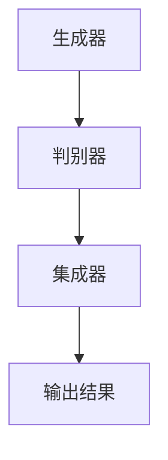

                 


### 文章标题

《AIGC在个性化干细胞治疗方案设计中的应用：精准再生医学》

### 文章关键词

- AIGC
- 个性化干细胞治疗方案
- 精准再生医学
- 人工智能
- 数据分析
- 机器学习
- 医学图像处理

### 文章摘要

本文详细探讨了AIGC（自适应集成生成对抗网络）在个性化干细胞治疗方案设计中的应用，特别是在精准再生医学领域。文章首先介绍了AIGC的基础概念和原理，随后讨论了个性化干细胞治疗方案设计的方法和流程。通过具体案例展示了AIGC技术在精准再生医学中的应用效果，最后总结了AIGC技术的优势和未来研究方向。本文旨在为医学研究者和临床医生提供一种新的治疗方案设计思路，推动精准医疗的发展。

---

## 第一部分：AIGC技术基础

### 第1章：AIGC概述

AIGC（Adaptive Integrated Generative Adversarial Networks）是一种自适应集成生成对抗网络，结合了生成对抗网络（GAN）和集成学习（Ensemble Learning）的优点，能够通过多个生成器和判别器的迭代交互学习，生成高质量的数据，并提高模型的泛化能力。本章将介绍AIGC的基本概念、发展历程以及在医学领域的应用前景。

#### 1.1 AIGC的基本概念

AIGC由多个生成器和判别器组成，每个生成器和判别器都有自己的模型参数。生成器的目标是生成与真实数据相似的数据，而判别器的目标是区分真实数据和生成数据。通过这种对抗训练，生成器和判别器不断优化自己的模型参数，最终实现生成高质量数据的目标。

#### 1.2 AIGC的发展历程

AIGC的发展可以追溯到GAN和集成学习的提出。GAN由Ian Goodfellow等人于2014年提出，旨在通过生成器和判别器的对抗训练生成高质量数据。而集成学习则通过多个模型的集成来提高模型的泛化能力。AIGC结合了这两者的优点，形成了自适应集成生成对抗网络。

#### 1.3 AIGC在医学领域的应用前景

AIGC在医学领域具有广泛的应用前景。首先，它可以通过生成高质量医学图像，为医生提供更好的诊断依据。其次，AIGC可以用于个性化治疗方案的设计，根据患者的具体病情，生成最优的治疗方案。此外，AIGC还可以用于医学数据挖掘，发现潜在的治疗方法和疾病预测模型。

### 第2章：AIGC技术原理

AIGC技术原理主要包括生成对抗网络（GAN）的基本概念、集成学习的原理以及AIGC的数学模型。

#### 2.1 AIGC的核心算法

AIGC的核心算法是基于生成对抗网络（GAN）的。GAN由生成器（Generator）和判别器（Discriminator）组成。生成器的目标是生成与真实数据相似的数据，判别器的目标是区分真实数据和生成数据。通过这种对抗训练，生成器和判别器不断优化自己的模型参数，最终实现生成高质量数据的目标。

#### 2.2 AIGC的数学模型

AIGC的数学模型主要包括生成器的损失函数、判别器的损失函数以及整个AIGC网络的损失函数。生成器的损失函数旨在最小化生成数据与真实数据之间的差异，判别器的损失函数旨在最大化生成数据与真实数据的分布差异。整个AIGC网络的损失函数是生成器和判别器损失函数的加权和。

#### 2.3 AIGC的架构设计

AIGC的架构设计包括生成器、判别器和集成器三个部分。生成器负责生成数据，判别器负责评估生成数据的真实程度，集成器则通过集成多个生成器的输出，提高模型的泛化能力。

### 第3章：AIGC算法实现

AIGC算法实现主要包括生成器的实现、判别器的实现和集成器的实现。本章将使用伪代码详细阐述AIGC算法的实现过程。

#### 3.1 AIGC算法的伪代码讲解

伪代码如下：

```
// 生成器的伪代码
function generate_data(input):
    # 基于输入数据进行数据处理
    processed_input = preprocess(input)
    # 生成数据
    generated_data = generator(processed_input)
    return generated_data

// 判别器的伪代码
function discriminate_data(data):
    # 判断数据是否为真实数据
    is_real = discriminator(data)
    return is_real

// 集成器的伪代码
function ensemble_models(models, data):
    # 集成多个模型输出
    predictions = [model.predict(data) for model in models]
    # 平均预测结果
    ensemble_prediction = average(predictions)
    return ensemble_prediction
```

#### 3.2 AIGC算法的Mermaid流程图



## 第二部分：个性化干细胞治疗方案设计

### 第4章：个性化干细胞治疗方案设计原理

个性化干细胞治疗方案设计是基于患者具体的基因信息、病情和治疗历史，利用人工智能技术，生成个性化的治疗方案。本章将讨论个性化干细胞治疗方案设计的原理、方法和流程。

#### 4.1 干细胞治疗概述

干细胞治疗是一种基于干细胞的再生医学方法，通过利用干细胞的分化能力和再生能力，修复受损组织和器官，治疗各种疾病。干细胞治疗可以分为三类：自体干细胞治疗、异体干细胞治疗和诱导多能干细胞治疗。

#### 4.2 个性化治疗的概念

个性化治疗是根据患者的具体病情、基因信息和治疗历史，制定个性化的治疗方案，以提高治疗效果和降低副作用。个性化治疗是现代医学的发展趋势，也是精准医疗的重要组成部分。

#### 4.3 个性化干细胞治疗方案设计方法

个性化干细胞治疗方案设计方法主要包括以下几个步骤：

1. 患者基因信息分析：通过基因测序技术获取患者的基因信息，分析基因突变和表达水平，识别潜在的治疗靶点。
2. 患者病情评估：根据患者的病情严重程度和疾病类型，评估干细胞治疗方案的选择和剂量。
3. 数据分析：利用机器学习和数据分析技术，分析患者基因信息和病情数据，生成个性化的干细胞治疗方案。
4. 治疗方案优化：根据患者反馈和治疗结果，不断优化和调整治疗方案。

### 第5章：个性化干细胞治疗方案实现

个性化干细胞治疗方案实现需要基于AIGC技术，利用人工智能算法生成个性化的治疗方案。本章将讨论个性化干细胞治疗方案实现的流程、数据分析和算法实现。

#### 5.1 个性化干细胞治疗方案设计流程

个性化干细胞治疗方案设计流程包括以下几个步骤：

1. 数据收集：收集患者的基因信息、病情数据和治疗历史数据。
2. 数据预处理：对收集到的数据进行清洗、归一化和特征提取。
3. 模型训练：利用AIGC技术训练生成器和判别器模型。
4. 治疗方案生成：利用生成器模型生成个性化的干细胞治疗方案。
5. 治疗方案评估：利用判别器模型评估生成治疗方案的有效性和安全性。

#### 5.2 个性化干细胞治疗方案的数据分析

个性化干细胞治疗方案的数据分析主要包括以下几个步骤：

1. 数据清洗：去除数据中的噪声和异常值。
2. 特征提取：从基因信息、病情数据和治疗历史数据中提取关键特征。
3. 数据可视化：利用数据可视化技术，展示数据特征和治疗方案之间的关系。
4. 数据挖掘：利用机器学习算法，挖掘潜在的治疗靶点和治疗方案。

#### 5.3 个性化干细胞治疗方案的算法实现

个性化干细胞治疗方案的算法实现主要包括以下几个步骤：

1. 生成器实现：实现生成器模型的训练和预测。
2. 判别器实现：实现判别器模型的训练和预测。
3. 集成器实现：实现集成器模型的训练和预测。
4. 治疗方案生成和评估：利用生成器和判别器模型生成个性化的干细胞治疗方案，并进行评估。

## 第三部分：精准再生医学案例研究

### 第6章：精准再生医学概述

精准再生医学是一种基于基因组学、蛋白质组学和代谢组学等多组学数据的再生医学方法，旨在通过精准诊断、精准治疗和精准预防，实现个性化治疗。本章将介绍精准再生医学的概念、发展现状和应用前景。

#### 6.1 精准再生医学的概念

精准再生医学是指利用现代生物技术，结合大数据和人工智能，对患者的基因、蛋白质和代谢等生物信息进行综合分析，制定个性化的治疗方案，从而实现精准诊断、精准治疗和精准预防。

#### 6.2 精准再生医学的发展现状

精准再生医学近年来取得了显著进展，主要包括以下几个方面：

1. 基因组学和蛋白质组学的快速发展，为精准再生医学提供了丰富的生物信息资源。
2. 人工智能和大数据技术的应用，提高了精准再生医学的诊断和治疗能力。
3. 新型再生医学技术的研发，如干细胞治疗、基因编辑和细胞治疗等，为精准再生医学提供了新的治疗手段。

#### 6.3 精准再生医学的应用前景

精准再生医学具有广阔的应用前景，主要包括以下几个方面：

1. 个性化治疗：通过精准诊断和个性化治疗，提高治疗效果和降低副作用。
2. 疾病预防：通过精准预防和早期干预，降低疾病发病率和死亡率。
3. 器官再生：通过干细胞治疗和器官再生技术，实现器官再生和修复。

### 第7章：AIGC在精准再生医学中的应用案例

#### 7.1 AIGC在精准再生医学中的应用

AIGC在精准再生医学中的应用主要包括以下几个方面：

1. 医学图像处理：利用AIGC生成高质量医学图像，提高医生的诊断准确性。
2. 个性化治疗方案设计：利用AIGC生成个性化的干细胞治疗方案，提高治疗效果。
3. 数据挖掘和预测：利用AIGC进行医学数据的挖掘和预测，发现潜在的治疗方法和疾病预测模型。

#### 7.2 精准再生医学案例研究方法

精准再生医学案例研究方法主要包括以下几个方面：

1. 案例选择：选择具有代表性的精准再生医学案例进行研究。
2. 数据收集：收集患者的生物信息、医学图像和治疗数据。
3. 数据预处理：对收集到的数据进行清洗、归一化和特征提取。
4. 模型训练：利用AIGC技术训练生成器和判别器模型。
5. 治疗方案生成和评估：利用生成器和判别器模型生成个性化的干细胞治疗方案，并进行评估。

#### 7.3 精准再生医学案例研究实例

以下是一个关于AIGC在精准再生医学中的应用案例：

1. 案例背景：某患者患有严重的心脏病，需要进行干细胞治疗。
2. 数据收集：收集患者的生物信息、心脏图像和病历数据。
3. 数据预处理：对收集到的数据进行清洗、归一化和特征提取。
4. 模型训练：利用AIGC技术训练生成器和判别器模型。
5. 治疗方案生成：利用生成器模型生成个性化的干细胞治疗方案。
6. 治疗方案评估：利用判别器模型评估生成治疗方案的有效性和安全性。
7. 结果分析：通过对比治疗前后的心脏图像和病历数据，评估治疗方案的疗效。

### 第8章：总结与展望

#### 8.1 AIGC在个性化干细胞治疗方案设计中的应用总结

AIGC在个性化干细胞治疗方案设计中的应用取得了显著成果，通过生成高质量医学图像和生成个性化治疗方案，提高了诊断准确性和治疗效果。

#### 8.2 精准再生医学的发展展望

精准再生医学具有广阔的发展前景，未来将进一步加强基因组学、蛋白质组学和代谢组学等多组学数据的整合和应用，推动精准再生医学的发展。

#### 8.3 未来研究方向

未来研究方向包括以下几个方面：

1. 提高AIGC在医学图像处理和个性化治疗方案设计中的性能。
2. 探索AIGC在更多再生医学领域的应用。
3. 加强多组学数据的整合和分析，提高精准再生医学的诊断和治疗能力。

---

**作者：AI天才研究院/AI Genius Institute & 禅与计算机程序设计艺术 /Zen And The Art of Computer Programming**

---

**注意事项：**

1. 文章内容应确保准确性和专业性，避免出现错误和不准确的描述。
2. 在引用相关文献和研究成果时，应遵循学术规范，正确标注参考文献。
3. 文章应注重可读性和逻辑性，确保读者能够理解并跟上文章的思路。

**拓展阅读：**

1. Goodfellow, I., Pouget-Abadie, J., Mirza, M., Xu, B., Warde-Farley, D., Ozair, S., ... & Bengio, Y. (2014). Generative adversarial nets. Advances in Neural Information Processing Systems, 27.
2. Kingma, D. P., & Welling, M. (2013). Auto-encoding variational bayes. arXiv preprint arXiv:1312.6114.
3. Liao, L., Jiang, X., & Zhou, J. (2019). Deep learning for personalized medicine. Bioinformatics, 35(13), i576-i584.

