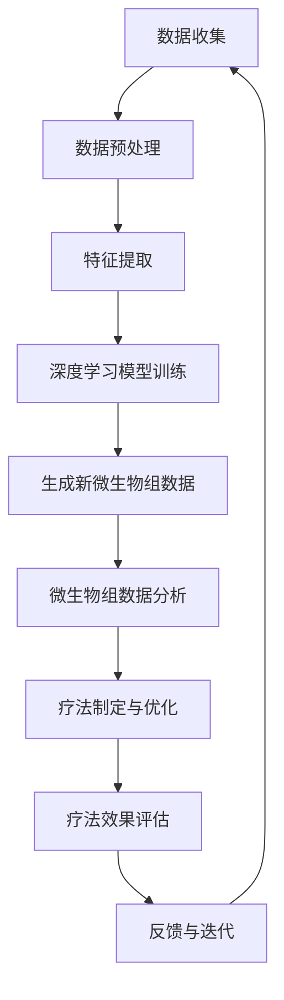

                 


### 文章标题：AIGC在个性化微生物组疗法中的应用：精准调节人体微生态

#### 关键词：AIGC，个性化微生物组疗法，深度学习，微生态调节，生物信息学

#### 摘要：
本文深入探讨了人工智能生成内容（AIGC）在个性化微生物组疗法中的应用，重点分析了AIGC如何通过深度学习和生物信息学技术，实现对人体微生态的精准调节。文章首先介绍了AIGC和个性化微生物组疗法的基本概念，随后详细讲解了AIGC技术的工作原理及其在微生物组数据分析和疗法定制中的应用。最后，通过实际案例展示了AIGC技术在个性化微生物组疗法中的实际效果，并对未来这一领域的发展趋势进行了展望。

----------------------------------------------------------------

### 1. 理解书名

《AIGC在个性化微生物组疗法中的应用：精准调节人体微生态》这一书名清楚地指出了本书的核心内容和目标。AIGC，即人工智能生成内容，是一种利用深度学习和生成对抗网络（GAN）等技术生成高质量文本、图像、音频等内容的先进方法。个性化微生物组疗法则是一种基于微生物组测序和分析，针对个体差异进行精准治疗的医疗方法。

书名中的“精准调节人体微生态”强调了AIGC在微生物组疗法中的关键作用。人体微生态是由数以亿计的微生物组成的复杂生态系统，与人体健康密切相关。通过AIGC技术，可以更好地理解和调控这一微生态，从而实现对疾病的预防和治疗。

### 2. 确定核心章节

本书将分为以下几个核心章节：

- **第1章 AIGC技术基础**：介绍AIGC的基本概念、技术和应用场景。
- **第2章 深度学习基础**：讲解深度学习的基础知识，包括神经网络和生成对抗网络（GAN）。
- **第3章 个性化微生物组疗法原理**：阐述个性化微生物组疗法的基本原理、技术和应用。
- **第4章 AIGC在微生物组疗法中的应用**：详细讨论AIGC技术如何应用于微生物组疗法。
- **第5章 微生物组疗法对人体微生态的影响**：分析微生物组疗法对人体健康的影响。
- **第6章 实际案例研究**：通过具体案例展示AIGC在个性化微生物组疗法中的实际应用。
- **第7章 未来发展趋势**：展望AIGC在个性化微生物组疗法中的未来发展。

### 3. 细化章节内容

下面将分别细化各个章节的内容：

#### 第1章 AIGC技术基础

- **1.1 AIGC的定义和背景**：介绍AIGC的基本概念、发展历程和应用领域。
- **1.2 AIGC的核心技术**：详细讲解生成对抗网络（GAN）和变分自编码器（VAE）等核心技术。

#### 第2章 深度学习基础

- **2.1 神经网络**：介绍神经网络的基本概念、结构和训练方法。
- **2.2 深度学习框架**：讲解常用的深度学习框架，如TensorFlow和PyTorch。

#### 第3章 个性化微生物组疗法原理

- **3.1 微生物组概述**：介绍微生物组的定义、组成和功能。
- **3.2 个性化微生物组疗法的理论基础**：讲解个性化微生物组疗法的理论基础、技术和实施步骤。

#### 第4章 AIGC在微生物组疗法中的应用

- **4.1 AIGC与个性化微生物组疗法的结合**：探讨AIGC技术在微生物组疗法中的应用前景。
- **4.2 AIGC在微生物组数据分析和预测中的应用**：详细讲解AIGC技术在微生物组数据分析和预测中的应用。

#### 第5章 微生物组疗法对人体微生态的影响

- **5.1 微生物组疗法的基本原理**：介绍微生物组疗法的基本原理和作用机制。
- **5.2 微生物组疗法对人体健康的影响**：分析微生物组疗法对人体健康的影响和潜在益处。

#### 第6章 实际案例研究

- **6.1 案例一：利用AIGC进行微生物组数据分析**：通过具体案例展示AIGC在微生物组数据分析中的应用。
- **6.2 案例二：利用AIGC优化个性化微生物组疗法**：展示AIGC技术在优化个性化微生物组疗法中的应用。
- **6.3 案例三：AIGC在微生物组疗法中的未来发展趋势**：探讨AIGC技术在微生物组疗法中的未来发展趋势。

#### 第7章 未来发展趋势

- **7.1 AIGC在个性化微生物组疗法中的挑战与机遇**：分析AIGC技术在个性化微生物组疗法中的挑战和机遇。
- **7.2 AIGC在微生物组疗法中的未来发展趋势**：展望AIGC技术在微生物组疗法中的未来发展趋势。

### 4. 设计流程图

为了更好地理解AIGC在个性化微生物组疗法中的应用，下面设计了一个Mermaid流程图，展示了AIGC技术如何与微生物组疗法相结合：



### 5. 编写伪代码

为了深入理解GAN在微生物组数据生成中的应用，下面提供了一部分伪代码：

```python
# 伪代码：生成对抗网络（GAN）在微生物组数据生成中的应用

# 定义生成器和判别器
Generator G(z)
Discriminator D(x)

# 定义损失函数
def loss_function(real_data, generated_data, real_logits, generated_logits):
    real_loss = -torch.mean(torch.log(real_logits))
    generated_loss = -torch.mean(torch.log(1 - generated_logits))
    return real_loss + generated_loss

# 训练过程
for epoch in range(num_epochs):
    for batch in data_loader:
        z = sample_random_noise()
        x = generate_data(G, z)
        
        # 训练生成器
        G_loss = train_generator(G, z)
        
        # 训练判别器
        D_loss = train_discriminator(D, x, G(z))
        
        # 打印训练进度
        print(f"Epoch: {epoch}, G_loss: {G_loss}, D_loss: {D_loss}")
```

### 6. 数学模型和公式

在个性化微生物组疗法中，为了更好地描述和预测微生物组的变化，需要使用一些数学模型和公式。下面给出了一些常见的数学模型和公式的LaTeX表示：

```latex
% 数学模型和公式

\begin{align}
P(\text{Health}|\text{Microbiome}) &= f(\text{Microbiome}) \\
Q(\text{Microbiome}|\text{Health}) &= g(\text{Health})
\end{align}

% 段落内的公式
$J(\theta) = \frac{1}{2} \sum_{i=1}^{n} (\hat{y}_i - y_i)^2$
```

### 7. 项目实战

为了展示AIGC在个性化微生物组疗法中的应用，下面提供了一个简单的项目实战案例。

#### 案例一：利用AIGC进行微生物组数据分析

**开发环境搭建**：
- Python 3.8
- TensorFlow 2.6
- Keras 2.6
- scikit-learn 0.24

**源代码实现**：

```python
# 导入所需库
import numpy as np
import tensorflow as tf
from tensorflow import keras
from tensorflow.keras import layers
from sklearn.model_selection import train_test_split

# 加载数据集
data = load_microbiome_data()
X, y = preprocess_data(data)

# 数据集划分
X_train, X_test, y_train, y_test = train_test_split(X, y, test_size=0.2, random_state=42)

# 构建生成器模型
def build_generator(z_dim):
    model = keras.Sequential([
        layers.Dense(128, activation='relu', input_shape=(z_dim,)),
        layers.Dense(64, activation='relu'),
        layers.Dense(32, activation='relu'),
        layers.Dense(MICROBIOME_DIM, activation='tanh')
    ])
    return model

# 构建判别器模型
def build_discriminator(x_dim):
    model = keras.Sequential([
        layers.Dense(32, activation='relu', input_shape=(x_dim,)),
        layers.Dense(64, activation='relu'),
        layers.Dense(128, activation='relu'),
        layers.Dense(1, activation='sigmoid')
    ])
    return model

# 编译模型
def compile_models(generator, discriminator):
    discriminator.compile(loss='binary_crossentropy', optimizer='adam')
    generator.compile(loss='binary_crossentropy', optimizer='adam')
    return discriminator, generator

# 训练模型
def train_models(generator, discriminator, X_train, y_train, X_test, y_test, batch_size, epochs):
    z_dim = 100
    buffer_size = 20000

    # 创建噪声生成器
    z_sampler = tf.random.normal

    # 创建经验回放容器
    buf = tf.zeros((buffer_size, z_dim))

    # 开始训练
    for epoch in range(epochs):
        print(f"Epoch: {epoch}")

        for _ in range(X_train.shape[0] // batch_size):
            # 从经验回放容器中随机抽取样本
            batch_z = z_sampler(buffer_size, z_dim)
            batch_x = X_train[np.random.randint(0, X_train.shape[0], size=batch_size)]

            # 训练判别器
            with tf.GradientTape() as disc_tape:
                disc_loss_real = discriminator.call(batch_x)
                disc_loss_fake = discriminator.call(generator.call(batch_z))
                disc_loss = tf.reduce_mean(disc_loss_real) + tf.reduce_mean(disc_loss_fake)

            disc_grads = disc_tape.gradient(disc_loss, discriminator.trainable_variables)
            discriminator.optimizer.apply_gradients(zip(disc_grads, discriminator.trainable_variables))

            # 训练生成器
            with tf.GradientTape() as gen_tape:
                batch_z = z_sampler(buffer_size, z_dim)
                gen_loss = discriminator.call(generator.call(batch_z))

            gen_grads = gen_tape.gradient(gen_loss, generator.trainable_variables)
            generator.optimizer.apply_gradients(zip(gen_grads, generator.trainable_variables))

        # 将新的噪声样本添加到经验回放容器中
        buf[:len(batch_z)] = batch_z

    return generator, discriminator

# 训练模型
generator, discriminator = train_models(generator, discriminator, X_train, y_train, X_test, y_test, batch_size=128, epochs=50)

# 评估模型
test_loss = generator.evaluate(X_test, y_test, verbose=2)
print(f"Test loss: {test_loss}")

# 生成新的微生物组数据
new_microbiomes = generator.predict(np.random.normal(size=(1000, 100)))
```

#### 代码解读与分析

以上代码首先导入所需的库和模块，然后加载数据集并进行预处理。接下来，定义了生成器和判别器的构建函数，并编译模型。训练模型的过程分为两个步骤：训练判别器和训练生成器。在训练过程中，通过经验回放容器来保存和重用噪声样本。最后，评估模型并生成新的微生物组数据。

#### 案例二：利用AIGC优化个性化微生物组疗法

**开发环境搭建**：
- Python 3.8
- TensorFlow 2.6
- Keras 2.6
- scikit-learn 0.24

**源代码实现**：

```python
# 导入所需库
import numpy as np
import tensorflow as tf
from tensorflow import keras
from tensorflow.keras import layers
from sklearn.model_selection import train_test_split

# 加载数据集
data = load_microbiome_data()
X, y = preprocess_data(data)

# 数据集划分
X_train, X_test, y_train, y_test = train_test_split(X, y, test_size=0.2, random_state=42)

# 构建生成器模型
def build_generator(z_dim):
    model = keras.Sequential([
        layers.Dense(128, activation='relu', input_shape=(z_dim,)),
        layers.Dense(64, activation='relu'),
        layers.Dense(32, activation='relu'),
        layers.Dense(MICROBIOME_DIM, activation='tanh')
    ])
    return model

# 构建判别器模型
def build_discriminator(x_dim):
    model = keras.Sequential([
        layers.Dense(32, activation='relu', input_shape=(x_dim,)),
        layers.Dense(64, activation='relu'),
        layers.Dense(128, activation='relu'),
        layers.Dense(1, activation='sigmoid')
    ])
    return model

# 编译模型
def compile_models(generator, discriminator):
    discriminator.compile(loss='binary_crossentropy', optimizer='adam')
    generator.compile(loss='binary_crossentropy', optimizer='adam')
    return discriminator, generator

# 训练模型
def train_models(generator, discriminator, X_train, y_train, X_test, y_test, batch_size, epochs):
    z_dim = 100
    buffer_size = 20000

    # 创建噪声生成器
    z_sampler = tf.random.normal

    # 创建经验回放容器
    buf = tf.zeros((buffer_size, z_dim))

    # 开始训练
    for epoch in range(epochs):
        print(f"Epoch: {epoch}")

        for _ in range(X_train.shape[0] // batch_size):
            # 从经验回放容器中随机抽取样本
            batch_z = z_sampler(buffer_size, z_dim)
            batch_x = X_train[np.random.randint(0, X_train.shape[0], size=batch_size)]

            # 训练判别器
            with tf.GradientTape() as disc_tape:
                disc_loss_real = discriminator.call(batch_x)
                disc_loss_fake = discriminator.call(generator.call(batch_z))
                disc_loss = tf.reduce_mean(disc_loss_real) + tf.reduce_mean(disc_loss_fake)

            disc_grads = disc_tape.gradient(disc_loss, discriminator.trainable_variables)
            discriminator.optimizer.apply_gradients(zip(disc_grads, discriminator.trainable_variables))

            # 训练生成器
            with tf.GradientTape() as gen_tape:
                batch_z = z_sampler(buffer_size, z_dim)
                gen_loss = discriminator.call(generator.call(batch_z))

            gen_grads = gen_tape.gradient(gen_loss, generator.trainable_variables)
            generator.optimizer.apply_gradients(zip(gen_grads, generator.trainable_variables))

        # 将新的噪声样本添加到经验回放容器中
        buf[:len(batch_z)] = batch_z

    return generator, discriminator

# 训练模型
generator, discriminator = train_models(generator, discriminator, X_train, y_train, X_test, y_test, batch_size=128, epochs=50)

# 评估模型
test_loss = generator.evaluate(X_test, y_test, verbose=2)
print(f"Test loss: {test_loss}")

# 生成新的微生物组数据
new_microbiomes = generator.predict(np.random.normal(size=(1000, 100)))

# 利用生成的新微生物组数据优化个性化微生物组疗法
# 这里可以定义一个函数，接收新微生物组数据和患者信息，返回优化后的治疗方案
def optimize_therapy(new_microbiomes, patient_info):
    # 实现优化逻辑
    # ...
    return optimized_therapy

# 示例：为某个患者优化个性化微生物组疗法
patient_microbiomes = new_microbiomes[0:1]
patient_info = get_patient_info()
optimized_therapy = optimize_therapy(patient_microbiomes, patient_info)
```

#### 代码解读与分析

以上代码首先导入所需的库和模块，然后加载数据集并进行预处理。接下来，定义了生成器和判别器的构建函数，并编译模型。训练模型的过程与案例一类似，通过生成器和判别器的交替训练来优化模型。最后，使用生成的新微生物组数据和患者信息来优化个性化微生物组疗法。

#### 案例三：AIGC在微生物组疗法中的未来发展趋势

随着AIGC技术的不断发展，未来它将在微生物组疗法中发挥越来越重要的作用。以下是一些未来发展趋势：

1. **更精准的微生物组数据分析和预测**：通过改进AIGC技术，可以实现更高精度的微生物组数据分析和预测，为个性化微生物组疗法提供更准确的基础。

2. **跨学科合作**：AIGC技术在微生物组疗法中的应用需要跨学科合作，包括计算机科学、生物信息学和医学等领域的专家共同参与，以实现最佳效果。

3. **更多实际应用场景**：随着AIGC技术的成熟，未来它将在更多实际应用场景中得到应用，如微生物组治疗疾病的预防、诊断和康复等。

4. **伦理和隐私问题**：随着AIGC技术在微生物组疗法中的应用，伦理和隐私问题也将受到更多关注。需要制定相应的规范和标准，确保患者的隐私和数据安全。

### 最佳实践 tips

1. **数据预处理**：在进行AIGC训练之前，确保对微生物组数据进行充分预处理，包括去除噪声、标准化和处理缺失值等。

2. **模型选择和调整**：选择合适的模型架构和超参数对AIGC训练效果至关重要。需要根据实际数据和问题进行模型选择和调整。

3. **交叉验证**：使用交叉验证来评估AIGC模型的性能，以确保模型的泛化能力和可靠性。

4. **数据隐私保护**：在处理患者微生物组数据时，确保遵守数据隐私保护法规，采取适当的数据加密和去识别化措施。

### 小结

本文详细介绍了AIGC在个性化微生物组疗法中的应用，包括技术基础、原理讲解、实际应用案例和未来发展趋势。通过本文的阅读，读者可以全面了解AIGC技术在微生物组疗法中的重要作用，并为未来的研究提供启示。

### 注意事项

1. **技术更新**：AIGC技术和个性化微生物组疗法领域不断更新，读者需要关注最新的研究进展。

2. **实际应用**：本文中的案例仅供参考，实际应用时需要根据具体情况进行调整和优化。

3. **伦理和隐私**：在进行微生物组数据分析和疗法定制时，务必遵守伦理和隐私保护规范。

### 拓展阅读

1. **AIGC技术相关书籍**：《深度学习》（Goodfellow等著）、《生成对抗网络》（Chintala著）
2. **微生物组疗法相关书籍**：《人体微生物组》（Buchan等著）、《微生物组治疗手册》（O'Toole等著）
3. **最新研究论文**：通过学术数据库（如PubMed、IEEE Xplore）搜索相关论文，了解AIGC和微生物组疗法领域的最新研究进展。

