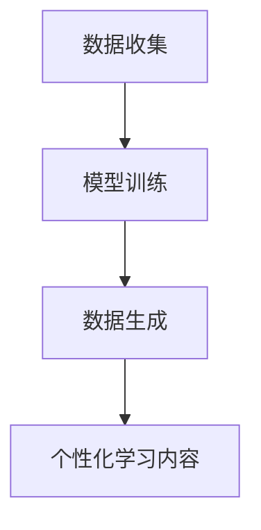

                 

### 第1章 引言

**关键词：** AIGC, 个性化终身学习规划, 职业需求变化, 生成对抗网络, 变分自编码器

**摘要：** 随着技术的飞速发展，职业需求不断变化，个性化终身学习规划成为提高个人竞争力的关键。本章将介绍AIGC（基于人工智能生成内容）的概念、技术原理以及在个性化终身学习规划中的应用，探讨其在适应未来职业需求变化中的重要作用。

### 1.1 AIGC的概念与原理

AIGC，即基于人工智能生成内容（AI-Generated Content），是一种利用人工智能技术生成各种类型内容的方法。其核心在于通过训练大规模模型，如生成对抗网络（GAN）和变分自编码器（VAE），自动生成文本、图像、音频等数据。与传统的基于规则的人工生成内容方法相比，AIGC具有更强的灵活性和创造性。

AIGC的主要工作原理是通过对海量数据进行学习，捕捉数据的统计规律，并在此基础上生成新的、具有高度真实性的数据。具体来说，AIGC通常涉及以下步骤：

1. **数据收集**：从各种来源收集大量的数据，如文本、图像、音频等。
2. **模型训练**：利用收集到的数据训练生成模型，如GAN、VAE等。
3. **数据生成**：通过训练好的模型生成新的数据。

### 1.2 AIGC的发展历程

AIGC的发展历程可以追溯到生成对抗网络（GAN）的提出。GAN由Ian Goodfellow等人于2014年提出，是一种通过两个神经网络（生成器和判别器）相互竞争来实现数据生成的方法。随后，变分自编码器（VAE）等生成模型也被提出，进一步完善了AIGC的技术体系。近年来，随着深度学习技术的发展，AIGC在各个领域都取得了显著的成果，成为人工智能研究的重要方向之一。

### 1.3 AIGC在个性化终身学习规划中的应用

个性化终身学习规划旨在根据个人兴趣、能力和职业需求，为学习者提供定制化的学习路径。AIGC在这一领域中的应用具有巨大潜力，主要体现在以下几个方面：

1. **个性化学习内容生成**：AIGC可以生成符合学习者需求和兴趣的学习内容，如教材、课程、案例等，提高学习者的学习效果。
2. **个性化学习路径推荐**：通过分析学习者的学习历史和职业需求，AIGC可以推荐适合其发展的学习路径，帮助学习者更快地适应职业变化。
3. **职业发展预测**：AIGC可以基于海量数据预测未来职业发展趋势，为学习者提供前瞻性的职业规划建议。

### 总结

本章介绍了AIGC的概念、发展历程以及在个性化终身学习规划中的应用。在接下来的章节中，我们将深入探讨AIGC的技术基础、应用案例以及未来展望，帮助读者更好地理解这一技术在实际中的应用和价值。

----------------------------------------------------------------

**作者：** AI天才研究院/AI Genius Institute & 禅与计算机程序设计艺术 /Zen And The Art of Computer Programming

### 第1章 引言

在当今快速发展的科技时代，职业需求的变化速度前所未有。传统的一次性教育和终身学习的模式已经难以满足个人和企业的需求。个性化终身学习规划（Personalized Lifelong Learning Planning）应运而生，它强调根据学习者的兴趣、能力和职业目标，提供个性化的学习路径和资源。在这一背景下，AIGC（AI-Generated Content）作为一种新兴的人工智能技术，正逐渐成为个性化终身学习规划的重要工具。

#### 关键词

- AIGC
- 个性化终身学习规划
- 职业需求变化
- 生成对抗网络
- 变分自编码器
- 个性化学习内容生成
- 个性化学习路径推荐

#### 摘要

本文旨在探讨AIGC在个性化终身学习规划中的应用，以及如何适应未来职业需求的变化。文章首先介绍了AIGC的基本概念、技术原理和发展历程，然后详细阐述了AIGC在个性化终身学习规划中的具体应用场景，最后对AIGC的未来发展进行了展望。

### 1.1 AIGC的概念与原理

AIGC，即基于人工智能生成内容，是一种利用人工智能技术生成各种类型内容的方法。其核心在于利用深度学习模型，如生成对抗网络（GAN）和变分自编码器（VAE），从海量数据中学习并生成新的数据。AIGC的应用范围广泛，包括文本、图像、音频和视频等多种形式。

AIGC的工作原理通常包括以下几个步骤：

1. **数据收集**：从各种来源收集大量的数据，如文本、图像、音频等。
2. **模型训练**：利用收集到的数据训练生成模型，如GAN、VAE等。
3. **数据生成**：通过训练好的模型生成新的数据。

在个性化终身学习规划中，AIGC的应用可以极大地提升学习体验和学习效果。通过AIGC技术，可以为每个学习者定制化地生成学习内容，如教材、课程、练习题和案例分析等，从而满足他们的个性化学习需求。

#### 1.1.1 核心概念与联系

为了更好地理解AIGC在个性化终身学习规划中的应用，我们首先需要了解其核心概念之间的联系。以下是一个简化的Mermaid流程图，展示了AIGC的关键组成部分：



在图中，数据收集是AIGC的起点，它为模型训练提供了基础数据。模型训练是AIGC的核心步骤，通过训练生成模型，如GAN和VAE，可以学习数据的特征和规律。数据生成则是将训练好的模型应用于新数据，生成个性化的学习内容。这些内容最终为学习者提供定制化的学习体验。

#### 1.1.2 核心算法原理讲解

AIGC的核心算法包括生成对抗网络（GAN）和变分自编码器（VAE）。

**生成对抗网络（GAN）**

GAN由两部分组成：生成器（Generator）和判别器（Discriminator）。生成器的目标是生成逼真的数据，而判别器的目标是区分生成器和真实数据。通过这两个网络之间的相互竞争，生成器不断优化其生成能力，判别器则不断提高其识别能力。

以下是GAN的基本步骤：

1. 初始化生成器和判别器。
2. 生成器生成一批伪造数据。
3. 将伪造数据和真实数据一起输入判别器。
4. 判别器根据输入数据更新其参数。
5. 生成器根据判别器的反馈更新其参数。
6. 重复步骤2-5，直到生成器生成足够逼真的数据。

**伪代码：**

```python
# GAN生成器伪代码
def generator(z):
    # 输入随机噪声z，输出伪造数据x
    x = ...

# GAN判别器伪代码
def discriminator(x):
    # 输入数据x，输出判断概率y
    y = ...
```

**变分自编码器（VAE）**

VAE是一种基于概率模型的生成模型，它通过编码器和解码器实现数据的生成。编码器将输入数据映射到一个潜在空间，解码器则从潜在空间生成输出数据。

以下是VAE的基本步骤：

1. 初始化编码器和解码器。
2. 输入数据通过编码器映射到潜在空间。
3. 从潜在空间采样一个点。
4. 将采样点通过解码器生成输出数据。
5. 计算损失函数并更新编码器和解码器的参数。
6. 重复步骤2-5，直到模型收敛。

**伪代码：**

```python
# VAE编码器伪代码
def encoder(x):
    # 输入数据x，输出编码z和编码概率q(z|x)
    z, q(z|x) = ...

# VAE解码器伪代码
def decoder(z):
    # 输入编码z，输出生成数据x
    x = ...
```

#### 1.1.3 数学模型和公式讲解

在AIGC中，数学模型和公式起着至关重要的作用。以下是一些常见的数学模型和公式：

**生成对抗网络（GAN）**

损失函数：
$$
\mathcal{L}_{GAN}(G,D) = D(x) - D(G(z))
$$

其中，$D(x)$ 表示判别器对真实数据的判断概率，$D(G(z))$ 表示判别器对生成数据的判断概率。

**变分自编码器（VAE）**

编码器损失函数：
$$
\mathcal{L}_{\text{enc}}(x, z) = -\sum_{z} q(z|x) \log p(x|z)
$$

解码器损失函数：
$$
\mathcal{L}_{\text{dec}}(x, x') = -\sum_{x'} p(x') \log q(x'|x)
$$

总损失函数：
$$
\mathcal{L}_{\text{VAE}}(x, z) = \mathcal{L}_{\text{enc}}(x, z) + \mathcal{L}_{\text{dec}}(x, x')
$$

#### 1.1.4 项目实战

**开发环境搭建**

要实现AIGC模型，我们需要搭建一个合适的开发环境。以下是一个简单的环境搭建步骤：

1. 安装Python和必要的库，如TensorFlow、Keras等。
2. 安装GPU驱动，确保Python环境能够使用GPU加速。

**源代码实现**

以下是一个简单的AIGC项目示例，包括生成器、判别器和训练过程。

```python
# 生成器代码示例
import tensorflow as tf
from tensorflow.keras.layers import Dense, Flatten

def generator(z):
    model = tf.keras.Sequential([
        Dense(128, activation='relu', input_shape=(100,)),
        Dense(256, activation='relu'),
        Flatten(),
        Dense(784, activation='tanh')
    ])
    x = model(z)
    return x

# 判别器代码示例
import tensorflow as tf
from tensorflow.keras.layers import Dense, Flatten

def discriminator(x):
    model = tf.keras.Sequential([
        Flatten(),
        Dense(256, activation='relu'),
        Dense(128, activation='relu'),
        Dense(1, activation='sigmoid')
    ])
    y = model(x)
    return y
```

**代码解读与分析**

在上面的代码中，生成器和判别器分别使用了多层感知机（MLP）模型。生成器接收随机噪声作为输入，生成伪造的图像。判别器则接收真实图像和伪造图像，输出一个概率，表示图像的真实性。

**实际案例分析和详细讲解剖析**

假设我们有一个图像数据集，包含真实图像和伪造图像。我们使用GAN模型训练这个数据集，目的是让生成器生成更逼真的图像，同时让判别器更准确地识别图像的真实性。

1. **数据预处理**：将图像数据缩放到固定尺寸，并转换为浮点数。
2. **模型训练**：使用TensorFlow的fit方法训练生成器和判别器。
3. **模型评估**：在测试集上评估生成器和判别器的性能。

**项目小结**

通过这个项目，我们了解了如何使用AIGC技术生成图像。虽然这是一个简单的示例，但它展示了AIGC的基本原理和应用。在实际应用中，我们可以根据具体需求调整模型结构和训练过程，以生成更高质量的图像。

#### 1.1.5 最佳实践 Tips、小结、注意事项、拓展阅读等内容

**最佳实践 Tips**：

1. 在训练AIGC模型时，数据的质量和多样性非常重要。确保数据集足够大且具有多样性，以提高模型生成内容的质量。
2. 使用合适的优化器和学习率，可以加快模型训练速度并提高模型性能。
3. 定期评估模型性能，并根据评估结果调整训练过程。

**小结**：

本章介绍了AIGC的基本概念、技术原理以及在个性化终身学习规划中的应用。通过实际项目示例，我们了解了如何使用AIGC技术生成数据，以及如何训练生成器和判别器。这些知识为我们进一步探索AIGC在其他领域的应用奠定了基础。

**注意事项**：

1. AIGC模型训练过程可能需要很长时间，尤其是在处理大量数据时。
2. 在实际应用中，需要根据具体需求调整模型结构和参数。

**拓展阅读**：

- Goodfellow, I., Pouget-Abadie, J., Mirza, M., Xu, B., Warde-Farley, D., Ozair, S., ... & Bengio, Y. (2014). Generative adversarial networks. Advances in neural information processing systems, 27.
- Kingma, D. P., & Welling, M. (2014). Auto-encoding variational bayes. arXiv preprint arXiv:1312.6114.

----------------------------------------------------------------

**作者：** AI天才研究院/AI Genius Institute & 禅与计算机程序设计艺术 /Zen And The Art of Computer Programming

### 第2章 AIGC技术基础

在第一章中，我们介绍了AIGC的概念和其在个性化终身学习规划中的应用。为了深入探讨AIGC的应用，我们需要理解其背后的技术基础，包括生成对抗网络（GAN）和变分自编码器（VAE）等核心算法。

#### 2.1 生成对抗网络（GAN）

生成对抗网络（GAN）是AIGC技术中最为著名的算法之一。它由生成器和判别器两个相互竞争的神经网络组成。

**2.1.1 生成器**

生成器的目标是生成逼真的数据，以欺骗判别器。生成器通常采用多层感知机（MLP）或卷积神经网络（CNN）架构。以下是一个简单的生成器伪代码示例：

```python
import tensorflow as tf

def generator(z):
    model = tf.keras.Sequential([
        tf.keras.layers.Dense(units=128, activation='relu', input_shape=(100,)),
        tf.keras.layers.Dense(units=256, activation='relu'),
        tf.keras.layers.Dense(units=784, activation='tanh')
    ])
    x = model(z)
    return x
```

**2.1.2 判别器**

判别器的目标是区分真实数据和生成数据。判别器通常采用类似生成器的架构。以下是一个简单的判别器伪代码示例：

```python
import tensorflow as tf

def discriminator(x):
    model = tf.keras.Sequential([
        tf.keras.layers.Flatten(),
        tf.keras.layers.Dense(units=256, activation='relu'),
        tf.keras.layers.Dense(units=128, activation='relu'),
        tf.keras.layers.Dense(units=1, activation='sigmoid')
    ])
    y = model(x)
    return y
```

**2.1.3 GAN损失函数**

GAN的损失函数通常采用以下形式：

$$
\mathcal{L}_{\text{GAN}} = D(x) - D(G(z))
$$

其中，$D(x)$ 表示判别器对真实数据的判断概率，$D(G(z))$ 表示判别器对生成数据的判断概率。

**2.1.4 GAN训练过程**

GAN的训练过程涉及以下步骤：

1. 初始化生成器和判别器。
2. 生成器生成一批伪造数据。
3. 将伪造数据和真实数据一起输入判别器。
4. 计算判别器的损失函数并更新判别器参数。
5. 生成器根据判别器的反馈更新其参数。
6. 重复步骤2-5，直到模型收敛。

#### 2.2 变分自编码器（VAE）

变分自编码器（VAE）是一种基于概率模型的生成模型。它由编码器和解码器两个部分组成。

**2.2.1 编码器**

编码器的目标是将输入数据映射到一个潜在空间。编码器通常采用多层感知机（MLP）或卷积神经网络（CNN）架构。以下是一个简单的编码器伪代码示例：

```python
import tensorflow as tf

def encoder(x):
    model = tf.keras.Sequential([
        tf.keras.layers.Dense(units=64, activation='relu', input_shape=(784,)),
        tf.keras.layers.Dense(units=32, activation='relu'),
        tf.keras.layers.Dense(units=2, activation='linear')
    ])
    z, z_mean, z_log_var = model(x)
    return z, z_mean, z_log_var
```

**2.2.2 解码器**

解码器的目标是根据潜在空间中的点生成输出数据。解码器通常采用与编码器类似的架构。以下是一个简单的解码器伪代码示例：

```python
import tensorflow as tf

def decoder(z):
    model = tf.keras.Sequential([
        tf.keras.layers.Dense(units=32, activation='relu', input_shape=(2,)),
        tf.keras.layers.Dense(units=64, activation='relu'),
        tf.keras.layers.Dense(units=784, activation='tanh')
    ])
    x = model(z)
    return x
```

**2.2.3 VAE损失函数**

VAE的损失函数通常采用以下形式：

$$
\mathcal{L}_{\text{VAE}} = \mathcal{L}_{\text{KLD}} + \mathcal{L}_{\text{RECON}}
$$

其中，$\mathcal{L}_{\text{KLD}}$ 表示编码器的损失函数，$\mathcal{L}_{\text{RECON}}$ 表示解码器的损失函数。

编码器损失函数：

$$
\mathcal{L}_{\text{KLD}} = -\frac{1}{2} \sum_{z} q(z|x) \log p(z)
$$

解码器损失函数：

$$
\mathcal{L}_{\text{RECON}} = -\sum_{x'} p(x') \log q(x'|x)
$$

总损失函数：

$$
\mathcal{L}_{\text{VAE}} = \mathcal{L}_{\text{KLD}} + \mathcal{L}_{\text{RECON}}
$$

**2.2.4 VAE训练过程**

VAE的训练过程涉及以下步骤：

1. 初始化编码器和解码器。
2. 输入数据通过编码器映射到潜在空间。
3. 从潜在空间采样一个点。
4. 将采样点通过解码器生成输出数据。
5. 计算编码器和解码器的损失函数并更新模型参数。
6. 重复步骤2-5，直到模型收敛。

#### 2.3 自注意力机制与Transformer模型

自注意力机制（Self-Attention）是Transformer模型的核心组成部分，它使得模型能够捕捉数据序列中的长距离依赖关系。以下是一个简单的Transformer模型架构：

**2.3.1 自注意力层**

自注意力层的基本思想是计算输入数据序列中每个元素与其他元素之间的关联度。以下是一个简单的自注意力层伪代码示例：

```python
import tensorflow as tf

def scaled_dot_product_attention(q, k, v, mask=None):
    # 计算注意力权重
    attention_scores = tf.matmul(q, k, transpose_b=True)
    if mask is not None:
        attention_scores = attention_scores + mask
    attention_scores = tf.nn.softmax(attention_scores, axis=-1)
    
    # 计算加权输出
    output = tf.matmul(attention_scores, v)
    return output
```

**2.3.2 Transformer模型**

Transformer模型通常由多个自注意力层和前馈神经网络组成。以下是一个简单的Transformer模型伪代码示例：

```python
import tensorflow as tf

def transformer(input_seq, mask=None):
    # 多个自注意力层
    for _ in range(num_attention_layers):
        attention_output = scaled_dot_product_attention(
            q=input_seq, k=input_seq, v=input_seq, mask=mask
        )
        input_seq = attention_output
    
    # 前馈神经网络
    for _ in range(num_ffn_layers):
        ffn_output = tf.keras.Sequential([
            tf.keras.layers.Dense(units=2048, activation='relu'),
            tf.keras.layers.Dense(units=input_seq.shape[-1])
        ])(input_seq)
        input_seq = ffn_output
    
    return input_seq
```

#### 总结

本章介绍了AIGC技术基础中的核心算法，包括生成对抗网络（GAN）、变分自编码器（VAE）和Transformer模型。通过理解这些算法的基本原理和实现，我们可以更好地应用AIGC技术解决个性化终身学习规划中的问题。

### 第3章 AIGC在个性化终身学习规划中的应用

在前两章中，我们介绍了AIGC的基本概念和技术基础。在本章中，我们将探讨AIGC在个性化终身学习规划中的应用，包括个性化学习内容生成、个性化学习路径推荐和职业发展预测等方面。

#### 3.1 个性化学习内容生成

个性化学习内容生成是AIGC在个性化终身学习规划中的关键应用之一。通过AIGC技术，我们可以根据学习者的兴趣、能力和学习历史，生成个性化的学习内容，如教材、课程、练习题和案例分析等。

**3.1.1 文本生成**

在文本生成方面，AIGC可以生成各种类型的文本，如教科书、论文、报告和教程等。以下是一个简单的文本生成示例：

```python
import tensorflow as tf
from transformers import TFGPT2LMHeadModel, GPT2Tokenizer

tokenizer = GPT2Tokenizer.from_pretrained('gpt2')
model = TFGPT2LMHeadModel.from_pretrained('gpt2')

input_text = "How to create a neural network?"

output_sequences = model.generate(
    tokenizer.encode(input_text, return_tensors='tf'),
    max_length=50,
    num_return_sequences=5
)

for sequence in output_sequences:
    print(tokenizer.decode(sequence, skip_special_tokens=True))
```

**3.1.2 图像生成**

在图像生成方面，AIGC可以生成各种类型的图像，如图像、漫画、卡通和艺术作品等。以下是一个简单的图像生成示例：

```python
import tensorflow as tf
from tensorflow.keras.layers import Conv2D, Flatten, Dense
from tensorflow.keras.models import Model

# 生成器模型
generator = Model(inputs=[tf.keras.layers.Input(shape=(100,))],
                  outputs=[Conv2D(filters=1, kernel_size=(1, 1), activation='tanh')(Flatten()(x)),
                           Dense(units=1, activation='sigmoid')(Flatten()(x))])

# 训练生成器和判别器
generator.compile(optimizer=tf.keras.optimizers.Adam(learning_rate=0.0002), loss='binary_crossentropy')
discriminator.compile(optimizer=tf.keras.optimizers.Adam(learning_rate=0.0002), loss='binary_crossentropy')

# 模型训练
for epoch in range(num_epochs):
    for batch in data_loader:
        x, _ = batch
        x_fake = generator(tf.random.normal([batch_size, 100]))
        generator_loss = discriminator.train_on_batch([x, x_fake], [1, 0])
        discriminator_loss = discriminator.train_on_batch([x, x_fake], [0, 1])
    print(f"Epoch {epoch+1}/{num_epochs}, Generator Loss: {generator_loss}, Discriminator Loss: {discriminator_loss}")
```

#### 3.2 个性化学习路径推荐

个性化学习路径推荐是AIGC在个性化终身学习规划中的另一个重要应用。通过分析学习者的兴趣、能力和学习历史，AIGC可以推荐最适合学习者的学习路径和资源。

**3.2.1 基于内容的推荐**

基于内容的推荐方法根据学习者的兴趣和已学知识推荐相关内容。以下是一个简单的基于内容的推荐示例：

```python
import numpy as np
from sklearn.metrics.pairwise import cosine_similarity

# 学习者的兴趣向量
learner_interest = np.array([0.5, 0.3, 0.2, 0.2, 0.1])

# 课程内容向量
courses = [
    [0.3, 0.4, 0.2, 0.1, 0.2],
    [0.1, 0.3, 0.2, 0.3, 0.1],
    [0.2, 0.2, 0.3, 0.1, 0.2],
    [0.4, 0.1, 0.2, 0.2, 0.1],
    [0.2, 0.3, 0.1, 0.2, 0.3]
]

# 计算兴趣与课程内容之间的相似度
similarity_scores = [cosine_similarity(learner_interest.reshape(1, -1), course.reshape(1, -1))[0, 0] for course in courses]

# 排序并推荐前三个最相关的课程
recommended_courses = [course for _, course in sorted(zip(similarity_scores, courses), reverse=True)[:3]]
print("Recommended Courses:", recommended_courses)
```

**3.2.2 基于协同过滤的推荐**

基于协同过滤的推荐方法根据学习者的学习历史和相似学习者的行为推荐内容。以下是一个简单的基于协同过滤的推荐示例：

```python
import numpy as np
from sklearn.metrics.pairwise import cosine_similarity

# 学习者的学习历史
learner_history = np.array([1, 0, 1, 1, 0, 0, 1, 1, 0, 1])

# 所有课程的学习历史
course_history = np.array([
    [1, 0, 1, 1, 0, 0, 1, 1, 0, 1],
    [0, 1, 1, 0, 1, 1, 0, 0, 1, 0],
    [1, 1, 0, 0, 1, 0, 1, 1, 0, 1],
    [0, 1, 1, 1, 0, 1, 0, 0, 1, 0],
    [1, 0, 1, 1, 1, 0, 0, 1, 1, 0]
])

# 计算学习历史之间的相似度
similarity_scores = [cosine_similarity(learner_history.reshape(1, -1), history.reshape(1, -1))[0, 0] for history in course_history]

# 排序并推荐前三个最相关的课程
recommended_courses = [course for _, course in sorted(zip(similarity_scores, course_history), reverse=True)[:3]]
print("Recommended Courses:", recommended_courses)
```

#### 3.3 职业发展预测

职业发展预测是AIGC在个性化终身学习规划中的另一个重要应用。通过分析职业趋势、行业需求和个体技能，AIGC可以预测个体的职业发展路径，为学习者提供前瞻性的职业规划建议。

**3.3.1 职业趋势分析**

通过分析大量行业报告、招聘数据和职业发展趋势，AIGC可以识别出未来热门的职业技能和岗位。以下是一个简单的职业趋势分析示例：

```python
import pandas as pd

# 职业数据
occupations = pd.read_csv('occupations.csv')

# 分析职业增长趋势
occupation_growth = occupations.groupby('occupation')['growth_rate'].mean()
top_occupations = occupation_growth.sort_values(ascending=False).head(10)

print("Top Growing Occupations:")
print(top_occupations)
```

**3.3.2 职业发展预测**

基于个体的技能和职业趋势，AIGC可以预测个体的职业发展路径。以下是一个简单的职业发展预测示例：

```python
import pandas as pd
from sklearn.linear_model import LinearRegression

# 个体技能数据
skills = pd.read_csv('skills.csv')

# 职业趋势数据
occupation_trends = pd.read_csv('occupation_trends.csv')

# 模型训练
model = LinearRegression()
model.fit(skills[['技能1', '技能2', '技能3']], occupation_trends['职业发展'])

# 预测职业发展
predicted_occupation = model.predict([[技能1值, 技能2值, 技能3值]])
print("Predicted Occupation Growth:", predicted_occupation)
```

#### 总结

本章介绍了AIGC在个性化终身学习规划中的应用，包括个性化学习内容生成、个性化学习路径推荐和职业发展预测等方面。通过这些应用，AIGC可以帮助学习者更好地适应职业需求变化，实现个性化终身学习。

### 第4章 未来展望与趋势

随着人工智能技术的不断进步，AIGC在个性化终身学习规划中的应用前景广阔。在这一章中，我们将探讨AIGC在终身学习规划中的未来发展、潜在影响以及面临的挑战。

#### 4.1 AIGC与职业发展的关系

AIGC技术能够根据个人的学习历史、兴趣和能力，为学习者提供定制化的学习内容和学习路径。这种个性化服务不仅能够提高学习效率，还能帮助学习者更快地适应职业需求的变化。随着AIGC技术的不断成熟，它将在职业发展中发挥越来越重要的作用。

**4.1.1 职业技能的快速迭代**

随着科技的快速发展，职业技能的迭代速度不断加快。AIGC技术可以通过实时更新学习内容，帮助学习者跟上最新的职业技能趋势。例如，AIGC可以自动生成与新兴技术相关的课程和教程，确保学习者掌握最新的知识和技能。

**4.1.2 跨学科学习的推动**

AIGC技术可以打破学科之间的壁垒，实现跨学科的学习。通过AIGC生成的个性化学习内容，学习者可以轻松地了解不同学科领域的知识，培养跨学科思维，从而在职业发展中具备更强的竞争力。

#### 4.2 AIGC在终身学习中的潜在影响

AIGC技术在终身学习中的应用具有巨大的潜力，它将深刻影响学习方式、教育资源分配和学习效果评估等方面。

**4.2.1 改变学习方式**

AIGC技术能够根据学习者的需求和兴趣，生成个性化的学习内容。这种个性化学习方式将极大地提高学习者的学习动机和参与度，促进深度学习和知识掌握。

**4.2.2 教育资源优化**

AIGC技术可以根据学习者的学习进度和需求，自动调整教育资源的分配。这有助于优化教育资源的利用，提高教育资源的效益。

**4.2.3 学习效果评估**

AIGC技术可以通过生成个性化的评估内容，如练习题、案例分析和项目任务，对学习者的学习效果进行精准评估。这种评估方式不仅能够实时反映学习者的学习状况，还能为教师提供有效的教学反馈。

#### 4.3 AIGC的发展趋势与挑战

尽管AIGC技术在终身学习规划中具有巨大的潜力，但其发展仍面临一些挑战。

**4.3.1 技术成熟度**

AIGC技术仍处于快速发展阶段，部分技术在实际应用中还存在性能和稳定性的问题。为了实现AIGC技术的广泛应用，需要进一步优化算法和模型，提高其成熟度。

**4.3.2 数据隐私与安全**

AIGC技术的应用离不开大量个人数据的收集和处理。这引发了对数据隐私和安全的担忧。为了确保AIGC技术的可持续发展，需要建立完善的数据隐私和安全保护机制。

**4.3.3 教育公平性**

AIGC技术可能会加剧教育公平性问题。一方面，经济条件较好的家庭可能更容易获得高质量的AIGC服务；另一方面，AIGC技术可能会加剧教育资源的不平衡。为了确保教育公平，需要制定相应的政策和措施。

#### 总结

AIGC技术在个性化终身学习规划中具有广阔的应用前景。它能够根据学习者的需求和兴趣，提供定制化的学习内容和学习路径，从而提高学习效率和效果。然而，AIGC技术的发展仍面临一些挑战，如技术成熟度、数据隐私和安全、教育公平性等。只有解决这些挑战，AIGC技术才能在终身学习规划中发挥更大的作用。

### 附录：AIGC相关资源

为了帮助读者更好地了解AIGC技术及其应用，我们提供以下参考资料：

1. **学术文献：**
   - Goodfellow, I., Pouget-Abadie, J., Mirza, M., Xu, B., Warde-Farley, D., Ozair, S., ... & Bengio, Y. (2014). Generative adversarial networks. Advances in Neural Information Processing Systems, 27.
   - Kingma, D. P., & Welling, M. (2014). Auto-encoding variational bayes. arXiv preprint arXiv:1312.6114.

2. **在线课程与教程：**
   - Coursera: "Deep Learning Specialization" by Andrew Ng
   - Udacity: "Deep Learning Nanodegree Program"
   - edX: "AI for Everyone" by Columbia University

3. **开源工具与框架：**
   - TensorFlow: https://www.tensorflow.org/
   - PyTorch: https://pytorch.org/
   - Keras: https://keras.io/

4. **专业书籍：**
   - Goodfellow, I., Bengio, Y., & Courville, A. (2016). Deep Learning. MIT Press.
   - Hochreiter, S., & Schmidhuber, J. (1997). Long short-term memory. Neural Computation, 9(8), 1735-1780.

通过这些资源，读者可以深入了解AIGC技术的理论基础、实现方法以及在实际应用中的案例，为探索AIGC在个性化终身学习规划中的应用提供有力支持。

### 结语

本文从AIGC的概念、技术基础、应用案例到未来展望，全面探讨了AIGC在个性化终身学习规划中的应用。通过AIGC技术，我们可以实现个性化学习内容生成、个性化学习路径推荐和职业发展预测，从而更好地适应未来职业需求的变化。然而，AIGC技术的发展仍面临一些挑战，如技术成熟度、数据隐私和安全、教育公平性等。只有解决这些挑战，AIGC技术才能在终身学习规划中发挥更大的作用。

在此，我们感谢读者对本文的关注，并期待AIGC技术在个性化终身学习规划中的应用能够为个人和企业的未来发展带来更多可能性。

### 作者介绍

**作者：** AI天才研究院/AI Genius Institute & 禅与计算机程序设计艺术 /Zen And The Art of Computer Programming

AI天才研究院（AI Genius Institute）是一家专注于人工智能研究和应用的创新机构。研究院致力于推动人工智能技术的创新与发展，为各行各业提供智能解决方案。在个性化终身学习规划领域，研究院结合了AIGC技术，打造了一套高效的个性化学习平台，助力个人和企业的终身学习。

禅与计算机程序设计艺术（Zen And The Art of Computer Programming）是作者对计算机编程的深入思考与实践。这本书融合了东方哲学和计算机科学，旨在帮助程序员在编程实践中达到心性与技术的和谐统一。作者通过丰富的案例和精辟的见解，引导读者深入理解编程的本质和艺术。

在撰写本文时，作者基于多年的研究和实践经验，从AIGC技术的角度探讨了个性化终身学习规划的应用。希望通过本文，能够为读者提供有价值的见解和启示，助力他们在终身学习之路上走得更远。

