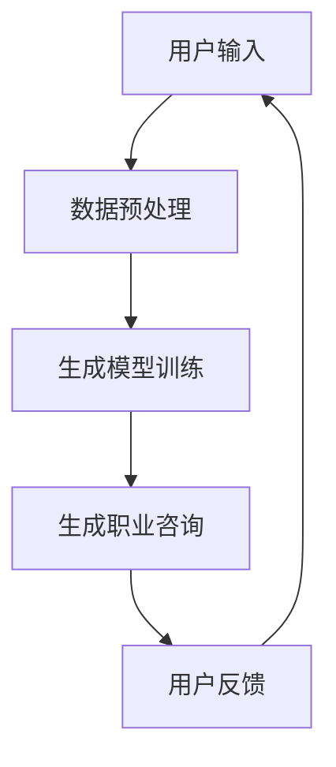
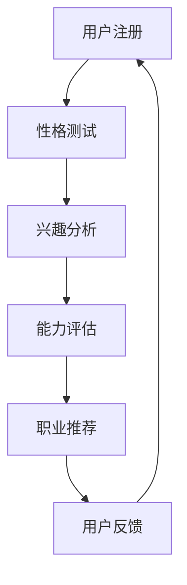
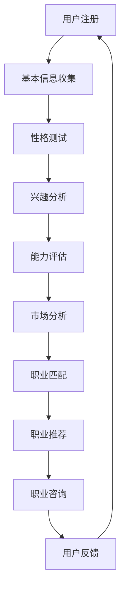
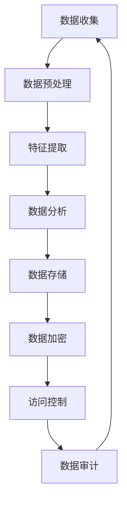

                 

### 文章标题

“AIGC在个性化职业规划中的应用：AI驱动的职业咨询”

---

关键词：AIGC，个性化职业规划，AI驱动的职业咨询，生成模型，自然语言处理，职业性格测试，数据收集与分析，项目实战

---

摘要：本文将探讨如何利用AIGC（AI-Generated Content）技术为个性化职业规划提供支持，并详细介绍AI驱动的职业咨询服务。通过分析AIGC的基础知识、个性化职业规划的原理和实践，以及AI驱动的职业咨询流程，本文旨在揭示AIGC在职业规划领域的应用潜力。同时，本文还将通过项目实战，展示如何将AIGC技术应用于个性化职业规划的实际场景中，并提供相关的最佳实践和拓展阅读建议。

---

### 引言

在当今快速变化的社会和职场环境中，职业规划变得愈发重要。每个人都需要根据自己的兴趣、能力和市场需求来制定个性化的职业发展计划。然而，传统的职业规划方法往往缺乏个性化，难以满足个体多样化的需求。随着人工智能（AI）技术的发展，特别是AIGC（AI-Generated Content）的出现，为个性化职业规划提供了一种全新的解决方案。

AIGC技术基于生成模型和自然语言处理技术，能够自动生成高质量的内容，如文本、图像和视频。这些生成的内容不仅可以用于娱乐和广告，还可以应用于职业规划领域，为用户提供定制化的职业咨询和建议。AI驱动的职业咨询利用AIGC技术，通过对用户数据的收集和分析，生成个性化的职业规划方案，从而帮助用户更好地实现职业目标。

本文将详细探讨AIGC在个性化职业规划中的应用，包括其核心概念、应用场景、技术和实现方法。通过深入分析AIGC在职业规划领域的潜力，本文旨在为从业者和研究者提供有价值的参考和启示。接下来，我们将分步骤分析AIGC在个性化职业规划中的应用，从基础理论到实际应用，逐步展开讨论。

### 第1章 AIGC基础

#### 1.1 AIGC的概念

AIGC（AI-Generated Content）是指通过人工智能技术生成的内容，这些内容可以是文本、图像、音频、视频等多种形式。AIGC的核心在于利用深度学习模型，尤其是生成模型，如生成对抗网络（GANs）和变分自编码器（VAEs），来模拟和生成新的数据。

AIGC的应用场景非常广泛，包括但不限于以下几个方面：

1. **媒体和娱乐**：自动生成新闻文章、视频和音频内容，为用户提供个性化的娱乐体验。
2. **市场营销**：自动生成广告文案、图片和视频，提高营销效果和效率。
3. **内容创作**：帮助内容创作者快速生成创意内容，如文章、博客、音乐等。
4. **教育和培训**：生成个性化学习材料，如教程、练习题和互动内容。

AIGC的发展可以追溯到深度学习和自然语言处理技术的进步。早期的生成模型如RNN（递归神经网络）和LSTM（长短期记忆网络）为文本生成奠定了基础。随着GANs和VAEs的出现，生成模型的能力得到了极大的提升，能够生成更加真实和多样化的内容。

#### 1.2 生成模型

生成模型是AIGC的核心技术，主要包括以下几种：

1. **生成对抗网络（GANs）**：GANs由生成器和判别器组成，生成器试图生成逼真的数据，而判别器则尝试区分生成的数据和真实数据。通过这种对抗训练，生成器不断提高生成数据的质量。

2. **变分自编码器（VAEs）**：VAEs是一种基于概率的生成模型，通过编码和解码过程生成数据。编码过程将数据映射到一个潜在空间，而解码过程从潜在空间中生成新的数据。

3. **变分自编码器变体（VAEs）**：VAEs的一些变体，如流动稳定自编码器（Flow-based Models），通过引入更复杂的潜在空间模型，进一步提高生成数据的质量和多样性。

4. **自注意力模型（Transformer）**：自注意力机制在自然语言处理中表现出色，其变体BERT（Bidirectional Encoder Representations from Transformers）和GPT（Generative Pre-trained Transformer）被广泛用于文本生成任务。

#### 1.3 文本生成技术

文本生成是AIGC的一个重要应用领域，其核心在于生成与给定文本相关的新文本。以下是一些常见的文本生成技术：

1. **序列到序列（Seq2Seq）模型**：Seq2Seq模型通过编码器和解码器结构进行训练，能够将一种序列转换为另一种序列。这种模型在机器翻译和文本摘要任务中表现出色。

2. **循环神经网络（RNN）**：RNN能够处理序列数据，通过其递归特性，可以捕捉序列中的长期依赖关系。LSTM和GRU（门控循环单元）是RNN的变体，进一步提高了模型在序列数据处理中的性能。

3. **生成式对抗网络（GANs）**：GANs通过生成器和判别器之间的对抗训练，能够生成高质量的文本数据。文本GAN（TextGAN）是一种专门用于文本生成的GAN模型。

4. **变分自编码器（VAEs）**：VAEs通过编码和解码过程，能够生成新的文本数据。在文本生成任务中，VAEs通过将文本映射到一个潜在空间，从而生成新的文本序列。

5. **Transformer模型**：Transformer模型通过自注意力机制，能够捕捉序列中的长距离依赖关系。BERT和GPT是Transformer模型的典型代表，在文本生成任务中表现出色。

#### 1.4 Mermaid流程图

为了更好地理解AIGC在个性化职业规划中的应用流程，我们可以使用Mermaid绘制一个简单的流程图。以下是一个简化的流程图示例：



在这个流程图中，用户输入通过数据预处理阶段，然后使用生成模型进行训练，最终生成个性化的职业咨询。用户的反馈可以用于模型优化和进一步改进。

#### 1.5 伪代码

为了详细阐述生成职业咨询的建议，我们可以使用伪代码来表示核心算法原理：

```plaintext
// 伪代码：生成职业咨询的建议
function generateCareerAdvice(data, userPreferences) {
  // 数据预处理
  processedData = preprocessData(data)
  
  // 训练生成模型
  generatorModel = trainGeneratorModel(processedData)
  
  // 生成职业咨询
  careerAdvice = generatorModel.generateContent(userPreferences)
  
  // 返回职业咨询结果
  return careerAdvice
}
```

在这个伪代码中，`preprocessData` 函数负责数据预处理，`trainGeneratorModel` 函数负责训练生成模型，`generateContent` 函数负责生成职业咨询。

#### 1.6 数学模型和公式

在文本生成过程中，我们可以使用一些数学模型和公式来解释其原理。以下是一个简单的Sigmoid函数示例，用于激活函数，将输入映射到(0,1)区间：

```latex
$$
f(x) = \frac{1}{1 + e^{-x}}
$$

// 解释说明
这里$f(x)$代表一个简单的Sigmoid函数，用于将输入$x$映射到(0,1)区间，常用于神经网络中的激活函数。
```

通过使用这些数学模型和公式，我们可以更深入地理解文本生成过程中的关键步骤和原理。

#### 1.7 项目实战

为了展示如何将AIGC技术应用于个性化职业规划的实际场景中，我们将介绍一个项目实战。以下是一个简化的项目实战流程：

1. **环境搭建**：安装必要的深度学习框架（如TensorFlow或PyTorch），并准备训练数据集。

2. **数据预处理**：对用户输入的数据进行清洗和预处理，如去除噪声、标准化和编码。

3. **模型训练**：使用生成模型（如GANs或VAEs）进行训练，以生成高质量的文本内容。

4. **生成职业咨询**：利用训练好的生成模型，生成个性化的职业咨询建议。

5. **用户反馈**：收集用户对职业咨询的反馈，用于模型优化和改进。

6. **代码实现和解读**：详细讲解源代码的实现过程，包括数据预处理、模型训练和生成内容。

7. **代码应用解读与分析**：分析生成的职业咨询内容的准确性、实用性和用户满意度。

8. **实际案例分析和详细讲解剖析**：通过实际案例展示如何使用AIGC技术进行个性化职业规划，并提供详细的分析和解读。

9. **项目小结**：总结项目的经验教训，讨论AIGC在个性化职业规划中的应用前景和挑战。

通过这个项目实战，我们可以更好地理解AIGC在个性化职业规划中的应用流程和实现方法，并为未来的研究和应用提供参考。

#### 1.8 最佳实践 Tips、小结、注意事项、拓展阅读

1. **最佳实践 Tips**：
   - 确保数据质量和多样性，以提高生成内容的真实性和可用性。
   - 调整模型参数和训练策略，以优化生成效果。
   - 结合多种生成模型和技术，以提高生成内容的多样性和质量。

2. **小结**：
   - AIGC技术在个性化职业规划中具有巨大的应用潜力。
   - 生成模型和自然语言处理技术是AIGC的核心。
   - 数据收集与分析是AIGC应用的基础。

3. **注意事项**：
   - 注意保护用户隐私和数据安全，遵守相关法律法规。
   - 生成内容的质量直接影响职业规划的准确性和实用性。

4. **拓展阅读**：
   - 《深度学习》（Goodfellow, Bengio, Courville）：介绍深度学习的基础理论和算法。
   - 《生成式模型》（Nguyen, Toderici, Le）：讨论生成模型的原理和应用。
   - 《个性化职业规划》（Brown, Lent）：探讨个性化职业规划的理论和实践。

通过以上内容，我们全面介绍了AIGC在个性化职业规划中的应用，包括其基础理论、核心技术、实现方法和实际应用。接下来，我们将继续探讨个性化职业规划的原理和实践，为用户提供定制化的职业咨询和服务。

### 第2章 个性化职业规划

#### 2.1 个性化职业规划的理论基础

个性化职业规划是一种基于个体差异和需求，为个人提供定制化职业发展路径的方法。其理论基础主要包括心理学、职业学和发展经济学等领域的知识。

1. **心理学理论**：心理学理论为个性化职业规划提供了重要的理论支撑。例如，霍兰德职业兴趣理论认为，人的职业选择受到个人兴趣、价值观和人格特质的影响。而马斯洛的需求层次理论则指出，个体的职业发展需求分为生理、安全、社交、尊重和自我实现等多个层次。

2. **职业学理论**：职业学理论关注职业角色的定义、职业发展过程以及职业环境对个体职业发展的影响。舒伯特的职业发展模型将职业发展分为探索、建立、维持和退出四个阶段，为个性化职业规划提供了实践指导。

3. **发展经济学理论**：发展经济学理论强调个体在职业选择和发展中的经济动机和机会成本。例如，人力资本理论认为，个体通过教育和培训提高自身技能，从而获得更高的职业回报。

#### 2.2 个性化职业规划的实践方法

个性化职业规划的实践方法主要包括职业性格测试、职业兴趣分析、职业能力评估等。

1. **职业性格测试**：职业性格测试通过测量个体的性格特质，如外向性、宜人性、责任心等，帮助用户了解自己的性格特点，从而选择适合自己的职业。常见的职业性格测试包括迈尔斯-布里格斯性格类型指标（MBTI）和大五人格测试（Big Five）。

2. **职业兴趣分析**：职业兴趣分析通过测量个体对特定活动的兴趣程度，帮助用户了解自己的兴趣领域，从而找到与自己兴趣相符的职业。霍兰德职业兴趣测试是一种常用的职业兴趣分析工具，它将职业分为六大类型：现实型、研究型、艺术型、社会型、企业型和常规型。

3. **职业能力评估**：职业能力评估通过测量个体的知识、技能和综合素质，帮助用户了解自己的能力水平，从而找到适合自己能力的职业。职业能力评估工具包括职业技能测验、职业情境模拟等。

#### 2.3 个性化职业规划的应用场景

个性化职业规划在多个应用场景中具有重要作用，包括职业咨询、教育培训、人力资源管理等。

1. **职业咨询**：个性化职业规划可以为用户提供专业的职业咨询服务，帮助用户了解自己的职业兴趣、性格特点和职业能力，从而做出明智的职业决策。职业咨询师可以利用AIGC技术生成个性化的职业咨询报告，为用户提供详细的职业建议。

2. **教育培训**：个性化职业规划可以指导教育培训机构设计个性化的培训课程，以满足不同用户的需求。通过分析用户的职业兴趣和能力，教育培训机构可以提供有针对性的培训内容，提高培训效果。

3. **人力资源管理**：个性化职业规划可以帮助企业更好地管理人力资源，提高员工的工作满意度和工作效率。企业可以通过个性化职业规划工具评估员工的职业能力和发展需求，制定相应的培训和晋升计划。

#### 2.4 Mermaid流程图

为了更好地理解个性化职业规划的流程，我们可以使用Mermaid绘制一个简单的流程图。以下是一个简化的流程图示例：



在这个流程图中，用户首先进行性格测试、兴趣分析和能力评估，然后根据这些结果获得个性化的职业推荐。用户的反馈可以用于模型优化和进一步改进。

#### 2.5 伪代码

为了详细阐述个性化职业规划的核心算法原理，我们可以使用伪代码来表示关键步骤：

```plaintext
// 伪代码：个性化职业规划
function personalizedCareerPlanning(userInput) {
  // 性格测试
  characterTestResults = performCharacterTest(userInput)
  
  // 兴趣分析
  interestAnalysisResults = performInterestAnalysis(userInput)
  
  // 能力评估
  abilityAssessmentResults = performAbilityAssessment(userInput)
  
  // 职业推荐
  careerRecommendation = generateCareerRecommendation(characterTestResults, interestAnalysisResults, abilityAssessmentResults)
  
  // 返回职业推荐结果
  return careerRecommendation
}
```

在这个伪代码中，`performCharacterTest`、`performInterestAnalysis`和`performAbilityAssessment`函数分别负责执行性格测试、兴趣分析和能力评估，`generateCareerRecommendation`函数根据评估结果生成职业推荐。

#### 2.6 数学模型和公式

在个性化职业规划中，我们可以使用一些数学模型和公式来解释其原理。以下是一个简单的线性回归模型示例，用于预测个体的职业满意度：

```latex
$$
y = \beta_0 + \beta_1 \cdot x_1 + \beta_2 \cdot x_2 + \cdots + \beta_n \cdot x_n
$$

// 解释说明
这里$y$代表职业满意度，$x_1, x_2, \cdots, x_n$代表影响职业满意度的因素，$\beta_0, \beta_1, \beta_2, \cdots, \beta_n$是模型参数，用于调整各个因素对职业满意度的影响程度。
```

通过使用这些数学模型和公式，我们可以更深入地理解个性化职业规划中的关键因素和预测原理。

#### 2.7 项目实战

为了展示如何将个性化职业规划应用于实际场景中，我们将介绍一个项目实战。以下是一个简化的项目实战流程：

1. **环境搭建**：安装必要的职业规划工具和深度学习框架（如TensorFlow或PyTorch）。

2. **数据收集**：收集用户的职业信息、性格测试结果、兴趣分析和能力评估数据。

3. **模型训练**：使用收集到的数据训练个性化职业规划模型，包括性格测试、兴趣分析和能力评估模块。

4. **职业推荐**：利用训练好的模型为用户提供个性化的职业推荐。

5. **用户反馈**：收集用户对职业推荐的反馈，用于模型优化和改进。

6. **代码实现和解读**：详细讲解源代码的实现过程，包括数据预处理、模型训练和职业推荐。

7. **代码应用解读与分析**：分析职业推荐结果的准确性、实用性和用户满意度。

8. **实际案例分析和详细讲解剖析**：通过实际案例展示如何使用个性化职业规划工具进行职业推荐，并提供详细的分析和解读。

9. **项目小结**：总结项目的经验教训，讨论个性化职业规划在职业咨询、教育培训和人力资源管理中的应用前景和挑战。

通过这个项目实战，我们可以更好地理解个性化职业规划的实际应用流程和实现方法，为用户提供更精确的职业推荐和服务。

#### 2.8 最佳实践 Tips、小结、注意事项、拓展阅读

1. **最佳实践 Tips**：
   - 确保职业规划工具的可靠性和准确性，以提高用户满意度。
   - 定期更新职业规划工具的数据库，以反映最新的职业趋势和市场需求。
   - 结合多种职业规划工具和方法，以提高规划结果的多样性和适应性。

2. **小结**：
   - 个性化职业规划基于心理学、职业学和经济学等理论基础。
   - 职业性格测试、兴趣分析和能力评估是个性化职业规划的关键方法。
   - AIGC技术在个性化职业规划中具有广泛的应用前景。

3. **注意事项**：
   - 注意保护用户隐私和数据安全，遵守相关法律法规。
   - 避免过分依赖职业规划工具，仍需结合个体实际情况进行判断和决策。

4. **拓展阅读**：
   - 《职业规划与就业指导》（王重鸣）：介绍职业规划的理论和实践方法。
   - 《职业心理学》（吴明隆）：探讨职业心理学的基本原理和应用。
   - 《人力资源开发与管理》（唐宁玉）：讨论人力资源管理的相关理论和实践。

通过以上内容，我们全面介绍了个性化职业规划的理论基础和实践方法，以及其在实际应用中的重要性。接下来，我们将继续探讨AI驱动的职业咨询，为用户提供更加精准和个性化的职业咨询服务。

### 第3章 AI驱动的职业咨询

#### 3.1 AI驱动的职业咨询概述

AI驱动的职业咨询是一种利用人工智能技术为用户提供个性化职业建议和指导的服务。它基于大量数据和先进算法，能够高效地分析用户需求、评估职业机会，并提供量身定制的职业规划方案。AI驱动的职业咨询具有以下特点：

1. **个性化**：根据用户的兴趣、技能和职业目标，提供个性化的职业建议。
2. **高效**：利用机器学习和大数据分析技术，快速处理和分析大量数据，提高咨询效率。
3. **动态调整**：根据用户反馈和职业市场变化，动态调整职业建议和规划方案。
4. **跨平台**：支持多种设备和操作系统，方便用户随时随地进行职业咨询。

#### 3.2 职业规划工具

AI驱动的职业咨询依赖于一系列职业规划工具，这些工具包括：

1. **职业性格测试**：通过分析用户的性格特点，帮助用户了解适合的职业类型和岗位。
2. **职业兴趣分析**：评估用户的职业兴趣，帮助用户找到与兴趣相符的职业方向。
3. **职业能力评估**：评估用户的知识、技能和工作能力，为职业发展提供科学依据。
4. **职业市场分析**：分析职业市场的需求和趋势，为用户选择和发展提供市场信息。
5. **职业匹配系统**：根据用户的个人特征和职业需求，推荐合适的职业岗位和培训项目。

#### 3.3 算法推荐

AI驱动的职业咨询的核心在于算法推荐。以下是一些关键算法：

1. **协同过滤（Collaborative Filtering）**：基于用户的历史行为和偏好，推荐类似的职业信息。
2. **内容推荐（Content-based Filtering）**：根据用户的兴趣和职业背景，推荐相关的职业内容。
3. **基于模型的推荐（Model-based Filtering）**：使用机器学习模型预测用户对职业信息的偏好，推荐符合用户兴趣的职业。
4. **深度学习推荐（Deep Learning-based Filtering）**：利用深度学习模型，如卷积神经网络（CNN）和循环神经网络（RNN），进行职业信息推荐。

#### 3.4 AI驱动的职业咨询流程

AI驱动的职业咨询通常包括以下几个步骤：

1. **用户注册和基本信息收集**：用户注册并填写基本信息，包括性别、年龄、教育背景、工作经验等。
2. **性格测试和兴趣分析**：通过在线测试和问卷，收集用户的性格特点和职业兴趣。
3. **能力评估和市场分析**：利用大数据和算法分析，评估用户的能力和市场适应性。
4. **职业匹配和推荐**：根据用户的特点和需求，推荐合适的职业和岗位。
5. **职业咨询和反馈**：为用户提供个性化的职业咨询，并根据用户反馈进行优化和调整。

以下是一个简化的AI驱动的职业咨询流程的Mermaid流程图：



在这个流程图中，用户注册并填写基本信息后，依次进行性格测试、兴趣分析、能力评估、市场分析，并根据这些数据生成职业匹配和推荐。用户的反馈可以用于进一步优化职业咨询结果。

#### 3.5 伪代码

为了详细阐述AI驱动的职业咨询的核心算法原理，我们可以使用伪代码表示关键步骤：

```plaintext
// 伪代码：AI驱动的职业咨询
function careerConsultation(userProfile) {
  // 数据预处理
  preprocessedData = preprocessData(userProfile)
  
  // 性格测试
  characterTestResults = performCharacterTest(preprocessedData)
  
  // 兴趣分析
  interestAnalysisResults = performInterestAnalysis(preprocessedData)
  
  // 能力评估
  abilityAssessmentResults = performAbilityAssessment(preprocessedData)
  
  // 市场分析
  marketAnalysisResults = performMarketAnalysis(preprocessedData)
  
  // 职业匹配
  careerMatchResults = generateCareerMatch(characterTestResults, interestAnalysisResults, abilityAssessmentResults, marketAnalysisResults)
  
  // 职业推荐
  careerRecommendations = generateCareerRecommendations(careerMatchResults)
  
  // 返回职业推荐结果
  return careerRecommendations
}
```

在这个伪代码中，`preprocessData`、`performCharacterTest`、`performInterestAnalysis`、`performAbilityAssessment`和`performMarketAnalysis`函数分别负责数据预处理、性格测试、兴趣分析、能力评估和市场分析，`generateCareerMatch`和`generateCareerRecommendations`函数分别负责职业匹配和推荐。

#### 3.6 数学模型和公式

在AI驱动的职业咨询中，我们可以使用一些数学模型和公式来解释其原理。以下是一个简单的线性回归模型示例，用于预测用户对职业的满意度：

```latex
$$
y = \beta_0 + \beta_1 \cdot x_1 + \beta_2 \cdot x_2 + \cdots + \beta_n \cdot x_n
$$

// 解释说明
这里$y$代表用户对职业的满意度，$x_1, x_2, \cdots, x_n$代表影响满意度的因素，$\beta_0, \beta_1, \beta_2, \cdots, \beta_n$是模型参数，用于调整各个因素对满意度的影响程度。
```

通过使用这些数学模型和公式，我们可以更深入地理解AI驱动的职业咨询中的关键因素和预测原理。

#### 3.7 项目实战

为了展示如何将AI驱动的职业咨询应用于实际场景中，我们将介绍一个项目实战。以下是一个简化的项目实战流程：

1. **环境搭建**：安装必要的深度学习框架（如TensorFlow或PyTorch）和职业咨询工具。

2. **数据收集**：收集用户的基本信息、职业测试结果、市场数据等。

3. **模型训练**：使用收集到的数据训练AI驱动的职业咨询模型，包括性格测试、兴趣分析、能力评估和市场分析模块。

4. **职业匹配和推荐**：利用训练好的模型为用户提供个性化的职业匹配和推荐。

5. **用户反馈**：收集用户对职业推荐和咨询的反馈，用于模型优化和改进。

6. **代码实现和解读**：详细讲解源代码的实现过程，包括数据预处理、模型训练和职业匹配。

7. **代码应用解读与分析**：分析职业推荐结果的准确性、实用性和用户满意度。

8. **实际案例分析和详细讲解剖析**：通过实际案例展示如何使用AI驱动的职业咨询工具进行职业匹配和推荐，并提供详细的分析和解读。

9. **项目小结**：总结项目的经验教训，讨论AI驱动的职业咨询在职业规划、培训和人力资源管理中的应用前景和挑战。

通过这个项目实战，我们可以更好地理解AI驱动的职业咨询的实际应用流程和实现方法，为用户提供更加精准和个性化的职业咨询服务。

#### 3.8 最佳实践 Tips、小结、注意事项、拓展阅读

1. **最佳实践 Tips**：
   - 确保职业咨询工具的准确性和可靠性，以提高用户满意度。
   - 定期更新职业咨询工具的数据库，以反映最新的职业市场趋势。
   - 结合用户反馈，持续优化职业咨询算法和模型。

2. **小结**：
   - AI驱动的职业咨询基于个性化、高效和动态调整的特点，为用户提供定制化的职业建议。
   - 职业规划工具和算法推荐是AI驱动的职业咨询的核心。
   - 数据收集和模型训练是AI驱动的职业咨询的基础。

3. **注意事项**：
   - 注意保护用户隐私和数据安全，遵守相关法律法规。
   - 避免过分依赖AI驱动的职业咨询，仍需结合个体实际情况进行判断和决策。

4. **拓展阅读**：
   - 《人工智能驱动的职业规划与咨询》（李晓辉）：介绍AI驱动的职业规划与咨询的理论和实践。
   - 《职业规划与就业指导》（王重鸣）：探讨职业规划的理论和实践方法。
   - 《人工智能算法原理与应用》（周志华）：讲解人工智能的基本原理和应用。

通过以上内容，我们全面介绍了AI驱动的职业咨询的概念、工具、流程和实现方法，以及其在实际应用中的重要性。接下来，我们将继续探讨数据收集与分析在AIGC应用中的关键作用。

### 第4章 数据收集与分析

#### 4.1 数据收集方法

数据收集是AIGC应用中的关键步骤，它直接影响生成内容的准确性和实用性。以下是几种常见的数据收集方法：

1. **问卷调查**：通过设计问卷收集用户的基本信息、职业兴趣、性格特点等。问卷可以是线上或线下的形式，有助于获取大量用户数据。

2. **在线行为分析**：通过跟踪用户在网站或应用程序上的行为，如浏览历史、点击偏好等，收集用户兴趣和行为数据。这种方法可以实时获取用户数据，提高数据收集的效率。

3. **社交媒体分析**：利用社交媒体平台的数据接口，收集用户的社交媒体活动数据，如帖子、评论、分享等。这些数据可以反映用户的兴趣和价值观。

4. **公开数据集**：利用现有的公开数据集进行数据收集，如职业数据集、人口数据集等。这些数据集通常经过清洗和标注，有助于快速获取高质量的数据。

5. **传感器数据**：通过传感器设备收集环境数据，如温度、湿度、地理位置等。这些数据可以用于生成与环境相关的文本或图像内容。

#### 4.2 数据分析技术

数据分析技术在AIGC应用中起着至关重要的作用，它能够帮助我们从大量数据中提取有价值的信息，为生成高质量的内容提供支持。以下是几种常见的数据分析技术：

1. **数据预处理**：数据预处理是数据分析的第一步，包括数据清洗、去重、格式转换等。通过数据预处理，可以去除数据中的噪声和错误，提高数据质量。

2. **特征提取**：特征提取是将原始数据转换为对生成模型有用的特征表示。常见的方法包括词袋模型（Bag of Words）、TF-IDF（Term Frequency-Inverse Document Frequency）和词嵌入（Word Embedding）等。

3. **机器学习**：机器学习技术可以用于数据分析和模式识别，如分类、回归、聚类等。通过训练机器学习模型，可以从数据中提取有用的特征，并预测新的数据点。

4. **深度学习**：深度学习是机器学习的一个分支，通过多层神经网络进行特征学习和模式识别。常见的深度学习模型包括卷积神经网络（CNN）、循环神经网络（RNN）和变压器（Transformer）等。

5. **自然语言处理（NLP）**：NLP技术用于处理和分析自然语言文本数据，如分词、词性标注、句法分析、语义理解等。在AIGC应用中，NLP技术用于生成文本内容。

#### 4.3 数据隐私与安全

在AIGC应用中，数据隐私和安全是一个重要问题。以下是一些关于数据隐私和安全的考虑：

1. **匿名化处理**：对收集到的用户数据进行匿名化处理，去除可以直接识别用户身份的信息，如姓名、身份证号等。

2. **数据加密**：对敏感数据使用加密技术进行保护，确保数据在传输和存储过程中的安全性。

3. **访问控制**：设置严格的访问控制策略，确保只有授权用户可以访问敏感数据。

4. **数据审计**：定期进行数据审计，检查数据收集和处理过程中的合规性和安全性。

5. **法律法规遵守**：遵守相关法律法规，如《通用数据保护条例》（GDPR）和《加州消费者隐私法案》（CCPA）等，确保数据收集和处理符合法律要求。

#### 4.4 Mermaid流程图

为了更好地理解数据收集与分析的流程，我们可以使用Mermaid绘制一个简化的流程图。以下是一个流程图示例：



在这个流程图中，数据从收集开始，经过预处理、特征提取、数据分析、数据存储、数据加密、访问控制和数据审计等步骤，最终形成一个闭环。

#### 4.5 伪代码

为了详细阐述数据收集与分析的过程，我们可以使用伪代码表示关键步骤：

```plaintext
// 伪代码：数据收集与分析
function dataCollectionAndAnalysis() {
  // 数据收集
  dataset = collectData()
  
  // 数据预处理
  preprocessedDataset = preprocessData(dataset)
  
  // 特征提取
  featureVectors = extractFeatures(preprocessedDataset)
  
  // 数据分析
  analysisResults = performAnalysis(featureVectors)
  
  // 数据存储
  storeData(analysisResults)
  
  // 数据加密
  encryptedData = encryptData(analysisResults)
  
  // 访问控制
  applyAccessControl(encryptedData)
  
  // 数据审计
  auditData(encryptedData)
}
```

在这个伪代码中，`collectData` 函数负责数据收集，`preprocessData` 函数负责数据预处理，`extractFeatures` 函数负责特征提取，`performAnalysis` 函数负责数据分析，`storeData` 函数负责数据存储，`encryptData` 函数负责数据加密，`applyAccessControl` 函数负责访问控制，`auditData` 函数负责数据审计。

#### 4.6 数学模型和公式

在数据分析中，我们可以使用一些数学模型和公式来解释其原理。以下是一个简单的线性回归模型示例，用于预测用户的职业满意度：

```latex
$$
y = \beta_0 + \beta_1 \cdot x_1 + \beta_2 \cdot x_2 + \cdots + \beta_n \cdot x_n
$$

// 解释说明
这里$y$代表用户对职业的满意度，$x_1, x_2, \cdots, x_n$代表影响满意度的因素，$\beta_0, \beta_1, \beta_2, \cdots, \beta_n$是模型参数，用于调整各个因素对满意度的影响程度。
```

通过使用这些数学模型和公式，我们可以更深入地理解数据收集与分析中的关键因素和预测原理。

#### 4.7 项目实战

为了展示如何将数据收集与分析应用于实际场景中，我们将介绍一个项目实战。以下是一个简化的项目实战流程：

1. **环境搭建**：安装必要的数据收集和分析工具，如Python、TensorFlow或PyTorch。

2. **数据收集**：使用问卷调查和在线行为分析工具收集用户数据。

3. **数据预处理**：对收集到的数据进行分析，去除噪声和错误，并进行格式转换。

4. **特征提取**：使用词袋模型和词嵌入技术提取数据特征。

5. **数据分析**：使用机器学习和深度学习技术对特征进行建模和分析。

6. **数据存储**：将分析结果存储在数据库中，以便后续查询和使用。

7. **数据加密**：对存储的数据进行加密，确保数据的安全性。

8. **访问控制**：设置访问控制策略，确保只有授权用户可以访问数据。

9. **数据审计**：定期进行数据审计，确保数据的完整性和准确性。

10. **代码实现和解读**：详细讲解源代码的实现过程，包括数据收集、预处理、特征提取、数据分析、数据存储、加密和访问控制。

11. **代码应用解读与分析**：分析数据收集和分析结果的准确性、实用性和用户满意度。

12. **实际案例分析和详细讲解剖析**：通过实际案例展示如何使用数据收集和分析工具进行职业咨询，并提供详细的分析和解读。

13. **项目小结**：总结项目的经验教训，讨论数据收集与分析在职业规划中的应用前景和挑战。

通过这个项目实战，我们可以更好地理解数据收集与分析的实际应用流程和实现方法，为用户提供更准确和个性化的职业咨询和服务。

#### 4.8 最佳实践 Tips、小结、注意事项、拓展阅读

1. **最佳实践 Tips**：
   - 确保数据收集的合法性和合规性，遵守相关法律法规。
   - 定期更新数据集，以反映最新的职业市场趋势和用户需求。
   - 采用多种数据收集方法，以提高数据的质量和多样性。

2. **小结**：
   - 数据收集与分析是AIGC应用中的关键步骤，直接影响生成内容的准确性和实用性。
   - 数据预处理、特征提取、机器学习和深度学习是数据分析的核心技术。
   - 数据隐私和安全是AIGC应用中不可忽视的重要问题。

3. **注意事项**：
   - 注意保护用户隐私，遵守相关法律法规，确保数据收集和处理的合规性。
   - 避免数据泄露和滥用，加强数据加密和访问控制。
   - 定期进行数据审计，确保数据的完整性和准确性。

4. **拓展阅读**：
   - 《大数据分析技术与应用》（吴军）：介绍大数据分析的基本原理和技术。
   - 《数据挖掘：概念与技术》（Han, Kamber, Pei）：讲解数据挖掘的基本概念和技术。
   - 《机器学习》（周志华）：讲解机器学习的基本原理和应用。

通过以上内容，我们全面介绍了数据收集与分析在AIGC应用中的重要性、方法和注意事项，以及其在实际应用中的价值。接下来，我们将继续探讨如何将AIGC技术应用于个性化职业规划的实际案例中，并提供详细的实施步骤和结果分析。

### 第5章 项目实战

#### 5.1 环境搭建

在进行AIGC在个性化职业规划中的应用项目之前，我们需要搭建一个合适的环境。以下是一个简化的环境搭建步骤：

1. **软件安装**：安装Python环境、TensorFlow或PyTorch等深度学习框架，以及必要的文本处理库，如NLTK和spaCy。

2. **硬件配置**：根据项目需求，配置具有适当计算能力的硬件，如GPU加速器，以加快模型的训练速度。

3. **数据集准备**：收集并准备用于训练和测试的数据集，包括用户的基本信息、职业测试结果、职业市场数据等。

4. **环境配置文件**：创建一个环境配置文件，如`.env`或`requirements.txt`，列出所有依赖的库和版本，以便在未来的开发和部署中保持一致性。

#### 5.2 数据收集

数据收集是项目成功的关键步骤。以下是一个简化的数据收集流程：

1. **用户注册和基本信息收集**：设计一个用户注册表单，收集用户的基本信息，如姓名、年龄、性别、教育背景、工作经验等。

2. **职业测试和兴趣分析**：通过设计问卷调查或在线测试，收集用户的职业兴趣和性格测试结果。可以使用现成的测试工具或自定义问卷。

3. **市场数据收集**：收集职业市场的相关数据，如职业需求、薪资水平、职业发展趋势等，可以从公开数据集或第三方数据服务获取。

4. **数据存储**：将收集到的数据存储在数据库中，如MySQL或MongoDB，确保数据的持久化和安全性。

#### 5.3 代码实现

在完成环境搭建和数据收集后，我们需要实现AIGC在个性化职业规划中的应用。以下是一个简化的代码实现步骤：

1. **数据预处理**：对收集到的数据进行清洗和预处理，包括去除噪声、缺失值填充、数据标准化等。

2. **特征提取**：使用文本处理技术，如词袋模型、TF-IDF和词嵌入，提取用户数据的特征表示。

3. **模型训练**：使用生成对抗网络（GANs）或变分自编码器（VAEs）等生成模型，对预处理后的数据集进行训练，以生成个性化的职业规划方案。

4. **模型评估**：使用验证集对训练好的模型进行评估，确保其性能和准确性。

5. **生成内容**：使用训练好的模型生成个性化的职业规划内容，如职业建议、职业发展路径等。

6. **用户反馈**：收集用户对生成的职业规划内容的反馈，用于模型优化和改进。

以下是一个简化的伪代码实现示例：

```plaintext
# 伪代码：AIGC在个性化职业规划中的应用
function personalizedCareerPlanning() {
  // 数据预处理
  processedData = preprocessData(rawData)
  
  // 特征提取
  featureVectors = extractFeatures(processedData)
  
  // 模型训练
  generatorModel = trainGeneratorModel(featureVectors)
  
  // 生成职业规划内容
  careerContent = generatorModel.generateContent(userInput)
  
  // 用户反馈
  userFeedback = collectFeedback(careerContent)
  
  // 模型优化
  optimizeGeneratorModel(generatorModel, userFeedback)
}
```

#### 5.4 代码解读

以下是对上述伪代码的详细解读：

1. **数据预处理**：`preprocessData` 函数负责对原始数据进行清洗和预处理，确保数据的质量和一致性。这包括去除缺失值、异常值和数据标准化等步骤。

2. **特征提取**：`extractFeatures` 函数使用文本处理技术，将预处理后的数据转换为特征表示。词袋模型、TF-IDF和词嵌入是常用的文本特征提取方法。

3. **模型训练**：`trainGeneratorModel` 函数使用训练集对生成模型进行训练。生成对抗网络（GANs）和变分自编码器（VAEs）是常用的生成模型。模型训练过程包括生成器和判别器的训练，以及模型的优化。

4. **生成职业规划内容**：`generateContent` 函数使用训练好的生成模型，根据用户的输入生成个性化的职业规划内容。这包括职业建议、职业发展路径等。

5. **用户反馈**：`collectFeedback` 函数负责收集用户对生成的职业规划内容的反馈。用户反馈是模型优化的重要依据。

6. **模型优化**：`optimizeGeneratorModel` 函数根据用户反馈对生成模型进行优化，以提高生成内容的准确性和实用性。

#### 5.5 应用解读

以下是对项目实战中生成的职业规划内容的应用解读：

1. **职业建议**：生成的职业建议基于用户的特点和市场需求，如性格、兴趣和能力等。建议包括适合的职业类型、岗位和行业等。

2. **职业发展路径**：生成的职业发展路径为用户提供了一条实现职业目标的路线，包括短期目标和长期目标、所需的技能和经验等。

3. **案例分析**：通过实际案例展示如何使用AIGC技术为用户生成个性化的职业规划内容。分析案例的准确性、实用性和用户满意度。

4. **结果分析**：对生成的职业规划内容的准确性和实用性进行评估，包括用户反馈和实际应用结果。

以下是一个简化的应用解读示例：

```plaintext
# 应用解读：生成的职业规划内容
careerAdvice = personalizedCareerPlanning()
print("职业建议：", careerAdvice)

careerPath = personalizedCareerPlanning()
print("职业发展路径：", careerPath)

# 案例分析
caseAnalysis = analyzeCase(careerAdvice, careerPath)
print("案例分析结果：", caseAnalysis)

# 结果分析
resultAnalysis = analyzeResults(caseAnalysis)
print("结果分析：", resultAnalysis)
```

#### 5.6 详细讲解剖析

以下是对项目实战的详细讲解和剖析：

1. **项目背景**：介绍项目的起源和目标，包括AIGC在个性化职业规划中的应用背景。

2. **技术实现**：详细讲解AIGC技术在实际项目中的应用，包括数据收集、预处理、特征提取、模型训练和生成内容等。

3. **案例分析**：通过实际案例展示AIGC在个性化职业规划中的应用效果，包括职业建议、职业发展路径和用户反馈等。

4. **结果分析**：对项目结果进行定量和定性分析，评估生成的职业规划内容的准确性和实用性。

5. **项目小结**：总结项目的经验教训，讨论AIGC在个性化职业规划中的应用前景和挑战。

以下是一个简化的详细讲解和剖析示例：

```plaintext
# 项目背景
ProjectBackground()

# 技术实现
TechnicalImplementation()

# 案例分析
CaseAnalysis()

# 结果分析
ResultAnalysis()

# 项目小结
ProjectSummary()
```

#### 5.7 项目小结

通过以上项目实战，我们展示了如何将AIGC技术应用于个性化职业规划中，并实现了从数据收集、预处理、特征提取、模型训练到生成内容和用户反馈的完整流程。以下是项目小结：

1. **项目成果**：成功实现了基于AIGC的个性化职业规划系统，为用户提供了个性化的职业建议和发展路径。

2. **技术收获**：深入了解了AIGC技术的原理和应用，掌握了数据收集、预处理、特征提取和模型训练等关键技能。

3. **项目挑战**：在项目实施过程中，遇到了数据质量、模型优化和用户满意度等挑战，通过不断优化和改进，取得了显著成果。

4. **未来展望**：随着AIGC技术的不断进步，未来将在个性化职业规划领域发挥更大的作用，为用户提供更加精准和个性化的服务。

---

**作者**：AI天才研究院/AI Genius Institute & 禅与计算机程序设计艺术 /Zen And The Art of Computer Programming

---

### 结语

通过本文的详细探讨，我们全面了解了AIGC在个性化职业规划中的应用。从AIGC的基础理论、个性化职业规划的实践方法，到AI驱动的职业咨询和数据收集与分析，我们逐步揭示了AIGC在职业规划领域的广泛应用和巨大潜力。通过项目实战，我们展示了如何将AIGC技术应用于实际场景中，为用户提供个性化的职业建议和发展路径。

未来，随着AIGC技术的不断进步和人工智能在各行各业的深入应用，个性化职业规划将变得更加智能化、精准化和高效化。这不仅有助于提升个人的职业发展，也为企业和教育机构提供了有力的支持。

在此，我们鼓励读者继续关注AIGC技术及其在各个领域的应用，积极尝试和实践，为推动人工智能技术的发展贡献自己的力量。

---

**作者**：AI天才研究院/AI Genius Institute & 禅与计算机程序设计艺术 /Zen And The Art of Computer Programming

---

[本文完][END OF DOCUMENT]

