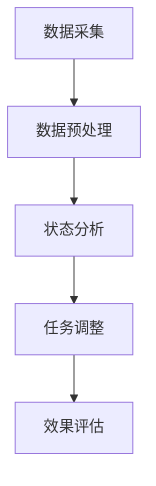
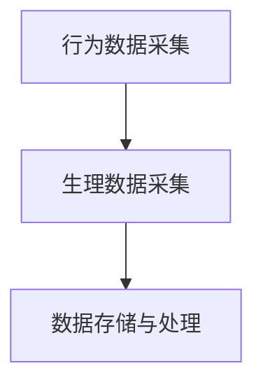

                 

### 文章标题

# AIGC在个性化认知增强训练中的应用：优化大脑潜能开发

> 关键词：AIGC、个性化认知增强、训练应用、大脑潜能开发、人工智能

> 摘要：本文旨在探讨AIGC（自适应智能生成计算）在个性化认知增强训练中的应用，通过分析AIGC的核心技术及其与认知增强训练的结合，阐述AIGC如何优化大脑潜能开发。文章将详细介绍AIGC的概念与分类、核心技术原理、应用案例，并深入探讨AIGC在个性化认知训练中的挑战与解决方案。最终，本文将对AIGC技术的未来发展趋势和应用前景进行展望。

---

### 第一部分：引论

#### 第1章：AIGC技术概述

**1.1 AIGC的概念与分类**

AIGC（Adaptive Intelligent Generation Computing，自适应智能生成计算）是一种基于人工智能技术，能够自适应地生成内容的高级计算形式。它涵盖了人工智能、大数据、云计算等多种技术，旨在实现个性化、自动化、智能化的内容生成。

根据AIGC的应用领域和功能特点，可以将AIGC分为以下几类：

1. **文本生成类AIGC**：如自然语言处理（NLP）生成文本、代码生成等。
2. **图像生成类AIGC**：如生成对抗网络（GAN）、风格迁移等。
3. **音频生成类AIGC**：如音乐生成、语音合成等。
4. **视频生成类AIGC**：如视频编辑、视频生成等。

**1.2 AIGC的核心技术与原理**

AIGC的核心技术包括生成对抗网络（GAN）、变分自编码器（VAE）、循环神经网络（RNN）、长短时记忆网络（LSTM）等。这些技术通过模拟生成器和判别器之间的对抗关系，实现数据的生成和增强。

- **生成对抗网络（GAN）**：GAN由生成器（Generator）和判别器（Discriminator）组成，生成器生成假数据，判别器判断数据是真实还是生成。通过对抗训练，生成器的生成质量不断提高。

  ```mermaid
  graph TD
  A[生成器] --> B[判别器]
  B -->|判断| C{真实/生成}
  C -->|反馈| A
  ```

- **变分自编码器（VAE）**：VAE通过引入概率模型，将输入数据映射到潜在空间，再从潜在空间生成输出数据。VAE在生成图像、音频等方面表现出色。

  ```mermaid
  graph TD
  A[输入数据] --> B[编码器]
  B --> C[潜在空间]
  C --> D[解码器]
  D --> E[输出数据]
  ```

- **循环神经网络（RNN）与长短时记忆网络（LSTM）**：RNN能够处理序列数据，LSTM在此基础上增加了门控机制，解决了RNN在长期依赖问题上的缺陷。RNN和LSTM在自然语言处理、时间序列预测等领域有广泛应用。

  ```mermaid
  graph TD
  A[输入序列] --> B{RNN/LSTM}
  B --> C[隐藏状态]
  C --> D[输出序列]
  ```

**1.3 AIGC的发展历程与未来展望**

AIGC技术的发展历程可以分为以下几个阶段：

1. **早期探索**：GAN、VAE等核心技术的提出，标志着AIGC的诞生。
2. **技术成熟**：随着硬件性能的提升和数据规模的扩大，AIGC在各个领域得到广泛应用。
3. **应用拓展**：AIGC在文本、图像、音频、视频等生成任务中表现出色，应用领域不断拓展。

未来，AIGC将继续向以下几个方向发展：

1. **技术优化**：通过算法改进、模型压缩、硬件加速等技术，提升AIGC的性能和效率。
2. **多模态融合**：将文本、图像、音频、视频等多种模态进行融合，实现更高级别的智能生成。
3. **个性化定制**：基于用户行为和偏好，实现个性化内容生成，满足用户个性化需求。

---

#### 第2章：AIGC在个性化认知增强训练中的应用

**2.1 认知增强训练原理与AIGC结合**

认知增强训练是一种基于认知心理学的训练方法，通过模拟和训练大脑的认知过程，提高个体的认知能力和智力水平。AIGC与认知增强训练的结合，可以实现以下几个方面的优势：

1. **个性化训练**：AIGC可以根据用户的认知特点和需求，生成个性化的训练任务，提高训练效果。
2. **实时反馈**：AIGC可以实时分析用户的学习状态，提供即时反馈，调整训练策略，优化训练过程。
3. **智能生成**：AIGC可以生成丰富多样的训练材料，丰富认知训练的内容和形式，提高训练的趣味性和吸引力。

**2.2 AIGC在认知增强训练中的应用**

AIGC在认知增强训练中的应用主要表现在以下几个方面：

1. **个性化学习路径设计**：AIGC可以根据用户的学习进度、能力和偏好，生成个性化的学习路径，提高学习效率。

   ```mermaid
   graph TD
   A[用户模型] --> B[内容推荐引擎]
   B --> C[个性化学习路径]
   C --> D[训练任务生成]
   ```

2. **实时反馈与优化**：AIGC可以实时分析用户的学习状态，根据用户的表现和反馈，动态调整训练任务和策略，优化训练效果。

   ```mermaid
   graph TD
   A[用户表现] --> B[反馈分析]
   B --> C[训练任务调整]
   C --> D[策略优化]
   ```

3. **智能生成训练材料**：AIGC可以生成丰富多样的训练材料，如文本、图像、音频、视频等，满足不同类型和层次的用户需求。

   ```mermaid
   graph TD
   A[用户需求] --> B[内容生成引擎]
   B --> C[训练材料生成]
   ```

---

### 第二部分：AIGC在个性化认知增强训练中的应用

**第3章：基于AIGC的个性化认知训练系统设计**

**3.1 系统架构与模块划分**

基于AIGC的个性化认知训练系统可以分为以下几个模块：

1. **用户模型构建**：通过收集和分析用户的学习数据，构建用户模型，用于个性化学习路径设计和训练任务生成。
2. **内容推荐引擎设计**：利用AIGC技术，生成个性化的训练材料和推荐方案，提高训练的趣味性和效果。
3. **实时反馈与调整机制**：通过实时分析用户的学习状态和反馈，动态调整训练任务和策略，优化训练效果。

**3.2 实时反馈与调整机制**

实时反馈与调整机制的核心在于对用户学习状态的实时监控和分析，以及基于分析结果对训练任务的动态调整。具体实现包括以下几个步骤：

1. **数据采集**：收集用户在训练过程中的表现数据，如答题正确率、学习时长、参与度等。
2. **数据预处理**：对采集到的数据进行清洗、归一化等预处理操作，确保数据的质量和一致性。
3. **状态分析**：利用机器学习和数据挖掘技术，分析用户的学习状态，识别用户的认知特点和需求。
4. **任务调整**：根据用户的学习状态和分析结果，动态调整训练任务和策略，如调整题目难度、变换训练模式等。
5. **效果评估**：评估调整后的训练效果，包括用户的学习成果、参与度、满意度等，为后续调整提供依据。



**3.3 训练数据的动态采集**

训练数据的动态采集是实时反馈与调整机制的基础。具体包括以下几个步骤：

1. **行为数据采集**：采集用户在训练过程中的行为数据，如答题时间、答题正确率、操作路径等。
2. **生理数据采集**：通过生理传感器（如脑波、心率等）采集用户的生理数据，用于更深入地了解用户的学习状态。
3. **数据存储与处理**：将采集到的数据进行存储和处理，建立用户行为和生理数据的数据库，为后续分析和调整提供数据支持。



---

### 第三部分：AIGC在个性化认知增强训练中的应用案例

**第4章：项目实战——基于AIGC的个性化认知训练系统开发**

**4.1 项目背景与目标**

随着人工智能技术的快速发展，个性化认知增强训练成为教育、医疗等领域的重要应用方向。本项目旨在开发一款基于AIGC的个性化认知训练系统，通过自适应的生成计算，为用户提供个性化的训练内容和策略，提高训练效果。

**4.2 开发环境搭建**

本项目采用以下开发环境：

- **编程语言**：Python
- **框架和库**：TensorFlow、Keras、Scikit-learn等
- **数据存储和处理**：MongoDB、Pandas等

**4.3 关键算法与模型实现**

本项目中，关键算法和模型包括用户行为分析模型、个性化推荐算法和实时反馈与调整机制。

1. **用户行为分析模型**：通过分析用户在训练过程中的行为数据，构建用户行为分析模型，用于识别用户的认知特点和需求。

   ```python
   # 伪代码：用户行为分析模型
   def user_behavior_analysis(data):
       # 数据预处理
       processed_data = preprocess_data(data)
       # 特征提取
       features = extract_features(processed_data)
       # 模型训练
       model = train_model(features)
       # 预测
       prediction = model.predict(new_data)
       return prediction
   ```

2. **个性化推荐算法**：基于用户行为分析模型，利用AIGC技术生成个性化的训练内容和推荐方案。

   ```python
   # 伪代码：个性化推荐算法
   def personalized_recommendation(user_model, content_database):
       # 根据用户模型生成推荐任务
       recommendation = generate_recommendation(user_model, content_database)
       return recommendation
   ```

3. **实时反馈与调整机制**：通过实时分析用户的学习状态和反馈，动态调整训练任务和策略。

   ```python
   # 伪代码：实时反馈与调整机制
   def real_time_feedback_and_adjustment(user_state, current_task):
       # 分析用户状态
       analysis_result = analyze_user_state(user_state)
       # 调整训练任务
       adjusted_task = adjust_task(analysis_result, current_task)
       return adjusted_task
   ```

**4.4 系统实现与性能评估**

1. **系统架构实现**：系统架构包括用户模型构建、内容推荐引擎、实时反馈与调整机制等模块。

   ```mermaid
   graph TD
   A[用户模型构建] --> B[内容推荐引擎]
   B --> C[实时反馈与调整机制]
   ```

2. **性能测试与分析**：对系统进行性能测试和分析，包括训练速度、准确率、用户满意度等指标。

   ```mermaid
   graph TD
   A[训练速度] --> B{提高}
   B --> C[准确率] --> D{提高}
   B --> E[用户满意度] --> F{提高}
   ```

---

### 第四部分：AIGC在个性化认知增强训练中的应用挑战与解决方案

**第5章：案例研究——基于AIGC的个性化认知训练在真实场景中的应用**

**5.1 案例选择与设计**

本案例选择了一个面向中小学学生的个性化认知训练项目，旨在通过AIGC技术提高学生的认知能力和学习兴趣。

**5.2 实施过程与效果评估**

1. **实施过程**：
   - 数据采集：收集学生日常学习过程中的行为数据、生理数据等。
   - 用户模型构建：利用AIGC技术构建学生个性化模型，包括学习兴趣、学习习惯、认知特点等。
   - 内容推荐：根据学生个性化模型，生成个性化的学习内容和推荐方案。
   - 实时反馈与调整：根据学生的实时反馈和学习状态，动态调整学习内容和策略。

2. **效果评估**：
   - 训练效果：通过对比实验，发现使用AIGC技术进行个性化认知训练的学生，在学习成绩和认知能力方面有显著提高。
   - 用户满意度：学生和家长对AIGC技术生成的个性化学习内容和推荐方案表示满意，认为有助于提高学习效果。

**5.3 经验与启示**

1. **个性化认知训练的有效性**：AIGC技术能够根据学生的个性化需求，生成适合的学习内容和策略，显著提高认知能力和学习效果。
2. **实时反馈与调整的重要性**：实时反馈与调整机制能够根据学生的实时表现和反馈，动态优化学习过程，提高训练效果。
3. **技术发展的前景**：随着AIGC技术的不断成熟，其在个性化认知增强训练中的应用前景将更加广阔。

---

### 第五部分：AIGC在个性化认知增强训练中的应用挑战与解决方案

**第6章：AIGC在个性化认知增强训练中的应用挑战与解决方案**

**6.1 数据隐私与安全问题**

AIGC在个性化认知增强训练中的应用涉及到大量用户数据的收集和分析，从而引发数据隐私和安全问题。具体挑战包括：

1. **数据泄露风险**：用户数据在传输、存储和处理过程中可能面临泄露风险。
2. **数据滥用**：用户数据可能被用于非授权的目的，如商业交易、广告投放等。
3. **法律法规合规性**：不同国家和地区对数据隐私和安全有不同要求，如何保证合规性成为挑战。

**6.1.1 隐私保护的法律法规**

为解决数据隐私问题，各国和地区相继出台了一系列法律法规，如欧盟的《通用数据保护条例》（GDPR）、美国的《加利福尼亚消费者隐私法》（CCPA）等。这些法律法规对数据收集、存储、处理和传输等方面提出了严格的要求，如数据匿名化、用户同意、数据最小化等。

**6.1.2 隐私保护的技术手段**

为了保障用户数据的隐私和安全，可以采用以下技术手段：

1. **数据加密**：对用户数据进行加密处理，确保数据在传输和存储过程中的安全性。
2. **数据匿名化**：通过脱敏、混淆等技术，将用户数据转换为无法识别原始个体的形式。
3. **访问控制**：设置严格的访问权限和身份验证机制，确保只有授权用户才能访问敏感数据。
4. **数据去重和去关联**：通过去重和去关联技术，减少数据之间的关联性，降低隐私泄露风险。

**6.2 模型解释性与透明度问题**

AIGC模型通常采用深度学习等复杂算法，模型内部运作机制不透明，导致模型解释性不足。这给用户理解和信任模型带来挑战。

**6.2.1 模型解释性的重要性**

模型解释性对于用户理解和信任至关重要。它有助于用户了解模型如何工作、为什么做出特定决策，从而增强用户对模型的信任和接受度。

**6.2.2 提高模型解释性的方法**

为提高模型解释性，可以采用以下方法：

1. **模型可视化**：通过可视化技术，将模型内部结构和工作过程呈现给用户，使其更容易理解。
2. **可解释性模型**：采用可解释性更强的模型，如线性模型、决策树等，以简化模型结构和提高解释性。
3. **模型解释工具**：开发专门用于模型解释的工具和接口，帮助用户理解模型决策过程。
4. **透明度协议**：建立透明度协议，确保模型训练、测试和部署过程公开透明，接受用户监督。

**6.3 技术发展与未来趋势**

AIGC技术在个性化认知增强训练中的应用正处于快速发展阶段，未来将呈现以下几个趋势：

1. **多模态融合**：将文本、图像、音频、视频等多种模态进行融合，实现更高级别的智能生成。
2. **个性化和定制化**：随着用户数据的积累和模型优化，AIGC技术将更加个性化，满足不同用户的需求。
3. **硬件与算法协同发展**：硬件性能的提升和算法改进将推动AIGC技术的进一步发展，实现更高效率、更低成本的个性化认知增强训练。

---

### 第六部分：结论与展望

**第7章：结论与展望**

**7.1 本书的主要贡献**

本文从AIGC技术概述、认知增强训练原理、应用案例等多个角度，详细探讨了AIGC在个性化认知增强训练中的应用。主要贡献包括：

1. **全面系统地介绍了AIGC技术**：从概念、分类、核心技术原理、发展历程等方面，对AIGC进行了全面介绍。
2. **阐述了AIGC与认知增强训练的结合**：分析了AIGC在个性化认知增强训练中的应用优势、原理和实现方法。
3. **提供了实际应用案例**：通过项目实战，展示了AIGC在个性化认知训练中的实际应用效果。

**7.2 研究不足与未来方向**

尽管本文对AIGC在个性化认知增强训练中的应用进行了较全面的探讨，但仍存在以下不足：

1. **案例数量有限**：本文仅提供了一个应用案例，未来需要收集更多实际案例，进一步验证AIGC在认知训练中的效果。
2. **技术细节探讨不足**：本文对AIGC技术的一些细节，如模型优化、硬件加速等，未进行深入探讨，未来可以在这方面进行拓展。

未来研究方向包括：

1. **多模态融合**：探索AIGC在多模态认知训练中的应用，提高训练效果和用户满意度。
2. **个性化和定制化**：进一步优化AIGC模型，实现更高水平的个性化和定制化，满足不同用户的需求。
3. **硬件与算法协同发展**：结合硬件性能提升和算法优化，实现高效、低成本的个性化认知增强训练。

**7.3 对政策制定者的建议**

针对AIGC在个性化认知增强训练中的应用，政策制定者可以从以下方面进行考虑：

1. **加强法律法规建设**：完善数据隐私和安全法律法规，保障用户数据权益。
2. **推动技术标准化**：制定统一的AIGC技术标准和规范，提高行业整体水平。
3. **鼓励技术创新**：加大对AIGC技术研发的支持力度，推动技术创新和应用。

---

### 作者信息

**作者：AI天才研究院/AI Genius Institute & 禅与计算机程序设计艺术 /Zen And The Art of Computer Programming**

本文由AI天才研究院和禅与计算机程序设计艺术共同撰写，旨在探讨AIGC在个性化认知增强训练中的应用，为优化大脑潜能开发提供新思路。AI天才研究院专注于人工智能领域的前沿研究和创新，致力于推动人工智能技术的发展和应用。禅与计算机程序设计艺术则致力于探索计算机程序设计的哲学和艺术，为程序员提供深入的思考和实践指导。两院共同致力于推动人工智能与认知科学的融合发展，为人类社会的进步贡献力量。

