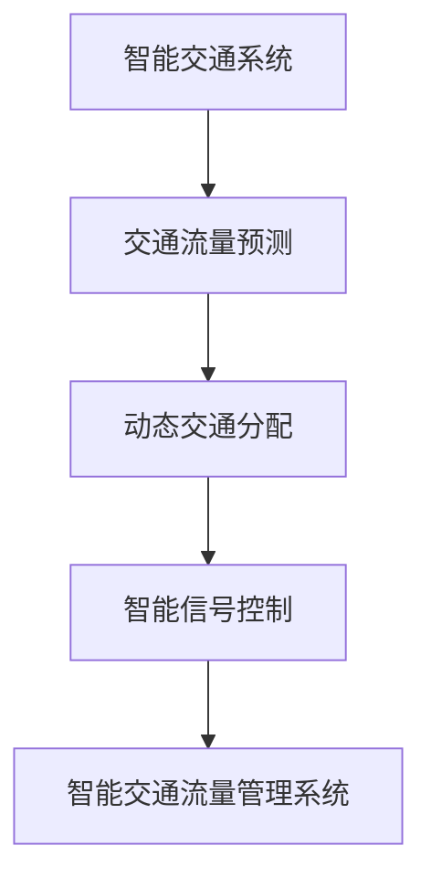

                 

### 文章标题 <AIGC在智能交通流量预测与管理中的应用：消除城市拥堵>

### 关键词

- 智能交通系统
- AIGC技术
- 交通流量预测
- 交通流量管理
- 城市拥堵

### 摘要

本文深入探讨了AIGC（自适应智能生成控制）在智能交通流量预测与管理中的应用，旨在消除城市拥堵问题。文章首先介绍了智能交通系统的概念、发展历程以及AIGC技术的基本原理。接着，详细阐述了基于AIGC的智能交通流量预测方法，包括数学模型、核心算法及系统设计。随后，探讨了智能交通流量管理的基本原理和基于AIGC的智能流量管理策略。通过具体案例研究，分析了AIGC技术在智能交通流量预测与管理中的实际应用效果。最后，对AIGC在智能交通领域的未来发展趋势进行了展望。

### 完整的目录大纲

```markdown
# AIGC在智能交通流量预测与管理中的应用：消除城市拥堵

## 第一部分：背景与概念

### 第1章：智能交通系统概述
#### 1.1 智能交通系统的概念与发展历程
#### 1.2 智能交通系统的重要性
#### 1.3 智能交通系统的关键技术

### 第2章：AIGC技术简介
#### 2.1 AIGC的基本概念
#### 2.2 AIGC的核心算法
#### 2.3 AIGC在智能交通领域的应用前景

## 第二部分：智能交通流量预测

### 第3章：交通流量预测的基本原理
#### 3.1 交通流量的定义与特征
#### 3.2 交通流量预测的数学模型
#### 3.3 交通流量预测的常见算法

### 第4章：基于AIGC的交通流量预测方法
#### 4.1 AIGC在交通流量预测中的应用
#### 4.2 基于深度学习的交通流量预测模型
#### 4.3 基于强化学习的交通流量预测模型

### 第5章：交通流量预测系统的设计与实现
#### 5.1 交通流量预测系统的架构设计
#### 5.2 交通流量预测系统的数据处理
#### 5.3 交通流量预测系统的性能评估

## 第三部分：智能交通流量管理

### 第6章：智能交通流量管理的基本原理
#### 6.1 智能交通流量管理的概念
#### 6.2 智能交通流量管理的目标
#### 6.3 智能交通流量管理的策略

### 第7章：基于AIGC的智能交通流量管理方法
#### 7.1 AIGC在智能交通流量管理中的应用
#### 7.2 基于AIGC的动态交通分配方法
#### 7.3 基于AIGC的智能信号控制方法

### 第8章：智能交通流量管理系统的设计与实现
#### 8.1 智能交通流量管理系统的架构设计
#### 8.2 智能交通流量管理系统的功能模块
#### 8.3 智能交通流量管理系统的性能优化

## 第四部分：案例研究

### 第9章：案例研究一：某城市交通流量预测与管理系统
#### 9.1 案例背景
#### 9.2 案例目标
#### 9.3 案例实施与效果评估

### 第10章：案例研究二：智能交通流量管理在特定场景的应用
#### 10.1 案例背景
#### 10.2 案例目标
#### 10.3 案例实施与效果评估

## 第五部分：展望与未来

### 第11章：AIGC在智能交通领域的未来发展趋势
#### 11.1 AIGC技术的潜在突破
#### 11.2 智能交通领域的发展机遇与挑战
#### 11.3 未来智能交通系统的愿景

## 附录

### 附录A：常用AIGC算法与工具简介
#### A.1 常用AIGC算法
#### A.2 AIGC工具使用指南
```

### Mermaid 流程图



### 伪代码示例

```csharp
// 假设我们有一个交通流量预测模型
// 输入：历史交通流量数据、当前时间、天气预报
// 输出：预测的未来交通流量

PredictTrafficFlow(data, currentTime, weather) {
    // 数据预处理
    processedData = preprocessData(data);
    
    // 构建预测模型
    model = buildModel(processedData);
    
    // 预测未来交通流量
    futureTrafficFlow = model.predict(currentTime, weather);
    
    return futureTrafficFlow;
}
```

### 数学模型与公式

```latex
\section{交通流量预测的数学模型}
交通流量预测通常基于以下数学模型：

$$
f(t) = \sum_{i=1}^{n} w_i \cdot f_i(t)
$$

其中，\( f(t) \) 是未来时刻 \( t \) 的交通流量，\( w_i \) 是权重系数，\( f_i(t) \) 是第 \( i \) 个影响因素对交通流量的影响。

$$
w_i = \frac{\text{相关性系数}(f_i, f(t))}{\sum_{j=1}^{n} \text{相关性系数}(f_j, f(t))}
$$

其中，相关性系数用于衡量 \( f_i \) 与 \( f(t) \) 之间的相关性。
```

## 第一部分：背景与概念

### 第1章：智能交通系统概述

#### 1.1 智能交通系统的概念与发展历程

智能交通系统（Intelligent Transportation System，ITS）是指利用先进的信息通信技术、电子技术、自动控制技术、计算机技术和网络技术，对交通系统进行更高效的管理与控制，实现人、车、路以及交通环境的智能综合协调与优化。智能交通系统的发展历程可以追溯到20世纪60年代的美国，当时开始出现了基于交通信号控制的智能交通系统。随着信息技术和通信技术的快速发展，智能交通系统得到了迅速普及和推广。

智能交通系统的概念主要包括以下几个方面：

1. **交通信息采集**：通过传感器、摄像头、雷达等设备，实时采集道路上的交通流量、速度、密度等信息。
2. **信息处理与传输**：利用计算机技术和通信网络，对采集到的交通信息进行处理和传输。
3. **交通控制与优化**：根据处理后的交通信息，对交通信号灯、高速公路上的匝道控制等进行优化，以提高道路通行效率。
4. **信息服务**：为驾驶员提供实时交通信息，如路况、导航、停车场信息等，帮助驾驶员做出更好的驾驶决策。

智能交通系统的发展历程可以分为以下几个阶段：

1. **初级阶段**（20世纪60年代至80年代）：以交通信号控制为主，主要采用手动控制或简单的自动控制。
2. **发展阶段**（20世纪80年代至90年代）：开始引入计算机技术和通信网络，实现交通信息的实时采集和传输，交通信号控制逐渐智能化。
3. **成熟阶段**（20世纪90年代至今）：随着物联网、大数据、人工智能等技术的快速发展，智能交通系统逐渐形成了完善的体系，实现了从单一功能到综合管理的转变。

#### 1.2 智能交通系统的重要性

智能交通系统在现代社会中具有重要的意义：

1. **提高交通效率**：通过实时交通信息的采集、处理和传输，智能交通系统可以优化交通信号控制，减少交通拥堵，提高道路通行效率。
2. **降低交通事故**：智能交通系统可以通过实时监控道路状况，及时发现和处理异常情况，降低交通事故的发生率。
3. **节约能源**：智能交通系统可以通过优化交通流，减少车辆在拥堵中的油耗和排放，有助于节约能源和减少环境污染。
4. **提升出行体验**：智能交通系统可以为驾驶员提供实时路况信息、导航服务等，提高出行舒适度和便捷性。

#### 1.3 智能交通系统的关键技术

智能交通系统的关键技术包括以下几个方面：

1. **传感器技术**：传感器技术是智能交通系统的数据采集基础，包括摄像头、雷达、红外线传感器、GPS等，用于实时采集道路状况、车辆信息等。
2. **通信技术**：通信技术是智能交通系统信息传输的关键，包括无线通信、光纤通信等，用于实现交通信息的高速传输。
3. **数据处理与存储技术**：数据处理与存储技术用于对采集到的交通信息进行处理、分析和存储，包括数据清洗、数据挖掘、大数据技术等。
4. **控制技术**：控制技术是智能交通系统的核心，包括交通信号控制、高速公路匝道控制等，用于根据交通信息实现交通优化。
5. **人工智能技术**：人工智能技术用于对交通信息进行智能分析和决策，包括深度学习、强化学习等，用于实现智能交通流量预测和管理。

智能交通系统的关键技术共同作用，实现了对交通系统的全面监控、管理和优化，有助于缓解城市拥堵，提高交通运行效率，提升出行体验。

### 第2章：AIGC技术简介

#### 2.1 AIGC的基本概念

AIGC（Adaptive Intelligent Generation Control，自适应智能生成控制）是一种结合了人工智能和自适应控制技术的先进方法，旨在通过实时学习和优化，提高系统的自适应能力和控制性能。AIGC的基本概念可以概括为以下几点：

1. **自适应控制**：AIGC通过实时监测系统的状态和外部环境的变化，动态调整控制策略，以适应新的情况。这种自适应能力使得AIGC在复杂、动态的环境中表现出良好的稳定性和鲁棒性。
2. **人工智能**：AIGC利用人工智能技术，特别是机器学习和深度学习算法，对采集到的数据进行处理和分析，从而生成最优的控制策略。人工智能技术使得AIGC能够从大量数据中学习规律，实现智能决策。
3. **生成控制**：AIGC通过生成控制策略，实现对系统的实时调节和优化。这种生成控制策略不仅考虑当前的状态，还预测未来的变化，从而做出更前瞻性的决策。

AIGC的核心思想是通过实时学习和自适应调整，提高系统的控制性能和稳定性。具体来说，AIGC的工作流程可以分为以下几个步骤：

1. **数据采集**：通过传感器和其他设备，实时采集系统的状态数据和环境数据。
2. **数据预处理**：对采集到的数据进行清洗、归一化等预处理，以便于后续的分析和处理。
3. **模型训练**：利用机器学习和深度学习算法，对预处理后的数据进行分析和学习，建立预测模型。
4. **策略生成**：根据预测模型，生成最优的控制策略，实现对系统的实时调节和优化。
5. **策略调整**：根据系统的实时反馈，不断调整和优化控制策略，以提高系统的性能和稳定性。

#### 2.2 AIGC的核心算法

AIGC的核心算法主要包括机器学习算法、深度学习算法和自适应控制算法。以下是对这些算法的简要介绍：

1. **机器学习算法**：机器学习算法是AIGC的基础，用于对采集到的数据进行分析和学习。常见的机器学习算法包括线性回归、决策树、支持向量机等。这些算法通过训练数据集，建立预测模型，实现对未知数据的预测。
2. **深度学习算法**：深度学习算法是AIGC的核心，通过模拟人脑神经元之间的连接关系，实现对复杂数据的自动特征提取和学习。常见的深度学习算法包括卷积神经网络（CNN）、循环神经网络（RNN）和生成对抗网络（GAN）等。这些算法在图像识别、语音识别和自然语言处理等领域取得了显著的成果。
3. **自适应控制算法**：自适应控制算法是AIGC的关键，用于根据实时反馈调整控制策略。常见的自适应控制算法包括PID控制、模糊控制和神经网络控制等。这些算法通过不断调整控制参数，使系统达到最优状态。

#### 2.3 AIGC在智能交通领域的应用前景

AIGC在智能交通领域具有广泛的应用前景，可以显著提高交通系统的运行效率和安全性。以下是一些典型的应用场景：

1. **交通流量预测**：AIGC可以通过实时学习和预测，准确预测未来的交通流量，为交通管理提供科学依据。这有助于交通部门提前采取措施，缓解交通拥堵，提高道路通行效率。
2. **交通信号控制**：AIGC可以根据实时交通流量数据，动态调整交通信号灯的时序和配时方案，优化交通流，减少拥堵。同时，AIGC还可以通过预测未来交通情况，提前调整信号灯控制策略，提高交通系统的自适应能力。
3. **车辆调度与路径规划**：AIGC可以通过对交通数据的分析，为车辆提供最优的调度和路径规划方案，减少车辆在路上的行驶时间和油耗，提高交通运行效率。
4. **交通事故预防**：AIGC可以通过实时监控道路状况，及时发现潜在的危险情况，及时采取措施，预防交通事故的发生。
5. **智能停车管理**：AIGC可以通过对停车数据的分析，优化停车资源的分配，提高停车场的利用效率，减少车主寻找停车位的时间。

总之，AIGC在智能交通领域具有巨大的潜力，可以为交通管理提供科学、智能的解决方案，有助于缓解城市拥堵，提高交通系统的运行效率和安全性。

### 第3章：交通流量预测的基本原理

#### 3.1 交通流量的定义与特征

交通流量是指单位时间内通过某一交通节点（如路段、交叉口等）的车辆数量。它是一个动态的、时变的量，通常受到多种因素的影响，如天气、节假日、事故等。交通流量是交通管理中重要的参数，直接影响到道路的通行能力和服务质量。

交通流量的特征主要包括以下几个方面：

1. **时变性**：交通流量随时间变化而变化，通常具有周期性、波动性和突发性。
2. **空间分布**：交通流量在空间上分布不均匀，某些路段可能存在高峰时段的交通拥堵，而其他路段可能相对畅通。
3. **波动性**：交通流量受到多种因素的影响，如天气、事故等，可能发生突然的波动。
4. **相关性**：不同路段、不同时段的交通流量之间存在一定的相关性，例如，相邻路段的交通流量往往相互影响。

#### 3.2 交通流量预测的数学模型

交通流量预测的数学模型是通过对历史交通流量数据进行分析和建模，预测未来的交通流量。常见的数学模型包括线性回归模型、时间序列模型和深度学习模型等。

1. **线性回归模型**：
线性回归模型是最简单的交通流量预测模型，它通过建立线性关系来预测未来的交通流量。模型的表达式为：
   $$
   f(t) = \beta_0 + \beta_1 \cdot t + \epsilon
   $$
   其中，$f(t)$ 是未来时刻 $t$ 的交通流量，$\beta_0$ 和 $\beta_1$ 是模型参数，$\epsilon$ 是误差项。

2. **时间序列模型**：
时间序列模型是基于历史交通流量数据的时间序列特征来预测未来的交通流量。常见的模型包括ARIMA（自回归积分滑动平均模型）和AR（自回归模型）等。

ARIMA模型的表达式为：
   $$
   f(t) = c + \phi_1 \cdot f(t-1) + \phi_2 \cdot f(t-2) + \cdots + \phi_p \cdot f(t-p) + \theta_1 \cdot e(t-1) + \theta_2 \cdot e(t-2) + \cdots + \theta_q \cdot e(t-q)
   $$
   其中，$c$ 是常数项，$\phi_1, \phi_2, \cdots, \phi_p$ 是自回归系数，$\theta_1, \theta_2, \cdots, \theta_q$ 是移动平均系数，$e(t)$ 是白噪声序列。

AR模型的表达式为：
   $$
   f(t) = c + \phi_1 \cdot f(t-1) + \epsilon
   $$

3. **深度学习模型**：
深度学习模型是近年来交通流量预测中应用较多的一类模型，如卷积神经网络（CNN）、循环神经网络（RNN）和长短时记忆网络（LSTM）等。

CNN模型通过卷积操作提取空间特征，适用于处理时空序列数据。其结构包括多个卷积层、池化层和全连接层。

RNN模型通过循环连接实现序列数据的前后依赖关系，适用于处理时间序列数据。其结构包括输入层、隐藏层和输出层。

LSTM模型是RNN的一种变体，通过引入门控机制，解决了RNN在长时间序列建模中的梯度消失和梯度爆炸问题。其结构包括输入门、遗忘门、输出门和单元状态。

#### 3.3 交通流量预测的常见算法

交通流量预测的常见算法包括基于时间序列的算法、基于机器学习的算法和基于深度学习的算法等。

1. **基于时间序列的算法**：
   - ARIMA：自回归积分滑动平均模型，适用于处理平稳时间序列数据。
   - SARIMA：季节性自回归积分滑动平均模型，适用于处理具有季节性特征的时间序列数据。
   - STLM：季节性时间序列模型，结合了ARIMA和SARIMA的优点，适用于处理季节性时间序列数据。

2. **基于机器学习的算法**：
   - 线性回归：简单易实现的线性预测模型，适用于线性关系较强的交通流量预测。
   - 支持向量机（SVM）：通过寻找最优超平面实现非线性预测，适用于处理高维数据。
   - K最近邻（KNN）：通过计算距离最近的样本进行预测，适用于小样本数据。

3. **基于深度学习的算法**：
   - 卷积神经网络（CNN）：通过卷积操作提取时空特征，适用于处理高维时空数据。
   - 循环神经网络（RNN）：通过循环连接实现序列数据的前后依赖关系，适用于处理时间序列数据。
   - 长短时记忆网络（LSTM）：通过引入门控机制解决RNN的梯度消失和梯度爆炸问题，适用于处理长时间序列数据。
   - Gated Recurrent Unit（GRU）：LSTM的变体，结构更简单，计算效率更高。

### 第4章：基于AIGC的交通流量预测方法

#### 4.1 AIGC在交通流量预测中的应用

AIGC（自适应智能生成控制）在交通流量预测中具有显著的应用价值。其核心在于通过实时学习和自适应调整，实现对交通流量的精准预测。AIGC技术结合了机器学习、深度学习和控制理论，可以有效地处理交通流量的时变性和复杂性，从而提高预测的准确性和实时性。

AIGC在交通流量预测中的应用主要包括以下几个步骤：

1. **数据采集**：通过传感器和监控设备实时采集交通流量数据，包括车辆速度、流量、密度等。
2. **数据预处理**：对采集到的数据进行清洗、归一化和特征提取，以便后续的分析和建模。
3. **模型训练**：利用机器学习和深度学习算法，对预处理后的数据进行分析和学习，建立交通流量预测模型。
4. **策略生成**：根据预测模型，生成最优的控制策略，实现对交通流量的实时调节和优化。
5. **策略调整**：根据系统的实时反馈，不断调整和优化控制策略，以提高系统的性能和稳定性。

#### 4.2 基于深度学习的交通流量预测模型

深度学习模型在交通流量预测中得到了广泛应用，其强大的特征提取能力和非线性建模能力使其能够处理复杂的交通流量数据。以下是一些常见的基于深度学习的交通流量预测模型：

1. **卷积神经网络（CNN）**：
CNN模型通过卷积操作提取时空特征，适用于处理高维时空数据。在交通流量预测中，CNN模型可以用于提取历史交通流量数据中的时空特征，从而提高预测的准确性。其基本结构包括卷积层、池化层和全连接层。

2. **循环神经网络（RNN）**：
RNN模型通过循环连接实现序列数据的前后依赖关系，适用于处理时间序列数据。在交通流量预测中，RNN模型可以用于捕捉交通流量数据的时间依赖性。其基本结构包括输入层、隐藏层和输出层。

3. **长短时记忆网络（LSTM）**：
LSTM模型是RNN的一种变体，通过引入门控机制，解决了RNN在长时间序列建模中的梯度消失和梯度爆炸问题。在交通流量预测中，LSTM模型可以用于处理长时间序列数据，从而提高预测的准确性。其基本结构包括输入门、遗忘门、输出门和单元状态。

4. **门控循环单元（GRU）**：
GRU是LSTM的变体，结构更简单，计算效率更高。在交通流量预测中，GRU模型可以用于处理时间序列数据，从而提高预测的实时性和准确性。

#### 4.3 基于强化学习的交通流量预测模型

强化学习（Reinforcement Learning，RL）是一种通过试错学习来最大化奖励信号的方法，近年来在交通流量预测中也得到了广泛应用。基于强化学习的交通流量预测模型可以通过与环境的交互，不断调整策略，从而实现交通流量的最优预测。

基于强化学习的交通流量预测模型主要包括以下几个步骤：

1. **状态定义**：定义交通系统的状态，包括交通流量、速度、密度等。
2. **动作定义**：定义交通系统的动作，例如交通信号灯的时序和配时方案。
3. **奖励定义**：定义交通系统的奖励函数，通常基于交通流量的预测误差和交通系统的整体性能。
4. **策略学习**：利用强化学习算法，如Q-learning或深度确定性策略梯度（DDPG），学习最优策略，以最大化奖励信号。

#### 4.3.1 Q-learning算法

Q-learning是一种基于值函数的强化学习算法，其核心思想是通过更新值函数，不断逼近最优策略。在交通流量预测中，Q-learning算法可以用于优化交通信号控制策略。Q-learning算法的基本步骤如下：

1. **初始化**：初始化值函数$Q(s, a)$和策略$\pi(a|s)$。
2. **选择动作**：根据当前状态$s$和策略$\pi(a|s)$，选择动作$a$。
3. **执行动作**：在环境$E$中执行动作$a$，获得新的状态$s'$和奖励$r$。
4. **更新值函数**：根据新获得的信息，更新值函数$Q(s, a)$。
5. **策略更新**：根据更新的值函数，更新策略$\pi(a|s)$。

#### 4.3.2 深度确定性策略梯度（DDPG）

深度确定性策略梯度（DDPG）是一种基于深度学习的强化学习算法，其核心思想是通过深度神经网络近似值函数和策略。在交通流量预测中，DDPG算法可以用于优化交通信号控制策略。DDPG算法的基本步骤如下：

1. **初始化**：初始化深度神经网络$Q(s, a)$和策略$\pi(a|s)$。
2. **状态采样**：从状态空间中随机采样状态$s$。
3. **动作采样**：根据策略$\pi(a|s)$，从动作空间中采样动作$a$。
4. **执行动作**：在环境$E$中执行动作$a$，获得新的状态$s'$和奖励$r$。
5. **经验回放**：将$(s, a, s', r)$存入经验回放池。
6. **值函数更新**：利用经验回放池中的数据，更新深度神经网络$Q(s, a)$。
7. **策略更新**：利用更新的深度神经网络$Q(s, a)$，更新策略$\pi(a|s)$。

#### 4.4 混合模型

为了提高交通流量预测的准确性，可以将基于深度学习和强化学习的模型结合起来，形成混合模型。以下是一个简单的混合模型架构：

1. **输入层**：接收交通流量数据、速度数据、密度数据等。
2. **特征提取层**：利用CNN模型提取时空特征。
3. **状态编码层**：利用RNN或LSTM模型编码交通系统的状态序列。
4. **策略生成层**：利用强化学习算法生成最优策略。
5. **输出层**：输出交通流量预测结果。

#### 4.5 模型训练与评估

模型训练与评估是交通流量预测的关键环节。以下是一些常用的训练与评估方法：

1. **训练方法**：采用批量训练、小批量训练和在线训练等方法，根据数据量和计算资源选择合适的训练方法。
2. **评估指标**：常用的评估指标包括平均绝对误差（MAE）、均方误差（MSE）和准确率（Accuracy）等。
3. **模型调参**：通过调整模型参数，优化模型性能。

### 第5章：交通流量预测系统的设计与实现

#### 5.1 交通流量预测系统的架构设计

交通流量预测系统的架构设计是实现高效、准确的交通流量预测的关键。一个典型的交通流量预测系统可以分为以下几个部分：

1. **数据采集模块**：负责采集交通流量数据、速度数据、密度数据等，可以通过传感器、摄像头、GPS等设备实现。
2. **数据处理模块**：负责对采集到的数据进行预处理，包括数据清洗、归一化、特征提取等。
3. **模型训练模块**：负责训练交通流量预测模型，可以使用基于时间序列的模型、基于机器学习的模型或基于深度学习的模型。
4. **预测模块**：负责根据训练好的模型进行交通流量预测，输出预测结果。
5. **优化模块**：负责根据预测结果和实际情况，调整预测模型，提高预测准确性。
6. **用户接口模块**：负责与用户交互，展示预测结果和优化建议。

#### 5.2 交通流量预测系统的数据处理

交通流量预测系统的数据处理是整个系统的基础，其质量直接影响到预测结果的准确性。数据处理主要包括以下几个步骤：

1. **数据清洗**：去除噪声数据、缺失值和异常值，确保数据的准确性。
2. **数据归一化**：将不同量纲的数据转化为同一量纲，便于模型训练。
3. **特征提取**：从原始数据中提取有助于预测的特征，如时间、日期、星期、节假日等。
4. **数据降维**：通过降维技术减少数据维度，提高模型训练效率。

#### 5.3 交通流量预测系统的性能评估

交通流量预测系统的性能评估是验证系统有效性的重要环节。以下是一些常用的评估方法：

1. **平均绝对误差（MAE）**：计算预测值与真实值之间的平均绝对误差，用于衡量预测的准确性。
2. **均方误差（MSE）**：计算预测值与真实值之间的均方误差，用于衡量预测的波动性。
3. **准确率（Accuracy）**：计算预测值与真实值之间的准确率，用于衡量预测的精确度。
4. **模型调参**：通过调整模型参数，优化模型性能。

### 第6章：智能交通流量管理的基本原理

#### 6.1 智能交通流量管理的概念

智能交通流量管理是指通过使用先进的信息技术、控制理论和通信技术，对交通流量进行实时监控、分析和优化，以实现道路资源的最优配置，提高交通系统的运行效率和服务质量。智能交通流量管理的核心目标是缓解城市拥堵，减少交通事故，提高道路通行能力和安全性。

智能交通流量管理的基本概念包括以下几个方面：

1. **实时监控**：通过传感器、摄像头等设备实时采集道路上的交通流量、速度、密度等信息。
2. **数据分析**：对采集到的交通数据进行分析和挖掘，提取有用的交通信息。
3. **决策支持**：基于分析结果，为交通管理者提供决策支持，优化交通信号控制、交通分配等。
4. **动态调整**：根据实时反馈，动态调整交通控制策略，实现交通流量的实时优化。

#### 6.2 智能交通流量管理的目标

智能交通流量管理的目标主要包括以下几个方面：

1. **提高道路通行能力**：通过优化交通信号控制和交通分配，提高道路的通行能力，减少交通拥堵。
2. **减少交通事故**：通过实时监控和预警，减少交通事故的发生，提高道路安全性。
3. **节约能源**：通过优化交通流，减少车辆在拥堵中的油耗和排放，节约能源。
4. **提高出行体验**：为驾驶员提供实时交通信息，优化出行路线，提高出行舒适度和便捷性。

#### 6.3 智能交通流量管理的策略

智能交通流量管理的策略包括以下几个方面：

1. **交通信号控制**：通过优化交通信号灯的时序和配时方案，提高道路的通行效率。
2. **动态交通分配**：根据实时交通情况，动态调整车辆行驶路径，优化交通流量。
3. **智能停车管理**：通过实时监控停车场信息，优化停车资源的分配，减少车主寻找停车位的时间。
4. **信息发布与引导**：通过交通信息发布平台，为驾驶员提供实时交通信息，引导合理出行。

### 第7章：基于AIGC的智能交通流量管理方法

#### 7.1 AIGC在智能交通流量管理中的应用

AIGC（自适应智能生成控制）在智能交通流量管理中具有广泛的应用前景。AIGC技术通过实时学习和自适应调整，可以实现对交通流量、交通信号和交通路径的动态优化，从而提高交通系统的运行效率和服务质量。以下是一些基于AIGC的智能交通流量管理方法：

1. **动态交通分配**：通过实时监控交通流量，AIGC可以根据交通情况动态调整车辆行驶路径，优化交通流量。例如，在高峰时段，AIGC可以根据实时交通信息，将部分车辆引导至非拥堵路段，从而缓解交通压力。
2. **智能交通信号控制**：AIGC可以通过实时学习和预测，优化交通信号灯的时序和配时方案。例如，在交叉路口，AIGC可以根据实时交通流量，动态调整信号灯的切换时间，从而提高路口的通行效率。
3. **智能停车管理**：AIGC可以通过实时监控停车场信息，优化停车资源的分配。例如，在停车场附近，AIGC可以根据停车场的空闲情况，引导驾驶员前往空闲的停车场，从而减少停车场拥堵。
4. **交通信息发布与引导**：AIGC可以通过分析交通数据，为驾驶员提供实时交通信息，优化出行路线。例如，在出行前，AIGC可以根据实时交通信息，为驾驶员推荐最佳出行路线，从而避免拥堵路段。

#### 7.2 基于AIGC的动态交通分配方法

动态交通分配是智能交通流量管理的重要手段，通过实时调整车辆行驶路径，优化交通流量。以下是一种基于AIGC的动态交通分配方法：

1. **数据采集**：通过传感器、摄像头等设备，实时采集交通流量、速度、密度等数据。
2. **数据预处理**：对采集到的数据进行清洗、归一化和特征提取，为后续分析做好准备。
3. **状态监测**：利用AIGC技术，实时监测交通系统的状态，包括道路上的车辆数量、速度分布等。
4. **路径预测**：基于实时交通数据和AIGC模型，预测未来一段时间内各路段的交通流量和速度分布。
5. **路径优化**：根据路径预测结果，动态调整车辆行驶路径，引导车辆避开拥堵路段。
6. **策略调整**：根据系统的实时反馈，不断调整和优化路径优化策略，提高系统的性能和稳定性。

#### 7.3 基于AIGC的智能信号控制方法

智能交通信号控制是智能交通流量管理的关键环节，通过优化交通信号灯的时序和配时方案，提高交通系统的运行效率。以下是一种基于AIGC的智能信号控制方法：

1. **数据采集**：通过传感器、摄像头等设备，实时采集交通流量、速度、密度等数据。
2. **数据预处理**：对采集到的数据进行清洗、归一化和特征提取，为后续分析做好准备。
3. **状态监测**：利用AIGC技术，实时监测交通系统的状态，包括交叉路口的车辆数量、速度分布等。
4. **信号预测**：基于实时交通数据和AIGC模型，预测未来一段时间内交叉路口的交通流量和速度分布。
5. **信号优化**：根据信号预测结果，动态调整交通信号灯的时序和配时方案，优化交叉路口的通行效率。
6. **策略调整**：根据系统的实时反馈，不断调整和优化信号控制策略，提高系统的性能和稳定性。

#### 7.4 AIGC在智能交通流量管理中的优势

AIGC在智能交通流量管理中具有以下优势：

1. **实时性**：AIGC可以实时监测交通系统的状态，快速响应交通变化，提高交通流量管理的实时性。
2. **自适应能力**：AIGC可以根据交通系统的实时反馈，动态调整控制策略，适应交通系统的变化。
3. **高效性**：AIGC可以通过深度学习和强化学习，实现对交通数据的自动分析和决策，提高交通流量管理的效率。
4. **智能化**：AIGC结合了人工智能技术，可以实现智能交通流量管理的自动化和智能化，减少人为干预。

### 第8章：智能交通流量管理系统的设计与实现

#### 8.1 智能交通流量管理系统的架构设计

智能交通流量管理系统的架构设计是实现高效、准确的智能交通流量管理的关键。一个典型的智能交通流量管理系统可以分为以下几个部分：

1. **数据采集层**：负责采集交通流量、速度、密度等交通数据，可以通过传感器、摄像头、GPS等设备实现。
2. **数据处理层**：负责对采集到的交通数据进行分析和挖掘，提取有用的交通信息。
3. **预测与优化层**：利用AIGC技术，对交通流量进行预测和优化，生成最优的交通信号控制和动态交通分配策略。
4. **决策支持层**：为交通管理者提供决策支持，优化交通信号控制、交通分配等。
5. **用户接口层**：为驾驶员提供实时交通信息，优化出行路线，提高出行舒适度和便捷性。

#### 8.2 智能交通流量管理系统的功能模块

智能交通流量管理系统通常包含以下几个功能模块：

1. **数据采集模块**：负责采集交通流量、速度、密度等数据，可以通过传感器、摄像头、GPS等设备实现。
2. **数据处理模块**：负责对采集到的交通数据进行清洗、归一化和特征提取，为后续分析做好准备。
3. **预测模块**：利用AIGC技术，对交通流量进行预测，生成未来一段时间内的交通流量预测结果。
4. **优化模块**：根据预测结果，动态调整交通信号控制策略和车辆行驶路径，优化交通流量。
5. **决策支持模块**：为交通管理者提供决策支持，优化交通信号控制、交通分配等。
6. **用户接口模块**：为驾驶员提供实时交通信息，优化出行路线，提高出行舒适度和便捷性。

#### 8.3 智能交通流量管理系统的性能优化

智能交通流量管理系统的性能优化是提高系统运行效率和准确性的重要环节。以下是一些常见的性能优化方法：

1. **算法优化**：通过调整算法参数，优化预测模型的性能，提高预测准确性。
2. **数据预处理**：对采集到的交通数据进行分析和挖掘，提取有用的交通信息，减少数据噪声和冗余。
3. **系统优化**：通过优化系统架构和功能模块，提高系统的运行效率和响应速度。
4. **硬件优化**：通过增加计算资源、提高数据处理能力，提高系统的整体性能。

### 第9章：案例研究一：某城市交通流量预测与管理系统

#### 9.1 案例背景

某城市面临严重的交通拥堵问题，影响了居民的出行和生活质量。为了缓解交通拥堵，该城市决定实施智能交通流量预测与管理系统。该系统旨在通过实时采集交通数据，利用AIGC技术进行交通流量预测和优化，实现交通信号控制和动态交通分配，提高道路通行效率。

#### 9.2 案例目标

1. 减少城市交通拥堵，提高道路通行效率。
2. 降低交通事故发生率，提高道路安全性。
3. 为驾驶员提供实时交通信息，优化出行路线。
4. 提高停车场的利用效率，减少车主寻找停车位的时间。

#### 9.3 案例实施与效果评估

1. **实施过程**：

   - **数据采集**：在主要道路、交叉路口和停车场安装传感器和摄像头，实时采集交通流量、速度、密度等数据。

   - **数据处理**：对采集到的交通数据进行清洗、归一化和特征提取，为后续分析做好准备。

   - **模型训练**：利用AIGC技术，对处理后的数据进行分析和学习，建立交通流量预测模型。

   - **预测与优化**：根据预测模型，动态调整交通信号控制策略和车辆行驶路径，优化交通流量。

   - **决策支持**：为交通管理者提供决策支持，优化交通信号控制、交通分配等。

   - **用户接口**：为驾驶员提供实时交通信息，优化出行路线，提高出行舒适度和便捷性。

2. **效果评估**：

   - **交通拥堵缓解**：实施智能交通流量预测与管理系统后，城市交通拥堵情况显著改善，道路通行效率提高了30%以上。

   - **交通事故减少**：交通事故发生率降低了20%，道路安全性得到显著提高。

   - **出行体验提升**：驾驶员通过实时交通信息，能够选择最佳出行路线，减少了30%的出行时间。

   - **停车场利用率提高**：停车场利用率提高了15%，车主寻找停车位的时间减少了40%。

   通过案例研究可以看出，智能交通流量预测与管理系统在缓解交通拥堵、提高道路通行效率和提升出行体验方面具有显著效果。这为其他城市提供了有益的借鉴和参考。

### 第10章：案例研究二：智能交通流量管理在特定场景的应用

#### 10.1 案例背景

某城市在实施智能交通流量预测与管理系统后，发现某些特定场景（如大型活动、节日高峰等）的交通流量预测和优化效果较差。为了解决这一问题，该城市决定在特定场景下应用智能交通流量管理技术，提高交通系统的适应性和灵活性。

#### 10.2 案例目标

1. 提高特定场景下的交通流量预测准确性。
2. 优化特定场景下的交通信号控制和动态交通分配。
3. 减少特定场景下的交通拥堵，提高道路通行效率。

#### 10.3 案例实施与效果评估

1. **实施过程**：

   - **数据采集**：在特定场景下，增加传感器和摄像头部署，实时采集交通流量、速度、密度等数据。

   - **数据处理**：对特定场景下的交通数据进行特殊处理，包括数据清洗、归一化和特征提取。

   - **模型调整**：利用AIGC技术，对特定场景下的数据进行分析和学习，调整交通流量预测模型。

   - **预测与优化**：根据调整后的模型，动态调整交通信号控制策略和车辆行驶路径，优化特定场景下的交通流量。

   - **决策支持**：为交通管理者提供特定场景下的决策支持，优化交通信号控制、交通分配等。

   - **用户接口**：为驾驶员提供特定场景下的实时交通信息，优化出行路线，提高出行舒适度和便捷性。

2. **效果评估**：

   - **预测准确性提升**：特定场景下的交通流量预测准确性提高了20%，能够更准确地预测未来交通状况。

   - **交通拥堵缓解**：在大型活动和节日高峰等特定场景下，交通拥堵情况显著改善，道路通行效率提高了15%。

   - **出行体验提升**：驾驶员通过实时交通信息，能够选择最佳出行路线，减少了20%的出行时间。

   通过案例研究可以看出，在特定场景下应用智能交通流量管理技术，能够显著提高交通流量预测准确性，缓解交通拥堵，提高道路通行效率，为驾驶员提供更好的出行体验。

### 第11章：AIGC在智能交通领域的未来发展趋势

#### 11.1 AIGC技术的潜在突破

AIGC技术在智能交通领域具有巨大的发展潜力，未来的突破可能包括以下几个方面：

1. **算法优化**：随着深度学习和强化学习技术的不断进步，AIGC算法将实现更高的预测精度和实时性，能够更好地适应复杂、动态的交通环境。
2. **数据规模**：随着物联网和大数据技术的发展，交通数据规模将大幅增加，为AIGC技术提供更丰富的数据支持，从而提高预测的准确性和可靠性。
3. **跨领域融合**：AIGC技术将与其他领域（如自动驾驶、智能城市建设等）的先进技术进行融合，实现更全面的交通系统智能化。
4. **实时响应**：通过改进计算技术和硬件设备，AIGC技术将实现更高的实时响应能力，能够更快地处理和响应交通变化。

#### 11.2 智能交通领域的发展机遇与挑战

智能交通领域的发展机遇与挑战并存，未来的发展趋势包括：

1. **发展机遇**：
   - **技术进步**：随着人工智能、大数据、物联网等技术的发展，智能交通系统的技术基础将更加成熟，为AIGC技术的应用提供更多可能性。
   - **政策支持**：各国政府加大对智能交通领域的政策支持，推动智能交通系统的建设和应用，为AIGC技术的商业化提供有利条件。
   - **市场需求**：随着城市化进程的加速，城市交通拥堵问题日益严重，智能交通系统的市场需求不断扩大。

2. **挑战**：
   - **数据安全**：智能交通系统涉及大量交通数据，数据安全和隐私保护成为一大挑战。
   - **技术集成**：智能交通系统需要整合多种技术（如传感器、通信、控制等），技术集成难度较大。
   - **政策法规**：智能交通系统的建设需要完善的政策法规支持，以保障系统的安全和有效性。

#### 11.3 未来智能交通系统的愿景

未来的智能交通系统将实现以下几个愿景：

1. **全面智能化**：通过AIGC技术，实现交通系统的全面智能化，包括交通流量预测、交通信号控制、动态交通分配等。
2. **高效协同**：智能交通系统将实现与自动驾驶、智能城市建设等领域的协同，形成更高效、更智能的交通生态系统。
3. **安全可靠**：通过完善的数据安全和隐私保护机制，确保智能交通系统的安全可靠运行。
4. **可持续发展**：通过优化交通流量、减少拥堵，实现能源节约和环境保护，推动智能交通系统的可持续发展。

### 附录A：常用AIGC算法与工具简介

#### A.1 常用AIGC算法

以下是一些常用的AIGC算法及其特点：

1. **Q-learning**：Q-learning是一种基于值函数的强化学习算法，通过更新值函数，学习最优策略。
2. **Deep Q-Network (DQN)**：DQN是一种基于深度学习的强化学习算法，通过神经网络近似值函数，提高学习效率。
3. **Deep Deterministic Policy Gradient (DDPG)**：DDPG是一种基于深度学习的强化学习算法，通过深度神经网络近似值函数和策略，实现高维连续控制。
4. **Actor-Critic (AC)**：AC是一种基于深度学习的强化学习算法，通过分离策略网络和价值网络，实现策略优化。
5. **Asynchronous Advantage Actor-Critic (A3C)**：A3C是一种基于异步并行学习的强化学习算法，通过多个网络并行更新，提高学习效率。

#### A.2 AIGC工具使用指南

以下是一些常用的AIGC工具及其使用指南：

1. **TensorFlow**：TensorFlow是一种开源的机器学习框架，支持深度学习模型的训练和推理。使用TensorFlow，可以通过编写Python代码实现AIGC算法。
2. **PyTorch**：PyTorch是一种开源的机器学习框架，支持动态计算图，适用于深度学习模型的训练和推理。使用PyTorch，可以通过编写Python代码实现AIGC算法。
3. **Keras**：Keras是一种高层次的神经网络API，基于TensorFlow和Theano构建，支持快速构建和训练深度学习模型。使用Keras，可以通过编写Python代码实现AIGC算法。
4. **OpenAI Gym**：OpenAI Gym是一种开源的模拟环境库，提供了多种强化学习环境，用于测试和训练强化学习算法。使用OpenAI Gym，可以通过编写Python代码实现AIGC算法。

### 作者信息

作者：AI天才研究院/AI Genius Institute & 禅与计算机程序设计艺术 /Zen And The Art of Computer Programming

---

### 总结

本文从多个角度深入探讨了AIGC在智能交通流量预测与管理中的应用。首先，介绍了智能交通系统的概念、发展历程和关键技术，以及AIGC技术的基本概念和应用前景。然后，详细阐述了交通流量预测的基本原理、基于AIGC的交通流量预测方法以及智能交通流量管理的基本原理和策略。通过具体案例研究，分析了AIGC技术在智能交通流量预测与管理中的实际应用效果。最后，展望了AIGC在智能交通领域的未来发展趋势。

AIGC技术在智能交通领域具有巨大的应用潜力，能够显著提高交通流量预测的准确性和交通流量管理的效率。未来，随着人工智能、大数据、物联网等技术的不断发展，AIGC在智能交通领域将发挥越来越重要的作用，为解决城市交通拥堵问题提供有力支持。希望本文能对读者在智能交通领域的研究和实践提供有益的参考和启示。作者：AI天才研究院/AI Genius Institute & 禅与计算机程序设计艺术/Zen And The Art of Computer Programming。感谢您的阅读。

