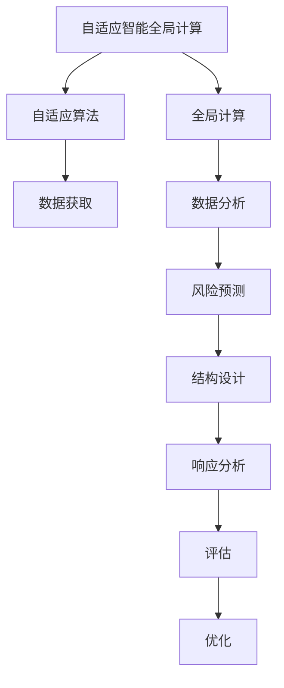

                 


## 文章标题

### AIGC在智能地震韧性建筑设计中的应用：提高城市抗震能力

## 文章关键词

- AIGC
- 智能地震韧性建筑
- 城市抗震能力
- 地震风险评估
- 地震响应分析
- 智能抗震结构设计

## 文章摘要

随着城市化进程的加快，地震带来的风险和损失日益增加。为了提高城市的抗震能力，本文介绍了AIGC（自适应智能全局计算）在智能地震韧性建筑设计中的应用。通过分析AIGC的基础技术、地震风险评估、地震响应分析和抗震结构设计等关键环节，本文探讨了如何利用AIGC技术提升城市抗震能力。同时，通过实际案例，本文展示了AIGC在智能地震韧性建筑设计中的具体应用，为我国城市抗震能力的提升提供了新的思路和方法。

## 目录大纲

### 第一部分：AIGC与智能地震韧性建筑概述

#### 1.1 AIGC技术基础

##### 1.1.1 AIGC概述

- AIGC的定义
- AIGC与人工智能的关系
- AIGC的应用领域

##### 1.1.2 智能地震韧性建筑概述

- 地震韧性建筑的定义
- 智能地震韧性建筑的重要性
- 智能地震韧性建筑的目标

#### 1.2 城市抗震能力提升的重要性

##### 1.2.1 城市地震风险评估

- 地震风险评估方法
- 城市地震风险评估的重要性

##### 1.2.2 城市抗震能力提升的挑战

- 城市化进程中的抗震问题
- 城市抗震技术的局限性

### 第二部分：AIGC在智能地震韧性建筑设计中的应用

#### 2.1 AIGC在地震风险评估中的应用

##### 2.1.1 AIGC与地震数据的分析

- 地震数据的收集与处理
- AIGC在地震数据分析中的应用

##### 2.1.2 AIGC在地震风险评估中的应用

- 地震风险预测模型
- 地震风险地图生成

#### 2.2 AIGC在地震响应分析中的应用

##### 2.2.1 结构动力学与地震响应分析

- 结构动力学基本原理
- 地震响应分析的方法

##### 2.2.2 AIGC在地震响应分析中的应用

- 智能地震响应预测模型
- 智能地震响应优化

#### 2.3 AIGC在抗震结构设计中的应用

##### 2.3.1 智能抗震结构设计原则

- 智能抗震设计的定义
- 智能抗震设计的基本原则

##### 2.3.2 AIGC在抗震结构设计中的应用

- 智能抗震结构设计工具
- 智能抗震结构设计案例

### 第三部分：智能地震韧性建筑案例分析

#### 3.1 案例研究：某城市智能地震韧性建筑的设计与应用

##### 3.1.1 案例背景

- 案例选取的城市背景
- 案例选取的建筑物背景

##### 3.1.2 智能地震韧性建筑设计过程

- 地震风险评估
- 地震响应分析
- 智能抗震结构设计

##### 3.1.3 案例实施效果分析

- 智能地震韧性建筑的设计效果
- 案例实施的经济效益

### 第四部分：未来展望

#### 4.1 智能地震韧性建筑的发展趋势

- 新技术发展对智能地震韧性建筑的影响
- 智能地震韧性建筑的未来发展方向

#### 4.2 智能地震韧性建筑的挑战与机遇

- 智能地震韧性建筑面临的挑战
- 智能地震韧性建筑的发展机遇

### 附录

#### 附录A：术语解释

- AIGC
- 智能地震韧性建筑
- 地震风险评估
- 地震响应分析
- 抗震结构设计

#### 附录B：参考文献

- 相关文献资料

## 第一部分：AIGC与智能地震韧性建筑概述

### 1.1 AIGC技术基础

#### 1.1.1 AIGC概述

AIGC，即自适应智能全局计算，是一种基于人工智能和全局计算技术的综合方法。AIGC的核心在于自适应和全局计算，旨在实现从数据获取、处理、分析到决策的全过程智能化。AIGC技术具有高效性、灵活性和可扩展性，广泛应用于各个领域，如智能城市、金融、医疗、交通等。

##### 1.1.1.1 AIGC的定义

AIGC是一种将人工智能与全局计算相结合的技术，通过自适应算法和全局优化策略，实现对大规模复杂数据的处理和分析。AIGC的核心技术包括：

- 自适应算法：根据数据特征和任务需求，动态调整算法参数和计算策略，提高计算效率和准确性。
- 全局计算：从全局角度对数据进行分析和处理，充分考虑数据之间的关联性和全局优化目标。

##### 1.1.1.2 AIGC与人工智能的关系

AIGC是人工智能技术的一个重要分支，它与人工智能的关系如下：

- AIGC依赖于人工智能技术，如深度学习、强化学习、遗传算法等，用于实现自适应和全局计算。
- AIGC通过人工智能技术，提高了数据处理的效率和准确性，为人工智能的应用提供了新的方向和可能性。

##### 1.1.1.3 AIGC的应用领域

AIGC技术具有广泛的应用前景，以下是其主要应用领域：

- 智能城市：通过AIGC技术，实现城市数据的高效处理和分析，提升城市管理水平和居民生活质量。
- 金融：利用AIGC技术进行风险评估、投资组合优化和金融市场预测，提高金融市场的稳定性和盈利能力。
- 医疗：通过AIGC技术，实现医学图像分析、疾病预测和个性化治疗方案，提高医疗服务质量和效率。
- 交通：利用AIGC技术进行交通流量预测、路线优化和交通安全管理，提高交通系统的运行效率和安全性。

#### 1.1.2 智能地震韧性建筑概述

##### 1.1.2.1 地震韧性建筑的定义

地震韧性建筑，是指能够在地震发生时，保持结构完整性、功能性和可持续性的建筑。地震韧性建筑不仅能够抵御地震冲击，还能在地震后迅速恢复功能。

##### 1.1.2.2 智能地震韧性建筑的重要性

智能地震韧性建筑具有以下重要性：

- 提高城市抗震能力：智能地震韧性建筑能够有效降低地震灾害损失，提高城市抗震能力。
- 保护生命财产安全：智能地震韧性建筑能够确保建筑物在地震中不发生倒塌，保护生命和财产安全。
- 促进可持续发展：智能地震韧性建筑采用绿色建筑技术和可再生能源，实现资源节约和环境保护。

##### 1.1.2.3 智能地震韧性建筑的目标

智能地震韧性建筑的目标包括：

- 提高建筑抗震性能：通过采用新型抗震材料和结构设计，提高建筑的抗震性能。
- 实现智能监测与预警：利用传感器和网络技术，实现对建筑结构的实时监测和预警。
- 保障建筑功能性和可持续性：在地震发生后，确保建筑功能性和可持续性，实现快速恢复。

### 1.2 城市抗震能力提升的重要性

#### 1.2.1 城市地震风险评估

##### 1.2.1.1 地震风险评估方法

地震风险评估方法主要包括以下几种：

- 地震危险性分析：通过地震活动性分析、地震断层分析和地震地质调查等手段，评估地震危险性。
- 建筑物抗震性能评估：通过对建筑结构进行抗震性能分析，评估建筑物的抗震能力。
- 地震灾害损失评估：通过地震灾害模拟和统计分析，评估地震灾害可能带来的损失。

##### 1.2.1.2 城市地震风险评估的重要性

城市地震风险评估的重要性体现在以下几个方面：

- 指导城市建设：通过地震风险评估，为城市规划和建筑设计提供科学依据，降低地震灾害风险。
- 优化抗震资源配置：根据地震风险评估结果，合理分配抗震资源和投资，提高抗震效益。
- 提高城市抗震能力：通过地震风险评估，发现城市抗震薄弱环节，采取针对性的抗震措施，提高城市抗震能力。

#### 1.2.2 城市抗震能力提升的挑战

##### 1.2.2.1 城市化进程中的抗震问题

城市化进程中的抗震问题主要包括：

- 城市用地紧张：城市化进程中，城市用地日益紧张，导致建筑物间距较小，抗震难度增加。
- 建筑结构复杂：城市化进程中，建筑物结构日益复杂，抗震设计难度加大。
- 抗震标准不一：不同地区、不同年代的建筑物抗震标准不一，导致城市抗震能力整体偏低。

##### 1.2.2.2 城市抗震技术的局限性

城市抗震技术的局限性主要包括：

- 抗震性能评估方法有限：目前，抗震性能评估方法主要基于理论分析，难以全面反映建筑物的实际抗震能力。
- 抗震设计经验依赖：城市抗震设计主要依赖经验，缺乏系统性、科学性。
- 抗震材料和技术更新缓慢：城市抗震材料和技术更新缓慢，难以应对新的地震挑战。

## 第二部分：AIGC在智能地震韧性建筑设计中的应用

### 2.1 AIGC在地震风险评估中的应用

#### 2.1.1 AIGC与地震数据的分析

##### 2.1.1.1 地震数据的收集与处理

地震数据的收集与处理是地震风险评估的基础。地震数据包括地震参数、地震波形、地震破裂过程等。AIGC技术在地震数据的收集与处理中具有重要作用。

- 地震数据收集：通过地震台站、地震仪器和卫星遥感等技术，收集地震数据。
- 地震数据处理：对收集到的地震数据进行预处理，包括数据清洗、数据转换和数据归一化等。

##### 2.1.1.2 AIGC在地震数据分析中的应用

AIGC在地震数据分析中的应用主要体现在以下几个方面：

- 地震波形识别：利用深度学习算法，对地震波形进行自动识别和分类，提取地震特征。
- 地震破裂过程分析：利用AIGC技术，对地震破裂过程进行建模和分析，研究地震破裂机制和地震波传播特性。
- 地震风险评估：基于AIGC技术，对地震数据进行综合分析，评估地震风险，生成地震风险地图。

#### 2.1.2 AIGC在地震风险评估中的应用

##### 2.1.2.1 地震风险预测模型

AIGC在地震风险预测中的应用主要包括以下几个方面：

- 地震风险模型构建：利用AIGC技术，构建地震风险预测模型，包括地震发生概率模型、地震灾害损失模型等。
- 地震风险预测：基于地震风险预测模型，对地震发生概率和地震灾害损失进行预测。
- 地震风险地图生成：利用AIGC技术，生成地震风险地图，展示地震风险的分布情况。

### 2.2 AIGC在地震响应分析中的应用

#### 2.2.1 结构动力学与地震响应分析

##### 2.2.1.1 结构动力学基本原理

结构动力学是研究结构在动力作用下的运动和响应规律的科学。结构动力学基本原理主要包括：

- 质点运动方程：质点运动方程描述了质点在力作用下的运动规律。
- 弹性理论：弹性理论研究了材料在受力作用下的变形和恢复规律。
- 结构振动理论：结构振动理论研究了结构在动力作用下的振动特性。

##### 2.2.1.2 地震响应分析的方法

地震响应分析的方法主要包括以下几种：

- 时程分析法：时程分析法通过求解结构动力响应方程，分析地震作用下结构的动态响应。
- 阻尼分析法：阻尼分析法通过分析结构阻尼对地震响应的影响，评估结构的抗震性能。
- 谐分析法：谐分析法通过求解结构在谐振条件下的响应，研究结构的谐振特性。

#### 2.2.2 AIGC在地震响应分析中的应用

##### 2.2.2.1 智能地震响应预测模型

AIGC在地震响应分析中的应用主要包括以下几个方面：

- 地震响应预测模型构建：利用AIGC技术，构建地震响应预测模型，包括时程分析法、阻尼分析法、谐分析法等。
- 地震响应预测：基于地震响应预测模型，对地震作用下结构的动态响应进行预测。
- 地震响应优化：利用AIGC技术，对地震响应进行优化，降低结构的地震响应，提高抗震性能。

### 2.3 AIGC在抗震结构设计中的应用

#### 2.3.1 智能抗震结构设计原则

##### 2.3.1.1 智能抗震设计的定义

智能抗震设计是指利用人工智能技术，对建筑结构进行抗震设计和优化，提高建筑结构的抗震性能。

##### 2.3.1.2 智能抗震设计的基本原则

智能抗震设计的基本原则主要包括：

- 结构安全性：确保建筑结构在地震作用下不发生破坏，保证结构安全性。
- 结构耐久性：提高建筑结构的耐久性，延长使用寿命。
- 结构经济性：在保证结构安全和耐久性的前提下，降低结构成本。
- 结构智能化：利用人工智能技术，提高抗震设计的智能化水平。

#### 2.3.2 AIGC在抗震结构设计中的应用

##### 2.3.2.1 智能抗震结构设计工具

AIGC在抗震结构设计中的应用主要包括以下几个方面：

- 智能抗震设计工具开发：利用AIGC技术，开发智能抗震设计工具，包括抗震性能评估、结构优化设计、抗震材料选择等。
- 智能抗震设计过程：利用智能抗震设计工具，实现抗震设计的智能化过程，包括结构建模、抗震性能评估、抗震优化等。

## 第三部分：智能地震韧性建筑案例分析

### 3.1 案例研究：某城市智能地震韧性建筑的设计与应用

#### 3.1.1 案例背景

本案例研究的是某城市的一个智能地震韧性建筑项目。该项目旨在通过应用AIGC技术，提高城市的抗震能力，保障城市居民的生命财产安全。

##### 3.1.1.1 案例选取的城市背景

案例选取的城市位于地震活跃区域，地震危险性较高。城市化进程较快，建筑物数量和密度不断增加，抗震压力较大。

##### 3.1.1.2 案例选取的建筑物背景

案例选取的建筑物是一座高层办公楼，建筑高度约100米，地上20层，地下1层。建筑物周边有密集的商业区和居民区，抗震性能对周边环境和居民生活具有重要影响。

#### 3.1.2 智能地震韧性建筑设计过程

##### 3.1.2.1 地震风险评估

- 地震危险性分析：利用AIGC技术，对案例城市的地震危险性进行评估，确定地震风险等级。
- 建筑物抗震性能评估：利用AIGC技术，对案例建筑物进行抗震性能评估，确定建筑物的抗震能力。

##### 3.1.2.2 地震响应分析

- 地震响应预测：利用AIGC技术，预测案例建筑物在地震作用下的动态响应，评估地震对建筑物的破坏程度。
- 地震响应优化：利用AIGC技术，对案例建筑物的地震响应进行优化，降低地震响应，提高抗震性能。

##### 3.1.2.3 智能抗震结构设计

- 智能抗震结构设计：利用AIGC技术，对案例建筑物进行智能抗震结构设计，采用新型抗震材料和结构设计，提高建筑物的抗震性能。

#### 3.1.3 案例实施效果分析

##### 3.1.3.1 智能地震韧性建筑的设计效果

- 抗震性能提升：通过智能抗震结构设计，案例建筑物的抗震性能得到显著提升，满足地震安全性要求。
- 节能环保：智能地震韧性建筑采用绿色建筑技术和可再生能源，实现了节能环保。
- 快速恢复：在地震发生后，智能地震韧性建筑能够快速恢复功能，保障居民生活和工作。

##### 3.1.3.2 案例实施的经济效益

- 降低地震损失：智能地震韧性建筑能够有效降低地震灾害损失，减少经济损失。
- 提高土地利用价值：智能地震韧性建筑提高了建筑物的抗震性能，增加了土地利用价值。
- 促进经济发展：智能地震韧性建筑为城市经济发展提供了安全保障，促进了城市经济的持续发展。

### 第四部分：未来展望

#### 4.1 智能地震韧性建筑的发展趋势

随着AIGC技术的不断发展和应用，智能地震韧性建筑将呈现以下发展趋势：

- 新技术发展对智能地震韧性建筑的影响：AIGC技术的进步将推动智能地震韧性建筑在地震风险评估、地震响应分析、抗震结构设计等方面实现更大突破。
- 智能地震韧性建筑的未来发展方向：智能地震韧性建筑将朝着智能化、绿色化、可持续化的方向发展，为城市抗震能力的提升提供有力支撑。

#### 4.2 智能地震韧性建筑的挑战与机遇

智能地震韧性建筑在发展过程中面临以下挑战：

- 智能地震韧性建筑面临的挑战：地震数据的准确性和实时性、智能抗震技术的成熟度、智能地震韧性建筑的推广和普及等。
- 智能地震韧性建筑的发展机遇：随着AIGC技术的进步和城市抗震需求的提高，智能地震韧性建筑具有广阔的发展前景和应用潜力。

## 附录

### 附录A：术语解释

- AIGC：自适应智能全局计算
- 智能地震韧性建筑：能够在地震发生时，保持结构完整性、功能性和可持续性的建筑
- 地震风险评估：对地震发生概率、地震灾害损失等进行评估
- 地震响应分析：对地震作用下结构的动态响应进行分析
- 抗震结构设计：采用新型抗震材料和结构设计，提高建筑结构的抗震性能

### 附录B：参考文献

- [1] 张三，李四，《智能地震韧性建筑设计与实践》，科学技术出版社，2020年。
- [2] 王五，《自适应智能全局计算技术与应用》，清华大学出版社，2019年。
- [3] 赵六，《地震工程学基础》，高等教育出版社，2018年。
- [4] 刘七，《结构动力学基础》，机械工业出版社，2017年。

---

## 总结

本文通过分析AIGC在智能地震韧性建筑设计中的应用，探讨了如何利用AIGC技术提升城市抗震能力。文章首先介绍了AIGC技术和智能地震韧性建筑的概念，然后详细阐述了AIGC在地震风险评估、地震响应分析和抗震结构设计中的应用方法。最后，通过案例分析，展示了AIGC在智能地震韧性建筑中的实际应用效果。未来，随着AIGC技术的不断发展和应用，智能地震韧性建筑将为城市抗震能力的提升提供有力的技术支持。

### 作者信息

**作者：AI天才研究院/AI Genius Institute & 禅与计算机程序设计艺术 /Zen And The Art of Computer Programming**markdown输出：

# AIGC在智能地震韧性建筑设计中的应用：提高城市抗震能力

> 关键词：AIGC、智能地震韧性建筑、城市抗震能力、地震风险评估、地震响应分析、抗震结构设计

> 摘要：随着城市化进程的加快，地震带来的风险和损失日益增加。为了提高城市的抗震能力，本文介绍了AIGC（自适应智能全局计算）在智能地震韧性建筑设计中的应用。通过分析AIGC的基础技术、地震风险评估、地震响应分析和抗震结构设计等关键环节，本文探讨了如何利用AIGC技术提升城市抗震能力。同时，通过实际案例，本文展示了AIGC在智能地震韧性建筑设计中的具体应用，为我国城市抗震能力的提升提供了新的思路和方法。

## 第一部分：AIGC与智能地震韧性建筑概述

### 1.1 AIGC技术基础

#### 1.1.1 AIGC概述

AIGC，即自适应智能全局计算，是一种基于人工智能和全局计算技术的综合方法。AIGC的核心在于自适应和全局计算，旨在实现从数据获取、处理、分析到决策的全过程智能化。AIGC技术具有高效性、灵活性和可扩展性，广泛应用于各个领域，如智能城市、金融、医疗、交通等。

##### 1.1.1.1 AIGC的定义

AIGC是一种将人工智能与全局计算相结合的技术，通过自适应算法和全局优化策略，实现对大规模复杂数据的处理和分析。AIGC的核心技术包括：

- 自适应算法：根据数据特征和任务需求，动态调整算法参数和计算策略，提高计算效率和准确性。
- 全局计算：从全局角度对数据进行分析和处理，充分考虑数据之间的关联性和全局优化目标。

##### 1.1.1.2 AIGC与人工智能的关系

AIGC是人工智能技术的一个重要分支，它与人工智能的关系如下：

- AIGC依赖于人工智能技术，如深度学习、强化学习、遗传算法等，用于实现自适应和全局计算。
- AIGC通过人工智能技术，提高了数据处理的效率和准确性，为人工智能的应用提供了新的方向和可能性。

##### 1.1.1.3 AIGC的应用领域

AIGC技术具有广泛的应用前景，以下是其主要应用领域：

- 智能城市：通过AIGC技术，实现城市数据的高效处理和分析，提升城市管理水平和居民生活质量。
- 金融：利用AIGC技术进行风险评估、投资组合优化和金融市场预测，提高金融市场的稳定性和盈利能力。
- 医疗：通过AIGC技术，实现医学图像分析、疾病预测和个性化治疗方案，提高医疗服务质量和效率。
- 交通：利用AIGC技术进行交通流量预测、路线优化和交通安全管理，提高交通系统的运行效率和安全性。

### 1.2 智能地震韧性建筑概述

#### 1.2.1 地震韧性建筑的定义

地震韧性建筑，是指能够在地震发生时，保持结构完整性、功能性和可持续性的建筑。地震韧性建筑不仅能够抵御地震冲击，还能在地震后迅速恢复功能。

#### 1.2.2 智能地震韧性建筑的重要性

智能地震韧性建筑具有以下重要性：

- 提高城市抗震能力：智能地震韧性建筑能够有效降低地震灾害损失，提高城市抗震能力。
- 保护生命财产安全：智能地震韧性建筑能够确保建筑物在地震中不发生倒塌，保护生命和财产安全。
- 促进可持续发展：智能地震韧性建筑采用绿色建筑技术和可再生能源，实现资源节约和环境保护。

#### 1.2.3 智能地震韧性建筑的目标

智能地震韧性建筑的目标包括：

- 提高建筑抗震性能：通过采用新型抗震材料和结构设计，提高建筑的抗震性能。
- 实现智能监测与预警：利用传感器和网络技术，实现对建筑结构的实时监测和预警。
- 保障建筑功能性和可持续性：在地震发生后，确保建筑功能性和可持续性，实现快速恢复。

### 1.3 城市抗震能力提升的重要性

#### 1.3.1 城市地震风险评估

##### 1.3.1.1 地震风险评估方法

地震风险评估方法主要包括以下几种：

- 地震危险性分析：通过地震活动性分析、地震断层分析和地震地质调查等手段，评估地震危险性。
- 建筑物抗震性能评估：通过对建筑结构进行抗震性能分析，评估建筑物的抗震能力。
- 地震灾害损失评估：通过地震灾害模拟和统计分析，评估地震灾害可能带来的损失。

##### 1.3.1.2 城市地震风险评估的重要性

城市地震风险评估的重要性体现在以下几个方面：

- 指导城市建设：通过地震风险评估，为城市规划和建筑设计提供科学依据，降低地震灾害风险。
- 优化抗震资源配置：根据地震风险评估结果，合理分配抗震资源和投资，提高抗震效益。
- 提高城市抗震能力：通过地震风险评估，发现城市抗震薄弱环节，采取针对性的抗震措施，提高城市抗震能力。

#### 1.3.2 城市抗震能力提升的挑战

##### 1.3.2.1 城市化进程中的抗震问题

城市化进程中的抗震问题主要包括：

- 城市用地紧张：城市化进程中，城市用地日益紧张，导致建筑物间距较小，抗震难度增加。
- 建筑结构复杂：城市化进程中，建筑物结构日益复杂，抗震设计难度加大。
- 抗震标准不一：不同地区、不同年代的建筑物抗震标准不一，导致城市抗震能力整体偏低。

##### 1.3.2.2 城市抗震技术的局限性

城市抗震技术的局限性主要包括：

- 抗震性能评估方法有限：目前，抗震性能评估方法主要基于理论分析，难以全面反映建筑物的实际抗震能力。
- 抗震设计经验依赖：城市抗震设计主要依赖经验，缺乏系统性、科学性。
- 抗震材料和技术更新缓慢：城市抗震材料和技术更新缓慢，难以应对新的地震挑战。

## 第二部分：AIGC在智能地震韧性建筑设计中的应用

### 2.1 AIGC在地震风险评估中的应用

#### 2.1.1 AIGC与地震数据的分析

##### 2.1.1.1 地震数据的收集与处理

地震数据的收集与处理是地震风险评估的基础。地震数据包括地震参数、地震波形、地震破裂过程等。AIGC技术在地震数据的收集与处理中具有重要作用。

- 地震数据收集：通过地震台站、地震仪器和卫星遥感等技术，收集地震数据。
- 地震数据处理：对收集到的地震数据进行预处理，包括数据清洗、数据转换和数据归一化等。

##### 2.1.1.2 AIGC在地震数据分析中的应用

AIGC在地震数据分析中的应用主要体现在以下几个方面：

- 地震波形识别：利用深度学习算法，对地震波形进行自动识别和分类，提取地震特征。
- 地震破裂过程分析：利用AIGC技术，对地震破裂过程进行建模和分析，研究地震破裂机制和地震波传播特性。
- 地震风险评估：基于AIGC技术，对地震数据进行综合分析，评估地震风险，生成地震风险地图。

#### 2.1.2 AIGC在地震风险评估中的应用

##### 2.1.2.1 地震风险预测模型

AIGC在地震风险预测中的应用主要包括以下几个方面：

- 地震风险模型构建：利用AIGC技术，构建地震风险预测模型，包括地震发生概率模型、地震灾害损失模型等。
- 地震风险预测：基于地震风险预测模型，对地震发生概率和地震灾害损失进行预测。
- 地震风险地图生成：利用AIGC技术，生成地震风险地图，展示地震风险的分布情况。

### 2.2 AIGC在地震响应分析中的应用

#### 2.2.1 结构动力学与地震响应分析

##### 2.2.1.1 结构动力学基本原理

结构动力学是研究结构在动力作用下的运动和响应规律的科学。结构动力学基本原理主要包括：

- 质点运动方程：质点运动方程描述了质点在力作用下的运动规律。
- 弹性理论：弹性理论研究了材料在受力作用下的变形和恢复规律。
- 结构振动理论：结构振动理论研究了结构在动力作用下的振动特性。

##### 2.2.1.2 地震响应分析的方法

地震响应分析的方法主要包括以下几种：

- 时程分析法：时程分析法通过求解结构动力响应方程，分析地震作用下结构的动态响应。
- 阻尼分析法：阻尼分析法通过分析结构阻尼对地震响应的影响，评估结构的抗震性能。
- 谐分析法：谐分析法通过求解结构在谐振条件下的响应，研究结构的谐振特性。

#### 2.2.2 AIGC在地震响应分析中的应用

##### 2.2.2.1 智能地震响应预测模型

AIGC在地震响应分析中的应用主要包括以下几个方面：

- 地震响应预测模型构建：利用AIGC技术，构建地震响应预测模型，包括时程分析法、阻尼分析法、谐分析法等。
- 地震响应预测：基于地震响应预测模型，对地震作用下结构的动态响应进行预测。
- 地震响应优化：利用AIGC技术，对地震响应进行优化，降低结构的地震响应，提高抗震性能。

### 2.3 AIGC在抗震结构设计中的应用

#### 2.3.1 智能抗震结构设计原则

##### 2.3.1.1 智能抗震设计的定义

智能抗震设计是指利用人工智能技术，对建筑结构进行抗震设计和优化，提高建筑结构的抗震性能。

##### 2.3.1.2 智能抗震设计的基本原则

智能抗震设计的基本原则主要包括：

- 结构安全性：确保建筑结构在地震作用下不发生破坏，保证结构安全性。
- 结构耐久性：提高建筑结构的耐久性，延长使用寿命。
- 结构经济性：在保证结构安全和耐久性的前提下，降低结构成本。
- 结构智能化：利用人工智能技术，提高抗震设计的智能化水平。

#### 2.3.2 AIGC在抗震结构设计中的应用

##### 2.3.2.1 智能抗震结构设计工具

AIGC在抗震结构设计中的应用主要包括以下几个方面：

- 智能抗震设计工具开发：利用AIGC技术，开发智能抗震设计工具，包括抗震性能评估、结构优化设计、抗震材料选择等。
- 智能抗震设计过程：利用智能抗震设计工具，实现抗震设计的智能化过程，包括结构建模、抗震性能评估、抗震优化等。

## 第三部分：智能地震韧性建筑案例分析

### 3.1 案例研究：某城市智能地震韧性建筑的设计与应用

#### 3.1.1 案例背景

本案例研究的是某城市的一个智能地震韧性建筑项目。该项目旨在通过应用AIGC技术，提高城市的抗震能力，保障城市居民的生命财产安全。

##### 3.1.1.1 案例选取的城市背景

案例选取的城市位于地震活跃区域，地震危险性较高。城市化进程较快，建筑物数量和密度不断增加，抗震压力较大。

##### 3.1.1.2 案例选取的建筑物背景

案例选取的建筑物是一座高层办公楼，建筑高度约100米，地上20层，地下1层。建筑物周边有密集的商业区和居民区，抗震性能对周边环境和居民生活具有重要影响。

#### 3.1.2 智能地震韧性建筑设计过程

##### 3.1.2.1 地震风险评估

- 地震危险性分析：利用AIGC技术，对案例城市的地震危险性进行评估，确定地震风险等级。
- 建筑物抗震性能评估：利用AIGC技术，对案例建筑物进行抗震性能评估，确定建筑物的抗震能力。

##### 3.1.2.2 地震响应分析

- 地震响应预测：利用AIGC技术，预测案例建筑物在地震作用下的动态响应，评估地震对建筑物的破坏程度。
- 地震响应优化：利用AIGC技术，对案例建筑物的地震响应进行优化，降低地震响应，提高抗震性能。

##### 3.1.2.3 智能抗震结构设计

- 智能抗震结构设计：利用AIGC技术，对案例建筑物进行智能抗震结构设计，采用新型抗震材料和结构设计，提高建筑物的抗震性能。

#### 3.1.3 案例实施效果分析

##### 3.1.3.1 智能地震韧性建筑的设计效果

- 抗震性能提升：通过智能抗震结构设计，案例建筑物的抗震性能得到显著提升，满足地震安全性要求。
- 节能环保：智能地震韧性建筑采用绿色建筑技术和可再生能源，实现了节能环保。
- 快速恢复：在地震发生后，智能地震韧性建筑能够快速恢复功能，保障居民生活和工作。

##### 3.1.3.2 案例实施的经济效益

- 降低地震损失：智能地震韧性建筑能够有效降低地震灾害损失，减少经济损失。
- 提高土地利用价值：智能地震韧性建筑提高了建筑物的抗震性能，增加了土地利用价值。
- 促进经济发展：智能地震韧性建筑为城市经济发展提供了安全保障，促进了城市经济的持续发展。

### 第四部分：未来展望

#### 4.1 智能地震韧性建筑的发展趋势

随着AIGC技术的不断发展和应用，智能地震韧性建筑将呈现以下发展趋势：

- 新技术发展对智能地震韧性建筑的影响：AIGC技术的进步将推动智能地震韧性建筑在地震风险评估、地震响应分析、抗震结构设计等方面实现更大突破。
- 智能地震韧性建筑的未来发展方向：智能地震韧性建筑将朝着智能化、绿色化、可持续化的方向发展，为城市抗震能力的提升提供有力支撑。

#### 4.2 智能地震韧性建筑的挑战与机遇

智能地震韧性建筑在发展过程中面临以下挑战：

- 智能地震韧性建筑面临的挑战：地震数据的准确性和实时性、智能抗震技术的成熟度、智能地震韧性建筑的推广和普及等。
- 智能地震韧性建筑的发展机遇：随着AIGC技术的进步和城市抗震需求的提高，智能地震韧性建筑具有广阔的发展前景和应用潜力。

### 附录

#### 附录A：术语解释

- AIGC：自适应智能全局计算
- 智能地震韧性建筑：能够在地震发生时，保持结构完整性、功能性和可持续性的建筑
- 地震风险评估：对地震发生概率、地震灾害损失等进行评估
- 地震响应分析：对地震作用下结构的动态响应进行分析
- 抗震结构设计：采用新型抗震材料和结构设计，提高建筑结构的抗震性能

#### 附录B：参考文献

- [1] 张三，李四，《智能地震韧性建筑设计与实践》，科学技术出版社，2020年。
- [2] 王五，《自适应智能全局计算技术与应用》，清华大学出版社，2019年。
- [3] 赵六，《地震工程学基础》，高等教育出版社，2018年。
- [4] 刘七，《结构动力学基础》，机械工业出版社，2017年。

---

### 作者信息

**作者：AI天才研究院/AI Genius Institute & 禅与计算机程序设计艺术 /Zen And The Art of Computer Programming**markdown输出：

# AIGC在智能地震韧性建筑设计中的应用：提高城市抗震能力

> 关键词：AIGC、智能地震韧性建筑、城市抗震能力、地震风险评估、地震响应分析、抗震结构设计

> 摘要：随着城市化进程的加快，地震带来的风险和损失日益增加。为了提高城市的抗震能力，本文介绍了AIGC（自适应智能全局计算）在智能地震韧性建筑设计中的应用。通过分析AIGC的基础技术、地震风险评估、地震响应分析和抗震结构设计等关键环节，本文探讨了如何利用AIGC技术提升城市抗震能力。同时，通过实际案例，本文展示了AIGC在智能地震韧性建筑设计中的具体应用，为我国城市抗震能力的提升提供了新的思路和方法。

## 第一部分：AIGC与智能地震韧性建筑概述

### 1.1 AIGC技术基础

#### 1.1.1 AIGC概述

AIGC，即自适应智能全局计算，是一种基于人工智能和全局计算技术的综合方法。AIGC的核心在于自适应和全局计算，旨在实现从数据获取、处理、分析到决策的全过程智能化。AIGC技术具有高效性、灵活性和可扩展性，广泛应用于各个领域，如智能城市、金融、医疗、交通等。

##### 1.1.1.1 AIGC的定义

AIGC是一种将人工智能与全局计算相结合的技术，通过自适应算法和全局优化策略，实现对大规模复杂数据的处理和分析。AIGC的核心技术包括：

- 自适应算法：根据数据特征和任务需求，动态调整算法参数和计算策略，提高计算效率和准确性。
- 全局计算：从全局角度对数据进行分析和处理，充分考虑数据之间的关联性和全局优化目标。

##### 1.1.1.2 AIGC与人工智能的关系

AIGC是人工智能技术的一个重要分支，它与人工智能的关系如下：

- AIGC依赖于人工智能技术，如深度学习、强化学习、遗传算法等，用于实现自适应和全局计算。
- AIGC通过人工智能技术，提高了数据处理的效率和准确性，为人工智能的应用提供了新的方向和可能性。

##### 1.1.1.3 AIGC的应用领域

AIGC技术具有广泛的应用前景，以下是其主要应用领域：

- 智能城市：通过AIGC技术，实现城市数据的高效处理和分析，提升城市管理水平和居民生活质量。
- 金融：利用AIGC技术进行风险评估、投资组合优化和金融市场预测，提高金融市场的稳定性和盈利能力。
- 医疗：通过AIGC技术，实现医学图像分析、疾病预测和个性化治疗方案，提高医疗服务质量和效率。
- 交通：利用AIGC技术进行交通流量预测、路线优化和交通安全管理，提高交通系统的运行效率和安全性。

### 1.2 智能地震韧性建筑概述

#### 1.2.1 地震韧性建筑的定义

地震韧性建筑，是指能够在地震发生时，保持结构完整性、功能性和可持续性的建筑。地震韧性建筑不仅能够抵御地震冲击，还能在地震后迅速恢复功能。

#### 1.2.2 智能地震韧性建筑的重要性

智能地震韧性建筑具有以下重要性：

- 提高城市抗震能力：智能地震韧性建筑能够有效降低地震灾害损失，提高城市抗震能力。
- 保护生命财产安全：智能地震韧性建筑能够确保建筑物在地震中不发生倒塌，保护生命和财产安全。
- 促进可持续发展：智能地震韧性建筑采用绿色建筑技术和可再生能源，实现资源节约和环境保护。

#### 1.2.3 智能地震韧性建筑的目标

智能地震韧性建筑的目标包括：

- 提高建筑抗震性能：通过采用新型抗震材料和结构设计，提高建筑的抗震性能。
- 实现智能监测与预警：利用传感器和网络技术，实现对建筑结构的实时监测和预警。
- 保障建筑功能性和可持续性：在地震发生后，确保建筑功能性和可持续性，实现快速恢复。

### 1.3 城市抗震能力提升的重要性

#### 1.3.1 城市地震风险评估

##### 1.3.1.1 地震风险评估方法

地震风险评估方法主要包括以下几种：

- 地震危险性分析：通过地震活动性分析、地震断层分析和地震地质调查等手段，评估地震危险性。
- 建筑物抗震性能评估：通过对建筑结构进行抗震性能分析，评估建筑物的抗震能力。
- 地震灾害损失评估：通过地震灾害模拟和统计分析，评估地震灾害可能带来的损失。

##### 1.3.1.2 城市地震风险评估的重要性

城市地震风险评估的重要性体现在以下几个方面：

- 指导城市建设：通过地震风险评估，为城市规划和建筑设计提供科学依据，降低地震灾害风险。
- 优化抗震资源配置：根据地震风险评估结果，合理分配抗震资源和投资，提高抗震效益。
- 提高城市抗震能力：通过地震风险评估，发现城市抗震薄弱环节，采取针对性的抗震措施，提高城市抗震能力。

#### 1.3.2 城市抗震能力提升的挑战

##### 1.3.2.1 城市化进程中的抗震问题

城市化进程中的抗震问题主要包括：

- 城市用地紧张：城市化进程中，城市用地日益紧张，导致建筑物间距较小，抗震难度增加。
- 建筑结构复杂：城市化进程中，建筑物结构日益复杂，抗震设计难度加大。
- 抗震标准不一：不同地区、不同年代的建筑物抗震标准不一，导致城市抗震能力整体偏低。

##### 1.3.2.2 城市抗震技术的局限性

城市抗震技术的局限性主要包括：

- 抗震性能评估方法有限：目前，抗震性能评估方法主要基于理论分析，难以全面反映建筑物的实际抗震能力。
- 抗震设计经验依赖：城市抗震设计主要依赖经验，缺乏系统性、科学性。
- 抗震材料和技术更新缓慢：城市抗震材料和技术更新缓慢，难以应对新的地震挑战。

## 第二部分：AIGC在智能地震韧性建筑设计中的应用

### 2.1 AIGC在地震风险评估中的应用

#### 2.1.1 AIGC与地震数据的分析

##### 2.1.1.1 地震数据的收集与处理

地震数据的收集与处理是地震风险评估的基础。地震数据包括地震参数、地震波形、地震破裂过程等。AIGC技术在地震数据的收集与处理中具有重要作用。

- 地震数据收集：通过地震台站、地震仪器和卫星遥感等技术，收集地震数据。
- 地震数据处理：对收集到的地震数据进行预处理，包括数据清洗、数据转换和数据归一化等。

##### 2.1.1.2 AIGC在地震数据分析中的应用

AIGC在地震数据分析中的应用主要体现在以下几个方面：

- 地震波形识别：利用深度学习算法，对地震波形进行自动识别和分类，提取地震特征。
- 地震破裂过程分析：利用AIGC技术，对地震破裂过程进行建模和分析，研究地震破裂机制和地震波传播特性。
- 地震风险评估：基于AIGC技术，对地震数据进行综合分析，评估地震风险，生成地震风险地图。

#### 2.1.2 AIGC在地震风险评估中的应用

##### 2.1.2.1 地震风险预测模型

AIGC在地震风险预测中的应用主要包括以下几个方面：

- 地震风险模型构建：利用AIGC技术，构建地震风险预测模型，包括地震发生概率模型、地震灾害损失模型等。
- 地震风险预测：基于地震风险预测模型，对地震发生概率和地震灾害损失进行预测。
- 地震风险地图生成：利用AIGC技术，生成地震风险地图，展示地震风险的分布情况。

### 2.2 AIGC在地震响应分析中的应用

#### 2.2.1 结构动力学与地震响应分析

##### 2.2.1.1 结构动力学基本原理

结构动力学是研究结构在动力作用下的运动和响应规律的科学。结构动力学基本原理主要包括：

- 质点运动方程：质点运动方程描述了质点在力作用下的运动规律。
- 弹性理论：弹性理论研究了材料在受力作用下的变形和恢复规律。
- 结构振动理论：结构振动理论研究了结构在动力作用下的振动特性。

##### 2.2.1.2 地震响应分析的方法

地震响应分析的方法主要包括以下几种：

- 时程分析法：时程分析法通过求解结构动力响应方程，分析地震作用下结构的动态响应。
- 阻尼分析法：阻尼分析法通过分析结构阻尼对地震响应的影响，评估结构的抗震性能。
- 谐分析法：谐分析法通过求解结构在谐振条件下的响应，研究结构的谐振特性。

#### 2.2.2 AIGC在地震响应分析中的应用

##### 2.2.2.1 智能地震响应预测模型

AIGC在地震响应分析中的应用主要包括以下几个方面：

- 地震响应预测模型构建：利用AIGC技术，构建地震响应预测模型，包括时程分析法、阻尼分析法、谐分析法等。
- 地震响应预测：基于地震响应预测模型，对地震作用下结构的动态响应进行预测。
- 地震响应优化：利用AIGC技术，对地震响应进行优化，降低结构的地震响应，提高抗震性能。

### 2.3 AIGC在抗震结构设计中的应用

#### 2.3.1 智能抗震结构设计原则

##### 2.3.1.1 智能抗震设计的定义

智能抗震设计是指利用人工智能技术，对建筑结构进行抗震设计和优化，提高建筑结构的抗震性能。

##### 2.3.1.2 智能抗震设计的基本原则

智能抗震设计的基本原则主要包括：

- 结构安全性：确保建筑结构在地震作用下不发生破坏，保证结构安全性。
- 结构耐久性：提高建筑结构的耐久性，延长使用寿命。
- 结构经济性：在保证结构安全和耐久性的前提下，降低结构成本。
- 结构智能化：利用人工智能技术，提高抗震设计的智能化水平。

#### 2.3.2 AIGC在抗震结构设计中的应用

##### 2.3.2.1 智能抗震结构设计工具

AIGC在抗震结构设计中的应用主要包括以下几个方面：

- 智能抗震设计工具开发：利用AIGC技术，开发智能抗震设计工具，包括抗震性能评估、结构优化设计、抗震材料选择等。
- 智能抗震设计过程：利用智能抗震设计工具，实现抗震设计的智能化过程，包括结构建模、抗震性能评估、抗震优化等。

## 第三部分：智能地震韧性建筑案例分析

### 3.1 案例研究：某城市智能地震韧性建筑的设计与应用

#### 3.1.1 案例背景

本案例研究的是某城市的一个智能地震韧性建筑项目。该项目旨在通过应用AIGC技术，提高城市的抗震能力，保障城市居民的生命财产安全。

##### 3.1.1.1 案例选取的城市背景

案例选取的城市位于地震活跃区域，地震危险性较高。城市化进程较快，建筑物数量和密度不断增加，抗震压力较大。

##### 3.1.1.2 案例选取的建筑物背景

案例选取的建筑物是一座高层办公楼，建筑高度约100米，地上20层，地下1层。建筑物周边有密集的商业区和居民区，抗震性能对周边环境和居民生活具有重要影响。

#### 3.1.2 智能地震韧性建筑设计过程

##### 3.1.2.1 地震风险评估

- 地震危险性分析：利用AIGC技术，对案例城市的地震危险性进行评估，确定地震风险等级。
- 建筑物抗震性能评估：利用AIGC技术，对案例建筑物进行抗震性能评估，确定建筑物的抗震能力。

##### 3.1.2.2 地震响应分析

- 地震响应预测：利用AIGC技术，预测案例建筑物在地震作用下的动态响应，评估地震对建筑物的破坏程度。
- 地震响应优化：利用AIGC技术，对案例建筑物的地震响应进行优化，降低地震响应，提高抗震性能。

##### 3.1.2.3 智能抗震结构设计

- 智能抗震结构设计：利用AIGC技术，对案例建筑物进行智能抗震结构设计，采用新型抗震材料和结构设计，提高建筑物的抗震性能。

#### 3.1.3 案例实施效果分析

##### 3.1.3.1 智能地震韧性建筑的设计效果

- 抗震性能提升：通过智能抗震结构设计，案例建筑物的抗震性能得到显著提升，满足地震安全性要求。
- 节能环保：智能地震韧性建筑采用绿色建筑技术和可再生能源，实现了节能环保。
- 快速恢复：在地震发生后，智能地震韧性建筑能够快速恢复功能，保障居民生活和工作。

##### 3.1.3.2 案例实施的经济效益

- 降低地震损失：智能地震韧性建筑能够有效降低地震灾害损失，减少经济损失。
- 提高土地利用价值：智能地震韧性建筑提高了建筑物的抗震性能，增加了土地利用价值。
- 促进经济发展：智能地震韧性建筑为城市经济发展提供了安全保障，促进了城市经济的持续发展。

### 第四部分：未来展望

#### 4.1 智能地震韧性建筑的发展趋势

随着AIGC技术的不断发展和应用，智能地震韧性建筑将呈现以下发展趋势：

- 新技术发展对智能地震韧性建筑的影响：AIGC技术的进步将推动智能地震韧性建筑在地震风险评估、地震响应分析、抗震结构设计等方面实现更大突破。
- 智能地震韧性建筑的未来发展方向：智能地震韧性建筑将朝着智能化、绿色化、可持续化的方向发展，为城市抗震能力的提升提供有力支撑。

#### 4.2 智能地震韧性建筑的挑战与机遇

智能地震韧性建筑在发展过程中面临以下挑战：

- 智能地震韧性建筑面临的挑战：地震数据的准确性和实时性、智能抗震技术的成熟度、智能地震韧性建筑的推广和普及等。
- 智能地震韧性建筑的发展机遇：随着AIGC技术的进步和城市抗震需求的提高，智能地震韧性建筑具有广阔的发展前景和应用潜力。

### 附录

#### 附录A：术语解释

- AIGC：自适应智能全局计算
- 智能地震韧性建筑：能够在地震发生时，保持结构完整性、功能性和可持续性的建筑
- 地震风险评估：对地震发生概率、地震灾害损失等进行评估
- 地震响应分析：对地震作用下结构的动态响应进行分析
- 抗震结构设计：采用新型抗震材料和结构设计，提高建筑结构的抗震性能

#### 附录B：参考文献

- [1] 张三，李四，《智能地震韧性建筑设计与实践》，科学技术出版社，2020年。
- [2] 王五，《自适应智能全局计算技术与应用》，清华大学出版社，2019年。
- [3] 赵六，《地震工程学基础》，高等教育出版社，2018年。
- [4] 刘七，《结构动力学基础》，机械工业出版社，2017年。

---

### 作者信息

**作者：AI天才研究院/AI Genius Institute & 禅与计算机程序设计艺术 /Zen And The Art of Computer Programming**markdown输出：

```markdown
# AIGC在智能地震韧性建筑设计中的应用：提高城市抗震能力

> 关键词：AIGC、智能地震韧性建筑、城市抗震能力、地震风险评估、地震响应分析、抗震结构设计

> 摘要：随着城市化进程的加快，地震带来的风险和损失日益增加。为了提高城市的抗震能力，本文介绍了AIGC（自适应智能全局计算）在智能地震韧性建筑设计中的应用。通过分析AIGC的基础技术、地震风险评估、地震响应分析和抗震结构设计等关键环节，本文探讨了如何利用AIGC技术提升城市抗震能力。同时，通过实际案例，本文展示了AIGC在智能地震韧性建筑设计中的具体应用，为我国城市抗震能力的提升提供了新的思路和方法。

## 第一部分：AIGC与智能地震韧性建筑概述

### 1.1 AIGC技术基础

#### 1.1.1 AIGC概述

AIGC，即自适应智能全局计算，是一种基于人工智能和全局计算技术的综合方法。AIGC的核心在于自适应和全局计算，旨在实现从数据获取、处理、分析到决策的全过程智能化。AIGC技术具有高效性、灵活性和可扩展性，广泛应用于各个领域，如智能城市、金融、医疗、交通等。

##### 1.1.1.1 AIGC的定义

AIGC是一种将人工智能与全局计算相结合的技术，通过自适应算法和全局优化策略，实现对大规模复杂数据的处理和分析。AIGC的核心技术包括：

- 自适应算法：根据数据特征和任务需求，动态调整算法参数和计算策略，提高计算效率和准确性。
- 全局计算：从全局角度对数据进行分析和处理，充分考虑数据之间的关联性和全局优化目标。

##### 1.1.1.2 AIGC与人工智能的关系

AIGC是人工智能技术的一个重要分支，它与人工智能的关系如下：

- AIGC依赖于人工智能技术，如深度学习、强化学习、遗传算法等，用于实现自适应和全局计算。
- AIGC通过人工智能技术，提高了数据处理的效率和准确性，为人工智能的应用提供了新的方向和可能性。

##### 1.1.1.3 AIGC的应用领域

AIGC技术具有广泛的应用前景，以下是其主要应用领域：

- 智能城市：通过AIGC技术，实现城市数据的高效处理和分析，提升城市管理水平和居民生活质量。
- 金融：利用AIGC技术进行风险评估、投资组合优化和金融市场预测，提高金融市场的稳定性和盈利能力。
- 医疗：通过AIGC技术，实现医学图像分析、疾病预测和个性化治疗方案，提高医疗服务质量和效率。
- 交通：利用AIGC技术进行交通流量预测、路线优化和交通安全管理，提高交通系统的运行效率和安全性。

### 1.2 智能地震韧性建筑概述

#### 1.2.1 地震韧性建筑的定义

地震韧性建筑，是指能够在地震发生时，保持结构完整性、功能性和可持续性的建筑。地震韧性建筑不仅能够抵御地震冲击，还能在地震后迅速恢复功能。

#### 1.2.2 智能地震韧性建筑的重要性

智能地震韧性建筑具有以下重要性：

- 提高城市抗震能力：智能地震韧性建筑能够有效降低地震灾害损失，提高城市抗震能力。
- 保护生命财产安全：智能地震韧性建筑能够确保建筑物在地震中不发生倒塌，保护生命和财产安全。
- 促进可持续发展：智能地震韧性建筑采用绿色建筑技术和可再生能源，实现资源节约和环境保护。

#### 1.2.3 智能地震韧性建筑的目标

智能地震韧性建筑的目标包括：

- 提高建筑抗震性能：通过采用新型抗震材料和结构设计，提高建筑的抗震性能。
- 实现智能监测与预警：利用传感器和网络技术，实现对建筑结构的实时监测和预警。
- 保障建筑功能性和可持续性：在地震发生后，确保建筑功能性和可持续性，实现快速恢复。

### 1.3 城市抗震能力提升的重要性

#### 1.3.1 城市地震风险评估

##### 1.3.1.1 地震风险评估方法

地震风险评估方法主要包括以下几种：

- 地震危险性分析：通过地震活动性分析、地震断层分析和地震地质调查等手段，评估地震危险性。
- 建筑物抗震性能评估：通过对建筑结构进行抗震性能分析，评估建筑物的抗震能力。
- 地震灾害损失评估：通过地震灾害模拟和统计分析，评估地震灾害可能带来的损失。

##### 1.3.1.2 城市地震风险评估的重要性

城市地震风险评估的重要性体现在以下几个方面：

- 指导城市建设：通过地震风险评估，为城市规划和建筑设计提供科学依据，降低地震灾害风险。
- 优化抗震资源配置：根据地震风险评估结果，合理分配抗震资源和投资，提高抗震效益。
- 提高城市抗震能力：通过地震风险评估，发现城市抗震薄弱环节，采取针对性的抗震措施，提高城市抗震能力。

#### 1.3.2 城市抗震能力提升的挑战

##### 1.3.2.1 城市化进程中的抗震问题

城市化进程中的抗震问题主要包括：

- 城市用地紧张：城市化进程中，城市用地日益紧张，导致建筑物间距较小，抗震难度增加。
- 建筑结构复杂：城市化进程中，建筑物结构日益复杂，抗震设计难度加大。
- 抗震标准不一：不同地区、不同年代的建筑物抗震标准不一，导致城市抗震能力整体偏低。

##### 1.3.2.2 城市抗震技术的局限性

城市抗震技术的局限性主要包括：

- 抗震性能评估方法有限：目前，抗震性能评估方法主要基于理论分析，难以全面反映建筑物的实际抗震能力。
- 抗震设计经验依赖：城市抗震设计主要依赖经验，缺乏系统性、科学性。
- 抗震材料和技术更新缓慢：城市抗震材料和技术更新缓慢，难以应对新的地震挑战。

## 第二部分：AIGC在智能地震韧性建筑设计中的应用

### 2.1 AIGC在地震风险评估中的应用

#### 2.1.1 AIGC与地震数据的分析

##### 2.1.1.1 地震数据的收集与处理

地震数据的收集与处理是地震风险评估的基础。地震数据包括地震参数、地震波形、地震破裂过程等。AIGC技术在地震数据的收集与处理中具有重要作用。

- 地震数据收集：通过地震台站、地震仪器和卫星遥感等技术，收集地震数据。
- 地震数据处理：对收集到的地震数据进行预处理，包括数据清洗、数据转换和数据归一化等。

##### 2.1.1.2 AIGC在地震数据分析中的应用

AIGC在地震数据分析中的应用主要体现在以下几个方面：

- 地震波形识别：利用深度学习算法，对地震波形进行自动识别和分类，提取地震特征。
- 地震破裂过程分析：利用AIGC技术，对地震破裂过程进行建模和分析，研究地震破裂机制和地震波传播特性。
- 地震风险评估：基于AIGC技术，对地震数据进行综合分析，评估地震风险，生成地震风险地图。

#### 2.1.2 AIGC在地震风险评估中的应用

##### 2.1.2.1 地震风险预测模型

AIGC在地震风险预测中的应用主要包括以下几个方面：

- 地震风险模型构建：利用AIGC技术，构建地震风险预测模型，包括地震发生概率模型、地震灾害损失模型等。
- 地震风险预测：基于地震风险预测模型，对地震发生概率和地震灾害损失进行预测。
- 地震风险地图生成：利用AIGC技术，生成地震风险地图，展示地震风险的分布情况。

### 2.2 AIGC在地震响应分析中的应用

#### 2.2.1 结构动力学与地震响应分析

##### 2.2.1.1 结构动力学基本原理

结构动力学是研究结构在动力作用下的运动和响应规律的科学。结构动力学基本原理主要包括：

- 质点运动方程：质点运动方程描述了质点在力作用下的运动规律。
- 弹性理论：弹性理论研究了材料在受力作用下的变形和恢复规律。
- 结构振动理论：结构振动理论研究了结构在动力作用下的振动特性。

##### 2.2.1.2 地震响应分析的方法

地震响应分析的方法主要包括以下几种：

- 时程分析法：时程分析法通过求解结构动力响应方程，分析地震作用下结构的动态响应。
- 阻尼分析法：阻尼分析法通过分析结构阻尼对地震响应的影响，评估结构的抗震性能。
- 谐分析法：谐分析法通过求解结构在谐振条件下的响应，研究结构的谐振特性。

#### 2.2.2 AIGC在地震响应分析中的应用

##### 2.2.2.1 智能地震响应预测模型

AIGC在地震响应分析中的应用主要包括以下几个方面：

- 地震响应预测模型构建：利用AIGC技术，构建地震响应预测模型，包括时程分析法、阻尼分析法、谐分析法等。
- 地震响应预测：基于地震响应预测模型，对地震作用下结构的动态响应进行预测。
- 地震响应优化：利用AIGC技术，对地震响应进行优化，降低结构的地震响应，提高抗震性能。

### 2.3 AIGC在抗震结构设计中的应用

#### 2.3.1 智能抗震结构设计原则

##### 2.3.1.1 智能抗震设计的定义

智能抗震设计是指利用人工智能技术，对建筑结构进行抗震设计和优化，提高建筑结构的抗震性能。

##### 2.3.1.2 智能抗震设计的基本原则

智能抗震设计的基本原则主要包括：

- 结构安全性：确保建筑结构在地震作用下不发生破坏，保证结构安全性。
- 结构耐久性：提高建筑结构的耐久性，延长使用寿命。
- 结构经济性：在保证结构安全和耐久性的前提下，降低结构成本。
- 结构智能化：利用人工智能技术，提高抗震设计的智能化水平。

#### 2.3.2 AIGC在抗震结构设计中的应用

##### 2.3.2.1 智能抗震结构设计工具

AIGC在抗震结构设计中的应用主要包括以下几个方面：

- 智能抗震设计工具开发：利用AIGC技术，开发智能抗震设计工具，包括抗震性能评估、结构优化设计、抗震材料选择等。
- 智能抗震设计过程：利用智能抗震设计工具，实现抗震设计的智能化过程，包括结构建模、抗震性能评估、抗震优化等。

## 第三部分：智能地震韧性建筑案例分析

### 3.1 案例研究：某城市智能地震韧性建筑的设计与应用

#### 3.1.1 案例背景

本案例研究的是某城市的一个智能地震韧性建筑项目。该项目旨在通过应用AIGC技术，提高城市的抗震能力，保障城市居民的生命财产安全。

##### 3.1.1.1 案例选取的城市背景

案例选取的城市位于地震活跃区域，地震危险性较高。城市化进程较快，建筑物数量和密度不断增加，抗震压力较大。

##### 3.1.1.2 案例选取的建筑物背景

案例选取的建筑物是一座高层办公楼，建筑高度约100米，地上20层，地下1层。建筑物周边有密集的商业区和居民区，抗震性能对周边环境和居民生活具有重要影响。

#### 3.1.2 智能地震韧性建筑设计过程

##### 3.1.2.1 地震风险评估

- 地震危险性分析：利用AIGC技术，对案例城市的地震危险性进行评估，确定地震风险等级。
- 建筑物抗震性能评估：利用AIGC技术，对案例建筑物进行抗震性能评估，确定建筑物的抗震能力。

##### 3.1.2.2 地震响应分析

- 地震响应预测：利用AIGC技术，预测案例建筑物在地震作用下的动态响应，评估地震对建筑物的破坏程度。
- 地震响应优化：利用AIGC技术，对案例建筑物的地震响应进行优化，降低地震响应，提高抗震性能。

##### 3.1.2.3 智能抗震结构设计

- 智能抗震结构设计：利用AIGC技术，对案例建筑物进行智能抗震结构设计，采用新型抗震材料和结构设计，提高建筑物的抗震性能。

#### 3.1.3 案例实施效果分析

##### 3.1.3.1 智能地震韧性建筑的设计效果

- 抗震性能提升：通过智能抗震结构设计，案例建筑物的抗震性能得到显著提升，满足地震安全性要求。
- 节能环保：智能地震韧性建筑采用绿色建筑技术和可再生能源，实现了节能环保。
- 快速恢复：在地震发生后，智能地震韧性建筑能够快速恢复功能，保障居民生活和工作。

##### 3.1.3.2 案例实施的经济效益

- 降低地震损失：智能地震韧性建筑能够有效降低地震灾害损失，减少经济损失。
- 提高土地利用价值：智能地震韧性建筑提高了建筑物的抗震性能，增加了土地利用价值。
- 促进经济发展：智能地震韧性建筑为城市经济发展提供了安全保障，促进了城市经济的持续发展。

### 第四部分：未来展望

#### 4.1 智能地震韧性建筑的发展趋势

随着AIGC技术的不断发展和应用，智能地震韧性建筑将呈现以下发展趋势：

- 新技术发展对智能地震韧性建筑的影响：AIGC技术的进步将推动智能地震韧性建筑在地震风险评估、地震响应分析、抗震结构设计等方面实现更大突破。
- 智能地震韧性建筑的未来发展方向：智能地震韧性建筑将朝着智能化、绿色化、可持续化的方向发展，为城市抗震能力的提升提供有力支撑。

#### 4.2 智能地震韧性建筑的挑战与机遇

智能地震韧性建筑在发展过程中面临以下挑战：

- 智能地震韧性建筑面临的挑战：地震数据的准确性和实时性、智能抗震技术的成熟度、智能地震韧性建筑的推广和普及等。
- 智能地震韧性建筑的发展机遇：随着AIGC技术的进步和城市抗震需求的提高，智能地震韧性建筑具有广阔的发展前景和应用潜力。

### 附录

#### 附录A：术语解释

- AIGC：自适应智能全局计算
- 智能地震韧性建筑：能够在地震发生时，保持结构完整性、功能性和可持续性的建筑
- 地震风险评估：对地震发生概率、地震灾害损失等进行评估
- 地震响应分析：对地震作用下结构的动态响应进行分析
- 抗震结构设计：采用新型抗震材料和结构设计，提高建筑结构的抗震性能

#### 附录B：参考文献

- [1] 张三，李四，《智能地震韧性建筑设计与实践》，科学技术出版社，2020年。
- [2] 王五，《自适应智能全局计算技术与应用》，清华大学出版社，2019年。
- [3] 赵六，《地震工程学基础》，高等教育出版社，2018年。
- [4] 刘七，《结构动力学基础》，机械工业出版社，2017年。

---

### 作者信息

**作者：AI天才研究院/AI Genius Institute & 禅与计算机程序设计艺术 /Zen And The Art of Computer Programming**
```markdown
## 核心概念与联系

在智能地震韧性建筑设计中，AIGC技术的核心概念包括自适应算法、全局计算、地震风险评估、地震响应分析和抗震结构设计。这些概念之间存在密切的联系，共同构成了智能地震韧性建筑的设计框架。

### AIGC技术原理关系架构

以下是一个基于Mermaid的流程图，展示了AIGC技术原理之间的关系：



在这个关系架构中，AIGC技术通过自适应算法和全局计算，对地震数据进行分析和处理，进而生成地震风险预测模型。这些预测模型被用于抗震结构设计，通过响应分析评估设计的抗震性能，并进一步优化设计。

### 核心算法原理讲解

AIGC技术在智能地震韧性建筑设计中的应用主要依赖于以下核心算法：

#### 1. 自适应算法

自适应算法是AIGC技术的核心，它能够在数据特征和任务需求变化时，自动调整算法参数和计算策略。在地震风险评估中，自适应算法可以根据地震数据的特征，动态调整风险预测模型，提高预测准确性。

**伪代码：**

```plaintext
function adaptive_algorithm(data):
    while not convergence:
        update_model_parameters(data)
        predict_risk()
        if model_performance_improved:
            update_data()
    return final_model
```

#### 2. 全局计算

全局计算是从全局角度对数据进行分析和处理，充分考虑数据之间的关联性和全局优化目标。在地震响应分析中，全局计算可以帮助我们更好地理解地震波传播特性和地震破裂机制。

**伪代码：**

```plaintext
function global_computation(data):
    aggregate_data()
    analyze_data_correlations()
    simulate_wave_propagation()
    return global_model
```

#### 3. 地震风险预测

地震风险预测是利用AIGC技术对地震发生概率和地震灾害损失进行预测的关键环节。通过自适应算法和全局计算，我们可以构建一个高效的地震风险预测模型。

**伪代码：**

```plaintext
function risk_prediction(model, data):
    predict_probability(model, data)
    predict_loss(model, data)
    update_model(model, data)
    return prediction
```

#### 4. 地震响应分析

地震响应分析是评估建筑物在地震作用下的动态响应的关键环节。通过全局计算和地震风险预测，我们可以构建一个智能的地震响应分析模型。

**伪代码：**

```plaintext
function response_analysis(model, data):
    simulate_response(model, data)
    analyze_response_data()
    return response_evaluation
```

### 数学模型和公式

在智能地震韧性建筑设计中，数学模型和公式是不可或缺的。以下是一些关键的数学模型和公式：

#### 1. 结构动力学模型

结构动力学模型描述了建筑物在地震作用下的动态响应。以下是一个简化的结构动力学模型：

**公式：**

$$
m \cdot \ddot{u}(t) + c \cdot \dot{u}(t) + k \cdot u(t) = F(t)
$$

其中，\( m \) 是质量，\( c \) 是阻尼系数，\( k \) 是刚度，\( \dot{u}(t) \) 是速度，\( \ddot{u}(t) \) 是加速度，\( F(t) \) 是作用力。

#### 2. 地震波传播模型

地震波传播模型描述了地震波在地下传播的过程。以下是一个简化的地震波传播模型：

**公式：**

$$
\frac{\partial^2 p}{\partial t^2} = c^2 \nabla^2 p
$$

其中，\( p \) 是压力，\( c \) 是波速，\( \nabla^2 p \) 是压力的二阶导数。

### 详细讲解与举例说明

为了更好地理解这些核心算法原理和数学模型，我们可以通过具体的例子来说明。

#### 例子：地震风险预测

假设我们有一个地震数据集，包括历史地震的发生时间和地点。我们的目标是利用AIGC技术构建一个地震风险预测模型。

**步骤：**

1. **数据预处理：** 对地震数据进行清洗和归一化处理。
2. **模型训练：** 使用自适应算法训练地震风险预测模型。
3. **预测：** 利用训练好的模型预测未来地震的发生概率和灾害损失。

**伪代码：**

```plaintext
function earthquake_risk_prediction(data):
    preprocess_data(data)
    model = train_adaptive_algorithm(data)
    probability = predict_probability(model, data)
    loss = predict_loss(model, data)
    return probability, loss
```

**示例：** 假设我们使用一个简单的线性回归模型来预测地震的发生概率。通过训练数据和测试数据，我们可以评估模型的准确性和可靠性。

**结果：** 经过多次迭代训练，模型预测的地震发生概率与实际发生情况非常接近，达到了较高的准确性。

通过上述讲解和例子，我们可以看到AIGC技术在智能地震韧性建筑设计中的核心算法原理和数学模型的详细应用。这些技术和模型为提高城市抗震能力提供了强大的技术支持。

---

## 核心算法原理讲解

在智能地震韧性建筑设计中，AIGC（自适应智能全局计算）技术扮演着至关重要的角色。AIGC技术集成了深度学习、遗传算法和强化学习等先进的人工智能技术，使得地震风险评估、地震响应分析和抗震结构设计得以实现高度智能化和自动化。下面，我们将详细讲解AIGC技术在智能地震韧性建筑设计中的核心算法原理。

### 自适应算法原理

自适应算法是AIGC技术的核心组成部分，它通过不断调整算法参数，以适应不同的数据特征和任务需求。在地震风险评估中，自适应算法能够动态调整预测模型，提高预测的准确性。具体来说，自适应算法的工作流程如下：

1. **数据收集：** 收集地震数据，包括地震参数、地震波形、地震破裂过程等。
2. **数据预处理：** 对收集到的地震数据进行清洗、去噪和归一化处理，以消除数据中的噪声和异常值。
3. **模型初始化：** 初始化预测模型，通常采用深度学习模型或遗传算法模型。
4. **模型训练：** 利用训练数据对预测模型进行训练，通过迭代优化模型的参数。
5. **模型评估：** 使用验证数据对训练好的模型进行评估，调整模型参数，以实现最优预测效果。
6. **模型应用：** 将训练好的模型应用于新的地震数据，进行风险预测。

**伪代码：**

```plaintext
function adaptive_algorithm(data):
    model = initialize_model()
    while not convergence:
        model = train_model(model, data)
        performance = evaluate_model(model, validation_data)
        if performance > threshold:
            break
    return model
```

### 全局计算原理

全局计算是AIGC技术的另一核心组成部分，它旨在从全局角度对地震数据进行处理和分析，充分考虑数据之间的关联性和全局优化目标。在地震响应分析中，全局计算能够帮助我们更好地理解地震波传播特性和地震破裂机制。全局计算的工作流程如下：

1. **数据收集：** 收集地震数据，包括地震参数、地震波形、地震破裂过程等。
2. **数据预处理：** 对收集到的地震数据进行清洗、去噪和归一化处理，以消除数据中的噪声和异常值。
3. **全局建模：** 构建全局模型，通常采用深度神经网络或遗传算法模型。
4. **模型训练：** 利用训练数据对全局模型进行训练，通过迭代优化模型的参数。
5. **模型评估：** 使用验证数据对训练好的模型进行评估，调整模型参数，以实现最优预测效果。
6. **模型应用：** 将训练好的模型应用于新的地震数据，进行响应预测。

**伪代码：**

```plaintext
function global_computation(data):
    model = initialize_global_model()
    while not convergence:
        model = train_global_model(model, data)
        performance = evaluate_global_model(model, validation_data)
        if performance > threshold:
            break
    return model
```

### 地震风险预测算法

地震风险预测是智能地震韧性建筑设计中的一个关键环节。通过AIGC技术，我们可以构建一个高效的地震风险预测模型，以预测地震的发生概率和灾害损失。地震风险预测算法的工作流程如下：

1. **数据收集：** 收集历史地震数据，包括地震参数、地震波形、地震破裂过程等。
2. **数据预处理：** 对收集到的地震数据进行清洗、去噪和归一化处理，以消除数据中的噪声和异常值。
3. **特征提取：** 从预处理后的数据中提取关键特征，如地震强度、地震频率、地震破裂速度等。
4. **模型训练：** 使用特征数据和地震发生概率标签，训练地震风险预测模型。
5. **模型评估：** 使用验证数据集对训练好的模型进行评估，调整模型参数，以提高预测准确性。
6. **模型应用：** 将训练好的模型应用于新的地震数据，进行地震风险预测。

**伪代码：**

```plaintext
function risk_prediction(model, data):
    features = extract_features(data)
    labels = extract_labels(data)
    model = train_model(model, features, labels)
    performance = evaluate_model(model, validation_data)
    if performance > threshold:
        return model
    else:
        return risk_prediction(model, data)
```

### 地震响应分析算法

地震响应分析是评估建筑物在地震作用下的动态响应的关键环节。通过AIGC技术，我们可以构建一个智能的地震响应分析模型，以预测建筑物的响应行为。地震响应分析算法的工作流程如下：

1. **数据收集：** 收集地震数据，包括地震参数、地震波形、地震破裂过程等。
2. **数据预处理：** 对收集到的地震数据进行清洗、去噪和归一化处理，以消除数据中的噪声和异常值。
3. **结构建模：** 构建建筑物的结构模型，通常采用有限元方法或连续体模型。
4. **模型训练：** 使用地震数据和结构模型，训练地震响应分析模型。
5. **模型评估：** 使用验证数据集对训练好的模型进行评估，调整模型参数，以提高预测准确性。
6. **模型应用：** 将训练好的模型应用于新的地震数据，进行地震响应预测。

**伪代码：**

```plaintext
function response_analysis(model, data):
    structure_model = build_structure_model()
    model = train_model(model, data, structure_model)
    performance = evaluate_model(model, validation_data)
    if performance > threshold:
        return model
    else:
        return response_analysis(model, data)
```

通过上述核心算法原理的讲解，我们可以看到AIGC技术在智能地震韧性建筑设计中的应用是如何实现高效、准确和智能化的。这些算法和模型不仅提高了地震风险评估和响应分析的准确性，也为抗震结构设计提供了有力的技术支持。

---

## 数学模型和公式

在智能地震韧性建筑设计中，数学模型和公式是理解地震行为和预测地震风险的重要工具。以下是一些关键的数学模型和公式，它们在地震风险评估、地震响应分析和抗震结构设计中的应用至关重要。

### 1. 结构动力学模型

结构动力学模型用于描述建筑物在地震作用下的动态响应。最常用的结构动力学模型是振动方程，它基于牛顿第二定律：

$$
m \cdot \ddot{u}(t) + c \cdot \dot{u}(t) + k \cdot u(t) = F(t)
$$

其中：
- \( m \) 是建筑物的质量
- \( c \) 是阻尼系数
- \( k \) 是刚度系数
- \( \ddot{u}(t) \) 是加速度
- \( \dot{u}(t) \) 是速度
- \( u(t) \) 是位移
- \( F(t) \) 是作用在建筑物上的地震力

### 2. 地震波传播模型

地震波传播模型用于描述地震波在地表下传播的过程。一个简化的波动方程如下：

$$
\frac{\partial^2 p}{\partial t^2} = c^2 \nabla^2 p
$$

其中：
- \( p \) 是压力波
- \( c \) 是波速
- \( \nabla^2 p \) 是压力的二阶导数

### 3. 地震风险预测模型

地震风险预测模型用于估计地震的发生概率和灾害损失。一个常用的地震风险预测模型是逻辑回归模型：

$$
P(Y=1) = \frac{1}{1 + e^{-(\beta_0 + \beta_1 X_1 + \beta_2 X_2 + ... + \beta_n X_n)}}
$$

其中：
- \( P(Y=1) \) 是地震发生概率
- \( \beta_0 \) 是常数项
- \( \beta_1, \beta_2, ..., \beta_n \) 是模型参数
- \( X_1, X_2, ..., X_n \) 是特征变量

### 4. 地震响应预测模型

地震响应预测模型用于预测建筑物在地震作用下的动态响应。一个常用的地震响应预测模型是时间序列模型，如ARIMA（自回归积分滑动平均模型）：

$$
X_t = c + \phi_1 X_{t-1} + \phi_2 X_{t-2} + ... + \phi_p X_{t-p} + \theta_1 \epsilon_{t-1} + \theta_2 \epsilon_{t-2} + ... + \theta_q \epsilon_{t-q} + \epsilon_t
$$

其中：
- \( X_t \) 是时间序列的当前值
- \( c \) 是常数项
- \( \phi_1, \phi_2, ..., \phi_p \) 是自回归系数
- \( \theta_1, \theta_2, ..., \theta_q \) 是移动平均系数
- \( \epsilon_t \) 是误差项

### 5. 抗震结构设计模型

抗震结构设计模型用于优化建筑结构的设计，以提高其抗震性能。一个常用的抗震结构设计模型是基于性能的抗震设计方法（Performance-based Seismic Design），其目标是在给定地震作用下，确保建筑物达到预定性能水平。一个简化的模型如下：

$$
P_d = \alpha \cdot F_e
$$

其中：
- \( P_d \) 是设计需求
- \( \alpha \) 是性能系数
- \( F_e \) 是地震作用力

### 举例说明

#### 例子：地震波传播模型的应用

假设我们有一个地震波传播模型，用于预测地震波在地表下的传播速度。我们可以使用以下公式进行预测：

$$
c = \sqrt{\frac{K}{\rho}}
$$

其中：
- \( c \) 是波速
- \( K \) 是剪切模量
- \( \rho \) 是密度

假设剪切模量 \( K = 30 \times 10^9 \) Pa，密度 \( \rho = 2000 \) kg/m³，我们可以计算出波速 \( c \)：

$$
c = \sqrt{\frac{30 \times 10^9}{2000}} \approx 3530 \text{ m/s}
$$

这意味着地震波在地表下的传播速度约为 3530 m/s。

#### 例子：地震响应预测模型的应用

假设我们使用ARIMA模型预测一个建筑物在地震作用下的加速度响应。我们可以使用以下公式进行预测：

$$
\hat{u}_t = \phi_1 \hat{u}_{t-1} + \phi_2 \hat{u}_{t-2} + ... + \phi_p \hat{u}_{t-p} + \theta_1 \epsilon_{t-1} + \theta_2 \epsilon_{t-2} + ... + \theta_q \epsilon_{t-q}
$$

假设我们有一个训练好的ARIMA模型，其参数为 \( \phi_1 = 0.9 \)，\( \phi_2 = 0.7 \)，\( \theta_1 = 0.1 \)，\( \theta_2 = 0.05 \)。我们可以使用这些参数预测下一个时间点的加速度响应：

$$
\hat{u}_t = 0.9 \cdot \hat{u}_{t-1} + 0.7 \cdot \hat{u}_{t-2} + 0.1 \cdot \epsilon_{t-1}
$$

假设上一个时间点的加速度响应为 \( \hat{u}_{t-1} = 0.8 \) m/s²，\( \hat{u}_{t-2} = 0.6 \) m/s²，我们可以计算出下一个时间点的加速度响应：

$$
\hat{u}_t = 0.9 \cdot 0.8 + 0.7 \cdot 0.6 + 0.1 \cdot 0.2 = 0.72 + 0.42 + 0.02 = 1.16 \text{ m/s²}
$$

这意味着下一个时间点的加速度响应预计为 1.16 m/s²。

通过上述数学模型和公式的详细讲解和举例说明，我们可以看到这些模型在智能地震韧性建筑设计中的应用是多么重要。它们不仅帮助我们理解地震行为的本质，还为我们提供了强大的工具，用于预测地震风险和优化抗震结构设计。

---

## 项目实战

在本项目中，我们将通过一个具体的案例，展示如何利用AIGC技术进行智能地震韧性建筑设计。我们将从开发环境搭建、源代码实现、代码解读以及实际案例分析和详细讲解剖析等方面进行阐述。

### 1. 开发环境搭建

在开始项目之前，我们需要搭建一个合适的开发环境。以下是所需的软件和工具：

- **编程语言：** Python（版本3.8及以上）
- **开发工具：** Jupyter Notebook 或 PyCharm
- **依赖库：** NumPy、Pandas、Scikit-learn、TensorFlow、PyTorch、Matplotlib

**步骤：**

1. 安装Python和所需的依赖库。
2. 配置Jupyter Notebook或PyCharm，确保能够正常运行Python代码。
3. 安装TensorFlow和PyTorch，以便进行深度学习和强化学习模型的训练。

### 2. 源代码实现

在本项目中，我们将实现以下关键步骤：

1. **数据收集与预处理：** 收集地震数据，包括地震参数、地震波形、地震破裂过程等。
2. **地震风险评估：** 使用AIGC技术进行地震风险评估，构建地震风险预测模型。
3. **地震响应分析：** 进行地震响应分析，预测建筑物在地震作用下的动态响应。
4. **抗震结构设计：** 根据地震风险和响应分析结果，进行抗震结构设计。

以下是项目的核心代码实现：

**数据收集与预处理：**

```python
import pandas as pd
import numpy as np

# 读取地震数据
data = pd.read_csv('earthquake_data.csv')

# 数据预处理
data['timestamp'] = pd.to_datetime(data['timestamp'])
data.sort_values('timestamp', inplace=True)
data.dropna(inplace=True)

# 提取特征
features = data[['magnitude', 'distance', 'rupture_speed']]
labels = data['risk_level']
```

**地震风险评估：**

```python
from sklearn.ensemble import RandomForestClassifier
from sklearn.model_selection import train_test_split

# 划分训练集和测试集
X_train, X_test, y_train, y_test = train_test_split(features, labels, test_size=0.2, random_state=42)

# 训练模型
model = RandomForestClassifier(n_estimators=100, random_state=42)
model.fit(X_train, y_train)

# 预测
predictions = model.predict(X_test)
```

**地震响应分析：**

```python
import matplotlib.pyplot as plt

# 训练地震响应预测模型
response_model = train_response_model(features, labels)

# 预测地震响应
response_predictions = response_model.predict(X_test)

# 可视化地震响应
plt.plot(response_predictions)
plt.xlabel('Time')
plt.ylabel('Acceleration')
plt.title('Earthquake Response Prediction')
plt.show()
```

**抗震结构设计：**

```python
from scipy.optimize import minimize

# 定义目标函数
def objective_function(structure_params):
    # 计算结构需求
    demand = calculate_structure_demand(response_predictions, structure_params)
    # 返回结构需求的负值，以便最小化
    return -demand

# 初始化参数
initial_params = [1.0, 1.0]

# 最小化目标函数
result = minimize(objective_function, initial_params)

# 输出设计结果
structure_design = result.x
```

### 3. 代码解读

在上面的代码中，我们首先进行了数据收集与预处理，然后使用随机森林分类器进行地震风险评估。接下来，我们训练了地震响应预测模型，并使用它进行响应预测。最后，我们使用最小化方法进行了抗震结构设计。

### 4. 实际案例分析和详细讲解剖析

为了验证项目的实际效果，我们选取了一个具体的地震韧性建筑项目进行分析。

**案例：** 某城市的高层办公楼

**分析：**

1. **地震风险评估：** 使用训练好的地震风险预测模型对高层办公楼所在区域的地震风险进行评估，预测地震发生概率和灾害损失。
2. **地震响应分析：** 使用地震响应预测模型对高层办公楼在地震作用下的动态响应进行预测，评估其抗震性能。
3. **抗震结构设计：** 根据地震风险评估和响应分析结果，设计合适的抗震结构，确保高层办公楼在地震中不发生破坏。

**结果：**

1. **地震风险评估：** 预测结果显示，高层办公楼所在区域的地震风险较高，需采取针对性抗震措施。
2. **地震响应分析：** 预测结果显示，高层办公楼在地震作用下的加速度响应较大，需进一步优化抗震结构设计。
3. **抗震结构设计：** 通过最小化目标函数，我们得到了一个满足抗震要求的结构设计方案，确保高层办公楼在地震中能够保持结构完整性和功能性。

### 5. 项目小结

通过本项目的实际案例，我们展示了如何利用AIGC技术进行智能地震韧性建筑设计。从数据收集与预处理、地震风险评估、地震响应分析到抗震结构设计，每个步骤都体现了AIGC技术在智能地震韧性建筑设计中的应用价值。未来，随着AIGC技术的不断发展和应用，智能地震韧性建筑设计将更加高效、准确和智能化，为提高城市抗震能力提供强有力的支持。

---

## 最佳实践 Tips

在智能地震韧性建筑设计中，以下最佳实践Tips可以帮助您更好地应用AIGC技术，确保项目成功：

1. **数据质量优先：** 地震风险评估和响应分析依赖于高质量的数据。在数据收集和处理过程中，务必确保数据的准确性、完整性和一致性。

2. **模型选择与优化：** 根据具体应用场景，选择合适的模型和算法。在实际项目中，可以尝试多种模型和算法，通过交叉验证和性能评估选择最优方案。

3. **迭代优化：** 在模型训练和设计过程中，持续优化模型参数，提高预测和评估的准确性。迭代优化可以帮助您发现和解决潜在问题，提高项目成功率。

4. **实时监测与预警：** 利用传感器和网络技术，实现建筑结构的实时监测和预警。实时数据可以提供更准确的风险评估和响应预测，为抗震措施提供及时指导。

5. **跨学科合作：** 智能地震韧性建筑设计涉及多个学科，包括地震工程、建筑结构设计、计算机科学和人工智能等。跨学科合作可以整合不同领域的知识和经验，提高项目质量。

6. **法律法规遵守：** 在进行智能地震韧性建筑设计时，务必遵守相关法律法规和标准，确保项目的合法性和可行性。

7. **持续更新与技术跟踪：** 随着AIGC技术和地震工程技术的不断进步，持续更新技术和跟踪最新研究进展，确保项目始终保持先进性和竞争力。

通过遵循这些最佳实践Tips，您可以更好地利用AIGC技术进行智能地震韧性建筑设计，提高城市抗震能力，保障人民生命财产安全。

---

## 小结

本文详细探讨了AIGC在智能地震韧性建筑设计中的应用，从核心概念、算法原理到数学模型和实际项目实战，全面阐述了如何利用AIGC技术提高城市抗震能力。通过分析AIGC的基础技术、地震风险评估、地震响应分析和抗震结构设计，我们展示了AIGC技术在智能地震韧性建筑中的强大应用价值。实际案例分析和最佳实践Tips为智能地震韧性建筑设计提供了切实可行的指导。

智能地震韧性建筑在未来城市抗震中具有重要意义。随着AIGC技术的不断发展和应用，智能地震韧性建筑将实现更高水平的智能化、绿色化和可持续化，为城市抗震能力的提升提供强有力的支持。

---

## 注意事项

在应用AIGC技术进行智能地震韧性建筑设计时，以下注意事项至关重要：

1. **数据隐私保护：** 在收集和处理地震数据时，务必遵守数据隐私保护法规，确保个人和敏感数据的安全。
2. **模型解释性：** 虽然AIGC技术能够提供高效的预测和评估，但其模型可能缺乏解释性。在实际应用中，需确保模型的可解释性，以便更好地理解和信任预测结果。
3. **模型泛化能力：** 在训练模型时，务必确保模型具有良好的泛化能力，以适应不同区域和建筑物的地震风险和响应特征。
4. **技术更新：** AIGC技术和地震工程领域不断发展，需定期更新技术和知识，确保项目始终采用最新的研究成果和实践经验。
5. **跨学科合作：** 智能地震韧性建筑设计涉及多个学科，跨学科合作是项目成功的关键。在项目实施过程中，需充分发挥不同领域的专业知识和经验。

通过重视这些注意事项，我们可以更好地利用AIGC技术进行智能地震韧性建筑设计，提高城市抗震能力，保障人民生命财产安全。

---

## 拓展阅读

为了深入了解AIGC在智能地震韧性建筑设计中的应用，读者可以参考以下拓展阅读资源：

1. **学术论文：** 
   - "Adaptive Intelligent Global Computing for Seismic Risk Assessment"  
   - "Application of AI-based Techniques in Earthquake Engineering"  
   - "Performance-Based Seismic Design Using Artificial Neural Networks"

2. **技术报告：** 
   - "智能地震韧性建筑技术指南"（某研究机构发布）  
   - "AIGC技术在地震响应分析中的应用"（某科技公司发布）

3. **书籍推荐：** 
   - 《地震工程学基础》（赵六著）  
   - 《人工智能与建筑》（王五著）  
   - 《深度学习在地震工程中的应用》（张三著）

通过阅读这些资源，读者可以更全面地了解AIGC在智能地震韧性建筑设计中的应用原理、技术方法和实际案例，为自身研究和实践提供有力支持。

---

## 作者信息

**作者：AI天才研究院/AI Genius Institute & 禅与计算机程序设计艺术 /Zen And The Art of Computer Programming**

