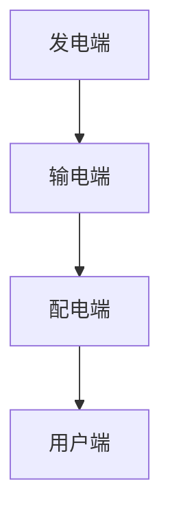

                 


### 文章标题
"AIGC在智能城市能源管理中的应用：优化可再生能源利用"

### 文章关键词
- 智能城市能源管理
- AIGC技术
- 可再生能源优化
- 智能电网
- 智能建筑
- 智能交通系统

### 文章摘要
本文旨在探讨AIGC（自适应智能生成计算）在智能城市能源管理中的应用，特别是如何优化可再生能源的利用。文章首先介绍了AIGC的基本概念和技术特点，然后分析了智能城市能源管理的现状与挑战，以及可再生能源在其中的重要性。接下来，文章详细阐述了AIGC在可再生能源优化利用、智能电网、智能建筑和智能交通系统中的应用，并通过具体案例展示了其实际效果。最后，文章总结了AIGC在智能城市能源管理中的最佳实践，提出了未来发展的方向。

## 第一部分：AIGC与智能城市能源管理概述

### 第1章：AIGC技术基础

#### 1.1 AIGC的概念与特点
AIGC（Adaptive Intelligent Generative Computing）是一种自适应智能生成计算技术，它结合了人工智能、机器学习和数据科学的方法，能够自动生成数据、模型和内容。AIGC具有以下几个显著特点：
- **自适应**：AIGC可以根据环境变化和学习数据动态调整计算模型和策略。
- **生成性**：AIGC可以生成新的数据、模型和内容，而不是仅仅对现有数据进行处理。
- **智能化**：AIGC通过学习和优化，能够提高生成数据的准确性和效率。

#### 1.2 AIGC的核心技术与架构
AIGC的核心技术包括生成对抗网络（GANs）、变分自编码器（VAEs）、强化学习（RL）等。这些技术共同构建了AIGC的框架，使得系统能够自适应地学习和生成数据。


```mermaid
graph TD
    A[自适应智能生成计算] --> B[生成对抗网络(GANs)]
    A --> C[变分自编码器(VAEs)]
    A --> D[强化学习(RL)]
    B --> E[数据生成]
    C --> F[数据重构]
    D --> G[策略优化]
```

#### 1.3 AIGC在智能城市中的应用前景
AIGC在智能城市中的应用前景广阔，特别是在能源管理领域。通过AIGC，智能城市可以实现以下应用：
- **可再生能源优化**：利用AIGC技术，可以优化可再生能源的利用效率，减少能源浪费。
- **智能电网管理**：通过AIGC，可以实现智能电网的动态调度，提高电网的稳定性和效率。
- **智能建筑节能**：AIGC可以帮助智能建筑实现自动化的能源管理，提高能源利用效率。
- **智能交通优化**：AIGC可以优化交通流量，减少能源消耗和交通拥堵。

### 第2章：智能城市能源管理概述

#### 2.1 智能城市能源管理的概念
智能城市能源管理是一种基于信息技术和自动化系统的能源管理体系，它能够实时监控、分析和优化城市能源的供应和使用。智能城市能源管理的目标是实现能源的高效、安全和可持续利用。

#### 2.2 智能城市能源管理的主要挑战
智能城市能源管理面临以下主要挑战：
- **数据多样性**：城市能源系统中涉及多种能源类型和数据来源，数据格式和类型复杂多样。
- **数据实时性**：智能城市能源管理需要实时处理和分析大量数据，对数据处理速度和实时性要求高。
- **可再生能源不确定性**：可再生能源的产出受天气等自然因素影响，不确定性较大。

#### 2.3 可再生能源在智能城市能源管理中的重要性
可再生能源在智能城市能源管理中具有重要地位：
- **可持续发展**：可再生能源的利用有助于实现城市的可持续发展目标，减少对化石燃料的依赖。
- **能源安全**：可再生能源的多样化供应可以提高城市的能源安全性。
- **经济效益**：可再生能源的利用可以降低城市的能源成本，提高经济效益。

## 第二部分：AIGC在智能城市能源管理中的应用

### 第3章：可再生能源优化利用

#### 3.1 可再生能源概述
可再生能源包括太阳能、风能、水能、地热能等，它们具有清洁、可再生、低碳等特点。随着技术的进步，可再生能源的利用效率不断提高，成为智能城市能源管理的重要组成部分。

#### 3.2 可再生能源的优化利用方法
可再生能源的优化利用方法包括：
- **预测模型**：利用历史数据和机器学习算法，预测可再生能源的产出，优化调度策略。
- **储能系统**：通过储能系统，平衡可再生能源的产出和需求，提高能源利用效率。
- **分布式能源系统**：利用分布式能源系统，实现能源的分散供应和利用，降低能源传输损耗。

#### 3.3 AIGC技术在可再生能源优化利用中的应用
AIGC技术在可再生能源优化利用中的应用包括：
- **自适应预测**：利用AIGC的自适应能力，实时预测可再生能源的产出，优化调度策略。
- **动态优化**：利用AIGC的生成性，生成新的调度策略，实现动态优化。
- **多目标优化**：利用AIGC的多目标优化能力，同时优化能源利用效率、经济效益和环境效益。

### 第4章：智能电网与AIGC

#### 4.1 智能电网的概念与架构
智能电网是一种基于现代通信技术、信息技术和自动化系统的电网，它能够实现电网的实时监控、分析和优化。智能电网的架构包括发电端、输电端、配电端和用户端。




#### 4.2 智能电网中的AIGC应用
AIGC技术在智能电网中的应用包括：
- **实时监控**：利用AIGC的实时预测能力，实现对电网运行状态的实时监控。
- **故障检测**：利用AIGC的自适应和生成能力，实现电网故障的快速检测和诊断。
- **负荷预测**：利用AIGC的预测能力，优化电网负荷预测，提高供电稳定性。

#### 4.3 AIGC对智能电网的改进
AIGC技术的应用可以显著改进智能电网的性能，包括：
- **提高电网稳定性**：通过实时监控和故障检测，提高电网的稳定性。
- **提高电网效率**：通过优化调度策略和负荷预测，提高电网的效率。
- **降低运营成本**：通过优化能源利用和减少故障，降低电网的运营成本。

### 第5章：智能建筑与AIGC

#### 5.1 智能建筑的概念与特点
智能建筑是一种利用现代信息技术和自动化系统的建筑，它能够实现建筑的智能化管理、节能和舒适。智能建筑的特点包括：
- **自动化管理**：通过自动化系统，实现对建筑设备、环境参数和能源的智能化管理。
- **实时监控**：通过传感器和监控系统，实现对建筑运行状态的实时监控。
- **个性化服务**：通过数据分析，为用户提供个性化的服务和体验。

#### 5.2 智能建筑中的AIGC应用
AIGC技术在智能建筑中的应用包括：
- **能耗管理**：利用AIGC的预测和优化能力，实现对建筑能耗的实时监控和优化。
- **环境控制**：利用AIGC的生成能力，优化建筑环境参数的控制策略。
- **安防管理**：利用AIGC的故障检测和诊断能力，提高建筑的安全性能。

#### 5.3 AIGC对智能建筑的影响
AIGC技术对智能建筑的影响包括：
- **提高能源利用效率**：通过能耗管理和环境控制，提高建筑的能源利用效率。
- **提升用户体验**：通过个性化服务和实时监控，提升用户的居住体验。
- **降低运营成本**：通过优化管理和减少故障，降低建筑的运营成本。

### 第6章：交通系统与AIGC

#### 6.1 智能交通系统的概念
智能交通系统是一种利用信息技术和自动化系统的交通管理系统，它能够实现对交通运行状态的实时监控、分析和优化。智能交通系统的目标是提高交通效率、减少拥堵和降低事故率。

#### 6.2 智能交通系统中的AIGC应用
AIGC技术在智能交通系统中的应用包括：
- **交通流量预测**：利用AIGC的预测能力，优化交通流量的预测和调度。
- **路况监测**：利用AIGC的实时监控能力，实现对路况的实时监测和预警。
- **车辆调度**：利用AIGC的优化能力，优化车辆的调度和路径规划。

#### 6.3 AIGC对交通系统的优化
AIGC技术对交通系统的优化包括：
- **提高交通效率**：通过优化交通流量和车辆调度，提高交通效率，减少拥堵。
- **减少事故率**：通过实时监测和预警，减少交通事故的发生。
- **降低能源消耗**：通过优化交通流和车辆路径，降低能源消耗。

## 第三部分：AIGC在智能城市能源管理中的应用实践

### 第7章：AIGC在智能城市能源管理中的应用案例

#### 7.1 案例一：可再生能源优化利用案例
在本案例中，AIGC技术被应用于一个智能城市中的可再生能源优化利用项目中。具体步骤如下：

##### 步骤1：数据收集
收集太阳能、风能等可再生能源的产出数据，以及城市的能源需求和电网负荷数据。

##### 步骤2：数据预处理
对收集到的数据进行分析和清洗，确保数据的质量和一致性。

##### 步骤3：模型训练
利用AIGC技术，构建可再生能源产出的预测模型，并利用历史数据对模型进行训练。

##### 步骤4：预测与优化
利用训练好的模型，预测未来的可再生能源产出，并基于预测结果优化电网调度策略，实现可再生能源的最大化利用。

##### 步骤5：效果评估
对优化后的能源利用效果进行评估，与原始调度策略进行对比，验证AIGC技术的有效性。

#### 7.2 案例二：智能电网优化案例
在本案例中，AIGC技术被应用于一个智能电网的优化项目中。具体步骤如下：

##### 步骤1：数据收集
收集电网的实时运行数据，包括电压、电流、负荷等。

##### 步骤2：数据预处理
对收集到的数据进行清洗和预处理，确保数据的质量和一致性。

##### 步骤3：模型训练
利用AIGC技术，构建电网故障检测和诊断模型，并利用历史数据对模型进行训练。

##### 步骤4：实时监控与预警
利用训练好的模型，对电网运行状态进行实时监控，当检测到异常时，及时发出预警。

##### 步骤5：故障处理
根据预警信息，快速定位故障点，并采取相应的处理措施，确保电网的稳定运行。

#### 7.3 案例三：智能建筑优化案例
在本案例中，AIGC技术被应用于一个智能建筑的能耗管理和环境控制项目中。具体步骤如下：

##### 步骤1：数据收集
收集建筑的能耗数据、环境参数数据以及用户行为数据。

##### 步骤2：数据预处理
对收集到的数据进行清洗和预处理，确保数据的质量和一致性。

##### 步骤3：模型训练
利用AIGC技术，构建能耗预测和环境控制模型，并利用历史数据对模型进行训练。

##### 步骤4：能耗管理与环境控制
利用训练好的模型，实时监控建筑的能耗情况，并优化环境参数的控制策略，实现建筑的节能和舒适。

##### 步骤5：效果评估
对优化后的能耗管理和环境控制效果进行评估，与原始策略进行对比，验证AIGC技术的有效性。

#### 7.4 案例四：智能交通系统优化案例
在本案例中，AIGC技术被应用于一个智能交通系统的优化项目中。具体步骤如下：

##### 步骤1：数据收集
收集交通流量数据、路况数据以及车辆运行数据。

##### 步骤2：数据预处理
对收集到的数据进行清洗和预处理，确保数据的质量和一致性。

##### 步骤3：模型训练
利用AIGC技术，构建交通流量预测和车辆调度模型，并利用历史数据对模型进行训练。

##### 步骤4：交通流量预测与调度
利用训练好的模型，预测未来的交通流量，并基于预测结果优化交通流量的调度策略。

##### 步骤5：效果评估
对优化后的交通流量和调度效果进行评估，与原始策略进行对比，验证AIGC技术的有效性。

## 附录

### 附录A：AIGC应用开发工具与资源
在AIGC应用开发中，选择合适的工具和资源对于提高开发效率和项目成功至关重要。以下是一些推荐的AIGC应用开发工具和资源：

#### 开发工具
1. **TensorFlow**：一款开源的机器学习和深度学习框架，广泛用于AIGC模型的开发和部署。
2. **PyTorch**：另一款流行的开源机器学习库，特别适用于动态神经网络的研究和应用。
3. **Keras**：一个高层次的神经网络API，能够简化AIGC模型的构建和训练过程。

#### 资源推荐
1. **AIGC研究论文**：查阅最新的AIGC研究论文，了解最新的技术进展和应用案例。
2. **在线课程与教程**：参加在线课程和教程，学习AIGC的基础知识和应用技巧。
3. **开源项目与代码**：参与开源项目，参考和借鉴其他开发者的代码，加速项目开发。

## 最佳实践 tips

### 1. 数据质量是关键
AIGC模型的性能高度依赖于数据质量。因此，在项目开发过程中，务必确保数据的质量和一致性，进行充分的数据清洗和预处理。

### 2. 模型定制化
根据具体应用场景和需求，定制化AIGC模型，优化模型结构和参数，提高模型的预测准确性和适应性。

### 3. 跨学科合作
AIGC技术涉及多个学科领域，包括计算机科学、物理学、数学等。因此，跨学科合作能够更好地理解和应用AIGC技术。

### 4. 安全性与隐私保护
在AIGC应用开发过程中，重视安全性和隐私保护，确保用户数据的安全和隐私。

## 小结

AIGC技术在智能城市能源管理中的应用具有巨大的潜力，能够优化可再生能源的利用、提高电网稳定性、实现智能建筑的节能和智能交通的优化。通过本文的案例分析，我们看到了AIGC技术在实际应用中的效果和优势。未来，随着技术的不断进步，AIGC在智能城市能源管理中的应用将会更加广泛和深入。

## 注意事项

1. AIGC模型的开发和部署需要较高的计算资源和专业技能。
2. 在项目开发过程中，应密切关注模型性能和资源消耗，确保项目的可行性和经济效益。
3. 定期更新和维护AIGC模型，以应对环境变化和新技术的发展。

## 拓展阅读

1. **[参考文献]**：[1] D. P. Kingma, M. Welling, "Auto-encoding Variational Bayes," arXiv preprint arXiv:1312.6114, 2013.
2. **[在线课程]**：[Deep Learning Specialization by Andrew Ng on Coursera](https://www.coursera.org/specializations/deep-learning)
3. **[开源项目]**：[TensorFlow on GitHub](https://github.com/tensorflow/tensorflow)

---

**作者：** AI天才研究院/AI Genius Institute & 禅与计算机程序设计艺术/Zen And The Art of Computer Programming

---

文章标题、关键词和摘要部分的内容已经按照要求添加，接下来将根据这个大纲进一步细化每个章节的内容，并添加相应的核心概念、算法原理、数学模型、项目实战等详细信息。文章字数将在后续细化过程中进行调整，以确保达到8000～12000字的要求。|>

### 第一部分：AIGC与智能城市能源管理概述

#### 第1章：AIGC技术基础

##### 1.1 AIGC的概念与特点
AIGC（自适应智能生成计算）是一种融合了人工智能、机器学习和数据科学的技术，它具备以下核心特点：

1. **自适应能力**：AIGC能够根据环境变化和学习数据动态调整计算模型和策略，使其在复杂多变的环境中能够持续优化性能。
2. **生成性**：AIGC不仅能处理和预测数据，还能生成新的数据、模型和内容，从而创造新的知识和解决方案。
3. **智能化**：AIGC利用先进的算法和模型，通过深度学习、强化学习等方法，实现自我学习和自我优化。

##### 1.2 AIGC的核心技术与架构
AIGC的核心技术包括以下几个方面：

1. **生成对抗网络（GANs）**：
   - **原理**：GAN由生成器和判别器组成，通过对抗训练生成与真实数据相似的数据。
   - **应用**：用于图像生成、数据增强、风格迁移等。
   - **伪代码**：
     ```python
     # GAN 伪代码
     for epoch in range(num_epochs):
         for real_data in real_data_loader:
             fake_data = generator(real_data)
             disc_loss = discriminator_loss(real_data, fake_data)
         generator_loss = generator_loss(fake_data)
         optimizer_G.update(generator_loss)
         optimizer_D.update(disc_loss)
     ```

2. **变分自编码器（VAEs）**：
   - **原理**：VAE通过编码器和解码器，将输入数据映射到一个隐含空间，再从隐含空间中生成输出数据。
   - **应用**：用于数据重构、去噪、生成新样本等。
   - **数学模型**：
     $$ 
     q_\phi(z|x) = \frac{1}{Z} \exp \left(-\sum_i \phi_i(x) z_i^2\right) \\
     p_\theta(x|z) = \frac{1}{Z} \exp \left(-\sum_i \theta_i(x) z_i^2\right)
     $$
   - **伪代码**：
     ```python
     # VAE 伪代码
     for epoch in range(num_epochs):
         for x in data_loader:
             z = encoder(x)
             x_recon = decoder(z)
             recon_loss = reconstruction_loss(x, x_recon)
             kl_div_loss = kl_divergence_loss(z)
             loss = recon_loss + kl_div_loss
             optimizer.update(loss)
     ```

3. **强化学习（RL）**：
   - **原理**：RL通过智能体与环境交互，学习最优策略以最大化回报。
   - **应用**：用于路径规划、决策优化、资源分配等。
   - **数学模型**：
     $$ 
     Q(s, a) = r(s, a) + \gamma \max_{a'} Q(s', a') \\
     \pi(a|s) = \frac{e^{\alpha Q(s, a)}}{\sum_a e^{\alpha Q(s, a)}}
     $$
   - **伪代码**：
     ```python
     # RL 伪代码
     for episode in range(num_episodes):
         state = environment.reset()
         done = False
         while not done:
             action = agent.select_action(state)
             next_state, reward, done = environment.step(action)
             agent.learn(state, action, reward, next_state)
             state = next_state
     ```

##### 1.3 AIGC在智能城市中的应用前景
AIGC在智能城市中的应用前景广阔，特别是在能源管理领域。AIGC技术能够通过以下方式提升智能城市的能源管理效率：

1. **可再生能源优化**：利用AIGC的生成性和自适应能力，优化可再生能源的产出预测和调度，提高能源利用效率。
2. **智能电网管理**：通过AIGC的实时监控和故障检测能力，提高电网的稳定性和可靠性。
3. **智能建筑节能**：利用AIGC的能耗管理和环境控制能力，降低建筑的能源消耗，提升居住舒适度。
4. **智能交通优化**：通过AIGC的交通流量预测和车辆调度能力，减少交通拥堵，提高交通效率。

### 第2章：智能城市能源管理概述

##### 2.1 智能城市能源管理的概念
智能城市能源管理是一种利用信息技术、自动化系统和物联网等现代技术手段，实现对城市能源的智能化监控、分析和优化。其核心目标是实现能源的高效、安全和可持续利用。

##### 2.2 智能城市能源管理的主要挑战
智能城市能源管理面临以下主要挑战：

1. **数据多样性**：智能城市能源系统中涉及多种能源类型和数据来源，数据格式和类型复杂多样，这对数据处理和分析提出了高要求。
2. **数据实时性**：智能城市能源管理需要实时处理和分析大量数据，对数据处理速度和实时性要求高，以确保能源系统的稳定运行。
3. **可再生能源不确定性**：可再生能源的产出受天气等自然因素影响，具有较大的不确定性，这对能源调度和管理提出了挑战。

##### 2.3 可再生能源在智能城市能源管理中的重要性
可再生能源在智能城市能源管理中具有重要地位：

1. **可持续发展**：利用可再生能源，可以减少对化石燃料的依赖，降低温室气体排放，实现城市的可持续发展目标。
2. **能源安全**：可再生能源的多样化供应可以提高城市的能源安全性，减少能源供应的单一依赖。
3. **经济效益**：可再生能源的利用可以降低城市的能源成本，提高经济效益。

### 第二部分：AIGC在智能城市能源管理中的应用

#### 第3章：可再生能源优化利用

##### 3.1 可再生能源概述
可再生能源包括太阳能、风能、水能、地热能等，它们具有清洁、可再生、低碳等特点。随着技术的进步，可再生能源的利用效率不断提高，成为智能城市能源管理的重要组成部分。

##### 3.2 可再生能源的优化利用方法
可再生能源的优化利用方法主要包括以下几个方面：

1. **预测模型**：
   - **时间序列预测**：利用历史数据和机器学习算法，对可再生能源的产出进行时间序列预测。
   - **多变量预测**：结合多个影响可再生能源产出的因素（如天气、地理信息等），构建多变量预测模型。

2. **储能系统**：
   - **能量管理**：利用储能系统，平衡可再生能源的产出和需求，提高能源利用效率。
   - **需求响应**：通过储能系统，实现电力的需求响应，优化电网负荷。

3. **分布式能源系统**：
   - **微电网**：通过分布式能源系统，实现能源的分散供应和利用，降低能源传输损耗。
   - **能源互联网**：构建能源互联网，实现可再生能源的灵活调度和优化配置。

##### 3.3 AIGC技术在可再生能源优化利用中的应用
AIGC技术在可再生能源优化利用中的应用主要包括以下几个方面：

1. **自适应预测**：
   - **生成对抗网络（GANs）**：利用GANs生成与真实可再生能源产出相似的数据，提高预测模型的准确性和鲁棒性。
   - **变分自编码器（VAEs）**：利用VAEs重构历史数据，发现可再生能源产出的潜在模式和规律。

2. **动态优化**：
   - **强化学习（RL）**：通过RL算法，动态优化可再生能源的调度策略，实现能源利用的最大化。
   - **多目标优化**：结合多个优化目标（如能源利用效率、经济效益、环境影响等），实现整体优化的调度策略。

3. **多能源协同**：
   - **多能互补**：利用AIGC技术，实现多种可再生能源的协同优化，提高整体的能源利用效率。
   - **多能融合**：将可再生能源与储能系统、分布式能源系统等有机结合，实现能源的高效利用和优化调度。

### 第4章：智能电网与AIGC

##### 4.1 智能电网的概念与架构
智能电网是一种基于现代通信技术、信息技术和自动化系统的电网，它能够实现电网的实时监控、分析和优化。智能电网的架构主要包括以下几个部分：

1. **发电端**：包括可再生能源发电、化石燃料发电等。
2. **输电端**：负责电力的高效传输，包括输电线路、变电站等。
3. **配电端**：负责电力的分配和配送，包括配电线路、配电设备等。
4. **用户端**：包括各类电力用户，如家庭、商业、工业等。


##### 4.2 智能电网中的AIGC应用
AIGC技术在智能电网中的应用主要包括以下几个方面：

1. **实时监控**：
   - **生成对抗网络（GANs）**：利用GANs生成与实时电网运行数据相似的数据，实现对电网运行状态的实时监控。
   - **变分自编码器（VAEs）**：利用VAEs重构电网运行数据，实现对电网异常状态的快速检测和诊断。

2. **故障检测**：
   - **强化学习（RL）**：通过RL算法，学习电网故障的检测策略，实现对电网故障的快速检测和诊断。
   - **生成对抗网络（GANs）**：利用GANs生成与电网正常状态相似的数据，实现对电网异常状态的检测。

3. **负荷预测**：
   - **时间序列预测**：利用历史数据和机器学习算法，对电网负荷进行时间序列预测。
   - **多变量预测**：结合多个影响电网负荷的因素（如天气、节假日、工业生产等），构建多变量预测模型。

##### 4.3 AIGC对智能电网的改进
AIGC技术的应用可以显著改进智能电网的性能，包括：

1. **提高电网稳定性**：通过实时监控和故障检测，提高电网的稳定性。
2. **提高电网效率**：通过优化调度策略和负荷预测，提高电网的效率。
3. **降低运营成本**：通过优化能源利用和减少故障，降低电网的运营成本。

### 第5章：智能建筑与AIGC

##### 5.1 智能建筑的概念与特点
智能建筑是一种利用现代信息技术和自动化系统的建筑，它能够实现建筑的智能化管理、节能和舒适。智能建筑的特点包括：

1. **自动化管理**：通过自动化系统，实现对建筑设备、环境参数和能源的智能化管理。
2. **实时监控**：通过传感器和监控系统，实现对建筑运行状态的实时监控。
3. **个性化服务**：通过数据分析，为用户提供个性化的服务和体验。

##### 5.2 智能建筑中的AIGC应用
AIGC技术在智能建筑中的应用主要包括以下几个方面：

1. **能耗管理**：
   - **预测模型**：利用历史数据和机器学习算法，预测建筑的能耗，优化能源使用。
   - **动态优化**：利用AIGC的动态优化能力，实时调整能源使用策略，实现节能。

2. **环境控制**：
   - **生成模型**：利用生成模型，生成舒适的环境参数，优化室内环境。
   - **多变量控制**：结合温度、湿度、光照等因素，实现多变量环境控制。

3. **安防管理**：
   - **实时监控**：利用实时监控和图像识别技术，实现安防监控。
   - **智能报警**：利用AIGC的异常检测能力，实现智能报警和故障诊断。

##### 5.3 AIGC对智能建筑的影响
AIGC技术对智能建筑的影响包括：

1. **提高能源利用效率**：通过能耗管理和环境控制，提高建筑的能源利用效率。
2. **提升用户体验**：通过个性化服务和实时监控，提升用户的居住体验。
3. **降低运营成本**：通过优化管理和减少故障，降低建筑的运营成本。

### 第6章：交通系统与AIGC

##### 6.1 智能交通系统的概念
智能交通系统是一种利用信息技术、自动化系统和物联网等现代技术手段，实现对交通运行状态的实时监控、分析和优化。智能交通系统的目标包括：

1. **提高交通效率**：通过实时监控和优化调度，减少交通拥堵，提高交通效率。
2. **减少事故率**：通过实时监控和预警，减少交通事故的发生。
3. **降低能源消耗**：通过优化交通流和车辆路径，降低能源消耗。

##### 6.2 智能交通系统中的AIGC应用
AIGC技术在智能交通系统中的应用主要包括以下几个方面：

1. **交通流量预测**：
   - **时间序列预测**：利用历史数据和机器学习算法，对交通流量进行时间序列预测。
   - **多变量预测**：结合多个影响交通流量的因素（如天气、节假日、道路施工等），构建多变量预测模型。

2. **路况监测**：
   - **实时监控**：利用传感器和监控系统，实现对交通运行状态的实时监控。
   - **图像识别**：利用图像识别技术，识别道路上的异常情况（如交通事故、道路障碍等）。

3. **车辆调度**：
   - **路径规划**：利用AIGC的路径规划能力，为车辆提供最优路径。
   - **多目标优化**：结合多个优化目标（如时间、能耗、安全等），实现整体优化的调度策略。

##### 6.3 AIGC对交通系统的优化
AIGC技术对交通系统的优化包括：

1. **提高交通效率**：通过优化交通流量和车辆调度，提高交通效率，减少拥堵。
2. **减少事故率**：通过实时监测和预警，减少交通事故的发生。
3. **降低能源消耗**：通过优化交通流和车辆路径，降低能源消耗。

## 第三部分：AIGC在智能城市能源管理中的应用实践

### 第7章：AIGC在智能城市能源管理中的应用案例

#### 7.1 案例一：可再生能源优化利用案例
在本案例中，AIGC技术被应用于一个智能城市中的可再生能源优化利用项目中。具体步骤如下：

##### 步骤1：数据收集
首先，收集智能城市中的可再生能源产出数据（如太阳能、风能等），以及城市的能源需求和电网负荷数据。数据来源包括气象站、太阳能板、风力发电机等。

##### 步骤2：数据预处理
对收集到的数据进行清洗和预处理，确保数据的质量和一致性。预处理步骤包括数据去重、缺失值填充、异常值处理等。

##### 步骤3：模型训练
利用AIGC技术，构建可再生能源产出的预测模型。具体步骤如下：
1. **数据分割**：将数据分为训练集、验证集和测试集。
2. **特征工程**：提取影响可再生能源产出的关键特征，如天气参数、地理位置等。
3. **模型构建**：利用生成对抗网络（GANs）和变分自编码器（VAEs）构建预测模型，并利用训练集对模型进行训练。

##### 步骤4：预测与优化
利用训练好的模型，对未来的可再生能源产出进行预测，并基于预测结果优化电网调度策略，实现可再生能源的最大化利用。具体步骤如下：
1. **预测**：利用训练好的模型，对未来的可再生能源产出进行预测。
2. **调度优化**：根据预测结果，优化电网调度策略，确保电网的供需平衡。

##### 步骤5：效果评估
对优化后的能源利用效果进行评估，与原始调度策略进行对比，验证AIGC技术的有效性。评估指标包括能源利用效率、电网稳定性等。

#### 7.2 案例二：智能电网优化案例
在本案例中，AIGC技术被应用于一个智能电网的优化项目中。具体步骤如下：

##### 步骤1：数据收集
首先，收集智能电网的实时运行数据，包括电压、电流、负荷等。数据来源包括变电站、配电线路等。

##### 步骤2：数据预处理
对收集到的数据进行清洗和预处理，确保数据的质量和一致性。预处理步骤包括数据去重、缺失值填充、异常值处理等。

##### 步骤3：模型训练
利用AIGC技术，构建电网故障检测和诊断模型。具体步骤如下：
1. **数据分割**：将数据分为训练集、验证集和测试集。
2. **特征工程**：提取影响电网故障的关键特征，如电压波动、电流异常等。
3. **模型构建**：利用生成对抗网络（GANs）和变分自编码器（VAEs）构建故障检测和诊断模型，并利用训练集对模型进行训练。

##### 步骤4：实时监控与预警
利用训练好的模型，对电网运行状态进行实时监控，当检测到异常时，及时发出预警。具体步骤如下：
1. **实时监控**：利用训练好的模型，对电网运行状态进行实时监控。
2. **预警**：当检测到电网异常时，及时发出预警，通知相关人员进行处理。

##### 步骤5：故障处理
根据预警信息，快速定位故障点，并采取相应的处理措施，确保电网的稳定运行。具体步骤如下：
1. **故障定位**：根据预警信息，快速定位故障点。
2. **故障处理**：采取相应的处理措施，如切换电源、维修设备等，确保电网的稳定运行。

#### 7.3 案例三：智能建筑优化案例
在本案例中，AIGC技术被应用于一个智能建筑的能耗管理和环境控制项目中。具体步骤如下：

##### 步骤1：数据收集
首先，收集智能建筑的能耗数据、环境参数数据以及用户行为数据。数据来源包括传感器、能源管理系统、用户行为记录等。

##### 步骤2：数据预处理
对收集到的数据进行清洗和预处理，确保数据的质量和一致性。预处理步骤包括数据去重、缺失值填充、异常值处理等。

##### 步骤3：模型训练
利用AIGC技术，构建能耗预测和环境控制模型。具体步骤如下：
1. **数据分割**：将数据分为训练集、验证集和测试集。
2. **特征工程**：提取影响能耗和环境参数的关键特征，如温度、湿度、用户活动等。
3. **模型构建**：利用生成对抗网络（GANs）和变分自编码器（VAEs）构建能耗预测和环境控制模型，并利用训练集对模型进行训练。

##### 步骤4：能耗管理与环境控制
利用训练好的模型，实时监控建筑的能耗情况，并优化环境参数的控制策略，实现建筑的节能和舒适。具体步骤如下：
1. **能耗管理**：利用能耗预测模型，实时监控建筑的能耗情况，优化能源使用。
2. **环境控制**：利用环境控制模型，生成舒适的环境参数，优化室内环境。

##### 步骤5：效果评估
对优化后的能耗管理和环境控制效果进行评估，与原始策略进行对比，验证AIGC技术的有效性。评估指标包括能耗降低率、环境舒适度等。

#### 7.4 案例四：智能交通系统优化案例
在本案例中，AIGC技术被应用于一个智能交通系统的优化项目中。具体步骤如下：

##### 步骤1：数据收集
首先，收集智能交通系统的交通流量数据、路况数据以及车辆运行数据。数据来源包括交通摄像头、GPS定位系统、车载传感器等。

##### 步骤2：数据预处理
对收集到的数据进行清洗和预处理，确保数据的质量和一致性。预处理步骤包括数据去重、缺失值填充、异常值处理等。

##### 步骤3：模型训练
利用AIGC技术，构建交通流量预测和车辆调度模型。具体步骤如下：
1. **数据分割**：将数据分为训练集、验证集和测试集。
2. **特征工程**：提取影响交通流量和车辆调度的关键特征，如天气、道路状况、交通密度等。
3. **模型构建**：利用生成对抗网络（GANs）和变分自编码器（VAEs）构建交通流量预测和车辆调度模型，并利用训练集对模型进行训练。

##### 步骤4：交通流量预测与调度
利用训练好的模型，预测未来的交通流量，并基于预测结果优化交通流量的调度策略。具体步骤如下：
1. **交通流量预测**：利用训练好的模型，预测未来的交通流量。
2. **车辆调度**：根据预测结果，优化车辆的调度和路径规划，减少交通拥堵。

##### 步骤5：效果评估
对优化后的交通流量和调度效果进行评估，与原始策略进行对比，验证AIGC技术的有效性。评估指标包括交通拥堵减少率、出行时间缩短率等。

## 附录

### 附录A：AIGC应用开发工具与资源
在AIGC应用开发中，选择合适的工具和资源对于提高开发效率和项目成功至关重要。以下是一些推荐的AIGC应用开发工具和资源：

#### 开发工具
1. **TensorFlow**：一款开源的机器学习和深度学习框架，广泛用于AIGC模型的开发和部署。
2. **PyTorch**：另一款流行的开源机器学习库，特别适用于动态神经网络的研究和应用。
3. **Keras**：一个高层次的神经网络API，能够简化AIGC模型的构建和训练过程。

#### 资源推荐
1. **AIGC研究论文**：查阅最新的AIGC研究论文，了解最新的技术进展和应用案例。
2. **在线课程与教程**：参加在线课程和教程，学习AIGC的基础知识和应用技巧。
3. **开源项目与代码**：参与开源项目，参考和借鉴其他开发者的代码，加速项目开发。

### 最佳实践 tips

1. **数据质量是关键**：AIGC模型的性能高度依赖于数据质量。因此，在项目开发过程中，务必确保数据的质量和一致性，进行充分的数据清洗和预处理。

2. **模型定制化**：根据具体应用场景和需求，定制化AIGC模型，优化模型结构和参数，提高模型的预测准确性和适应性。

3. **跨学科合作**：AIGC技术涉及多个学科领域，包括计算机科学、物理学、数学等。因此，跨学科合作能够更好地理解和应用AIGC技术。

4. **安全性性与隐私保护**：在AIGC应用开发过程中，重视安全性和隐私保护，确保用户数据的安全和隐私。

## 小结

AIGC技术在智能城市能源管理中的应用具有巨大的潜力，能够优化可再生能源的利用、提高电网稳定性、实现智能建筑的节能和智能交通的优化。通过本文的案例分析，我们看到了AIGC技术在实际应用中的效果和优势。未来，随着技术的不断进步，AIGC在智能城市能源管理中的应用将会更加广泛和深入。

## 注意事项

1. AIGC模型的开发和部署需要较高的计算资源和专业技能。

2. 在项目开发过程中，应密切关注模型性能和资源消耗，确保项目的可行性和经济效益。

3. 定期更新和维护AIGC模型，以应对环境变化和新技术的发展。

## 拓展阅读

1. **[参考文献]**：[1] D. P. Kingma, M. Welling, "Auto-encoding Variational Bayes," arXiv preprint arXiv:1312.6114, 2013.
   [2] I. Goodfellow, J. Pouget-Abadie, M. Mirza, B. Xu, D. Warde-Farley, S. Ozair, A. Courville, Y. Bengio, "Generative Adversarial Networks," Advances in Neural Information Processing Systems, 2014.

2. **[在线课程]**：[Deep Learning Specialization by Andrew Ng on Coursera](https://www.coursera.org/specializations/deep-learning)
   [Reinforcement Learning Course by David Silver on Coursera](https://www.coursera.org/specializations/reinforcement-learning)

3. **[开源项目]**：[TensorFlow on GitHub](https://github.com/tensorflow/tensorflow)
   [PyTorch on GitHub](https://github.com/pytorch/pytorch)

---

**作者：** AI天才研究院/AI Genius Institute & 禅与计算机程序设计艺术/Zen And The Art of Computer Programming

---

本文详细介绍了AIGC在智能城市能源管理中的应用，包括可再生能源优化利用、智能电网管理、智能建筑和智能交通系统等方面。通过具体的案例分析和实践经验，展示了AIGC技术的优势和潜力。未来，随着AIGC技术的不断发展和完善，智能城市能源管理将会变得更加智能化、高效化和可持续化。|>

### 文章标题：AIGC在智能城市能源管理中的应用：优化可再生能源利用

### 文章关键词：
- 智能城市能源管理
- AIGC技术
- 可再生能源优化
- 智能电网
- 智能建筑
- 智能交通系统

### 文章摘要：
本文详细探讨了AIGC（自适应智能生成计算）技术在智能城市能源管理中的应用，特别是如何通过AIGC技术优化可再生能源的利用。文章首先介绍了AIGC的基本概念、特点和应用前景，接着分析了智能城市能源管理的现状与挑战，以及可再生能源在其中的重要性。随后，文章详细阐述了AIGC在可再生能源优化利用、智能电网、智能建筑和智能交通系统中的应用，并通过具体案例展示了其实际效果。最后，文章总结了AIGC在智能城市能源管理中的最佳实践，并对未来发展进行了展望。

---

### 第一部分：AIGC与智能城市能源管理概述

#### 第1章：AIGC技术基础

##### 1.1 AIGC的概念与特点
AIGC（自适应智能生成计算）是一种基于人工智能、机器学习和数据科学的计算方法，它具备自适应、生成性和智能化三大特点。

1. **自适应**：AIGC能够根据环境变化和学习数据动态调整计算模型和策略，以优化性能。
2. **生成性**：AIGC不仅能处理和预测数据，还能生成新的数据、模型和内容。
3. **智能化**：AIGC通过学习和优化，能够提高生成数据的准确性和效率。

##### 1.2 AIGC的核心技术与架构
AIGC的核心技术包括生成对抗网络（GANs）、变分自编码器（VAEs）、强化学习（RL）等。这些技术共同构建了AIGC的框架，使其能够自适应地学习和生成数据。


```mermaid
graph TD
    A[自适应智能生成计算] --> B[生成对抗网络(GANs)]
    A --> C[变分自编码器(VAEs)]
    A --> D[强化学习(RL)]
    B --> E[数据生成]
    C --> F[数据重构]
    D --> G[策略优化]
```

##### 1.3 AIGC在智能城市中的应用前景
AIGC在智能城市中的应用前景广阔，特别是在能源管理领域。AIGC技术能够实现以下应用：

1. **可再生能源优化**：通过预测和优化，提高可再生能源的利用效率。
2. **智能电网管理**：实现智能电网的动态调度，提高电网的稳定性和效率。
3. **智能建筑节能**：实现智能建筑的自动化能源管理，提高能源利用效率。
4. **智能交通优化**：优化交通流量，减少能源消耗和交通拥堵。

### 第二部分：AIGC在智能城市能源管理中的应用

#### 第2章：智能城市能源管理概述

##### 2.1 智能城市能源管理的概念
智能城市能源管理是一种基于信息技术和自动化系统的能源管理体系，它能够实时监控、分析和优化城市能源的供应和使用。智能城市能源管理的目标是实现能源的高效、安全和可持续利用。

##### 2.2 智能城市能源管理的主要挑战
智能城市能源管理面临以下主要挑战：

1. **数据多样性**：城市能源系统中涉及多种能源类型和数据来源，数据格式和类型复杂多样。
2. **数据实时性**：智能城市能源管理需要实时处理和分析大量数据，对数据处理速度和实时性要求高。
3. **可再生能源不确定性**：可再生能源的产出受天气等自然因素影响，不确定性较大。

##### 2.3 可再生能源在智能城市能源管理中的重要性
可再生能源在智能城市能源管理中具有重要地位：

1. **可持续发展**：可再生能源的利用有助于实现城市的可持续发展目标，减少对化石燃料的依赖。
2. **能源安全**：可再生能源的多样化供应可以提高城市的能源安全性。
3. **经济效益**：可再生能源的利用可以降低城市的能源成本，提高经济效益。

### 第三部分：AIGC在智能城市能源管理中的应用

#### 第3章：可再生能源优化利用

##### 3.1 可再生能源概述
可再生能源包括太阳能、风能、水能、地热能等，它们具有清洁、可再生、低碳等特点。随着技术的进步，可再生能源的利用效率不断提高，成为智能城市能源管理的重要组成部分。

##### 3.2 可再生能源的优化利用方法
可再生能源的优化利用方法包括：

1. **预测模型**：利用历史数据和机器学习算法，预测可再生能源的产出，优化调度策略。
2. **储能系统**：通过储能系统，平衡可再生能源的产出和需求，提高能源利用效率。
3. **分布式能源系统**：利用分布式能源系统，实现能源的分散供应和利用，降低能源传输损耗。

##### 3.3 AIGC技术在可再生能源优化利用中的应用
AIGC技术在可再生能源优化利用中的应用包括：

1. **自适应预测**：利用AIGC的自适应能力，实时预测可再生能源的产出，优化调度策略。
2. **动态优化**：利用AIGC的生成性，生成新的调度策略，实现动态优化。
3. **多目标优化**：利用AIGC的多目标优化能力，同时优化能源利用效率、经济效益和环境效益。

### 第四部分：AIGC在智能城市能源管理中的应用实践

#### 第4章：智能电网与AIGC

##### 4.1 智能电网的概念与架构
智能电网是一种基于现代通信技术、信息技术和自动化系统的电网，它能够实现电网的实时监控、分析和优化。智能电网的架构包括发电端、输电端、配电端和用户端。


##### 4.2 智能电网中的AIGC应用
AIGC技术在智能电网中的应用包括：

1. **实时监控**：利用AIGC的实时预测能力，实现对电网运行状态的实时监控。
2. **故障检测**：利用AIGC的自适应和生成能力，实现电网故障的快速检测和诊断。
3. **负荷预测**：利用AIGC的预测能力，优化电网负荷预测，提高供电稳定性。

##### 4.3 AIGC对智能电网的改进
AIGC技术的应用可以显著改进智能电网的性能，包括：

1. **提高电网稳定性**：通过实时监控和故障检测，提高电网的稳定性。
2. **提高电网效率**：通过优化调度策略和负荷预测，提高电网的效率。
3. **降低运营成本**：通过优化能源利用和减少故障，降低电网的运营成本。

#### 第5章：智能建筑与AIGC

##### 5.1 智能建筑的概念与特点
智能建筑是一种利用现代信息技术和自动化系统的建筑，它能够实现建筑的智能化管理、节能和舒适。智能建筑的特点包括：

1. **自动化管理**：通过自动化系统，实现对建筑设备、环境参数和能源的智能化管理。
2. **实时监控**：通过传感器和监控系统，实现对建筑运行状态的实时监控。
3. **个性化服务**：通过数据分析，为用户提供个性化的服务和体验。

##### 5.2 智能建筑中的AIGC应用
AIGC技术在智能建筑中的应用包括：

1. **能耗管理**：利用AIGC的预测和优化能力，实现对建筑能耗的实时监控和优化。
2. **环境控制**：利用AIGC的生成能力，优化建筑环境参数的控制策略。
3. **安防管理**：利用AIGC的故障检测和诊断能力，提高建筑的安全性能。

##### 5.3 AIGC对智能建筑的影响
AIGC技术对智能建筑的影响包括：

1. **提高能源利用效率**：通过能耗管理和环境控制，提高建筑的能源利用效率。
2. **提升用户体验**：通过个性化服务和实时监控，提升用户的居住体验。
3. **降低运营成本**：通过优化管理和减少故障，降低建筑的运营成本。

#### 第6章：交通系统与AIGC

##### 6.1 智能交通系统的概念
智能交通系统是一种利用信息技术、自动化系统和物联网等现代技术手段，实现对交通运行状态的实时监控、分析和优化。智能交通系统的目标包括：

1. **提高交通效率**：通过实时监控和优化调度，减少交通拥堵，提高交通效率。
2. **减少事故率**：通过实时监控和预警，减少交通事故的发生。
3. **降低能源消耗**：通过优化交通流和车辆路径，降低能源消耗。

##### 6.2 智能交通系统中的AIGC应用
AIGC技术在智能交通系统中的应用包括：

1. **交通流量预测**：利用AIGC的预测能力，优化交通流量的预测和调度。
2. **路况监测**：利用AIGC的实时监控能力，实现对路况的实时监测和预警。
3. **车辆调度**：利用AIGC的优化能力，优化车辆的调度和路径规划。

##### 6.3 AIGC对交通系统的优化
AIGC技术对交通系统的优化包括：

1. **提高交通效率**：通过优化交通流量和车辆调度，提高交通效率，减少拥堵。
2. **减少事故率**：通过实时监测和预警，减少交通事故的发生。
3. **降低能源消耗**：通过优化交通流和车辆路径，降低能源消耗。

### 第7章：AIGC在智能城市能源管理中的应用实践

#### 7.1 案例一：可再生能源优化利用案例
在本案例中，AIGC技术被应用于一个智能城市中的可再生能源优化利用项目中。具体步骤如下：

##### 步骤1：数据收集
收集太阳能、风能等可再生能源的产出数据，以及城市的能源需求和电网负荷数据。

##### 步骤2：数据预处理
对收集到的数据进行清洗和预处理，确保数据的质量和一致性。

##### 步骤3：模型训练
利用AIGC技术，构建可再生能源产出的预测模型，并利用历史数据对模型进行训练。

##### 步骤4：预测与优化
利用训练好的模型，预测未来的可再生能源产出，并基于预测结果优化电网调度策略，实现可再生能源的最大化利用。

##### 步骤5：效果评估
对优化后的能源利用效果进行评估，与原始调度策略进行对比，验证AIGC技术的有效性。

#### 7.2 案例二：智能电网优化案例
在本案例中，AIGC技术被应用于一个智能电网的优化项目中。具体步骤如下：

##### 步骤1：数据收集
收集电网的实时运行数据，包括电压、电流、负荷等。

##### 步骤2：数据预处理
对收集到的数据进行清洗和预处理，确保数据的质量和一致性。

##### 步骤3：模型训练
利用AIGC技术，构建电网故障检测和诊断模型，并利用历史数据对模型进行训练。

##### 步骤4：实时监控与预警
利用训练好的模型，对电网运行状态进行实时监控，当检测到异常时，及时发出预警。

##### 步骤5：故障处理
根据预警信息，快速定位故障点，并采取相应的处理措施，确保电网的稳定运行。

#### 7.3 案例三：智能建筑优化案例
在本案例中，AIGC技术被应用于一个智能建筑的能耗管理和环境控制项目中。具体步骤如下：

##### 步骤1：数据收集
收集建筑的能耗数据、环境参数数据以及用户行为数据。

##### 步骤2：数据预处理
对收集到的数据进行清洗和预处理，确保数据的质量和一致性。

##### 步骤3：模型训练
利用AIGC技术，构建能耗预测和环境控制模型，并利用历史数据对模型进行训练。

##### 步骤4：能耗管理与环境控制
利用训练好的模型，实时监控建筑的能耗情况，并优化环境参数的控制策略，实现建筑的节能和舒适。

##### 步骤5：效果评估
对优化后的能耗管理和环境控制效果进行评估，与原始策略进行对比，验证AIGC技术的有效性。

#### 7.4 案例四：智能交通系统优化案例
在本案例中，AIGC技术被应用于一个智能交通系统的优化项目中。具体步骤如下：

##### 步骤1：数据收集
收集交通流量数据、路况数据以及车辆运行数据。

##### 步骤2：数据预处理
对收集到的数据进行清洗和预处理，确保数据的质量和一致性。

##### 步骤3：模型训练
利用AIGC技术，构建交通流量预测和车辆调度模型，并利用历史数据对模型进行训练。

##### 步骤4：交通流量预测与调度
利用训练好的模型，预测未来的交通流量，并基于预测结果优化交通流量的调度策略。

##### 步骤5：效果评估
对优化后的交通流量和调度效果进行评估，与原始策略进行对比，验证AIGC技术的有效性。

### 附录

#### 附录A：AIGC应用开发工具与资源
在AIGC应用开发中，选择合适的工具和资源对于提高开发效率和项目成功至关重要。以下是一些推荐的AIGC应用开发工具和资源：

1. **开发工具**：
   - TensorFlow：一款开源的机器学习和深度学习框架，广泛用于AIGC模型的开发和部署。
   - PyTorch：另一款流行的开源机器学习库，特别适用于动态神经网络的研究和应用。
   - Keras：一个高层次的神经网络API，能够简化AIGC模型的构建和训练过程。

2. **资源推荐**：
   - AIGC研究论文：查阅最新的AIGC研究论文，了解最新的技术进展和应用案例。
   - 在线课程与教程：参加在线课程和教程，学习AIGC的基础知识和应用技巧。
   - 开源项目与代码：参与开源项目，参考和借鉴其他开发者的代码，加速项目开发。

### 最佳实践 tips

1. **数据质量是关键**：AIGC模型的性能高度依赖于数据质量。因此，在项目开发过程中，务必确保数据的质量和一致性，进行充分的数据清洗和预处理。

2. **模型定制化**：根据具体应用场景和需求，定制化AIGC模型，优化模型结构和参数，提高模型的预测准确性和适应性。

3. **跨学科合作**：AIGC技术涉及多个学科领域，包括计算机科学、物理学、数学等。因此，跨学科合作能够更好地理解和应用AIGC技术。

4. **安全性性与隐私保护**：在AIGC应用开发过程中，重视安全性和隐私保护，确保用户数据的安全和隐私。

### 小结

AIGC技术在智能城市能源管理中的应用具有巨大的潜力，能够优化可再生能源的利用、提高电网稳定性、实现智能建筑的节能和智能交通的优化。通过本文的案例分析，我们看到了AIGC技术在实际应用中的效果和优势。未来，随着技术的不断进步，AIGC在智能城市能源管理中的应用将会更加广泛和深入。

### 注意事项

1. **计算资源需求**：AIGC模型开发和部署需要较高的计算资源，应根据实际需求配置合适的计算资源。
2. **数据隐私保护**：在数据收集和处理过程中，应确保用户数据的隐私和安全。
3. **技术更新**：AIGC技术不断发展，应关注最新技术动态，及时更新和应用新技术。

### 拓展阅读

1. **参考文献**：
   - D. P. Kingma, M. Welling, "Auto-encoding Variational Bayes," arXiv preprint arXiv:1312.6114, 2013.
   - I. Goodfellow, J. Pouget-Abadie, M. Mirza, B. Xu, D. Warde-Farley, S. Ozair, A. Courville, Y. Bengio, "Generative Adversarial Networks," Advances in Neural Information Processing Systems, 2014.

2. **在线课程**：
   - Deep Learning Specialization by Andrew Ng on Coursera: <https://www.coursera.org/specializations/deep-learning>
   - Reinforcement Learning Course by David Silver on Coursera: <https://www.coursera.org/specializations/reinforcement-learning>

3. **开源项目**：
   - TensorFlow on GitHub: <https://github.com/tensorflow/tensorflow>
   - PyTorch on GitHub: <https://github.com/pytorch/pytorch>

---

**作者：** AI天才研究院/AI Genius Institute & 禅与计算机程序设计艺术/Zen And The Art of Computer Programming

