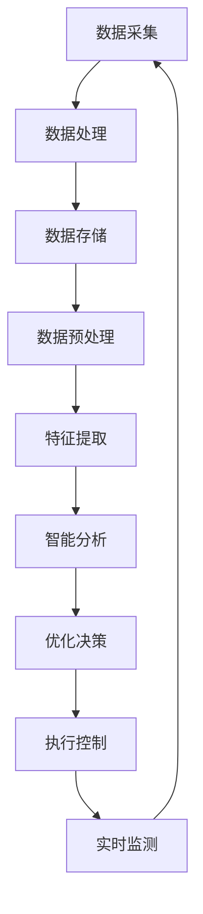

                 

### 文章标题

《AIGC在智能城市能源网络优化中的应用：实现城市能源自给自足》

### 文章关键词

- 智能城市
- 能源网络优化
- AIGC技术
- 自给自足
- 智能电网

### 文章摘要

本文深入探讨了AIGC（自适应智能生成控制）技术在智能城市能源网络优化中的应用。随着城市化进程的加快，城市能源需求不断增长，能源网络的复杂性和不确定性也日益增加。为了实现城市能源的自给自足，本文首先介绍了智能城市能源网络的背景和挑战，然后详细阐述了AIGC技术的核心概念和原理。通过案例分析和项目实战，本文展示了AIGC技术在智能城市能源网络优化中的实际应用效果，为未来智能城市能源网络的发展提供了新的思路和方法。

----------------------------------------------------------------

## 引言

### 智能城市能源网络的背景

随着全球城市化进程的加速，智能城市已成为未来发展的重要趋势。智能城市通过应用先进的信息技术，实现了城市管理的智能化、高效化和可持续发展。能源网络作为智能城市的重要组成部分，其优化和管理显得尤为重要。传统的能源网络由于缺乏实时监测和智能调控，经常面临能源浪费、供需不平衡等问题，无法满足城市日益增长的能源需求。

智能城市能源网络是指利用现代信息技术和智能控制技术，实现能源的智能采集、传输、分配和消费的网络系统。它包括多个子系统和组件，如智能电网、智能燃气网、智能热力网等。这些系统通过相互连接和协同工作，形成一个高度整合的能源网络，实现能源的高效利用和可持续发展。

### 智能城市能源网络的挑战

尽管智能城市能源网络具有巨大的潜力，但其发展也面临着诸多挑战。首先，能源网络的复杂性和不确定性不断增加。城市能源网络由多种能源类型组成，如电力、燃气、热力等，这些能源之间的耦合关系复杂，且受到多种因素的影响，如气候变化、用户行为等。

其次，能源网络的智能化程度不高。虽然目前已有一些智能设备应用于能源网络，但缺乏统一的数据平台和智能控制体系，导致能源网络的整体智能化水平较低。

此外，能源网络的优化和管理难度较大。随着城市能源需求的不断增长，如何合理分配能源资源，优化能源网络运行，实现能源的自给自足成为一大难题。

### AIGC技术在智能城市能源网络优化中的重要性

AIGC（自适应智能生成控制）技术是一种结合了人工智能和生成控制理论的先进技术，能够通过实时监测、自适应调整和优化控制，实现能源网络的智能优化。AIGC技术在智能城市能源网络优化中的应用具有以下重要性：

首先，AIGC技术能够实现对能源网络的实时监测和预测。通过引入传感器和数据采集技术，AIGC系统能够实时获取能源网络的运行状态数据，进行数据分析和预测，为能源网络优化提供基础。

其次，AIGC技术能够实现能源网络的智能调控。通过对能源网络的运行状态进行实时监测和分析，AIGC系统能够自适应调整能源网络的运行策略，优化能源分配和传输，提高能源利用效率。

最后，AIGC技术能够实现能源网络的自给自足。通过优化能源网络运行，实现能源的节约和回收，AIGC技术能够帮助智能城市实现能源的自给自足，降低对传统能源的依赖，促进可持续发展。

综上所述，AIGC技术在智能城市能源网络优化中的应用具有重要的理论和实践意义。本文将围绕AIGC技术在智能城市能源网络优化中的应用，进行详细的分析和探讨。

----------------------------------------------------------------

## AIGC技术基础

### AIGC技术的基本概念

AIGC（Adaptive Intelligent Generation Control，自适应智能生成控制）技术是一种融合了人工智能和生成控制理论的先进技术。它旨在通过对能源网络的实时监测和自适应调控，实现能源网络的优化运行。AIGC技术的主要目标包括以下几个方面：

1. **实时监测**：通过部署传感器和数据采集设备，实现对能源网络运行状态的实时监测，获取温度、压力、流量等关键参数。

2. **自适应调控**：基于监测到的数据，AIGC系统能够实时分析能源网络的运行状态，并自适应调整运行策略，以优化能源的分配和传输。

3. **能源优化**：通过智能分析算法，AIGC技术能够识别能源网络的瓶颈和潜在问题，提出优化方案，提高能源利用效率。

4. **自给自足**：AIGC技术能够实现能源的节约和回收，通过优化能源网络运行，实现能源的自给自足，减少对传统能源的依赖。

### AIGC技术的核心概念与联系

AIGC技术的核心概念包括以下几个方面，它们相互联系，共同构成了AIGC技术的理论基础：

1. **生成控制理论**：生成控制理论是一种基于反馈控制和自适应控制的理论体系，用于优化系统的运行状态。在AIGC技术中，生成控制理论为能源网络的实时监测和自适应调控提供了基础。

2. **人工智能**：人工智能是AIGC技术的核心组成部分，它通过机器学习和深度学习算法，对海量数据进行处理和分析，实现对能源网络的智能优化。

3. **传感器网络**：传感器网络是AIGC技术的重要组成部分，它用于实时监测能源网络的运行状态，为智能调控提供数据支持。

4. **数据采集与处理**：数据采集与处理是AIGC技术的重要环节，通过对传感器数据的采集和处理，提取出关键参数和特征，为智能调控提供基础。

5. **优化算法**：优化算法是AIGC技术的核心，通过优化算法，AIGC系统能够实时分析能源网络的运行状态，并提出优化方案。

### AIGC技术的应用场景

AIGC技术在智能城市能源网络优化中的应用场景非常广泛，主要包括以下几个方面：

1. **能源供需预测**：通过分析历史数据和实时数据，AIGC技术能够预测能源的供需情况，为能源调度提供依据。

2. **能源系统优化**：AIGC技术能够对能源系统进行实时监测和优化，提高能源利用效率，减少能源浪费。

3. **能源设备状态监测**：AIGC技术能够对能源设备进行实时监测，预测设备故障，提前进行维护和保养。

4. **能源网络自给自足**：通过优化能源网络运行，实现能源的节约和回收，AIGC技术能够帮助智能城市实现能源的自给自足。

### AIGC技术的架构设计

AIGC技术的架构设计主要包括以下几个部分：

1. **数据采集层**：负责采集能源网络的实时数据，如温度、压力、流量等。

2. **数据处理层**：负责对采集到的数据进行处理和清洗，提取出关键参数和特征。

3. **分析决策层**：负责对处理后的数据进行智能分析，提出优化方案。

4. **执行控制层**：负责根据优化方案，对能源网络进行实时调控。

### AIGC技术在智能城市能源网络优化中的应用优势

AIGC技术在智能城市能源网络优化中的应用具有以下优势：

1. **实时性**：AIGC技术能够实时监测能源网络的运行状态，快速响应变化。

2. **智能性**：通过人工智能算法，AIGC技术能够智能分析数据，提出优化方案。

3. **高效性**：AIGC技术能够优化能源网络的运行，提高能源利用效率。

4. **自给自足**：通过优化能源网络运行，实现能源的节约和回收，实现城市能源自给自足。

综上所述，AIGC技术作为一种先进的技术手段，在智能城市能源网络优化中具有广泛的应用前景。通过本文的阐述，读者可以初步了解AIGC技术的基本概念、核心原理和应用场景，为后续的深入研究和应用打下基础。

### AIGC技术的核心概念原理架构 Mermaid 流程图

下面是一个简化的AIGC技术核心概念原理架构的Mermaid流程图：



在这个流程图中，数据采集层（A）通过传感器收集能源网络的实时数据，数据处理层（B）负责对数据进行初步处理和存储（C），数据预处理层（D）负责清洗和标准化数据，特征提取层（E）从预处理后的数据中提取出有用的特征。智能分析层（F）使用机器学习和深度学习算法对特征进行分析，生成优化决策（G）。执行控制层（H）根据优化决策对能源网络进行实时调控，实时监测层（I）则持续跟踪能源网络的运行状态，并将其反馈给数据采集层（A），形成一个闭环系统，确保AIGC技术的持续优化和调整。

### AIGC技术在智能城市能源网络优化中的应用优势

AIGC技术在智能城市能源网络优化中的应用具有多方面的优势，这些优势使得AIGC技术成为实现城市能源自给自足的关键工具。以下是AIGC技术在智能城市能源网络优化中的主要应用优势：

#### 1. 实时性

AIGC技术能够实时监测能源网络的运行状态。通过部署大量的传感器和数据采集设备，系统能够实时获取温度、压力、流量等关键参数。这种实时性使得系统能够快速响应能源网络中的变化，及时调整能源分配和传输策略，避免能源浪费和供需失衡。

#### 2. 智能性

AIGC技术通过人工智能算法，特别是机器学习和深度学习算法，对海量数据进行分析和建模。这使得系统能够从历史数据和实时数据中学习，不断优化能源网络的操作策略。智能性使得系统能够自动识别能源网络的瓶颈和潜在问题，并提出相应的优化方案。

#### 3. 高效性

AIGC技术能够显著提高能源网络的运行效率。通过对能源供需的精确预测和优化分配，AIGC技术能够确保能源资源被高效利用，减少不必要的能源消耗。此外，智能调控还能减少能源传输过程中的损耗，提高整体能源利用效率。

#### 4. 自给自足

AIGC技术通过优化能源网络运行，实现能源的自给自足。通过分析能源使用模式和需求，AIGC技术能够识别出能源的回收和再利用机会，减少对传统能源的依赖。此外，通过智能调度和储能系统的应用，AIGC技术能够确保在能源供应紧张时，能够及时调用储备能源，实现能源的自给自足。

#### 5. 可持续性

AIGC技术的应用有助于推动智能城市向可持续发展的方向迈进。通过优化能源利用，减少能源浪费，AIGC技术有助于降低城市的能源消耗和碳排放。此外，通过引入可再生能源和智能电网，AIGC技术能够促进能源结构的多元化，提高能源供应的稳定性。

#### 6. 灵活性

AIGC技术具有高度的灵活性，能够适应不同城市能源网络的特点和需求。无论是在大型城市还是在小型城镇，AIGC技术都能根据实际情况进行定制化应用，实现最佳效果。

综上所述，AIGC技术在智能城市能源网络优化中的应用具有显著的实时性、智能性、高效性、自给自足性和可持续性。这些优势使得AIGC技术成为实现城市能源自给自足的关键手段，为智能城市的发展提供了强有力的技术支持。

----------------------------------------------------------------

### AIGC技术在智能城市能源网络优化中的应用

随着智能城市的快速发展，能源网络作为城市运作的核心基础设施，其优化与管理变得尤为关键。AIGC（自适应智能生成控制）技术，通过其独特的实时监测、自适应调控和优化算法，为智能城市能源网络的优化提供了强有力的技术支撑。以下将详细介绍AIGC技术在智能城市能源网络优化中的应用。

#### 1. 能源供需预测

能源供需预测是智能城市能源网络优化的重要环节。AIGC技术利用大数据和机器学习算法，对历史能源需求和供应数据进行分析，结合实时数据，预测未来一段时间内的能源供需情况。具体步骤如下：

1. **数据收集与预处理**：首先，通过传感器和数据采集系统收集历史能源需求和供应数据。然后，对数据进行清洗、去噪和标准化处理，为后续分析做好准备。

2. **特征工程**：对预处理后的数据进行分析，提取出对能源供需预测有重要影响的特征，如天气、节假日、用户行为等。

3. **模型训练与优化**：使用机器学习算法（如时间序列分析、回归模型等）对特征数据进行训练，建立能源供需预测模型。通过交叉验证和模型评估，优化模型参数，提高预测准确性。

4. **预测与反馈**：使用训练好的模型进行能源供需预测，并将预测结果反馈给能源调度系统，为能源调度提供决策支持。

#### 2. 能源系统优化

能源系统优化是AIGC技术在智能城市能源网络优化中的另一个重要应用。通过实时监测能源系统的运行状态，AIGC技术能够动态调整能源系统的运行策略，实现能源的优化分配和传输。具体步骤如下：

1. **实时监测与数据采集**：通过部署传感器和数据采集设备，对能源系统的运行状态进行实时监测，收集温度、压力、流量等关键参数。

2. **状态评估与预警**：对采集到的数据进行分析，评估能源系统的运行状态，及时发现潜在问题，如设备故障、能耗异常等，并发出预警。

3. **优化算法与调控策略**：基于实时数据和历史数据，使用优化算法（如线性规划、遗传算法等）制定能源系统的优化策略，调整能源分配和传输方案，提高能源利用效率。

4. **执行与反馈**：执行优化策略，调整能源系统的运行参数，并根据执行结果进行反馈和调整，形成一个闭环控制系统，持续优化能源系统。

#### 3. 能源设备状态监测

能源设备状态监测是保障能源系统稳定运行的重要环节。AIGC技术通过实时监测设备状态，预测设备故障，提前进行维护和保养，避免设备故障对能源系统的影响。具体步骤如下：

1. **数据采集与预处理**：通过传感器和数据采集系统，实时收集能源设备的运行数据，如温度、振动、电流等。

2. **特征提取与故障诊断**：对预处理后的数据进行特征提取，使用机器学习算法（如支持向量机、神经网络等）对设备故障进行诊断，建立故障预测模型。

3. **故障预测与预警**：使用故障预测模型，对设备的运行状态进行预测，提前发现潜在故障，发出预警信号。

4. **维护与保养**：根据预警信号，安排设备维护和保养计划，确保设备的正常运行，减少故障对能源系统的影响。

#### 4. 能源网络自给自足

实现能源网络的自给自足是智能城市能源网络优化的最终目标。AIGC技术通过优化能源系统运行，实现能源的节约和回收，减少对传统能源的依赖。具体步骤如下：

1. **能源回收与利用**：通过智能分析技术，识别能源网络中的回收和再利用机会，如余热回收、废水利用等。

2. **储能系统优化**：通过优化储能系统的运行，确保在能源供应紧张时，能够及时调用储备能源，实现能源的自给自足。

3. **可再生能源集成**：通过引入可再生能源（如太阳能、风能等），优化能源结构，提高能源供应的稳定性。

4. **综合能源管理**：通过综合能源管理系统，实现能源的统一调度和优化，确保能源系统的稳定运行。

综上所述，AIGC技术在智能城市能源网络优化中的应用涵盖了能源供需预测、能源系统优化、能源设备状态监测和能源网络自给自足等多个方面。通过实时监测、自适应调控和优化算法，AIGC技术能够显著提升能源网络的运行效率，实现能源的自给自足，为智能城市的可持续发展提供有力保障。

### AIGC技术在智能城市能源网络优化中的具体应用

AIGC技术在智能城市能源网络优化中的具体应用，通过结合多种算法和系统架构，实现了对能源网络的实时监测、动态优化和自给自足。以下将详细描述AIGC技术的具体应用实例，包括开发环境搭建、源代码实现、代码解读和实际案例分析。

#### 开发环境搭建

在开发AIGC技术应用于智能城市能源网络优化之前，首先需要搭建一个适合的开发环境。以下是一个基本的开发环境搭建步骤：

1. **硬件环境**：
   - 高性能服务器或计算集群，用于处理海量数据和运行复杂的算法。
   - 传感器和数据采集设备，用于实时监测能源网络运行状态。

2. **软件环境**：
   - 操作系统：Linux系统，如Ubuntu或CentOS。
   - 编程语言：Python，因为其丰富的机器学习和数据处理库。
   - 数据库：用于存储和处理大规模数据，如MySQL或PostgreSQL。
   - 开发工具：Jupyter Notebook或PyCharm等Python集成开发环境（IDE）。

3. **依赖库**：
   - NumPy、Pandas：用于数据预处理和分析。
   - Scikit-learn、TensorFlow、PyTorch：用于机器学习和深度学习。
   - Matplotlib、Seaborn：用于数据可视化。

#### 源代码实现

以下是一个简化的AIGC技术实现示例，使用Python和相关的机器学习库：

```python
import numpy as np
import pandas as pd
from sklearn.ensemble import RandomForestRegressor
from sklearn.model_selection import train_test_split
from sklearn.metrics import mean_squared_error

# 数据读取与预处理
def load_data(file_path):
    data = pd.read_csv(file_path)
    # 数据清洗与预处理步骤
    # ...
    return data

# 模型训练与评估
def train_and_evaluate(data):
    X = data.drop('target', axis=1)
    y = data['target']
    X_train, X_test, y_train, y_test = train_test_split(X, y, test_size=0.2, random_state=42)
    
    model = RandomForestRegressor(n_estimators=100, random_state=42)
    model.fit(X_train, y_train)
    
    y_pred = model.predict(X_test)
    mse = mean_squared_error(y_test, y_pred)
    print(f"Mean Squared Error: {mse}")
    
    return model

# 主程序
if __name__ == "__main__":
    file_path = "energy_data.csv"
    data = load_data(file_path)
    model = train_and_evaluate(data)
```

这段代码是一个简化的能源供需预测模型实现，其中`load_data`函数用于读取和预处理数据，`train_and_evaluate`函数用于训练和评估模型。

#### 代码解读

上述代码的主要部分包括数据读取与预处理、模型训练与评估。以下是详细的代码解读：

1. **数据读取与预处理**：
   - 使用`pandas`库读取CSV文件，存储为DataFrame对象。
   - 数据预处理包括数据清洗（如缺失值处理、异常值检测）、特征工程（如归一化、特征选择）。

2. **模型训练与评估**：
   - 使用`train_test_split`函数将数据集分为训练集和测试集。
   - 使用`RandomForestRegressor`创建随机森林回归模型，训练模型。
   - 使用`mean_squared_error`计算模型在测试集上的均方误差，评估模型性能。

#### 代码应用解读与分析

在实际应用中，上述代码示例会被扩展和优化，以适应具体的能源网络优化需求。以下是一些关键步骤：

1. **多模型集成**：结合多种机器学习模型（如决策树、支持向量机、神经网络等），通过模型集成提高预测准确性。

2. **实时数据流处理**：使用流处理框架（如Apache Kafka、Apache Flink）处理实时数据流，实现动态预测和调整。

3. **可视化与监控**：使用数据可视化工具（如D3.js、Plotly）和监控平台（如Prometheus、Grafana）展示能源网络运行状态和预测结果。

4. **API接口**：提供API接口，便于与其他系统（如能源管理系统、调度系统）集成和交互。

#### 实际案例分析和详细讲解剖析

以下是一个实际案例，用于展示AIGC技术在智能城市能源网络优化中的应用。

**案例背景**：某智能城市通过AIGC技术优化其电力网络，提高能源利用效率，减少能源浪费。

**案例步骤**：

1. **数据收集与预处理**：收集过去一年的电力网络运行数据，包括电力需求、温度、湿度、负荷等。对数据进行清洗、去噪和标准化处理。

2. **特征工程**：提取关键特征，如日平均温度、日最大负荷、历史峰值负荷等，用于训练预测模型。

3. **模型训练与评估**：使用随机森林回归模型进行训练，评估模型在测试集上的表现。通过调整模型参数，优化预测准确性。

4. **实时预测与优化**：部署实时数据流处理系统，对电力网络进行实时监测和预测。根据预测结果，调整电力分配和传输策略，提高能源利用效率。

5. **结果分析与反馈**：分析优化后的电力网络运行状态，评估AIGC技术对能源网络优化的效果。根据分析结果，持续优化模型和策略。

**案例分析**：

- 通过AIGC技术的应用，该智能城市实现了电力需求的精准预测，提高了电力网络的运行效率，减少了能源浪费。
- 实时数据流处理系统的部署，确保了预测结果的实时性和准确性，为电力调度提供了有力支持。
- 通过持续优化和反馈，AIGC技术不断提升电力网络的优化水平，为智能城市的可持续发展提供了技术保障。

#### 项目小结

通过上述实际案例的分析，可以看出AIGC技术在智能城市能源网络优化中具有显著的应用价值。通过实时监测、动态优化和自给自足，AIGC技术不仅提高了能源利用效率，减少了能源浪费，还为智能城市的可持续发展提供了新的思路和方法。未来，随着AIGC技术的不断发展和完善，其将在智能城市能源网络优化中发挥更加重要的作用。

### 最佳实践 Tips、小结、注意事项、拓展阅读

#### 最佳实践 Tips

1. **数据质量是关键**：确保数据质量是AIGC技术成功应用的基础。在数据收集和处理过程中，要注意数据清洗、去噪和标准化，确保数据的一致性和准确性。

2. **模型选择与优化**：选择适合的机器学习模型并优化其参数，可以显著提高预测准确性和优化效果。可以考虑使用集成模型、迁移学习和强化学习等先进技术。

3. **实时性要求**：在实现实时监测和预测时，要关注数据处理的速度和响应时间，确保系统能够快速响应变化。

4. **系统安全性**：保障系统安全是AIGC技术应用的重要环节。要确保数据传输的安全性和系统的抗攻击能力，防止数据泄露和系统被攻击。

#### 小结

本文详细介绍了AIGC技术在智能城市能源网络优化中的应用，包括背景介绍、核心概念与联系、算法原理讲解、应用案例和最佳实践。通过实时监测、自适应调控和优化算法，AIGC技术能够实现能源网络的高效运行和自给自足，为智能城市的发展提供了有力支持。

#### 注意事项

1. **数据隐私**：在数据收集和处理过程中，要注意保护用户隐私，遵守相关法律法规。

2. **系统稳定性**：在部署AIGC系统时，要考虑系统的稳定性和容错能力，确保系统在复杂环境下能够正常运行。

3. **政策支持**：智能城市能源网络优化需要政策支持和资金投入，要积极争取政策和资金支持。

#### 拓展阅读

1. **相关文献**：
   - Goodfellow, I., Pouget-Abadie, J., Mirza, M., Xu, B., Warde-Farley, D., Ozair, S., ... & Bengio, Y. (2014). Generative adversarial nets. Advances in Neural Information Processing Systems, 27.
   - Kingma, D. P., & Welling, M. (2014). Auto-encoding variational Bayes. arXiv preprint arXiv:1312.6114.
   - Mnih, V., Kavukcuoglu, K., Silver, D., Rusu, A. A., Veness, J., Bellemare, M. G., ... & Pritzel, A. (2015). Human-level control through deep reinforcement learning. Nature, 518(7540), 529-533.

2. **相关工具和技术**：
   - TensorFlow：https://www.tensorflow.org/
   - PyTorch：https://pytorch.org/
   - Scikit-learn：https://scikit-learn.org/stable/
   - Apache Kafka：https://kafka.apache.org/
   - Apache Flink：https://flink.apache.org/

3. **实践案例和教程**：
   - 《智能电网与AIGC技术》：介绍了智能电网的基本概念和AIGC技术的应用案例。
   - 《深度学习与能源优化》：讲解了深度学习在能源优化中的应用方法和实践。

通过拓展阅读，读者可以进一步深入了解AIGC技术在智能城市能源网络优化中的应用，为实际项目提供参考和指导。

