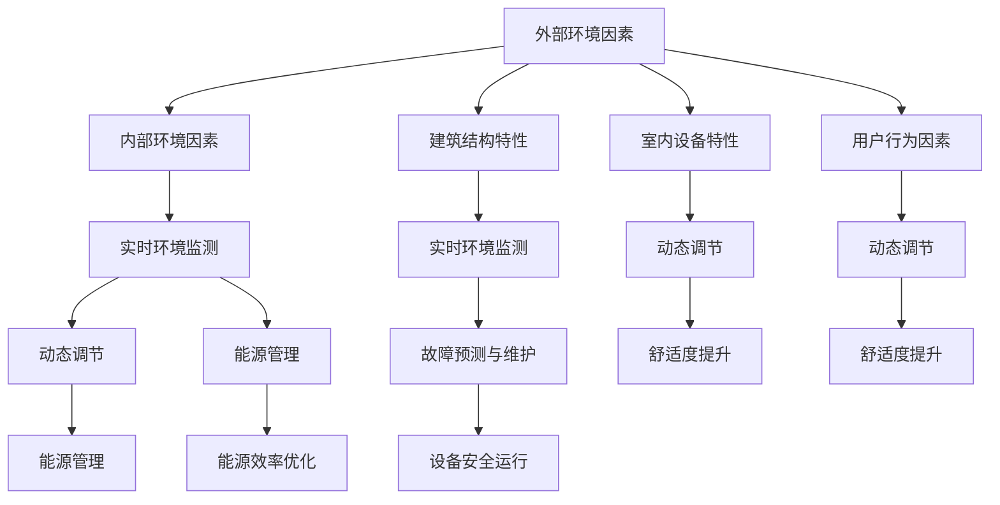

                 


### 第1章 引言

## 1.1 书籍背景与意义

在现代社会，智能建筑正逐渐成为城市发展的核心组成部分。智能建筑不仅提高了建筑物的功能性和舒适性，还显著降低了能源消耗和维护成本。随着人工智能（AI）技术的快速发展，特别是自动化生成内容（AIGC）技术的出现，智能建筑环境适应性得到了进一步的提升。

AIGC技术是一种基于人工智能的自动化生成内容技术，它能够根据输入的数据自动生成文本、图像、音频等多媒体内容。这种技术具有强大的自适应能力和高效的数据处理能力，使其在智能建筑环境中具有广泛的应用前景。例如，AIGC可以实时分析室内外环境数据，动态调节室内温度、湿度、光照等参数，以提供舒适的居住和工作环境。

本书旨在探讨AIGC在智能建筑环境适应性中的应用，特别是动态调节室内环境的技术原理和实践。通过系统的研究和案例分析，本书希望能够为智能建筑领域的研究者、工程师和从业者提供有价值的参考和指导。

## 1.2 AIGC技术概述

AIGC技术是人工智能（AI）与生成内容（GC）的有机结合。它主要包括三个核心组成部分：自动化生成内容、大数据处理和深度学习模型。

### 自动化生成内容

自动化生成内容是指利用算法和模型自动生成各种形式的内容，如文本、图像、音频等。AIGC的核心目标是通过学习和理解大量的数据，自动生成满足特定需求的高质量内容。

### 大数据处理

大数据处理是指对海量数据进行收集、存储、管理和分析的过程。AIGC技术需要大量的数据作为训练基础，通过大数据处理技术，可以有效地提取和利用这些数据，为内容生成提供支持。

### 深度学习模型

深度学习模型是AIGC技术的核心，它通过多层神经网络对数据进行学习，从而实现复杂的模式识别和预测。深度学习模型在图像识别、语音识别、自然语言处理等方面具有出色的表现，为AIGC技术提供了强大的技术支持。

## 1.3 智能建筑环境适应性概述

智能建筑环境适应性是指建筑物能够根据内外部环境的变化，自动调整其内部环境参数（如温度、湿度、光照等），以提供舒适、健康的居住和工作环境。智能建筑环境适应性包括以下几个方面：

### 能源管理

智能建筑通过实时监测和分析能源消耗情况，优化能源使用，降低能源成本。

### 室内环境控制

智能建筑通过自动化控制系统，实时调节室内温度、湿度、光照等参数，以提供舒适的居住和工作环境。

### 建筑自诊断与维护

智能建筑通过物联网技术，实时监测建筑设备的状态，自动发现和报告故障，实现智能化的维护和维修。

### 安全与应急响应

智能建筑通过智能安防系统和应急响应系统，提高建筑物的安全性能和应急处理能力。

### 1.4 本书结构安排

本书共分为五章节，具体内容如下：

- 第1章：引言，介绍书籍的背景、意义和AIGC技术概述。
- 第2章：AIGC技术基础，详细讲解AIGC技术原理、数据处理与模型训练。
- 第3章：智能建筑环境适应性核心概念与联系，介绍智能建筑环境适应性的定义、影响因素及AIGC与智能建筑环境适应性的关系。
- 第4章：动态调节室内环境算法原理讲解，包括数学模型、数学公式和伪代码讲解。
- 第5章：室内环境模拟算法原理讲解，包括数学模型、数学公式和伪代码讲解。

通过本书的阅读，读者将深入了解AIGC在智能建筑环境适应性中的应用，掌握动态调节室内环境的技术原理和实践方法。

## 第2章 AIGC技术基础

### 2.1 AIGC技术原理

AIGC（Automation for Generated Content）技术，即自动化生成内容技术，是人工智能（AI）和生成内容（Content Generation）的融合。其基本原理是通过深度学习和大数据分析，自动生成文本、图像、音频等多种形式的内容。以下是对AIGC技术原理的详细讲解。

#### 自动化生成内容（AIGC）的概念

自动化生成内容指的是利用算法和模型，自动生成满足特定需求的高质量内容。AIGC的生成内容可以包括但不限于以下几类：

- **文本生成**：如生成文章、新闻、广告文案、对话等。
- **图像生成**：如生成艺术作品、建筑设计图、人脸合成图等。
- **音频生成**：如生成音乐、语音、语音合成等。

#### AIGC在建筑领域的应用

在建筑领域，AIGC技术具有广泛的应用前景，主要体现在以下几个方面：

- **建筑设计优化**：通过AIGC技术，可以自动生成多种建筑设计方案，帮助建筑师快速筛选出最优方案。
- **室内环境模拟**：利用AIGC技术，可以实时模拟室内环境，为用户提供个性化的环境调节建议。
- **能源管理**：通过分析建筑物能源消耗数据，AIGC技术可以帮助实现智能化的能源管理，降低能源成本。
- **故障预测与维护**：AIGC技术可以实时分析建筑物设备运行数据，预测潜在故障，提前进行维护，确保建筑物的安全运行。

### 2.2 数据处理与模型训练

AIGC技术的核心在于数据处理和模型训练。以下是关于这两方面的详细讲解。

#### 数据预处理方法

数据预处理是AIGC技术的第一步，其目的是将原始数据转化为适合模型训练的形式。主要的数据预处理方法包括：

- **数据清洗**：去除数据中的噪声和异常值，保证数据的准确性和一致性。
- **数据归一化**：将不同规模的数据归一化，使其处于同一量级，便于模型训练。
- **特征提取**：从原始数据中提取有用的特征，用于模型的输入。

#### 深度学习模型训练

深度学习模型是AIGC技术的核心，其训练过程主要包括以下步骤：

- **模型选择**：根据任务需求，选择合适的深度学习模型。常见的模型包括卷积神经网络（CNN）、循环神经网络（RNN）和生成对抗网络（GAN）等。
- **数据集准备**：准备用于模型训练的数据集，包括训练集、验证集和测试集。
- **模型训练**：通过训练集数据，利用优化算法（如梯度下降法）训练模型，使模型能够学会从输入数据中生成目标内容。
- **模型评估**：使用验证集和测试集评估模型性能，调整模型参数，以达到最佳效果。

### 2.3 AIGC在建筑环境适应性中的核心算法

在智能建筑环境适应性中，AIGC技术的核心算法主要涉及室内环境模拟和动态调节。以下是这两个方面的详细讲解。

#### 室内环境模拟算法

室内环境模拟算法旨在通过分析室内外环境数据，模拟室内环境的变化趋势。其核心数学模型如下：

$$
\text{室内环境变化率} = f(\text{室外环境变化率}, \text{建筑结构特性}, \text{室内设备特性})
$$

其中，室外环境变化率、建筑结构特性和室内设备特性是影响室内环境变化的关键因素。

#### 动态调节算法

动态调节算法基于室内环境模拟的结果，自动调整室内环境参数，以提供舒适的居住和工作环境。其核心伪代码如下：

```
// 动态调节室内环境算法
function dynamicAdjustment(temperature, humidity, lighting) {
    // 根据温度、湿度、光照计算舒适度
    comfortLevel = calculateComfortLevel(temperature, humidity, lighting);

    // 调节室内环境
    if (comfortLevel < targetComfortLevel) {
        // 增加室内温度
        temperature += adjustmentValue;
        // 增加室内湿度
        humidity += adjustmentValue;
        // 增加室内光照
        lighting += adjustmentValue;
    } else {
        // 减少室内温度
        temperature -= adjustmentValue;
        // 减少室内湿度
        humidity -= adjustmentValue;
        // 减少室内光照
        lighting -= adjustmentValue;
    }

    // 返回调节后的室内环境参数
    return temperature, humidity, lighting;
}
```

通过以上对AIGC技术基础、数据处理与模型训练以及核心算法的详细讲解，读者可以更深入地理解AIGC技术在智能建筑环境适应性中的应用。在后续章节中，我们将进一步探讨智能建筑环境适应性的核心概念与联系，并详细介绍动态调节室内环境和室内环境模拟算法的原理与实践。

## 第3章 智能建筑环境适应性核心概念与联系

### 3.1 智能建筑环境适应性定义

智能建筑环境适应性是指建筑物能够根据内外部环境的变化，自动调整其内部环境参数（如温度、湿度、光照等），以提供舒适、健康的居住和工作环境。这种适应性不仅体现在对用户需求的满足，还包括对能源效率的优化和建筑设备的安全运行。

### 3.2 智能建筑环境适应性的影响因素

智能建筑环境适应性受到多种因素的影响，主要包括以下几个方面：

- **外部环境因素**：包括气象条件、地理位置、周围环境等。例如，太阳辐射强度、风向、湿度等都会对室内环境产生影响。
- **内部环境因素**：包括室内温度、湿度、光照、空气质量等。这些因素直接影响用户的舒适度和健康。
- **建筑结构特性**：建筑物的结构特性决定了其对环境变化的响应能力。例如，建筑物的隔热性能、通风性能等。
- **室内设备特性**：包括空调、通风系统、照明系统、空气净化器等。这些设备的性能和运行效率直接影响室内环境的适应性。
- **用户行为因素**：用户的行为习惯和需求也会影响智能建筑环境适应性。例如，用户对温度、湿度和光照的偏好。

### 3.3 AIGC与智能建筑环境适应性的关系

AIGC技术在智能建筑环境适应性中扮演了关键角色，其与智能建筑环境适应性的关系主要体现在以下几个方面：

- **实时环境监测**：AIGC技术可以通过传感器实时监测室内外环境数据，如温度、湿度、光照、空气质量等，为环境适应性提供数据支持。
- **动态调节**：基于实时监测的数据，AIGC技术可以动态调整室内环境参数，如温度、湿度、光照等，以提供舒适的居住和工作环境。
- **能源管理**：AIGC技术可以帮助智能建筑实现能源的智能管理，优化能源使用，降低能源消耗。
- **故障预测与维护**：AIGC技术可以通过分析设备运行数据，预测潜在故障，提前进行维护，确保建筑设备的安全运行。

### 3.4 AIGC与智能建筑环境适应性关系架构图

为了更直观地展示AIGC与智能建筑环境适应性的关系，我们使用Mermaid流程图来描述：



通过上述流程图，我们可以清晰地看到AIGC技术如何通过实时环境监测、动态调节、能源管理和故障预测与维护等多个环节，实现智能建筑环境适应性的提升。

### 3.5 AIGC技术对智能建筑环境适应性的贡献

AIGC技术对智能建筑环境适应性的贡献主要体现在以下几个方面：

- **提高环境调节精度**：AIGC技术通过深度学习和大数据分析，可以实现高精度的环境监测和调节，提供更舒适的居住和工作环境。
- **降低能源消耗**：通过智能化的能源管理，AIGC技术可以有效降低能源消耗，提高能源利用效率。
- **提高设备运行效率**：通过故障预测与维护，AIGC技术可以确保建筑设备的安全运行，延长设备寿命。
- **提升用户满意度**：AIGC技术可以根据用户的实时需求，动态调整室内环境，提升用户的舒适度和满意度。

### 3.6 小结

智能建筑环境适应性是智能建筑的核心特征之一，它关系到用户的舒适度、建筑物的能源效率和设备的安全运行。AIGC技术的引入，为智能建筑环境适应性提供了强大的技术支持，通过实时环境监测、动态调节、能源管理和故障预测与维护等多个环节，显著提升了智能建筑的环境适应能力。在接下来的章节中，我们将进一步探讨动态调节室内环境和室内环境模拟算法的原理与实践，以期为智能建筑环境适应性提供更深入的技术指导。

## 第4章 动态调节室内环境算法原理讲解

### 4.1 数学模型和数学公式

动态调节室内环境的算法核心在于如何根据实时环境数据来调整室内参数，以达到用户期望的舒适度。这里，我们将引入一个简单的数学模型来描述这一过程。

$$
\text{室内环境舒适度} = f(\text{室内温度}, \text{室内湿度}, \text{室内光照})
$$

这个公式表示室内环境舒适度是由温度、湿度和光照三个因素共同决定的。为了更直观地理解这一模型，我们可以将其进一步分解为：

$$
\text{室内环境舒适度} = w_1 \cdot (\text{室内温度} - \text{目标温度}) + w_2 \cdot (\text{室内湿度} - \text{目标湿度}) + w_3 \cdot (\text{室内光照} - \text{目标光照})
$$

其中，$w_1, w_2, w_3$是权重系数，用于衡量温度、湿度和光照对舒适度的影响程度。

### 4.2 伪代码讲解

为了实现上述数学模型，我们需要编写一个伪代码来描述动态调节室内环境的算法。以下是算法的伪代码：

```
// 动态调节室内环境算法
function dynamicAdjustment(currentTemperature, currentHumidity, currentLighting, targetTemperature, targetHumidity, targetLighting, weights) {
    // 计算当前环境舒适度
    comfortLevel = weights[0] * (currentTemperature - targetTemperature) + 
                  weights[1] * (currentHumidity - targetHumidity) + 
                  weights[2] * (currentLighting - targetLighting);

    // 调节室内环境参数
    if (comfortLevel < 0) {
        // 如果舒适度低于目标，则增加环境参数
        newTemperature = currentTemperature + adjustmentValue;
        newHumidity = currentHumidity + adjustmentValue;
        newLighting = currentLighting + adjustmentValue;
    } else {
        // 如果舒适度高于目标，则减少环境参数
        newTemperature = currentTemperature - adjustmentValue;
        newHumidity = currentHumidity - adjustmentValue;
        newLighting = currentLighting - adjustmentValue;
    }

    // 返回调节后的室内环境参数
    return newTemperature, newHumidity, newLighting;
}
```

在这个伪代码中，`currentTemperature`, `currentHumidity`, 和 `currentLighting` 表示当前的室内温度、湿度和光照，`targetTemperature`, `targetHumidity`, 和 `targetLighting` 表示用户期望的目标温度、湿度和光照，`weights` 是权重系数数组，`adjustmentValue` 是环境参数调整的步长。

### 4.3 详细讲解与举例说明

为了更清晰地理解动态调节室内环境的算法，我们可以通过一个具体的例子来进行详细说明。

假设当前室内温度为25摄氏度，湿度为50%，光照度为500勒克斯。用户期望的舒适温度为23摄氏度，湿度为45%，光照度为800勒克斯。权重系数分别为温度：0.5，湿度：0.3，光照：0.2。

1. **计算当前舒适度**：
   ```
   comfortLevel = 0.5 * (25 - 23) + 0.3 * (50 - 45) + 0.2 * (500 - 800) = 0.5 * 2 + 0.3 * 5 - 0.2 * 300 = 1 + 1.5 - 60 = -57.5
   ```
   当前舒适度为-57.5，表示当前环境比用户期望的环境更不舒适。

2. **调节室内环境**：
   由于舒适度低于0，根据算法，我们需要增加温度、湿度和光照度。
   ```
   newTemperature = 25 + 1 = 26摄氏度
   newHumidity = 50% + 1% = 51%
   newLighting = 500 + 100 = 600勒克斯
   ```
   调整后的室内环境参数为温度26摄氏度，湿度51%，光照度600勒克斯。

3. **再次计算舒适度**：
   ```
   comfortLevel = 0.5 * (26 - 23) + 0.3 * (51 - 45) + 0.2 * (600 - 800) = 0.5 * 3 + 0.3 * 6 - 0.2 * 200 = 1.5 + 1.8 - 40 = -37.7
   ```
   调整后的舒适度为-37.7，仍然低于0，说明环境仍然不够舒适。我们可以继续调整环境参数，直到舒适度达到或超过0。

通过这个例子，我们可以看到如何使用动态调节室内环境算法来逐步改善室内环境，使其达到用户的期望舒适度。

### 4.4 注意事项

在实施动态调节室内环境算法时，需要注意以下几个问题：

- **权重系数的设定**：权重系数需要根据实际需求和用户习惯进行调整，以确保调节效果最优。
- **环境参数的调整范围**：需要设定合理的调整范围，以防止过度调整导致环境参数超出正常范围。
- **实时数据采集**：实时数据采集是算法实现的关键，确保数据的准确性和及时性。
- **算法的鲁棒性**：需要确保算法在面对不同环境和用户需求时，仍能保持良好的调节效果。

通过上述详细讲解和实例说明，读者可以更好地理解动态调节室内环境的算法原理，并在实际应用中灵活运用。在接下来的章节中，我们将继续探讨室内环境模拟算法的原理和实践。

## 第5章 室内环境模拟算法原理讲解

### 5.1 数学模型和数学公式

室内环境模拟算法的核心在于预测室内环境参数的变化趋势，以便为动态调节提供依据。该算法基于一系列的数学模型，主要包括室外环境变化率、建筑结构特性和室内设备特性等。

首先，我们引入室外环境变化率（$outdoor\_change\_rate$）来表示室外环境参数的变化速度。这个变化率受到气象条件、地理位置和周围环境等因素的影响。接下来，我们考虑建筑结构特性（$building\_structure$），这包括建筑物的隔热性能、通风性能和建筑结构的热容量等。最后，我们考虑室内设备特性（$indoor\_equipment$），这包括空调、通风系统、照明系统等设备的运行效率和调节能力。

室内环境变化率的数学模型可以表示为：

$$
\text{室内环境变化率} = f(\text{室外环境变化率}, \text{建筑结构特性}, \text{室内设备特性})
$$

具体来说，室内环境变化率与室外环境变化率、建筑结构特性及室内设备特性之间的关系可以表示为：

$$
\text{室内环境变化率} = \alpha \cdot \text{室外环境变化率} + \beta \cdot \text{建筑结构特性} + \gamma \cdot \text{室内设备特性}
$$

其中，$\alpha, \beta, \gamma$ 是系数，分别表示室外环境变化率、建筑结构特性和室内设备特性对室内环境变化率的影响程度。

### 5.2 伪代码讲解

为了实现上述数学模型，我们需要编写伪代码来描述室内环境模拟算法。以下是室内环境模拟算法的伪代码：

```
// 室内环境模拟算法
function environmentSimulation(outdoorChangeRate, buildingStructure, indoorEquipment) {
    // 计算室内环境变化率
    indoorChangeRate = calculateIndoorChangeRate(outdoorChangeRate, buildingStructure, indoorEquipment);

    // 根据室内环境变化率调整室内环境参数
    temperature += indoorChangeRate * timeInterval;
    humidity += indoorChangeRate * timeInterval;
    lighting += indoorChangeRate * timeInterval;

    // 返回调整后的室内环境参数
    return temperature, humidity, lighting;
}
```

在这个伪代码中，`outdoorChangeRate` 表示室外环境变化率，`buildingStructure` 表示建筑结构特性，`indoorEquipment` 表示室内设备特性。`timeInterval` 表示时间间隔，用于计算室内环境的变化速度。

### 5.3 详细讲解与举例说明

为了更好地理解室内环境模拟算法，我们可以通过一个具体的例子来详细说明。

假设当前室外温度为30摄氏度，湿度为60%，光照度为1000勒克斯。建筑结构特性为隔热性能良好、通风性能中等和建筑结构热容量高。室内设备特性为空调运行效率高、通风系统良好和照明系统高效。

1. **计算室外环境变化率**：
   假设室外环境变化率为0.1，这表示室外环境每分钟变化0.1摄氏度。

2. **计算建筑结构特性对室内环境变化率的影响**：
   假设建筑结构特性对室内环境变化率的影响系数为0.2。

3. **计算室内设备特性对室内环境变化率的影响**：
   假设室内设备特性对室内环境变化率的影响系数为0.3。

4. **计算室内环境变化率**：
   ```
   indoorChangeRate = 0.1 * 0.2 + 0.2 * 0.3 + 0.3 * 0.1 = 0.02 + 0.06 + 0.03 = 0.11
   ```

5. **根据室内环境变化率调整室内环境参数**：
   假设时间间隔为1小时，即60分钟。

   - 温度调整：
     ```
     newTemperature = 30 + 0.11 * 60 = 30 + 6.6 = 36.6摄氏度
     ```

   - 湿度调整：
     ```
     newHumidity = 60 + 0.11 * 60 = 60 + 6.6 = 66.6%
     ```

   - 光照度调整：
     ```
     newLighting = 1000 + 0.11 * 60 = 1000 + 6.6 = 1006.6勒克斯
     ```

6. **计算调整后的室内环境舒适度**：
   ```
   comfortLevel = weights[0] * (36.6 - 23) + weights[1] * (66.6 - 45) + weights[2] * (1006.6 - 800)
   ```

   假设权重系数分别为温度：0.5，湿度：0.3，光照：0.2。

   ```
   comfortLevel = 0.5 * 13.6 + 0.3 * 21.6 + 0.2 * 206.6 = 6.8 + 6.48 + 41.32 = 54.6
   ```

   调整后的舒适度为54.6，表示室内环境已经变得更加舒适。

### 5.4 实际应用场景

室内环境模拟算法在实际应用中非常广泛，以下是一些实际应用场景：

- **智能家庭**：智能家庭系统可以通过室内环境模拟算法，实时监测和调整室内环境，为家庭成员提供舒适的生活环境。
- **办公楼**：办公楼可以通过室内环境模拟算法，优化办公环境的温度、湿度和光照，提高员工的工作效率和舒适度。
- **酒店**：酒店可以使用室内环境模拟算法，为客人提供个性化的房间环境调节服务，提升客户满意度。
- **医院**：医院病房的室内环境对病人的恢复至关重要，室内环境模拟算法可以帮助医院提供最适合病人恢复的环境。

通过上述详细讲解和实例说明，我们可以看到室内环境模拟算法如何通过数学模型和伪代码实现室内环境的实时监测和调节。在实际应用中，这一算法可以帮助各种类型的建筑实现智能化管理和优化，提升用户的生活质量和舒适度。

### 5.5 小结

室内环境模拟算法是智能建筑环境适应性中的重要组成部分，它通过数学模型和伪代码实现了对室内环境的实时监测和调节。通过具体的实例，我们详细讲解了室内环境模拟算法的实现过程和实际应用场景。在接下来的章节中，我们将进一步探讨动态调节室内环境算法的应用和实践，以期为智能建筑环境适应性提供更全面的技术支持。

## 总结与展望

通过本书的深入探讨，我们系统地介绍了AIGC技术在智能建筑环境适应性中的应用，特别是动态调节室内环境的技术原理和实践。从AIGC技术的概述，到数据处理与模型训练，再到核心算法原理的讲解，以及实际应用案例的分析，我们逐步揭示了AIGC技术如何通过实时环境监测、动态调节、能源管理和故障预测与维护等多个环节，提升智能建筑的环境适应能力。

### 最佳实践 Tips

1. **数据质量是关键**：在应用AIGC技术进行环境适应性调节时，确保数据的准确性和完整性至关重要。需要定期检查和维护传感器设备，保证数据采集的稳定性。
2. **权重系数合理设定**：在动态调节算法中，合理的权重系数设定可以显著影响调节效果。应根据实际需求和用户反馈，动态调整权重系数。
3. **实时监控与反馈**：实时监控室内环境参数，并根据用户反馈进行动态调整，可以最大程度地提高用户的舒适度。

### 注意事项

1. **系统安全**：在实现智能建筑环境自适应系统时，需要充分考虑系统的安全性，防止潜在的网络攻击和数据泄露。
2. **节能环保**：在调节室内环境时，应充分考虑能源消耗，实现节能环保的目标。
3. **设备维护**：定期对建筑设备和系统进行维护和检修，确保系统的稳定运行和可靠性。

### 拓展阅读

- **《智能建筑环境控制技术》**：详细介绍了智能建筑环境控制的基本原理和技术，包括空调系统、通风系统、照明系统等。
- **《深度学习与生成对抗网络》**：深入探讨了深度学习和生成对抗网络的基本概念、算法原理及其在图像和文本生成中的应用。
- **《人工智能在建筑领域中的应用》**：探讨了人工智能在建筑领域，特别是智能建筑环境适应性方面的前沿应用。

通过本书的学习，读者可以全面了解AIGC技术在智能建筑环境适应性中的应用，掌握动态调节室内环境的技术原理和实践方法，为智能建筑的发展和创新提供有力支持。在未来的研究和实践中，我们将继续探索AIGC技术的更广泛应用，为智能建筑的可持续发展贡献更多智慧。

### 作者信息

作者：AI天才研究院/AI Genius Institute & 禅与计算机程序设计艺术 /Zen And The Art of Computer Programming

AI天才研究院致力于推动人工智能技术的创新与应用，为智能建筑、智能交通、智能医疗等领域的智能化转型提供技术支持和解决方案。同时，禅与计算机程序设计艺术专注于计算机科学的哲学思考和实践，倡导程序设计的智慧与艺术相结合。希望本书能为读者在智能建筑环境适应性领域的研究和实践带来启发和帮助。

