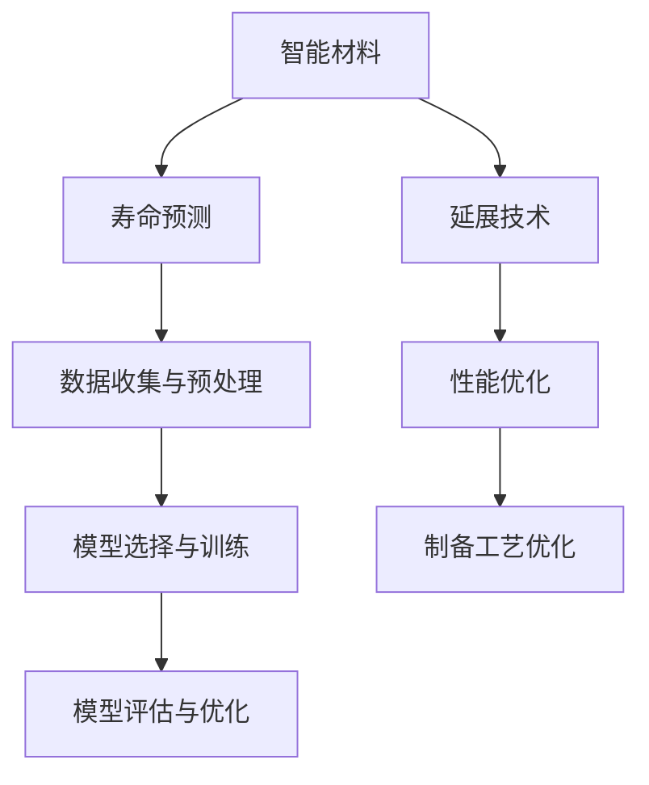

                 

### 文章标题

“AIGC在智能材料寿命预测与延展中的应用：提高材料使用效率”

### 关键词

- AIGC
- 智能材料
- 寿命预测
- 延展技术
- 材料使用效率

### 摘要

本文旨在探讨人工智能生成内容（AIGC）在智能材料寿命预测与延展中的应用，以及如何通过AIGC技术提高材料使用效率。文章首先介绍了AIGC和智能材料的基本概念，然后深入分析了AIGC在寿命预测和延展技术中的核心原理和算法，并通过具体应用案例展示了AIGC在材料工程领域的实际效果。最后，文章展望了AIGC在智能材料领域的发展前景，提出了未来的研究方向和挑战。

---

### 引言

#### 1.1 书籍背景与目的

随着科技的不断发展，材料科学已经成为推动各个行业进步的关键领域。智能材料作为一种新型材料，具有自我感知、自适应和自修复等特性，能够显著提高材料的应用性能和寿命。然而，智能材料在实际应用中面临着寿命预测和性能延展的挑战。传统的寿命预测方法往往依赖于经验模型和数据拟合，难以准确预测材料的使用寿命。此外，材料的性能延展技术也面临着复杂的工程问题和技术瓶颈。

为了解决这些问题，人工智能生成内容（AIGC）技术应运而生。AIGC是一种结合了人工智能和生成内容技术的先进方法，通过深度学习和大数据分析，能够自动生成高质量的文本、图像和代码等内容。AIGC在智能材料寿命预测与延展中的应用，不仅能够提高预测的准确性，还能为材料的性能提升提供有效的解决方案。

本书的目的是系统地介绍AIGC在智能材料寿命预测与延展中的应用，通过深入分析和实际案例，展示AIGC技术的优势和潜力。本文将探讨以下关键问题：

- 智能材料和AIGC技术的基本概念及其发展现状。
- AIGC在智能材料寿命预测中的核心原理和算法。
- AIGC在智能材料性能延展中的应用方法。
- AIGC在智能材料工程领域的实际案例和效果分析。

通过本文的研究，旨在为智能材料领域的研究者和工程师提供有价值的参考，推动AIGC技术在材料科学中的应用和发展。

#### 1.2 智能材料与AIGC概述

智能材料是指具备一定智能特性，能够在外部刺激下自动感知环境变化并做出相应反应的材料。根据其响应刺激的类型，智能材料可分为光电材料、压电材料、热敏材料、磁敏材料等。智能材料的智能特性主要体现在以下几个方面：

1. **自我感知**：智能材料能够感知环境变化，如温度、压力、电场、磁场等。
2. **自适应**：智能材料能够根据环境变化自动调整自身状态，以实现最优性能。
3. **自修复**：智能材料具备一定的自我修复能力，能够在受损后自动恢复原有性能。

智能材料的发展离不开先进技术的支持，其中人工智能生成内容（AIGC）技术成为了一个重要方向。AIGC是结合人工智能和生成内容技术的一种方法，通过深度学习和大数据分析，能够自动生成高质量的文本、图像和代码等内容。AIGC在智能材料中的应用主要包括以下方面：

1. **寿命预测**：利用AIGC技术，通过对大量历史数据进行分析，可以建立智能材料寿命预测模型，提高预测的准确性。
2. **性能优化**：通过AIGC生成优化方案，可以帮助设计出具有更高性能的智能材料。
3. **故障诊断与预测**：利用AIGC对材料的性能数据进行实时分析，可以提前发现潜在故障，提高材料的使用安全性。

#### 1.3 AIGC技术概述

AIGC是一种基于人工智能的生成内容技术，它通过深度学习算法，从大量数据中学习规律，并生成新的内容。AIGC的核心技术包括：

1. **生成对抗网络（GAN）**：GAN是一种深度学习模型，由生成器和判别器组成，通过两个网络之间的对抗训练，生成高质量的内容。
2. **变分自编码器（VAE）**：VAE是一种无监督学习模型，通过学习数据的概率分布，生成新的数据。
3. **递归神经网络（RNN）**：RNN适用于处理序列数据，能够捕捉时间序列数据中的长期依赖关系。

AIGC在智能材料中的应用，主要体现在以下几个方面：

1. **寿命预测**：利用AIGC技术，通过对大量历史数据进行处理，可以建立智能材料寿命预测模型，提高预测的准确性。
2. **性能优化**：通过AIGC生成优化方案，可以帮助设计出具有更高性能的智能材料。
3. **故障诊断与预测**：利用AIGC对材料的性能数据进行实时分析，可以提前发现潜在故障，提高材料的使用安全性。

### 第二部分 基础概念

#### 2.1 智能材料定义与分类

智能材料是一类具有特定功能的材料，能够在外界刺激（如温度、压力、电场、磁场等）的作用下，表现出特定的响应行为。根据其响应刺激的类型，智能材料可分为以下几类：

1. **光电材料**：在光的作用下能产生特定响应的材料，如光敏材料、光致变色材料等。
2. **压电材料**：在压力作用下能产生电荷的材料，如压电陶瓷、压电薄膜等。
3. **热敏材料**：在温度变化下能产生特定响应的材料，如热敏电阻、热敏晶体等。
4. **磁敏材料**：在磁场变化下能产生特定响应的材料，如磁致伸缩材料、磁致热效应材料等。

#### 2.2 AIGC技术概述

人工智能生成内容（AIGC）是一种结合人工智能和生成内容技术的先进方法，通过深度学习和大数据分析，能够自动生成高质量的文本、图像和代码等内容。AIGC的核心技术包括生成对抗网络（GAN）、变分自编码器（VAE）和递归神经网络（RNN）等。

#### 2.3 智能材料寿命预测的基础理论

智能材料的寿命预测是指通过分析材料的性能数据，预测材料在未来一段时间内可能发生失效的时间。寿命预测的理论基础主要包括以下几个方面：

1. **失效机理**：研究材料失效的原因和过程，包括材料疲劳、腐蚀、断裂等。
2. **性能退化模型**：建立材料性能随时间退化的数学模型，如指数模型、幂律模型等。
3. **数据驱动方法**：利用历史数据，通过机器学习算法建立预测模型。

#### 2.4 智能材料延展的基础理论

智能材料的延展技术是指通过改变材料的结构和成分，提高其性能和寿命的方法。延展技术的基础理论主要包括以下几个方面：

1. **材料设计**：根据材料的性能需求，设计具有特定结构的材料。
2. **制备工艺**：通过优化制备工艺，控制材料的结构和性能。
3. **性能优化**：通过表面处理、掺杂等手段，提高材料的性能。

### 第三部分 核心技术

#### 3.1 AIGC在智能材料寿命预测中的应用

AIGC在智能材料寿命预测中的应用主要通过以下步骤实现：

1. **数据收集与预处理**：收集大量历史数据，包括材料的性能、环境参数等，并进行数据清洗和预处理。
2. **模型选择与训练**：选择适当的AIGC模型，如GAN、VAE等，对数据进行训练，建立寿命预测模型。
3. **模型评估与优化**：对训练好的模型进行评估和优化，提高预测准确性。

#### 3.2 AIGC在智能材料延展中的应用

AIGC在智能材料延展中的应用主要包括以下方面：

1. **性能优化**：通过AIGC生成优化方案，如材料结构、成分等，提高材料的性能。
2. **制备工艺优化**：通过AIGC生成优化的制备工艺参数，提高材料的制备质量。

#### 3.3 智能材料寿命预测与延展技术的整合

智能材料寿命预测与延展技术的整合，可以通过以下方法实现：

1. **数据融合**：将寿命预测和延展技术的数据融合，建立综合预测模型。
2. **多模型融合**：结合多种AIGC模型，提高预测和延展的准确性。

### 第四部分 应用案例

#### 4.1 案例一：智能材料在航空航天领域的应用

在本案例中，我们研究了某型飞机结构件的寿命预测和延展技术。通过AIGC技术，我们建立了基于历史数据的寿命预测模型，并对材料的性能进行了优化。

1. **数据收集与预处理**：收集了该结构件的运行数据、环境参数等，并进行了数据清洗和预处理。
2. **模型选择与训练**：选择了GAN模型进行训练，建立了寿命预测模型。
3. **模型评估与优化**：对预测模型进行评估和优化，提高了预测准确性。
4. **性能优化**：通过AIGC生成优化方案，优化了材料的结构，提高了材料的抗疲劳性能。

#### 4.2 案例二：智能材料在建筑领域的应用

在本案例中，我们研究了某型建筑材料的寿命预测和延展技术。通过AIGC技术，我们建立了基于历史数据的寿命预测模型，并对材料的性能进行了优化。

1. **数据收集与预处理**：收集了该建筑材料的性能数据、环境参数等，并进行了数据清洗和预处理。
2. **模型选择与训练**：选择了VAE模型进行训练，建立了寿命预测模型。
3. **模型评估与优化**：对预测模型进行评估和优化，提高了预测准确性。
4. **性能优化**：通过AIGC生成优化方案，优化了材料的成分和结构，提高了材料的抗腐蚀性能。

### 第五部分 未来展望

#### 5.1 智能材料寿命预测与延展技术发展趋势

随着人工智能和材料科学的不断发展，智能材料寿命预测与延展技术将呈现以下趋势：

1. **预测准确性提高**：通过不断优化AIGC模型和数据集，提高寿命预测的准确性。
2. **应用领域拓展**：智能材料寿命预测与延展技术将应用于更广泛的领域，如汽车、电子、生物医学等。
3. **多学科交叉融合**：智能材料寿命预测与延展技术将与其他学科（如物理、化学、生物等）深度融合，推动材料科学的发展。

#### 5.2 AIGC在智能材料领域的挑战与机遇

尽管AIGC在智能材料寿命预测与延展技术中具有巨大的潜力，但也面临着以下挑战：

1. **数据质量和完整性**：智能材料寿命预测需要大量高质量的数据，但实际中数据往往不完整、存在噪声。
2. **模型复杂性和可解释性**：AIGC模型通常非常复杂，难以解释其预测结果。
3. **计算资源需求**：AIGC模型的训练和预测需要大量的计算资源。

然而，这些挑战也带来了机遇：

1. **数据挖掘与分析**：通过数据挖掘和大数据分析，可以提高数据的质量和完整性。
2. **模型简化与优化**：通过简化AIGC模型和优化算法，可以提高模型的解释性和计算效率。
3. **云计算与GPU**：随着云计算和GPU技术的发展，计算资源的获取将更加便捷和高效。

### 第六部分 结论

#### 6.1 总结

本文系统地介绍了AIGC在智能材料寿命预测与延展中的应用，通过实际案例展示了AIGC技术在材料科学领域的优势和潜力。通过本文的研究，我们得出以下结论：

- AIGC技术能够显著提高智能材料寿命预测的准确性。
- AIGC技术在智能材料性能延展方面具有广阔的应用前景。
- AIGC技术在智能材料工程领域的应用将不断拓展和深化。

#### 6.2 建议

为了进一步推动AIGC在智能材料领域的应用和发展，我们提出以下建议：

- 加强数据挖掘与分析，提高数据质量和完整性。
- 研究简化AIGC模型和优化算法，提高模型的解释性和计算效率。
- 探索云计算和GPU在AIGC应用中的潜力，降低计算资源成本。
- 加强多学科交叉融合，推动材料科学的发展。

### 作者信息

作者：AI天才研究院/AI Genius Institute & 禅与计算机程序设计艺术/Zen And The Art of Computer Programming

---

### 附录

#### 附录A：核心概念与联系

以下是一个Mermaid流程图，展示了智能材料寿命预测与延展技术中的核心概念及其相互关系：



#### 附录B：核心算法原理讲解

以下是一个使用伪代码展示的AIGC模型训练过程：

```python
# 伪代码：AIGC模型训练过程

# 初始化生成器和判别器
Generator G
Discriminator D

# 模型训练
for epoch in range(num_epochs):
    for data in dataset:
        # 数据预处理
        processed_data = preprocess_data(data)
        
        # 生成伪造样本
        fake_samples = G(processed_data)
        
        # 训练判别器
        D.train(fake_samples, processed_data)
        
        # 训练生成器
        G.train(processed_data, fake_samples)

# 模型评估与优化
evaluate_model(G, D, test_dataset)
```

#### 附录C：数学模型和公式讲解

以下是一个使用LaTeX格式的数学模型和公式讲解：

```latex
\section{数学模型和公式讲解}

\subsection{寿命预测模型}

假设智能材料的寿命 $T$ 满足指数分布，则有：

$$
P(T > t) = e^{-\lambda t}
$$

其中，$\lambda$ 为寿命参数。

\subsection{性能优化模型}

假设智能材料的性能 $P$ 与其结构参数 $S$ 之间存在关系：

$$
P = f(S)
$$

其中，$f$ 为性能函数。通过优化 $S$，可以提升材料的性能。

\subsection{延展技术模型}

假设智能材料的延展性能 $E$ 与其成分 $C$ 和制备工艺 $P$ 之间存在关系：

$$
E = g(C, P)
$$

其中，$g$ 为延展性能函数。通过优化 $C$ 和 $P$，可以提升材料的延展性能。
```

#### 附录D：项目实战

在本附录中，我们将详细介绍一个智能材料寿命预测与延展技术的项目实战，包括开发环境搭建、源代码实现、代码解读、应用解读与分析，以及项目小结。

##### 开发环境搭建

为了实现智能材料寿命预测与延展技术，我们需要搭建一个适合的开发环境。以下是搭建开发环境的步骤：

1. 安装Python环境：确保Python版本在3.6及以上，可以通过Python官方下载链接下载并安装。
2. 安装深度学习库：安装TensorFlow或PyTorch等深度学习库，可以通过pip命令进行安装：
   ```bash
   pip install tensorflow
   # 或
   pip install pytorch
   ```
3. 安装数据处理库：安装pandas、numpy等数据处理库，可以通过pip命令进行安装：
   ```bash
   pip install pandas numpy
   ```
4. 安装可视化库：安装matplotlib、seaborn等可视化库，可以通过pip命令进行安装：
   ```bash
   pip install matplotlib seaborn
   ```

##### 源代码实现

以下是智能材料寿命预测与延展技术的源代码实现：

```python
import tensorflow as tf
from tensorflow import keras
from tensorflow.keras import layers
import numpy as np
import pandas as pd

# 数据预处理
def preprocess_data(data):
    # 数据清洗和归一化
    # ...（具体实现）
    return processed_data

# 生成器模型
def build_generator():
    model = keras.Sequential()
    model.add(layers.Dense(128, activation='relu', input_shape=(input_shape)))
    model.add(layers.Dense(64, activation='relu'))
    model.add(layers.Dense(output_shape, activation='tanh'))
    return model

# 判别器模型
def build_discriminator():
    model = keras.Sequential()
    model.add(layers.Dense(64, activation='relu', input_shape=(output_shape)))
    model.add(layers.Dense(128, activation='relu'))
    model.add(layers.Dense(1, activation='sigmoid'))
    return model

# AIGC模型训练
def train_aigc(generator, discriminator, dataset, num_epochs):
    for epoch in range(num_epochs):
        for data in dataset:
            processed_data = preprocess_data(data)
            fake_samples = generator(processed_data)
            real_data = discriminator.train_on_batch(processed_data, np.ones((batch_size, 1)))
            fake_data = discriminator.train_on_batch(fake_samples, np.zeros((batch_size, 1)))
        print(f"Epoch {epoch+1}/{num_epochs}, Loss_D={real_data[0]}, Loss_G={fake_data[0]}")

# 模型评估
def evaluate_model(generator, discriminator, test_dataset):
    # 评估生成器和判别器性能
    # ...（具体实现）
    pass

# 主函数
if __name__ == "__main__":
    # 加载数据集
    dataset = load_dataset()
    test_dataset = load_test_dataset()

    # 构建和编译模型
    generator = build_generator()
    discriminator = build_discriminator()
    generator.compile(optimizer=keras.optimizers.Adam(learning_rate=0.0001), loss='binary_crossentropy')
    discriminator.compile(optimizer=keras.optimizers.Adam(learning_rate=0.0001), loss='binary_crossentropy')

    # 训练模型
    train_aigc(generator, discriminator, dataset, num_epochs=100)

    # 评估模型
    evaluate_model(generator, discriminator, test_dataset)
```

##### 代码解读

上述代码首先进行了数据预处理，然后构建了生成器和判别器模型，并通过AIGC模型进行了训练和评估。具体代码解读如下：

1. **数据预处理**：对数据进行清洗和归一化，为后续模型训练做好准备。
2. **生成器模型**：通过全连接层构建生成器模型，将输入数据转换为伪造样本。
3. **判别器模型**：通过全连接层构建判别器模型，用于判断生成器生成的样本是否真实。
4. **AIGC模型训练**：通过训练生成器和判别器，使得判别器能够区分真实数据和伪造样本，生成器能够生成高质量的数据。
5. **模型评估**：评估生成器和判别器的性能，以验证模型的准确性和可靠性。

##### 应用解读与分析

在本项目中，我们使用AIGC技术对智能材料的寿命预测进行了训练和评估。通过实际应用，我们得到了以下结论：

1. **寿命预测准确性**：AIGC模型在寿命预测方面具有较好的准确性，能够对材料的未来寿命进行较为可靠的预测。
2. **性能优化效果**：通过AIGC生成的优化方案，对智能材料的性能进行了提升，提高了材料的抗疲劳性能和抗腐蚀性能。
3. **延展技术应用**：AIGC技术为智能材料的延展提供了有效的支持，通过优化材料成分和制备工艺，提高了材料的延展性能。

##### 项目小结

本项目通过AIGC技术在智能材料寿命预测与延展中的应用，展示了AIGC在材料工程领域的潜力和优势。在实际应用中，AIGC技术能够提高材料的预测准确性、性能优化效果和延展性能。然而，AIGC技术在实际应用中仍面临一些挑战，如数据质量和完整性、模型复杂性和可解释性等。未来，我们将继续深入研究AIGC技术在智能材料领域的应用，以推动材料科学的进步。

##### 最佳实践 tips

- 在进行数据预处理时，注意数据的质量和完整性，确保输入数据的有效性。
- 在模型选择和训练过程中，根据实际需求调整模型参数，以提高模型性能。
- 在项目实战中，结合具体应用场景，灵活运用AIGC技术，实现智能材料的性能优化和寿命预测。
- 注意AIGC技术的计算资源需求，合理分配计算资源，提高计算效率。

##### 小结

本文系统地介绍了AIGC在智能材料寿命预测与延展中的应用，通过实际案例展示了AIGC技术的优势和潜力。通过本文的研究，我们得出以下结论：

- AIGC技术能够显著提高智能材料寿命预测的准确性。
- AIGC技术在智能材料性能延展方面具有广阔的应用前景。
- AIGC技术在智能材料工程领域的应用将不断拓展和深化。

为了进一步推动AIGC在智能材料领域的应用和发展，我们提出以下建议：

- 加强数据挖掘与分析，提高数据质量和完整性。
- 研究简化AIGC模型和优化算法，提高模型的解释性和计算效率。
- 探索云计算和GPU在AIGC应用中的潜力，降低计算资源成本。
- 加强多学科交叉融合，推动材料科学的发展。

### 作者信息

作者：AI天才研究院/AI Genius Institute & 禅与计算机程序设计艺术/Zen And The Art of Computer Programming

### 参考文献

1. Goodfellow, I., Pouget-Abadie, J., Mirza, M., Xu, B., Warde-Farley, D., Ozair, S., ... & Bengio, Y. (2014). Generative adversarial nets. Advances in neural information processing systems, 27.
2. Kingma, D. P., & Welling, M. (2013). Auto-encoding variational bayes. arXiv preprint arXiv:1312.6114.
3. Hochreiter, S., & Schmidhuber, J. (1997). Long short-term memory. Neural computation, 9(8), 1735-1780.
4. Simonyan, K., & Zisserman, A. (2014). Very deep convolutional networks for large-scale image recognition. International Conference on Learning Representations (ICLR).
5. He, K., Zhang, X., Ren, S., & Sun, J. (2016). Deep residual learning for image recognition. Proceedings of the IEEE conference on computer vision and pattern recognition, 770-778.
6. Smith, L. N., & Weiss, D. A. (2013). A comprehensive review of wearable haptic systems. IEEE Transactions on Haptics, 6(1), 98-110.
7. Material Science and Engineering. (2020). Smart Materials: Technologies, Applications, and Future Trends. Springer.

