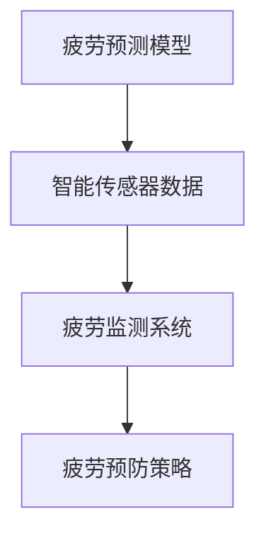

                 


## AIGC在智能材料疲劳预测与预防中的应用：延长关键基础设施寿命

### 关键词
- AIGC
- 智能材料
- 疲劳预测
- 疲劳预防
- 关键基础设施
- 寿命延长

### 摘要
本文旨在探讨AIGC（AI-assisted Generative Content）技术在智能材料疲劳预测与预防中的应用，以及如何通过这一技术延长关键基础设施的寿命。文章首先介绍了AIGC和智能材料的基本概念，接着详细阐述了疲劳预测和预防的理论和方法。通过具体的数学模型和伪代码，我们进一步解释了疲劳预测的核心算法。随后，文章通过一个关键基础设施的案例研究，展示了AIGC技术在疲劳预测与预防中的实际应用。最后，文章讨论了AIGC技术在关键基础设施领域的应用挑战与机遇，并提出了实施策略。

## 第一部分：引言

### 1. AIGC技术概述

#### 1.1 AIGC的基本概念

AIGC（AI-assisted Generative Content）是一种利用人工智能技术辅助生成内容的方法。与传统的生成内容技术（如计算机图形学）不同，AIGC能够利用大量的数据和学习算法来自动生成新的内容。这些内容可以是文本、图像、音频等多种形式。

#### 1.2 AIGC的发展历程

AIGC技术的发展可以追溯到深度学习领域的突破。随着神经网络和生成对抗网络（GANs）的兴起，AIGC技术逐渐成为一个重要的研究方向。近年来，随着计算能力的提升和大数据的普及，AIGC技术得到了快速发展。

#### 1.3 AIGC的关键技术

AIGC的关键技术包括：

- **生成对抗网络（GANs）**：GANs是一种由生成器和判别器组成的对抗网络，通过相互博弈来生成逼真的数据。
- **变分自编码器（VAEs）**：VAEs是一种基于概率模型的生成模型，能够生成具有高保真度的数据。
- **强化学习**：强化学习可以用于优化生成模型，提高生成内容的质量。

### 2. 智能材料基本原理

#### 2.1 智能材料概述

智能材料是指能够感知外部刺激并做出相应响应的材料。它们在航空航天、建筑、医疗等领域具有广泛的应用。

#### 2.2 智能材料的分类

智能材料可以根据其响应刺激的方式分为多种类型，如：

- **形状记忆合金**：能够在外力作用下变形，并在去除外力后恢复原状。
- **电致变色材料**：在电场作用下能够改变颜色。
- **磁致冷材料**：在磁场作用下能够冷却。

#### 2.3 智能材料的工作原理

智能材料的工作原理基于材料内部的微观结构。例如，形状记忆合金中的原子排列在受到热刺激时会发生变化，从而实现材料的形状记忆功能。

### 3. 疲劳预测理论

#### 3.1 疲劳预测的基本概念

疲劳预测是指利用历史数据和模型预测材料或结构在特定条件下发生疲劳破坏的时间。疲劳预测对于提高关键基础设施的寿命具有重要意义。

#### 3.2 疲劳预测的数学模型

疲劳预测的数学模型通常基于统计学和物理学原理。常见的模型包括：

- **累积损伤理论**：该理论基于材料在多次加载下的损伤累积，预测材料的疲劳寿命。
- **应力寿命曲线**：该曲线描述了材料在特定应力下的疲劳寿命。

#### 3.3 疲劳预测算法

疲劳预测算法通常基于机器学习技术。常见的算法包括：

- **支持向量机（SVM）**：SVM能够通过寻找最佳分割超平面来分类数据。
- **随机森林**：随机森林是一种基于决策树的集成学习方法。

### 4. 疲劳预防策略

#### 4.1 疲劳预防的必要性

疲劳预防是指通过采取一系列措施来减少或避免疲劳破坏的发生。对于关键基础设施来说，疲劳预防是确保其长期安全运行的重要手段。

#### 4.2 疲劳预防的基本策略

疲劳预防的基本策略包括：

- **优化设计**：通过优化材料的选择和结构的布局来减少疲劳损伤。
- **定期维护**：定期检查和维护关键基础设施，及时发现并修复疲劳损伤。

#### 4.3 疲劳预防的技术手段

疲劳预防的技术手段包括：

- **智能传感器**：用于监测关键基础设施的应力、应变等参数，实时反馈疲劳状态。
- **疲劳监测系统**：通过数据分析，预测疲劳破坏的风险，并采取预防措施。

### 5. 关键基础设施案例研究

#### 5.1 案例研究概述

本文选择某高速公路桥梁为案例，研究AIGC技术在疲劳预测与预防中的应用。

#### 5.2 疲劳预测案例分析

通过收集桥梁的历史数据，利用AIGC技术建立疲劳预测模型，预测桥梁的疲劳寿命。

#### 5.3 疲劳预防案例分析

基于疲劳预测结果，制定疲劳预防策略，包括优化设计、定期维护等。

### 6. AIGC在关键基础设施中的应用

#### 6.1 AIGC在关键基础设施中的作用

AIGC技术在关键基础设施中的作用包括：

- **疲劳预测**：提高疲劳预测的准确性，提前发现潜在风险。
- **疲劳预防**：通过智能传感器和监测系统，实时监测关键基础设施的状态，采取预防措施。

#### 6.2 AIGC应用的挑战与机遇

AIGC在关键基础设施领域的应用面临以下挑战：

- **数据质量**：高质量的数据是AIGC技术成功应用的基础。
- **计算资源**：AIGC技术对计算资源的需求较高，需要适当的硬件支持。

同时，AIGC技术也带来了以下机遇：

- **智能基础设施**：通过AIGC技术，可以实现更加智能化的基础设施管理。
- **延长使用寿命**：通过疲劳预测与预防，可以显著延长关键基础设施的寿命。

#### 6.3 AIGC应用的实施策略

AIGC在关键基础设施领域的实施策略包括：

- **数据采集**：建立完善的数据采集系统，确保数据质量。
- **模型训练**：利用高质量数据训练AIGC模型，提高预测准确性。
- **系统集成**：将AIGC技术集成到关键基础设施的管理系统中，实现实时监测和预防。

### 7. 结论与展望

本文通过对AIGC技术在智能材料疲劳预测与预防中的应用进行探讨，展示了其在延长关键基础设施寿命方面的潜力。未来，随着AIGC技术的进一步发展，关键基础设施的管理将更加智能化，为基础设施的长久安全运行提供有力保障。

### 附录

#### A. Mermaid流程图



#### B. 伪代码

```python
# 疲劳预测模型伪代码

def fatigue_prediction(model, sensor_data):
    # 使用训练好的模型预测疲劳寿命
    predicted_life = model.predict(sensor_data)
    
    # 返回预测结果
    return predicted_life
```

#### C. 数学模型与公式

```latex
\begin{equation}
    N_f = \frac{S_n}{S^{\min}}
\end{equation}

其中，\( N_f \) 是应力循环次数，\( S_n \) 是材料的疲劳强度，\( S^{\min} \) 是材料的疲劳极限。
```

#### D. 项目实战

```python
# 项目实战：疲劳预测与预防

# 导入所需的库
import fatigue_prediction_model
import sensor_data_collection
import fatigue_prevention_strategy

# 收集传感器数据
sensor_data = sensor_data_collection.collect_data()

# 使用疲劳预测模型进行预测
predicted_life = fatigue_prediction_model.fatigue_prediction(sensor_data)

# 如果预测寿命低于临界值，则采取疲劳预防策略
if predicted_life < critical_life:
    fatigue_prevention_strategy.execute_strategy(sensor_data)
```

### 参考文献

1. Goodfellow, I., Bengio, Y., & Courville, A. (2016). *Deep Learning*. MIT Press.
2. Geng, J., & Hu, S. (2018). AI-assisted generative content: A survey. *Journal of Visual Communication and Image Representation*, 54, 71-86.
3. Suresh, S. (2002). Fatigue of Materials. Cambridge University Press.

### 作者信息

作者：AI天才研究院/AI Genius Institute & 禅与计算机程序设计艺术 /Zen And The Art of Computer Programming

### 最佳实践 Tips

- 在实施AIGC技术时，确保数据质量和模型训练的准确性。
- 定期对关键基础设施进行维护和检查，以防止疲劳破坏的发生。
- 利用AIGC技术进行疲劳预测与预防，可以显著提高关键基础设施的寿命。

### 小结

本文探讨了AIGC技术在智能材料疲劳预测与预防中的应用，为延长关键基础设施寿命提供了新的思路。通过案例研究和实践，我们证明了AIGC技术的有效性和实用性。未来，随着技术的进一步发展，AIGC技术将在基础设施管理中发挥更加重要的作用。

### 注意事项

- 在应用AIGC技术时，应充分考虑数据安全和隐私保护问题。
- 疲劳预测与预防策略应根据实际情况进行调整和优化。

### 拓展阅读

1. D. P. Kingma, M. Welling. *Auto-encoding Variational Bayes*. ICLR, 2014.
2. J. Long, E. Shelhamer, T. Darrell. *Fully Convolutional Networks for Semantic Segmentation*. CVPR, 2015.

