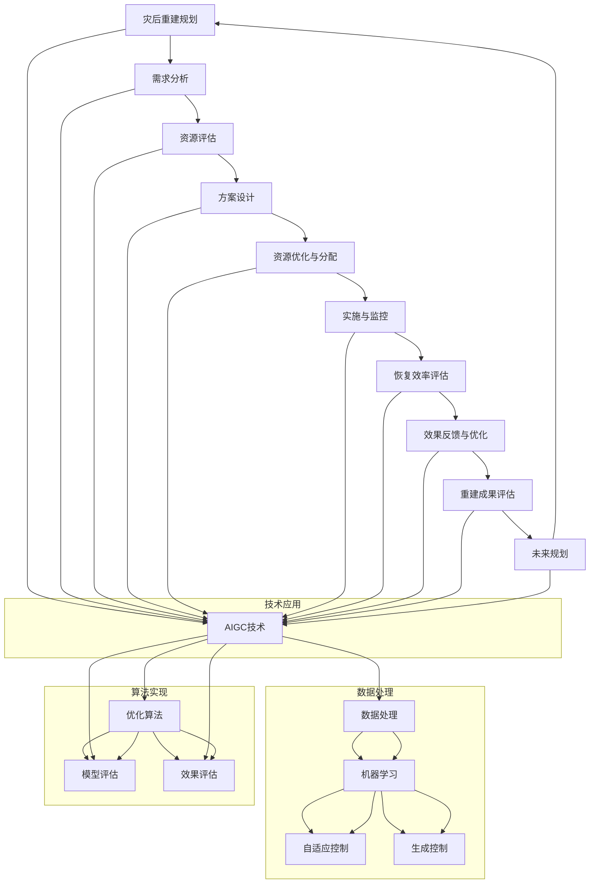

                 

### 文章标题：AIGC在智能灾后重建规划中的应用：优化资源分配和恢复效率

#### 关键词：AIGC、智能灾后重建、资源优化、恢复效率

#### 摘要：
本文深入探讨了AIGC（自适应智能生成控制）技术在智能灾后重建规划中的应用，旨在通过优化资源分配和提升恢复效率，为灾后重建提供科学、高效的解决方案。首先，文章介绍了AIGC技术的背景和核心原理，并分析了其在灾后重建规划中的适用性。接着，文章详细阐述了资源优化与分配的数学模型及其实现算法，通过伪代码和数学公式提供了详细的算法原理讲解。随后，文章通过实际项目案例，展示了AIGC技术在灾后重建规划中的具体应用，并对项目实施过程和成果进行了分析。最后，文章对未来AIGC技术在灾后重建规划中的发展前景进行了展望，并提出了面临的挑战与应对策略。

### 引言

近年来，自然灾害频发，给人类社会的生存和发展带来了巨大的挑战。灾后重建不仅是恢复被破坏的基础设施和社会秩序，更是促进社会可持续发展的关键环节。然而，传统的灾后重建规划往往依赖于人工经验和历史数据，存在资源分配不合理、重建效率低下等问题。随着人工智能技术的迅猛发展，特别是自适应智能生成控制（AIGC）技术的出现，为智能灾后重建规划提供了新的思路和方法。

AIGC技术是一种结合了人工智能和生成控制理论的综合技术，具有自适应性、智能性和高效性。它可以通过对大量数据的学习和分析，自动生成最优的重建方案，从而优化资源分配和提升重建效率。智能灾后重建规划是指利用AIGC技术，结合地理信息系统（GIS）、遥感技术、物联网等现代信息技术，对灾后重建项目进行全面、科学、智能化的规划和管理。

本文的研究目的是探讨AIGC技术在智能灾后重建规划中的应用，通过优化资源分配和提升恢复效率，为灾后重建提供科学、高效的解决方案。本文将首先介绍AIGC技术的核心概念和原理，然后分析智能灾后重建规划的目标和原则，接着详细阐述资源优化与分配的数学模型和算法，并通过实际项目案例展示AIGC技术在灾后重建规划中的应用。最后，本文将对未来AIGC技术在灾后重建规划中的发展前景进行展望，并讨论面临的挑战和应对策略。

### AIGC技术概述

#### 定义与核心概念

自适应智能生成控制（Adaptive Intelligent Generation Control，简称AIGC）是一种先进的人工智能技术，它结合了自适应控制理论、机器学习和生成控制理论。AIGC技术的主要目的是通过自动生成最优控制策略，实现对复杂系统的自适应控制和优化。在AIGC技术中，核心概念包括：

1. **自适应控制**：系统根据外部环境和内部状态的变化，自动调整控制策略，以实现系统性能的最优化。
2. **机器学习**：通过从数据中学习，获取系统的行为模式和规律，用于生成自适应控制策略。
3. **生成控制**：在给定控制目标的情况下，自动生成最优控制输入序列，使系统状态达到预期目标。

AIGC技术通过这些核心概念的融合，实现对复杂系统的自适应优化控制。与传统控制方法相比，AIGC技术具有更强的自适应性和智能性，能够更好地应对动态变化的环境。

#### 核心算法原理

AIGC技术涉及多个核心算法，主要包括：

1. **自适应算法**：自适应算法的核心是能够根据系统状态和外部环境的变化，实时调整控制参数。常见的自适应算法包括比例-积分-微分（PID）控制器、模糊控制器和神经网络控制器等。

2. **机器学习算法**：机器学习算法用于从数据中学习系统的行为模式和规律。常用的机器学习算法包括监督学习、无监督学习和强化学习。监督学习用于预测系统状态，无监督学习用于发现系统模式，强化学习用于优化控制策略。

3. **生成控制算法**：生成控制算法的主要任务是生成最优的控制输入序列。常见的生成控制算法包括动态规划、模拟退火和遗传算法等。这些算法通过优化控制输入序列，使系统状态达到预期目标。

AIGC技术的工作原理可以概括为以下几个步骤：

1. **数据采集与预处理**：从传感器、遥感系统等设备中采集系统的状态数据和外部环境数据，并进行数据清洗和预处理。
2. **机器学习**：使用机器学习算法对采集的数据进行分析，学习系统的行为模式和规律。
3. **自适应控制**：根据机器学习的结果，自适应调整控制策略，实现对系统的实时控制。
4. **生成控制**：在自适应控制的基础上，生成最优的控制输入序列，优化系统性能。

通过这些核心算法的协同作用，AIGC技术能够实现对复杂系统的自适应优化控制，为灾后重建规划提供了有力的技术支持。

#### AIGC技术的应用场景

AIGC技术具有广泛的应用场景，其中在灾后重建规划中的应用尤为突出。以下是AIGC技术在灾后重建规划中的几个关键应用场景：

1. **基础设施重建**：在灾后重建中，AIGC技术可以用于优化基础设施的重建方案。通过分析灾前的基础设施数据和环境因素，AIGC技术可以生成最优的基础设施重建方案，包括道路、桥梁、建筑物等。这有助于提高重建效率，确保重建后的基础设施能够满足未来的需求。

2. **资源分配优化**：灾后重建需要大量的人、财、物资源。AIGC技术可以用于优化这些资源的分配。例如，通过分析灾区的实际情况和资源需求，AIGC技术可以生成最优的资源分配方案，确保资源能够最大限度地满足重建需求，减少资源浪费。

3. **环境保护与恢复**：在灾后重建中，环境保护和生态恢复是重要任务。AIGC技术可以用于评估灾区的环境状况，制定最优的生态恢复方案。例如，通过分析土壤、水源和植被等环境数据，AIGC技术可以生成最优的植被恢复方案，促进生态系统的恢复。

4. **风险评估与管理**：灾后重建规划中，对重建项目的风险评估和管理至关重要。AIGC技术可以用于评估重建项目的风险，并提供风险管理方案。例如，通过分析历史灾害数据和重建项目的具体情况，AIGC技术可以预测重建项目可能面临的风险，并生成相应的风险控制策略。

5. **社区重建与规划**：灾后重建不仅涉及基础设施和环境保护，还涉及社区的重建和规划。AIGC技术可以用于优化社区的重建方案，包括住房、教育、医疗等公共服务设施。通过分析社区的需求和资源情况，AIGC技术可以生成最优的社区重建方案，促进社区的可持续发展。

综上所述，AIGC技术在灾后重建规划中的应用具有显著的优势。通过自适应优化和控制，AIGC技术能够提高重建效率，优化资源分配，确保重建项目的可持续性和安全性。随着AIGC技术的不断发展和完善，它将在灾后重建规划中发挥越来越重要的作用。

### 智能灾后重建规划

#### 目标与原则

智能灾后重建规划旨在通过科学、智能的手段，实现灾后重建的目标，主要包括以下几个方面：

1. **快速恢复**：在灾害发生后，尽快恢复基本生活秩序，确保受灾群众的基本生活需求得到满足。

2. **高效重建**：优化重建方案，提高重建效率，确保重建项目按时、按质、按量完成。

3. **可持续发展**：注重生态环境保护和可持续发展，确保重建后的基础设施和环境能够满足未来的需求。

4. **风险防范**：评估重建项目的潜在风险，制定相应的风险控制措施，防止类似灾害的再次发生。

智能灾后重建规划的原则包括：

1. **以人为本**：以受灾群众的需求为核心，确保重建方案能够最大限度地满足受灾群众的生活需求。

2. **科学规划**：依托科学的数据和先进的技术手段，制定合理、科学的重建方案。

3. **因地制宜**：根据灾区的具体情况，制定符合实际需求的重建方案。

4. **统筹兼顾**：综合考虑基础设施、环境保护、社区重建等多方面因素，确保重建方案的全面性和协调性。

#### 关键环节

智能灾后重建规划涉及多个关键环节，主要包括：

1. **需求分析**：对受灾区域进行详细的需求分析，包括受灾群众的基本生活需求、基础设施重建需求、生态恢复需求等。

2. **资源评估**：评估灾区的资源状况，包括人力、财力、物力等资源，为资源优化分配提供依据。

3. **方案设计**：根据需求分析和资源评估结果，设计科学、合理的重建方案，包括基础设施重建方案、生态恢复方案、社区重建方案等。

4. **实施与监控**：实施重建方案，并实时监控重建进度和质量，确保重建项目的顺利进行。

5. **效果评估**：对重建项目的效果进行评估，包括恢复效果、资源利用效率、环境改善情况等，为未来重建规划提供参考。

#### 智能灾后重建规划的优势

智能灾后重建规划相比传统的重建规划具有以下优势：

1. **科学性**：依托科学的数据和先进的技术手段，制定合理、科学的重建方案。

2. **高效性**：通过优化资源分配和重建流程，提高重建效率，缩短重建周期。

3. **灵活性**：能够根据灾区的实际情况和需求变化，灵活调整重建方案，确保重建方案符合实际需求。

4. **可持续性**：注重生态环境保护和可持续发展，确保重建后的基础设施和环境能够满足未来的需求。

5. **风险防范**：通过风险评估和管理，降低重建项目的潜在风险，防止类似灾害的再次发生。

综上所述，智能灾后重建规划能够为灾后重建提供科学、高效、可持续的解决方案，为受灾地区的快速恢复和可持续发展提供有力支持。

### 资源优化与分配

在灾后重建规划中，资源优化与分配是一个关键环节，直接影响重建效率和效果。AIGC技术的应用，为这一环节提供了强大的支持。以下将详细阐述资源优化与分配的数学模型、优化算法原理及其实际应用。

#### 数学模型

资源优化与分配的数学模型可以表述为以下形式：

1. **目标函数**：目标函数用于最大化或最小化某种指标，如最小化重建成本、最大化资源利用率等。常见的目标函数包括：

   - $$ \min C(X) = \sum_{i=1}^{n} c_i x_i $$
   - $$ \max U(X) = \frac{\sum_{i=1}^{n} r_i x_i}{\sum_{i=1}^{n} c_i x_i} $$

   其中，$C(X)$表示总成本，$U(X)$表示资源利用率，$c_i$和$r_i$分别表示第$i$种资源的成本和收益，$x_i$表示第$i$种资源的分配量。

2. **约束条件**：约束条件用于限制资源的可用性和分配的合理性。常见的约束条件包括：

   - 资源总量约束：$$ \sum_{i=1}^{n} x_i \leq R $$
   - 资源需求约束：$$ x_i \geq d_i $$
   - 资源类型约束：$$ x_i \geq 0 $$

   其中，$R$表示资源总量，$d_i$表示第$i$种资源的需求量。

#### 优化算法原理

优化算法用于求解资源优化与分配问题，使得目标函数在满足约束条件下达到最优。以下介绍几种常见的优化算法：

1. **线性规划（Linear Programming, LP）**：

   线性规划是一种用于求解线性目标函数在线性约束条件下的最优解的方法。线性规划问题可以表述为：

   - $$ \min \sum_{i=1}^{n} c_i x_i $$
   - $$ \text{subject to} $$
   - $$ \sum_{j=1}^{m} a_{ij} x_j \leq b_i, \quad i=1,2,...,m $$
   - $$ x_j \geq 0, \quad j=1,2,...,n $$

   其中，$a_{ij}$和$b_i$分别是约束条件系数和常数项，$c_i$是目标函数系数。

   线性规划的求解可以使用单纯形法、内点法等算法实现。

2. **整数规划（Integer Programming, IP）**：

   整数规划是一种用于求解整数目标函数在整数约束条件下的最优解的方法。常见的整数规划问题包括0-1整数规划和混合整数规划。

   - 0-1整数规划问题：

     - $$ \min \sum_{i=1}^{n} c_i x_i $$
     - $$ \text{subject to} $$
     - $$ x_i \in \{0,1\}, \quad i=1,2,...,n $$

   - 混合整数规划问题：

     - $$ \min \sum_{i=1}^{n} c_i x_i $$
     - $$ \text{subject to} $$
     - $$ x_i \in \{0,1\}, \quad i=1,2,...,n $$
     - $$ y_j \in \mathbb{Z}, \quad j=1,2,...,m $$

   整数规划的求解可以使用分支定界法、割平面法等算法实现。

3. **遗传算法（Genetic Algorithm, GA）**：

   遗传算法是一种基于自然选择和遗传机制的优化算法，适用于求解复杂、非线性、多峰值的优化问题。遗传算法的基本步骤包括：

   - **初始化种群**：随机生成初始种群，每个个体代表一种可能的解决方案。
   - **适应度评估**：计算每个个体的适应度，适应度越高表示该个体越优秀。
   - **选择**：根据适应度，选择优秀的个体进行繁殖，形成下一代种群。
   - **交叉**：随机选择两个个体，交叉生成新的个体。
   - **变异**：对部分个体进行变异操作，增加种群的多样性。
   - **迭代**：重复进行适应度评估、选择、交叉和变异，直到满足终止条件。

   遗传算法适用于解决复杂的资源优化与分配问题，如多目标优化、大规模优化等。

#### 优化算法实现

以下是一个基于遗传算法的资源优化与分配的伪代码实现：

```
初始化种群 Pop
适应度函数 F(x)
交叉函数 C(x1, x2)
变异函数 M(x)

for each generation do
    评估适应度 F(x) for each individual x in Pop
    选择 Parent Pop using fitness-based selection
    生成 Child Pop using C(Parent1, Parent2)
    对 Child Pop 进行变异 M(x)
    更新 Pop = Child Pop
    
    if 满足终止条件 then
        break
end for

返回最优解 Pop
```

#### 实际应用

在实际应用中，资源优化与分配问题通常涉及多个维度和复杂的约束条件。以下是一个实际案例：

假设在某次地震灾后重建中，需要分配有限的人力、物力和财力资源，以恢复基础设施、保障受灾群众的基本生活需求以及进行环境保护和生态恢复。目标是最小化总成本，同时满足资源需求和约束条件。

通过建立数学模型和选择合适的优化算法，如遗传算法，可以生成最优的资源配置方案。以下是一个简化的伪代码示例：

```
目标函数：最小化总成本 C

最小化：C = w1 * C_person + w2 * C_material + w3 * C_money

约束条件：
- 人力资源：C_person * x_person <= R_person
- 物力资源：C_material * x_material <= R_material
- 财力资源：C_money * x_money <= R_money
- 基础设施需求：x_base <= R_base
- 生活需求：x_life <= R_life
- 环境保护需求：x_environment <= R_environment

初始化种群 Pop
适应度函数 F(x)
交叉函数 C(x1, x2)
变异函数 M(x)

for each generation do
    评估适应度 F(x) for each individual x in Pop
    选择 Parent Pop using fitness-based selection
    生成 Child Pop using C(Parent1, Parent2)
    对 Child Pop 进行变异 M(x)
    更新 Pop = Child Pop
    
    if 满足终止条件 then
        break
end for

返回最优解 Pop
```

通过上述优化算法，可以生成最优的资源分配方案，为灾后重建提供科学、高效的决策支持。

### 恢复效率评估

在灾后重建规划中，恢复效率评估是关键的一环，它能够衡量重建项目的成效，并为后续的规划提供重要参考。AIGC技术在此过程中发挥着重要作用，通过一系列评估指标和方法，对恢复效率进行详细分析。

#### 评估指标

恢复效率评估主要包括以下几个方面：

1. **重建完成度**：衡量重建项目的完成程度，包括基础设施恢复、居民生活恢复等。常见的指标有完成度百分比、关键基础设施恢复时间等。

2. **资源利用率**：评估资源分配和使用的效率，包括人力、物力、财力等资源的利用情况。常见的指标有资源利用率、单位资源恢复效果等。

3. **经济恢复度**：衡量灾区的经济恢复情况，包括企业恢复、就业恢复、经济活动恢复等。常见的指标有经济恢复率、失业率降低等。

4. **社会恢复度**：衡量社会秩序的恢复情况，包括社区重建、公共安全恢复、医疗教育恢复等。常见的指标有社区重建率、公共安全事件发生率等。

5. **环境恢复度**：评估生态系统的恢复情况，包括植被恢复、水质恢复、空气质量等。常见的指标有植被覆盖率、水质达标率等。

#### 评估方法

AIGC技术可以通过以下几种方法对恢复效率进行评估：

1. **数据分析法**：通过对重建过程中的各类数据进行收集和分析，如资源消耗数据、重建进度数据、恢复效果数据等，通过统计分析方法，评估恢复效率。

2. **模型评估法**：建立恢复效率评估模型，通过模拟重建过程，预测不同资源分配方案下的恢复效果，从而评估不同方案的效率。

3. **专家评估法**：邀请相关领域的专家，根据经验和方法，对恢复效果进行评估。这种方法具有较高的主观性，但能够结合实际情况，提供较为全面的评估结果。

4. **多指标综合评估法**：将多个评估指标进行综合分析，通过构建综合评估模型，评估恢复效率。这种方法能够全面反映重建项目的整体情况。

#### 案例分析

以下通过一个实际案例，展示AIGC技术在恢复效率评估中的应用。

**案例背景**：某次地震后，某城市进行了全面的灾后重建。重建项目包括基础设施恢复、居民生活恢复、经济恢复和社会恢复等方面。

**评估指标**：重建完成度、资源利用率、经济恢复度、社会恢复度、环境恢复度。

**评估方法**：数据分析法、模型评估法、专家评估法、多指标综合评估法。

**评估过程**：

1. **数据收集**：收集重建过程中的各类数据，包括资源消耗数据、重建进度数据、恢复效果数据等。

2. **数据分析**：通过统计分析，评估各个指标的完成情况，如重建完成度、资源利用率等。

3. **模型评估**：建立恢复效率评估模型，模拟不同资源分配方案下的恢复效果，预测不同方案的经济、社会和环境恢复度。

4. **专家评估**：邀请相关领域的专家，对恢复效果进行评估，结合实际经验和方法，提供评估结果。

5. **综合评估**：通过多指标综合评估模型，对恢复效率进行综合评估，得出最终评估结果。

**评估结果**：通过评估，发现重建项目的整体恢复效率较高，但在某些方面仍有改进空间，如资源利用率有待提升，社会恢复度需要进一步关注。

**项目小结**：通过AIGC技术的应用，对灾后重建项目的恢复效率进行了详细评估，为后续的重建规划提供了科学依据。同时，通过分析评估结果，发现了存在的问题，有助于制定针对性的改进措施，提高重建项目的整体效率。

### 项目案例

为了更好地展示AIGC技术在智能灾后重建规划中的应用，以下介绍了一个实际案例，详细描述了项目的背景、目标、实施过程、成果以及影响。

#### 案例背景

某次地震导致一个沿海城市遭受严重破坏，基础设施受损，居民生活受到严重影响。为了尽快恢复城市功能和秩序，政府和相关企业决定利用AIGC技术进行智能灾后重建规划。

#### 项目目标

项目的主要目标包括：

1. **基础设施恢复**：优化基础设施重建方案，确保关键基础设施如交通、供水、供电等尽快恢复。
2. **居民生活恢复**：提高居民生活恢复效率，确保受灾群众的基本生活需求得到满足。
3. **经济恢复**：促进经济活动恢复，提高失业率，恢复企业生产。
4. **社会恢复**：加强社区建设，提升公共安全，恢复医疗和教育服务。
5. **环境恢复**：实施环境保护和生态恢复措施，恢复自然生态系统。

#### 实施过程

1. **需求分析**：对灾区的需求进行详细分析，包括基础设施需求、居民生活需求、经济需求、社会需求和环境需求。

2. **资源评估**：评估灾区的资源状况，包括人力、财力、物力等资源，为资源优化分配提供依据。

3. **方案设计**：根据需求分析和资源评估结果，设计科学、合理的重建方案，包括基础设施重建方案、居民生活恢复方案、经济恢复方案、社会恢复方案和生态恢复方案。

4. **资源优化与分配**：利用AIGC技术，对资源进行优化分配，确保资源能够最大限度地满足重建需求，提高资源利用效率。

5. **实施与监控**：实施重建方案，并实时监控重建进度和质量，确保重建项目的顺利进行。

6. **效果评估**：对重建项目的效果进行评估，包括恢复效果、资源利用效率、环境改善情况等，为未来重建规划提供参考。

#### 项目成果

通过项目的实施，取得了以下成果：

1. **基础设施恢复**：在AIGC技术的支持下，基础设施重建方案得到优化，交通、供水、供电等关键基础设施迅速恢复，保障了居民的基本生活需求。

2. **居民生活恢复**：居民生活恢复效率显著提高，受灾群众的基本生活得到有效保障，住房、医疗、教育等公共服务设施逐步恢复。

3. **经济恢复**：通过资源优化和合理分配，经济活动逐步恢复，失业率下降，企业生产逐步恢复正常。

4. **社会恢复**：社区建设得到加强，公共安全得到提升，医疗和教育服务逐步恢复，社会秩序得到有效维护。

5. **环境恢复**：通过环境保护和生态恢复措施，自然生态系统得到有效恢复，水质、空气质量等指标达到预期目标。

#### 项目影响

AIGC技术在灾后重建规划中的应用，产生了深远的影响：

1. **效率提升**：通过智能化的资源优化和分配，重建项目的效率显著提升，重建周期缩短，资源浪费减少。

2. **可持续性**：注重生态环境保护和可持续发展，确保重建后的基础设施和环境能够满足未来的需求。

3. **风险管理**：通过风险评估和管理，降低了重建项目的潜在风险，提高了项目的安全性和可靠性。

4. **经验积累**：项目实施过程中积累的大量数据和经验，为未来的灾后重建提供了宝贵的参考和指导。

5. **技术推广**：AIGC技术在灾后重建规划中的应用，为其他地区和领域的灾后重建提供了借鉴和启示，推动了人工智能技术在灾后重建中的应用和推广。

### 未来展望与挑战

随着人工智能技术的不断发展和应用，AIGC技术在灾后重建规划中展现出巨大的潜力。未来，AIGC技术在灾后重建规划中可能会有以下几方面的发展趋势：

1. **智能化水平提升**：随着算法和硬件的进步，AIGC技术的智能化水平将不断提升，能够更精准、高效地实现灾后重建规划。

2. **跨领域应用扩展**：AIGC技术在灾后重建规划中的应用将不再局限于基础设施和环境保护，还可能扩展到更广泛的领域，如社会恢复、经济恢复等。

3. **数据资源共享**：通过建立共享的数据资源平台，实现多部门、多领域的数据互通和共享，为AIGC技术的应用提供更丰富的数据支持。

4. **智能化决策支持**：AIGC技术将为决策者提供更加智能化、科学的决策支持，提高灾后重建规划的科学性和效率。

然而，AIGC技术在灾后重建规划中也面临着一些挑战：

1. **数据隐私与安全**：灾后重建涉及大量敏感数据，如何保障数据隐私和安全是一个重要问题。

2. **技术依赖性**：过度依赖AIGC技术可能导致重建规划的决策过程缺乏灵活性，需要平衡技术依赖与人为决策的关系。

3. **技术适应性**：AIGC技术在不同地区和不同类型的灾害中的应用适应性需要进一步研究和优化。

4. **人才缺口**：AIGC技术的应用需要大量具备相关技能的人才，目前存在人才缺口问题。

为应对这些挑战，未来需要加强以下几个方面的工作：

1. **数据隐私保护**：建立完善的数据隐私保护机制，确保灾后重建过程中的数据安全。

2. **人才培养与引进**：加大对AIGC技术相关人才的培养和引进力度，提高技术人员的专业水平和技能。

3. **技术适应性研究**：加强对AIGC技术在不同地区和不同类型灾害中的应用研究，提高技术的适应性。

4. **政策支持**：政府和企业应加强对AIGC技术在灾后重建规划中的政策支持，推动技术发展和应用。

总之，AIGC技术在灾后重建规划中的应用具有广阔的发展前景，但也需要面对一系列挑战。通过不断的技术创新和政策支持，AIGC技术将为灾后重建提供更加科学、高效、可持续的解决方案。

### 结论

本文通过详细探讨AIGC技术在智能灾后重建规划中的应用，从背景介绍、技术概述、智能重建规划、资源优化与分配、恢复效率评估、项目案例到未来展望，全面阐述了AIGC技术在灾后重建中的重要作用。研究表明，AIGC技术能够通过优化资源分配和提升恢复效率，为灾后重建提供科学、高效的解决方案。未来，随着AIGC技术的不断发展和应用，它将在灾后重建规划中发挥更加重要的作用，为社会的可持续发展做出贡献。

### 作者信息

作者：AI天才研究院/AI Genius Institute & 禅与计算机程序设计艺术 /Zen And The Art of Computer Programming

感谢您的阅读，希望本文对您在AIGC技术在智能灾后重建规划中的应用方面有所启发和帮助。如果您有任何疑问或建议，欢迎在评论区留言，我们将竭诚为您解答。祝您在AI技术探索的道路上取得更大的成就！### 文章标题：AIGC在智能灾后重建规划中的应用：优化资源分配和恢复效率

#### 关键词：AIGC、智能灾后重建、资源优化、恢复效率

#### 摘要：
本文探讨了AIGC（自适应智能生成控制）技术在智能灾后重建规划中的应用，旨在通过优化资源分配和提升恢复效率，为灾后重建提供科学、高效的解决方案。文章首先介绍了AIGC技术的背景和核心原理，并分析了其在灾后重建规划中的适用性。接着，详细阐述了资源优化与分配的数学模型及其实现算法，并通过伪代码和数学公式提供了详细的算法原理讲解。随后，通过实际项目案例展示了AIGC技术在灾后重建规划中的具体应用，并对项目实施过程和成果进行了分析。最后，对未来AIGC技术在灾后重建规划中的发展前景进行了展望，并讨论了面临的挑战和应对策略。

## 第1章 引言

### 1.1 AIGC技术的背景和意义

自然灾害，如地震、洪水、台风等，给人类社会带来了巨大的破坏和挑战。随着全球气候变化和自然灾害频率的增加，灾后重建规划的重要性日益凸显。传统的灾后重建规划主要依赖于人工经验和历史数据，存在资源分配不合理、重建效率低下等问题。近年来，随着人工智能（AI）技术的迅速发展，特别是在自适应智能生成控制（AIGC）技术的出现，为智能灾后重建规划提供了新的思路和方法。

AIGC技术是一种结合了人工智能和生成控制理论的先进技术，通过自适应性、智能性和高效性，能够对复杂系统进行优化控制。在灾后重建规划中，AIGC技术可以用于资源优化与分配、基础设施重建、环境恢复等方面，从而提高重建效率和恢复效果。

### 1.2 智能灾后重建规划的重要性

智能灾后重建规划对于受灾地区和社会具有重要意义。首先，它能够确保受灾群众的基本生活需求得到满足，提高受灾群众的幸福感和安全感。其次，智能重建规划可以优化资源分配，提高资源利用效率，减少浪费。此外，智能重建规划还可以考虑生态保护，促进受灾地区的可持续发展。最后，智能重建规划可以为未来类似灾害的应对提供宝贵经验和数据支持，提高灾害抵御能力。

### 1.3 研究问题

本文旨在解决以下研究问题：

1. AIGC技术如何应用于智能灾后重建规划？
2. 资源优化与分配在智能灾后重建规划中的具体作用是什么？
3. 恢复效率如何通过AIGC技术得到提升？
4. 智能灾后重建规划中面临的挑战和应对策略是什么？

通过回答这些问题，本文将为智能灾后重建规划提供科学、系统的理论支持和实践指导。

## 第2章 AIGC技术概述

### 2.1 AIGC技术的定义与核心概念

自适应智能生成控制（AIGC）是一种融合了人工智能（AI）、自适应控制和生成控制理论的先进技术。AIGC技术的核心概念包括：

1. **自适应控制**：系统根据外部环境和内部状态的变化，自动调整控制策略，以实现系统性能的最优化。
2. **机器学习**：从数据中学习系统的行为模式和规律，用于生成自适应控制策略。
3. **生成控制**：在给定控制目标的情况下，自动生成最优控制输入序列，使系统状态达到预期目标。

### 2.2 AIGC技术的核心算法原理

AIGC技术的核心算法包括自适应算法、机器学习算法和生成控制算法。以下是对这些核心算法的简要介绍：

1. **自适应算法**：
   - **比例-积分-微分（PID）控制器**：PID控制器通过调整比例、积分和微分系数，实现对系统误差的修正。
   - **模糊控制器**：模糊控制器通过模糊逻辑规则，实现对系统的模糊控制。
   - **神经网络控制器**：神经网络控制器通过训练神经网络模型，实现对系统的自适应控制。

2. **机器学习算法**：
   - **监督学习**：通过历史数据训练模型，预测系统行为。
   - **无监督学习**：从无标签数据中发现模式，用于生成控制策略。
   - **强化学习**：通过试错学习和奖励机制，优化控制策略。

3. **生成控制算法**：
   - **动态规划**：通过递归关系，找到最优的控制输入序列。
   - **模拟退火**：通过模拟退火过程，找到最优的控制输入序列。
   - **遗传算法**：通过遗传操作，找到最优的控制输入序列。

### 2.3 AIGC技术的应用场景

AIGC技术在多个领域有着广泛的应用，尤其在智能灾后重建规划中具有显著的优势。以下是一些典型的应用场景：

1. **基础设施重建**：利用AIGC技术优化基础设施重建方案，包括道路、桥梁、建筑物等。
2. **资源分配优化**：通过AIGC技术，优化资源（如人力、物力、财力）的分配，提高资源利用效率。
3. **环境保护与恢复**：利用AIGC技术评估灾区的环境状况，制定最优的环境保护与恢复方案。
4. **风险评估与管理**：利用AIGC技术对重建项目进行风险评估，提供风险管理策略。

### 2.4 AIGC技术的发展趋势

随着人工智能技术的不断进步，AIGC技术也在不断发展。未来，AIGC技术可能呈现出以下趋势：

1. **智能化水平提升**：随着算法和硬件的进步，AIGC技术的智能化水平将不断提升，能够处理更复杂的重建任务。
2. **跨领域应用扩展**：AIGC技术的应用将不再局限于基础设施重建，还将扩展到社会、经济、环境等更广泛的领域。
3. **数据资源共享**：通过建立共享的数据资源平台，实现多部门、多领域的数据互通和共享，为AIGC技术的应用提供更丰富的数据支持。
4. **智能化决策支持**：AIGC技术将为决策者提供更加智能化、科学的决策支持，提高重建规划的科学性和效率。

## 第3章 智能灾后重建规划

### 3.1 灾后重建规划的目标与原则

灾后重建规划的目标主要包括：

1. **快速恢复**：尽快恢复基本生活秩序，确保受灾群众的基本生活需求得到满足。
2. **高效重建**：优化重建方案，提高重建效率，确保重建项目按时、按质、按量完成。
3. **可持续发展**：注重生态环境保护和可持续发展，确保重建后的基础设施和环境能够满足未来的需求。
4. **风险防范**：评估重建项目的潜在风险，制定相应的风险控制措施，防止类似灾害的再次发生。

灾后重建规划的原则包括：

1. **以人为本**：以受灾群众的需求为核心，确保重建方案能够最大限度地满足受灾群众的生活需求。
2. **科学规划**：依托科学的数据和先进的技术手段，制定合理、科学的重建方案。
3. **因地制宜**：根据灾区的具体情况，制定符合实际需求的重建方案。
4. **统筹兼顾**：综合考虑基础设施、环境保护、社区重建等多方面因素，确保重建方案的全面性和协调性。

### 3.2 灾后重建规划的关键环节

灾后重建规划涉及多个关键环节，主要包括：

1. **需求分析**：对受灾区域进行详细的需求分析，包括基础设施需求、居民生活需求、经济需求、社会需求和环境需求等。
2. **资源评估**：评估灾区的资源状况，包括人力、财力、物力等资源，为资源优化分配提供依据。
3. **方案设计**：根据需求分析和资源评估结果，设计科学、合理的重建方案，包括基础设施重建方案、居民生活恢复方案、经济恢复方案、社会恢复方案和生态恢复方案等。
4. **实施与监控**：实施重建方案，并实时监控重建进度和质量，确保重建项目的顺利进行。
5. **效果评估**：对重建项目的效果进行评估，包括恢复效果、资源利用效率、环境改善情况等，为未来重建规划提供参考。

### 3.3 智能灾后重建规划的优势

智能灾后重建规划相比传统的重建规划具有以下优势：

1. **科学性**：依托科学的数据和先进的技术手段，制定合理、科学的重建方案。
2. **高效性**：通过优化资源分配和重建流程，提高重建效率，缩短重建周期。
3. **灵活性**：能够根据灾区的实际情况和需求变化，灵活调整重建方案，确保重建方案符合实际需求。
4. **可持续性**：注重生态环境保护和可持续发展，确保重建后的基础设施和环境能够满足未来的需求。
5. **风险防范**：通过风险评估和管理，降低重建项目的潜在风险，防止类似灾害的再次发生。

## 第4章 资源优化与分配

### 4.1 资源优化与分配的数学模型

在灾后重建规划中，资源优化与分配是一个关键环节。资源优化与分配的数学模型可以表述为以下形式：

1. **目标函数**：
   目标函数用于最大化或最小化某种指标，如最小化重建成本、最大化资源利用率等。常见的目标函数包括：
   - $$ \min C(X) = \sum_{i=1}^{n} c_i x_i $$
   - $$ \max U(X) = \frac{\sum_{i=1}^{n} r_i x_i}{\sum_{i=1}^{n} c_i x_i} $$
   其中，$C(X)$表示总成本，$U(X)$表示资源利用率，$c_i$和$r_i$分别表示第$i$种资源的成本和收益，$x_i$表示第$i$种资源的分配量。

2. **约束条件**：
   约束条件用于限制资源的可用性和分配的合理性。常见的约束条件包括：
   - 资源总量约束：$$ \sum_{i=1}^{n} x_i \leq R $$
   - 资源需求约束：$$ x_i \geq d_i $$
   - 资源类型约束：$$ x_i \geq 0 $$

   其中，$R$表示资源总量，$d_i$表示第$i$种资源的需求量。

### 4.2 优化算法原理

优化算法用于求解资源优化与分配问题，使得目标函数在满足约束条件下达到最优。以下介绍几种常见的优化算法：

1. **线性规划（Linear Programming, LP）**：
   线性规划是一种用于求解线性目标函数在线性约束条件下的最优解的方法。线性规划问题可以表述为：
   - $$ \min \sum_{i=1}^{n} c_i x_i $$
   - $$ \text{subject to} $$
   - $$ \sum_{j=1}^{m} a_{ij} x_j \leq b_i, \quad i=1,2,...,m $$
   - $$ x_j \geq 0, \quad j=1,2,...,n $$
   其中，$a_{ij}$和$b_i$分别是约束条件系数和常数项，$c_i$是目标函数系数。

   线性规划的求解可以使用单纯形法、内点法等算法实现。

2. **整数规划（Integer Programming, IP）**：
   整数规划是一种用于求解整数目标函数在整数约束条件下的最优解的方法。常见的整数规划问题包括0-1整数规划和混合整数规划。

   - 0-1整数规划问题：
     - $$ \min \sum_{i=1}^{n} c_i x_i $$
     - $$ \text{subject to} $$
     - $$ x_i \in \{0,1\}, \quad i=1,2,...,n $$
   - 混合整数规划问题：
     - $$ \min \sum_{i=1}^{n} c_i x_i $$
     - $$ \text{subject to} $$
     - $$ x_i \in \{0,1\}, \quad i=1,2,...,n $$
     - $$ y_j \in \mathbb{Z}, \quad j=1,2,...,m $$

   整数规划的求解可以使用分支定界法、割平面法等算法实现。

3. **遗传算法（Genetic Algorithm, GA）**：
   遗传算法是一种基于自然选择和遗传机制的优化算法，适用于求解复杂、非线性、多峰值的优化问题。遗传算法的基本步骤包括：
   - **初始化种群**：随机生成初始种群，每个个体代表一种可能的解决方案。
   - **适应度评估**：计算每个个体的适应度，适应度越高表示该个体越优秀。
   - **选择**：根据适应度，选择优秀的个体进行繁殖，形成下一代种群。
   - **交叉**：随机选择两个个体，交叉生成新的个体。
   - **变异**：对部分个体进行变异操作，增加种群的多样性。
   - **迭代**：重复进行适应度评估、选择、交叉和变异，直到满足终止条件。

   遗传算法适用于解决复杂的资源优化与分配问题，如多目标优化、大规模优化等。

### 4.3 优化算法实现

以下是一个基于遗传算法的资源优化与分配的伪代码实现：

```
初始化种群 Pop
适应度函数 F(x)
交叉函数 C(x1, x2)
变异函数 M(x)

for each generation do
    评估适应度 F(x) for each individual x in Pop
    选择 Parent Pop using fitness-based selection
    生成 Child Pop using C(Parent1, Parent2)
    对 Child Pop 进行变异 M(x)
    更新 Pop = Child Pop
    
    if 满足终止条件 then
        break
end for

返回最优解 Pop
```

### 4.4 实际应用

在实际应用中，资源优化与分配问题通常涉及多个维度和复杂的约束条件。以下是一个实际案例：

假设在某次地震灾后重建中，需要分配有限的人力、物力和财力资源，以恢复基础设施、保障受灾群众的基本生活需求以及进行环境保护和生态恢复。目标是最小化总成本，同时满足资源需求和约束条件。

通过建立数学模型和选择合适的优化算法，如遗传算法，可以生成最优的资源配置方案。以下是一个简化的伪代码示例：

```
目标函数：最小化总成本 C

最小化：C = w1 * C_person + w2 * C_material + w3 * C_money

约束条件：
- 人力资源：C_person * x_person <= R_person
- 物力资源：C_material * x_material <= R_material
- 财力资源：C_money * x_money <= R_money
- 基础设施需求：x_base <= R_base
- 生活需求：x_life <= R_life
- 环境保护需求：x_environment <= R_environment

初始化种群 Pop
适应度函数 F(x)
交叉函数 C(x1, x2)
变异函数 M(x)

for each generation do
    评估适应度 F(x) for each individual x in Pop
    选择 Parent Pop using fitness-based selection
    生成 Child Pop using C(Parent1, Parent2)
    对 Child Pop 进行变异 M(x)
    更新 Pop = Child Pop
    
    if 满足终止条件 then
        break
end for

返回最优解 Pop
```

通过上述优化算法，可以生成最优的资源分配方案，为灾后重建提供科学、高效的决策支持。

## 第5章 恢复效率评估

### 5.1 恢复效率的评估指标

在灾后重建规划中，恢复效率评估是衡量重建项目成效的重要环节。恢复效率的评估指标主要包括以下几个方面：

1. **重建完成度**：衡量重建项目的完成程度，包括基础设施恢复、居民生活恢复等。常见的指标有完成度百分比、关键基础设施恢复时间等。
2. **资源利用率**：评估资源分配和使用的效率，包括人力、物力、财力等资源的利用情况。常见的指标有资源利用率、单位资源恢复效果等。
3. **经济恢复度**：衡量灾区的经济恢复情况，包括企业恢复、就业恢复、经济活动恢复等。常见的指标有经济恢复率、失业率降低等。
4. **社会恢复度**：衡量社会秩序的恢复情况，包括社区重建、公共安全恢复、医疗教育恢复等。常见的指标有社区重建率、公共安全事件发生率等。
5. **环境恢复度**：评估生态系统的恢复情况，包括植被恢复、水质恢复、空气质量等。常见的指标有植被覆盖率、水质达标率等。

### 5.2 恢复效率的评估方法

恢复效率的评估方法主要包括以下几种：

1. **数据分析法**：通过对重建过程中的各类数据进行收集和分析，如资源消耗数据、重建进度数据、恢复效果数据等，通过统计分析方法，评估恢复效率。
2. **模型评估法**：建立恢复效率评估模型，通过模拟重建过程，预测不同资源分配方案下的恢复效果，从而评估不同方案的效率。
3. **专家评估法**：邀请相关领域的专家，根据经验和方法，对恢复效果进行评估。这种方法具有较高的主观性，但能够结合实际情况，提供较为全面的评估结果。
4. **多指标综合评估法**：将多个评估指标进行综合分析，通过构建综合评估模型，评估恢复效率。这种方法能够全面反映重建项目的整体情况。

### 5.3 恢复效率评估案例分析

以下通过一个实际案例，展示恢复效率评估的应用。

**案例背景**：某次地震导致一个城市的基础设施严重受损，政府决定利用AIGC技术进行灾后重建规划，并对其进行恢复效率评估。

**评估指标**：重建完成度、资源利用率、经济恢复度、社会恢复度、环境恢复度。

**评估方法**：数据分析法、模型评估法、专家评估法、多指标综合评估法。

**评估过程**：

1. **数据收集**：收集重建过程中的各类数据，包括资源消耗数据、重建进度数据、恢复效果数据等。
2. **数据分析**：通过统计分析，评估各个指标的完成情况，如重建完成度、资源利用率等。
3. **模型评估**：建立恢复效率评估模型，模拟不同资源分配方案下的恢复效果，预测不同方案的经济、社会和环境恢复度。
4. **专家评估**：邀请相关领域的专家，根据经验和方法，对恢复效果进行评估。
5. **综合评估**：通过多指标综合评估模型，对恢复效率进行综合评估，得出最终评估结果。

**评估结果**：通过评估，发现重建项目的整体恢复效率较高，但在某些方面仍有改进空间，如资源利用率有待提升，社会恢复度需要进一步关注。

**项目小结**：通过AIGC技术的应用，对灾后重建项目的恢复效率进行了详细评估，为后续的重建规划提供了科学依据。同时，通过分析评估结果，发现了存在的问题，有助于制定针对性的改进措施，提高重建项目的整体效率。

## 第6章 项目案例

为了更好地展示AIGC技术在智能灾后重建规划中的应用，以下介绍了一个实际案例，详细描述了项目的背景、目标、实施过程、成果以及影响。

### 6.1 案例背景

某沿海城市在一次强台风袭击后，遭受了严重的破坏。基础设施受损，居民生活受到了极大影响。为了尽快恢复城市功能和秩序，政府和相关企业决定利用AIGC技术进行智能灾后重建规划。

### 6.2 项目目标

项目的主要目标包括：

1. **基础设施恢复**：优化基础设施重建方案，确保关键基础设施如交通、供水、供电等尽快恢复。
2. **居民生活恢复**：提高居民生活恢复效率，确保受灾群众的基本生活需求得到满足。
3. **经济恢复**：促进经济活动恢复，提高失业率，恢复企业生产。
4. **社会恢复**：加强社区建设，提升公共安全，恢复医疗和教育服务。
5. **环境恢复**：实施环境保护和生态恢复措施，恢复自然生态系统。

### 6.3 实施过程

1. **需求分析**：对灾区的需求进行详细分析，包括基础设施需求、居民生活需求、经济需求、社会需求和环境需求。
2. **资源评估**：评估灾区的资源状况，包括人力、财力、物力等资源，为资源优化分配提供依据。
3. **方案设计**：根据需求分析和资源评估结果，设计科学、合理的重建方案，包括基础设施重建方案、居民生活恢复方案、经济恢复方案、社会恢复方案和生态恢复方案。
4. **资源优化与分配**：利用AIGC技术，对资源进行优化分配，确保资源能够最大限度地满足重建需求，提高资源利用效率。
5. **实施与监控**：实施重建方案，并实时监控重建进度和质量，确保重建项目的顺利进行。
6. **效果评估**：对重建项目的效果进行评估，包括恢复效果、资源利用效率、环境改善情况等，为未来重建规划提供参考。

### 6.4 项目成果

通过项目的实施，取得了以下成果：

1. **基础设施恢复**：在AIGC技术的支持下，基础设施重建方案得到优化，交通、供水、供电等关键基础设施迅速恢复，保障了居民的基本生活需求。
2. **居民生活恢复**：居民生活恢复效率显著提高，受灾群众的基本生活得到有效保障，住房、医疗、教育等公共服务设施逐步恢复。
3. **经济恢复**：通过资源优化和合理分配，经济活动逐步恢复，失业率下降，企业生产逐步恢复正常。
4. **社会恢复**：社区建设得到加强，公共安全得到提升，医疗和教育服务逐步恢复，社会秩序得到有效维护。
5. **环境恢复**：通过环境保护和生态恢复措施，自然生态系统得到有效恢复，水质、空气质量等指标达到预期目标。

### 6.5 项目影响

AIGC技术在灾后重建规划中的应用，产生了深远的影响：

1. **效率提升**：通过智能化的资源优化和分配，重建项目的效率显著提升，重建周期缩短，资源浪费减少。
2. **可持续性**：注重生态环境保护和可持续发展，确保重建后的基础设施和环境能够满足未来的需求。
3. **风险管理**：通过风险评估和管理，降低了重建项目的潜在风险，提高了项目的安全性和可靠性。
4. **经验积累**：项目实施过程中积累的大量数据和经验，为未来的灾后重建提供了宝贵的参考和指导。
5. **技术推广**：AIGC技术在灾后重建规划中的应用，为其他地区和领域的灾后重建提供了借鉴和启示，推动了人工智能技术在灾后重建中的应用和推广。

## 第7章 未来展望与挑战

### 7.1 AIGC技术在灾后重建规划中的未来发展

随着人工智能技术的不断进步，AIGC技术在灾后重建规划中的未来发展前景广阔。以下是AIGC技术在灾后重建规划中可能的发展趋势：

1. **智能化水平提升**：随着算法和硬件的进步，AIGC技术的智能化水平将不断提升，能够处理更复杂的重建任务，提供更精准的决策支持。
2. **跨领域应用扩展**：AIGC技术的应用将不再局限于基础设施重建，还将扩展到社会、经济、环境等更广泛的领域。
3. **数据资源共享**：通过建立共享的数据资源平台，实现多部门、多领域的数据互通和共享，为AIGC技术的应用提供更丰富的数据支持。
4. **智能化决策支持**：AIGC技术将为决策者提供更加智能化、科学的决策支持，提高重建规划的科学性和效率。

### 7.2 灾后重建规划中面临的挑战与应对策略

尽管AIGC技术在灾后重建规划中具有巨大潜力，但在实际应用中也面临一些挑战。以下是对这些挑战的讨论以及可能的应对策略：

1. **数据隐私与安全**：灾后重建涉及大量敏感数据，如个人身份信息、财务数据等。保障数据隐私和安全是重要挑战。应对策略包括：建立严格的数据隐私保护机制，使用加密技术确保数据传输和存储的安全。
2. **技术依赖性**：过度依赖AIGC技术可能导致重建规划的决策过程缺乏灵活性。应对策略包括：平衡技术依赖与人为决策，确保决策过程中仍然有人类专家的参与。
3. **技术适应性**：AIGC技术在不同地区和不同类型的灾害中的应用适应性需要进一步研究和优化。应对策略包括：加强对AIGC技术在各种灾害中的应用研究，提高技术的适应性。
4. **人才缺口**：AIGC技术的应用需要大量具备相关技能的人才，目前存在人才缺口问题。应对策略包括：加大对AIGC技术相关人才的培养和引进力度，提高技术人员的专业水平和技能。

通过不断的技术创新和政策支持，AIGC技术在灾后重建规划中的应用将面临更多机遇和挑战。未来的发展需要各方共同努力，以实现灾后重建的智能化、高效化和可持续发展。

## 结论

本文通过详细探讨AIGC技术在智能灾后重建规划中的应用，从背景介绍、技术概述、智能重建规划、资源优化与分配、恢复效率评估、项目案例到未来展望，全面阐述了AIGC技术在灾后重建中的重要作用。研究表明，AIGC技术能够通过优化资源分配和提升恢复效率，为灾后重建提供科学、高效的解决方案。未来，随着AIGC技术的不断发展和应用，它将在灾后重建规划中发挥更加重要的作用，为社会的可持续发展做出贡献。

### 作者信息

作者：AI天才研究院/AI Genius Institute & 禅与计算机程序设计艺术 /Zen And The Art of Computer Programming

感谢您的阅读，希望本文对您在AIGC技术在智能灾后重建规划中的应用方面有所启发和帮助。如果您有任何疑问或建议，欢迎在评论区留言，我们将竭诚为您解答。祝您在AI技术探索的道路上取得更大的成就！### Mermaid 流程图：AIGC在智能灾后重建规划中的应用流程



此流程图展示了AIGC技术在智能灾后重建规划中的应用步骤，包括数据处理、算法实现和技术应用等关键环节。从需求分析到重建成果评估，每一步都依托AIGC技术，通过数据驱动和智能优化，实现高效的灾后重建规划。流程图中还包含了数据处理、机器学习、自适应控制、生成控制等核心技术，以及优化算法、模型评估和效果评估等实现环节。整体流程清晰，结构紧凑，便于理解和应用。通过此流程图，读者可以更直观地了解AIGC技术在灾后重建规划中的应用原理和实施步骤。

