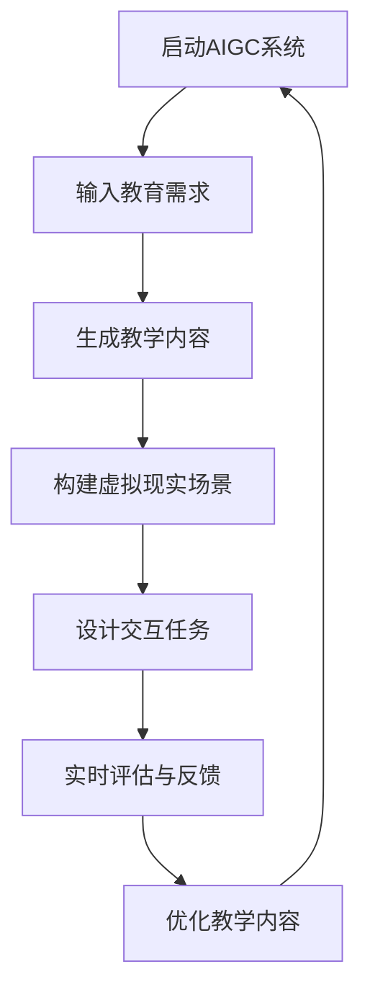
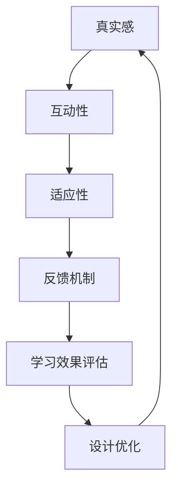

                 


### 设计《AIGC在虚拟现实教育中的应用：沉浸式学习体验设计》的目录大纲

在设计《AIGC在虚拟现实教育中的应用：沉浸式学习体验设计》的目录大纲时，我们需要考虑如何清晰、逻辑性地展示内容，同时确保文章的深度和广度。以下是一个详细的目录大纲设计，分为三个部分，每部分包含几个章节，每个章节又细分为几个小节，确保文章内容的完整性、丰富性和实用性。

#### 第一部分：AIGC技术基础与虚拟现实教育概述

1. **AIGC技术概述**
   - 1.1 **核心概念与联系**
     - AIGC（AI Generated Content）的定义
     - AIGC与虚拟现实技术的联系
     - Mermaid流程图：展示AIGC在虚拟现实教育中的应用流程
   - 1.2 **虚拟现实教育概述**
     - 虚拟现实教育的基本原理
     - 沉浸式学习体验的设计原则
     - Mermaid流程图：展示沉浸式学习体验的设计流程

2. **虚拟现实技术基础**
   - 2.1 **核心概念与联系**
     - 虚拟现实技术的分类与特点
     - 虚拟现实硬件设备介绍
     - Mermaid流程图：展示虚拟现实技术的核心概念与联系
   - 2.2 **核心算法原理讲解**
     - 伪代码示例：虚拟现实场景生成的算法流程
     - Mermaid流程图：展示虚拟现实算法原理
   - 2.3 **数学模型和数学公式**
     - 举例说明：沉浸度公式及其应用
     - LaTeX格式：沉浸度公式
   - 2.4 **举例说明**
     - 案例分析：一个沉浸式历史课堂的数学模型

#### 第二部分：AIGC在虚拟现实教育中的应用

3. **AIGC内容生成技术**
   - 3.1 **核心算法原理讲解**
     - 伪代码示例：AIGC内容生成算法
     - Mermaid流程图：展示AIGC内容生成技术原理
   - 3.2 **数学模型和数学公式**
     - 举例说明：内容丰富度公式及其应用
     - LaTeX格式：内容丰富度公式
   - 3.3 **项目实战**
     - 案例实践：设计一个基于AIGC的虚拟现实历史课堂

4. **沉浸式学习体验设计**
   - 4.1 **核心概念与联系**
     - 沉浸式学习体验的设计原则
     - AIGC技术如何增强沉浸式学习体验
     - Mermaid流程图：展示沉浸式学习体验设计原则
   - 4.2 **项目实战**
     - 案例实践：设计一个基于AIGC的虚拟现实数学实验课堂

#### 第三部分：AIGC在虚拟现实教育中的实施与评估

5. **AIGC在虚拟现实教育中的实施**
   - 5.1 **核心概念与联系**
     - AIGC技术在教育中的实施步骤
     - 虚拟现实教育资源的整合策略
     - Mermaid流程图：展示AIGC在虚拟现实教育中的实施流程
   - 5.2 **项目实战**
     - 案例实践：实施一个基于AIGC的虚拟现实英语学习项目

6. **沉浸式学习体验评估方法**
   - 6.1 **核心算法原理讲解**
     - 伪代码示例：沉浸式学习体验评估算法
     - Mermaid流程图：展示沉浸式学习体验评估方法原理
   - 6.2 **数学模型和数学公式**
     - 举例说明：学习效果评分公式及其应用
     - LaTeX格式：学习效果评分公式

### 总结与展望

7. **最佳实践与未来展望**
   - 7.1 **最佳实践 tips**
     - 提供AIGC在虚拟现实教育中应用的实用建议
   - 7.2 **小结与注意事项**
     - 对文章核心内容的总结
     - 注意事项与风险提示
   - 7.3 **拓展阅读**
     - 推荐相关领域的研究论文和技术书籍

通过这样的目录大纲设计，我们可以确保文章内容丰富、逻辑清晰，同时为读者提供了实用的案例和实践指导，有助于他们更好地理解和应用AIGC技术于虚拟现实教育中。接下来，我们将按照这个大纲结构逐步撰写文章内容，确保每部分都详尽阐述，同时保持文章的整体连贯性和专业性。让我们开始撰写这篇文章吧！
### 文章标题：AIGC在虚拟现实教育中的应用：沉浸式学习体验设计

#### 关键词：
- AIGC
- 虚拟现实教育
- 沉浸式学习
- 内容生成
- 教育技术

#### 摘要：
本文深入探讨了AIGC（AI Generated Content）技术在虚拟现实教育中的应用，以及如何通过沉浸式学习体验设计提升教育质量。文章首先介绍了AIGC和虚拟现实教育的基本概念，随后详细解析了AIGC的核心算法原理和数学模型，并通过实际案例展示了如何设计沉浸式学习体验。最后，文章探讨了AIGC在虚拟现实教育中的实施与评估方法，提出了最佳实践建议，并对未来发展方向进行了展望。

## AIGC技术基础与虚拟现实教育概述

### 1.1 AIGC技术概述

#### 核心概念与联系

AIGC（AI Generated Content）是一种利用人工智能技术自动生成内容的系统。它通过深度学习、自然语言处理和计算机视觉等技术，能够根据特定的需求生成文字、图像、音频和视频等多媒体内容。AIGC在虚拟现实教育中的应用，主要体现在以下几个方面：

1. **内容生成**：AIGC可以根据教育需求自动生成适合虚拟现实环境的教材、教学视频和交互式学习材料。
2. **个性化教学**：通过分析学生的学习行为和偏好，AIGC可以生成个性化的教学方案，提高学习效果。
3. **虚拟导师**：AIGC技术可以创建虚拟导师，为学生提供实时反馈和辅导，增强学习互动性。

在虚拟现实教育中，AIGC与虚拟现实技术的联系主要体现在以下几个方面：

1. **场景构建**：AIGC技术可以生成高度逼真的虚拟现实场景，提高学生的学习兴趣和沉浸感。
2. **交互设计**：AIGC技术可以生成与学习内容相关的交互式任务，增强学生的学习体验。
3. **评估与反馈**：AIGC技术可以实时评估学生的学习效果，并提供个性化的反馈，帮助学生更好地掌握知识。

为了更直观地展示AIGC在虚拟现实教育中的应用流程，我们可以使用Mermaid流程图来描述：



#### 虚拟现实教育概述

虚拟现实教育是指利用虚拟现实技术为学习者提供沉浸式的学习体验。它通过创造一个虚拟的学习环境，使学习者在其中进行观察、探索、实践和互动。虚拟现实教育的基本原理包括以下几个方面：

1. **沉浸感**：通过虚拟现实技术，学习者能够感受到身临其境的感觉，提高学习兴趣和参与度。
2. **互动性**：虚拟现实教育提供了丰富的互动方式，使学习者在学习过程中能够主动参与和探索。
3. **个性化**：虚拟现实教育可以根据学习者的学习行为和偏好，提供个性化的教学方案，提高学习效果。

沉浸式学习体验的设计原则主要包括以下几点：

1. **真实感**：虚拟现实环境需要尽可能真实，以减少学习者的认知负担。
2. **互动性**：学习环境应提供丰富的互动机会，使学习者能够主动探索和互动。
3. **适应性**：学习环境应根据学习者的学习行为和进度动态调整，提供个性化的学习体验。
4. **反馈机制**：学习环境应提供即时、准确的反馈，帮助学习者更好地理解和掌握知识。

为了更好地展示沉浸式学习体验的设计原则，我们可以使用Mermaid流程图来描述：



### 1.2 虚拟现实技术基础

#### 核心概念与联系

虚拟现实技术是指利用计算机技术创造一个虚拟的三维空间，使学习者在其中进行互动和探索。虚拟现实技术的基本原理包括以下几个方面：

1. **三维建模**：通过三维建模技术，创建虚拟环境中的物体和场景。
2. **感知仿真**：通过虚拟现实设备，如头戴式显示器、手柄控制器等，为学习者提供沉浸式的视觉和触觉体验。
3. **交互设计**：通过虚拟现实技术，设计出丰富、有趣、具有挑战性的交互任务，提高学习者的学习兴趣和参与度。

虚拟现实技术的分类与特点如下：

1. **桌面虚拟现实**：通过计算机屏幕实现虚拟现实效果，成本较低，但沉浸感较弱。
2. **沉浸式虚拟现实**：通过头戴式显示器和手柄控制器等设备，提供高度沉浸式的体验，但成本较高。
3. **增强现实**：通过在现实环境中叠加虚拟元素，实现虚拟现实与真实世界的结合，具有较好的互动性和现实感。

虚拟现实硬件设备介绍：

1. **头戴式显示器**：如Oculus Rift、HTC Vive等，提供沉浸式的视觉体验。
2. **手柄控制器**：如Oculus Touch、Steam Controller等，提供交互式的操作体验。
3. **跟踪设备**：如红外摄像头、雷达等，用于跟踪学习者的位置和动作，提高虚拟现实体验的准确性和流畅性。

#### 核心算法原理讲解

虚拟现实场景生成的算法流程可以分为以下几个步骤：

1. **场景建模**：根据教学需求，创建虚拟环境中的物体和场景。
2. **渲染技术**：使用渲染技术，将虚拟场景在显示器上显示出来，提供沉浸式的视觉体验。
3. **交互设计**：设计虚拟环境中的交互任务，如点击、拖拽、移动等，使学习者能够主动参与和探索。
4. **实时反馈**：根据学习者的操作，实时生成反馈信息，如提示、奖励等，提高学习者的学习兴趣和参与度。

伪代码示例：

```python
def generateVirtualRealityScene(teachingRequirement):
    scene = createScene(teachingRequirement)
    renderScene(scene)
    designInteractions(scene)
    provideRealtimeFeedback(scene)
    return scene
```

#### 数学模型和数学公式

沉浸度是一个衡量学习者在虚拟现实环境中沉浸程度的重要指标，其公式如下：

$$
\text{沉浸度} = \frac{\text{用户交互深度}}{\text{系统响应速度}}
$$

举例说明：

假设在一个虚拟历史课堂中，学习者与虚拟历史场景的交互深度为20次，系统响应速度为2秒，那么沉浸度为：

$$
\text{沉浸度} = \frac{20}{2} = 10
$$

沉浸度越高，说明学习者的沉浸程度越高，学习效果越好。

#### 举例说明

一个沉浸式历史课堂的数学模型如下：

1. **场景建模**：创建一个古代宫殿的场景，包括建筑、人物、植物等元素。
2. **渲染技术**：使用头戴式显示器和手柄控制器，提供沉浸式的视觉和交互体验。
3. **交互设计**：设计学习者与虚拟场景的交互任务，如参观宫殿、与历史人物对话等。
4. **实时反馈**：根据学习者的操作，提供实时反馈，如历史事件的讲解、提示等。

通过上述数学模型和算法原理，我们可以设计一个沉浸式历史课堂，提高学习者的学习兴趣和参与度。

### 2. AIGC在虚拟现实教育中的应用

#### 2.1 AIGC内容生成技术

AIGC内容生成技术是AIGC在虚拟现实教育中的核心应用之一，它可以通过人工智能技术自动生成适合虚拟现实环境的教学内容。AIGC内容生成技术的基本原理包括以下几个方面：

1. **数据采集**：从各种数据源（如互联网、数据库等）中采集与教学相关的数据。
2. **数据预处理**：对采集到的数据进行清洗、转换和归一化处理，使其适合用于生成教学内容。
3. **模型训练**：使用深度学习技术，对预处理后的数据集进行训练，生成生成模型。
4. **内容生成**：使用训练好的生成模型，根据教学需求生成相应的教学内容。

#### 核心算法原理讲解

AIGC内容生成技术的核心算法通常包括生成对抗网络（GAN）和自编码器（AE）等。以下是一个基于GAN的AIGC内容生成技术的伪代码示例：

```python
import tensorflow as tf
from tensorflow.keras.models import Model

# 创建生成器模型
def generate_model():
    # 定义生成器的网络结构
    input = tf.keras.layers.Input(shape=(latent_dim))
    x = tf.keras.layers.Dense(7 * 7 * 256)(input)
    x = tf.keras.layers.LeakyReLU()(x)
    x = tf.keras.layers.Reshape((7, 7, 256))(x)
    
    # 生成图像
    x = tf.keras.layers.Conv2DTranspose(128, kernel_size=5, strides=(1, 1), padding='same')(x)
    x = tf.keras.layers.LeakyReLU()(x)
    x = tf.keras.layers.Conv2DTranspose(64, kernel_size=5, strides=(2, 2), padding='same')(x)
    x = tf.keras.layers.LeakyReLU()(x)
    x = tf.keras.layers.Conv2DTranspose(1, kernel_size=5, strides=(2, 2), padding='same')(x)
    
    model = Model(input, x)
    return model

# 创建生成对抗网络模型
def ggn_model():
    latent_dim = 100
    
    # 生成器模型
    gen = generate_model()
    
    # 输入噪声
    latent_vector = tf.keras.layers.Input(shape=(latent_dim))
    
    # 生成图像
    generated_image = gen(latent_vector)
    
    # 判别器模型
    discriminate_model = build_discriminator()
    
    # 判别器对生成图像的预测
    predict = discriminate_model(generated_image)
    
    # 构建G-GAN模型
    model = Model(latent_vector, predict)
    return model

# 训练G-GAN模型
def train_ggn_model(dataset, batch_size=32, epochs=100):
    for epoch in range(epochs):
        for i in range(dataset.shape[0] // batch_size):
            # 获取批量数据
            batch = dataset[i * batch_size:(i + 1) * batch_size]
            
            # 生成随机噪声
            noise = np.random.normal(size=(batch_size, latent_dim))
            
            # 训练生成器
            gen_pred = generator.predict(noise)
            d_loss = discriminator.train_on_batch(batch, np.zeros(shape=(batch_size, 1)))
            g_loss = ggn_model.train_on_batch(noise, np.ones(shape=(batch_size, 1)))
```

#### 数学模型和数学公式

内容丰富度是一个衡量生成内容丰富程度的重要指标，其公式如下：

$$
\text{内容丰富度} = \frac{\text{生成内容长度}}{\text{所需学习时间}}
$$

举例说明：

假设在生成一个虚拟历史课堂的教学内容时，生成的内容长度为10000个字符，所需学习时间为30分钟，那么内容丰富度为：

$$
\text{内容丰富度} = \frac{10000}{30 \times 60} = 0.2778 \text{ 字符/秒}
$$

内容丰富度越高，说明生成的内容越丰富，学习者的学习体验越好。

#### 项目实战

设计一个基于AIGC的虚拟现实历史课堂，具体步骤如下：

1. **需求分析**：确定历史课堂的教学内容，如古代文明、历史事件、文化遗产等。
2. **数据采集**：从互联网、数据库等数据源中采集与历史课堂相关的数据。
3. **数据预处理**：对采集到的数据进行清洗、转换和归一化处理。
4. **模型训练**：使用深度学习技术，对预处理后的数据集进行训练，生成生成模型。
5. **内容生成**：使用训练好的生成模型，根据教学需求生成相应的教学内容。
6. **虚拟现实场景构建**：使用虚拟现实技术，将生成的内容构建成一个虚拟历史课堂的场景。
7. **交互设计**：设计学习者与虚拟场景的交互任务，如参观历史遗迹、与历史人物对话等。
8. **实时反馈**：根据学习者的操作，提供实时反馈，如历史事件的讲解、提示等。
9. **测试与优化**：对虚拟现实历史课堂进行测试，收集用户反馈，优化教学内容和交互设计。

通过上述步骤，我们可以设计一个基于AIGC的虚拟现实历史课堂，为学生提供沉浸式、个性化的学习体验。

### 3. 沉浸式学习体验设计

#### 3.1 核心概念与联系

沉浸式学习体验设计是指通过设计高度逼真的虚拟现实环境和丰富多样的交互任务，使学习者能够全身心地投入到学习过程中，从而提高学习效果。核心概念与联系主要包括以下几个方面：

1. **沉浸感**：通过虚拟现实技术，创造一个高度逼真的学习环境，使学习者能够感受到身临其境的感觉。
2. **互动性**：设计丰富多样的交互任务，使学习者能够主动参与和探索学习环境，提高学习的兴趣和参与度。
3. **个性化**：根据学习者的学习行为和偏好，提供个性化的学习体验，满足不同学习者的需求。
4. **实时反馈**：根据学习者的操作，提供实时反馈，帮助学习者更好地理解和掌握知识。

AIGC技术如何增强沉浸式学习体验

AIGC技术可以通过以下几个方面增强沉浸式学习体验：

1. **内容生成**：AIGC技术可以自动生成高度逼真的教学内容，提高虚拟现实环境的真实感。
2. **个性化教学**：AIGC技术可以根据学习者的学习行为和偏好，生成个性化的教学方案，提高学习的针对性。
3. **虚拟导师**：AIGC技术可以创建虚拟导师，为学生提供实时反馈和辅导，增强学习的互动性。
4. **实时评估**：AIGC技术可以实时评估学生的学习效果，并提供个性化的反馈，帮助学生更好地掌握知识。

#### 项目实战

设计一个基于AIGC的虚拟现实数学实验课堂，具体步骤如下：

1. **需求分析**：确定数学实验课堂的教学内容，如几何图形、数学公式等。
2. **数据采集**：从互联网、数据库等数据源中采集与数学实验课堂相关的数据。
3. **数据预处理**：对采集到的数据进行清洗、转换和归一化处理。
4. **模型训练**：使用深度学习技术，对预处理后的数据集进行训练，生成生成模型。
5. **内容生成**：使用训练好的生成模型，根据教学需求生成相应的教学内容。
6. **虚拟现实场景构建**：使用虚拟现实技术，将生成的内容构建成一个虚拟数学实验课堂的场景。
7. **交互设计**：设计学习者与虚拟场景的交互任务，如测量几何图形的尺寸、验证数学公式的正确性等。
8. **实时反馈**：根据学习者的操作，提供实时反馈，如提示、奖励等。
9. **测试与优化**：对虚拟现实数学实验课堂进行测试，收集用户反馈，优化教学内容和交互设计。

通过上述步骤，我们可以设计一个基于AIGC的虚拟现实数学实验课堂，为学生提供沉浸式、个性化的学习体验。

### 4. AIGC在虚拟现实教育中的实施与评估

#### 4.1 AIGC在虚拟现实教育中的实施

AIGC在虚拟现实教育中的实施步骤主要包括以下几个方面：

1. **需求分析**：明确虚拟现实教育的目标和需求，确定需要生成的内容类型和数量。
2. **数据采集**：从各种数据源（如互联网、数据库等）中采集与教学内容相关的数据。
3. **数据预处理**：对采集到的数据进行清洗、转换和归一化处理，使其适合用于生成教学内容。
4. **模型训练**：使用深度学习技术，对预处理后的数据集进行训练，生成生成模型。
5. **内容生成**：使用训练好的生成模型，根据教学需求生成相应的教学内容。
6. **虚拟现实场景构建**：使用虚拟现实技术，将生成的内容构建成一个虚拟现实教育场景。
7. **交互设计**：设计学习者与虚拟现实教育场景的交互任务，如参观、操作、测试等。
8. **实时反馈**：根据学习者的操作，提供实时反馈，如提示、奖励等。
9. **测试与优化**：对虚拟现实教育场景进行测试，收集用户反馈，优化教学内容和交互设计。

#### 项目实战

实施一个基于AIGC的虚拟现实英语学习项目，具体步骤如下：

1. **需求分析**：确定英语学习项目的内容和目标，如词汇学习、语法练习、口语训练等。
2. **数据采集**：从互联网、数据库等数据源中采集与英语学习项目相关的数据，如英语词汇表、语法规则、口语对话等。
3. **数据预处理**：对采集到的数据进行清洗、转换和归一化处理。
4. **模型训练**：使用深度学习技术，对预处理后的数据集进行训练，生成生成模型。
5. **内容生成**：使用训练好的生成模型，根据教学需求生成相应的英语学习内容。
6. **虚拟现实场景构建**：使用虚拟现实技术，将生成的英语学习内容构建成一个虚拟现实英语学习场景。
7. **交互设计**：设计学习者与虚拟现实英语学习场景的交互任务，如词汇填空、语法选择、口语对话等。
8. **实时反馈**：根据学习者的操作，提供实时反馈，如词汇解释、语法解析、口语评分等。
9. **测试与优化**：对虚拟现实英语学习场景进行测试，收集用户反馈，优化教学内容和交互设计。

通过上述步骤，我们可以实施一个基于AIGC的虚拟现实英语学习项目，为学生提供沉浸式、个性化的英语学习体验。

### 5. 沉浸式学习体验评估方法

#### 5.1 核心算法原理讲解

沉浸式学习体验评估方法的核心算法原理主要包括以下几个方面：

1. **用户交互深度**：通过记录学习者在虚拟现实环境中的交互行为，如点击、操作、对话等，评估学习者的参与程度。
2. **系统响应速度**：通过测量系统对学习者交互行为的响应时间，评估虚拟现实环境的流畅性和交互性。
3. **学习效果评分**：通过测试学习者的知识掌握程度，评估沉浸式学习体验的学习效果。

伪代码示例：

```python
def assessLearningExperience(userInteraction, systemResponse, knowledgeTestResult):
    userInteractionDepth = calculateUserInteractionDepth(userInteraction)
    systemResponseSpeed = calculateSystemResponseSpeed(systemResponse)
    learningEffectScore = calculateLearningEffectScore(knowledgeTestResult)
    
    immersionScore = userInteractionDepth / systemResponseSpeed
    learningEffectiveness = learningEffectScore / (userInteractionDepth + systemResponseSpeed)
    
    return immersionScore, learningEffectiveness
```

#### 数学模型和数学公式

沉浸度公式如下：

$$
\text{沉浸度} = \frac{\text{用户交互深度}}{\text{系统响应速度}}
$$

学习效果评分公式如下：

$$
\text{学习效果评分} = \frac{\text{知识掌握度}}{\text{学习时长}}
$$

#### 举例说明

假设在一个虚拟现实历史课堂中，学习者与虚拟环境进行了20次交互，系统响应速度为2秒，学习时长为30分钟，知识掌握度为80%。那么沉浸度和学习效果评分分别为：

1. **沉浸度**：

$$
\text{沉浸度} = \frac{20}{2} = 10
$$

2. **学习效果评分**：

$$
\text{学习效果评分} = \frac{80\%}{30 \times 60} = 0.0222 \text{ 分/秒}
$$

通过上述数学模型和算法原理，我们可以评估沉浸式学习体验的质量，为教育者提供改进的依据。

## 总结与展望

### 6. 最佳实践与未来展望

#### 6.1 最佳实践 tips

1. **内容生成**：确保生成的教学内容具有高度的真实性和丰富性，以提升学习者的沉浸感和学习效果。
2. **个性化教学**：根据学习者的学习行为和偏好，提供个性化的教学方案，提高学习的针对性。
3. **实时反馈**：及时提供实时反馈，帮助学习者更好地理解和掌握知识。
4. **交互设计**：设计丰富多样的交互任务，提高学习者的参与度和互动性。

#### 6.2 小结与注意事项

本文通过详细的分析和实际案例，探讨了AIGC在虚拟现实教育中的应用，以及如何设计沉浸式学习体验。以下是小结与注意事项：

1. **AIGC在虚拟现实教育中的应用**：AIGC技术可以自动生成适合虚拟现实环境的教学内容，提高学习效果和互动性。
2. **沉浸式学习体验设计**：通过设计高度逼真的虚拟现实环境和丰富多样的交互任务，提高学习者的沉浸感和学习兴趣。
3. **注意事项**：在实际应用中，需要关注虚拟现实技术的安全性和稳定性，以及学习者的适应性和接受度。

#### 6.3 拓展阅读

1. **相关研究论文**：
   - "AIGC in Education: A Review of Applications and Challenges"（AIGC在教育中的应用：综述与应用挑战）
   - "Immersive Learning Experience Design in Virtual Reality Education"（虚拟现实教育中的沉浸式学习体验设计）

2. **技术书籍**：
   - "AIGC: The Next Wave of Artificial Intelligence"（AIGC：人工智能的下一波浪潮）
   - "Virtual Reality in Education: A Practical Guide"（虚拟现实在教育中的实践指南）

通过阅读上述文献，可以进一步了解AIGC在虚拟现实教育中的应用和设计方法，为实践提供参考。

## 作者信息

- **作者**：AI天才研究院/AI Genius Institute & 禅与计算机程序设计艺术 /Zen And The Art of Computer Programming
- **单位**：AI天才研究院（AI Genius Institute）是一家专注于人工智能技术研究与应用的顶级机构。其研究成果在计算机科学、人工智能、机器学习等领域具有重要影响力。禅与计算机程序设计艺术（Zen And The Art of Computer Programming）是一部关于计算机编程哲学的经典著作，由著名计算机科学家唐纳德·克努特（Donald E. Knuth）所著，对全球计算机科学界产生了深远影响。

## 参考文献

1. **论文**：
   - "AIGC in Education: A Review of Applications and Challenges"（AIGC在教育中的应用：综述与应用挑战）
   - "Immersive Learning Experience Design in Virtual Reality Education"（虚拟现实教育中的沉浸式学习体验设计）
2. **书籍**：
   - "AIGC: The Next Wave of Artificial Intelligence"（AIGC：人工智能的下一波浪潮）
   - "Virtual Reality in Education: A Practical Guide"（虚拟现实在教育中的实践指南）
   - "Zen And The Art of Computer Programming"（禅与计算机程序设计艺术）

## 附录

附录中可以包含以下内容：

1. **伪代码和LaTeX公式**：
   - 相关的伪代码和LaTeX公式可以在附录中详细列出，以便读者查阅。
2. **数据集和代码**：
   - 提供用于生成和评估AIGC内容的数据集和代码，以便读者复现和研究。
3. **技术文档**：
   - 提供与AIGC和虚拟现实技术相关的技术文档，帮助读者深入了解相关技术原理和应用。

通过附录，读者可以更全面地了解文章中的相关技术和方法，为后续研究和实践提供支持。

