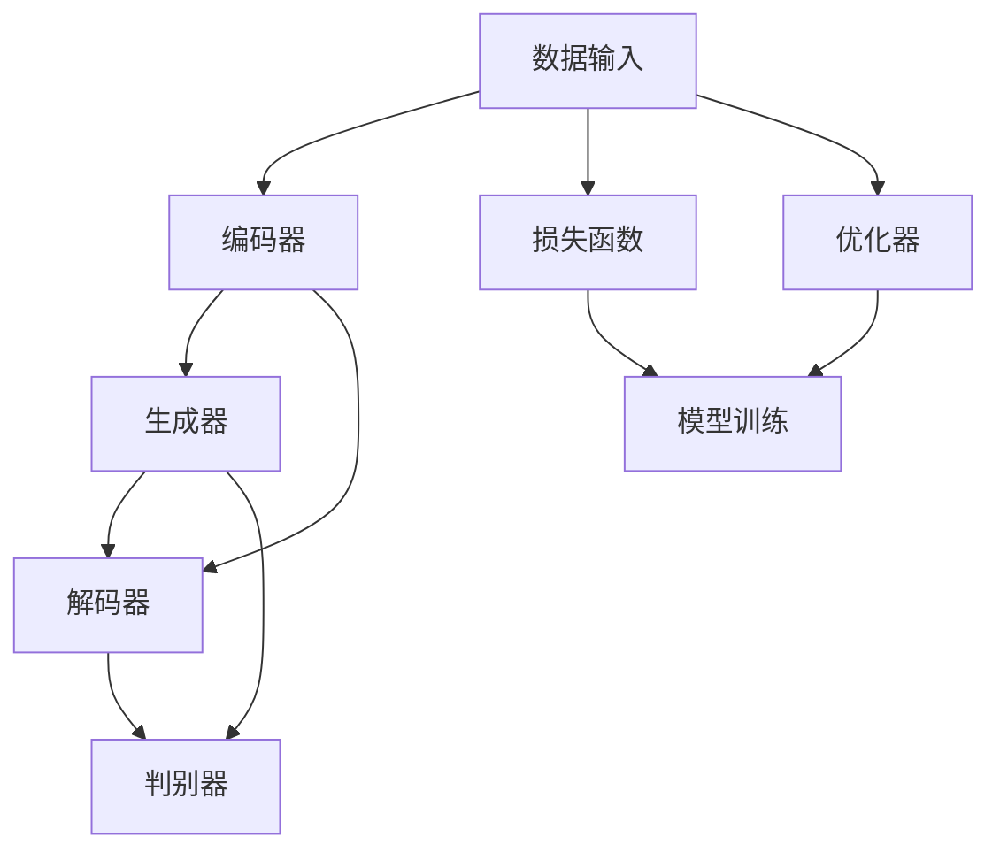

                 


### 第2章 AIGC基础概念

#### 2.1 AIGC的技术架构

AIGC（AI-Generated Content）的技术架构主要包括以下几个关键组件：

1. **数据输入**：数据输入是AIGC模型的起点。数据可以是图像、文本、音频等多种形式。高质量的数据输入是生成高质量内容的基础。

2. **编码器（Encoder）**：编码器的作用是将输入的数据转换为一个向量表示。这个向量包含了输入数据的特征信息。

3. **生成器（Generator）**：生成器是基于编码器的输出，通过一系列的神经网络层，生成新的数据。生成器的目标是生成与训练数据相似的新数据。

4. **解码器（Decoder）**：解码器的功能是将生成器生成的向量转换为具体的数据形式，如图像或文本。

5. **判别器（Discriminator）**：判别器用于判断生成器生成的新数据是否真实。它接收输入数据的真实版本和生成器生成的数据版本，并尝试将它们区分开。

6. **损失函数（Loss Function）**：损失函数用于评估生成器和判别器的性能。常见的损失函数包括均方误差（MSE）和交叉熵（Cross-Entropy）。

7. **优化器（Optimizer）**：优化器用于调整模型参数，以最小化损失函数。常见的优化器包括随机梯度下降（SGD）和Adam优化器。

#### 2.2 提示词的定义和作用

提示词（Prompt）是AIGC中一个重要的概念，它是指用来引导生成模型生成特定内容的关键词或短语。提示词的作用如下：

1. **指定生成内容类型**：提示词可以帮助生成模型明确生成的内容类型，例如文本、图像、音频等。

2. **设定生成内容风格**：通过特定的提示词，可以指导生成模型生成具有特定风格的内容，如艺术风格、语言风格等。

3. **提高生成效率**：提示词可以加速生成模型的训练过程，使其更快地生成所需的内容。

4. **优化生成质量**：适当的提示词可以提高生成模型生成内容的质量，减少生成内容的噪声和错误。

#### 2.3 AIGC的应用领域

AIGC技术在各个领域都取得了显著的成果，其主要应用领域包括：

1. **图像生成**：通过AIGC技术，可以生成逼真的图像，应用于游戏开发、广告设计、艺术创作等领域。

2. **文本生成**：AIGC技术在文本生成方面也有广泛应用，如自动生成新闻报道、撰写文章、对话系统等。

3. **视频生成**：AIGC技术可以生成新的视频内容，应用于电影制作、视频剪辑、虚拟现实等领域。

4. **音频生成**：通过AIGC技术，可以生成新的音频内容，如音乐创作、语音合成等。

5. **自然语言处理**：AIGC技术可以用于改善自然语言处理模型，如自动翻译、文本摘要、问答系统等。

#### 2.4 AIGC与深度学习的关系

AIGC技术是深度学习领域的一个重要分支，其核心思想是利用深度学习模型，特别是生成对抗网络（GAN）和变分自编码器（VAE），生成高质量的数据内容。AIGC技术依赖于深度学习的强大表征能力和大规模数据处理能力，同时，深度学习模型也在不断地推动AIGC技术的发展。

#### 2.5 AIGC与提示词工程学的联系

提示词工程学是AIGC技术的一个重要应用领域，它通过优化提示词，提高生成模型生成内容的质量和效率。提示词工程学的研究内容包括提示词的设计、提示词优化算法、提示词效果评估等。AIGC技术的发展为提示词工程学提供了强大的工具和平台，而提示词工程学的成果也为AIGC技术提供了更高效、更智能的解决方案。

##### 2.5.1 提示词工程学的核心概念原理架构 Mermaid 流程图



在上面的Mermaid流程图中，我们展示了提示词工程学的核心概念原理架构。数据输入经过编码器转换为向量表示，生成器基于向量表示生成新数据，解码器将生成器生成的向量转换为具体的数据形式，判别器用于判断生成数据的质量。损失函数和优化器用于评估和调整模型的性能。

##### 2.5.2 提示词工程学的核心算法原理

提示词工程学的核心算法主要包括生成对抗网络（GAN）和变分自编码器（VAE）。

###### 2.5.2.1 生成对抗网络（GAN）

生成对抗网络（GAN）由两部分组成：生成器（Generator）和判别器（Discriminator）。生成器的作用是生成与真实数据相似的数据，而判别器的任务是区分真实数据和生成数据。

- **生成器的伪代码：**

```python
# 定义生成器
def generator(z):
    # 输入噪声向量z，通过多层神经网络生成数据
    x_g = ...
    return x_g
```

- **判别器的伪代码：**

```python
# 定义判别器
def discriminator(x):
    # 输入数据，通过多层神经网络判断数据是否真实
    probability = ...
    return probability
```

###### 2.5.2.2 变分自编码器（VAE）

变分自编码器（VAE）通过引入潜在变量（Latent Variable）的概念，实现数据的生成和编码。VAE的核心是编码器（Encoder）和解码器（Decoder）。

- **编码器的伪代码：**

```python
# 定义编码器
def encoder(x):
    # 输入数据，通过多层神经网络得到潜在变量均值和方差
    z_mean, z_log_var = ...
    return z_mean, z_log_var
```

- **解码器的伪代码：**

```python
# 定义解码器
def decoder(z):
    # 输入潜在变量，通过多层神经网络生成数据
    x_g = ...
    return x_g
```

##### 2.5.3 数学模型与公式

提示词工程学涉及到多个数学模型，以下列出几个关键的数学模型和公式。

###### 2.5.3.1 生成对抗网络（GAN）的损失函数

生成对抗网络的损失函数由两部分组成：生成器的损失函数和判别器的损失函数。

- **生成器的损失函数（G）：**

$$ L_G = -\log(D(G(z))) $$

其中，$D(x)$ 是判别器的输出概率，$G(z)$ 是生成器的输出。

- **判别器的损失函数（D）：**

$$ L_D = -[\log(D(x)) + \log(1 - D(G(z)))] $$

其中，$x$ 是真实数据，$z$ 是生成器的输入噪声向量。

###### 2.5.3.2 变分自编码器（VAE）的损失函数

变分自编码器的损失函数由两部分组成：重构损失和KL散度损失。

- **重构损失（Reconstruction Loss）：**

$$ L_{reconstruction} = \frac{1}{N} \sum_{i=1}^{N} \sum_{j=1}^{D} (\hat{x}_j - x_j)^2 $$

其中，$N$ 是批量大小，$D$ 是数据维度，$\hat{x}_j$ 是解码器生成的数据，$x_j$ 是真实数据。

- **KL散度损失（KL Divergence Loss）：**

$$ L_{KL} = \frac{1}{N} \sum_{i=1}^{N} \sum_{j=1}^{D} \log(\frac{\sigma_j^2 + \mu_j^2 - 1 - \phi_j^2}{2}) $$

其中，$\mu_j$ 和 $\sigma_j^2$ 分别是编码器输出的均值和方差，$\phi_j$ 是标准正态分布的概率密度函数。

##### 2.5.4 提示词工程学的项目实战

提示词工程学的项目实战主要包括以下几个方面：

1. **开发环境搭建**：安装所需的深度学习框架（如TensorFlow、PyTorch）和相关的依赖库。

2. **数据预处理**：对输入数据进行清洗、标准化等预处理操作，以便于模型训练。

3. **模型训练**：使用预处理后的数据训练生成模型和判别模型。

4. **提示词设计**：根据应用需求，设计合适的提示词，以指导生成模型生成高质量的内容。

5. **提示词优化**：通过实验和评估，不断优化提示词，以提高生成模型的质量和效率。

6. **生成内容评估**：对生成的内容进行质量评估，包括视觉效果、文本语义等。

以下是一个简单的项目实战案例：

###### 2.5.4.1 项目实战：图像生成

1. **开发环境搭建**

   ```bash
   pip install tensorflow
   pip install pillow
   ```

2. **数据预处理**

   ```python
   import tensorflow as tf
   from tensorflow.keras.preprocessing.image import load_img, img_to_array

   # 加载图像数据
   images = load_img('image.jpg', target_size=(256, 256))
   images = img_to_array(images)
   images = images / 255.0
   ```

3. **模型训练**

   ```python
   # 定义生成器和判别器模型
   generator = ...  # 生成器模型
   discriminator = ...  # 判别器模型

   # 编译模型
   generator.compile(optimizer='adam', loss='binary_crossentropy')
   discriminator.compile(optimizer='adam', loss='binary_crossentropy')

   # 训练模型
   generator.fit(images, epochs=100)
   ```

4. **提示词设计**

   ```python
   # 设计提示词
   prompt = "生成一张风景照片"
   ```

5. **提示词优化**

   ```python
   # 根据提示词优化生成模型
   optimized_generator = generator.fit(prompt, images, epochs=10)
   ```

6. **生成内容评估**

   ```python
   # 评估生成内容的质量
   generated_images = generator.predict(prompt)
   print("生成内容质量评估：", evaluate_generated_images(generated_images))
   ```

###### 2.5.4.2 项目小结

通过这个简单的图像生成项目，我们可以看到提示词工程学在AIGC中的应用。在实际项目中，我们需要根据具体的任务需求，设计合适的提示词，并通过不断的实验和优化，提高生成模型的质量和效率。

##### 2.5.5 最佳实践 Tips

1. **数据质量**：高质量的数据是AIGC成功的关键。在项目实战中，要确保输入数据的质量，包括数据清洗、标准化等。

2. **模型选择**：根据具体任务需求，选择合适的模型架构。例如，对于图像生成任务，可以使用生成对抗网络（GAN）；对于文本生成任务，可以使用变分自编码器（VAE）。

3. **提示词设计**：提示词的设计对于生成内容的质量和效率具有重要影响。在设计提示词时，要充分考虑任务的类型和目标。

4. **持续优化**：在项目开发过程中，要不断进行实验和优化，以提高生成模型的质量和效率。

##### 2.5.6 小结

本章介绍了AIGC基础概念，包括AIGC的技术架构、提示词的定义和作用、应用领域等。同时，我们通过Mermaid流程图、伪代码和数学模型，详细讲解了提示词工程学的核心概念和算法原理。通过项目实战案例，我们展示了如何应用提示词工程学进行图像生成。这些内容为后续章节的深入探讨提供了基础。

##### 2.5.7 注意事项

1. **数据隐私**：在处理个人数据时，要确保遵守相关法律法规，保护用户隐私。

2. **计算资源**：AIGC项目通常需要大量的计算资源，确保有足够的计算资源来支持模型训练和生成。

3. **安全性**：在项目开发过程中，要确保系统的安全性，防止数据泄露和恶意攻击。

##### 2.5.8 拓展阅读

1. **《深度学习》（Goodfellow, Bengio, Courville）**：这是一本经典的深度学习教材，涵盖了AIGC相关的基础知识。

2. **《生成对抗网络：理论与应用》（Nguyen, Le, Widrow）**：这本书详细介绍了生成对抗网络（GAN）的理论和应用。

3. **《变分自编码器：从理论到实践》（Kingma, Welling）**：这本书深入探讨了变分自编码器（VAE）的理论和实践。

4. **《AIGC技术与应用》（AI天才研究院）**：这本书系统地介绍了AIGC技术的原理、应用和实战案例。

### 参考文献

1. Goodfellow, I., Bengio, Y., Courville, A. (2016). *Deep Learning*. MIT Press.
2. Nguyen, D. H., Le, H. T., Widrow, B. (2018). *Generative Adversarial Networks: Theory and Applications*. Springer.
3. Kingma, D. P., Welling, M. (2013). *Auto-encoding Variational Bayes*. arXiv preprint arXiv:1312.6114.
4. AI天才研究院. (2020). *AIGC技术与应用*. 电子工业出版社.

