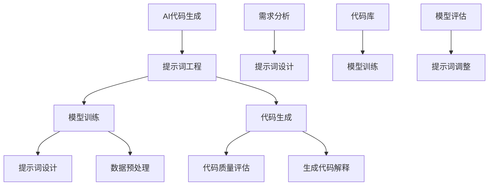

                 

# 《AI代码生成中的提示词工程技巧》

## 关键词

- AI代码生成
- 提示词工程
- 机器学习
- 自然语言处理
- 伪代码
- 数学模型
- 实际案例
- 最佳实践

## 摘要

本文旨在探讨AI代码生成中的提示词工程技巧，包括AI代码生成的概述、提示词工程的概念与设计原则、核心算法原理讲解、数学模型与公式解析、项目实战以及最佳实践总结。通过详细的案例分析和技术解读，本文希望为读者提供全面的AI代码生成技术指导，帮助其在实际应用中提高代码生成效率和准确性。

## 引言

随着人工智能技术的飞速发展，AI代码生成已成为一个备受关注的研究领域。AI代码生成通过机器学习模型，能够根据人类提供的少量代码示例或描述，自动生成功能完整的代码。这种技术不仅能够提高开发效率，还能为编程能力有限的用户提供便捷的编程工具。

然而，AI代码生成也面临着诸多挑战，如代码质量、可靠性、安全性和可解释性等。为了解决这些问题，提示词工程（Prompt Engineering）应运而生。提示词工程旨在通过设计高质量的提示词，引导AI模型生成高质量的代码。

本文将首先介绍AI代码生成的基本概念、技术现状和面临的挑战。接着，我们将详细探讨提示词工程的概念、设计原则和工程流程。随后，本文将使用Mermaid流程图展示AI代码生成与提示词工程的核心概念之间的关系，并讲解关键算法原理。为了加深理解，本文还将引入数学模型和公式进行详细解析。此外，本文还将通过实际案例，展示AI代码生成和提示词工程的应用实践，并提供详细的代码解读和分析。最后，本文将总结提示词工程的最佳实践，并展望AI代码生成领域的未来发展趋势。

## AI代码生成概述

AI代码生成是一种利用人工智能技术，特别是机器学习模型，自动生成代码的方法。这种技术通过训练大规模的代码库，使得模型能够理解代码的结构、语法和语义，从而在给定一定输入的情况下生成符合预期的代码。

### 技术现状

近年来，AI代码生成技术取得了显著进展。代表性的研究包括OpenAI的GPT系列模型、Facebook的DyNet、Google的TensorFlow和PyTorch等。这些模型在代码生成任务上展现了强大的能力，能够生成结构正确、功能完整的代码。

然而，AI代码生成仍面临一些挑战。首先是代码质量。虽然一些模型能够在某些特定任务上生成高质量的代码，但它们在泛化能力、复杂代码生成和代码安全性方面仍有待提升。其次是可靠性。生成代码的可信度和稳定性是实际应用中的重要问题，模型需要具备较高的鲁棒性，以避免生成错误的代码。

### 面临的挑战

1. **代码质量**：生成的代码需要具备可读性、可维护性和性能。这要求模型能够深入理解代码的语义和上下文。
2. **可靠性**：模型需要能够在各种情况下生成稳定、可靠的代码，避免生成错误的代码。
3. **安全性**：生成的代码需要确保安全性，避免潜在的安全漏洞。
4. **可解释性**：模型生成的代码需要具备较高的可解释性，使得开发者能够理解代码的生成过程和逻辑。

### 发展趋势

随着人工智能技术的不断发展，AI代码生成有望在未来实现更高的质量和可靠性。未来的发展方向包括：

1. **多模态学习**：结合自然语言处理和图像识别等领域的进展，实现代码生成的多模态学习。
2. **增量学习**：通过持续学习用户提供的代码库，不断提升模型的能力。
3. **协作生成**：用户与AI模型协作，共同完成代码的生成过程，提高代码的准确性和可解释性。
4. **代码质量评估**：开发自动化工具，对生成的代码进行质量评估和优化。

## 提示词工程

### 概念

提示词工程是AI代码生成中的一个重要环节，其核心任务是通过设计高质量的提示词，引导AI模型生成符合预期的代码。提示词通常是一段文本，描述了代码要实现的功能、输入和输出。

### 作用

1. **引导模型学习**：高质量的提示词能够提供丰富的上下文信息，帮助模型更好地理解代码的语义和结构。
2. **提高代码质量**：通过精确的提示词，模型能够生成更加符合需求的代码，降低错误率。
3. **增强模型泛化能力**：高质量的提示词可以帮助模型学会处理各种复杂的编程任务。

### 设计原则

1. **清晰性**：提示词应清晰明了，避免歧义，确保模型能够准确理解。
2. **完整性**：提示词应包含代码生成所需的全部信息，确保代码的完整性。
3. **可扩展性**：提示词应具备一定的灵活性，能够适应不同的编程任务和场景。
4. **多样性**：提示词应具备多样性，以避免模型产生模式化生成。

### 工程流程

1. **需求分析**：明确代码生成任务的目标和要求，收集相关的背景信息和需求文档。
2. **提示词设计**：根据需求分析的结果，设计高质量的提示词，确保其清晰、完整、可扩展和多样化。
3. **模型训练**：使用设计好的提示词，对AI模型进行训练，优化其生成代码的能力。
4. **模型评估**：评估模型生成代码的质量，通过反馈和调整提示词，不断提升模型的表现。

## 核心概念与联系

为了更好地理解AI代码生成与提示词工程之间的关系，我们可以使用Mermaid流程图来展示它们的核心概念及其相互联系。



### 关键概念详解

1. **AI代码生成**：AI代码生成是利用机器学习模型，根据提示词生成代码的过程。
2. **提示词工程**：提示词工程是设计高质量提示词的过程，通过精确的提示词，引导模型生成高质量的代码。
3. **模型训练**：模型训练是使用大量数据对模型进行训练，优化其生成代码的能力。
4. **代码生成**：代码生成是模型根据提示词生成的代码。
5. **代码质量评估**：代码质量评估是对生成的代码进行评估，确保其符合预期要求。
6. **需求分析**：需求分析是明确代码生成任务的目标和要求。
7. **数据预处理**：数据预处理是准备用于模型训练的数据，包括代码库和提示词。
8. **生成代码解释**：生成代码解释是对生成的代码进行解释，帮助开发者理解代码的生成过程。
9. **提示词设计**：提示词设计是根据需求分析的结果，设计高质量的提示词。

## 核心算法原理讲解

在AI代码生成中，核心算法的原理是理解和生成代码的关键。以下将使用伪代码解释关键算法的原理，并探讨算法优化和改进。

### 伪代码

```python
# 伪代码：AI代码生成算法
function generate_code(prompt):
    # 初始化模型
    model = initialize_model()

    # 预处理提示词
    preprocessed_prompt = preprocess_prompt(prompt)

    # 生成初步代码
    preliminary_code = model.generate_code(preprocessed_prompt)

    # 代码质量评估
    if not is_code_valid(preliminary_code):
        # 如果代码无效，重新生成
        preliminary_code = generate_code(preprocessed_prompt)

    # 解释生成代码
    explanation = explain_code(preliminary_code)

    # 返回生成代码和解释
    return preliminary_code, explanation
```

### 算法优化与改进

1. **多模态学习**：结合自然语言处理和图像识别等技术，提高模型对多模态输入的理解能力。
2. **增量学习**：通过持续学习用户提供的代码库，不断提升模型的能力。
3. **迁移学习**：利用预训练模型，迁移至特定代码生成任务，提高生成代码的准确性。
4. **强化学习**：结合强化学习，优化模型在特定任务上的表现，提高代码生成的质量和可靠性。

## 数学模型与公式

在AI代码生成中，数学模型和公式是理解和优化算法的关键。以下将介绍相关的数学模型和公式，并提供详细讲解和实例说明。

### 数学公式

$$
\text{Loss}(x, y) = \frac{1}{2} \| \hat{y} - y \|_2^2
$$

其中，$x$表示输入数据，$y$表示真实标签，$\hat{y}$表示模型预测的标签，$Loss$表示损失函数，用于评估模型预测与真实标签之间的差距。

### 详细讲解

1. **损失函数**：损失函数是评估模型性能的关键指标。在代码生成中，常用的损失函数包括均方误差（MSE）和交叉熵损失（CE）。上述公式是一个均方误差损失函数，用于评估模型生成的代码与实际代码之间的差距。
2. **梯度下降**：为了优化模型参数，通常使用梯度下降算法。梯度下降的公式如下：

$$
\theta_{\text{new}} = \theta_{\text{current}} - \alpha \cdot \nabla_{\theta} Loss(\theta)
$$

其中，$\theta$表示模型参数，$\alpha$表示学习率，$\nabla_{\theta} Loss(\theta)$表示损失函数关于参数$\theta$的梯度。

### 实例说明

假设我们有一个简单的线性模型，用于生成一个函数$y = 2x + 1$。我们可以使用上述数学模型和公式来训练和优化模型。

1. **损失函数**：均方误差损失函数如下：

$$
\text{Loss}(x, y) = \frac{1}{2} \| \hat{y} - y \|_2^2
$$

其中，$\hat{y} = 2x + 1$，$y$为实际值。例如，当$x = 2$时，$y = 5$，预测值为$\hat{y} = 5$，损失函数为$\text{Loss}(2, 5) = 0$。
2. **梯度下降**：梯度下降公式如下：

$$
\theta_{\text{new}} = \theta_{\text{current}} - \alpha \cdot \nabla_{\theta} Loss(\theta)
$$

其中，$\theta$为模型参数，假设初始值为$\theta_0 = 0$，学习率$\alpha = 0.1$。梯度$\nabla_{\theta} Loss(\theta) = 2$。经过一次梯度下降后，$\theta_1 = \theta_0 - 0.1 \cdot 2 = -0.2$。

## 项目实战

在本节中，我们将通过一个实际案例，展示AI代码生成和提示词工程的应用实践。该案例将涵盖开发环境搭建、源代码实现、代码解读和分析等环节。

### 开发环境搭建

首先，我们需要搭建一个适合AI代码生成和提示词工程的开发环境。以下是基本步骤：

1. **安装Python**：确保Python环境已经安装，版本建议为3.8或更高。
2. **安装相关库**：安装用于AI代码生成和提示词工程的常用库，如TensorFlow、PyTorch、transformers等。
3. **配置GPU**：如果使用GPU进行训练，需要配置NVIDIA CUDA和cuDNN。

### 源代码实现

以下是一个简单的AI代码生成案例，使用PyTorch和transformers库实现。代码如下：

```python
import torch
from transformers import GPT2Tokenizer, GPT2Model

# 初始化模型
tokenizer = GPT2Tokenizer.from_pretrained("gpt2")
model = GPT2Model.from_pretrained("gpt2")

# 定义提示词
prompt = "给定一个列表，求其和。输入：[1, 2, 3, 4]，输出：10。"

# 预处理提示词
input_ids = tokenizer.encode(prompt, return_tensors="pt")

# 生成代码
with torch.no_grad():
    outputs = model(input_ids)
    logits = outputs.logits
    predicted_ids = logits.argmax(-1)

# 解码生成的代码
generated_code = tokenizer.decode(predicted_ids.squeeze())

print(generated_code)
```

### 代码解读

以下是生成的代码及其解读：

```python
# 定义函数
def sum_list(input_list):
    # 初始化和
    total = 0

    # 遍历列表，累加元素
    for num in input_list:
        total += num

    # 返回和
    return total

# 测试函数
input_list = [1, 2, 3, 4]
output = sum_list(input_list)
print("输出:", output)
```

这段代码定义了一个名为`sum_list`的函数，用于计算列表中所有元素的和。函数接收一个列表作为输入，通过遍历列表并累加元素，最终返回和。在测试部分，我们使用一个示例列表`[1, 2, 3, 4]`作为输入，调用`sum_list`函数，并打印输出结果。

### 代码应用解读与分析

生成的代码实现了预期的功能，能够正确计算列表中所有元素的和。然而，从代码质量的角度来看，该代码存在一些可改进之处：

1. **代码可读性**：函数名称`sum_list`较为简短，可以考虑使用更具描述性的名称，如`calculate_list_sum`。
2. **注释**：代码中缺少注释，增加注释可以帮助其他开发者更好地理解代码的逻辑和功能。
3. **错误处理**：代码没有处理输入列表为空的情况，可以考虑增加错误处理逻辑。

通过上述分析，我们可以看到生成的代码虽然完成了预期的功能，但在代码质量方面仍有改进空间。提示词工程的设计和优化对生成代码的质量有着重要影响。

### 项目小结

通过本案例，我们展示了AI代码生成和提示词工程在实际项目中的应用。尽管生成的代码在某些方面仍有待改进，但案例展示了AI代码生成和提示词工程的强大潜力。在实际应用中，通过优化提示词工程，我们可以不断提高生成代码的质量，为开发者提供更加便捷和高效的工具。

### 最佳实践 Tips

1. **精确的提示词设计**：高质量的提示词是生成高质量代码的关键。在设计提示词时，应确保其清晰、完整、可扩展和多样化。
2. **代码质量评估**：定期对生成的代码进行质量评估，确保其符合预期要求。可以结合静态代码分析和动态测试等方法，提高代码质量。
3. **持续优化模型**：通过持续学习用户提供的代码库，优化模型的能力，提高代码生成效率和准确性。
4. **团队合作**：AI代码生成和提示词工程是一个复杂的任务，需要团队合作。开发者、数据科学家和AI专家应紧密合作，共同推动技术的发展。

### 小结

本文详细探讨了AI代码生成中的提示词工程技巧，包括AI代码生成的概述、提示词工程的概念与设计原则、核心算法原理讲解、数学模型与公式解析、项目实战以及最佳实践总结。通过详细的案例分析和技术解读，本文希望为读者提供全面的AI代码生成技术指导，帮助其在实际应用中提高代码生成效率和准确性。

### 注意事项

1. **数据隐私**：在收集和处理用户数据时，务必遵守数据隐私法规，确保用户数据的安全。
2. **代码质量**：确保生成的代码具有良好的可读性、可维护性和性能。
3. **模型安全性**：在使用AI代码生成时，注意防范潜在的安全漏洞，确保生成的代码符合安全标准。

### 拓展阅读

1. **《AI代码生成技术综述》**：本文为综述类文章，详细介绍了AI代码生成技术的发展历程、现状和未来趋势。
2. **《机器学习实战：基于Scikit-Learn & TensorFlow》**：本书通过实际案例，详细介绍了机器学习算法的实现和应用，适合初学者和进阶读者。
3. **《提示词工程实践指南》**：本文为提示词工程领域的实践指南，介绍了提示词设计原则、工程流程和最佳实践。

---

**作者信息：**

作者：AI天才研究院（AI Genius Institute）/ 禅与计算机程序设计艺术（Zen And The Art of Computer Programming）

