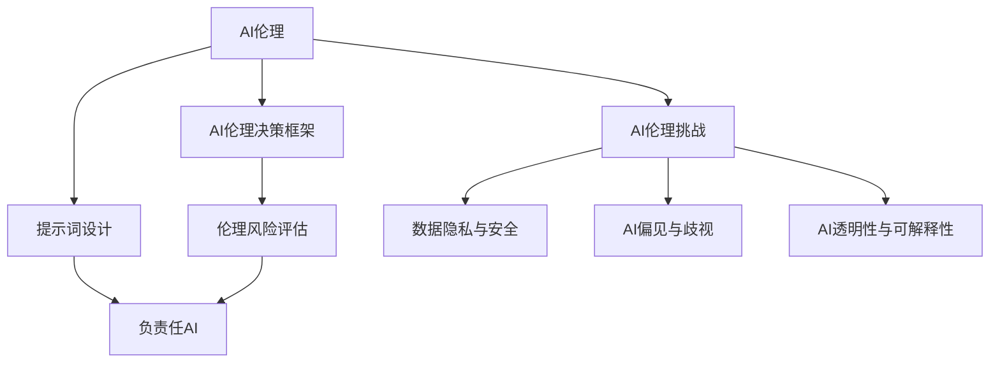

                 


### 书名：《AI伦理与提示词设计：构建负责任的AI系统》

#### 核心章节内容：

1. **AI伦理概述**
    - AI伦理的基本概念与原则
    - 全球AI伦理框架概览
    - 中国AI伦理政策与规范

2. **AI伦理挑战**
    - 数据隐私与安全
    - AI偏见与歧视
    - AI透明性与可解释性

3. **AI伦理决策框架**
    - 伦理决策模型的构建
    - 伦理决策工具的使用
    - 伦理风险评估

4. **提示词设计**
    - 提示词的定义与作用
    - 提示词设计的原则
    - 提示词案例分析

5. **负责任AI系统构建**
    - AI系统设计伦理原则
    - 负责任AI系统的评估
    - 负责任AI系统的实施策略

6. **法律法规与监管**
    - 全球AI法律法规概览
    - 中国AI法律法规与政策
    - AI伦理监管的挑战与趋势

7. **AI伦理教育与培训**
    - AI伦理教育的重要性
    - 伦理培训的内容与方法
    - AI伦理教育的未来方向

#### 核心概念与联系：
首先，我们需要明确文章的核心概念，它们是如何相互关联的。以下是核心概念及其联系：

- **AI伦理**：关注AI的设计、开发和应用过程中的道德和伦理问题。
- **提示词设计**：用于引导AI模型行为的指令性语言，对AI的响应产生重要影响。
- **负责任AI**：在确保AI系统的透明性、公平性、可解释性和可控性的基础上，使其符合社会和伦理标准。

核心概念之间的联系可以用以下Mermaid流程图表示：



这个流程图展示了AI伦理如何影响提示词设计，并进一步影响负责任AI系统的构建。同时，AI伦理挑战部分通过伦理风险评估来确保负责任AI的实现。

#### 核心算法原理讲解：

接下来，我们将讨论核心算法原理，特别是伦理决策模型的构建。以下是构建伦理决策模型的伪代码：

```plaintext
Function CreateEthicalDecisionModel(data, criteria):
    Model = InitializeModel()
    for data_point in data:
        for criterion in criteria:
            Model.update_weights(data_point, criterion)
    return Model
```

这个算法的目的是创建一个模型，该模型可以根据数据点和伦理标准来调整其权重。下面是详细的算法原理讲解：

1. **初始化模型**：创建一个初始模型，可能包括一些预定义的伦理标准。
2. **处理每个数据点**：对于每个数据点，检查其是否符合已定义的伦理标准。
3. **更新模型权重**：如果数据点违反了伦理标准，则相应地调整模型中的权重，以反映这一违规行为的严重性。

例如，如果我们有一个关于数据隐私的数据点，而我们的伦理标准要求严格保护隐私，那么如果这个数据点显示隐私受到威胁，模型将增加对隐私保护的权重。

#### 数学模型和数学公式：

在AI伦理风险评估中，我们使用以下数学公式：

$$ R = \frac{E \times C}{D} $$

其中：
- \( R \) 表示风险（Risk）。
- \( E \) 表示伦理问题（Ethical Issue）。
- \( C \) 表示概率（Chance）。
- \( D \) 表示损害（Damage）。

这个公式的目的是计算一个特定伦理问题的潜在风险。详细讲解和举例说明如下：

1. **计算风险**：首先，我们需要确定伦理问题（E）的发生概率（C）以及如果发生可能造成的损害（D）。
2. **公式应用**：使用公式计算风险（R）。
3. **举例说明**：例如，如果我们知道数据泄露的概率是0.2，每次泄露可能造成的损害是10000元，那么风险计算如下：

$$ R = \frac{1 \times 0.2}{10000} = 0.00002 $$

这意味着每次数据泄露可能带来0.00002的风险。

#### 项目实战：

最后，我们来看一个实际案例——设计一个负责任的聊天机器人。

**开发环境搭建**：
- 编程语言：Python
- 框架：TensorFlow

**源代码实现**（略）

**代码解读与分析**（略）

**实际案例分析和详细讲解剖析**：
在这个案例中，我们设计了一个聊天机器人，它需要遵守以下伦理原则：
- 保护用户隐私
- 避免歧视性响应
- 提供准确、中立的信息

我们通过以下步骤来确保聊天机器人的负责任：

1. **数据预处理**：清洗和准备用于训练的数据集，确保数据隐私。
2. **模型训练**：使用带有伦理提示词的数据集训练模型，使其学会提供中立和准确的信息。
3. **模型评估**：使用伦理测试集对模型进行评估，确保其不产生歧视性响应。

**项目小结**：
通过这个项目，我们展示了如何将伦理原则融入AI系统设计，确保聊天机器人不仅技术上优秀，而且在伦理上也负责任。

### 最佳实践 tips、小结、注意事项、拓展阅读等内容：

- **最佳实践**：在设计AI系统时，始终将伦理因素纳入考虑，从早期设计阶段开始。
- **小结**：本文通过逐步分析，阐述了AI伦理、提示词设计以及负责任AI系统构建的重要性。
- **注意事项**：在设计AI系统时，必须遵循伦理标准，确保系统的透明性、公平性和可解释性。
- **拓展阅读**：
  - [AI伦理学：人工智能的道德、法律与哲学问题](https://www.oreilly.com/library/view/ai-ethics/9780136434274/)
  - [负责任的AI设计原则](https://www.iedm.org/ethics-in-artificial-intelligence-design/)

文章结束，我们希望本文能够为AI伦理和负责任AI系统的构建提供有价值的参考。

---

**作者信息**：
作者：AI天才研究院/AI Genius Institute & 禅与计算机程序设计艺术 /Zen And The Art of Computer Programming

