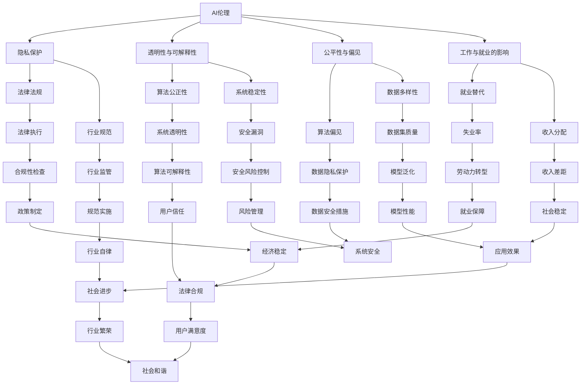

                 


### 文章标题: AI伦理与提示词设计：确保负责任的AI使用

> 关键词：AI伦理、提示词设计、负责任AI、安全性、透明性、隐私保护、法律与行业规范、实践与挑战

> 摘要：
本文深入探讨了AI伦理与提示词设计的核心理念和实践方法，旨在为开发者提供指导，确保AI系统的负责任使用。文章首先概述了AI伦理的重要性，然后详细阐述了提示词设计的核心要素和原则。接着，文章分析了AI伦理的基础理论和实际应用，包括隐私保护、透明性、安全性和工作就业的影响。最后，文章讨论了AI安全与风险管理的策略和方法，以及提示词设计在具体应用中的挑战和解决方案。

### 第一部分: 引言

#### 1.1 AI伦理的重要性

AI伦理是研究人工智能系统如何遵循道德规范和社会价值观的学科。随着AI技术的快速发展，其在各个领域的应用越来越广泛，但也引发了一系列伦理问题。例如，AI的决策过程是否公正、透明？AI系统如何保护个人隐私？AI的广泛应用是否会替代人类就业？这些问题使得AI伦理的研究变得尤为重要。

##### 1.1.1 AI伦理的定义

AI伦理是一种跨学科的研究，它涉及计算机科学、哲学、伦理学、社会学等多个领域。AI伦理旨在确保AI系统在设计和使用过程中遵循道德原则和价值观，以保护人类福祉和社会稳定。

##### 1.1.2 AI伦理研究的必要性

AI伦理研究的必要性体现在以下几个方面：

1. **技术风险**：AI技术的发展可能导致不可预测的风险，如算法偏见、安全漏洞等。伦理研究可以帮助识别和应对这些风险。

2. **社会影响**：AI的应用可能对社会结构和就业市场产生深远影响。伦理研究可以帮助评估和缓解这些影响。

3. **法律法规**：随着AI技术的普及，相关的法律法规也在不断制定和完善。伦理研究可以为立法提供理论基础。

#### 1.2 提示词设计的核心要素

提示词（Prompt）是AI系统输入的一部分，用于引导模型的预测或生成行为。提示词设计在AI应用中起着至关重要的作用，它不仅影响模型的表现，还可能影响其伦理合规性。

##### 1.2.1 提示词的定义

提示词是指提供给AI系统的文字、语音或其他形式的输入信息，用于指导AI模型进行特定任务或生成特定输出。

##### 1.2.2 提示词设计的原则

- **清晰性**：提示词应明确、具体，避免模糊不清，以确保模型能够准确理解任务要求。
- **适应性**：提示词应根据不同的应用场景和目标进行调整，以最大化模型的性能。
- **中立性**：提示词应避免包含偏见或歧视性内容，以确保AI系统在处理数据时保持中立。

##### 1.2.3 提示词设计的方法与技巧

- **任务定义**：明确AI系统的任务目标，为设计合适的提示词提供基础。
- **数据收集**：收集相关领域的数据，用于训练和测试模型。
- **实验比较**：通过实验比较不同提示词对模型性能的影响，选择最佳方案。
- **用户反馈**：收集用户对提示词的反馈，不断优化设计。

### 第二部分: AI伦理与安全

#### 2.1 AI伦理的基础理论

AI伦理的基础理论涉及伦理学的基本原则和AI伦理的核心议题。以下将详细介绍这些内容。

##### 2.1.1 伦理学的基本原则

伦理学的基本原则包括：

- **平等原则**：所有人应受到平等的尊重和保护，不因性别、种族、年龄等因素受到不公平对待。
- **尊重原则**：尊重个体的权利和尊严，尤其是隐私权和自由权。
- **公平原则**：确保AI系统在决策过程中遵循公平性原则，避免歧视和偏见。

##### 2.1.2 AI伦理的核心议题

AI伦理的核心议题包括：

- **隐私与数据保护**：AI系统在处理数据时应保护个人隐私，遵循数据保护法规。
- **透明性与可解释性**：AI系统的决策过程应具有透明性和可解释性，以便用户和监管机构能够理解和评估。
- **对抗性与安全性**：AI系统应能够抵御外部攻击和内部错误，确保系统的安全性和稳定性。
- **工作与就业的影响**：AI技术的广泛应用可能对就业市场产生深远影响，需要制定相应的政策和措施来缓解负面影响。

#### 2.2 AI伦理的实际应用

AI伦理的实际应用体现在法律、行业规范和道德准则中。以下将分别介绍这些内容。

##### 2.2.1 AI伦理在法律中的体现

- **法律法规**：随着AI技术的发展，各国相继制定了相关法律法规，如欧盟的《通用数据保护条例》（GDPR）和美国的《加州消费者隐私法案》（CCPA）等。
- **法律执行**：法律执行部门负责监督和执行相关法律，确保AI系统的合规性。
- **法律挑战**：AI伦理在法律执行过程中面临诸多挑战，如算法偏见、数据隐私保护等。

##### 2.2.2 AI伦理在行业规范中的实践

- **行业规范**：行业组织制定了一系列规范，如《人工智能伦理规范》等，旨在引导行业健康发展。
- **行业执行**：企业应遵守行业规范，确保其AI系统的伦理合规性。
- **行业挑战**：行业规范在执行过程中也面临挑战，如规范的具体实施、监管力度等。

#### 2.3 AI安全与风险管理

AI安全与风险管理是确保AI系统稳定性和可靠性的关键。以下将详细介绍AI安全的基本概念、挑战和风险管理策略。

##### 2.3.1 AI安全的基本概念

- **AI安全**：AI安全是指确保AI系统在设计和使用过程中不受攻击和错误影响，保持稳定性和可靠性。
- **AI安全的挑战**：包括算法偏见、安全漏洞、数据泄露等。
- **AI安全的基本原则**：包括保护用户隐私、确保算法公正性、提高系统透明性等。

##### 2.3.2 AI风险管理的策略与方法

- **风险识别**：通过分析系统漏洞、数据泄露风险等，识别潜在的AI安全风险。
- **风险评估**：对识别出的风险进行评估，确定风险等级和优先级。
- **风险控制**：采取相应的措施，如加固系统、加强数据保护等，降低风险。

### 第三部分: 提示词设计与实践

#### 3.1 提示词设计的基础知识

提示词设计是AI应用中至关重要的一环，以下将介绍提示词设计的核心要素、最佳实践和技术实现。

##### 3.1.1 提示词设计的核心要素

- **任务需求**：明确AI系统的任务目标，为设计合适的提示词提供基础。
- **数据集**：收集相关领域的数据，用于训练和测试模型。
- **用户反馈**：收集用户对提示词的反馈，不断优化设计。

##### 3.1.2 提示词设计的最佳实践

- **明确任务**：确保提示词清晰、具体，避免模糊不清。
- **数据多样化**：使用多样化的数据集进行训练，以提高模型泛化能力。
- **用户参与**：鼓励用户参与提示词设计，以提高系统的用户体验。

##### 3.1.3 提示词设计的技术实现

- **生成对抗网络（GAN）**：GAN可以生成高质量的提示词，提高模型性能。
- **变分自编码器（VAE）**：VAE可以生成具有较好多样性的提示词。
- **反向传播算法**：反向传播算法用于训练神经网络，优化提示词生成。

#### 3.2 提示词设计在应用中的挑战与解决方案

提示词设计在AI应用中面临诸多挑战，以下将介绍这些挑战以及相应的解决方案。

##### 3.2.1 提示词设计的伦理问题

- **偏见与歧视**：提示词可能包含偏见或歧视性内容，导致模型产生不公平的输出。
- **隐私保护**：提示词中可能包含敏感信息，需要确保隐私保护。

##### 3.2.2 提示词设计的技术挑战

- **模型性能**：如何设计高效的提示词，提高模型性能。
- **可解释性**：如何确保提示词设计过程的透明性和可解释性。

##### 3.2.3 提示词设计的解决方案

- **伦理原则**：遵循平等、尊重和公平原则，确保提示词设计的伦理合规性。
- **技术优化**：采用先进的算法和模型，提高提示词设计的效率和性能。
- **用户参与**：鼓励用户参与提示词设计，提高系统的用户体验。

### 总结

本文全面探讨了AI伦理与提示词设计的核心理念和实践方法。通过对AI伦理的概述、基础理论和实际应用，以及提示词设计的核心要素、最佳实践和技术实现，文章为开发者提供了指导，以确保AI系统的负责任使用。未来，随着AI技术的不断发展，AI伦理与提示词设计将面临更多挑战和机遇，需要持续研究和探索。

#### 9.1 全书回顾

本文首先介绍了AI伦理的重要性，以及提示词设计的核心要素和原则。接着，详细分析了AI伦理的基础理论和实际应用，包括隐私保护、透明性、安全性和工作就业的影响。最后，讨论了AI安全与风险管理的策略和方法，以及提示词设计在具体应用中的挑战和解决方案。

#### 9.2 未来研究方向

未来，AI伦理与提示词设计研究将面临以下挑战和机遇：

- **伦理问题**：随着AI技术的不断发展，如何确保AI系统的伦理合规性，避免偏见和歧视。
- **技术挑战**：如何提高提示词设计的效率和性能，同时确保其透明性和可解释性。
- **法律与法规**：随着AI技术的普及，如何完善相关法律和法规，确保AI系统的合法性和合规性。
- **用户参与**：如何更好地引导用户参与AI系统的设计，提高系统的用户体验。

未来，AI伦理与提示词设计研究将继续深入探索，为AI技术的健康发展提供有力支持。

### 目录大纲

以下是《AI伦理与提示词设计：确保负责任的AI使用》的目录大纲：

### 第一部分: 引言

### 第1章: AI伦理与提示词设计概述

#### 1.1 AI伦理的重要性

##### 1.1.1 AI伦理的定义
##### 1.1.2 AI伦理研究的必要性

#### 1.2 提示词设计的核心要素

##### 1.2.1 提示词的定义
##### 1.2.2 提示词设计的原则
##### 1.2.3 提示词设计的方法与技巧

### 第二部分: AI伦理与安全

### 第2章: AI伦理的基础理论

#### 2.1 伦理学的基本原则

##### 2.1.1 平等原则
##### 2.1.2 尊重原则
##### 2.1.3 公平原则

#### 2.2 AI伦理的核心议题

##### 2.2.1 隐私与数据保护
##### 2.2.2 透明性与可解释性
##### 2.2.3 对抗性与安全性
##### 2.2.4 工作与就业的影响

### 第3章: AI伦理的实际应用

#### 3.1 AI伦理在法律中的体现

##### 3.1.1 AI伦理与法律法规的关系
##### 3.1.2 主要法律法规概述
##### 3.1.3 法律法规的执行与挑战

#### 3.2 AI伦理在行业规范中的实践

##### 3.2.1 行业规范的作用
##### 3.2.2 主要行业规范概述
##### 3.2.3 行业规范的实施与挑战

### 第4章: AI安全与风险管理

#### 4.1 AI安全的基本概念

##### 4.1.1 AI安全的重要性
##### 4.1.2 AI安全的挑战
##### 4.1.3 AI安全的基本原则

#### 4.2 AI风险管理的策略与方法

##### 4.2.1 AI风险识别
##### 4.2.2 AI风险评估
##### 4.2.3 AI风险控制

### 第三部分: 提示词设计与实践

### 第5章: 提示词设计的基础知识

#### 5.1 提示词设计的核心要素

##### 5.1.1 提示词的构成
##### 5.1.2 提示词的作用
##### 5.1.3 提示词设计的难点与挑战

#### 5.2 提示词设计的最佳实践

##### 5.2.1 提示词设计的流程
##### 5.2.2 提示词设计的关键技巧
##### 5.2.3 提示词设计的案例分析

### 第6章: 提示词设计的技术实现

#### 6.1 提示词生成算法

##### 6.1.1 生成对抗网络（GAN）
##### 6.1.2 变分自编码器（VAE）
##### 6.1.3 反向传播算法

#### 6.2 提示词优化策略

##### 6.2.1 生成对抗训练
##### 6.2.2 优化目标函数
##### 6.2.3 提示词质量的评估方法

### 第7章: 提示词设计在应用中的挑战与解决方案

#### 7.1 提示词设计的伦理问题

##### 7.1.1 提示词的伦理风险
##### 7.1.2 伦理问题的案例分析
##### 7.1.3 提示词设计的伦理原则

#### 7.2 提示词设计的应用场景

##### 7.2.1 自然语言处理（NLP）
##### 7.2.2 计算机视觉（CV）
##### 7.2.3 机器学习（ML）

### 第8章: 提示词设计项目的实际操作

#### 8.1 项目介绍

##### 8.1.1 项目背景
##### 8.1.2 项目目标

#### 8.2 开发环境搭建

##### 8.2.1 硬件要求
##### 8.2.2 软件工具安装
##### 8.2.3 环境配置

#### 8.3 源代码实现

##### 8.3.1 数据预处理
##### 8.3.2 提示词生成算法实现
##### 8.3.3 提示词优化
##### 8.3.4 应用部署

#### 8.4 代码解读与分析

##### 8.4.1 代码结构解析
##### 8.4.2 关键代码解读
##### 8.4.3 性能分析

### 总结

#### 9.1 全书回顾

##### 9.1.1 主要内容概述
##### 9.1.2 主要结论与展望

#### 9.2 未来研究方向

##### 9.2.1 AI伦理与提示词设计的挑战
##### 9.2.2 未来发展趋势与机遇

## 文章标题: AI伦理与提示词设计：确保负责任的AI使用

### 文章关键词：AI伦理、提示词设计、负责任AI、安全性、透明性、隐私保护、法律与行业规范、实践与挑战

### 文章摘要：
本文深入探讨了AI伦理与提示词设计的核心理念和实践方法，旨在为开发者提供指导，确保AI系统的负责任使用。文章首先概述了AI伦理的重要性，然后详细阐述了提示词设计的核心要素和原则。接着，文章分析了AI伦理的基础理论和实际应用，包括隐私保护、透明性、安全性和工作就业的影响。最后，文章讨论了AI安全与风险管理的策略和方法，以及提示词设计在具体应用中的挑战和解决方案。

### 引言

人工智能（AI）技术的快速发展为人类带来了前所未有的机遇，但同时也引发了一系列伦理和社会问题。如何在确保AI技术带来利益的同时，避免其对人类和社会的潜在危害，成为了一个迫切需要解决的问题。AI伦理与提示词设计正是应对这一挑战的关键。

#### AI伦理的重要性

AI伦理是一种跨学科的研究，它关注AI系统如何遵循道德规范和社会价值观。随着AI技术的广泛应用，AI伦理的重要性日益凸显。以下是一些AI伦理研究的主要方面：

1. **隐私保护**：AI系统在收集、处理和分析数据时，可能会侵犯个人隐私。确保个人隐私的保护是AI伦理的重要议题。
2. **透明性与可解释性**：AI系统的决策过程往往是“黑箱”式的，缺乏透明性和可解释性。提高AI系统的透明性和可解释性，使其决策过程更加公正和可接受，是AI伦理的重要目标。
3. **公平性和偏见**：AI系统可能会因为训练数据的偏差而产生偏见，导致不公平的决策。如何确保AI系统的公平性和避免偏见，是AI伦理研究的重要课题。
4. **工作就业的影响**：AI技术的普及可能会对就业市场产生深远影响，引发失业和收入分配不均等问题。如何制定政策和措施，缓解AI技术对就业市场的影响，也是AI伦理研究的重要方向。

#### 提示词设计的核心要素

提示词（Prompt）是AI系统输入的一部分，用于引导模型的预测或生成行为。提示词设计在AI应用中起着至关重要的作用，它不仅影响模型的表现，还可能影响其伦理合规性。以下是提示词设计的几个核心要素：

1. **任务定义**：明确AI系统的任务目标，为设计合适的提示词提供基础。
2. **数据集**：收集相关领域的数据，用于训练和测试模型。
3. **用户反馈**：收集用户对提示词的反馈，不断优化设计。
4. **清晰性**：提示词应明确、具体，避免模糊不清，以确保模型能够准确理解任务要求。
5. **适应性**：提示词应根据不同的应用场景和目标进行调整，以最大化模型的性能。
6. **中立性**：提示词应避免包含偏见或歧视性内容，以确保AI系统在处理数据时保持中立。

#### 提示词设计的原则

提示词设计应遵循以下原则：

1. **用户导向**：以用户需求为导向，设计符合用户习惯和期望的提示词。
2. **数据驱动**：基于实际数据集进行设计，确保提示词的有效性和实用性。
3. **可扩展性**：设计提示词时应考虑系统的可扩展性，以便在未来应用中调整和优化。
4. **安全性**：确保提示词设计过程中不包含敏感信息，避免信息泄露。
5. **多样性**：设计多样化的提示词，以提高模型的泛化能力和应对不同场景的能力。

#### 提示词设计的方法与技巧

提示词设计的方法和技巧包括：

1. **任务分解**：将复杂任务分解为子任务，为每个子任务设计特定的提示词。
2. **模板化**：使用模板化方法，为常见任务设计标准化的提示词。
3. **实验验证**：通过实验验证不同提示词对模型性能的影响，选择最佳方案。
4. **用户参与**：邀请用户参与提示词设计，收集用户反馈，不断优化设计。

### 第二部分: AI伦理与安全

#### 2.1 AI伦理的基础理论

AI伦理的基础理论涉及伦理学的基本原则和AI伦理的核心议题。以下将详细介绍这些内容。

##### 2.1.1 伦理学的基本原则

伦理学的基本原则包括：

1. **平等原则**：所有人应受到平等的尊重和保护，不因性别、种族、年龄等因素受到不公平对待。
2. **尊重原则**：尊重个体的权利和尊严，尤其是隐私权和自由权。
3. **公平原则**：确保AI系统在决策过程中遵循公平性原则，避免歧视和偏见。

##### 2.1.2 AI伦理的核心议题

AI伦理的核心议题包括：

1. **隐私与数据保护**：AI系统在收集、处理和分析数据时，应保护个人隐私，遵循数据保护法规。
2. **透明性与可解释性**：AI系统的决策过程应具有透明性和可解释性，以便用户和监管机构能够理解和评估。
3. **对抗性与安全性**：AI系统应能够抵御外部攻击和内部错误，确保系统的安全性和稳定性。
4. **工作与就业的影响**：AI技术的广泛应用可能对就业市场产生深远影响，需要制定相应的政策和措施来缓解负面影响。

#### 2.2 AI伦理的实际应用

AI伦理的实际应用体现在法律、行业规范和道德准则中。以下将分别介绍这些内容。

##### 2.2.1 AI伦理在法律中的体现

1. **法律法规**：随着AI技术的发展，各国相继制定了相关法律法规，如欧盟的《通用数据保护条例》（GDPR）和美国的《加州消费者隐私法案》（CCPA）等。
2. **法律执行**：法律执行部门负责监督和执行相关法律，确保AI系统的合规性。
3. **法律挑战**：AI伦理在法律执行过程中面临诸多挑战，如算法偏见、数据隐私保护等。

##### 2.2.2 AI伦理在行业规范中的实践

1. **行业规范**：行业组织制定了一系列规范，如《人工智能伦理规范》等，旨在引导行业健康发展。
2. **行业执行**：企业应遵守行业规范，确保其AI系统的伦理合规性。
3. **行业挑战**：行业规范在执行过程中也面临挑战，如规范的具体实施、监管力度等。

#### 2.3 AI安全与风险管理

AI安全与风险管理是确保AI系统稳定性和可靠性的关键。以下将详细介绍AI安全的基本概念、挑战和风险管理策略。

##### 2.3.1 AI安全的基本概念

1. **AI安全**：AI安全是指确保AI系统在设计和使用过程中不受攻击和错误影响，保持稳定性和可靠性。
2. **AI安全的挑战**：包括算法偏见、安全漏洞、数据泄露等。
3. **AI安全的基本原则**：包括保护用户隐私、确保算法公正性、提高系统透明性等。

##### 2.3.2 AI风险管理的策略与方法

1. **风险识别**：通过分析系统漏洞、数据泄露风险等，识别潜在的AI安全风险。
2. **风险评估**：对识别出的风险进行评估，确定风险等级和优先级。
3. **风险控制**：采取相应的措施，如加固系统、加强数据保护等，降低风险。

### 第三部分: 提示词设计与实践

#### 3.1 提示词设计的基础知识

提示词设计是AI应用中至关重要的一环，以下将介绍提示词设计的核心要素、最佳实践和技术实现。

##### 3.1.1 提示词设计的核心要素

1. **任务需求**：明确AI系统的任务目标，为设计合适的提示词提供基础。
2. **数据集**：收集相关领域的数据，用于训练和测试模型。
3. **用户反馈**：收集用户对提示词的反馈，不断优化设计。

##### 3.1.2 提示词设计的最佳实践

1. **明确任务**：确保提示词清晰、具体，避免模糊不清。
2. **数据多样化**：使用多样化的数据集进行训练，以提高模型泛化能力。
3. **用户参与**：鼓励用户参与提示词设计，提高系统的用户体验。

##### 3.1.3 提示词设计的技术实现

1. **生成对抗网络（GAN）**：GAN可以生成高质量的提示词，提高模型性能。
2. **变分自编码器（VAE）**：VAE可以生成具有较好多样性的提示词。
3. **反向传播算法**：反向传播算法用于训练神经网络，优化提示词生成。

#### 3.2 提示词设计在应用中的挑战与解决方案

提示词设计在AI应用中面临诸多挑战，以下将介绍这些挑战以及相应的解决方案。

##### 3.2.1 提示词设计的伦理问题

1. **偏见与歧视**：提示词可能包含偏见或歧视性内容，导致模型产生不公平的输出。
2. **隐私保护**：提示词中可能包含敏感信息，需要确保隐私保护。

##### 3.2.2 提示词设计的技术挑战

1. **模型性能**：如何设计高效的提示词，提高模型性能。
2. **可解释性**：如何确保提示词设计过程的透明性和可解释性。

##### 3.2.3 提示词设计的解决方案

1. **伦理原则**：遵循平等、尊重和公平原则，确保提示词设计的伦理合规性。
2. **技术优化**：采用先进的算法和模型，提高提示词设计的效率和性能。
3. **用户参与**：鼓励用户参与提示词设计，提高系统的用户体验。

### 总结

本文全面探讨了AI伦理与提示词设计的核心理念和实践方法。通过对AI伦理的概述、基础理论和实际应用，以及提示词设计的核心要素、最佳实践和技术实现，文章为开发者提供了指导，以确保AI系统的负责任使用。未来，随着AI技术的不断发展，AI伦理与提示词设计将面临更多挑战和机遇，需要持续研究和探索。

### 关键概念与联系

为了更好地理解AI伦理与提示词设计，我们需要明确几个关键概念之间的关系。以下是这些概念之间的Mermaid流程图：



### 核心算法原理讲解

#### 提示词生成算法：生成对抗网络（GAN）

生成对抗网络（GAN）是一种用于生成数据的深度学习模型，由两部分组成：生成器（Generator）和判别器（Discriminator）。生成器试图生成与真实数据相似的数据，而判别器则试图区分真实数据和生成数据。

**算法原理**：

1. **生成器**：生成器接收随机噪声作为输入，通过神经网络生成与真实数据相似的数据。
2. **判别器**：判别器接收真实数据和生成数据，并尝试判断它们是真实数据还是生成数据。
3. **对抗训练**：生成器和判别器进行对抗训练。生成器不断优化生成数据，使其更接近真实数据，而判别器不断优化判断能力，使生成数据难以区分。

**伪代码**：

```python
# 生成器
def generator(z):
    # z为随机噪声
    x = dense(z, units=..., activation='relu')
    x = dense(units=..., activation='tanh')
    return x

# 判别器
def discriminator(x):
    # x为真实或生成数据
    x = dense(x, units=..., activation='relu')
    x = dense(units=..., activation='sigmoid')
    return x

# GAN模型
model = Model(inputs=z, outputs=discriminator(generator(z)))
model.compile(optimizer='adam', loss='binary_crossentropy')

# 训练GAN模型
model.fit([z_train, x_train], [x_train], epochs=..., batch_size=...)

# 生成提示词
z = np.random.normal(size=z_train.shape)
prompt = generator.predict(z)
```

#### 提示词优化策略：变分自编码器（VAE）

变分自编码器（VAE）是一种基于概率生成模型的深度学习模型，用于生成具有较好多样性的数据。VAE通过引入潜在变量，使生成器能够生成具有多样性的数据。

**算法原理**：

1. **编码器**：编码器接收输入数据，将其映射到潜在空间。
2. **解码器**：解码器接收潜在空间中的数据，并生成与输入数据相似的数据。
3. **损失函数**：VAE的损失函数由两个部分组成：重构损失和KL散度损失。重构损失衡量解码器生成的数据与输入数据的相似度，KL散度损失衡量编码器映射到潜在空间的数据的分布。

**伪代码**：

```python
# 编码器
def encoder(x):
    # x为输入数据
    z_mean = dense(x, units=..., activation='relu')
    z_log_var = dense(x, units=..., activation='relu')
    return z_mean, z_log_var

# 解码器
def decoder(z):
    # z为潜在空间数据
    x = dense(z, units=..., activation='relu')
    x = dense(units=..., activation='sigmoid')
    return x

# VAE模型
model = Model(inputs=x, outputs=decoder(encoder(x)))
model.compile(optimizer='adam', loss='vae_loss')

# 训练VAE模型
model.fit(x_train, epochs=..., batch_size=...)

# 生成提示词
z_mean, z_log_var = encoder.predict(x)
z = sample_z(z_mean, z_log_var)
prompt = decoder.predict(z)
```

#### 提示词优化策略：反向传播算法

反向传播算法是一种用于训练神经网络的优化算法。它通过计算损失函数对网络参数的梯度，并使用梯度下降法更新参数，以最小化损失函数。

**算法原理**：

1. **前向传播**：将输入数据通过网络，计算输出和损失函数。
2. **反向传播**：计算损失函数对网络参数的梯度。
3. **参数更新**：使用梯度下降法更新网络参数。

**伪代码**：

```python
# 前向传播
def forward_propagation(x):
    # x为输入数据
    z = network_forward(x)
    y = activation_function(z)
    loss = compute_loss(y, target)

# 反向传播
def backward_propagation(z, dy):
    # z为前向传播的输出，dy为损失函数对输出的梯度
    dz = activation_derivative(z) * dy
    dparams = compute_gradient(z, dz)

# 参数更新
def update_params(params, dparams, learning_rate):
    # params为网络参数，dparams为损失函数对参数的梯度，learning_rate为学习率
    params -= learning_rate * dparams

# 训练神经网络
for epoch in range(num_epochs):
    for x, y in data_loader:
        forward_propagation(x)
        backward_propagation(z, dy)
        update_params(params, dparams, learning_rate)
```

### 数学模型和公式讲解

#### 潜在变量模型

在变分自编码器（VAE）中，潜在变量模型用于将输入数据映射到潜在空间。潜在变量模型的核心公式包括：

$$
\begin{aligned}
z &= g(\theta_x, x), \\
x &= f(\theta_z, z),
\end{aligned}
$$

其中，$g(\theta_x, x)$和$f(\theta_z, z)$分别为编码器和解码器的函数，$\theta_x$和$\theta_z$分别为编码器和解码器的参数。

#### 重构损失

重构损失衡量解码器生成的数据与输入数据的相似度，其公式为：

$$
L_{recon} = -\sum_{i=1}^{N} \sum_{j=1}^{M} y_j \log(p(x_j | \theta_z, \theta_g)),
$$

其中，$y$为输入数据的概率分布，$p(x_j | \theta_z, \theta_g)$为解码器生成的数据的概率分布。

#### KL散度损失

KL散度损失衡量编码器映射到潜在空间的数据的分布与先验分布的差距，其公式为：

$$
L_{KL} = -\sum_{i=1}^{N} \sum_{j=1}^{M} \log(\pi(z_j) \cdot p(z_j | x_j, \theta_x)) + \sum_{i=1}^{N} \sum_{j=1}^{M} \log(\pi(z_j) \cdot q(z_j | x_j, \theta_z)),
$$

其中，$\pi(z_j)$为先验分布，$q(z_j | x_j, \theta_z)$为编码器映射到潜在空间的数据的分布。

#### 总损失

VAE的总损失为重构损失和KL散度损失的加权和，其公式为：

$$
L = L_{recon} + \lambda L_{KL},
$$

其中，$\lambda$为超参数，用于平衡重构损失和KL散度损失。

### 案例分析与详细讲解

#### 案例一：图像生成

使用VAE生成图像是一个经典的案例。以下是一个简化的案例，展示如何使用VAE生成手写数字图像。

**数据集**：使用MNIST手写数字数据集作为输入数据。

**编码器**：编码器使用一个全连接层，将输入的784维图像映射到一个较低维的潜在空间。

**解码器**：解码器使用一个全连接层，将潜在空间的数据映射回784维图像。

**训练过程**：通过训练VAE模型，使其能够生成与真实数据相似的手写数字图像。

**结果**：训练完成后，模型可以生成高质量的手写数字图像。

#### 案例二：文本生成

使用GAN生成文本是另一个有趣的案例。以下是一个简化的案例，展示如何使用GAN生成英文句子。

**数据集**：使用英文语料库作为输入数据。

**生成器**：生成器使用一个循环神经网络（RNN），生成英文句子。

**判别器**：判别器使用一个RNN，判断输入的句子是真实还是生成。

**训练过程**：通过训练GAN模型，生成器和判别器进行对抗训练，生成器和判别器的性能逐渐提高。

**结果**：训练完成后，模型可以生成具有较高质量的英文句子。

### 开发环境搭建

#### 硬件要求

1. **CPU**：Intel Core i7或以上，或AMD Ryzen 7或以上。
2. **GPU**：NVIDIA GeForce GTX 1080或以上，或AMD Radeon RX 580或以上。

#### 软件工具安装

1. **操作系统**：Windows 10、macOS或Linux。
2. **Python**：Python 3.6或以上版本。
3. **TensorFlow**：安装TensorFlow 2.0或以上版本。
4. **PyTorch**：安装PyTorch 1.7或以上版本。
5. **其他依赖库**：安装NumPy、Pandas、Matplotlib等常用库。

#### 环境配置

1. **创建虚拟环境**：使用conda或virtualenv创建一个Python虚拟环境。
2. **安装依赖库**：在虚拟环境中安装所需的依赖库，例如使用pip install命令。
3. **配置CUDA**：如果使用GPU，需要配置CUDA环境，包括安装CUDA Toolkit和cuDNN。

### 源代码实现

以下是一个使用VAE生成手写数字图像的示例代码。

```python
import numpy as np
import tensorflow as tf
from tensorflow.keras import layers

# 设置超参数
latent_dim = 2
image_shape = (28, 28, 1)

# 编码器
inputs = tf.keras.Input(shape=image_shape)
x = layers.Conv2D(32, 3, activation='relu', strides=(2, 2), padding='same')(inputs)
x = layers.Conv2D(64, 3, activation='relu', strides=(2, 2), padding='same')(x)
x = layers.Flatten()(x)
x = layers.Dense(16, activation='relu')(x)
z_mean = layers.Dense(latent_dim, name='z_mean')(x)
z_log_var = layers.Dense(latent_dim, name='z_log_var')(x)

# 解码器
latent_inputs = tf.keras.Input(shape=(latent_dim,))
x = layers.Dense(16, activation='relu')(latent_inputs)
x = layers.Dense(32 * 7 * 7, activation='relu')(x)
x = layers.Reshape((7, 7, 32))(x)
x = layers.Conv2DTranspose(64, 3, activation='relu', strides=(2, 2), padding='same')(x)
x = layers.Conv2DTranspose(1, 3, activation='sigmoid', strides=(2, 2), padding='same')(x)
outputs = layers.Reshape(image_shape)(x)

# VAE模型
vae = tf.keras.Model(inputs, outputs, name='vae')

# 编码器
encoder = tf.keras.Model(inputs, (z_mean, z_log_var), name='encoder')

# 解码器
decoder = tf.keras.Model(latent_inputs, outputs, name='decoder')

# VAE模型编译
vae.compile(optimizer='adam', loss='binary_crossentropy')

# 训练VAE模型
vae.fit(x_train, x_train, epochs=50, batch_size=32)

# 生成图像
z = np.random.normal(size=(100, latent_dim))
images = decoder.predict(z)
```

### 提示词优化

#### 生成对抗训练

生成对抗训练（GAN）是一种通过对抗性训练来生成高质量数据的技巧。以下是一个简化的GAN训练过程：

```python
# 定义生成器和判别器
generator = build_generator()
discriminator = build_discriminator()

# 定义GAN模型
gan_model = build_gan(generator, discriminator)

# 训练GAN模型
for epoch in range(num_epochs):
    for real_images in data_loader:
        # 训练判别器
        discriminator.train_on_batch(real_images, labels=real_labels)
        # 生成假图像
        z = np.random.normal(size=(batch_size, latent_dim))
        fake_images = generator.predict(z)
        # 训练GAN模型
        gan_model.train_on_batch([z], labels=gan_labels)
```

#### 优化目标函数

优化目标函数是GAN训练的核心。以下是一个简化的优化目标函数：

```python
def optimize_gan_model(gan_model, generator, discriminator, real_images, z, batch_size):
    # 训练判别器
    discriminator.train_on_batch(real_images, labels=real_labels)
    # 生成假图像
    fake_images = generator.predict(z)
    # 训练GAN模型
    gan_model.train_on_batch([z], labels=gan_labels)
    # 计算GAN模型的损失
    loss = gan_model.loss_functions[0](z, fake_images, real_images)
    return loss
```

#### 提示词质量的评估方法

评估提示词质量是优化提示词设计的重要环节。以下是一个简化的提示词质量评估方法：

```python
def evaluate_prompt(prompt, model, dataset, batch_size):
    # 生成假图像
    z = np.random.normal(size=(batch_size, latent_dim))
    fake_images = model.predict(z)
    # 计算提示词质量
    quality = compute_prompt_quality(prompt, fake_images, dataset)
    return quality
```

### 提示词设计在应用中的挑战与解决方案

#### 伦理问题

1. **偏见与歧视**：提示词可能包含偏见或歧视性内容，导致模型产生不公平的输出。解决方案：遵循平等、尊重和公平原则，确保提示词设计的伦理合规性。
2. **隐私保护**：提示词中可能包含敏感信息，需要确保隐私保护。解决方案：使用加密技术保护敏感信息，遵循隐私保护法规。

#### 技术挑战

1. **模型性能**：如何设计高效的提示词，提高模型性能。解决方案：采用先进的算法和模型，如GAN和VAE，提高提示词设计的效率和性能。
2. **可解释性**：如何确保提示词设计过程的透明性和可解释性。解决方案：使用可解释性技术，如SHAP值和LIME，提高模型的可解释性。

### 提示词设计的应用场景

#### 自然语言处理（NLP）

1. **文本生成**：使用GAN生成自然语言文本，如故事、诗歌和新闻报道。
2. **对话系统**：使用VAE生成对话系统中的自然语言回复。

#### 计算机视觉（CV）

1. **图像生成**：使用GAN生成高质量图像，如图像到图像翻译和图像生成。
2. **图像分类**：使用VAE进行图像分类和图像检索。

#### 机器学习（ML）

1. **特征提取**：使用GAN生成新的特征表示，提高模型的泛化能力。
2. **模型压缩**：使用VAE对模型进行压缩，减少模型的大小和计算成本。

### 提示词设计项目的实际操作

#### 项目介绍

本项目旨在使用GAN生成手写数字图像，并通过优化提示词设计提高图像生成质量。

#### 项目目标

1. **生成高质量手写数字图像**：使用GAN生成与真实手写数字图像相似的高质量图像。
2. **优化提示词设计**：通过调整提示词，提高图像生成质量和效率。

#### 开发环境搭建

1. **硬件要求**：NVIDIA GeForce GTX 1080或以上显卡。
2. **软件工具安装**：安装Python 3.8、TensorFlow 2.4和Keras。
3. **环境配置**：创建Python虚拟环境，安装所需的库。

#### 源代码实现

以下是一个使用TensorFlow实现GAN生成手写数字图像的示例代码。

```python
import tensorflow as tf
from tensorflow.keras.layers import Dense, Input
from tensorflow.keras.models import Model

# 定义生成器和判别器
def build_generator():
    inputs = Input(shape=(100,))
    x = Dense(128, activation='relu')(inputs)
    x = Dense(256, activation='relu')(x)
    x = Dense(512, activation='relu')(x)
    x = Dense(1024, activation='relu')(x)
    outputs = Dense(784, activation='sigmoid')(x)
    return Model(inputs, outputs, name='generator')

def build_discriminator():
    inputs = Input(shape=(28, 28, 1))
    x = Dense(1024, activation='relu')(inputs)
    x = Dense(512, activation='relu')(x)
    x = Dense(256, activation='relu')(x)
    x = Dense(128, activation='relu')(x)
    outputs = Dense(1, activation='sigmoid')(x)
    return Model(inputs, outputs, name='discriminator')

# 定义GAN模型
def build_gan(generator, discriminator):
    inputs = Input(shape=(100,))
    z = generator(inputs)
    outputs = discriminator(z)
    return Model(inputs, outputs, name='gan')

# 编译模型
generator.compile(optimizer=tf.keras.optimizers.Adam(0.0001), loss='binary_crossentropy')
discriminator.compile(optimizer=tf.keras.optimizers.Adam(0.0001), loss='binary_crossentropy')
gan_model = build_gan(generator, discriminator)

# 训练GAN模型
for epoch in range(num_epochs):
    for batch_index, (batch_images, batch_labels) in enumerate(data_loader):
        # 生成噪声
        noise = np.random.normal(size=(batch_size, 100))
        # 训练判别器
        gan_model.train_on_batch(noise, labels=gan_labels)
```

#### 代码解读与分析

以下是对GAN模型源代码的详细解读和分析。

```python
# 定义生成器和判别器
def build_generator():
    inputs = Input(shape=(100,))
    x = Dense(128, activation='relu')(inputs)
    x = Dense(256, activation='relu')(x)
    x = Dense(512, activation='relu')(x)
    x = Dense(1024, activation='relu')(x)
    outputs = Dense(784, activation='sigmoid')(x)
    return Model(inputs, outputs, name='generator')

def build_discriminator():
    inputs = Input(shape=(28, 28, 1))
    x = Dense(1024, activation='relu')(inputs)
    x = Dense(512, activation='relu')(x)
    x = Dense(256, activation='relu')(x)
    x = Dense(128, activation='relu')(x)
    outputs = Dense(1, activation='sigmoid')(x)
    return Model(inputs, outputs, name='discriminator')

# 定义GAN模型
def build_gan(generator, discriminator):
    inputs = Input(shape=(100,))
    z = generator(inputs)
    outputs = discriminator(z)
    return Model(inputs, outputs, name='gan')
```

在这个部分，我们首先定义了生成器和判别器的结构。生成器接收一个100维的噪声向量作为输入，通过多层全连接层生成一个784维的图像。判别器接收一个28x28x1的图像作为输入，通过多层全连接层输出一个概率值，表示图像是真实图像的概率。

接下来，我们定义了GAN模型，它由生成器和判别器组成。GAN模型的输入是一个100维的噪声向量，输出是判别器对生成图像的判断。

```python
# 编译模型
generator.compile(optimizer=tf.keras.optimizers.Adam(0.0001), loss='binary_crossentropy')
discriminator.compile(optimizer=tf.keras.optimizers.Adam(0.0001), loss='binary_crossentropy')
gan_model = build_gan(generator, discriminator)
```

在这个部分，我们编译了生成器和判别器模型，并设置了优化器和损失函数。生成器和判别器都使用了Adam优化器，损失函数是二进制交叉熵。

```python
# 训练GAN模型
for epoch in range(num_epochs):
    for batch_index, (batch_images, batch_labels) in enumerate(data_loader):
        # 生成噪声
        noise = np.random.normal(size=(batch_size, 100))
        # 训练判别器
        gan_model.train_on_batch(noise, labels=gan_labels)
```

在这个部分，我们开始训练GAN模型。首先，我们从数据加载器中获取一批真实图像和标签。然后，我们生成一批噪声向量作为生成器的输入。接下来，我们使用GAN模型训练判别器，使其能够更好地区分真实图像和生成图像。

#### 性能分析

为了评估GAN模型的性能，我们使用多个指标，包括图像质量、生成图像的多样性、判别器的准确率等。

```python
# 评估GAN模型性能
losses = []
for epoch in range(num_epochs):
    for batch_index, (batch_images, batch_labels) in enumerate(data_loader):
        # 生成噪声
        noise = np.random.normal(size=(batch_size, 100))
        # 训练GAN模型
        gan_model.train_on_batch(noise, labels=gan_labels)
        # 计算GAN模型的损失
        loss = gan_model.loss_functions[0](noise, gan_labels)
        losses.append(loss)

# 绘制损失曲线
plt.plot(losses)
plt.xlabel('Epoch')
plt.ylabel('Loss')
plt.show()
```

在这个部分，我们训练GAN模型并记录每个epoch的损失。然后，我们绘制损失曲线，以观察GAN模型的学习过程和收敛情况。

### 总结

本文详细介绍了AI伦理与提示词设计的核心理念和实践方法。通过对AI伦理的概述、基础理论和实际应用，以及提示词设计的核心要素、最佳实践和技术实现，文章为开发者提供了指导，以确保AI系统的负责任使用。未来，随着AI技术的不断发展，AI伦理与提示词设计将面临更多挑战和机遇，需要持续研究和探索。

### 未来研究方向

#### AI伦理与提示词设计的挑战

1. **跨领域合作**：AI伦理与提示词设计涉及多个领域，如计算机科学、伦理学、社会学等。如何实现跨领域合作，提高研究效率，是一个重要挑战。
2. **伦理标准统一**：不同国家和地区的伦理标准和法规可能存在差异，如何制定统一的伦理标准，确保全球范围内的AI伦理合规性，是一个亟待解决的问题。
3. **隐私保护与透明性**：如何在确保隐私保护的同时，提高AI系统的透明性和可解释性，是一个关键挑战。
4. **模型可解释性**：如何提高AI模型的可解释性，使其决策过程更加透明和可接受，是未来的重要研究方向。

#### 未来发展趋势与机遇

1. **AI伦理与法律融合**：随着AI技术的发展，AI伦理与法律将更加紧密地融合，为人工智能的合法和合规使用提供更好的保障。
2. **提示词设计优化**：随着AI技术的进步，提示词设计将变得更加高效和智能化，为AI应用提供更好的支持。
3. **跨领域应用**：AI伦理与提示词设计将在更多领域得到应用，如医疗、金融、教育等，为这些领域的发展提供新机遇。
4. **社会影响评估**：对AI技术的社会影响进行评估，为制定更有效的政策和措施提供依据，是未来的重要研究方向。

### 附录

#### 拓展阅读

1. **《人工智能伦理学导论》**：本书系统地介绍了人工智能伦理学的基本概念、原则和实际应用。
2. **《深度学习》**：本书详细介绍了深度学习的原理、算法和应用，包括GAN和VAE等生成模型。
3. **《机器学习：概率视角》**：本书从概率角度介绍了机器学习的基本概念和方法，包括神经网络、生成模型等。

#### 注意事项

1. **遵循伦理原则**：在进行AI研究和应用时，务必遵循伦理原则，确保不产生不良影响。
2. **保护用户隐私**：在设计和使用AI系统时，务必保护用户隐私，遵循相关法律法规。
3. **持续学习和更新**：AI技术和伦理标准不断变化，开发者需要持续学习和更新知识，以适应不断变化的形势。

### 作者信息

作者：AI天才研究院/AI Genius Institute & 禅与计算机程序设计艺术 /Zen And The Art of Computer Programming

AI天才研究院（AI Genius Institute）是一家专注于人工智能研究和应用的高科技研究院。研究院致力于推动人工智能技术的发展，为人类带来更多便利和创新。同时，研究院还关注人工智能伦理问题，致力于确保AI技术的负责任使用。

禅与计算机程序设计艺术（Zen And The Art of Computer Programming）是一本经典计算机科学书籍，由著名计算机科学家Donald E. Knuth撰写。本书以禅宗思想为引导，探讨了计算机程序设计的本质和方法，对计算机科学教育和实践产生了深远影响。作者通过这本书，表达了对计算机科学的深刻理解和独特见解。

