                 


### 1. 确定核心主题

首先，我们要明确文章的核心主题——《AI伦理学：大模型决策的透明度与公平性》。这个主题主要聚焦于两个方面：AI伦理学和大模型决策的透明度和公平性。AI伦理学是研究人工智能技术的道德、法律、社会和伦理问题，而大模型决策的透明度和公平性则关注于如何确保AI模型在决策过程中能够做到透明、公正，避免偏见和歧视。

为了更好地阐述这个主题，我们可以从以下几个方面展开：

1. **背景介绍**：简要介绍AI伦理学的起源和发展，以及大模型决策在实际应用中的重要性和挑战。

2. **核心概念与联系**：明确文章中涉及的核心概念，如透明度、公平性、偏见、歧视等，并使用Mermaid流程图展示这些概念之间的关系。

3. **核心算法原理讲解**：详细解释大模型决策中使用的算法原理，使用伪代码阐述关键步骤，并提供数学模型和公式。

4. **数学模型与公式讲解**：针对算法中的数学模型，使用LaTeX格式详细讲解，并提供实例说明。

5. **项目实战**：通过实际案例展示如何应用AI伦理学和大模型决策的透明度和公平性原则，详细解释代码实现过程，并进行案例分析。

6. **最佳实践 tips**：总结文章中的主要观点，提供一些最佳实践建议。

7. **小结**：对全文进行总结，强调AI伦理学在大模型决策中的重要性，以及如何通过透明度和公平性原则来提升AI技术的应用效果。

### 2. 章节划分与细化

基于上述核心主题，我们可以初步划分出以下章节：

#### 引言

- **背景介绍**：介绍AI伦理学和大模型决策的背景，引出文章的主题。
- **目的与意义**：阐述文章的目的和意义，激发读者的兴趣。

#### AI伦理学概述

- **定义与发展**：解释AI伦理学的定义，回顾其历史和发展过程。
- **主要关注点**：介绍AI伦理学的主要关注点，如道德、法律、社会和伦理问题。

#### 大模型决策机制

- **大模型决策概述**：简要介绍大模型决策的概念和特点。
- **关键要素**：详细分析大模型决策的关键要素，如输入数据、算法模型、输出结果等。

#### 透明度与公平性分析

- **透明度**：解释透明度的含义，分析大模型决策过程中透明度的重要性。
- **公平性**：定义公平性，探讨大模型决策中可能出现的公平性问题。

#### 伦理学在AI应用中的实践

- **案例研究**：通过实际案例展示AI伦理学在大模型决策中的应用。
- **实践策略**：总结实践中采用的策略，提出改进建议。

#### 案例研究

- **具体案例**：选择一个具体案例，详细解释案例背景、问题、解决方案和效果。

#### 最佳实践 tips

- **总结与展望**：总结文章的主要观点，展望AI伦理学和大模型决策的未来发展。

#### 小结

- **重要性**：强调AI伦理学在大模型决策中的重要性。
- **实践意义**：阐述透明度和公平性原则对AI技术实践的意义。

### 3. 核心概念与联系

为了更好地理解文章中的核心概念，我们可以使用Mermaid流程图来展示这些概念之间的关系。以下是可能的核心概念及其关系：

```mermaid
graph TB

A[AI伦理学] --> B[道德问题]
A --> C[法律问题]
A --> D[社会问题]
A --> E[伦理问题]

B --> F[透明度]
B --> G[公平性]
B --> H[偏见]
B --> I[歧视]

C --> J[合规性]
C --> K[隐私保护]
C --> L[责任归属]

D --> M[社会影响]
D --> N[就业影响]
D --> O[隐私问题]

E --> P[伦理原则]
E --> Q[道德规范]
E --> R[社会责任]
E --> S[可持续发展]

F --> T[可解释性]
F --> U[可追溯性]
F --> V[透明性报告]

G --> W[无偏见算法]
G --> X[公平性评估]
G --> Y[补偿措施]

H --> Z[算法偏见]
H --> AA[数据偏见]

I --> BB[性别偏见]
I --> CC[种族偏见]
I --> DD[年龄偏见]

J --> EE[合规审查]
J --> FF[法律诉讼]

K --> GG[数据加密]
K --> HH[隐私政策]

L --> II[责任保险]
L --> JJ[责任追究]

M --> KK[社会信任]
M --> LL[公众接受度]

N --> MM[就业机会]
N --> NN[劳动力市场]

O --> PP[隐私泄露]
O --> QQ[数据滥用]

P --> RR[伦理委员会]
P --> SS[伦理指导原则]

Q --> TT[道德准则]
Q --> UU[道德规范]

R --> VV[社会责任报告]
R --> WW[社会贡献]

S --> XX[环境责任]
S --> YY[社会责任]

T --> ZZ[解释模型]
T --> AAA[决策路径]

U --> BBB[解释性算法]
U --> CCC[解释性报告]

V --> DDD[透明性分析]
V --> EEE[透明度评估]

W --> FFF[无偏见算法设计]
W --> GGG[公平性算法]

X --> HHH[偏见检测]
X --> III[偏见校正]

Y --> JJJ[偏见补偿]
Y --> KKK[偏见预防]

Z --> LLL[算法偏见原因]
Z --> MMM[算法偏见影响]

AA --> NNN[数据预处理]
AA --> OOO[数据清洗]

BB --> PPP[性别数据分析]
BB --> QQQ[性别偏见分析]

CC --> RRR[种族数据分析]
CC --> SSS[种族偏见分析]

DD --> TTT[年龄数据分析]
DD --> UUU[年龄偏见分析]

EE --> VVV[合规性评估]
EE --> WWW[法律风险评估]

FF --> XXX[诉讼预防]
FF --> YYY[法律合规性]

GG --> ZZZ[公平性算法验证]
GG --> AAAA[公平性算法改进]

HH --> BBBB[偏见检测方法]
HH --> CCCD[偏见检测工具]

II --> DDDD[责任追究流程]
II --> EEEE[责任承担]

JJ --> FFFF[责任保险评估]
JJ --> GGGG[责任保险合同]

KK --> HHHH[偏见补偿措施]
KK --> IIYY[偏见预防措施]

LL --> MMMM[就业市场分析]
LL --> NNNN[就业机会评估]

MM --> OOOO[社会信任构建]
MM --> PPPP[公众满意度评估]

NN --> QQQQ[就业影响评估]
NN --> SSSS[就业机会改善]

OO --> TTTT[隐私保护措施]
OO --> UUUU[隐私政策制定]

PP --> VVVV[伦理审查流程]
PP --> WWWW[伦理决策指导]

QQ --> XXXX[隐私保护评估]
QQ --> YYYY[隐私政策执行]

RR --> ZZZZ[伦理委员会职责]
RR --> AAAA[伦理决策支持]

SS --> BBBB[道德准则制定]
SS --> CCCD[道德准则执行]

TT --> DDDD[道德规范评估]
TT --> EEEE[道德决策支持]

UU --> VVVV[社会责任评估]
UU --> WWWW[社会责任报告]

VV --> XXXX[可持续发展评估]
VV --> YYYY[可持续发展报告]

WW --> ZZZZ[环境责任评估]
WW --> AAAA[环境责任报告]

XX --> BBBB[环境责任措施]
XX --> CCCD[环境责任管理]

YY --> DDDD[社会责任报告]
YY --> EEEE[社会责任管理]

```



通过这个流程图，我们可以清晰地看到AI伦理学中的核心概念及其相互关系，这有助于读者更好地理解文章的内容。

### 4. 核心算法原理讲解

在探讨大模型决策的透明度和公平性时，核心算法原理讲解至关重要。以下是一个简单的算法原理讲解，使用伪代码来阐述关键步骤。

#### 算法描述

```plaintext
输入：训练数据集D，模型参数θ
输出：训练好的模型M

算法步骤：
1. 初始化模型参数θ为随机值
2. 对于每个训练样本（x, y）∈ D：
   a. 计算预测结果ŷ = M(x; θ)
   b. 计算损失函数L(y, ŷ; θ)
3. 使用梯度下降法更新模型参数：
   θ = θ - α * ∇θL(θ)
4. 重复步骤2和3，直到满足停止条件（如收敛或达到最大迭代次数）
5. 返回训练好的模型M
```

#### 伪代码

```python
def train_model(data, learning_rate, num_iterations):
    # 初始化模型参数
    theta = initialize_parameters()

    # 训练模型
    for i in range(num_iterations):
        for sample, label in data:
            prediction = model.predict(sample, theta)
            loss = loss_function(label, prediction)

            # 使用梯度下降法更新参数
            theta -= learning_rate * gradient(theta, loss)

        if convergence_detected(theta):
            break

    return theta
```

#### 数学模型与公式讲解

在上述算法中，我们使用了以下数学模型和公式：

1. **损失函数（Loss Function）**

    $$L(y, ŷ; θ) = \frac{1}{2} \left| y - ŷ \right|^2$$

    这是一个简单的均方误差损失函数，用于衡量预测结果ŷ与实际标签y之间的差异。

2. **梯度下降法（Gradient Descent）**

    $$\theta = \theta - \alpha \cdot \nabla_{\theta}L(\theta)$$

    梯度下降法是一种优化算法，用于找到损失函数的局部最小值。这里α是学习率，∇θL(θ)是损失函数关于模型参数θ的梯度。

3. **梯度计算（Gradient Calculation）**

    $$\nabla_{\theta}L(\theta) = \left[ \frac{\partial L}{\partial \theta_1}, \frac{\partial L}{\partial \theta_2}, ..., \frac{\partial L}{\partial \theta_n} \right]$$

    这是损失函数关于每个参数θ_i的偏导数，用于更新模型参数。

通过上述伪代码和数学模型，我们可以理解大模型决策算法的基本原理。接下来，我们将进一步探讨如何确保算法的透明度和公平性。

### 5. 数学模型与公式讲解

在AI伦理学中，数学模型和公式扮演着至关重要的角色，特别是在大模型决策的过程中。以下是一些关键的数学模型和公式的讲解，以及如何使用LaTeX格式嵌入到文中。

#### 损失函数

在机器学习中，损失函数是评估模型预测性能的核心工具。一个常见的损失函数是均方误差（Mean Squared Error, MSE），用于回归任务。其公式如下：

$$L(y, \hat{y}; \theta) = \frac{1}{2} \left( y - \hat{y} \right)^2$$

这里，\( y \) 是实际标签，\( \hat{y} \) 是模型预测的标签，\( \theta \) 是模型参数。LaTeX格式的嵌入：

$$
L(y, \hat{y}; \theta) = \frac{1}{2} \left( y - \hat{y} \right)^2
$$

#### 梯度下降法

梯度下降法是一种用于优化模型参数的算法。其核心思想是沿着损失函数的梯度方向更新参数，以减少损失。更新规则可以用以下公式表示：

$$\theta = \theta - \alpha \cdot \nabla_{\theta}L(\theta)$$

其中，\( \alpha \) 是学习率，\( \nabla_{\theta}L(\theta) \) 是损失函数关于参数 \( \theta \) 的梯度。LaTeX格式的嵌入：

$$
\theta = \theta - \alpha \cdot \nabla_{\theta}L(\theta)
$$

#### 梯度计算

梯度计算是梯度下降法的核心。对于多维参数 \( \theta \)，梯度是一个向量，包含每个参数的偏导数。例如，对于参数 \( \theta_1, \theta_2, ..., \theta_n \)，梯度可以表示为：

$$\nabla_{\theta}L(\theta) = \left[ \frac{\partial L}{\partial \theta_1}, \frac{\partial L}{\partial \theta_2}, ..., \frac{\partial L}{\partial \theta_n} \right]$$

LaTeX格式的嵌入：

$$
\nabla_{\theta}L(\theta) = \left[ \frac{\partial L}{\partial \theta_1}, \frac{\partial L}{\partial \theta_2}, ..., \frac{\partial L}{\partial \theta_n} \right]
$$

#### 概率分布

在决策过程中，概率分布是一个重要的概念。例如，在二分类问题中，可以使用逻辑回归模型来预测概率。逻辑回归的概率输出公式如下：

$$P(y=1|x; \theta) = \frac{1}{1 + \exp\left( -\theta^T x \right)}$$

其中，\( x \) 是输入特征向量，\( \theta \) 是模型参数。LaTeX格式的嵌入：

$$
P(y=1|x; \theta) = \frac{1}{1 + \exp\left( -\theta^T x \right)}
$$

通过上述数学模型和公式的讲解，我们可以更好地理解大模型决策的核心机制，并确保算法的透明度和公平性。

### 6. 项目实战

在本节中，我们将通过一个具体的项目实战，详细展示如何在大模型决策中应用AI伦理学，并确保透明度和公平性。

#### 项目背景

假设我们正在开发一个智能招聘系统，该系统需要根据求职者的简历数据，自动筛选出最适合的候选人。然而，招聘过程中的偏见和歧视是我们必须克服的挑战。为了确保系统的透明度和公平性，我们将遵循以下步骤。

#### 开发环境搭建

首先，我们需要搭建开发环境。以下是所需的环境和工具：

- **编程语言**：Python
- **机器学习库**：scikit-learn，TensorFlow，PyTorch
- **数据预处理库**：Pandas，NumPy
- **可视化工具**：Matplotlib，Seaborn

确保安装了上述工具和库后，我们可以开始项目的具体实施。

#### 源代码详细实现

以下是一个简单的Python代码示例，用于训练一个模型，并评估其透明度和公平性。

```python
import pandas as pd
import numpy as np
from sklearn.model_selection import train_test_split
from sklearn.ensemble import RandomForestClassifier
from sklearn.metrics import accuracy_score, classification_report
import matplotlib.pyplot as plt
import seaborn as sns

# 读取数据
data = pd.read_csv('resume_data.csv')

# 数据预处理
X = data.drop('target', axis=1)
y = data['target']

# 数据分割
X_train, X_test, y_train, y_test = train_test_split(X, y, test_size=0.2, random_state=42)

# 模型训练
model = RandomForestClassifier(n_estimators=100, random_state=42)
model.fit(X_train, y_train)

# 预测
y_pred = model.predict(X_test)

# 评估
accuracy = accuracy_score(y_test, y_pred)
print(f'Accuracy: {accuracy:.2f}')

# 混淆矩阵
confusion_matrix = classification_report(y_test, y_pred)
print(confusion_matrix)

# 可视化
sns.countplot(x=y_test, label='Actual')
sns.countplot(x=y_pred, label='Predicted', hue=y_test, saturation=0.8)
plt.show()
```

#### 代码解读

上述代码分为以下几个步骤：

1. **数据读取与预处理**：读取简历数据，并分割为特征集X和标签集y。使用scikit-learn库进行数据分割。

2. **模型训练**：使用随机森林分类器（RandomForestClassifier）进行模型训练。随机森林是一种基于决策树的集成学习方法，具有较强的泛化能力。

3. **预测与评估**：使用训练好的模型进行预测，并计算准确率。使用分类报告（classification_report）评估模型的性能。

4. **可视化**：使用Seaborn库生成混淆矩阵的可视化，帮助理解模型的预测结果。

#### 代码应用解读与分析

通过上述代码，我们可以看到模型是如何工作的。然而，为了确保模型的透明度和公平性，我们需要进一步分析。

1. **透明度**：为了提高模型的透明度，我们需要理解模型内部的决策过程。随机森林模型提供了树级别的解释，我们可以通过查看每个决策树的决策路径来理解模型是如何做出决策的。

2. **公平性**：为了确保模型的公平性，我们需要分析模型在不同群体中的表现。例如，我们可以查看模型在性别、种族等不同特征上的预测性能，确保没有出现偏见或歧视。

以下是一个示例，展示了如何分析模型的公平性：

```python
# 分析模型在不同性别上的性能
sex_data = X_test['sex']
sex_pred = model.predict(X_test[['sex']])

sex_confusion_matrix = pd.crosstab(sx

```python
# 分析模型在不同种族上的性能
race_data = X_test['race']
race_pred = model.predict(X_test[['race']])

race_confusion_matrix = pd.crosstab(race_data, race_pred)
print(race_confusion_matrix)

# 可视化
sns.countplot(x=race_data, label='Actual')
sns.countplot(x=race_pred, label='Predicted', hue=race_data, saturation=0.8)
plt.show()
```

通过这些分析，我们可以发现模型在不同群体中的表现，从而识别可能存在的偏见。如果发现偏见，我们可以采取相应的措施，如调整特征工程、使用不同的算法或增加数据多样性，以提高模型的公平性。

#### 实际案例分析与详细讲解剖析

为了更好地理解如何在实际项目中应用AI伦理学，我们来看一个实际案例。

假设我们在一个大型招聘平台上开发了一个推荐系统，该系统基于求职者的简历数据和公司的招聘需求，为双方提供匹配建议。然而，我们发现系统在某些情况下推荐了不符合招聘要求或存在偏见的候选人。

1. **问题识别**：通过分析推荐系统的输出，我们发现某些公司的招聘需求对性别和种族存在偏见。例如，某些公司只推荐了男性候选人，或者对某些种族的候选人推荐频率较低。

2. **原因分析**：进一步分析发现，问题源于数据集的不平衡和模型训练过程中的偏差。招聘数据集中，某些性别和种族的候选人数较少，导致模型在这些群体上的表现较差。此外，训练数据中可能包含了一些隐性的偏见，导致模型在学习过程中继承了这些偏见。

3. **解决方案**：为了解决这些问题，我们采取了以下措施：

   - **数据增强**：增加数据集中代表性不足群体的样本数量，以平衡数据集。
   - **特征工程**：调整特征工程过程，避免引入可能带有偏见的特征。
   - **算法改进**：尝试使用不同的算法，如公平性增强算法，以减少模型偏见。

通过这些措施，我们显著提高了推荐系统的透明度和公平性，确保了系统在不同群体中的表现更加均衡。

#### 项目小结

通过上述项目实战，我们可以看到如何在实际应用中应用AI伦理学，确保大模型决策的透明度和公平性。关键在于：

- **透明度**：通过提供详细的模型解释，帮助用户理解模型的决策过程。
- **公平性**：通过数据增强、特征工程和算法改进，减少模型偏见，提高模型在不同群体中的表现。

这些实践不仅有助于提升AI技术的应用效果，也为构建更加公正、透明的人工智能系统奠定了基础。

### 7. 最佳实践 Tips、小结、注意事项、拓展阅读

#### 最佳实践 Tips

1. **数据多样性**：确保数据集中包含各种特征和群体，以避免模型训练过程中出现偏见。
2. **透明性报告**：定期发布模型的决策路径和预测结果，提高模型的可解释性。
3. **算法验证**：使用多种算法进行验证，确保模型在不同条件下的公平性和稳定性。
4. **持续监控**：定期监控模型的性能，及时发现并纠正潜在的问题。

#### 小结

本文详细探讨了AI伦理学在大模型决策中的重要性，以及如何通过透明度和公平性原则来提升AI技术的应用效果。我们通过项目实战展示了如何在实际应用中实现这些原则，并提供了最佳实践建议。

#### 注意事项

1. **数据隐私**：在处理个人数据时，必须遵守相关法律法规，确保数据安全和隐私。
2. **算法偏见**：在模型训练和部署过程中，务必注意避免引入偏见和歧视。
3. **伦理审查**：在项目实施前，应进行全面的伦理审查，确保模型符合道德和法律要求。

#### 拓展阅读

1. **《AI伦理学导论》**：提供了AI伦理学的基础理论和实践指南。
2. **《公平性算法》**：详细介绍了如何设计和评估公平性算法。
3. **《智能招聘系统的伦理挑战》**：分析了智能招聘系统中的伦理问题及其解决方案。

通过这些资源和实践，我们可以进一步深化对AI伦理学的理解，并为构建更加公正、透明的人工智能系统贡献力量。

### 文章标题与关键词

- **文章标题**：《AI伦理学：大模型决策的透明度与公平性》
- **关键词**：AI伦理学，大模型决策，透明度，公平性，偏见，歧视

### 文章摘要

本文围绕AI伦理学在大模型决策中的应用，探讨了如何确保透明度和公平性。通过引入核心概念、详细算法讲解、项目实战和分析，本文为实际应用提供了最佳实践和注意事项。文章旨在提升读者对AI伦理学重要性的认识，并促进构建更加公正、透明的人工智能系统。

