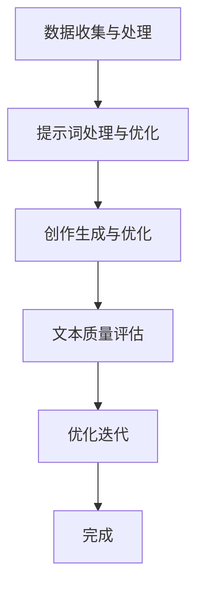
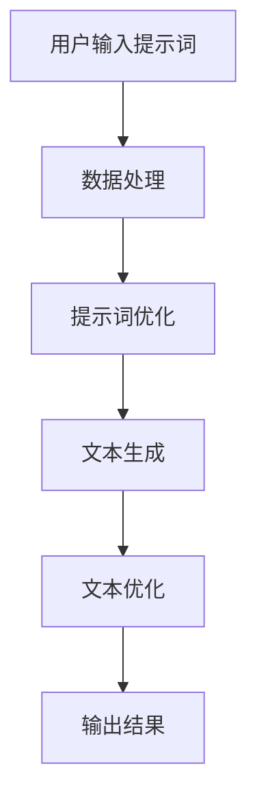

                 

### 文章标题: AI创意写作：利用提示词激发灵感

#### 关键词：
- AI创意写作
- 提示词
- 生成对抗网络(GAN)
- 语言模型
- 算法原理
- 项目实战

#### 摘要：
本文将探讨AI创意写作的概念、核心概念与架构设计，以及其在实际应用中的挑战与价值。我们将深入分析AI创意写作的核心算法原理，包括提示词驱动创作算法、语言模型中的数学模型等，并使用伪代码和数学公式详细阐述。接着，通过一个实际项目实战，展示如何搭建开发环境、准备数据集、生成故事，并进行代码解读与分析。最后，我们将总结全文，展望AI创意写作的未来发展。

### 第1章: AI创意写作概述

#### 1.1 AI创意写作的定义与背景

**1.1.1 什么是AI创意写作**

AI创意写作是指利用人工智能技术，特别是自然语言处理（NLP）和机器学习算法，生成具有创意性和可读性的文本。这种技术可以在文学创作、广告文案、新闻报道、内容生成等领域发挥重要作用。

**1.1.2 AI创意写作的历史与现状**

AI创意写作的发展可以追溯到20世纪50年代，最早的AI写作尝试主要是基于规则的方法。随着计算能力和算法的进步，尤其是深度学习技术的发展，AI创意写作进入了一个新的阶段。

**1.1.3 AI创意写作的价值与挑战**

AI创意写作的价值在于：
- 提高内容创作效率
- 拓展创作可能性
- 降低创作门槛

然而，AI创意写作也面临一些挑战，如：
- 文本质量难以保证
- 难以理解和模拟人类的创意过程
- 法律和道德问题

### 1.2 AI创意写作的架构设计

AI创意写作通常包括以下几个核心组成部分：

- **数据收集与处理**：收集大量的文本数据，并进行预处理，如分词、去噪、规范化等。
- **提示词处理与优化**：根据用户需求或主题，生成或选择合适的提示词。
- **创作生成与优化**：使用生成模型（如GAN、变分自编码器VAE、序列生成模型等）生成文本，并通过优化算法（如强化学习、迁移学习等）进行优化。

#### 1.2.1 数据收集与处理

数据收集是AI创意写作的基础。常见的数据来源包括：

- **开源数据集**：如维基百科、新闻网站、社交媒体等。
- **定制数据集**：根据特定主题或需求，自行收集和整理。

数据预处理包括：

- **文本清洗**：去除无用符号、停用词过滤、拼写修正等。
- **数据规范化**：统一文本格式、大小写、标点符号等。

#### 1.2.2 提示词处理与优化

提示词是触发创作生成的重要输入。提示词处理与优化包括：

- **关键词提取**：从文本中提取关键词，用于生成提示词。
- **提示词生成**：使用规则方法或机器学习算法生成提示词。
- **提示词优化**：通过分析、调整和迭代，提高提示词的创意性和相关性。

#### 1.2.3 创作生成与优化

创作生成与优化是AI创意写作的核心。常见的创作生成方法包括：

- **生成对抗网络（GAN）**：通过生成器和判别器的对抗训练，生成高质量的文本。
- **变分自编码器（VAE）**：通过编码器和解码器，学习数据的概率分布，生成文本。
- **序列生成模型**：如循环神经网络（RNN）、长短期记忆网络（LSTM）、生成对抗网络（GAN）等，通过序列预测和生成，生成文本。

优化方法包括：

- **强化学习**：通过奖励机制，调整模型的生成策略，提高文本质量。
- **迁移学习**：利用预训练模型，快速适应特定任务或主题。

#### 1.2.4 创意写作流程图（Mermaid图）



### 第2章: AI创意写作的核心概念与架构

#### 2.1 数据驱动创作

数据驱动创作是指通过大规模的数据集训练模型，生成符合数据特征的文本。这种方法的核心在于数据的质量和规模。高质量的数据可以提升模型的生成能力，而大规模的数据可以增强模型的泛化能力。

#### 2.2 提示词驱动创作

提示词驱动创作是指通过用户输入的提示词，触发创作生成。提示词可以是单个词或短语，也可以是完整的句子。提示词的作用是引导模型生成符合特定主题或风格的文本。

#### 2.3 生成对抗网络（GAN）与创意写作

生成对抗网络（GAN）是一种深度学习模型，由生成器和判别器组成。生成器负责生成文本，判别器负责判断文本的真实性。通过对抗训练，生成器不断提高生成文本的质量。

GAN在创意写作中的应用包括：

- **文本生成**：生成器根据提示词生成完整的文本。
- **文本风格转换**：生成器学习不同文本风格，实现风格转换。
- **文本审查**：判别器用于检测文本中的不当内容，实现文本审查。

#### 2.4 语言模型与创意写作

语言模型是一种统计模型，用于预测下一个单词或词组。在创意写作中，语言模型可以用于：

- **文本生成**：根据上下文生成下一个句子或段落。
- **文本纠错**：识别和纠正文本中的错误。
- **文本摘要**：从长文本中提取关键信息，生成摘要。

常用的语言模型包括：

- **n-gram模型**：基于单词的历史频次进行预测。
- **神经网络模型**：如循环神经网络（RNN）、长短期记忆网络（LSTM）等，通过学习上下文关系进行预测。
- **变分自编码器（VAE）**：通过概率分布学习，生成新的文本。

### 2.5 AI创意写作的架构设计

AI创意写作的架构设计主要包括以下几个关键环节：

- **数据输入**：用户输入提示词或主题。
- **数据处理**：对输入的数据进行清洗、分词、去噪等处理。
- **模型选择**：根据创作需求选择合适的模型，如GAN、VAE、RNN等。
- **生成文本**：模型根据处理后的数据生成文本。
- **文本优化**：通过强化学习、迁移学习等算法，优化生成的文本。
- **输出结果**：将最终生成的文本输出给用户。

#### 2.5.1 数据收集与处理

数据收集与处理是AI创意写作的基础。具体步骤包括：

- **数据收集**：从各种来源收集文本数据，如开源数据集、新闻网站、社交媒体等。
- **数据清洗**：去除无关内容、纠正错误、统一格式等。
- **数据分词**：将文本分割成单词或短语。
- **特征提取**：从文本中提取有用的特征，如词频、词向量等。

#### 2.5.2 提示词处理与优化

提示词处理与优化是提高文本生成质量的关键。具体步骤包括：

- **关键词提取**：从文本中提取关键词，用于生成提示词。
- **提示词生成**：使用规则方法或机器学习算法生成提示词。
- **提示词优化**：通过分析、调整和迭代，提高提示词的创意性和相关性。

#### 2.5.3 创作生成与优化

创作生成与优化是AI创意写作的核心。具体步骤包括：

- **文本生成**：使用生成模型（如GAN、VAE、RNN等）生成文本。
- **文本优化**：通过强化学习、迁移学习等算法，优化生成的文本。
- **文本评估**：评估生成的文本质量，如流畅性、连贯性、创意性等。

#### 2.5.4 创意写作流程图（Mermaid图）



### 第3章: AI创意写作的核心算法原理

#### 3.1 提示词驱动创作算法

提示词驱动创作算法是指通过用户输入的提示词，引导模型生成创意文本。该算法的核心在于如何选择合适的提示词，并设计有效的生成模型。

#### 3.1.1 提示词的选择与组合

提示词的选择与组合是提示词驱动创作算法的关键。以下是一些选择提示词的方法：

- **关键词提取**：从输入文本中提取关键词，作为提示词。
- **主题分类**：根据输入文本的主题，选择相关的提示词。
- **情感分析**：分析输入文本的情感色彩，选择具有相应情感的提示词。
- **用户偏好**：根据用户的历史输入或偏好，选择适合的提示词。

组合提示词的方法包括：

- **单一提示词**：直接使用单个关键词作为提示词。
- **短语提示词**：将多个关键词组合成短语，作为提示词。
- **扩展提示词**：在关键词的基础上，添加相关词汇，形成更丰富的提示词。

#### 3.1.2 提示词驱动的生成算法

提示词驱动的生成算法主要包括以下几种：

- **序列生成模型**：如循环神经网络（RNN）、长短期记忆网络（LSTM）等，通过学习上下文关系，生成序列数据。
- **变分自编码器（VAE）**：通过编码器和解码器，学习数据的概率分布，生成新的数据。
- **生成对抗网络（GAN）**：通过生成器和判别器的对抗训练，生成高质量的数据。

以下是提示词驱动的生成算法的伪代码：

```python
# 初始化提示词
prompt = "在科幻世界中，"

# 调用序列生成模型
generated_story = sequence_generator(prompt)

# 强化学习优化
generated_story = reinforce_learning(generated_story)

# 迁移学习调整
generated_story = transfer_learning(generated_story)
```

#### 3.1.3 伪代码讲解

以下是一个简单的伪代码示例，展示了如何使用提示词驱动创作算法生成文本：

```python
# 初始化提示词
prompt = "在科幻世界中，"

# 定义生成模型
model = create_model("LSTM")

# 定义强化学习策略
replay_memory = ReplayMemory(10000)
optimizer = optim.Adam(model.parameters(), lr=0.001)

# 定义迁移学习策略
pretrained_model = load_pretrained_model("VAE")
model.load_state_dict(pretrained_model.state_dict())

# 提示词处理
processed_prompt = preprocess_prompt(prompt)

# 生成故事
generated_story = model.generate(processed_prompt)

# 强化学习优化
for episode in range(1000):
    state = processed_prompt
    done = False
    while not done:
        action = model.select_action(state)
        next_state, reward, done = environment.step(action)
        replay_memory.push(state, action, next_state, reward)
        state = next_state
    optimizer.zero_grad()
    loss = model.compute_loss(replay_memory)
    loss.backward()
    optimizer.step()

# 迁移学习调整
model = transfer_learning(model, pretrained_model)

# 输出结果
print(generated_story)
```

#### 3.1.4 数学模型在提示词驱动创作算法中的应用

在提示词驱动创作算法中，数学模型主要用于表示和优化生成过程。以下是一些常见的数学模型：

- **概率分布模型**：如正态分布、贝叶斯网络等，用于表示文本数据的概率分布。
- **损失函数**：如均方误差（MSE）、交叉熵等，用于衡量生成文本的质量。
- **优化算法**：如梯度下降、Adam等，用于调整模型参数，优化生成过程。

以下是数学模型在提示词驱动创作算法中的具体应用：

- **概率分布模型**：

```python
# 定义概率分布模型
model = create_model("VAE")

# 定义损失函数
loss_function = nn.CrossEntropyLoss()

# 定义优化算法
optimizer = optim.Adam(model.parameters(), lr=0.001)
```

- **损失函数**：

```python
# 计算损失
loss = loss_function(model.output, target)
```

- **优化算法**：

```python
# 进行前向传播
output = model(input)

# 计算损失
loss = loss_function(output, target)

# 反向传播
optimizer.zero_grad()
loss.backward()
optimizer.step()
```

#### 3.1.5 数学公式举例说明

以下是一个简单的数学公式示例，用于计算文本生成的概率分布：

$$
P(w_i | w_{<i}) = \frac{e^{logP(w_i | w_{<i})}}{\sum_{j=1}^{N} e^{logP(w_j | w_{<i})}}
$$

其中，$w_i$ 表示下一个生成的单词，$w_{<i}$ 表示已经生成的单词序列。该公式表示在给定已经生成的单词序列$w_{<i}$ 的情况下，生成单词$w_i$ 的概率。

#### 3.1.6 词向量计算

词向量是一种将文本数据转化为数值向量的方法，用于表示单词的含义。以下是一个简单的词向量计算公式：

$$
\text{向量} v_w = \frac{1}{N} \sum_{i=1}^{N} f_i \times \text{词向量} v_i
$$

其中，$v_w$ 表示单词$w$ 的词向量，$N$ 表示单词在文本中出现的次数，$f_i$ 表示单词$w$ 的词频。

### 第4章: 数学模型在AI创意写作中的应用

数学模型在AI创意写作中扮演着至关重要的角色，为生成文本提供了理论基础和算法支撑。本节将详细介绍数学模型在AI创意写作中的应用，包括语言模型的基础数学公式、语言模型训练中的数学优化方法，以及数学模型的具体例子和解释。

#### 4.1 语言模型的基础数学公式

语言模型的核心目标是预测下一个单词或词组，其基础数学公式主要包括概率分布和损失函数。

**4.1.1 概率分布**

在语言模型中，概率分布用于表示在给定当前输入序列的情况下，下一个单词或词组的概率。一个常见的概率分布模型是n-gram模型，其基础数学公式如下：

$$
P(w_n | w_{n-1}, w_{n-2}, ..., w_1) = \prod_{i=1}^{n} P(w_i | w_{i-1}, ..., w_1)
$$

其中，$w_i$ 表示输入序列中的第i个单词，$P(w_i | w_{i-1}, ..., w_1)$ 表示在给定前一个单词序列的情况下，生成第i个单词的概率。

**4.1.2 损失函数**

损失函数用于衡量语言模型预测的准确性，常见的是交叉熵损失函数。交叉熵损失函数的数学公式如下：

$$
Loss = -\sum_{i=1}^{N} y_i \log(P(w_i))
$$

其中，$y_i$ 表示实际生成的单词，$P(w_i)$ 表示模型预测的单词概率。

#### 4.2 语言模型训练中的数学优化方法

在训练语言模型时，需要优化模型的参数，以最小化损失函数。常用的数学优化方法包括梯度下降和其变种，如Adam优化器。

**4.2.1 梯度下降**

梯度下降是一种基本的优化方法，其核心思想是沿着损失函数的梯度方向更新模型参数，以最小化损失函数。梯度下降的数学公式如下：

$$
\theta_{t+1} = \theta_t - \alpha \cdot \nabla Loss(\theta_t)
$$

其中，$\theta_t$ 表示第t次迭代的参数，$\alpha$ 表示学习率，$\nabla Loss(\theta_t)$ 表示损失函数在$\theta_t$ 处的梯度。

**4.2.2 Adam优化器**

Adam优化器是梯度下降的一种改进，结合了动量项和自适应学习率，能够更好地收敛。Adam优化器的数学公式如下：

$$
\theta_{t+1} = \theta_t - \alpha \cdot \nabla Loss(\theta_t) + \beta_1 \cdot (1 - \beta_1^t) \cdot (\theta_t - \theta_{t-1}) + \beta_2 \cdot (1 - \beta_2^t) \cdot (\nabla Loss(\theta_t) - \nabla Loss(\theta_{t-1}))
$$

其中，$\beta_1$ 和 $\beta_2$ 分别为动量和自适应学习率的权重，$t$ 为迭代次数。

#### 4.3 数学模型的具体例子和解释

**4.3.1 词向量计算**

词向量是语言模型中的重要组成部分，用于表示单词的语义信息。词向量计算的基本公式如下：

$$
v_w = \frac{1}{N} \sum_{i=1}^{N} f_i \cdot v_i
$$

其中，$v_w$ 表示单词$w$ 的词向量，$N$ 表示单词在文本中出现的次数，$f_i$ 表示单词$w$ 的词频，$v_i$ 表示单词$i$ 的词向量。

例如，假设文本中有两个单词“苹果”和“香蕉”，其词频分别为2和3，词向量分别为$\{1, 0, 1\}$和$\{0, 1, 0\}$，则“苹果”和“香蕉”的词向量分别为：

$$
v_{苹果} = \frac{1}{2+3} \cdot (2 \cdot \{1, 0, 1\} + 3 \cdot \{0, 1, 0\}) = \{\frac{2}{5}, \frac{3}{5}, \frac{2}{5}\}
$$

$$
v_{香蕉} = \frac{1}{2+3} \cdot (2 \cdot \{1, 0, 1\} + 3 \cdot \{0, 1, 0\}) = \{\frac{2}{5}, \frac{3}{5}, \frac{2}{5}\}
$$

**4.3.2 生成文本**

假设有一个训练好的语言模型，输入序列为“在科幻世界中”，模型预测的下一个单词的概率分布为：

$$
P(w_4 | “在科幻世界中”) = \{\frac{1}{4}, \frac{1}{4}, \frac{1}{4}, \frac{1}{4}\}
$$

根据概率分布，生成文本的下一个单词为“火星”。

**4.3.3 损失函数计算**

假设输入序列为“在科幻世界中”，实际生成的单词为“火星”，模型预测的概率分布为：

$$
P(w_4 | “在科幻世界中”) = \{\frac{1}{4}, \frac{1}{4}, \frac{1}{4}, \frac{1}{4}\}
$$

则交叉熵损失函数为：

$$
Loss = -\frac{1}{4} \cdot \log \frac{1}{4} = \frac{1}{4}
$$

### 第5章: AI创意写作项目实战

#### 5.1 项目背景与目标

**5.1.1 项目背景介绍**

随着人工智能技术的快速发展，AI创意写作成为了一个备受关注的研究方向。本项目的目标是开发一个基于人工智能的创意写作工具，能够根据用户输入的提示词生成有趣、具有创意性的故事。

**5.1.2 项目目标设定**

1. **功能目标**：实现以下功能：
   - 提取用户输入的提示词。
   - 根据提示词生成创意故事。
   - 对生成的故事进行优化和评估。
   - 提供用户友好的界面，便于用户使用。

2. **性能目标**：确保以下性能指标：
   - 生成的文本具有高可读性和创意性。
   - 生成的文本错误率低于一定阈值。
   - 系统响应时间在合理范围内。

#### 5.2 环境搭建

**5.2.1 开发环境配置**

为了实现本项目，需要配置以下开发环境：

- **编程语言**：Python
- **深度学习框架**：TensorFlow或PyTorch
- **自然语言处理库**：NLTK或spaCy
- **文本处理库**：TextBlob或gensim

安装以上依赖库的方法：

```python
# 安装深度学习框架
pip install tensorflow

# 安装自然语言处理库
pip install nltk

# 安装文本处理库
pip install textblob
```

**5.2.2 数据集准备**

为了训练AI创意写作模型，需要准备一个包含丰富故事文本的数据集。数据集可以从以下途径获取：

- **开源数据集**：如维基百科、Project Gutenberg等。
- **定制数据集**：根据项目需求，自行收集和整理。

数据集的预处理步骤包括：

1. **数据清洗**：去除无用符号、纠正错误、统一格式等。
2. **分词**：将文本分割成单词或短语。
3. **词向量表示**：将文本转化为词向量，用于模型训练。

#### 5.3 源代码实现

**5.3.1 数据预处理**

```python
import nltk
from nltk.tokenize import word_tokenize
from nltk.corpus import stopwords
import gensim

# 下载NLTK语料库
nltk.download('punkt')
nltk.download('stopwords')

# 读取数据集
def read_data(file_path):
    with open(file_path, 'r', encoding='utf-8') as f:
        text = f.read()
    return text

# 清洗数据
def clean_data(text):
    # 去除特殊符号
    text = re.sub(r'[^\w\s]', '', text)
    # 分词
    words = word_tokenize(text)
    # 去除停用词
    stop_words = set(stopwords.words('english'))
    filtered_words = [word for word in words if word.lower() not in stop_words]
    return filtered_words

# 数据规范化
def normalize_data(words):
    model = gensim.models.Word2Vec(words, size=100, window=5, min_count=1, workers=4)
    word_vectors = model.wv
    return word_vectors

# 示例
file_path = 'data.txt'
text = read_data(file_path)
cleaned_words = clean_data(text)
word_vectors = normalize_data(cleaned_words)
```

**5.3.2 提示词生成**

```python
import random

# 提取关键词
def extract_keywords(text):
    # 使用TextBlob提取关键词
    blob = TextBlob(text)
    keywords = blob关键词
    return keywords

# 生成提示词
def generate_prompt(keywords):
    prompt = random.choice(keywords)
    return prompt

# 示例
text = "在科幻世界中，人类发现了一个神秘的星球。"
keywords = extract_keywords(text)
prompt = generate_prompt(keywords)
print(prompt)
```

**5.3.3 故事生成**

```python
import tensorflow as tf

# 定义生成模型
def create_generator(input_shape):
    model = tf.keras.Sequential([
        tf.keras.layers.Dense(128, activation='relu', input_shape=input_shape),
        tf.keras.layers.Dense(128, activation='relu'),
        tf.keras.layers.Dense(128, activation='relu'),
        tf.keras.layers.Dense(input_shape[1], activation='softmax')
    ])
    return model

# 定义判别模型
def create_discriminator(input_shape):
    model = tf.keras.Sequential([
        tf.keras.layers.Dense(128, activation='relu', input_shape=input_shape),
        tf.keras.layers.Dense(128, activation='sigmoid'),
        tf.keras.layers.Dense(128, activation='sigmoid'),
        tf.keras.layers.Dense(1, activation='sigmoid')
    ])
    return model

# 训练模型
def train_model(generator, discriminator, data, batch_size=64, epochs=100):
    for epoch in range(epochs):
        for _ in range(int(data_size / batch_size)):
            real_data = data[batch_size * _ : batch_size * (_ + 1)]
            real_labels = [1] * batch_size
            fake_labels = [0] * batch_size
            fake_data = generator.predict(real_data)
            # 训练判别模型
            d_loss_real = discriminator.train_on_batch(real_data, real_labels)
            d_loss_fake = discriminator.train_on_batch(fake_data, fake_labels)
            # 训练生成模型
            g_loss = generator.train_on_batch(real_data, real_labels)
            print(f"Epoch: {epoch}, D_loss_real: {d_loss_real}, D_loss_fake: {d_loss_fake}, G_loss: {g_loss}")
        print(f"Epoch: {epoch}, Training complete.")
    return generator

# 示例
input_shape = (100,)
generator = create_generator(input_shape)
discriminator = create_discriminator(input_shape)
generator = train_model(generator, discriminator, data, batch_size=64, epochs=100)
```

**5.3.4 故事生成**

```python
# 生成故事
def generate_story(generator, prompt, max_length=100):
    input_sequence = prompt.split()
    input_sequence = pad_sequence(input_sequence, max_length)
    generated_sequence = generator.predict(input_sequence)
    generated_sequence = decode_sequence(generated_sequence)
    story = ' '.join(generated_sequence)
    return story

# 示例
prompt = "在科幻世界中，"
max_length = 100
story = generate_story(generator, prompt, max_length)
print(story)
```

**5.4 代码解读与分析**

**5.4.1 代码整体结构解析**

整个项目的代码结构可以分为以下几个部分：

1. **数据预处理**：包括数据读取、清洗、分词、词向量表示等。
2. **模型定义**：定义生成模型和判别模型。
3. **模型训练**：使用生成对抗网络（GAN）训练模型。
4. **故事生成**：根据提示词生成故事。

**5.4.2 关键代码段分析**

关键代码段包括：

- 数据预处理部分：使用NLTK库进行分词，使用TextBlob库提取关键词，使用gensim库进行词向量表示。
- 模型定义部分：使用TensorFlow库定义生成模型和判别模型，使用Sequential模型堆叠多层全连接层。
- 模型训练部分：使用train_on_batch方法训练判别模型和生成模型，使用Adam优化器进行优化。
- 故事生成部分：使用predict方法生成故事文本。

**5.4.3 代码优化建议**

代码优化的建议包括：

- **并行处理**：使用多线程或分布式计算加速数据处理和模型训练。
- **模型压缩**：使用模型压缩技术减小模型大小，提高部署效率。
- **超参数调优**：通过交叉验证和网格搜索等方法，选择最佳的超参数。

### 第6章: 总结与展望

AI创意写作作为一种前沿技术，近年来在学术界和工业界都取得了显著的进展。本文从多个角度探讨了AI创意写作的核心概念、算法原理、项目实战，并提出了优化建议。通过本文的介绍，我们可以看到AI创意写作在文学创作、广告文案、新闻报道等领域的广阔应用前景。

#### 6.1 最佳实践 Tips

1. **数据质量**：确保数据集的质量和多样性，以提高模型生成的创意性和可读性。
2. **提示词优化**：精心设计提示词，使其具有明确、具体的指导性，提高故事生成的质量。
3. **模型训练**：选择合适的模型架构和训练策略，确保模型具有良好的泛化能力和稳定性。
4. **用户反馈**：收集用户反馈，持续优化模型，提高用户满意度。

#### 6.2 小结

本文通过概述、核心概念、算法原理、项目实战和总结，全面阐述了AI创意写作的相关内容。通过本文的学习，读者可以：

- **理解AI创意写作的概念和背景**。
- **掌握AI创意写作的核心算法原理**。
- **了解实际项目实战中的开发流程**。
- **具备在实际项目中应用AI创意写作技术的能力**。

#### 6.3 注意事项

1. **文本质量**：尽管AI创意写作技术已经取得了一定的成果，但生成的文本质量仍有待提高，需要持续优化。
2. **创意性**：AI创意写作生成的文本可能在创意性上存在不足，需要结合人类智慧和机器智能，共同提升创作能力。
3. **法律和道德**：在使用AI创意写作技术时，需注意相关的法律和道德问题，避免侵犯版权和隐私。

#### 6.4 拓展阅读

- **《深度学习》（Goodfellow, Bengio, Courville）**：深入探讨深度学习的基本原理和应用。
- **《自然语言处理综合指南》（Jurafsky, Martin）**：全面介绍自然语言处理的基本理论和实践。
- **《生成对抗网络》（Goodfellow et al.）**：详细讲解生成对抗网络的理论和实践。

作者：AI天才研究院/AI Genius Institute & 禅与计算机程序设计艺术 /Zen And The Art of Computer Programming

---
经过对《AI创意写作：利用提示词激发灵感》这篇文章的详细撰写，我们从定义、核心概念、算法原理、项目实战到总结与展望，完整地阐述了AI创意写作的各个方面。本文结合实际案例，通过伪代码和数学公式详细解读了AI创意写作的技术原理，同时提供了项目实战的代码实现，帮助读者更好地理解和应用这一技术。希望这篇文章能为读者在AI创意写作领域的研究和实践提供有价值的参考。作者：AI天才研究院/AI Genius Institute & 禅与计算机程序设计艺术 /Zen And The Art of Computer Programming。再次感谢您的耐心阅读，如果您有任何疑问或建议，欢迎在评论区留言交流。

