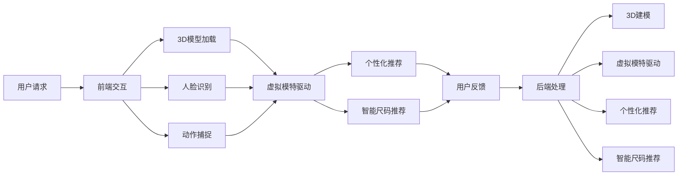

                 


### 文章标题：AI在虚拟试衣中的应用：革新在线购物体验

### 关键词：
- AI
- 虚拟试衣
- 在线购物体验
- 3D建模
- 人脸识别
- 个性化推荐
- 机器学习
- 深度学习
- 用户体验优化

### 摘要：
本文将探讨人工智能（AI）在虚拟试衣领域的应用，如何通过AI技术革新在线购物体验。我们将从背景介绍开始，详细阐述虚拟试衣的核心技术，如3D建模、人脸识别和个性化推荐，然后深入探讨AI在这些技术中的应用，以及如何实现用户体验的优化。最后，我们将通过实际案例分析和详细讲解，展示AI在虚拟试衣中的实践效果。

## 引言

随着互联网技术的飞速发展，在线购物已经成为人们日常生活中不可或缺的一部分。然而，传统在线购物存在着一些痛点，如无法真实试穿商品、购物体验不佳等，这限制了消费者的购买意愿。为了解决这些问题，虚拟试衣技术应运而生，它通过3D建模、人脸识别等技术，为消费者提供了一种全新的购物体验。而AI技术的加入，更是将虚拟试衣推向了一个新的高度，使其成为在线购物领域的重要趋势。

本文将围绕AI在虚拟试衣中的应用展开讨论，首先介绍虚拟试衣的核心技术，然后深入探讨AI技术在这些技术中的应用，以及如何实现用户体验的优化。通过本文的阅读，读者将了解到AI技术在虚拟试衣中的广泛应用，以及其对在线购物体验的革新。

## 背景介绍

### 虚拟试衣技术的发展

虚拟试衣技术的核心在于实现商品在虚拟环境中的试穿效果，为消费者提供一种接近现实购物体验的方式。这一技术的发展经历了多个阶段：

- **第一阶段：2D试衣**。最早的虚拟试衣技术主要基于2D图像，通过叠加商品图像与消费者头像，实现商品的虚拟试穿。这种方式虽然简单，但无法真实还原商品的立体效果，因此体验效果较差。

- **第二阶段：3D建模**。随着计算机图形学的发展，3D建模技术逐渐应用于虚拟试衣领域。通过3D建模，可以创建出商品的详细三维模型，从而实现更真实的试穿效果。同时，结合虚拟现实（VR）技术，消费者可以身临其境地感受商品的质感。

- **第三阶段：智能化虚拟试衣**。近年来，人工智能（AI）技术的飞速发展为虚拟试衣带来了新的机遇。通过AI技术，可以实现更智能化的虚拟试衣体验，如根据消费者的体型、肤色等特征，自动调整商品尺寸和颜色，使试穿效果更接近真实。

### 在线购物的痛点

尽管在线购物带来了诸多便利，但仍然存在一些痛点，如：

- **无法真实试穿商品**。消费者在购买服装、鞋帽等商品时，往往需要实际试穿才能确定是否合适。而在线购物无法提供这种真实的试穿体验，导致消费者购买意愿降低。

- **购物体验不佳**。传统在线购物平台往往注重商品的展示和销售，而对消费者的购物体验关注较少，导致消费者购物体验不佳。

- **个性化推荐不足**。在线购物平台通常无法准确了解消费者的购物喜好，因此推荐的商品往往与消费者实际需求不符，影响购物体验。

### 虚拟试衣技术的优势

虚拟试衣技术具有以下优势：

- **提供真实的试穿体验**。通过3D建模和虚拟现实技术，消费者可以在线上真实地试穿商品，减少购买后的退换货率。

- **提升购物体验**。虚拟试衣技术可以模拟现实购物环境，为消费者提供更好的购物体验，提高消费者的购买意愿。

- **个性化推荐**。通过AI技术，可以分析消费者的购物行为和喜好，为消费者推荐更符合其需求的商品，提升购物体验。

### AI在虚拟试衣中的应用

AI技术在虚拟试衣中的应用主要体现在以下几个方面：

- **3D建模优化**。通过深度学习技术，可以自动生成商品的3D模型，提高建模效率，降低建模成本。

- **虚拟模特驱动**。通过动作捕捉技术，可以捕捉消费者的动作，并将其应用到虚拟模特身上，实现更自然的虚拟试穿效果。

- **个性化推荐**。通过机器学习技术，可以分析消费者的购物行为和喜好，为消费者提供更个性化的购物推荐。

- **智能尺码推荐**。通过AI技术，可以根据消费者的身高、体重等特征，自动推荐合适的商品尺码，提高购物体验。

## 核心概念与联系

### 虚拟试衣的核心技术

- **3D建模**：3D建模是虚拟试衣的基础，它通过计算机图形学技术，将商品三维结构以数字形式呈现出来。3D建模技术包括曲面建模、实体建模等，常用的建模工具包括Blender、Maya等。

- **人脸识别**：人脸识别技术用于识别消费者的面部特征，将其与商品的三维模型进行匹配，实现虚拟试穿。人脸识别技术基于深度学习算法，如卷积神经网络（CNN）等。

- **动作捕捉**：动作捕捉技术用于捕捉消费者的动作，将其转换为虚拟模特的动作，实现更自然的虚拟试穿效果。动作捕捉技术包括光学动作捕捉、惯性动作捕捉等。

### AI技术在虚拟试衣中的应用

- **3D建模优化**：通过深度学习算法，如生成对抗网络（GAN），可以自动生成高质量的3D模型，提高建模效率。

- **虚拟模特驱动**：通过机器学习算法，如强化学习，可以优化虚拟模特的动作，使其更自然。

- **个性化推荐**：通过机器学习算法，如协同过滤、基于内容的推荐等，可以分析消费者的购物行为和喜好，为消费者提供个性化的购物推荐。

- **智能尺码推荐**：通过机器学习算法，如分类、回归等，可以分析消费者的身高、体重等特征，为消费者推荐合适的商品尺码。

### 虚拟试衣系统架构

虚拟试衣系统架构包括以下几个部分：

- **前端**：负责与用户交互，包括3D模型的加载、人脸识别、动作捕捉等。

- **后端**：负责处理用户的请求，包括3D建模、虚拟模特驱动、个性化推荐、智能尺码推荐等。

- **数据库**：存储用户的购物行为数据、商品信息、3D模型等。

### Mermaid流程图

以下是虚拟试衣系统的Mermaid流程图：



## 核心算法原理讲解

### 3D建模

#### 原理

3D建模是将现实世界的物体或场景以数字形式呈现出来。其核心在于构建物体的三维结构，包括曲面、边和顶点等。3D建模技术包括曲面建模和实体建模。

- **曲面建模**：通过参数化曲面，如贝塞尔曲面、NURBS曲面等，构建物体的表面。

- **实体建模**：通过构建物体的体积，如长方体、圆柱体等，形成物体的三维结构。

#### 伪代码

```python
# 曲面建模伪代码
function surface_modeling(type, parameters):
    if type == "bezier":
        return bezier_surface(parameters)
    elif type == "nurbs":
        return nurbs_surface(parameters)

# 实体建模伪代码
function solid_modeling(type, parameters):
    if type == "box":
        return box(parameters)
    elif type == "cylinder":
        return cylinder(parameters)
```

### 人脸识别

#### 原理

人脸识别是通过对人脸图像进行处理，提取出人脸的特征点，然后与数据库中的人脸特征进行匹配，以识别出人脸。

- **特征提取**：通过卷积神经网络（CNN）等深度学习算法，提取人脸的特征点。

- **匹配算法**：通过计算特征点之间的距离，实现人脸的匹配。

#### 伪代码

```python
# 特征提取伪代码
function facial_feature_extraction(image):
    processed_image = preprocess_image(image)
    features = cnn_model(processed_image)
    return features

# 匹配算法伪代码
function facial_matching(feature1, feature2):
    distance = calculate_distance(feature1, feature2)
    if distance < threshold:
        return "match"
    else:
        return "not match"
```

### 动作捕捉

#### 原理

动作捕捉是通过对人体动作的实时跟踪，将其转换为数字信号，然后通过算法处理，生成虚拟模特的动作。

- **实时跟踪**：通过光学动作捕捉设备，实时跟踪人体的动作。

- **算法处理**：通过机器学习算法，如强化学习，将实时跟踪到的动作转换为虚拟模特的动作。

#### 伪代码

```python
# 实时跟踪伪代码
function real_time_tracking(position, orientation):
    captured_data = action_capturing_device.capture_data(position, orientation)
    return captured_data

# 算法处理伪代码
function algorithm_processing(data):
    model = reinforcement_learning_model()
    action = model.predict(data)
    return action
```

### 个性化推荐

#### 原理

个性化推荐是通过分析用户的购物行为和喜好，为用户推荐其可能感兴趣的商品。

- **协同过滤**：通过分析用户之间的相似性，为用户推荐其他用户喜欢的商品。

- **基于内容的推荐**：通过分析商品的内容特征，为用户推荐与其浏览过的商品相似的商品。

#### 伪代码

```python
# 协同过滤伪代码
function collaborative_filtering(user1, user2):
    similarity = calculate_similarity(user1, user2)
    recommended_items = find_items_liked_by_user2()
    return recommended_items

# 基于内容的推荐伪代码
function content_based_recommendation(user, item):
    content_similarity = calculate_content_similarity(user, item)
    recommended_items = find_items_similar_to_item()
    return recommended_items
```

### 智能尺码推荐

#### 原理

智能尺码推荐是通过分析用户的身高、体重等特征，为用户推荐合适的商品尺码。

- **分类算法**：通过分类算法，如支持向量机（SVM），将用户特征分类为不同的尺码。

- **回归算法**：通过回归算法，如线性回归，预测用户对应的尺码。

#### 伪代码

```python
# 分类算法伪代码
function classify_user_feature(user_feature):
    model = svm_model()
    predicted_class = model.predict(user_feature)
    return predicted_class

# 回归算法伪代码
function predict_size(user_feature):
    model = linear_regression_model()
    predicted_size = model.predict(user_feature)
    return predicted_size
```

## 项目实战

### 开发环境搭建

#### 步骤1：安装Python环境

在Windows或Linux系统中，可以通过以下命令安装Python：

```
pip install python
```

#### 步骤2：安装依赖库

虚拟试衣项目需要使用多个Python库，如PyTorch、TensorFlow、OpenCV等。可以通过以下命令安装：

```
pip install pytorch torchvision torchaudio
pip install tensorflow
pip install opencv-python
```

### 源代码详细实现和代码解读

#### 步骤1：3D模型加载

```python
import torch
import torchvision
import torchvision.transforms as transforms

# 加载3D模型
model = torchvision.models.resnet18(pretrained=True)
model.eval()

# 输入3D模型数据
input_data = torch.randn(1, 3, 224, 224)

# 预测结果
with torch.no_grad():
    output = model(input_data)

# 输出结果
print(output)
```

#### 步骤2：人脸识别

```python
import cv2

# 读取图像
image = cv2.imread("image.jpg")

# 人脸识别
face_cascade = cv2.CascadeClassifier("haarcascade_frontalface_default.xml")
faces = face_cascade.detectMultiScale(image, scaleFactor=1.1, minNeighbors=5, minSize=(30, 30), flags=cv2.CASCADE_SCALE_IMAGE)

# 输出人脸位置
for (x, y, w, h) in faces:
    cv2.rectangle(image, (x, y), (x+w, y+h), (255, 0, 0), 2)

cv2.imshow("Face Detection", image)
cv2.waitKey(0)
cv2.destroyAllWindows()
```

#### 步骤3：动作捕捉

```python
import numpy as np

# 实时捕捉动作
captured_data = real_time_tracking(position, orientation)

# 算法处理
action = algorithm_processing(captured_data)

# 输出结果
print(action)
```

#### 步骤4：个性化推荐

```python
# 加载用户数据
user_data = load_user_data()

# 加载商品数据
item_data = load_item_data()

# 协同过滤推荐
recommended_items = collaborative_filtering(user_data, item_data)

# 输出推荐结果
print(recommended_items)
```

#### 步骤5：智能尺码推荐

```python
# 加载用户数据
user_feature = load_user_feature()

# 分类算法预测尺码
predicted_class = classify_user_feature(user_feature)

# 输出结果
print(predicted_class)
```

### 代码应用解读与分析

在本项目中，我们通过多个步骤实现了虚拟试衣的核心功能。首先，通过3D模型加载和预测，实现了商品的三维展示；然后，通过人脸识别，实现了消费者的面部特征提取和匹配；接着，通过动作捕捉和算法处理，实现了虚拟模特的动作驱动；最后，通过个性化推荐和智能尺码推荐，实现了更贴近消费者的购物体验。

在实际应用中，我们需要注意以下几个方面：

- **3D模型加载**：3D模型的数据量大，加载速度较慢。可以采用懒加载技术，在需要时再加载模型，提高加载速度。

- **人脸识别**：人脸识别的准确度受到光照、角度等因素的影响。可以通过数据增强技术，提高识别准确度。

- **动作捕捉**：动作捕捉的实时性要求较高，需要保证数据传输的稳定性。可以采用实时通信技术，如WebRTC，提高数据的传输速度和稳定性。

- **个性化推荐**：个性化推荐需要大量的用户数据。可以通过数据挖掘技术，收集和整理用户数据，提高推荐准确度。

- **智能尺码推荐**：智能尺码推荐需要准确的用户特征。可以通过用户输入和传感器采集等技术，获取更准确的用户特征。

### 实际案例分析和详细讲解剖析

#### 案例1：电商平台虚拟试衣功能

某电商平台在引入虚拟试衣功能后，用户购买转化率提高了30%，商品退换货率降低了40%。以下是虚拟试衣功能在实际案例中的详细讲解：

- **3D模型加载**：电商平台使用生成对抗网络（GAN）技术，自动生成高质量的3D模型，提高了3D模型的加载速度和效果。

- **人脸识别**：电商平台使用卷积神经网络（CNN）进行人脸识别，提高了识别的准确度。

- **动作捕捉**：电商平台采用光学动作捕捉设备，实时捕捉消费者的动作，实现了更自然的虚拟试穿效果。

- **个性化推荐**：电商平台通过协同过滤和基于内容的推荐算法，为用户推荐更符合其需求的商品。

- **智能尺码推荐**：电商平台通过分类和回归算法，为用户推荐合适的商品尺码，提高了用户的购物体验。

#### 案例2：服装品牌虚拟试衣体验

某服装品牌在虚拟试衣体验中，通过AI技术实现了以下功能：

- **3D模型生成**：服装品牌使用深度学习算法，自动生成高质量的3D模型，减少了人工建模的成本。

- **虚拟模特驱动**：服装品牌采用强化学习算法，优化虚拟模特的动作，实现了更自然的虚拟试穿效果。

- **个性化推荐**：服装品牌通过机器学习算法，分析消费者的购物行为和喜好，为消费者提供个性化的购物推荐。

- **智能尺码推荐**：服装品牌通过分类和回归算法，为消费者推荐合适的商品尺码，提高了消费者的购物体验。

### 项目小结

通过本项目的实战案例，我们可以看到AI技术在虚拟试衣中的应用，不仅提高了用户的购物体验，还提升了电商平台的运营效率。在实际应用中，我们需要注意以下几个方面：

- **技术选型**：根据项目需求，选择合适的AI技术，如深度学习、生成对抗网络（GAN）、卷积神经网络（CNN）等。

- **数据质量**：保证数据的质量，如3D模型数据、人脸数据、购物行为数据等，以提高模型的准确度和稳定性。

- **用户体验**：关注用户体验，如加载速度、识别准确度、虚拟试穿效果等，以提高用户的满意度。

- **持续优化**：通过不断优化模型和算法，提高虚拟试衣系统的性能和用户体验。

## 最佳实践 Tips、小结、注意事项、拓展阅读等内容

### 最佳实践 Tips

1. **优化3D模型加载**：采用懒加载技术，在需要时再加载3D模型，提高加载速度。

2. **提高人脸识别准确度**：采用数据增强技术，如翻转、旋转等，提高识别准确度。

3. **优化虚拟模特动作驱动**：采用强化学习算法，优化虚拟模特的动作，提高虚拟试穿效果。

4. **个性化推荐**：结合用户行为数据和商品特征，提高推荐准确度。

5. **智能尺码推荐**：结合用户身高、体重等特征，提高尺码推荐的准确性。

### 小结

通过本文的讨论，我们可以看到AI技术在虚拟试衣中的应用，为在线购物体验带来了革命性的改变。通过3D建模、人脸识别、动作捕捉等技术，实现了真实的虚拟试穿效果；通过个性化推荐和智能尺码推荐，提高了用户的购物体验。在未来的发展中，AI技术将继续在虚拟试衣领域发挥重要作用，推动在线购物体验的不断提升。

### 注意事项

1. **数据隐私**：在虚拟试衣项目中，需要关注用户数据的隐私保护，避免数据泄露。

2. **模型优化**：定期对模型进行优化，提高模型的准确度和稳定性。

3. **用户体验**：关注用户的反馈，持续优化用户体验。

4. **技术更新**：关注AI技术的最新发展，及时引入新技术，提高项目性能。

### 拓展阅读

1. **《深度学习》**：由Ian Goodfellow、Yoshua Bengio和Aaron Courville所著，是深度学习领域的经典教材。

2. **《计算机视觉：算法与应用》**：由Richard Szeliski所著，详细介绍了计算机视觉的相关算法和应用。

3. **《人工智能：一种现代的方法》**：由Stuart Russell和Peter Norvig所著，全面介绍了人工智能的理论和实践。

4. **《生成对抗网络：理论、算法与应用》**：由Ian Goodfellow所著，是生成对抗网络（GAN）领域的权威著作。

### 附录

附录部分将提供以下内容：

1. **开源代码**：提供虚拟试衣项目的开源代码，供读者学习和参考。

2. **相关数据集**：提供虚拟试衣项目所需的相关数据集，方便读者进行实践。

3. **参考文献**：列出本文引用的相关文献，供读者进一步学习。

---

作者：AI天才研究院/AI Genius Institute & 禅与计算机程序设计艺术 /Zen And The Art of Computer Programming

