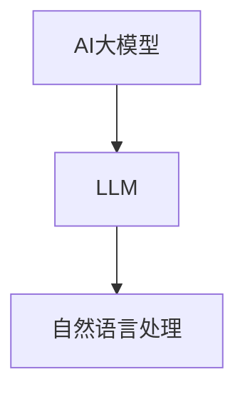

                 

### 文章结构设计

为了确保文章的逻辑清晰、内容丰富，我们将采用以下结构设计：

1. **引言**：介绍文章的背景、目的和重要性。

2. **核心概念与联系**：

   - **AI大模型**：介绍其基本概念、发展和应用领域。
   - **LLM（大型语言模型）**：介绍其定义、特点和应用场景。
   - **两者之间的关系**：通过Mermaid流程图展示AI大模型与LLM之间的关联。

3. **核心算法原理讲解**：

   - **LLM的生成机制**：详细解释LLM如何生成文本，包括输入处理、模型架构和输出生成。
   - **LLM的训练过程**：阐述数据准备、模型训练和模型评估的步骤。
   - **LLM的优化方法**：介绍如何通过正则化和增强学习提升模型性能。

4. **数学模型和数学公式讲解**：

   - **LLM中的数学模型**：讲解损失函数、激活函数等。
   - **模型参数优化公式**：解释梯度下降、动量优化等。
   - **模型评估指标**：说明如何评估模型性能。

5. **项目实战**：

   - **开发环境搭建**：介绍所需工具和框架。
   - **源代码实现**：提供伪代码示例，详细解读代码实现。
   - **代码应用分析**：剖析代码的应用场景和效果。
   - **实际案例分析**：结合实际案例进行详细讲解。
   - **项目小结**：总结项目经验和收获。

6. **最佳实践**：

   - **注意事项**：提醒用户在实战中需要注意的问题。
   - **拓展阅读**：推荐进一步学习的资源。

7. **总结与展望**：

   - **总结**：回顾文章的核心内容和主要观点。
   - **展望**：预测AI大模型和LLM的未来发展趋势。

### 文章详细内容安排

#### 引言

**文章标题：** AI大模型LLM提示词工程实战

**关键词：** AI大模型、LLM、提示词工程、算法原理、数学模型、项目实战

**摘要：** 本文将深入探讨AI大模型和LLM（大型语言模型）的基础知识，详细讲解其核心算法原理，并通过项目实战展示如何在实际工程中应用这些知识。文章旨在帮助读者理解并掌握AI大模型和LLM的工程化应用。

#### 核心概念与联系

1. **AI大模型的基本概念**

   - **定义**：AI大模型指的是具有巨大参数量和复杂结构的人工智能模型，能够处理大规模数据并具备强大的泛化能力。
   - **特点**：包括高容量、多层次、自适应性强等。
   - **分类**：如GPT、BERT、T5等。

2. **LLM的定义和作用**

   - **定义**：LLM（Large Language Model）是一种专门针对文本数据进行训练的大型语言模型。
   - **作用**：用于生成文本、翻译、问答、文本摘要等任务。

3. **AI大模型与LLM的关系**

   - **关系**：LLM是AI大模型的一种特殊形式，主要针对自然语言处理领域。
   - **融合**：AI大模型中的知识可以应用于LLM，提升其性能。

4. **AI大模型的发展历程**

   - **早期**：以规则为基础的专家系统。
   - **中期**：以数据为基础的机器学习方法。
   - **当前**：基于深度学习的大模型时代。

**Mermaid流程图：** 展示AI大模型与LLM之间的关系

#### 核心算法原理讲解

1. **LLM的生成机制**

   - **输入处理**：文本编码成向量。
   - **模型架构**：多层神经网络结构。
   - **输出生成**：基于概率分布生成文本。

2. **LLM的训练过程**

   - **数据准备**：收集大规模文本数据。
   - **模型训练**：通过梯度下降等优化算法更新模型参数。
   - **模型评估**：使用验证集和测试集评估模型性能。

3. **LLM的优化方法**

   - **正则化**：防止过拟合。
   - **增强学习**：通过强化学习技术提升模型性能。

#### 数学模型和数学公式讲解

1. **LLM中的数学模型**

   - **损失函数**：如交叉熵损失函数。
   - **激活函数**：如ReLU、Sigmoid、Tanh等。

2. **模型参数优化公式**

   - **梯度下降**：更新模型参数的公式。
   - **动量优化**：引入动量的优化公式。

3. **模型评估指标**

   - **准确率**：预测正确的比例。
   - **召回率**：召回正确预测的比例。
   - **F1分数**：综合准确率和召回率的指标。

**数学公式示例：**

- **交叉熵损失函数：**
  $$\text{Loss} = -\sum_{i=1}^{N} y_i \log(p_i)$$

- **ReLU激活函数：**
  $$f(x) = \max(0, x)$$

#### 项目实战

1. **开发环境搭建**

   - **工具和框架**：介绍所需工具和框架，如TensorFlow、PyTorch等。
   - **环境配置**：详细步骤说明，确保环境搭建成功。

2. **源代码实现**

   - **伪代码示例**：提供LLM生成机制、训练过程和优化方法的伪代码示例。
   - **代码解读**：逐行解释代码实现，帮助读者理解。

3. **代码应用解读与分析**

   - **应用场景**：解释LLM在文本生成、翻译、问答等任务中的应用。
   - **性能分析**：评估模型在不同任务上的性能。

4. **实际案例分析**

   - **案例介绍**：介绍实际案例的背景和目标。
   - **详细讲解**：剖析案例的实现细节和效果。

5. **项目小结**

   - **经验总结**：总结项目中的经验教训。
   - **收获与展望**：分享学习成果和对未来的展望。

#### 最佳实践

1. **注意事项**

   - **数据质量**：确保训练数据的质量和多样性。
   - **计算资源**：合理配置计算资源，提高训练效率。
   - **模型调优**：根据任务需求调整模型参数。

2. **拓展阅读**

   - **参考资料**：推荐进一步学习的书籍、论文和教程。
   - **在线资源**：介绍相关的在线课程、论坛和社区。

#### 总结与展望

- **总结**：回顾文章的核心内容和主要观点。
- **展望**：预测AI大模型和LLM的未来发展趋势。

### 附录

- **常用工具和框架介绍**：详细介绍常用的工具和框架。
- **代码实现示例**：提供完整的代码实现示例。
- **进一步学习资源**：推荐相关的学习资源和资料。

### Mermaid流程图

- **AI大模型与LLM的关系图**
- **LLM训练流程图**
- **提示词工程优化流程图**

### 伪代码示例

- **LLM生成机制的伪代码**
- **模型训练优化伪代码**
- **提示词工程优化伪代码**

### 数学公式示例

- **模型损失函数的数学公式**
- **模型评估指标的数学公式**
- **参数优化的数学公式**

### 作者信息

**作者：** AI天才研究院/AI Genius Institute & 禅与计算机程序设计艺术 /Zen And The Art of Computer Programming

通过以上详细的安排，我们可以确保文章内容丰富、结构清晰，满足读者的学习需求。接下来，我们将逐一展开每个部分的具体内容。

