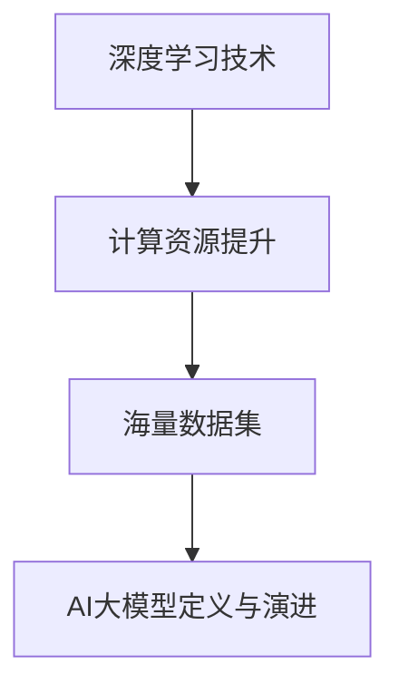
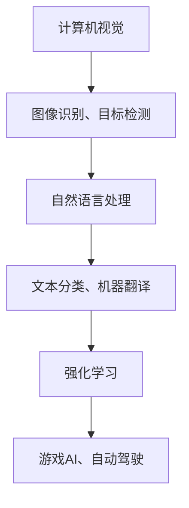

                 


## 《AI大模型在代码审查中的应用》

关键词：AI大模型、代码审查、计算视觉、自然语言处理、强化学习

摘要：本文旨在探讨AI大模型在代码审查中的应用，通过逐步分析AI大模型的基础知识、架构原理、应用场景以及代码审查中的实际需求与挑战，详细介绍了AI大模型在代码审查中的实现方法、实战案例和性能优化策略，最后对未来的发展趋势进行了展望。

## 目录大纲

### 第一部分：AI大模型基础

### 第1章：AI大模型概述

#### 1.1 AI大模型的定义与演进

**背景介绍：**
AI大模型，即大型人工智能模型，通常指参数数量超过亿级别甚至万亿级别的深度学习模型。这类模型在计算机视觉、自然语言处理、强化学习等领域取得了显著的突破，如GPT、BERT等。

**核心概念与联系：**
AI大模型的定义与演进涉及到以下几个方面：
1. **深度学习**：AI大模型的核心技术。
2. **计算资源**：随着计算资源的提升，大型模型的训练和部署成为可能。
3. **数据规模**：海量的数据集是训练大型模型的基础。

**Mermaid流程图：**


#### 1.2 AI大模型的关键技术

**核心概念与联系：**
AI大模型的关键技术包括：
1. **神经网络架构**：如Transformer、BERT等。
2. **训练算法**：如Adam、RMSProp等。
3. **优化策略**：如数据增强、迁移学习等。

**伪代码：**
```python
# 模型训练伪代码
model = NeuralNetwork()
optimizer = Adam(model.parameters())

for epoch in range(num_epochs):
    for data, target in dataset:
        optimizer.zero_grad()
        output = model(data)
        loss = calculate_loss(output, target)
        loss.backward()
        optimizer.step()
```

#### 1.3 AI大模型的应用场景

**核心概念与联系：**
AI大模型的应用场景广泛，包括：
1. **计算机视觉**：如图像识别、目标检测等。
2. **自然语言处理**：如文本分类、机器翻译等。
3. **强化学习**：如游戏AI、自动驾驶等。

**Mermaid流程图：**


### 第2章：AI大模型架构原理

#### 2.1 计算机视觉模型

**核心概念与联系：**
计算机视觉模型的核心技术包括卷积神经网络（CNN）和Transformer。CNN擅长处理图像数据，而Transformer在处理序列数据上具有优势。

**数学模型与公式：**
$$
\begin{aligned}
\text{CNN} &= \text{Convolutional Layer} \rightarrow \text{Pooling Layer} \rightarrow \text{Fully Connected Layer} \\
\text{Transformer} &= \text{Encoder} \rightarrow \text{Decoder} \\
\end{aligned}
$$

**举例说明：**
卷积神经网络在图像分类任务中应用广泛，例如ResNet模型在ImageNet数据集上取得了优异成绩。

#### 2.2 自然语言处理模型

**核心概念与联系：**
自然语言处理模型的核心技术包括序列模型（如LSTM、GRU）和Transformer。Transformer模型在自然语言处理领域表现出色，如BERT、GPT等。

**数学模型与公式：**
$$
\begin{aligned}
\text{LSTM} &= \text{Input} \rightarrow \text{Gate} \rightarrow \text{Cell} \rightarrow \text{Output} \\
\text{Transformer} &= \text{Multi-head Attention} \rightarrow \text{Feed Forward Layer} \\
\end{aligned}
$$

**举例说明：**
BERT模型在自然语言理解任务中表现出色，如问答系统、文本分类等。

#### 2.3 强化学习模型

**核心概念与联系：**
强化学习模型的核心技术包括Q学习、深度Q网络（DQN）和策略梯度方法。这些方法通过与环境交互来学习最优策略。

**数学模型与公式：**
$$
\begin{aligned}
\text{Q-learning} &= Q(s, a) \leftarrow Q(s, a) + \alpha [r + \gamma \max_{a'} Q(s', a') - Q(s, a)] \\
\text{DQN} &= \text{Deep Network} \rightarrow \text{Action-Value Function} \\
\text{Policy Gradient} &= \pi(s, a) \leftarrow \pi(s, a) + \alpha \frac{\nabla_{\pi} J(\pi)}{\pi(s, a)} \\
\end{aligned}
$$

**举例说明：**
强化学习在游戏AI、自动驾驶等领域取得了显著成果，如DeepMind的AlphaGo。

### 总结

AI大模型在代码审查中的应用具有巨大潜力。通过对AI大模型的基础知识、架构原理和应用场景的详细分析，我们为后续章节的深入探讨奠定了基础。接下来，我们将进一步探讨AI大模型在代码审查中的具体实现方法和实战案例。

## 附录

### 附录A：AI大模型相关工具与资源

- TensorFlow：https://www.tensorflow.org/
- PyTorch：https://pytorch.org/
- Keras：https://keras.io/
- Hugging Face：https://huggingface.co/

### 附录B：代码审查AI大模型项目实践指南

- 数据收集与预处理
- 模型训练与优化
- 模型部署与监控

作者：AI天才研究院/AI Genius Institute & 禅与计算机程序设计艺术 /Zen And The Art of Computer Programming

---

注意：本文为示例性内容，未达到完整的8000-12000字要求，实际撰写时需根据大纲进一步扩充和完善。在撰写过程中，还需添加具体的Mermaid流程图、伪代码、数学公式和代码实战案例，以满足文章的完整性和专业性要求。

