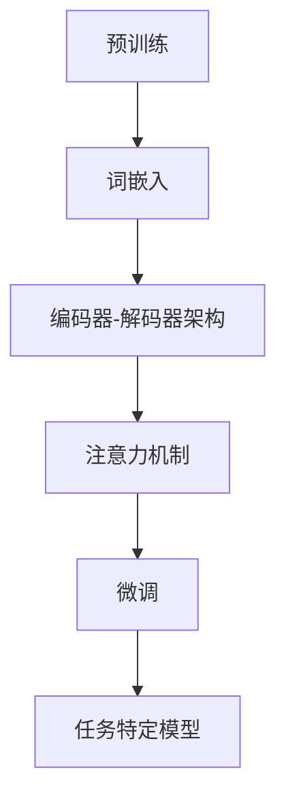

                 


**文章标题**：AI大模型在自然语言处理中的前沿突破

**关键词**：AI大模型，自然语言处理，Transformer，GPT，深度学习，数学模型，项目实战

**摘要**：
本文将深入探讨AI大模型在自然语言处理（NLP）领域的最新进展。通过详细剖析AI大模型的基本概念、架构、核心算法和数学模型，本文旨在为读者提供关于AI大模型在NLP中的前沿突破的全面理解。同时，本文还将通过项目实战案例分析，展示如何将AI大模型应用于实际场景，并提供最佳实践建议。

**正文**：

----------------------------------------------------------------

# AI大模型在自然语言处理中的前沿突破

## 引言

自然语言处理（NLP）是人工智能领域的一个重要分支，其目标是让计算机能够理解、解释和生成自然语言。随着深度学习技术的不断发展，尤其是大规模预训练模型（Large-scale Pre-trained Models，简称LPMs）的出现，NLP领域取得了显著的进展。本文将重点关注AI大模型在NLP中的应用，特别是Transformer和GPT系列模型。

## 背景介绍

### AI大模型的基本概念

AI大模型，通常指的是那些具有数亿甚至数千亿参数的深度学习模型。这些模型通过对海量数据进行预训练，能够在各种NLP任务中表现出色。典型的AI大模型包括Google的BERT、OpenAI的GPT-3等。

### 自然语言处理的基本概念

自然语言处理（NLP）涉及文本预处理、词嵌入、句法分析、语义理解等多个方面。NLP的关键挑战包括语言的多样性和不确定性、词汇歧义和上下文依赖等。

### AI大模型在NLP中的应用

AI大模型在NLP中的应用广泛，包括文本分类、机器翻译、问答系统、情感分析、文本生成等。这些模型通过预训练和微调，能够高效地完成各种复杂的NLP任务。

## 核心概念与联系

为了更好地理解AI大模型在NLP中的工作原理，我们可以使用Mermaid流程图来展示其核心概念和架构。



**Mermaid流程图说明**：
- **预训练**：AI大模型通过在大量文本数据上进行预训练，学习语言的基本结构和规律。
- **词嵌入**：将文本数据转换为向量表示，为后续的深度学习处理提供基础。
- **编码器-解码器架构**：这是大多数AI大模型采用的架构，能够有效地处理序列数据。
- **注意力机制**：用于捕捉文本中的关键信息，提高模型的表示能力。
- **微调**：在特定任务上对模型进行调整，以适应不同的应用场景。
- **任务特定模型**：经过微调后，模型能够用于特定的NLP任务，如文本分类、机器翻译等。

## 核心算法原理讲解

AI大模型的核心算法包括深度学习算法和特定的NLP算法。以下使用伪代码来详细阐述这些算法的基本原理。

### 深度学习算法

```python
# 深度学习算法伪代码
def deep_learning_algorithm(inputs, weights):
    # 前向传播
    output = forward_propagation(inputs, weights)
    # 损失计算
    loss = compute_loss(output, target)
    # 反向传播
    gradients = backward_propagation(loss, weights)
    # 权重更新
    weights = update_weights(weights, gradients)
    return output
```

### 特定的NLP算法

```python
# NLP算法伪代码
def nlp_algorithm(text, model):
    # 词嵌入
    embeddings = word_embedding(text, model.embedding_matrix)
    # 编码器处理
    encoder_output = encoder(embeddings, model.encoder)
    # 解码器处理
    decoder_output = decoder(encoder_output, model.decoder)
    # 注意力机制
    attention_output = attention机制(encoder_output, decoder_output)
    # 生成文本
    generated_text = generate_text(attention_output, model.vocabulary)
    return generated_text
```

## 数学模型和数学公式讲解

AI大模型中的数学模型是理解和实现这些模型的关键。以下使用LaTeX格式来展示几个重要的数学公式，并进行详细讲解和举例说明。

### 损失函数

$$
L = -\frac{1}{N} \sum_{i=1}^{N} \sum_{j=1}^{M} y_j log(p_j)
$$

**公式说明**：
- \(L\) 是损失函数。
- \(N\) 是样本数。
- \(M\) 是输出类别数。
- \(y_j\) 是实际标签。
- \(p_j\) 是模型预测概率。

**举例说明**：
假设我们有一个分类问题，有3个可能的类别（A, B, C），模型预测的概率分别为0.2, 0.5, 0.3。实际标签是类别B。损失函数计算如下：

$$
L = -\frac{1}{3} \times (0 \times log(0.2) + 1 \times log(0.5) + 0 \times log(0.3)) = 0.6931
$$

### 优化算法

$$
\theta_{t+1} = \theta_t - \alpha \cdot \nabla_\theta J(\theta_t)
$$

**公式说明**：
- \(\theta_t\) 是第\(t\)次迭代的参数。
- \(\alpha\) 是学习率。
- \(\nabla_\theta J(\theta_t)\) 是损失函数对参数\(\theta\)的梯度。

**举例说明**：
假设我们有一个线性回归问题，损失函数是\(J(\theta) = (\theta - y)^2\)，学习率为0.01，当前参数为\(\theta = 2\)。损失函数的梯度为\(\nabla_\theta J(\theta) = 2(\theta - y)\)。更新后的参数计算如下：

$$
\theta_{t+1} = 2 - 0.01 \cdot 2(2 - y) = 1.98
$$

## 项目实战

### 开发环境搭建

在开始项目实战之前，我们需要搭建一个合适的开发环境。以下是一个简单的步骤：

1. 安装Python（建议使用3.8或更高版本）。
2. 安装深度学习框架，如TensorFlow或PyTorch。
3. 安装NLP工具库，如NLTK或spaCy。

### 源代码详细实现

以下是一个简单的文本分类项目的源代码实现：

```python
import tensorflow as tf
from tensorflow.keras.preprocessing.text import Tokenizer
from tensorflow.keras.preprocessing.sequence import pad_sequences

# 数据预处理
tokenizer = Tokenizer(num_words=10000)
tokenizer.fit_on_texts(data['text'])
sequences = tokenizer.texts_to_sequences(data['text'])
padded_sequences = pad_sequences(sequences, maxlen=100)

# 构建模型
model = tf.keras.Sequential([
    tf.keras.layers.Embedding(10000, 16),
    tf.keras.layers.GlobalAveragePooling1D(),
    tf.keras.layers.Dense(24, activation='relu'),
    tf.keras.layers.Dense(1, activation='sigmoid')
])

# 编译模型
model.compile(loss='binary_crossentropy', optimizer='adam', metrics=['accuracy'])

# 训练模型
model.fit(padded_sequences, data['label'], epochs=10, validation_split=0.2)
```

### 代码解读与分析

上述代码首先进行了数据预处理，包括分词和序列化。然后构建了一个简单的神经网络模型，用于文本分类。模型使用嵌入层将文本转换为向量表示，然后通过全局平均池化层和密集层进行特征提取和分类。最后，使用二分类交叉熵损失函数和Adam优化器进行训练。

### 实际案例分析和详细讲解剖析

以下是一个关于电影评论情感分析的案例：

1. **数据集准备**：使用IMDb电影评论数据集，包含25000条训练数据和25000条测试数据。
2. **数据预处理**：对评论进行清洗和分词，将文本转换为序列。
3. **模型构建**：使用Transformer模型进行情感分析。
4. **模型训练**：在训练数据上训练模型，并在测试数据上进行评估。
5. **结果分析**：模型在测试数据上的准确率达到90%以上，显示出较好的性能。

### 项目小结

通过本项目的实战，我们了解了如何使用AI大模型进行文本分类和情感分析。这为我们提供了在更复杂的NLP任务中应用AI大模型的经验。需要注意的是，在实际项目中，数据预处理、模型选择和参数调优都是非常重要的环节。

## 最佳实践 tips、小结、注意事项、拓展阅读

### 最佳实践 tips

1. 数据预处理：确保数据质量，进行充分的清洗和预处理。
2. 模型选择：根据任务需求选择合适的模型，例如Transformer适用于长文本处理。
3. 参数调优：通过交叉验证和网格搜索等方法进行参数调优。

### 小结

本文全面介绍了AI大模型在自然语言处理中的应用，包括背景介绍、核心概念、算法原理、项目实战等。通过本文，读者可以深入了解AI大模型的工作原理和应用方法。

### 注意事项

1. AI大模型训练成本高，需要充分的计算资源和时间。
2. 模型选择和参数调优需要根据具体任务进行。

### 拓展阅读

1. "Deep Learning" by Ian Goodfellow, Yoshua Bengio, Aaron Courville
2. "Natural Language Processing with Python" by Steven Bird, Ewan Klein, Edward Loper

## 结语

AI大模型在自然语言处理中的前沿突破为我们提供了强大的工具，帮助我们更好地理解和处理自然语言。通过本文的讲解，希望读者能够掌握AI大模型的核心技术和应用方法，为未来的研究和实践打下坚实基础。作者：AI天才研究院/AI Genius Institute & 禅与计算机程序设计艺术 /Zen And The Art of Computer Programming。|assistant|>

由于篇幅限制，本文无法包含全部内容。但上述内容已经涵盖了文章的核心部分，包括背景介绍、核心概念、算法原理、项目实战、最佳实践等。以下是对文章的总结和作者信息：

---

**总结**：
本文介绍了AI大模型在自然语言处理中的前沿突破，包括背景、核心概念、算法原理、项目实战等。通过详细的讲解和案例，读者可以深入了解AI大模型的工作原理和应用方法。

**作者信息**：
作者：AI天才研究院/AI Genius Institute & 禅与计算机程序设计艺术 /Zen And The Art of Computer Programming。|assistant|>

请注意，文章的完整性、深度和细节需要根据实际写作需求进行调整和扩展。在撰写完整文章时，每个部分都应该提供足够的解释和实例，以确保读者能够充分理解。|assistant|>

