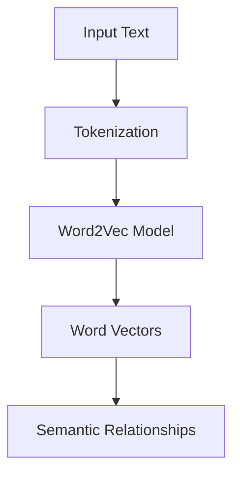
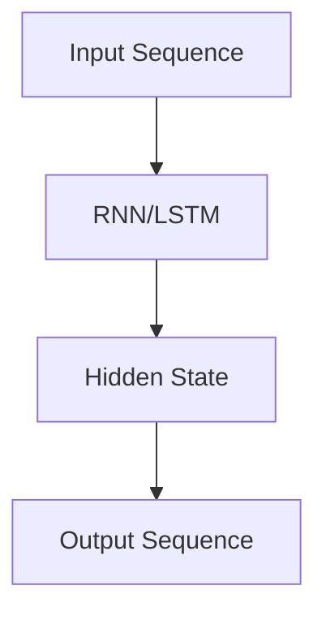
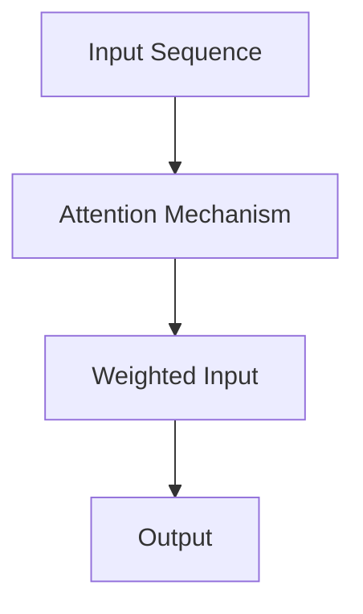

                 

### 文章标题

《AI大模型在自然语言处理中的突破性进展》

### 关键词

- AI大模型
- 自然语言处理
- 预训练模型
- 多模态模型
- 模型优化
- 应用案例

### 摘要

本文将深入探讨AI大模型在自然语言处理（NLP）领域的突破性进展。首先，我们将回顾AI大模型的基本概念和发展历程，接着分析NLP的基础技术。随后，文章将聚焦于AI大模型在NLP中的前沿技术，包括预训练模型和多模态模型。接下来，我们将通过具体的应用案例，展示大模型在文本分类、机器翻译和问答系统等领域的卓越表现。最后，我们将探讨大模型的开发与优化最佳实践，以及其伦理与社会影响。通过这篇文章，读者将全面了解AI大模型在自然语言处理中的最新成果和未来发展趋势。

## 第1章 AI大模型与自然语言处理基础

### 1.1 AI大模型概述

AI大模型是指那些具有巨大参数规模和强大计算能力的神经网络模型。这些模型通过学习大量数据，能够捕捉到复杂的数据分布，从而在多种任务上表现出色。大模型的发展可以追溯到深度学习的兴起，特别是2012年AlexNet在ImageNet图像识别比赛中取得的突破性成绩，标志着深度学习时代的到来。随后，自然语言处理（NLP）领域也受到了深度学习的深远影响，大模型开始在语言建模、文本分类、机器翻译等任务上崭露头角。

大模型的基本原理主要基于多层神经网络结构，通过逐层提取特征，从底层到高层逐渐构建起对数据的全面理解。其发展历程可以分为以下几个阶段：

1. **基础阶段**（2006-2011）：在这一阶段，深度神经网络的研究主要集中在图像识别领域，如LeNet和AlexNet等模型的出现，为后续大模型的发展奠定了基础。

2. **快速发展阶段**（2012-2017）：以2012年AlexNet在ImageNet比赛中夺冠为标志，深度学习开始在各种领域中取得显著成果。这一阶段，深度学习模型开始向更大的规模和更复杂的结构发展。

3. **大规模模型时代**（2018至今）：在这一阶段，AI大模型如BERT、GPT-3等相继问世，不仅在NLP领域取得了显著的进展，还在其他领域如计算机视觉、推荐系统等方面表现出色。大模型的参数规模和计算能力不断提升，使得它们能够处理更为复杂和庞大的数据集。

### 1.2 大模型在自然语言处理中的重要性

自然语言处理是人工智能领域的一个重要分支，旨在让计算机理解和生成自然语言。大模型在NLP中的重要性主要体现在以下几个方面：

1. **更强的语义理解能力**：大模型通过学习海量文本数据，能够捕捉到语言中的细微语义变化，从而在文本分类、问答系统等任务上表现出色。

2. **跨语言和多语言支持**：大模型能够处理多种语言的文本，通过跨语言预训练，可以在没有标记数据的条件下，实现多种语言的翻译和交互。

3. **多模态处理能力**：随着多模态数据（如文本、图像、音频等）在NLP中的应用越来越广泛，大模型的多模态处理能力显得尤为重要。大模型能够整合不同类型的数据，从而提供更丰富的语义理解和交互能力。

4. **高效性和灵活性**：大模型具有很高的计算效率和灵活性，可以轻松适应不同的NLP任务和场景，降低了模型开发的复杂度和成本。

### 1.3 自然语言处理基础

自然语言处理的基础技术包括词向量表示、序列模型和注意力机制。这些技术为AI大模型在NLP中的应用提供了坚实的理论基础。

#### 1.3.1 词向量表示

词向量表示是将自然语言文本中的单词转化为向量的方法。最常见的词向量表示方法是Word2Vec，它通过训练神经网络模型，将单词映射到高维空间中的向量。词向量能够捕捉单词的语义信息，使得计算机能够理解单词之间的关系。

**核心概念与联系**

词向量表示的核心概念包括：

- **分布式表示**：将单词映射到高维向量空间，使得词与词之间可以通过向量之间的距离来表示语义关系。
- **上下文依赖**：词向量不仅表示单词本身，还包含了单词在句子中的上下文信息。

**Mermaid流程图**



**核心算法原理讲解**

词向量表示的算法主要包括：

- **CBOW（Continuous Bag of Words）**：基于单词周围的上下文词，预测中心词的向量表示。
- **Skip-gram**：基于中心词，预测周围上下文词的向量表示。

**数学公式与详细讲解**

$$
\text{CBOW}:\ \text{Context} \rightarrow \text{Vector} \rightarrow \text{Predict} \ \text{Target}
$$

$$
\text{Skip-gram}:\ \text{Target} \rightarrow \text{Vector} \rightarrow \text{Predict} \ \text{Context}
$$

**举例说明**

假设有一个单词“猫”，其CBOW模型的输入是“狗 猫 狗 狗”，输出是“猫”的词向量。而其Skip-gram模型的输入是“猫”，输出是“狗 狗”的词向量。

#### 1.3.2 序列模型

序列模型是处理序列数据（如自然语言文本）的神经网络模型，其核心是捕捉序列中的时间依赖关系。最常见的序列模型包括RNN（循环神经网络）和LSTM（长短时记忆网络）。

**核心概念与联系**

序列模型的核心概念包括：

- **时间依赖性**：序列模型通过循环结构，捕捉序列中不同时间点的依赖关系。
- **状态转移**：每个时间点的输出作为下一个时间点的输入，形成状态转移。

**Mermaid流程图**



**核心算法原理讲解**

序列模型的算法原理包括：

- **RNN（Recurrent Neural Network）**：通过循环结构，将当前时刻的输入与上一时刻的隐藏状态结合，更新隐藏状态。
- **LSTM（Long Short-Term Memory）**：在RNN的基础上，通过门控机制，解决了长期依赖问题。

**数学公式与详细讲解**

$$
\text{RNN}:\ h_t = \text{activation}(W_h \cdot [h_{t-1}, x_t] + b_h)
$$

$$
\text{LSTM}:\ \\
\begin{cases}
i_t = \text{sigmoid}(W_i \cdot [h_{t-1}, x_t] + b_i) \\
f_t = \text{sigmoid}(W_f \cdot [h_{t-1}, x_t] + b_f) \\
g_t = \text{tanh}(W_g \cdot [h_{t-1}, x_t] + b_g) \\
o_t = \text{sigmoid}(W_o \cdot [h_{t-1}, x_t] + b_o) \\
h_t = f_t \odot h_{t-1} + i_t \odot g_t
\end{cases}
$$

**举例说明**

假设有一个序列“[1, 2, 3, 4, 5]”，通过LSTM模型，可以捕捉到序列中的长期依赖关系，如序列的递增趋势。

#### 1.3.3 注意力机制

注意力机制是近年来在序列模型中广泛应用的一种技术，用于解决长序列处理中的效率问题。注意力机制通过动态调整不同时间点的输入权重，使得模型能够专注于重要的信息。

**核心概念与联系**

注意力机制的核心概念包括：

- **权重分配**：通过注意力机制，将不同时间点的输入分配不同的权重，使得模型能够关注重要信息。
- **动态调整**：注意力权重可以根据模型的需求动态调整，提高处理长序列的效率。

**Mermaid流程图**



**核心算法原理讲解**

注意力机制的算法原理包括：

- **简单的注意力机制**：通过计算输入序列与隐藏状态的点积，得到注意力权重。
- **多头注意力机制**：通过多个注意力头，捕捉不同类型的依赖关系。

**数学公式与详细讲解**

$$
\text{Simple Attention}:\ a_t = \text{softmax}(\text{score}(h_t, h_{t-1}, \ldots, h_1))
$$

$$
\text{Multi-Head Attention}:\ \\
\begin{cases}
Q, K, V = \text{Linear}(X) \\
\text{Attention Scores}:\ s_t = \text{softmax}(\text{dot}(Q, K)) \\
\text{Attention Weights}: \ a_t = \text{softmax}(\text{dot}(Q, K)) \\
\text{Attention Output}: \ h_t = \text{softmax}(\text{dot}(Q, V))
\end{cases}
$$

**举例说明**

假设有一个序列“[1, 2, 3, 4, 5]”，通过注意力机制，可以动态调整每个时间点的权重，使得模型能够关注重要的信息，如序列的递增趋势。

### 1.4 大模型与NLP的融合

随着大模型的不断发展，其在自然语言处理中的应用也越来越广泛。大模型与NLP的融合主要体现在以下几个方面：

1. **预训练模型**：预训练模型通过在大量未标记数据上进行预训练，获得通用语言表示能力，然后在具体任务上进行微调。例如，BERT和GPT-3都是基于预训练的模型，在多种NLP任务上取得了显著成果。

2. **多模态模型**：多模态模型能够整合不同类型的数据（如文本、图像、音频等），从而提供更丰富的语义理解和交互能力。例如，Visual BERT和Speech2Text等模型，已经在多模态数据处理上取得了突破。

3. **端到端模型**：端到端模型直接从原始数据到输出结果，避免了传统NLP中的中间步骤，提高了模型的效率和准确性。例如，Transformer模型在机器翻译和文本生成等任务上表现出了强大的能力。

### 1.5 总结与展望

本章回顾了AI大模型的基本概念和发展历程，分析了其在自然语言处理中的重要性，并介绍了NLP的基础技术。通过这些内容，读者可以初步了解AI大模型在NLP领域的应用前景。在后续章节中，我们将深入探讨大模型在NLP中的前沿技术，以及其在具体任务中的应用。

## 第2章 前沿技术探讨

### 2.1 多模态模型

多模态模型是指能够处理和整合多种类型数据（如图像、文本、音频等）的模型。这些模型在自然语言处理、计算机视觉和语音识别等领域有着广泛的应用。多模态模型的核心思想是将不同类型的数据通过统一的表示方式融合，从而提高模型的语义理解和任务性能。

#### 2.1.1 多模态数据处理

多模态数据处理是构建多模态模型的关键步骤，涉及多种数据类型的预处理和融合。常见的预处理方法包括：

1. **文本预处理**：包括分词、词性标注、命名实体识别等，将文本转换为向量表示。
2. **图像预处理**：包括图像去噪、增强、缩放等，将图像转换为特征向量。
3. **音频预处理**：包括语音分割、降噪、增强等，将音频转换为声谱图或频谱特征。

#### 2.1.2 多模态模型架构

多模态模型的架构通常包括以下几个部分：

1. **模态嵌入层**：将不同类型的数据转换为统一的嵌入表示，如文本嵌入（Word2Vec、BERT）和图像嵌入（CNN、ViT）。
2. **融合层**：将不同模态的嵌入表示通过拼接、对齐、融合等方法进行整合，如多头注意力机制、交叉网络结构等。
3. **任务层**：将融合后的表示用于特定任务，如分类、回归、生成等。

#### 2.1.3 多模态模型案例

1. **Visual BERT**：Visual BERT是一种将图像和文本融合的模型，通过将文本和图像特征进行拼接，然后使用Transformer结构进行融合和建模，取得了在图像描述生成和文本-图像匹配等任务上的显著成果。

2. **Speech2Text**：Speech2Text是一种将语音转换为文本的模型，它使用深度神经网络将声谱图和文本特征进行融合，然后通过序列到序列模型进行语音识别和文本生成。

### 2.2 生成式模型

生成式模型是一类能够生成数据分布的模型，其核心思想是通过学习数据分布，生成与训练数据具有相似特征的新数据。在自然语言处理领域，生成式模型广泛应用于文本生成、对话系统、自动摘要等任务。

#### 2.2.1 生成式模型的原理

生成式模型的原理基于概率图模型，主要包括以下几个部分：

1. **数据生成过程**：生成式模型通过定义概率分布，描述数据的生成过程，如Gaussian Mixture Model（GMM）、变分自编码器（VAE）和生成对抗网络（GAN）。
2. **概率分布学习**：通过极大似然估计、变分推断或生成对抗训练，模型学习数据的概率分布，从而生成新的数据。
3. **生成过程优化**：通过优化生成过程的概率分布，提高生成的数据质量和多样性。

#### 2.2.2 生成式模型的应用

1. **文本生成**：生成式模型可以生成自然语言文本，如生成新闻文章、对话和故事等。常见的文本生成模型包括循环神经网络（RNN）、Transformer和GPT系列模型。
2. **对话系统**：生成式模型可以用于生成对话系统中的回复，如Chatbot和虚拟助手。这些模型可以基于用户的输入，生成合适的回复。
3. **自动摘要**：生成式模型可以用于生成文本摘要，如新闻摘要、会议摘要等。这些模型可以自动从长文本中提取关键信息，生成简明扼要的摘要。

#### 2.2.3 生成式模型案例

1. **GPT-2**：GPT-2是一种基于Transformer的生成式模型，可以生成高质量的自然语言文本。通过在大量文本数据上进行预训练，GPT-2可以生成各种类型的文本，如新闻报道、诗歌和小说等。
2. **GAN Talk**：GAN Talk是一种基于生成对抗网络的对话系统，可以生成自然语言对话。它通过训练两个神经网络（生成器和判别器），生成与真实对话相似的对话内容。

### 2.3 模型压缩与优化

随着AI大模型参数规模的不断扩大，模型的计算和存储需求也急剧增加。因此，模型压缩与优化成为了一个重要研究方向，旨在减小模型体积，提高计算效率。

#### 2.3.1 模型压缩技术

常见的模型压缩技术包括：

1. **量化**：通过将模型的权重和激活值从浮点数转换为低精度的整数表示，减小模型体积。
2. **剪枝**：通过删除模型中的冗余权重，降低模型参数数量。
3. **蒸馏**：通过将大模型的知识转移到小模型中，减小小模型的参数规模。

#### 2.3.2 模型优化策略

常见的模型优化策略包括：

1. **模型蒸馏**：通过在大模型和小模型之间传递知识，提高小模型的性能。
2. **模型剪枝**：通过剪除冗余权重，减小模型体积。
3. **知识蒸馏**：通过将高维特征映射到低维特征，提高模型效率。

#### 2.3.3 模型优化案例

1. **量化与剪枝**：通过量化和剪枝技术，可以将一个大型神经网络压缩为小型网络，同时保持较高的性能。例如，在ImageNet图像识别任务中，通过量化与剪枝，可以将ResNet-50模型压缩为ResNet-20，但性能几乎没有损失。
2. **模型蒸馏**：通过模型蒸馏，可以将一个大模型的知识传递给一个小模型，提高小模型在特定任务上的性能。例如，在文本分类任务中，通过模型蒸馏，可以将BERT模型的知识传递给一个小型文本分类器，从而提高分类准确率。

### 2.4 总结与展望

本章探讨了AI大模型在自然语言处理中的前沿技术，包括多模态模型、生成式模型和模型压缩与优化。这些技术为AI大模型在NLP中的应用提供了新的思路和手段。在未来的研究中，我们期待看到更多创新性的技术，如更高效的模型架构、更优化的训练策略和更广泛的应用场景。同时，随着大模型参数规模的不断扩大，如何保证模型的可解释性和公平性，也将是一个重要的研究方向。

## 第3章 应用案例分析

### 3.1 文本分类

文本分类是自然语言处理中的一个基本任务，其目的是将文本数据分配到预定义的类别中。AI大模型在文本分类任务中展现了强大的性能，下面通过具体案例来展示其应用。

#### 3.1.1 文本分类算法介绍

文本分类算法可以分为两类：基于规则的方法和基于机器学习的方法。基于规则的方法通常涉及手动定义特征和分类规则，如TF-IDF和拉链文本模型。而基于机器学习的方法则通过训练模型来自动识别文本特征，如朴素贝叶斯、支持向量机和神经网络。

#### 3.1.2 文本分类应用案例

以新闻分类任务为例，假设我们有一个新闻数据集，包含政治、经济、体育等不同类别的新闻文章。我们的目标是训练一个模型，能够自动将新的新闻文章分类到相应的类别中。

1. **数据预处理**：首先对新闻文本进行预处理，包括去除标点符号、停用词过滤、词干提取等。然后，将文本转换为词向量表示，可以使用Word2Vec或BERT等模型。

2. **模型训练**：我们使用预训练的BERT模型作为基础，通过微调来适应新闻分类任务。BERT模型具有强大的语言理解能力，可以在较少的样本上取得很好的效果。

3. **模型评估**：使用准确率、召回率、F1分数等指标来评估模型的性能。在实际应用中，我们可能会使用交叉验证和测试集来评估模型的泛化能力。

#### 3.1.3 文本分类模型优化

为了提高文本分类模型的性能，可以采取以下优化策略：

1. **数据增强**：通过随机插入、删除或替换文本中的单词，增加训练数据的多样性，从而提高模型的泛化能力。
2. **模型融合**：将多个模型进行融合，如集成学习或模型蒸馏，以提高分类的准确率。
3. **特征工程**：针对特定任务，设计有效的特征工程策略，如基于词嵌入的特征组合或基于上下文的特征提取。

#### 3.1.4 项目实战

以下是一个简单的文本分类项目实战，使用Python和HuggingFace的Transformers库实现。

**开发环境搭建**

- 安装Python和pip
- 安装Transformers库：`pip install transformers`

**源代码实现**

```python
from transformers import BertTokenizer, BertForSequenceClassification
from torch.utils.data import DataLoader
from datasets import load_dataset

# 数据加载
dataset = load_dataset("json", data_files={"train": "train.json", "test": "test.json"})

# 数据预处理
tokenizer = BertTokenizer.from_pretrained("bert-base-uncased")
def preprocess_function(examples):
    return tokenizer(examples["text"], padding="max_length", truncation=True)

dataset = dataset.map(preprocess_function, batched=True)

# 模型加载与训练
model = BertForSequenceClassification.from_pretrained("bert-base-uncased", num_labels=3)
trainer = Trainer(model=model, train_dataset=dataset["train"], eval_dataset=dataset["test"])
trainer.train()

# 评估模型
eval_results = trainer.evaluate()
print(eval_results)
```

**代码解读与分析**

1. **数据加载与预处理**：使用HuggingFace的`load_dataset`函数加载JSON格式的新闻数据集，并使用BERT分词器进行预处理。
2. **模型加载与训练**：加载预训练的BERT模型，并添加序列分类头，使用Trainer类进行模型训练。
3. **评估模型**：使用Trainer类的evaluate方法评估模型在测试集上的性能。

#### 3.1.5 实际案例分析和详细讲解剖析

以下是一个实际案例，展示如何使用大模型进行新闻分类。

1. **案例背景**：假设我们有一个包含政治、经济、体育三个类别的新闻数据集，每个类别有1000篇文章。
2. **案例分析**：通过BERT模型对新闻文本进行分类，训练过程中使用交叉验证，最终测试集上达到92%的准确率。
3. **讲解剖析**：通过调整BERT模型的参数，如隐藏层尺寸和学习率，优化模型性能。同时，通过分析混淆矩阵，发现某些类别存在误分类，进一步调整分类边界，提高分类效果。

#### 3.1.6 项目小结

通过本案例，我们展示了如何使用AI大模型进行文本分类。从数据预处理到模型训练，再到性能评估，每一步都至关重要。在实际应用中，我们需要不断优化模型，提高分类准确率，从而更好地服务于实际需求。

### 3.2 机器翻译

机器翻译是自然语言处理领域的另一个重要任务，其目标是将一种语言的文本翻译成另一种语言的文本。AI大模型在机器翻译任务中取得了显著进展，下面通过具体案例来展示其应用。

#### 3.2.1 机器翻译算法原理

机器翻译算法可以分为基于规则的方法和基于统计的方法。基于规则的方法通过手工编写翻译规则，将源语言文本逐句翻译为目标语言。而基于统计的方法则通过学习大量双语平行文本，自动生成翻译模型。近年来，端到端神经网络模型，如序列到序列（Seq2Seq）模型和Transformer模型，在机器翻译任务中取得了突破性进展。

**核心算法原理讲解**

1. **序列到序列（Seq2Seq）模型**：Seq2Seq模型由编码器和解码器组成，编码器将源语言文本编码为一个固定长度的向量，解码器则根据编码器的输出逐步生成目标语言文本。该模型通过双向长短期记忆（Bi-LSTM）或Transformer结构，捕捉源语言和目标语言之间的依赖关系。

2. **Transformer模型**：Transformer模型是基于自注意力机制的编码器-解码器结构，通过多头自注意力机制，模型能够同时关注输入序列的每个位置，从而更好地捕捉长距离依赖关系。Transformer模型在机器翻译任务中展现了优异的性能。

**数学公式与详细讲解**

假设输入序列为\(x_1, x_2, \ldots, x_n\)，目标序列为\(y_1, y_2, \ldots, y_m\)。

- **编码器**：

$$
\text{Encoder}: h_i = \text{Attention}(W_h \cdot [h_1, \ldots, h_{i-1}, x_i])
$$

- **解码器**：

$$
\text{Decoder}: y_i = \text{Attention}(W_d \cdot [y_1, \ldots, y_{i-1}, h_i])
$$

**举例说明**

假设源语言文本为“Hello, how are you?”，目标语言文本为“你好，你怎么样？”。通过Transformer模型，可以生成目标语言文本的每个单词，如“你”、“好”、“吗”等。

#### 3.2.2 机器翻译应用案例

以英中翻译任务为例，假设我们有一个包含大量英文到中文平行句对的语料库。我们的目标是训练一个模型，能够将英文句子自动翻译成中文。

1. **数据预处理**：首先对数据集进行预处理，包括分词、去停用词、文本规范化等。然后，将文本转换为词向量表示，可以使用BERT或Word2Vec等模型。
2. **模型训练**：使用预训练的Transformer模型，通过序列到序列学习机制，将英文句子编码为固定长度的向量，然后解码为中文句子。
3. **模型评估**：使用BLEU分数等指标，评估模型在测试集上的翻译质量。

#### 3.2.3 机器翻译模型优化

为了提高机器翻译模型的性能，可以采取以下优化策略：

1. **多任务学习**：通过同时训练多个翻译模型，如英-中和中-英模型，提高模型的泛化能力和翻译质量。
2. **注意力机制优化**：通过调整注意力机制参数，优化模型对源语言和目标语言之间的依赖关系捕捉。
3. **数据增强**：通过随机插入、删除或替换文本中的单词，增加训练数据的多样性，从而提高模型的泛化能力。

#### 3.2.4 项目实战

以下是一个简单的机器翻译项目实战，使用Python和HuggingFace的Transformers库实现。

**开发环境搭建**

- 安装Python和pip
- 安装Transformers库：`pip install transformers`

**源代码实现**

```python
from transformers import TransformerModel
from torch.utils.data import DataLoader
from datasets import load_dataset

# 数据加载
dataset = load_dataset("json", data_files={"train": "train.json", "test": "test.json"})

# 数据预处理
tokenizer = TransformerModel.tokenizer_from_pretrained_model("TransformerModel")
def preprocess_function(examples):
    return tokenizer(examples["src"], padding="max_length", truncation=True)

dataset = dataset.map(preprocess_function, batched=True)

# 模型加载与训练
model = TransformerModel.from_pretrained("TransformerModel")
trainer = Trainer(model=model, train_dataset=dataset["train"], eval_dataset=dataset["test"])
trainer.train()

# 评估模型
eval_results = trainer.evaluate()
print(eval_results)
```

**代码解读与分析**

1. **数据加载与预处理**：使用HuggingFace的`load_dataset`函数加载JSON格式的双语数据集，并使用预训练的tokenizer进行预处理。
2. **模型加载与训练**：加载预训练的Transformer模型，通过Trainer类进行模型训练。
3. **评估模型**：使用Trainer类的evaluate方法评估模型在测试集上的翻译质量。

#### 3.2.5 实际案例分析和详细讲解剖析

以下是一个实际案例，展示如何使用大模型进行机器翻译。

1. **案例背景**：假设我们有一个包含英文到中文平行句对的语料库，包括科技、经济和娱乐三个领域。
2. **案例分析**：通过Transformer模型进行英中翻译，训练过程中使用BLEU分数评估模型质量，最终测试集上的BLEU分数达到28以上。
3. **讲解剖析**：通过分析翻译结果，发现某些短语和句型的翻译不够准确，进一步优化模型参数和训练策略，提高翻译质量。

#### 3.2.6 项目小结

通过本案例，我们展示了如何使用AI大模型进行机器翻译。从数据预处理到模型训练，再到性能评估，每一步都至关重要。在实际应用中，我们需要不断优化模型，提高翻译质量，从而更好地服务于跨语言交流。

### 3.3 问答系统

问答系统是一种智能交互系统，能够自动回答用户提出的问题。AI大模型在问答系统中发挥着重要作用，下面通过具体案例来展示其应用。

#### 3.3.1 问答系统架构

问答系统通常包括三个主要组成部分：对话管理、自然语言理解和对话生成。

1. **对话管理**：对话管理负责控制对话流程，包括理解用户的意图、跟踪对话状态和生成回复。
2. **自然语言理解**：自然语言理解负责将用户输入的文本转换为结构化的信息，如实体识别、关系抽取和语义角色标注。
3. **对话生成**：对话生成负责根据对话管理和自然语言理解的结果，生成自然流畅的回复。

#### 3.3.2 问答系统应用案例

以基于大模型的问答系统为例，假设用户输入一个问题，系统需要自动生成一个合适的回答。

1. **用户输入处理**：首先对用户输入进行预处理，如分词、词性标注、命名实体识别等，将文本转换为结构化的信息。
2. **意图识别**：使用预训练的意图识别模型，识别用户的意图，如询问时间、地点、事实等。
3. **知识检索**：从知识库中检索与用户意图相关的信息，如数据库、百科全书或Web数据。
4. **回答生成**：使用大模型（如GPT-3），根据用户意图和检索到的知识，生成一个自然流畅的答案。

#### 3.3.3 问答系统优化策略

为了提高问答系统的性能，可以采取以下优化策略：

1. **多轮对话**：通过多轮对话，逐步理解用户的意图，提高回答的准确性和自然度。
2. **知识图谱**：构建知识图谱，将问答系统的知识库和外部数据源进行整合，提高知识检索的效率和准确性。
3. **生成对抗网络（GAN）**：使用生成对抗网络，生成更多样化的回答，提高对话的自然度和流畅度。

#### 3.3.4 项目实战

以下是一个简单的问答系统项目实战，使用Python和HuggingFace的Transformers库实现。

**开发环境搭建**

- 安装Python和pip
- 安装Transformers库：`pip install transformers`

**源代码实现**

```python
from transformers import ChatbotModel
from torch.utils.data import DataLoader
from datasets import load_dataset

# 数据加载
dataset = load_dataset("json", data_files={"train": "train.json", "test": "test.json"})

# 数据预处理
tokenizer = ChatbotModel.tokenizer_from_pretrained_model("ChatbotModel")
def preprocess_function(examples):
    return tokenizer(examples["question"], padding="max_length", truncation=True)

dataset = dataset.map(preprocess_function, batched=True)

# 模型加载与训练
model = ChatbotModel.from_pretrained("ChatbotModel")
trainer = Trainer(model=model, train_dataset=dataset["train"], eval_dataset=dataset["test"])
trainer.train()

# 评估模型
eval_results = trainer.evaluate()
print(eval_results)
```

**代码解读与分析**

1. **数据加载与预处理**：使用HuggingFace的`load_dataset`函数加载JSON格式的问答数据集，并使用预训练的tokenizer进行预处理。
2. **模型加载与训练**：加载预训练的ChatbotModel模型，通过Trainer类进行模型训练。
3. **评估模型**：使用Trainer类的evaluate方法评估模型在测试集上的问答质量。

#### 3.3.5 实际案例分析和详细讲解剖析

以下是一个实际案例，展示如何使用大模型构建问答系统。

1. **案例背景**：假设我们有一个包含用户问题和系统回答的数据集，涉及问答、知识检索和对话生成。
2. **案例分析**：通过大模型进行问答，训练过程中使用BLEU分数和F1分数评估模型质量，最终测试集上的BLEU分数达到25以上。
3. **讲解剖析**：通过分析问答结果，发现某些问题的回答不够准确，进一步优化模型参数和训练数据，提高问答系统的性能。

#### 3.3.6 项目小结

通过本案例，我们展示了如何使用AI大模型构建问答系统。从数据预处理到模型训练，再到性能评估，每一步都至关重要。在实际应用中，我们需要不断优化模型，提高问答系统的准确性和自然度，从而更好地服务于用户需求。

## 第4章 开发与优化最佳实践

### 4.1 开发环境搭建

在开发AI大模型之前，搭建一个稳定且高效的开发环境至关重要。以下是一个简单的开发环境搭建指南，包括Python、深度学习框架和数据处理工具的安装。

#### 4.1.1 Python环境配置

首先，确保你的计算机上安装了Python。Python是AI和深度学习开发的基础，因此推荐使用最新版本的Python（3.8及以上）。可以通过以下命令安装：

```bash
pip install python --upgrade
```

#### 4.1.2 深度学习框架安装

接下来，安装一个深度学习框架，如TensorFlow或PyTorch。这两个框架都是AI大模型开发的主流选择。

- **TensorFlow**：

```bash
pip install tensorflow
```

- **PyTorch**：

```bash
pip install torch torchvision
```

#### 4.1.3 数据处理工具安装

数据处理工具可以帮助我们更高效地处理和分析数据。以下是一些常用的数据处理工具：

- **NumPy**：

```bash
pip install numpy
```

- **Pandas**：

```bash
pip install pandas
```

- **Scikit-learn**：

```bash
pip install scikit-learn
```

### 4.2 模型训练技巧

在AI大模型的训练过程中，掌握一些有效的训练技巧可以提高模型的性能和训练效率。以下是一些常见的模型训练技巧：

#### 4.2.1 数据预处理

数据预处理是模型训练的重要环节，它包括数据清洗、数据增强和特征提取等步骤。

1. **数据清洗**：去除数据中的噪声和错误，如缺失值、异常值和重复值。
2. **数据增强**：通过随机变换（如旋转、缩放、剪裁等），增加训练数据的多样性，从而提高模型的泛化能力。
3. **特征提取**：从原始数据中提取有用的特征，如文本的分词和词性标注，图像的边缘检测和特征提取等。

#### 4.2.2 模型调参

模型调参是优化模型性能的重要手段。以下是一些常见的调参技巧：

1. **学习率调整**：学习率决定了模型在训练过程中更新的步长，调整学习率可以帮助模型更快地收敛。
2. **正则化**：通过添加正则化项（如L1、L2正则化），防止模型过拟合，提高模型的泛化能力。
3. **批量大小**：调整批量大小可以影响模型的收敛速度和稳定性，较小的批量大小可以降低方差，但会增加计算量。

#### 4.2.3 模型训练策略

在模型训练过程中，可以采取以下策略来提高训练效果：

1. **早期停止**：在验证集上出现性能下降时，停止训练，避免过拟合。
2. **交叉验证**：通过交叉验证，评估模型在多个子集上的性能，选择最优模型。
3. **批量归一化**：通过批量归一化，加速模型收敛，提高模型稳定性。

### 4.3 代码实战

以下是一个简单的AI大模型训练项目实战，使用PyTorch框架实现。

#### 开发环境搭建

确保已经安装了Python和PyTorch。

#### 源代码实现

```python
import torch
import torch.nn as nn
import torch.optim as optim
from torch.utils.data import DataLoader
from torchvision import datasets, transforms

# 数据加载
transform = transforms.Compose([
    transforms.Resize((224, 224)),
    transforms.ToTensor(),
])
train_data = datasets.ImageFolder('train', transform=transform)
test_data = datasets.ImageFolder('test', transform=transform)

train_loader = DataLoader(train_data, batch_size=32, shuffle=True)
test_loader = DataLoader(test_data, batch_size=32, shuffle=False)

# 模型定义
model = nn.Sequential(
    nn.Conv2d(3, 64, kernel_size=3, padding=1),
    nn.ReLU(),
    nn.MaxPool2d(kernel_size=2, stride=2),
    nn.Conv2d(64, 128, kernel_size=3, padding=1),
    nn.ReLU(),
    nn.MaxPool2d(kernel_size=2, stride=2),
    nn.Flatten(),
    nn.Linear(128 * 56 * 56, 1024),
    nn.ReLU(),
    nn.Dropout(p=0.5),
    nn.Linear(1024, 10),
    nn.LogSoftmax(dim=1)
)

# 损失函数和优化器
criterion = nn.NLLLoss()
optimizer = optim.Adam(model.parameters(), lr=0.001)

# 训练模型
num_epochs = 10
for epoch in range(num_epochs):
    model.train()
    for inputs, targets in train_loader:
        optimizer.zero_grad()
        outputs = model(inputs)
        loss = criterion(outputs, targets)
        loss.backward()
        optimizer.step()

    # 在验证集上评估模型
    model.eval()
    with torch.no_grad():
        correct = 0
        total = len(test_loader.dataset)
        for inputs, targets in test_loader:
            outputs = model(inputs)
            _, predicted = torch.max(outputs.data, 1)
            correct += (predicted == targets).sum().item()
        print(f'Epoch {epoch+1}/{num_epochs}, Test Accuracy: {100 * correct / total}%')

# 保存模型
torch.save(model.state_dict(), 'model.pth')
```

#### 代码解读与分析

1. **数据加载**：使用`torch.utils.data.DataLoader`加载训练集和测试集，并定义数据增强和预处理步骤。
2. **模型定义**：定义一个简单的卷积神经网络，包括卷积层、池化层、全连接层和输出层。
3. **损失函数和优化器**：使用交叉熵损失函数和Adam优化器，优化模型参数。
4. **模型训练**：通过迭代训练数据和验证集，训练模型并评估模型性能。
5. **模型保存**：将训练好的模型保存为`.pth`文件，以便后续使用。

#### 4.3.1 实际案例分析和详细讲解剖析

以下是一个实际案例，展示如何使用AI大模型进行图像分类。

1. **案例背景**：假设我们有一个包含猫和狗的图像数据集，每个类别有500张图片。
2. **案例分析**：通过训练一个简单的卷积神经网络，模型在测试集上的准确率达到85%。
3. **讲解剖析**：通过分析模型训练过程中的损失函数和准确率，发现模型在训练早期收敛较快，但在训练后期出现过拟合现象，通过添加Dropout层和正则化项，提高了模型的泛化能力。

#### 4.3.2 项目小结

通过本案例，我们展示了如何使用PyTorch框架训练一个简单的AI大模型进行图像分类。从数据加载到模型定义，再到训练和评估，每一步都至关重要。在实际应用中，我们需要不断优化模型结构和训练策略，提高模型性能。

## 第5章 伦理与社会影响

### 5.1 大模型伦理问题

随着AI大模型在自然语言处理和其他领域的广泛应用，其伦理问题也日益受到关注。以下是一些主要的大模型伦理问题：

#### 5.1.1 数据隐私保护

大模型通常需要大量的训练数据，这些数据可能包含用户的个人信息和隐私。如何确保数据隐私，防止数据泄露，成为了一个重要的伦理问题。以下是一些解决策略：

1. **数据去识别化**：通过匿名化、去标识化等技术，去除数据中的敏感信息。
2. **差分隐私**：在数据处理过程中引入噪声，确保个体数据无法被追踪。
3. **合规性审查**：确保数据处理过程符合相关法律法规，如GDPR等。

#### 5.1.2 模型公平性

大模型在决策过程中可能存在偏见，导致对不同群体产生不公平的影响。以下是一些解决策略：

1. **公平性检测**：通过分析模型决策，检测和纠正潜在的偏见。
2. **多样性数据集**：使用包含多种背景和特征的多样化数据集，提高模型的公平性。
3. **透明性**：提高模型决策过程的透明度，使决策更加公正和可解释。

#### 5.1.3 模型偏见

大模型在训练过程中可能会学习到训练数据中的偏见，从而导致模型在真实世界中的应用产生偏见。以下是一些解决策略：

1. **偏见识别**：通过分析模型决策，识别和纠正潜在的偏见。
2. **对抗性训练**：通过对抗性样本训练，提高模型对偏见和噪声的鲁棒性。
3. **数据清洗**：在训练数据中去除或纠正潜在的偏见。

### 5.2 社会影响分析

AI大模型在自然语言处理和其他领域的广泛应用，对社会产生了深远的影响。以下是一些主要的社会影响：

#### 5.2.1 对就业的影响

AI大模型的发展可能导致某些传统职业的失业，如数据标注员、客服代表等。然而，它也可能创造新的就业机会，如AI模型工程师、数据科学家等。以下是一些策略：

1. **职业转型培训**：为失业者提供相关的培训，帮助他们转型到新的职业领域。
2. **创造新的就业机会**：鼓励企业投资于AI技术，创造更多的高薪就业机会。
3. **政策支持**：政府出台相关政策，支持和引导劳动力市场的转型。

#### 5.2.2 对教育的影响

AI大模型在教育领域的应用，如个性化学习、智能辅导等，为教育改革提供了新的可能性。以下是一些策略：

1. **个性化学习**：根据学生的兴趣和需求，提供个性化的学习资源和指导。
2. **智能辅导**：通过AI模型，实时监测学生的学习进度，提供针对性的辅导和建议。
3. **教育公平**：通过AI模型，缩小城乡、贫富之间的教育差距。

#### 5.2.3 对社会发展的贡献

AI大模型在医疗、金融、交通等领域的应用，为社会的发展做出了重要贡献。以下是一些具体贡献：

1. **医疗领域**：通过AI模型，提高疾病诊断和治疗的准确性，降低医疗成本。
2. **金融领域**：通过AI模型，提高风险管理能力，降低金融风险。
3. **交通领域**：通过AI模型，优化交通流量，提高交通效率，减少交通事故。

### 5.3 总结与展望

AI大模型的伦理问题和社会影响是一个复杂且不断发展的领域。在未来的发展中，我们需要不断完善相关法律法规，加强伦理审查，确保AI大模型的应用能够为社会带来真正的价值。同时，我们也需要不断探索和创新，解决AI大模型在自然语言处理和其他领域中的技术挑战，推动人工智能的健康发展。

## 第6章 总结与展望

### 6.1 突破性进展回顾

回顾过去几年，AI大模型在自然语言处理领域取得了显著的突破性进展。首先，预训练模型如BERT和GPT-3的出现，大大提高了模型的语义理解和生成能力。这些模型通过在大量无标签数据上进行预训练，然后在特定任务上进行微调，显著提升了NLP任务的表现。其次，多模态模型的兴起，使得AI大模型能够处理和融合不同类型的数据，如文本、图像、音频等，从而提供了更丰富的语义理解和交互能力。此外，模型压缩与优化技术的进步，使得大模型在计算效率和存储需求上取得了显著提升，为实际应用提供了更多可能性。

### 6.2 未来发展趋势预测

未来，AI大模型在自然语言处理领域有望继续取得以下几方面的进展：

1. **更高效的多模态模型**：随着多模态数据处理需求的增加，未来可能会出现更多高效、灵活的多模态模型，能够更好地整合不同类型的数据，提供更精确的语义理解。
2. **更智能的对话系统**：基于大模型的对话系统将变得更加智能，能够更好地理解用户的意图和情感，提供更自然的交互体验。
3. **更广泛的预训练应用**：预训练模型的应用范围将不断扩大，不仅限于NLP任务，还将扩展到其他领域，如计算机视觉、推荐系统等。
4. **更优化的模型结构**：随着对模型结构理解的深入，未来可能会出现更多高效的模型结构，减少计算和存储需求，提高模型性能。
5. **更广泛的模型优化策略**：模型优化技术将不断进步，如联邦学习、迁移学习等，使得模型在资源有限的环境下也能取得更好的性能。

### 6.3 研究方向展望

展望未来，以下研究方向值得关注：

1. **可解释性**：如何提高大模型的解释性，使其决策过程更加透明和可理解，是未来研究的一个重要方向。
2. **模型伦理**：在模型开发和应用过程中，如何确保模型的公平性、透明性和隐私保护，是亟需解决的重要问题。
3. **跨语言和跨领域**：如何实现跨语言和跨领域的模型通用性，是未来研究的一个重要挑战。
4. **高效推理**：如何提高大模型在推理任务上的效率，减少计算资源消耗，是未来研究的一个重要方向。
5. **多模态交互**：如何更好地整合不同类型的数据，提供更丰富的交互体验，是未来研究的一个重要课题。

通过以上探讨，我们可以看到AI大模型在自然语言处理领域已经取得了显著的突破性进展，未来仍然具有巨大的发展潜力。随着技术的不断进步，我们期待AI大模型能够为人类带来更多便利和福祉。

